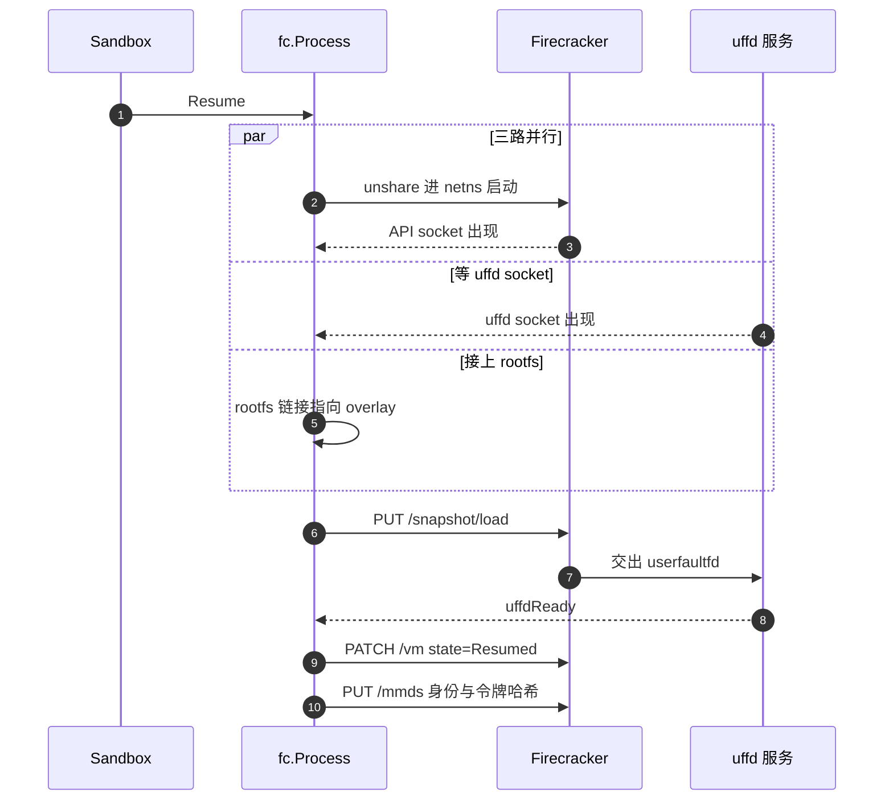

# 28 · Firecracker 进程管理

> orchestrator 不直接 exec 一个 Firecracker 二进制，而是先经过 `unshare -m`、一段 bash 脚本、
> 一层 tmpfs 符号链接、一次 `ip netns exec`，最后才轮到 VMM 本身。本篇讲这条链上每一环解决什么问题，
> 进程起来之后的 API 调用顺序为什么不能改，以及不用 jailer 换来了什么、付出了什么。
>
> **读者**：系统工程师。 **预备**：[第 03 篇 · Firecracker 入门](03-firecracker-primer.md)、
> [第 27 篇 · ResumeSandbox](27-resume-sandbox.md)。 **代码**：`packages/orchestrator/internal/sandbox/fc/`
> （`process.go`、`script_builder.go`、`client.go`、`kernel_args.go`、`mmds.go`、`config.go`、`memory.go`）、
> `internal/sandbox/socket/socket.go`、`internal/sandbox/cgroup/manager.go`

---

## 0. 本篇要回答的问题

1. 一个 VMM 进程要被放进什么样的上下文里才能承载沙箱？这四层上下文分别由谁提供？
2. 从快照恢复要求宿主侧路径固定，这个要求怎么在「每台沙箱的文件都不同」的前提下满足？
3. Firecracker API 的调用顺序是任意的吗？冷启动与恢复两条路径为什么调用集合不同？
4. 内核命令行上那十几个参数，每一个防的是什么、省的是什么？
5. MMDS 里放了哪四个字段，guest 侧怎么读，为什么必须在恢复的最后一步写？
6. 不用 jailer 的具体后果是什么？要补回来需要做什么？

---

## 1. 问题：把一个 VMM 放进正确的上下文

Firecracker 二进制本身只做一件事：按 API 的指令建 VM、跑 vCPU。它不负责把自己放进沙箱该在的位置。
一台沙箱要跑起来，进程外部至少需要四样东西：

1. **一个私有的 mount 视图。** 快照恢复时，Firecracker 会按快照里记下的宿主路径去打开 rootfs 文件。
   同一个模板恢复出的一百台沙箱，rootfs 文件各不相同，但路径必须一样。
2. **固定的路径。** 承接上一条 —— 需要一个「同名不同物」的机制。
3. **一个网络命名空间。** 沙箱的 tap 设备、IP、防火墙规则都在预分配的槽位里
   （[第 35 篇 §2](35-sandbox-networking.md#2-建立一个槽位createnetwork-的完整步骤)），Firecracker 必须在那个 netns 里才能打开 tap。
4. **一个 cgroup。** 用于按沙箱记账 CPU 与内存（[第 38 篇 §2](38-cgroups-and-host-stats.md#2-上游的-cgroup只记账不设限)）。

Firecracker 上游给的答案是配套的 `jailer` 二进制，它把这四件事（以及 chroot 与降权）一次做完。
上游 2026.09 不用 jailer，而是把四件事拆开、分别用 Linux 原语实现。第 7 节回来算这笔账，
前面几节先看拆开之后每一环长什么样。

## 2. 启动脚本：unshare、tmpfs 与符号链接

`fc/process.go` 的 `NewProcess()` 组装的命令是：

```go
cmd := exec.CommandContext(execCtx, "unshare", "-m", "--", "bash", "-c", startScript.Value)
cmd.SysProcAttr = &syscall.SysProcAttr{Setsid: true}
```

脚本内容由 `fc/script_builder.go` 的 `StartScriptBuilder.Build()` 用 `text/template` 渲染。
模板有两个版本，按模板产物的 `TemplateVersion` 选（`GenerateScript()`：`<= 1` 用 V1，否则 V2）。
V2 的全文只有五行：

```bash
mount --make-rprivate / &&
mount -t tmpfs tmpfs /fc-vm -o X-mount.mkdir &&
ln -s <HostRootfsPath> /fc-vm/rootfs.ext4 &&
mkdir -p /fc-vm/<KernelVersion> &&
ln -s <HostKernelPath> /fc-vm/<KernelVersion>/vmlinux.bin &&
ip netns exec ns-<slotIdx> /fc-versions/<FCVersion>/firecracker --api-sock /tmp/fc-<sbxID>-<rand>.sock
```

逐行看：

- `mount --make-rprivate /`：`unshare -m` 复制的是当前的挂载表，而挂载点的传播属性通常是 shared
  （systemd 宿主的默认）。不先改成 private，后面 tmpfs 的挂载会传播回宿主命名空间，
  一百台沙箱会在宿主上叠一百层 tmpfs。
- `mount -t tmpfs tmpfs /fc-vm -o X-mount.mkdir`：把 `SandboxDir`（`cfg.BuilderConfig.SandboxDir`，
  环境变量 `SANDBOX_DIR`，默认 `/fc-vm`）盖成一层空的 tmpfs。`X-mount.mkdir` 让挂载点不存在时自动创建。
  这一层只存在于该沙箱的 mount 命名空间里。
- 两条 `ln -s`：把这台沙箱真正要用的 rootfs 与内核**软链**进这层 tmpfs。链接目标是宿主真实路径，
  链接名对所有沙箱相同。

于是同一台宿主上的路径布局是这样的：

```text
宿主命名空间（真实文件，每台沙箱不同）
  /fc-kernels/<KernelVersion>/vmlinux.bin          ← 按内核版本共享，只读
  /fc-versions/<FCVersion>/firecracker             ← 按 FC 版本共享，只读
  <SandboxCacheDir>/rootfs-<sbxID>-<rand>.link     ← 每台沙箱一个符号链接
  /tmp/fc-<sbxID>-<rand>.sock                      ← 每台沙箱一个 API socket

沙箱私有 mount 命名空间（路径对所有沙箱相同）
  /fc-vm/                     (tmpfs)
  /fc-vm/rootfs.ext4       -> <SandboxCacheDir>/rootfs-<sbxID>-<rand>.link
  /fc-vm/<KernelVersion>/vmlinux.bin -> /fc-kernels/<KernelVersion>/vmlinux.bin
```

`Build()` 返回的 `StartScriptResult` 里的 `RootfsPath` 与 `KernelPath` 就是这两个**沙箱内**路径，
后面喂给 Firecracker API 的也是它们（`getRootfsPath()`、`getKernelPath()`）。
`fc/config.go` 里 `ConstantRootfsPaths` 的注释点明了 V2 的用意：版本号恒为 2，「for the constant
rootfs paths format change」。V1 的做法是把 tmpfs 挂在
`/mnt/disks/fc-envs/v1/<templateID>/builds/<buildID>` 上 —— 路径里带模板与构建 ID，
不同构建之间不通用；V2 把它压成了一个全局常量 `/fc-vm/rootfs.ext4`。
这个改动的直接收益是：一份快照记下的 drive 路径，在任何节点、任何沙箱上都能被解析成正确的文件。
代价是模板产物多了一个版本字段要兼容，两套模板要并存
（[第 29 篇 §7](29-template-artifact-format.md#7-两套版本字段)）。

### 2.1 rootfs 链接的两步走

`Create()` 与 `Resume()` 开头都有同一句：

```go
err := utils.SymlinkForce("/dev/null", p.files.SandboxCacheRootfsLinkPath(p.config.StorageConfig))
```

先把 `.link` 指向 `/dev/null`，等 rootfs provider 真正就绪后再 `SymlinkForce` 到实际的 overlay 路径。
注释写明了理由：这样 Firecracker 进程可以先起来，与 rootfs 的准备并行。
在 `Resume()` 里这一点被做实 —— 一个 `errgroup` 同时跑三件事：启动 FC 进程并等它的 API socket、
等 uffd socket 出现、取 rootfs 路径并重建符号链接。三件事都完成才进下一步。
注意这里多了一层间接：tmpfs 里的 `rootfs.ext4` 指向 `.link`，`.link` 再指向真实文件。
第一层是为了路径固定，第二层是为了可以在进程启动后改指向。

这一层间接在恢复路径上不是可选的，因为 **`Resume()` 从头到尾不重设 drive**：
`fc/process.go` 的 `Resume()` 只有 `loadSnapshot` → `resumeVM` → `setMmds` 三次 API 调用，
没有 `PUT /drives/rootfs`。快照的 vmstate 里记着的 drive 路径就是那个常量 `/fc-vm/rootfs.ext4`，
`LoadSnapshot` 照着它去打开文件。所以「让这台沙箱用上属于自己的那份 overlay」的唯一手段，
就是在 `loadSnapshot` 之前把 `.link` 改指向 —— 这也是三路并行的 `errgroup` 必须全部收敛
之后才能进 `loadSnapshot` 的原因。
`SymlinkForce()`（`packages/shared/pkg/utils/symlink.go`）本身是 `os.Remove` 加 `os.Symlink`，
不要求原链接已存在。**推论**：`/dev/null` 占位并不是切换所必需的，它的作用是让这条路径在两次赋值
之间指向一个可打开的空设备而不是一条悬空链接；代码注释给出的目的也只是「让 FC 进程能先起来」。

### 2.2 exec 链与 PID

命令行是 `unshare → bash → ip netns exec → firecracker` 四层，但 `Process.Pid()` 返回的是
`p.cmd.Process.Pid`，也就是 `unshare` 的 PID。这个 PID 被两处当作 **Firecracker 本身**的 PID 使用：

- `hoststats.go` 的 `initializeHostStatsCollector()` 把它交给 gopsutil，采样的是 FC 进程的 CPU 与 RSS；
- `fc/memory.go` 的 `ExportMemory()` 把它交给 `block.NewCacheFromProcessMemory()`，
  后者用 `process_vm_readv` 从这个 PID 的地址空间里读 guest 内存
  （`block/cache.go` 的 `copyProcessMemory()`）。

**推论**：这条链上每一环都是 exec 而不是 fork，PID 从头保持到尾，否则上面两处读到的都是错的进程。
`unshare` 不带 `--fork` 时直接 exec 后续程序；`bash -c` 在命令列表的最后一条上会做 exec 优化；
`ip netns exec` 在 setns 之后 exec 目标程序。同样的假设也支撑着关停路径：
`Stop()` 只给这一个 PID 发信号，如果中间有 fork，Firecracker 会被留成孤儿。

## 3. 进程的创建、观测与关停

`NewProcess()` 在组装命令之前先 `os.Stat` 两个文件：`versions.FirecrackerPath(config)` 与
`versions.HostKernelPath(config)`。二进制或内核缺失在这里就报错，而不是等 bash 脚本失败后
去猜一条退出码。真正的启动在 `configure()`：

```go
p.cmd.Stdout = io.MultiWriter(stdoutWriters...)   // zapio.Writer(InfoLevel) [+ 外部 writer]
p.cmd.Stderr = io.MultiWriter(stderrWriters...)   // zapio.Writer(ErrorLevel) [+ 外部 writer]
if cgroupFD != cgroup.NoCgroupFD {
    p.cmd.SysProcAttr.UseCgroupFD = true
    p.cmd.SysProcAttr.CgroupFD = cgroupFD
}
err := p.cmd.Start()
```

三件事值得单独说。

**日志采集。** stdout 与 stderr 各接一个 `zapio.Writer`，写进沙箱专用 logger
（`sbxlogger.I(sbxMetadata)`），级别分别是 Info 与 Error。模板构建路径还会额外接一个外部 writer
（`ProcessOptions.Stdout` / `Stderr`），把 provision 脚本的输出回显给用户
（`template/build/phases/base/provision.go`）。guest 内核日志要不要进这条流由内核参数决定，见第 5 节。

**cgroup 放置。** `cgroupFD` 来自 `sandbox.go` 的 `createCgroup()`，它是 cgroup 目录的一个打开的
文件描述符（`cgroup/manager.go` 的 `Create()` 里 `os.Open(cgroupPath)`）。
`UseCgroupFD` 让 Go 在 `clone3` 时带上 `CLONE_INTO_CGROUP`，内核在创建进程的那一刻就把它放进目标
cgroup —— 没有「先创建、再写 `cgroup.procs`」之间那个进程已在运行却尚未受限的窗口。
`cmd.Start()` 返回后 `sandbox.go` 立刻调 `cgroupHandle.ReleaseCgroupFD()` 关掉目录 FD；
`memory.peak` 的 FD 单独留着，供后续采样。要注意的是：`Create()`（模板构建的冷启动路径）
硬编码传 `cgroup.NoCgroupFD`，构建用的沙箱没有 cgroup 记账。
另外 `createCgroup()` 在建 cgroup 失败时只打一条 warn 并返回 `NoCgroupFD`，沙箱照常启动 ——
记账是尽力而为，不是启动的前置条件。

**进程寿命。** `exec.CommandContext` 拿到的是 `execCtx`，而 `sandbox.go` 的 `startExecutionSpan()`
里 `execCtx = context.WithoutCancel(ctx)`。也就是说，创建请求的 context 被取消不会连带杀掉
Firecracker；进程的结束只能走 `Stop()` 或它自己退出。

`cmd.Start()` 之后起一个 goroutine 等 `cmd.Wait()`，把结果写进 `p.Exit`（一个 `utils.ErrorOnce`）。
这里有一条语义约定：如果进程是被 SIGKILL 或 SIGTERM 杀死的，`Exit` 记的是 `nil`，
即「正常结束」—— 主动关停不算错误。其它退出情形记成错误，同时 `cancelStart(errMsg)` 取消
`startCtx`，让正在等 socket 的那一边立刻失败，而不是傻等。

**等 API socket。** `socket.Wait(startCtx, p.firecrackerSocketPath)`（`socket/socket.go`）是一个
每 10 ms 一次的 `os.Stat` 轮询，**上游没有自带超时**，唯一的退出条件是 context 被取消 ——
要么父 context 到期，要么 FC 进程先死。等待成功的判据是 socket 文件存在。
**推论**：文件存在与 `listen()` 完成之间存在一个窗口，此时连接会被拒绝；
后续 API 调用失败时的表现是连接错误而非超时。

**关停。** `Stop()` 的顺序是：先看 `p.Exit.Done()`，已退出就直接返回；
再 `context.WithoutCancel` 把 ctx 剥离（这个函数不允许因为上游 context 已取消而失败）；
然后调 `getProcessState()` —— 用 `ps -o stat= -p <pid>` 读进程状态，
专门为了识别 `D`（不可中断睡眠）并记一条日志，注释说明了动机：gopsutil 看不到 D 状态。
接着发 SIGTERM，起一个 goroutine 等 10 s，进程还在就 SIGKILL，并再读一次进程状态。
D 状态的两次记录构成了一条诊断线索：如果 FC 卡在对 uffd 或 NBD 后端的一次读上，
SIGTERM 和 SIGKILL 都不会立刻生效，日志里会留下证据
（[第 39 篇 §3](39-health-errors-and-teardown.md#3-退出路径矩阵)）。

## 4. API 调用顺序

`fc/client.go` 的 `apiClient` 是一个 OpenAPI 生成的客户端加一个 Unix socket transport
（`firecracker.NewUnixSocketTransport(socketPath, nil, false)`）。它对外只暴露十来个方法，
调用顺序被 `Create()` 与 `Resume()` 写死。两条路径的调用集合不同：

| 步骤 | 冷启动 `Create()` | 恢复 `Resume()` |
|---|---|---|
| 1 | 等 API socket | 等 API socket、等 uffd socket、重建 rootfs 链接（并行） |
| 2 | `PUT /boot-source`（内核路径 + 命令行） | `PUT /snapshot/load` |
| 3 | 重建 rootfs 链接，`PUT /drives/rootfs` | 等 uffd 就绪信号 |
| 4 | `PUT /network-interfaces/eth0` + `PUT /mmds/config` | `PATCH /vm` state=Resumed |
| 5 | `PUT /machine-config` | `PUT /mmds` |
| 6 | `PUT /entropy` | —— |
| 7 | `PUT /actions` InstanceStart | —— |

顺序的约束来自 Firecracker 自身：所有配置类端点只在 VM 未启动时可用，`InstanceStart` 之后就冻结。
恢复路径不需要重设 boot-source、drive、网卡与 machine-config —— 这些都在快照的 vmstate 里，
`LoadSnapshot` 一次全部恢复。`PUT /mmds/config`（版本与绑定网卡）同样在快照里，
所以恢复路径只写 `PUT /mmds` 的**内容**，不重设配置。



`loadSnapshot()` 的参数值得逐个看：`ResumeVM: false`（加载与恢复分成两步，中间要等 uffd 就绪）、
`EnableDiffSnapshots: false`（不用 Firecracker 自己的差分快照，脏页判定由别处做，
见[第 37 篇 §3](37-pause-and-snapshot.md#3-脏页判据)）、`MemBackend` 类型为 `Uffd` 且路径指向 uffd socket
（[第 31 篇 §2](31-uffd-memory-backend.md#2-握手从-socket-到就绪)）。加载返回后代码在 `uffdReady` 通道上阻塞，
确认 uffd 服务已经准备好应答缺页，才发 `PATCH /vm`。这个顺序不能反：先 resume 再等就绪，
第一批缺页会打在还没准备好的后端上。

`setMachineConfig()` 有三个固定值：`Smt: true`、`TrackDirtyPages: false`、
以及 `hugePages` 为真时 `HugePages: Nr2M`。`TrackDirtyPages` 关掉是因为 e2b 不走 Firecracker 的
脏页跟踪，改用分叉版本多出来的只读端点：`memoryMapping()`、`memoryInfo()`、`dirtyMemory()`
（`client.go` 末尾三个方法，对应 `GET /memory/mappings`、`GET /memory`、`GET /memory/dirty`）。
`memory.go` 的注释解释了 `memoryInfo()` 返回值的含义：`Dirty` 字段其实是 mincore 意义上的
**驻留页**，即被换入过的页；`Empty` 是驻留但全零的页。

`setEntropyDevice()` 给 virtio-rng 配了一个令牌桶：`entropyBytesSize = 1024` 字节、
`entropyRefillTime = 100`（ms）、`entropyOneTimeBurst = 0`（`fc/config.go`），
折算约 10 KiB/s。限流的目的是防止一台沙箱用熵设备消耗宿主的随机源
（代码注释指向 Firecracker 的 `docs/entropy.md`）。

## 5. 内核命令行逐项

`Create()` 里的 `KernelArgs` 是一个 `map[string]string`，`kernel_args.go` 的 `String()`
把它按键名排序后拼成一行 —— 顺序确定但与语义无关，只是为了输出可复现。

| 参数 | 值 | 作用 | 条件 |
|---|---|---|---|
| `quiet` | —— | 抑制内核启动日志；上游文档把日志开销列为启动延迟来源 | 开日志时删除 |
| `loglevel` | `1`（开日志时 `5`） | 控制台日志级别，`5` 是 KERN_NOTICE | 总是 |
| `init` | `ProcessOptions.InitScriptPath` | 指定 PID 1；provision 阶段是 busybox init，成品沙箱是 systemd | 总是 |
| `ip` | 见下 | 内核态配置 IPv4，省掉 guest 里跑 DHCP 的一轮往返 | 总是 |
| `ipv6.disable` | `0` | 不禁用 IPv6 | 总是 |
| `ipv6.autoconf` | `1` | 允许 IPv6 无状态自动配置 | 总是 |
| `panic` | `1` | panic 后等 1 秒重启，配合下一条即为退出 | 总是 |
| `reboot` | `k` | 用 keyboard 方式触发重启；在 Firecracker 里等价于让 VMM 退出 | 总是 |
| `pci` | `off` | Firecracker 没有 PCI 总线，跳过枚举 | 总是（上游） |
| `i8042.nokbd` | —— | 不探测 PS/2 键盘 | 总是（上游） |
| `i8042.noaux` | —— | 不探测 PS/2 辅助设备 | 总是（上游） |
| `random.trust_cpu` | `on` | 信任 RDRAND 做初始熵，避免 `getrandom` 在启动早期阻塞 | 总是（上游） |
| `clocksource` | `kvm-clock` | 用半虚拟化时钟，省掉 TSC 校准 | `ProcessOptions.KvmClock` |
| `systemd.journald.forward_to_console` | —— | 把 journald 转到控制台 | `SystemdToKernelLogs` |
| `console` | `ttyS0` | 内核日志走串口，被 FC 进程的 stdout 接住 | 开日志时 |

`ip=` 的值由 `fmt.Sprintf("%s::%s:%s:instance:%s:off:%s", ...)` 拼成，参数依次是
`slot.NamespaceIP()`、`slot.TapIPString()`、`slot.TapMaskString()`、`slot.VpeerName()`、`slot.TapName()`，
按 `network/slot.go` 里的常量展开是：

```text
ip=169.254.0.21::169.254.0.22:255.255.255.252:instance:eth0:off:tap0
    │            │             │               │        │    │   └ 内核 ip= 的 dns0 字段
    │            │             │               │        │    └ autoconf 关闭
    │            │             │               │        └ guest 网卡名
    │            │             │               └ hostname
    │            │             └ 掩码，/30
    │            └ 网关，即 netns 里的 tap 地址
    └ guest 自己的地址
```

**推论**：最后一个字段按内核 `ip=` 的格式定义是 `dns0`，这里被填成了 tap 设备名而不是一个 IP，
不构成合法 DNS 地址；沙箱内的 DNS 由 envd 与网络槽位另行配置，这个字段是无效的。

`KvmClock` 的开关来自调用方：模板 provision 阶段固定为 `true`
（`phases/base/provision.go`），成品层的构建则按 envd 版本判断
（`layer/create_sandbox.go` 里 `utils.IsGTEVersion(cs.config.Envd.Version, minEnvdVersionForKVMClock)`）——
旧版 envd 的镜像里不一定有对应支持，参数只对够新的版本开。

## 6. MMDS：沙箱身份的投递通道

`fc/mmds.go` 里的结构只有四个字段，源码注释明确警告序列化名不能改：

```go
type MmdsMetadata struct {
    SandboxID            string `json:"instanceID"`
    TemplateID           string `json:"envID"`
    LogsCollectorAddress string `json:"address"`
    AccessTokenHash      string `json:"accessTokenHash,omitempty"`
}
```

`Resume()` 在 `PATCH /vm` 之后填充它：`LogsCollectorAddress` 由
`p.config.NetworkConfig.OrchestratorInSandboxIPAddress` 拼成 `http://<addr>/logs`；
`AccessTokenHash` 是 `keys.HashAccessToken(*accessToken)`，令牌为空时哈希空串
—— 也就是说这个字段总有值，guest 侧不需要区分「没有令牌」与「字段缺失」。

guest 侧的读法在 `packages/envd/internal/host/mmds.go`。MMDS 配的是 V2，所以要两步：
先 `PUT http://169.254.169.254/latest/api/token` 带 `X-metadata-token-ttl-seconds: 60` 换一个 token，
再带 `X-metadata-token` 头 `GET /`。envd 有两个消费者：
`PollForMMDSOpts()` 每 50 ms 试一次直到成功，拿到后把 `E2B_SANDBOX_ID` 与 `E2B_TEMPLATE_ID`
写进环境变量表和 `/run/e2b/` 下的两个文件，再把日志收集地址送进日志导出器的 channel；
`GetAccessTokenHashFromMMDS()` 单独读令牌哈希，用来校验 `/init` 请求确实来自 orchestrator。

写 MMDS 必须是恢复流程的最后一步，理由是快照里带着**上一次**的 MMDS 内容：
沙箱 ID、执行 ID、访问令牌在每次恢复时都变，而 guest 里的 envd 一旦被 resume 就会开始轮询。
把写操作放在 `PATCH /vm` 之后有一个隐含的竞态：envd 有可能在新内容写入之前读到旧内容。
**推论**：`PollForMMDSOpts()` 的 50 ms 轮询间隔与「只有 `LogsCollectorAddress` 非空才发送」的条件
给了这个窗口一定容错，但 `AccessTokenHash` 的读取路径没有重试。

## 7. 为什么不用 jailer，以及后果

jailer 的完整职责是：`chroot` 到 `<chroot_base>/<id>`，把需要的设备节点与文件搬进去；
`setgid`/`setuid` 到指定的非特权 uid/gid；`setns` 进指定的网络命名空间；
新建 mount 与 PID 命名空间；把自己写进指定 cgroup；关掉多余的文件描述符；
设置 `RLIMIT_FSIZE` 与 `RLIMIT_NOFILE`；最后 exec Firecracker。
上游 2026.09 的整个代码库里没有 `jailer` 的任何调用（[第 03 篇 §3](03-firecracker-primer.md#3-jailer-与-seccompe2b-只用了后者) 已核对过这一点）。
把这些职责逐条对照，可以看清哪些被替代了、哪些没有：

| jailer 的职责 | 上游 2026.09 的替代 | 等价吗 |
|---|---|---|
| 新建 mount 命名空间 | `unshare -m` + `mount --make-rprivate /` | 等价 |
| chroot 到专属目录 | 在 `SandboxDir` 上挂 tmpfs，真实文件用符号链接引入 | **不等价**，见下 |
| 路径固定 | tmpfs 里的常量名 `/fc-vm/rootfs.ext4` | 等价，且更省搬运 |
| setns 进网络命名空间 | `ip netns exec ns-<idx>` | 等价 |
| 放进 cgroup | `CLONE_INTO_CGROUP`（`SysProcAttr.UseCgroupFD`） | 更强，见下 |
| 降权到非特权 uid/gid | 无 | **缺失** |
| 新建 PID 命名空间 | 无 | **缺失** |
| 关闭多余 FD、设置 rlimit | 无 | **缺失** |

**tmpfs 不是 chroot。** 这一点容易误读。chroot 换掉的是进程能看到的文件系统**根**，
根之外的东西不可达；tmpfs 只是在一个目录上盖了一层，`/etc`、`/proc`、宿主的其它挂载点
在这个 mount 命名空间里全都还在。更进一步，tmpfs 里放的是**符号链接**，
链接目标是宿主的真实路径，所以 Firecracker 打开的仍然是宿主命名空间里的那个文件。
这层 tmpfs 提供的是**命名**（让路径固定），不是**限制**。

**cgroup 放置反而更强。** jailer 的做法是先把自己的 PID 写进 `cgroup.procs` 再 exec，
两步之间有一段进程已在运行、限制尚未生效的窗口；`CLONE_INTO_CGROUP` 在创建进程的原子操作里
完成放置，没有这个窗口。这是拆开重做带来的一个实际改进，代价是要求宿主是 cgroup v2
且内核支持 `clone3` 的这个标志（Linux 5.7 起）。

**缺失的三项，后果分别是：**

*没有降权。* Firecracker 与 orchestrator 同 uid 运行。orchestrator 在 Nomad 上用 `raw_exec` driver
启动，**推论**：通常以 root 运行，Firecracker 也就以 root 运行。此时的信任边界只剩两层：
KVM 的 guest/host 边界，和 Firecracker 编译进二进制的默认 seccomp 过滤器
（命令行只有 `--api-sock`，没有 `--no-seccomp` 也没有 `--seccomp-filter`，所以默认过滤器生效）。
一旦 VMM 侧被攻破且过滤器被绕过，攻击者拿到的是宿主 root，而不是一个只能读写自己 chroot 的
非特权 uid。同一台宿主上所有沙箱的 VMM 共用一个 uid，也就没有 uid 层面的沙箱间隔离 ——
DAC 权限位在这里不提供任何分隔。

*没有 PID 命名空间。* FC 进程能在 `/proc` 里看到宿主的全部进程，以 root 身份可以向它们发信号。
反过来，这也让 orchestrator 的诊断变得直接：`ps -o stat= -p <pid>` 能直接读到 FC 的状态
（第 3 节），`process_vm_readv` 能直接读它的地址空间导出内存（第 2.2 节）。
换句话说，`ExportMemory()` 这条路径本身就依赖「宿主与 VMM 在同一个 PID 与地址空间可见域里」。

*没有 rlimit 与 FD 清理。* Firecracker 继承 orchestrator 的文件描述符软/硬限制，
没有针对单台沙箱的文件大小上限。磁盘与内存的约束改由别处提供：rootfs 走 overlay 与本地缓存
（[第 30 篇 §4](30-block-layer.md#4-overlay两条规则)），内存走 cgroup 记账与 uffd 后端。

**要补回来需要什么。** 引入 jailer 会与现有设计发生两处正面冲突：
第一，jailer 自己管理 chroot 目录与设备节点，而 e2b 的 rootfs 路径是在进程启动**之后**
才由 `SymlinkForce` 改指向的（第 2.1 节），这套「先起进程再接盘」的并行化要重做；
第二，降权后的 FC 进程无法再被 orchestrator 用 `process_vm_readv` 读地址空间，
pause 的内存导出路径需要另找机制。**推论**：代码与提交信息里都没有写明放弃 jailer 的理由，
以上是从现有实现反推的约束，不是原始动机。

## 8. ARM 适配版的差异

ARM 适配版在 `fc/process.go` 里把 `pci=off`、`i8042.nokbd`、`i8042.noaux`、`random.trust_cpu=on`、
`clocksource=kvm-clock` 五个参数收进 `runtime.GOARCH == "amd64" || runtime.GOARCH == "386"` 分支 ——
这些参数对应的都是 x86 独有的设备与时钟，在 aarch64 上无对应项。
`fc/client.go` 的 `setMachineConfig()` 把 `Smt` 改为 `false` 并删掉 `TrackDirtyPages` 字段；
`configure()` 里 `CLONE_INTO_CGROUP` 那段被整体注释掉，沙箱因此失去按 cgroup 的资源记账；
`socket.Wait` 增加了一个默认 300 s、由 `SOCKET_WAIT_TIMEOUT_SECONDS` 控制的超时。
逐项的理由、上游值与 ARM 值的对照见
[第 71 篇 §9](71-orchestrator-arm-fc-changes.md#9-参数总表)，
cgroup 侧的连带后果见[第 73 篇 §2](73-cgroup-and-host-compat.md#2-cgroup关闭宿主侧记账)。

## 9. 小结

- 一个 VMM 要成为沙箱，外部需要四层上下文：私有 mount 视图、固定路径、网络命名空间、cgroup。
  上游 2026.09 用 `unshare -m`、tmpfs 符号链接、`ip netns exec`、`CLONE_INTO_CGROUP` 分别提供。
- tmpfs 加符号链接解决的是**命名**问题：让所有沙箱的 rootfs 都叫 `/fc-vm/rootfs.ext4`，
  从而让快照里记下的 drive 路径在任何节点上都能解析。它不是隔离边界。
- rootfs 链接分两步走（先 `/dev/null`，后真实路径），使 FC 进程启动与 rootfs 准备可以并行。
- `Process.Pid()` 返回的是 exec 链首个进程的 PID，主机统计、内存导出与关停都以它为 FC 的 PID，
  这依赖整条链只 exec 不 fork。
- API 调用顺序由 Firecracker 决定：配置端点只在 VM 启动前可用；恢复路径的配置项全在快照里，
  所以只剩 load、resume、写 MMDS 三步。
- `PUT /snapshot/load` 与 `PATCH /vm` 之间必须等 uffd 就绪信号，否则第一批缺页无人应答。
- 内核命令行同时服务三个目的：省启动时间（`quiet`、`pci=off`、`random.trust_cpu`、`clocksource`）、
  免掉 guest 内的配置往返（`ip=`）、把故障变成退出（`panic=1` + `reboot=k`）。
- MMDS 承载沙箱身份、日志地址与访问令牌哈希，V2 协议要求 token 换取；写它必须是恢复的最后一步，
  因为快照里带着上一次的内容。
- 不用 jailer 的净结果：mount / netns / cgroup 三项被等价或更好地替代，
  chroot 退化为一层命名用的 tmpfs，uid 降权、PID 命名空间、rlimit 三项缺失。
  代价集中在逃逸后的权限上限，而不是日常路径的正确性。
- `Stop()` 是 SIGTERM 加 10 s 后 SIGKILL，并在两个时点记录进程是否处于 D 状态 ——
  这是排查 uffd 或 NBD 后端卡死的主要线索。

## 延伸阅读 / 下一篇

- [第 03 篇 · Firecracker 入门](03-firecracker-primer.md#6-分叉多出来的三个只读端点)：API 端点全貌、快照语义、分叉多出来的只读端点。
- [第 27 篇 · ResumeSandbox](27-resume-sandbox.md#4-串行段从-fcnewprocess-到-resumevm)：本篇讲的进程管理在整条恢复流水线里的位置。
- [第 31 篇 · 内存后端：uffd 服务](31-uffd-memory-backend.md#2-握手从-socket-到就绪)：`mem_backend` 那一端是什么。
- [第 33 篇 · 磁盘：NBD 服务器与 rootfs](33-nbd-and-rootfs.md#5-firecracker-看到的路径)：符号链接最终指向的是什么。
- [第 37 篇 · Pause](37-pause-and-snapshot.md#4-内存导出跨进程直读)：`pauseVM`、`createSnapshot` 与三个内存端点的用法。
- [第 38 篇 · cgroup、资源记账与主机统计](38-cgroups-and-host-stats.md#23-文件描述符纪律与生命周期)：cgroup handle 的完整生命周期。
- [第 48 篇 · envd 总览](48-envd-overview.md#3-mmdsguest-唯一的带外身份来源)：MMDS 的 guest 侧消费者。
- 外部资料：Firecracker 仓库 `docs/jailer.md`、`docs/mmds/`、`docs/entropy.md`、
  `docs/prod-host-setup.md`；Linux `Documentation/admin-guide/nfs/nfsroot.rst` 里 `ip=` 的字段定义。
