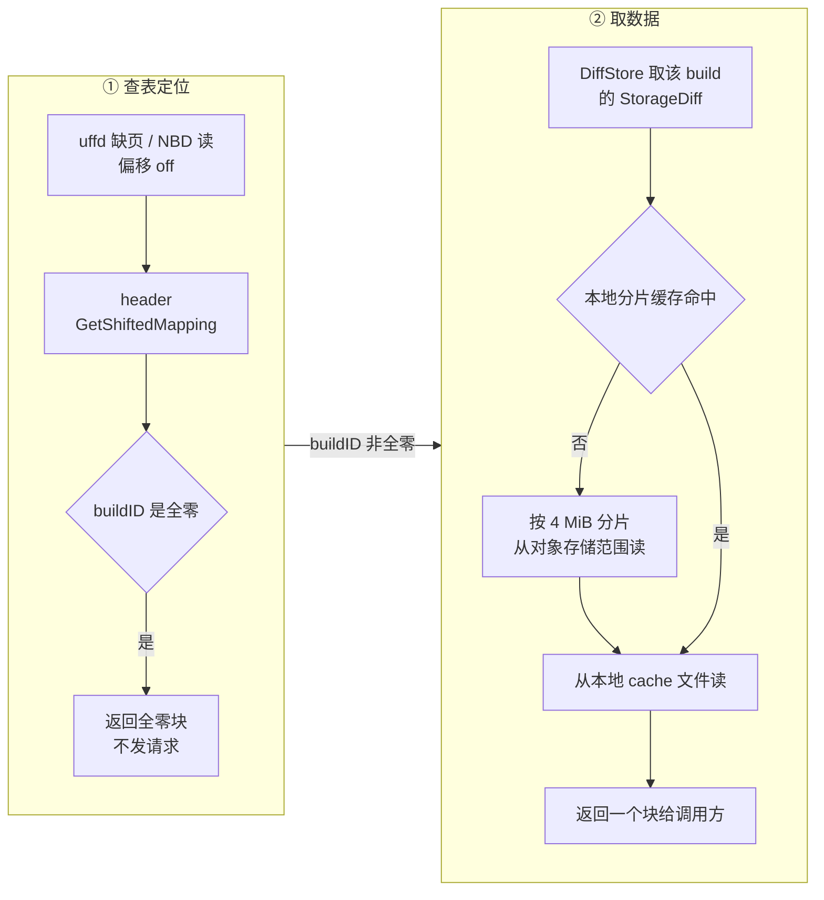
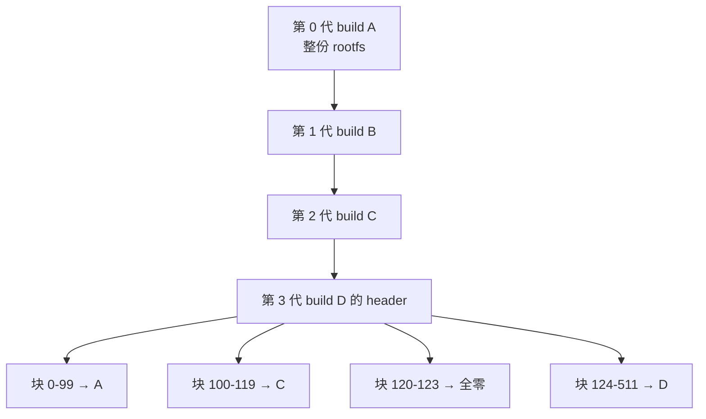

# 29 · 模板产物格式

> 一个模板的一代产物是六个对象，其中两个是二进制映射表。这两张表决定了「只存改动量」
> 能不能成立：它们把文件里的每一个块指向某一个 build 的数据文件与偏移。
> 本篇讲这个格式的字节布局、查找算法、diff 链怎么长出来，以及块大小与大页的关系。
>
> **读者**：工程师、系统研究者。
> **预备**：[第 13 篇 · 存储全景](13-storage-landscape.md)、[第 6 篇 · 块设备与写时复制](06-block-devices-nbd-cow.md)。
> **代码**：`packages/shared/pkg/storage/template.go`、`packages/shared/pkg/storage/header/`、
> `packages/orchestrator/internal/sandbox/build/`、`packages/orchestrator/internal/template/metadata/`

---

## 0. 本篇要回答的问题

1. 一次构建或一次 pause 产出哪些文件，各自装什么？
2. `memfile.header` 的字节布局是什么？为什么它可以没有魔数、没有长度字段？
3. 给定一个偏移，系统怎么在常数级的步骤里找到「该读哪个 build 的哪个偏移」？
4. 一次 pause 之后，新的映射表是怎么由父代映射表与脏块位图合成的？空块为什么用全零 UUID？
5. 块大小从哪来？开不开大页对映射表规模、空块判定与拉取粒度分别有什么影响？
6. 版本字段有两套（header 的与 `metadata.json` 的），各自管什么？

---

## 1. 问题：一代产物不能整份复制

一个沙箱被 pause 时，要把它当时的状态存成可以再次拉起的东西。最直接的做法是把 guest 内存
与 rootfs 各写成一个完整文件：4 GiB 内存 + 8 GiB 磁盘，一次 pause 写 12 GiB。
用户每隔几分钟 pause / resume 一次，对象存储的写入量与账单按这个量级增长，
pause 的耗时也被写入带宽卡死。

真实情况是，一次会话中被改写的内存与磁盘通常只有几十到几百 MiB。所以产物必须是**差分**：
只写这一代改动过的块。差分立刻带来第二个问题 —— 读的时候怎么知道某个块的最新版本在哪一代？
需要一张表，把文件的每个块指向「最近一次写过它的那次构建」。

这张表就是 header。它的设计目标有三条，彼此拉扯：

- **查得快**：一次缺页要在微秒量级里解析出「读哪个对象的哪个偏移」，不能做网络往返。
- **表要小**：header 是每次沙箱启动都要整份下载的对象，它的大小直接进冷启动路径。
- **链不能越走越深**：一个模板可以被 pause 上百次，读一个块不能因此变成上百次查表。

下面几节说明这三条各自是怎么被满足的，以及付出了什么。

---

## 2. 一代产物：六个对象

键的拼装在 `packages/shared/pkg/storage/template.go` 的 `TemplateFiles`：
`StorageDir()` 直接返回 build ID，其余方法在它后面接固定文件名
（常量 `MemfileName`、`RootfsName`、`SnapfileName`、`MetadataName`、`HeaderSuffix`）。

```text
<template-bucket>/
└── <build-id>/                    build ID 是 UUID，一次构建或一次 pause 分配一个
    ├── snapfile                   Firecracker 的 VM 状态：vCPU 寄存器、设备状态、内存布局
    ├── memfile                    guest 内存数据；只含本代写过的块，紧凑排列
    ├── memfile.header             块 → build 的映射表（二进制）
    ├── rootfs.ext4                根文件系统数据；同样只含本代写过的块
    ├── rootfs.ext4.header         同上
    └── metadata.json              模板级元数据：版本、kernel / Firecracker 版本、start 命令、预取表
```

四点需要先说清楚。

**`snapfile` 不是差分。** 它是 Firecracker `PUT /snapshot/create` 产生的 VM 状态文件，
几百 KiB 到几 MiB，每一代整份重写。差分只用于两个大文件。

**两个数据文件是「本代的块的紧凑拼接」，不是稀疏文件。** 一个 4 GiB 的内存，如果这一代
只脏了 300 个 2 MiB 的块，`memfile` 就是 600 MiB，块按偏移升序首尾相接。
「第 k 个被写出的块原本在文件的哪个位置」不记录在数据文件里，只记录在 header 里。

**`metadata.json` 与 header 是两套东西。** 前者是给构建与调度用的 JSON
（`packages/orchestrator/internal/template/metadata/template_metadata.go` 的 `Template` 结构），
后者是给块级读取用的二进制。两者的版本号也是独立的，见 §7。

**桶里没有模板 ID。** 「哪个模板的哪一代」由 Postgres 记录，产物侧只有一堆按 build ID 平铺的目录；
键布局与两个桶的分工见[第 13 篇 §3](13-storage-landscape.md#3-对象存储两个桶与键布局)。

---

## 3. header 的字节布局

序列化在 `header/serialization.go`：`Serialize()` 先 `binary.Write` 一个 `Metadata`，
再依次 `binary.Write` 每一条 `BuildMap`，全部小端。反序列化 `DeserializeBytes()`
读一个 `Metadata`，然后循环读 `BuildMap` 直到 `io.EOF`。

```text
偏移      长度   字段                说明
─────────────────────────────────────────────────────────────────
        Metadata（64 字节，每个文件一份）
  0       8    Version             格式版本，当前 metadataVersion = 3
  8       8    BlockSize           块大小，字节
 16       8    Size                映射覆盖的逻辑文件大小，字节
 24       8    Generation          第几代，模板首次构建为 0，每次 pause +1
 32      16    BuildId             本代的 build ID
 48      16    BaseBuildId         这条链最初那一代的 build ID
─────────────────────────────────────────────────────────────────
        BuildMap[]（40 字节一条，条数 = 文件大小减 64 除以 40）
 +0      8    Offset              本条覆盖的逻辑区间起点，字节
 +8      8    Length              本条覆盖的长度，BlockSize 的整数倍
+16     16    BuildId             这段数据在哪一代
+32      8    BuildStorageOffset  在那一代的数据文件里的起始偏移
```

没有魔数、没有条数字段、没有校验和：条数由文件长度反推，格式的正确性靠上层校验。
`header/inspect.go` 的 `ValidateMappings()` 做这层校验 —— 映射必须从 0 开始、
首尾相接不留缝、每条长度是块大小的整数倍、总和恰好等于 `Size`。
它在 pause 生成新 header 时被调用（`header/metadata.go` 的 `ToDiffHeader()`），
开发工具 `cmd/inspect-build/` 读 header 时也会先跑一遍。

**代价**：格式与 Go 结构体的内存布局绑定。改字段顺序或类型就会读坏所有存量 header，
只能靠 `Version` 字段拦住。收益是没有解析开销，反序列化就是一次连续读加一次循环。

映射表的规模由**分段数**决定，不由块数决定。一个 4 GiB、2 MiB 块的 memfile 有 2048 个块，
即使碎到每块一段也只有 80 KiB；同样 4 GiB 的 rootfs 用 4 KiB 块就是 1048576 个块，
最坏情况 40 MiB。这是块大小选择的第一个后果，§6 再展开。

---

## 4. 一次查找：从偏移到某一代的文件与偏移

`NewHeader()` 在反序列化后建两个索引：一个 `bitset`，把每条映射的**起始块号**置位；
一个 `map[int64]*BuildMap`，从起始块号找到那条映射。查找在 `header/header.go` 的
`getMapping()` 与 `GetShiftedMapping()`：

```text
请求偏移 off = 6 MiB，BlockSize = 2 MiB
   │
   ├─ block = BlockIdx(off, BlockSize) = 3
   │
   ├─ blockStarts.PreviousSet(3) → 2        找到不晚于 3 的最近一条映射的起始块
   │
   ├─ m = startMap[2]                       m = {Offset:4 MiB, Length:6 MiB,
   │                                             BuildId:B, BuildStorageOffset:2 MiB}
   ├─ shift = (3 - 2) × 2 MiB = 2 MiB
   │
   └─ 结果：读 build B 的数据文件，偏移 2 MiB + 2 MiB = 4 MiB，本条还剩 6 MiB − 2 MiB = 4 MiB
```

三个不变量让这套查找成立：映射按 `Offset` 升序、首尾相接、完整覆盖 `Size`。
有了它们，「不晚于目标块的最近一条映射」一定就是覆盖目标块的那条，位图上一次
`PreviousSet` 就够，不需要二分查找，也不需要按块存一个数组。

`GetShiftedMapping()` 返回三样东西：目标 build ID、在那一代文件里的偏移、
这条映射从该点起还剩多少字节。调用方是
`packages/orchestrator/internal/sandbox/build/build.go` 的 `File`：

- `ReadAt()` 循环调用它，每轮读 `min(本条剩余长度, 还要读的长度)`，
  跨映射的读会被自动拆成多次、落到不同的 build 上；
- `Slice()` 只查一次，按块大小取一块，给 userfaultfd 的缺页处理用。

拿到 build ID 之后，`File.getBuild()` 构造一个 `StorageDiff`（`storage_diff.go`），
它的对象路径就是 `<buildID>/<memfile|rootfs.ext4>`，再交给 `DiffStore` 缓存与分片拉取
（`cache.go`；分片、缓存与位图在[第 30 篇 §6](30-block-layer.md#6-两种-chunker)）。

一个特例：**build ID 为全零 UUID 表示这一段全是零**。`ReadAt()` 遇到它直接把 `n` 前移，
不读任何对象（注释要求传进来的缓冲区本身是零）；`Slice()` 返回预分配的 `header.EmptyHugePage`。
这样连续的空洞不占任何存储，也不产生任何一次对象存储请求。



---

## 5. diff 链是怎么长出来的

### 5.1 第一代

模板构建的 base 阶段（`internal/template/build/phases/base/files.go`）造出 rootfs 文件后，
用 `block.NewLocal()` 包装它，memfile 则是一个 `block.NewEmpty()` 的全零设备。
两者都调 `header.NewTemplateMetadata()` 建 header，`Version = 3`、`Generation = 0`、
`BuildId = BaseBuildId =` 本次构建的 ID。`NewHeader()` 在 mapping 为空时会**合成一条**
覆盖整个 `Size`、指向自己的映射。

也就是说，第一代的 header 只有一条映射，语义是「整份文件都在我这里」。

### 5.2 每一次 pause

pause 的完整流程在[第 37 篇 §2](37-pause-and-snapshot.md#2-pause-的时序)，这里只看产出 header 的那一段。
`internal/sandbox/sandbox.go` 的 `pauseProcessMemory()` 与 `pauseProcessRootfs()`
拿到两样东西：父代的 `*header.Header`，以及一个 `header.DiffMetadata`
—— 两个位图 `Dirty`、`Empty` 加块大小。

`header/metadata.go` 的 `ToDiffHeader()` 把它们合成新 header，四步：

1. `CreateMapping(&buildID, Dirty, blockSize)`：把脏块位图压成映射。
   连续的脏块合成一条，`BuildStorageOffset` 是一个**累加器** —— 第一条从 0 开始，
   之后每条加上前一条的长度。这正好等于这些块在新数据文件里的位置，
   前提是数据文件按块号升序写出（`block/cache.go` 的 `ExportToDiff()`
   按 `dirtySortedKeys()` 顺序写，`fc/memory.go` 的 `ExportMemory()` 按
   `BitsetRanges()` 升序写；两处顺序必须与这里一致，否则整代产物错位）。
2. `CreateMapping(&uuid.Nil, Empty, blockSize)`：把全零块压成映射，build ID 用全零，
   这些块不写进数据文件。
3. `MergeMappings(父代映射, 本代映射)` 两次：先把脏映射与空映射并起来，
   再把结果盖到父代映射上。合并是区间覆盖语义 —— 本代的区间赢，
   父代被完全盖住的段丢弃，被部分盖住的段切成左右两半并相应调整 `BuildStorageOffset`。
4. `NormalizeMappings()`：把相邻且 build ID 相同的段并成一条，压缩表的长度。

第四步有一条不写在代码里的前提。`NormalizeMappings()` 合并时只做一件事 ——
把后一条的 `Length` 加到前一条上，然后丢弃后一条的 `Offset` 与 `BuildStorageOffset`。
它既不检查两条在逻辑上是否真的首尾相接，也不检查两条在那一代数据文件里是否首尾相接。
因此它隐含要求：**任何两条相邻且同源的映射，必须在逻辑偏移与存储偏移上同时连续**。
这个要求在上游是被两处一起保证的 —— `CreateMapping()` 按块号升序分配 `BuildStorageOffset`，
`MergeMappings()` 切分父代映射时把 `BuildStorageOffset` 与逻辑偏移移动同样的字节数。
`ValidateMappings()` 帮不上忙：它只查逻辑区间的升序、对齐与完整覆盖，
从不看 `BuildStorageOffset`。也就是说，一旦哪一天有人换掉数据文件的写出顺序，
错位不会在生成 header 时被拦下，只会在读到错误内容时暴露。

`Metadata` 走 `NextGeneration(buildID)`：`Generation + 1`，`BuildId` 换成新的，
`BlockSize`、`Size`、`Version`、`BaseBuildId` 全部继承。

### 5.3 链是扁平的

这里有一个容易误解的点：新 header 里的映射直接写着祖先的 build ID，
不是「指向父代 header 再由父代继续查」。合并在 **pause 时**做完了，
读的时候永远只查一张表。



**收益**：读一个块的代价与链的深度无关，永远是一次查表加一次范围读。
**代价**有三条，都不轻：

- 一个沙箱启动后可能要同时打开好几代的数据对象，每一代都要建自己的分片缓存与连接；
- 一代产物只要还被任何后代的 header 引用就不能删。判断「这一代能不能删」因此不在存储层，
  而在 api 侧对 Postgres 的查询里（见[第 11 篇 §2](11-object-model.md#2-postgres-里的对象)）；
- 表的长度随代数增长。`NormalizeMappings()` 只能合并相邻同源段，
  脏块分布越零散、代数越多，段数越多，header 越大。

第一次 pause 有个值得单独说的性质。冷启动的沙箱用的是 `uffd.NoopMemory`，
它的 `DiffMetadata()`（`internal/sandbox/uffd/noop.go`）把 `Empty` 置成
**全体块减去脏块**。于是合并之后，第一代那条「整份指向 base build」的映射被完全覆盖，
memfile 的每个块要么指向新 build，要么是全零 —— base build 从来不需要真的存在一个
`memfile` 对象。resume 出来的沙箱走 `Uffd.DiffMetadata()`，`Empty` 只来自
Firecracker 报告的「驻留但内容全零」的页，父代映射因此会被保留下来。

---

## 6. 块大小与大页

块大小是 `Metadata.BlockSize`，写进 header，此后所有查找、校验、diff 都以它为单位。它有两个来源：

| 文件 | 取值 | 来源 |
|---|---|---|
| `rootfs.ext4` | 固定 4 KiB | `config.TemplateConfig.RootfsBlockSize()` 返回 `header.RootfsBlockSize` |
| `memfile`，开大页 | 2 MiB | `config.MemfilePageSize(true)` 返回 `header.HugepageSize` |
| `memfile`，不开大页 | 4 KiB | `config.MemfilePageSize(false)` 返回 `header.PageSize` |

大页选项是模板级的（`TemplateConfig.HugePages`），构建时决定，构建期的每一层沙箱都用它
（`phases/base/files.go`、`layer/create_sandbox.go` 都调 `MemfilePageSize`）。
运行期它进 Firecracker 的机器配置：`internal/sandbox/fc/client.go` 的 `setMachineConfig()`
在 `hugePages` 为真时把 `MachineConfiguration.HugePages` 设为 `Nr2M`，
guest 内存于是由 2 MiB 的 HugeTLB 页支撑。

两边必须一致，因为 uffd 的 `UFFDIO_COPY` 一次填一个宿主页，而填进去的数据是
`File.Slice()` 按 `Metadata.BlockSize` 取的一块。块大小与 Firecracker 的页大小不匹配，
要么填不满、要么越界。**推论**：上游 2026.09 没有在 resume 路径上校验这两者
—— header 的块大小来自产物，`HugePages` 来自 Create 请求的沙箱配置，
代码里没有把两者比对的地方；一致性靠「同一个模板配置同时决定了这两者」来保证。

块大小选大还是选小，是一组成对的代价：

| 维度 | 2 MiB 块 | 4 KiB 块 |
|---|---|---|
| 映射表规模 | 小 512 倍 | 最坏情况几十 MiB |
| 一次缺页拉取量 | 2 MiB，少而大 | 4 KiB，多而小 |
| 差分粒度 | 改 1 字节要写 2 MiB | 改 1 字节写 4 KiB |
| 空块判定 | 整个 2 MiB 全零才算空 | 4 KiB 全零就算空 |
| 缺页次数 | 少 512 倍 | 多 |

空块判定这一条容易被忽略。`header/diff.go` 的 `IsEmptyBlock()` 只支持这两个尺寸
（其它值直接报错），做法是与预分配的全零缓冲区整块比较。块越大，「恰好整块全零」
越难成立，被识别成空洞的块就越少，产物也就越大。

还有一个外部约束：`packages/shared/pkg/storage/storage.go` 的
`MemoryChunkSize = 4 MiB`，注释写明它必须不小于块大小。这是从对象存储按范围拉取的单位，
2 MiB 块意味着一个分片装两个块。大页对缺页次数与预取的影响在
[第 32 篇 §5](32-memory-prefetch-and-hugepages.md#5-大页改变了哪些量)展开。

---

## 7. 两套版本字段

**header 的 `Version`。** 当前是 3（`metadataVersion`）。`header.go` 里另有一个
`NormalizeFixVersion = 3`，`IsNormalizeFixApplied()` 判断 `Version >= 3`。
这个标志控制的是**错误还是告警**：偏移越界、偏移未对齐块大小、映射长度算成负数、
`ValidateMappings()` 不通过 —— 这些情况在版本 ≥ 3 的 header 上一律返回错误，
在更老的 header 上只打一条 warn 日志继续跑。收益是老产物不会因为一次格式收紧就集体报废，
代价是这些老产物上的读取错误会静默通过，症状表现为数据错乱而不是失败。

还有一条更旧的兼容路径。`internal/sandbox/template/storage.go` 的 `NewStorage()`
在对象存储里找不到 `.header` 时，回退到「没有 header 的老模板」：
按文件类型硬编码块大小（memfile 2 MiB、rootfs 4 KiB），合成一个
`Version = 1`、`Generation = 1`、只有一条映射的 header。注释直言这是权宜之计
—— 老模板的真实块大小无从得知，只能假定。

**`metadata.json` 的 `version`。** 这是另一套编号：`internal/template/metadata` 的
`CurrentVersion = 2`、`DeprecatedVersion = 1`。`deserialize()` 先只解出 `version` 字段，
凡是 ≤ 1 或不是数字的，直接返回一个只有 `Version: 1` 的空结构，其余字段全部丢弃。
构建层缓存另有门槛：`internal/template/build/storage/cache/cache.go` 要求
`Version >= minimalCachedTemplateVersion`（同样是 2）才算命中（见
[第 45 篇 §3](45-layers-and-build-cache.md#3-查找两跳索引是弱引用)）。

`metadata.json` 里装的是模板级信息：`template`（build ID、kernel 版本、Firecracker 版本）、
`context`（默认用户、工作目录、环境变量）、`start`（start 与 ready 命令）、
`from_image` 或 `from_template`，以及 `prefetch.memory`
—— 一份按访问顺序排列的块下标数组加访问类型，还自带一个 `block_size` 字段。
**推论**：这个 `block_size` 与 header 的块大小没有交叉校验，两者不一致时预取会按错误的粒度取块。

---

## 8. 本地缓存与远端键的对应

同一份数据在三个地方有名字，对应关系是刻意做成一一映射的：

```text
对象存储     <build-id>/memfile                  storage_diff.go 的 storagePath()
缓存键       "<build-id>/memfile"                cache.go 的 GetDiffStoreKey()
本地文件     <DEFAULT_CACHE_DIR>/<build-id>-memfile-<随机串>
                                                 diff.go 的 GenerateDiffCachePath()
```

前两者的字符串完全相同，只差一个类型。`DiffStore`（`build/cache.go`）以这个键做
TTL 缓存，值是一个 `Diff` 接口：从对象存储拉的是 `StorageDiff`，pause 刚生成还没上传的是
`localDiff`。两者对上层是同一个接口，所以刚 pause 完的沙箱再 resume 时，读的是本地那份，
不必等上传完成再从远端拉回来。

本地文件名末尾的随机串来自 `id.Generate()`，作用是让同一个 build 的新旧缓存文件不撞名 ——
旧缓存项被淘汰关闭时会删自己的文件，不能删到新缓存项刚建好的那个。
缓存的淘汰策略与磁盘水位控制属于
[第 34 篇 §6](34-template-cache-and-local-storage.md#6-水位驱逐与延迟删除)。

排查产物问题的现成工具是 `packages/orchestrator/cmd/inspect-build/`：
给一个 build ID，它把 header 反序列化后打印 `Metadata` 全部字段、逐条映射
（格式来自 `BuildMap.Format()`：块区间、逻辑区间、存储区间、build ID），
并按 build ID 汇总各代占多少块、占百分之几，全零 UUID 标为 `sparse`。
`header/inspect.go` 还有一个 `Visualize()`，把映射画成字符网格。工具全集见
[第 47 篇 §6](47-orchestrator-dev-tools.md#6-看产物四个只读工具)。

---

## 9. ARM 适配版的差异

产物格式本身没有改动：`packages/shared/pkg/storage/header/` 与 `template.go`
在 ARM 补丁的 diff 里没有出现，字节布局、块大小常量、合并算法与上游一致。
两处相关改动都在格式之外：默认存储 provider 从 GCS 改为 MinIO
（`storage.go` 的 `DefaultStorageProvider`，见
[第 75 篇 §5](75-minio-storage.md#5-把默认-provider-改成-minio)），
以及 `block/cache.go` 的 `WriteAtWithoutLock()` 加了范围检查与 `recover`
（见[第 73 篇 §5](73-cgroup-and-host-compat.md#5-blockcachego-的四条防御)）。

需要留意的是块大小：ARM 适配版仍然按 `HugePages` 选 2 MiB 或 4 KiB 块，
2 MiB HugeTLB 在 aarch64 宿主上的前提条件见
[第 82 篇 §4](82-host-kernel-nbd-hugepages.md#4-大页预留算法与-aarch64-上的一个假设)。

---

## 10. 小结

- 一代产物是六个对象：`snapfile`、`memfile` 与它的 header、`rootfs.ext4` 与它的 header、`metadata.json`。
  只有两个大文件是差分的，`snapfile` 每代整份重写。
- header 是定长小端结构的直接内存映像：64 字节 `Metadata` 加若干条 40 字节 `BuildMap`，
  无魔数、无条数字段、无校验和，条数由文件长度反推。
- 三条不变量支撑整个格式：映射按偏移升序、首尾相接、完整覆盖 `Size`。
  `ValidateMappings()` 在生成新 header 时检查它们。
- 查找是位图上的一次 `PreviousSet` 加一次减法：目标 build、目标偏移、本段剩余长度，一次算出。
- 全零 UUID 表示空洞，既不占存储也不产生对象存储请求。
- diff 链在 pause 时被压平：新 header 直接写祖先的 build ID，读的时候只查一张表，
  读代价与代数无关；代价是老产物不能删、表随代数变长、一次启动可能要打开多代对象。
- `CreateMapping()` 的 `BuildStorageOffset` 是累加器，它成立的前提是数据文件按块号升序写出。
- 块大小写在 header 里：rootfs 恒为 4 KiB，memfile 按模板的大页选项取 2 MiB 或 4 KiB，
  并且必须与 Firecracker 的 `HugePages` 机器配置一致。
- 大页把映射表缩小 512 倍、把缺页次数降低两个数量级，代价是差分粒度变粗、空块更难识别。
- 版本字段有两套：header 的 `Version = 3` 决定格式校验是报错还是告警；
  `metadata.json` 的 `version = 2` 决定元数据能否被解析与被当作层缓存命中。

---

## 延伸阅读 / 下一篇

- [第 30 篇 · block 包：缓存、overlay 与分片读取](30-block-layer.md) —— header 定位之后，
  数据是怎么从对象存储拉到本地、怎么被缓存与写回的。
- [第 37 篇 §3 · 脏页判据](37-pause-and-snapshot.md#3-脏页判据) —— `DiffMetadata`
  的两个位图从哪来，产物怎么写出与上传。
- [第 31 篇 §4 · 一次缺页](31-uffd-memory-backend.md#4-一次缺页)、
  [第 33 篇 §6 · 一次 guest 写](33-nbd-and-rootfs.md#6-一次-guest-写走到哪里) —— 两个消费 header 的读路径。
- [第 32 篇 · 预取与大页](32-memory-prefetch-and-hugepages.md) —— `metadata.json`
  里那份预取表怎么用。
- [第 41 篇 §4 · 主流程](41-template-build-overview.md#4-主流程) —— 第一代产物是怎么造出来的。
- [第 47 篇 · 本地开发工具](47-orchestrator-dev-tools.md) —— `inspect-build`、
  `show-build-diff`、`copy-build` 的用法。
- 下一篇：[第 30 篇 · block 包：缓存、overlay 与分片读取](30-block-layer.md)。
