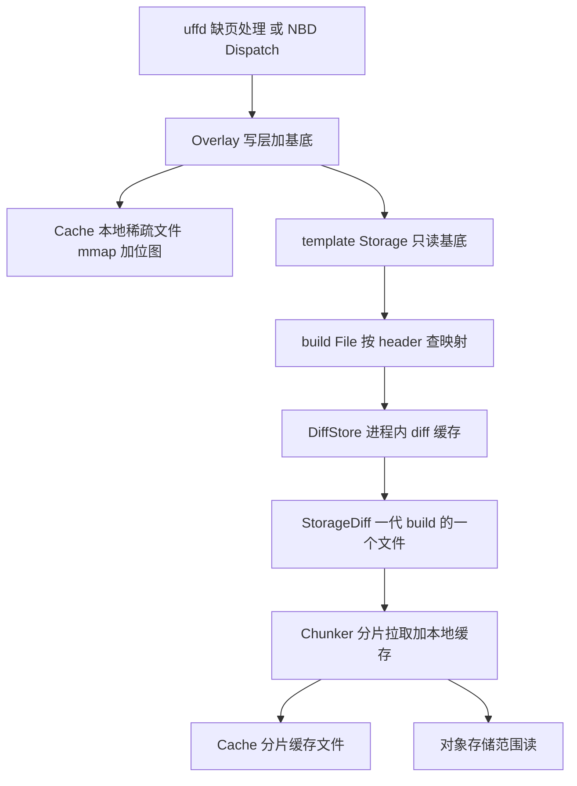
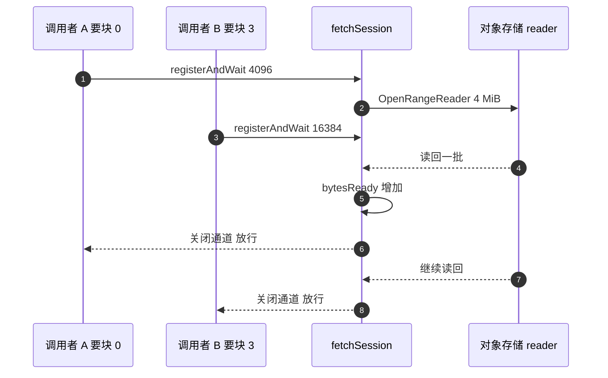

# 30 · block 包：缓存、overlay 与分片读取

> 一台沙箱恢复时，它的内存和磁盘都不在本地：内存是对象存储上若干代 diff 拼起来的，
> 磁盘是一份只读基底加一层本地写层。把「按需读一个块」做到既零拷贝又不重复下载，
> 是 `block` 包与 `build` 包的全部职责。本篇拆开这两个包，讲清一个块从 guest 的一次访问
> 到对象存储的一次范围读之间的每一层，以及每一层的代价。
>
> **读者**：读过 [第 06 篇 · 块设备、NBD 与写时复制](06-block-devices-nbd-cow.md) 的人。
> 本篇不再重复 NBD 协议与块设备抽象。
> **预备**：[第 06 篇](06-block-devices-nbd-cow.md)、[第 29 篇 · 模板产物格式](29-template-artifact-format.md)。
> **代码**：`packages/orchestrator/internal/sandbox/block/`、
> `packages/orchestrator/internal/sandbox/build/`、
> `packages/shared/pkg/storage/`、`packages/shared/pkg/storage/header/`

---

## 0. 本篇要回答的问题

1. `Slice` 与 `ReadAt` 为什么要同时存在？谁用哪个，各自的约束是什么？
2. `Cache` 的那张位图同时承担了几种语义？为什么它既能当「已缓存」用，又能当「脏」用？
3. 一次「读第 N 个块」的调用，从 `Overlay` 出发要经过多少层才到达对象存储的一次范围读？
4. 两种 `Chunker` 的差别在哪里？流式那一种为什么要自己维护一套等待者队列？
5. 一段被零拷贝暴露出去的内存，什么时候会被释放？系统靠什么避免读到已经 unmap 的地址？

---

## 1. 一次读要穿过多少层

guest 里一次普通的内存访问或磁盘读，在宿主侧要满足四个互相冲突的要求：

- **不能整份下载。** memfile 可以是几 GiB，等它下完与「几百 ms 拉起」不相容。
- **不能重复下载。** 同一节点上的多台沙箱可能共享同一个块，一台沙箱的多个 vCPU 也可能同时缺同一页。
- **不能多拷一次。** 缺页路径上每一次 `memcpy` 都加在 guest 的停顿时间上。
- **要能回答「哪些块被写过」。** 否则 pause 无法只导出改动量。

`block` 包解决前三个，`build` 包解决「这个块属于哪一代 build」。两个包的分层是这样的：



图中出现了两个 `Cache`：overlay 的写层与 chunker 的分片缓存。它们是同一份代码，
复用的代价是位图的语义变得含混，[§3.2](#32-一张位图两种语义) 展开。

「overlay」在本书里有两个互不相干的所指。本篇讲的 `Overlay` 是 `block/overlay.go` 里的块设备实现，
一层本地写 cache 叠在只读基底上，粒度是块；另一个是 Linux 的联合文件系统 overlayfs，粒度是文件，
出现在把 OCI 镜像各层叠成目录树的构建路径（[第 43 篇 §3.2](43-rootfs-construction.md#32-解包)）
与 guest 内核补丁（[第 69 篇 §4.3](69-guest-kernel-for-arm.md#43-overlayfs-与根文件系统)）里。
两者不共享任何代码；后文单说「overlay」一律指前者。

---

## 2. 三个接口与两种读法

### 2.1 接口

`block/device.go` 全文只有三个接口和一个错误类型：

```go
type Slicer interface {
	Slice(ctx context.Context, off, length int64) ([]byte, error)
	BlockSize() int64
}

type ReadonlyDevice interface {
	storage.SeekableReader // ReadAt(ctx, buffer, off) 与 Size(ctx)
	io.Closer
	Slicer
	BlockSize() int64
	Header() *header.Header
}

type Device interface {
	ReadonlyDevice
	io.WriterAt
}

type BytesNotAvailableError struct{}
```

`BytesNotAvailableError` 不是异常，是控制流：它是「这一块本地没有」的信号，
`Overlay` 与 `Chunker` 靠 `errors.As` 认出它来决定要不要往下一层走；其它错误直接上传。

实现 `ReadonlyDevice` 的有四种：`block/local.go` 的 `Local`（本地一整个文件）、
`block/empty.go` 的 `Empty`（全零，不占存储）、`internal/sandbox/template/storage.go` 的
`Storage`（走 header 到对象存储），以及 `block/overlay.go` 的 `Overlay`（它同时实现了 `Device`）。
前两种只出现在模板构建路径上（`internal/template/build/phases/base/files.go`、
`internal/template/build/layer/create_sandbox.go`），运行期用的是 `Storage` 加 `Overlay`。

### 2.2 `Slice` 与 `ReadAt` 的分工

这是本包最容易读错的一处：两个方法读同一批数据，语义却不同。

| 维度 | `ReadAt(ctx, p, off)` | `Slice(ctx, off, length)` |
|---|---|---|
| 数据去向 | 拷进调用者给的 `p` | 返回内部缓冲区的一段 |
| 拷贝次数 | 一次 | 零次 |
| 长度约束 | 任意（内部按块循环） | 必须是一个块 |
| 返回值寿命 | 调用者自己的内存，随便用 | 底层 mmap 或全局零页，随时可能失效 |
| 使用者 | NBD 的 `cmdRead`、诊断路径 | uffd 缺页、预取 |

使用者的选择由路径决定。NBD 侧（`internal/sandbox/nbd/dispatch.go` 的 `cmdRead`）
先 `make([]byte, length)` 再读，数据最终要写进 socket 应答，用 `ReadAt` 没有额外损失。
uffd 侧（`internal/sandbox/uffd/userfaultfd/userfaultfd.go` 的 `faultPage`）拿到 `[]byte` 后立刻调
`UFFDIO_COPY`，内核从这个地址把整页拷进 guest；先 `ReadAt` 到临时缓冲区等于每次缺页
多做一次 2 MiB 的 `memcpy`。预取路径（`internal/sandbox/uffd/prefetch/prefetcher.go`）同理。

零拷贝的代价全部落在寿命上。`Slice` 返回的可能是三种东西之一：

1. `Cache` 的 mmap 区间的一个子切片（`block/cache.go` 的 `Slice`）；
2. `header.EmptyHugePage` —— 一个包级全局的 2 MiB 零切片，当 header 把这个块映射到
   `uuid.Nil` 时由 `build/build.go` 的 `File.Slice` 直接返回；
3. `Local` 与 `Empty` 各自新分配的切片（这两种实现其实是拷贝的，只是接口一致）。

前两种都不允许调用者写入：写第一种污染缓存，写第二种污染同一进程内所有沙箱共用的那份零页。
类型系统表达不了这条约束，只有 `Cache.Slice` 的注释写了「必须自行保证线程安全，
理想做法是每个块只写一次然后再暴露切片」—— 这条约束在 chunker 的实现里被反复用到。

`Overlay.Slice` 干脆没有实现，直接返回 `not implemented`，注释说明了原因：
overlay 的一段数据可能一半在 cache、一半在基底，拼起来就必须新分配和拷贝，
零拷贝的前提不成立。因此 rootfs 路径上没有人调它 —— NBD 走 `ReadAt`。
反过来，内存路径没有 overlay：uffd 直接对着 `Storage` 调 `Slice`
（[第 31 篇 §4](31-uffd-memory-backend.md#4-一次缺页)），guest 的内存写由 KVM 处理，
不需要宿主侧的写层。

---

## 3. `Cache`：mmap 加一张位图

### 3.1 结构

`block/cache.go` 的 `NewCache(size, blockSize, filePath, dirtyFile)` 做三件事：
以 `O_RDWR|O_CREATE` 打开文件、`Truncate(size)`（在 Linux 上得到一个稀疏文件）、
然后 `mmap.MapRegion` 把整个文件以 `PROT_READ|PROT_WRITE` 映射进来。
`size == 0` 是合法的，此时不建立映射，`mmap` 字段为 `nil`，
之后 `ReadAt` 与 `WriteAt` 都返回 `0, nil`、`Slice` 返回 `nil, nil` —— 这是给没有 diff
的那一代 build 准备的退化形态。代价是失败被静默吞掉：这种 cache 若装进 `Overlay`，
`Overlay.ReadAt` 会把 `0, nil` 当成命中而不再去问基底（推论：运行期不会发生，
`rootfs/nbd.go` 建的 cache 尺寸就是 rootfs 的真实大小）。

用 mmap 而不是 `pread`/`pwrite` 有两个理由。一是零拷贝：`Slice` 能把映射区间的一段
直接交出去。二是稀疏：写过的页才由内核分配物理块，`FileSize()` 用 `stat.Blocks * fsStat.Bsize`
读的是实际占用而不是逻辑大小，磁盘水位驱逐靠它记账。
代价是错误形态变了：写入越界或文件系统没有空间时，`SIGBUS` 在写指令上爆出来而不是返回一个
错误值（这一点在 ARM 适配版里被特别对待，见 [§9](#9-arm-适配版的差异)）。

### 3.2 一张位图两种语义

`Cache` 的「位图」是一个 `dirty sync.Map`，键是块偏移（不是块下标），值是空结构体，
被三处代码读写：

- `setIsCached(off, length)`：把这一段覆盖的每个块偏移置位。调用者是 `WriteAtWithoutLock`
  与 chunker 里直接填完 mmap 之后的收尾。
- `isCached(off, length)`：每个块都置位了才算命中，否则 `Slice` 返回 `BytesNotAvailableError`。
- `dirtySortedKeys()`：`ExportToDiff` 用它按偏移升序枚举要导出的块。

同一张位图，在 overlay 的 cache 上意思是「这一块被 guest 写过」，
在 chunker 的 cache 上意思是「这一块已经从远端拉回来了」。两种语义能共用，
是因为**两种 cache 的写入者互不重叠**：overlay 的 cache 只被 `Overlay.WriteAt` 写，
chunker 的 cache 只被 chunker 的填充路径写。
收益是零额外记账，位图本身就是 diff 的清单；代价是 diff 的粒度钉死在块上 ——
guest 改一个字节，整个块都算脏。

构造函数的 `dirtyFile` 参数是这个复用的补丁：当传入的文件本来就有内容
（`build/local_diff.go` 的 `newLocalDiff` 把 pause 刚写完的 diff 文件重新映射成只读源），
位图是空的但数据是全的，此时 `Slice` 跳过 `isCached` 直接返回映射区间。
`NewNBDProvider` 与两个 chunker 传的都是 `false`。

### 3.3 锁的三种用法

`Cache` 有一把 `sync.RWMutex`，它保护的不是数据，而是**映射本身的存在性**：

- `Close()` 与 `ExportToDiff()` 取写锁；`Close()` 先把 `closed` 原子标志置位，再 `Unmap`，再删文件。
- `ReadAt()` 与 `WriteAt()` 取读锁 / 写锁后转调不加锁的内部方法。
- `addressBytes(off, length)` 取读锁**并把解锁函数返回给调用者**，
  调用者在整个填充过程中持有读锁，从而阻止 cache 在自己写 mmap 期间被 unmap。

第三种是 chunker 用的：它拿到一段 mmap 区间的可写切片，把网络数据直接读进去，
读完再 `setIsCached` —— 这就是「每个块只写一次，写完再暴露」那条约束的落地方式。
`Slice()` 本身不加锁，因为它在缺页热路径上，加锁会把并发缺页串行化；
代价是它返回的切片在 `Close` 之后就是悬空的，
只能靠上层的生命周期规则（[§7](#7-谁负责释放)）而不是靠锁来避免。

`WriteAtWithoutLock` 的名字说明了它的契约：调用者必须已经持有锁，或能保证同一个块
不被并发写。它是 `WriteAt` 的实现体，也是 ARM 适配版唯一改动的函数。

### 3.4 两个附带能力

`ExportToDiff(ctx, out)` 是 pause 的磁盘侧出口：先 `Flush()` 把脏页刷回文件，
再按排序后的脏块偏移逐块交给 `header.NewDiffMetadataBuilder().Process()`，
全零块只记进 `empty` 位图不写字节，其余追加进 `out`。
调用者是 `internal/sandbox/rootfs/nbd.go` 的 `ExportDiff`，
它在调用前用 `Overlay.EjectCache()` 把 cache 的所有权摘下来。

`NewCacheFromProcessMemory(ctx, blockSize, filePath, pid, ranges)` 是内存侧的对应物，
但方向相反：它新建一个 cache，然后用 `process_vm_readv` 把 Firecracker 进程里指定的
若干段虚拟地址直接读进 mmap。调用者是 `internal/sandbox/fc/memory.go` 的 `ExportMemory`，
`ranges` 由脏页位图经 `block/range.go` 的 `BitsetRanges` 转成区间、
再经 Firecracker 的内存映射信息转成宿主虚拟地址。

这条路径要绕开 `block/iov.go` 里的两个内核限制：向量数不超过 `IOV_MAX`，总字节数不超过
`MAX_RW_COUNT`（`getAlignedMaxRwCount` 还要把它对齐到 block size，否则读回的尾巴不是整块、
位图无法置位）。`copyProcessMemory` 因此先切开超长区间再攒批，
并对 `EAGAIN`、`EINTR`、`ENOMEM` 无限次重试。

---

## 4. `Overlay`：两条规则

`block/overlay.go` 的全部逻辑是一句话：**写永远进 cache，读先问 cache 再落基底**。
展开成代码只有几十行，其中三个细节值得注意。

`ReadAt` 是**逐块**循环的：它用 `header.BlocksOffsets(len(p), blockSize)` 把请求切成块，
对每一块先 `cache.ReadAt`，拿到 `BytesNotAvailableError` 才转 `device.ReadAt`。
这意味着请求长度必须是块大小的整数倍，否则最后一次切片会越界。
这条不变量由 NBD 侧保证：`internal/sandbox/nbd/path_direct.go` 把设备的
`WithBlockSize` 设成 4096，与 rootfs 的块大小一致，内核发下来的请求天然对齐。

`ReadAt` **不回填 cache**：从基底读到的数据只进调用者的缓冲区。这是必须的 ——
写层的位图就是脏块清单，回填会把没被 guest 写过的块也标脏，pause 导出的 diff
会退化到「读过的全都算改过」。回填是 chunker 那一层的事，它有自己的 cache 和位图。

`EjectCache()` 用一个 `atomic.Bool` 的 CAS 保证只成功一次，之后 `Overlay.Close()`
看到标志为真就直接返回、不关 cache，改由 `ExportDiff` 关。
这是 Go 里表达移动语义的常见做法，代价是误用只能在运行期报错。

---

## 5. 基底：从 header 到一次范围读

`Overlay` 读不到时问的那个「基底」，运行期是 `internal/sandbox/template/storage.go` 的
`Storage`，它只是 `build/build.go` 里 `File` 的薄包装，真正的查找在 `File` 里。

### 5.1 `File`：按 header 定位

`File` 持有一个 `*header.Header`、一个 `*DiffStore`、一个 `DiffType`（`memfile` 或 `rootfs`）
和一个 `storage.StorageProvider`。它的 `Slice(ctx, off, _)` 分五步：

1. `header.GetShiftedMapping(ctx, off)` 拿到三元组：目标 build ID、在那个 build 文件里的偏移、
   这段映射还剩多长。查找算法与字节布局见
   [第 29 篇 §3](29-template-artifact-format.md#3-header-的字节布局)与
   [§4](29-template-artifact-format.md#4-一次查找从偏移到某一代的文件与偏移)。
2. build ID 是 `uuid.Nil` 表示「这个块从来没被任何一代写过」，直接返回 `header.EmptyHugePage`。
3. 否则用 `newStorageDiff(...)` 构造一个描述符，交给 `DiffStore.Get`。
4. `DiffStore` 命中就返回已有的那份，未命中就调 `Init` 建立 chunker。
5. 对拿到的 `Diff` 调 `Slice(ctx, mappedOffset, blockSize)`。

注意第 5 步传的长度是 `header.Metadata.BlockSize`，`File.Slice` 自己的 `length` 参数被丢弃 ——
方法注释写明「切片访问必须按 build 预定义的块大小」。这与 [§2.2](#22-slice-与-readat-的分工)
表里的「长度必须是一个块」是同一条约束。

`File.ReadAt` 是同一套查找加一个循环：每轮取一段映射，读 `min(映射剩余长度, 缓冲区剩余长度)`，
直到填满。`uuid.Nil` 的映射它不读也不写，只把 `n` 往前推 —— 注释指出这依赖调用者传进来的
`p` 初始为全零，是一处隐式契约：复用缓冲区的调用者必须自己清零。

### 5.2 `StorageDiff`：一代 build 的一个文件

`build/storage_diff.go` 的 `StorageDiff` 代表「对象存储上 `<buildID>/<memfile|rootfs>` 这一个对象」。
它的 `chunker` 字段是 `utils.SetOnce[block.Chunker]`：构造时是空的，
`Init(ctx)` 里 `OpenSeekable` 打开对象、`Size` 问大小、`NewChunker` 建 chunker，然后 `SetValue`。
所有读方法第一件事都是 `chunker.Wait()`。

这个安排解决并发初始化：同一个 build 的第一次访问可能来自多个 vCPU 的并发缺页，
`DiffStore.Get` 用 `ttlcache.GetOrSet` 保证只有一个协程拿到 `found == false` 去跑 `Init`，
其余协程拿到同一个对象、阻塞在 `chunker.Wait()` 上，直到 `SetValue` 或 `SetError`。
`Size` 与 `NewChunker` 失败时 `Init` 都显式 `SetError` 把等待者唤醒；
第一步 `OpenSeekable` 失败时只把错误返回给自己的调用者，不置 `SetError`
（推论：此时这个 `StorageDiff` 已经因 `GetOrSet` 留在缓存里，
后来者对同一个键调 `chunker.Wait()` 会一直等下去，直到该项被驱逐）。

`Diff` 还有两个实现：`build/local_diff.go` 的 `localDiff` 包一个本地 `block.Cache`
（pause 刚生成的 diff，还没上传就能被下一次读命中），`build/diff.go` 的 `NoDiff`
所有方法都返回 `NoDiffError`，用于「这一代没有产生任何改动」。

### 5.3 缓存文件的命名

`GenerateDiffCachePath(basePath, buildID, diffType)` 拼出的名字是
`<buildID>-<memfile|rootfs>-<随机后缀>`，后缀由 `id.Generate()` 生成。
两次 `newStorageDiff` 因此得到两个路径，但只有赢得 `GetOrSet` 的那个会被 `Init`，
另一个连文件都不建。本地目录布局见
[第 34 篇 §3](34-template-cache-and-local-storage.md#3-节点本地目录谁建谁删)。

---

## 6. 两种 `Chunker`

`Chunker` 是这条链的最后一层，职责是「把一次块级读变成一次或几次对象存储的范围读，
并且不重复拉」。分片单位是 `storage.MemoryChunkSize`，固定 4 MiB，注释要求它不小于 block size。
`block/chunk.go` 的 `NewChunker` 按 feature flag `chunker-config` 的 `useStreaming` 字段
在两种实现里选一个，该字段默认 `false`，即默认走 `FullFetchChunker`。

两种实现的 `Slice` 开头是一样的：先试 `cache.Slice`，命中就带
`pull-type=local` 打点返回；拿到 `BytesNotAvailableError` 才进入拉取路径；
拉完再试一次 `cache.Slice`，第二次仍失败就报错。差别全在拉取那一段。

### 6.1 `FullFetchChunker`：整片拉完再放行

`fetchToCache` 把请求覆盖的每个 4 MiB 分片交给一个 `errgroup` 协程，协程内部走
`utils.WaitMap.Wait(fetchOff, fn)`。`WaitMap` 用 `sync.OnceValue` 把同一个键上的函数
包成只执行一次，后来者阻塞在同一个 `once` 上并拿到相同返回值 —— 这就是去重。
被包住的函数做三件事：`cache.addressBytes` 拿一段 mmap 切片并持有读锁，
`base.ReadAt` 把 4 MiB 一次读进去，`cache.setIsCached` 置位。

代价是延迟粒度：请求一个 2 MiB 的块也要等整个 4 MiB 分片下载完；好处是没有额外同步结构。
两处细节：`WaitMap` 的条目从不删除（代码里标了 `TODO`），`fetchToCache` 的每个协程都有 `recover`。

### 6.2 `StreamingChunker`：边下边放行

`block/streaming_chunk.go` 解决的正是「等整片」。它为每个分片建一个 `fetchSession`，
一个后台协程顺序读上游，每凑够一批就把已完成的字节数写进 `bytesReady` 并唤醒等待者。



几个设计点：

- **等待者按结束字节排序。** `waiters` 用 `slices.BinarySearchFunc` 保持有序，
  唤醒时只需从队头扫到第一个未满足者，把「唤醒谁」降成一次前缀扫描。
- **`bytesReady` 是原子量。** 它只增不减，`registerAndWait` 因此可以先 `Load()`
  比一次，够了就直接返回，不进临界区。
- **批大小是 `max(blockSize, minReadBatchSize)`**，后者由同一个 flag 的
  `minReadBatchSizeKB` 给出，默认 16 KiB，每次 fetch 现读；flag 注释说明
  `useStreaming` 改了要重启才生效，`minReadBatchSizeKB` 立即生效。
- **后台协程与调用者的 context 解绑。** `getOrCreateSession` 用
  `context.WithoutCancel(ctx)` 起协程，第一个调用者取消了下载仍继续；
  单次 fetch 另有 60 s 的 `defaultFetchTimeout` 兜底。
- **终止状态一定要唤醒所有人。** `runFetch` 有专门的 `recover`，注释写明
  「没有它，等待者会永远阻塞在通道上」；`fetchMap` 的条目在协程退出时删除。

代价是复杂度：一个会话有「进行中 / 完成 / 出错」三种状态，`registerAndWait` 对
「已终止但请求区间未覆盖」还要回查一次 `isCached`，因为上一轮会话可能已经填好了数据。

### 6.3 对比

| 维度 | `FullFetchChunker` | `StreamingChunker` |
|---|---|---|
| 放行时机 | 整个 4 MiB 分片下载完 | 请求覆盖的最后一个块写完 |
| 去重结构 | `utils.WaitMap`，条目不回收 | `fetchMap` 加 `fetchSession`，协程退出即删 |
| 上游接口 | `SeekableReader.ReadAt` | `StreamingReader.OpenRangeReader` |
| 超时 | 无（靠 context） | 单分片 60 s |
| 首字节延迟 | 高 | 低 |
| 实现复杂度 | 低 | 高 |
| 默认启用 | 是 | 否 |

两者共享同一套打点（`block/metrics/main.go`）：`orchestrator.blocks.slices` 按
`pull-type=local|remote` 记录每次 `Slice`，另有 `orchestrator.blocks.chunks.fetch` 与
`.store`。两种 pull-type 之比就是本地命中率，判断模板缓存是否有效直接看它。

---

## 7. 谁负责释放

零拷贝把一个生命周期问题推给了上层：`Slice` 返回的切片指向某个 cache 的 mmap，
而 cache 会被关闭、文件会被删除。谁保证 uffd 还在用这段地址时它不会消失？

答案在 `build/cache.go` 的 `DiffStore`：一个 `ttlcache.Cache[DiffStoreKey, Diff]`，
键是 `<buildID>/<diffType>`，驱逐回调调 `Diff.Close()`，一路关到 `Cache.Close()` 的
`Unmap` 加删文件。真正的保护是**延迟删除**：`startDiskSpaceEviction` 按磁盘水位选出
最旧的一项后不立即删，而是由 `scheduleDelete` 起一个协程等 `pdDelay` 之后才
`cache.Delete(key)`，注释给的理由是「防止与已暴露的切片、进行中的数据拉取或数据上传
发生竞争」；窗口内这一项又被 `Get` 或 `Add` 命中，删除即取消。
TTL、水位阈值、待删项的记账与这套驱逐自身的代价，见
[第 34 篇 §5](34-template-cache-and-local-storage.md#5-缓存项的生命周期用-ttl-代替引用计数)
与[同篇 §6](34-template-cache-and-local-storage.md#6-水位驱逐与延迟删除)；
上游 2026.09 由 `internal/sandbox/template/cache.go` 传进来的两个值是 25 小时与 60 s。

对零拷贝而言，这 60 s 只是概率性保障：没有引用计数，没有任何机制阻止一个持有 `Slice`
结果超过 60 s 的调用者读到已 unmap 的地址。缺页处理是毫秒级的，窗口足够宽，
但这是靠时间尺度而非靠不变量成立的约束。推论：这种情况的故障形态是宿主侧段错误，不是错误返回。

---

## 8. 区间与访问记录

`block` 包里还有几个小结构，都是围绕「哪些块被碰过」这件事：

- `block/range.go` 的 `Range` 与 `BitsetRanges`：把位图里连续置位的区段转成
  `{Start, Size}` 的区间序列。`NewCacheFromProcessMemory` 与 Firecracker
  的内存映射查询都以区间为单位，比逐块处理少很多系统调用。
- `block/tracker.go` 的 `Tracker`：一把读写锁加一个自动扩容的位图，
  `Offsets` 先 `Clone` 再迭代，避免迭代期间持锁。
- `block/prefetch_tracker.go` 的 `PrefetchTracker`：记的不只是「哪些块」，
  还有**第一次访问的顺序**（`Order` 自增）和**访问类型**（`read` / `write` / `prefetch`）。
  `PrefetchData()` 被调用后把 `isTracking` 置 false 停止记录，注释直言这里有竞态但不在意 ——
  多记或少记几个块只影响下一次预取的质量。这份数据怎么变成下一次启动的预取计划，见
  [第 32 篇 §2](32-memory-prefetch-and-hugepages.md#2-预取映射从哪来)。

`AccessType` 还有一个跨包的用途：`uffd/userfaultfd/userfaultfd.go` 的 `faultPage`
用它决定 `UFFDIO_COPY` 要不要带 `UFFDIO_COPY_MODE_WP` —— 读缺页保留写保护位，写缺页不保留，
内存侧的脏页判定因此建立在这个类型上，见
[第 31 篇 §4](31-uffd-memory-backend.md#4-一次缺页)。

---

## 9. ARM 适配版的差异

ARM 补丁在 `block/` 与 `build/` 两个包里只改了一个函数：`block/cache.go` 的
`WriteAtWithoutLock`。改动是四条防御 —— 在函数入口加 `recover`（注释说是为了捕获
mmap 失效引发的 `SIGBUS`），把 `mmap == nil` 从「返回 0 且不报错」改成返回错误，
新增 `off < 0 || off >= c.size` 的范围检查，以及在 `copy` 之前多判一次 `end <= off`。
其中第二条改变了语义：`size == 0` 的退化 cache 在上游是静默空操作，在 ARM 适配版会报错。
第一条能否成立需要单独讨论 —— Go 运行时默认把非 Go 内存上的 `SIGBUS` 当作致命信号，
`recover` 只接得住 Go 的 panic。这两点连同这类防御性改动的整体评价见
[第 73 篇 §5](73-cgroup-and-host-compat.md#5-blockcachego-的四条防御)。

---

## 10. 小结

- `block` 包只有三个接口。`Slice` 是零拷贝的块级读，给 uffd 用；
  `ReadAt` 是拷贝式的任意长度读，给 NBD 用。选择由「数据下一步要不要过一次缓冲区」决定。
- `Cache` 是「稀疏文件 + mmap + 块偏移位图」。位图在 overlay 的 cache 上意思是「脏」，
  在 chunker 的 cache 上意思是「已缓存」；两种语义能共存，因为两种 cache 的写入者不重叠。
- `Cache` 的读写锁保护映射的存在性而不是数据；`addressBytes` 把读锁交给调用者持有，
  是 chunker 直接往 mmap 里写网络数据的前提。
- `Overlay` 只有两条规则：写进 cache，读先 cache 后基底。它刻意不回填 cache，
  否则脏块位图会被读污染。`Slice` 未实现，因为跨 cache 与基底的一段无法零拷贝。
- 一次基底读的完整链条是：header 查映射 → build ID → `DiffStore` → `StorageDiff` →
  `Chunker` → 4 MiB 范围读。`uuid.Nil` 的映射短路成全局零页，不产生任何 IO。
- 并发去重发生在两处：`DiffStore.Get` 的 `GetOrSet` 加 `SetOnce` 保证一个 build 只初始化一次，
  chunker 的 `WaitMap` 或 `fetchSession` 保证一个分片只下载一次。
- 两种 chunker 的取舍是「首字节延迟」对「实现复杂度」。默认是整片拉取；
  流式版本用有序等待者队列加原子 `bytesReady`，让请求在自己那部分写完时就放行。
- 缓存释放靠 `DiffStore` 的 TTL 加磁盘水位驱逐，删除延迟 60 s 以避开已暴露的切片：
  这是靠时间尺度成立的约束，不是靠引用计数成立的不变量。包里三处防御性 `recover`
  的共同理由也在这里 —— 后台协程 panic 会让等待者永久阻塞。

---

## 延伸阅读 / 下一篇

- 预备：[第 06 篇 · 块设备、NBD 与写时复制](06-block-devices-nbd-cow.md)、
  [第 29 篇 §5 · diff 链](29-template-artifact-format.md#5-diff-链是怎么长出来的)（header 与 diff 链的格式）。
- 两个消费者：[第 31 篇 §4](31-uffd-memory-backend.md#4-一次缺页)（`Slice`）、
  [第 33 篇 §6](33-nbd-and-rootfs.md#6-一次-guest-写走到哪里)（`ReadAt`）。
- 相邻机制：[第 32 篇 §2](32-memory-prefetch-and-hugepages.md#2-预取映射从哪来)（`PrefetchTracker` 的下游）、
  [第 34 篇 §3](34-template-cache-and-local-storage.md#3-节点本地目录谁建谁删)（缓存文件的位置与清理）、
  [第 37 篇 §4](37-pause-and-snapshot.md#4-内存导出跨进程直读)（两个导出口的调用方）。
- 外部资料：`process_vm_readv(2)`、`mmap(2)`、`sysconf(3)` 的手册页；
  `bits-and-blooms/bitset` 与 `jellydator/ttlcache` 的文档。
- 下一篇：[第 31 篇 · 内存后端：uffd 服务](31-uffd-memory-backend.md) —— `Slice` 的头号调用者。
