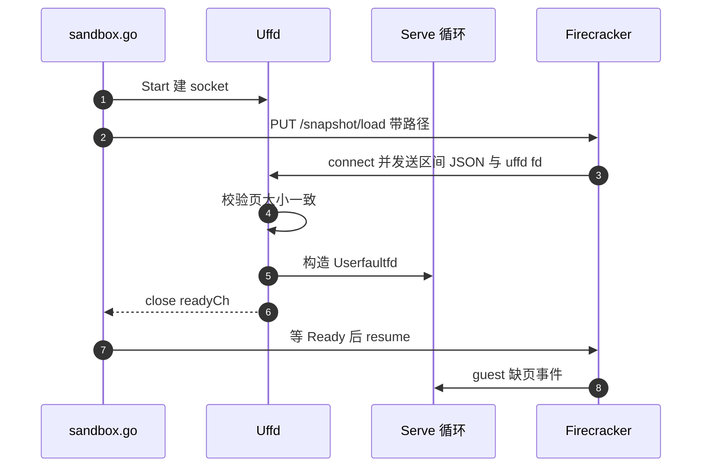
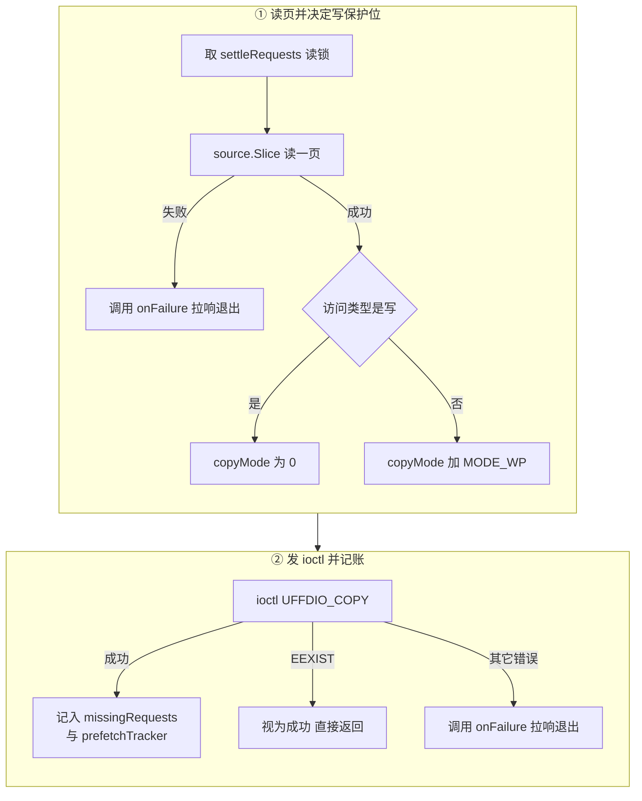

# 31 · 内存后端：uffd 服务

> 一台从快照恢复的沙箱，guest 内存不是由内核从文件里换页进来的，而是由 orchestrator 进程一页一页
> 送进去的。本篇讲这个「送页的人」：它怎么从 Firecracker 手里拿到 userfaultfd、事件循环长什么样、
> 一次缺页要走哪几步、并发到什么程度、出错时怎么让沙箱停下，以及暂停时它怎么交出脏页位图。
>
> **读者**：读过 [第 05 篇](05-userfaultfd.md) 的 userfaultfd 接口说明，想看一个生产实现怎么落地的读者。
> **预备**：[第 05 篇 · userfaultfd](05-userfaultfd.md)（API、事件结构、写保护）；
> [第 30 篇 · block 包](30-block-layer.md)（`Slicer` 背后的缓存与分片读取）。
> **代码**：`packages/orchestrator/internal/sandbox/uffd/uffd.go`、
> `uffd/memory_backend.go`、`uffd/noop.go`、`uffd/fdexit/fdexit.go`、`uffd/memory/`、
> `uffd/userfaultfd/userfaultfd.go`、`uffd/userfaultfd/fd.go`；
> `internal/sandbox/sandbox.go` 的 `serveMemory()`、`internal/sandbox/fc/memory.go`。

---

## 0. 本篇要回答的问题

1. orchestrator 里「内存后端」是一个什么抽象？为什么它有两个实现，各自服务哪条启动路径？
2. 从建立 Unix socket 到「可以让 Firecracker 恢复 vCPU」之间，代码做了哪几件事？哪一步是就绪的判据？
3. `Serve()` 这个事件循环里，除了「读事件、填页」之外的那些分支在防什么？
4. 一次缺页从事件到 `UFFDIO_COPY` 要经过哪些换算与检查？`EEXIST` 为什么算成功？
5. 在途缺页有上限吗？填不出页时谁停下、谁去杀 Firecracker？
6. 暂停一台沙箱时，脏页位图是这个服务算出来的，还是别人算出来的？

---

## 1. 内存后端是一个接口

orchestrator 有两条把沙箱跑起来的路径：从快照恢复（`sandbox.go` 的 `ResumeSandbox()`）与冷启动
（`CreateSandbox()`，只有模板构建时走，见
[第 27 篇 §7](27-resume-sandbox.md#7-与-createsandbox-的区别)）。
两条路径对 guest 内存的处理完全不同：恢复路径的内存来自快照产物，必须按需从存储层取；
冷启动路径的内存由 Firecracker 自己 `mmap` 出来，从零开始，没人需要送页。

但沙箱对象的其余部分不想知道这个区别。`Pause()` 要拿脏页元数据，清理逻辑要能把内存服务停掉，
恢复流程要等一个「就绪」信号 —— 这些调用点在两条路径上是同一份代码。于是
`uffd/memory_backend.go` 定义了 `MemoryBackend` 接口，七个方法：

| 方法 | 语义 |
|---|---|
| `Start(ctx, sandboxId)` | 建立 socket、启动后台服务；不阻塞 |
| `Ready() chan struct{}` | 握手完成（或提前失败）后关闭的 channel |
| `Exit() *utils.ErrorOnce` | 服务终止的信号与终止原因 |
| `Stop()` | 主动叫停 |
| `DiffMetadata(ctx, f)` | 暂停后取脏页位图 |
| `Prefault(ctx, offset, data)` | 主动把一页填进 guest 内存 |
| `PrefetchData(ctx)` | 交出本次运行的缺页序列 |

两个实现：`uffd.Uffd`（`uffd.go`）与 `uffd.NoopMemory`（`noop.go`）。
`sandbox.go` 在冷启动路径上装的是 `uffd.NewNoopMemory(memfileSize, memfile.BlockSize())`，
它的 `Start` 什么都不做、`Ready()` 返回一个已关闭的 channel、`Prefault` 直接返回 nil。
恢复路径上装的是 `uffd.New(memfile, fcUffdPath)`。

这个接口的代价是把两种差别很大的东西套进了同一组方法名。最明显的痕迹在 `DiffMetadata()`：
两个实现的语义并不相同，见 [§6](#6-暂停时的脏页位图)。收益是 `Sandbox` 结构里只有一个字段
`memory uffd.MemoryBackend`（`sandbox.go`），生命周期与暂停逻辑不必分叉。

---

## 2. 握手：从 socket 到就绪

`uffd.go` 里 `Uffd` 结构的字段说明了这个服务要协调的几件事：

- `lis *net.UnixListener` 与 `socketPath`：Firecracker 会连过来的那个 Unix socket；
- `memfile block.ReadonlyDevice`：页内容的来源，也就是模板的内存文件
  （[第 30 篇 §5](30-block-layer.md#5-基底从-header-到一次范围读)）；
- `handler utils.SetOnce[*userfaultfd.Userfaultfd]`：握手成功后才存在的事件循环对象；
- `fdExit utils.SetOnce[*fdexit.FdExit]`：叫停用的管道；
- `readyCh` 与 `readyOnce`：就绪信号；
- `exit *utils.ErrorOnce`：终止信号与原因。

`SetOnce[T]` 是一个「只能落一次值、可以带错误、允许多个等待者」的容器。用它而不是普通字段，
是因为握手在后台 goroutine 里完成，而预取线程可能在握手完成之前就想调 `Prefault()`。

### 2.1 Start 做的事

`Start()` 是同步的，只做三件不会阻塞的事，然后起一个 goroutine 就返回：

1. `net.ListenUnix` 在 `socketPath` 上监听。这个路径由 `sandboxFiles.SandboxUffdSocketPath()` 给出。
2. `os.Chmod(socketPath, 0o777)`。Firecracker 进程与 orchestrator 不一定同一个用户，
   放开权限是最省事的做法；代价是同一台宿主上任何用户都能连这个 socket。
   握手协议本身没有认证 —— 连上去就能收到一个 uffd。
3. `fdexit.New()` 创建退出管道，存进 `u.fdExit`。

任何一步失败都要把已经建好的 listener 关掉，代码用 `errors.Join(err, closeErr)` 把两个错误一起返回。

后台 goroutine 里跑的是 `u.handle(ctx, sandboxId, fdExit)`，它返回就意味着这个内存服务的一生结束了。
`handle` 返回后做四件收尾：如果失败发生在 `handler` 落值之前，用 `u.handler.SetError(handleErr)`
把所有等在 `Prefault()` 上的预取 goroutine 解开；关闭 listener 与退出管道；把三个错误合并进
`u.exit`；最后 `readyOnce.Do(close(u.readyCh))`。

最后这一步值得单独说：**失败时也要关 `readyCh`**。`Ready()` 的语义因此不是「已就绪」而是
「不必再等」—— 等待者拿到的可能是成功，也可能是一个已经死掉的服务，它必须再看 `Exit()`。
`sandbox.go` 正是这么用的：调 `fcHandle.Resume()` 之前起一个 goroutine 等 `fcUffd.Exit().Wait()`，
一旦内存服务先退出就 cancel 掉 resume 的 context。

`uffd.go` 里 `Start` 上方还留着一行 `TODO: If the handle function fails, we should kill the sandbox`。
实际的补救在别处：`sandbox.go` 的 exit-wait goroutine 用 `select` 同时等 `fcUffd.Exit().Done()`
与 `fcHandle.Exit.Done()`，谁先结束都调 `sbx.Stop()`（[第 39 篇 §4](39-health-errors-and-teardown.md#4-两段式拆除stop-与-close)）。

### 2.2 handle：一次 ReadMsgUnix

`handle()` 的主体是一次性的握手，协议细节在 [第 05 篇 §5](05-userfaultfd.md#5-firecracker-怎么把-uffd-交出去)，
这里只看实现上的约束：

```go
const (
	uffdMsgListenerTimeout = 10 * time.Second
	fdSize                 = 4
	regionMappingsSize     = 1024
)
```

- **监听有截止时间。** `u.lis.SetDeadline(time.Now().Add(uffdMsgListenerTimeout))`，
  10 秒内 Firecracker 没连过来，`Accept()` 就超时，整条恢复路径失败。
  这个超时覆盖的是「orchestrator 发出 `PUT /snapshot/load` 到 Firecracker 完成 `mmap`、创建并注册
  uffd、连回来」的全过程。
- **区间描述的缓冲区是固定的 1024 字节。** 收区间 JSON 用的是
  `make([]byte, regionMappingsSize)`，一次 `ReadMsgUnix` 读完，不循环、不检查是否被截断。
  guest 内存的区间数很少（推论：一台沙箱通常只有一到两个区间，1024 字节绰绰有余），
  但这是一个隐式假设：区间多到 JSON 超过 1 KiB 时，`json.Unmarshal` 会在半截 JSON 上报错，
  错误信息不会提示是缓冲区太小。
- **控制消息必须恰好一条、恰好一个 fd。** `ParseSocketControlMessage` 之后两次长度检查，
  不满足就报错退出。

拿到 `[]memory.Region` 与 fd 之后，`memory.NewMapping(regions)` 构造地址映射，
`userfaultfd.NewUserfaultfdFromFd()` 构造事件循环对象。**构造时就校验块大小**：

```go
for _, region := range m.Regions {
	if region.PageSize != uintptr(blockSize) {
		return nil, fmt.Errorf("block size mismatch: %d != %d for region %d", ...)
	}
}
```

内存文件的块大小（`memfile.BlockSize()`）必须与 Firecracker 报上来的每个区间页大小相等。
不等就在这里失败，而不是等到第一次缺页时填了半页。这条约束把存储层的块大小与 guest 的页大小
绑成了一个数：4 KiB 模板的区间页大小必须是 4 KiB，大页模板必须是 2 MiB
（[第 32 篇 §5](32-memory-prefetch-and-hugepages.md#5-大页改变了哪些量)）。

然后是 `u.handler.SetValue(uffd)`、`readyOnce.Do(close(u.readyCh))`、进入 `Serve()`。
`defer` 里注册了 `uffd.Close()`，也就是关掉那个从 Firecracker 收来的 fd。



---

## 3. 事件循环

事件循环在 `uffd/userfaultfd/userfaultfd.go` 的 `Userfaultfd.Serve()`。
它只 poll 两个描述符：uffd 本身与 `fdExit.Reader()`。

### 3.1 退出优先于缺页

每次 `unix.Poll` 返回后，代码**先看退出 fd**。退出 fd 上有 `POLLIN` 时：

```go
errMsg := u.wg.Wait()
if errMsg != nil {
	return fmt.Errorf("failed to handle uffd: %w", errMsg)
}
return nil
```

`u.wg` 是 `errgroup.Group`，`Wait()` 等所有在途的填页 goroutine 结束。这一步不能省：
`handle()` 在 `Serve()` 返回后立刻 `Close()` 那个 fd，若还有 goroutine 正在 `UFFDIO_COPY`，
它会对一个已关闭的 fd 发 ioctl。等待也意味着**叫停不是立即生效的**：一个卡在对象存储读取上的
填页 goroutine 会把退出拖到它自己超时为止。

`Stop()` 的实现就是 `fdExit.SignalExit()`，`FdExit` 里用 `sync.OnceValue` 包住那次写，
所以重复叫停是安全的、只写一个字节。`FdExit.Close()` 也会先 `SignalExit()` 再关两端。

### 3.2 三类防御性分支

除了正常路径，循环里还有三组分支，都是实测中遇到过的情况：

- **`poll` 返回 `EINTR` 或 `EAGAIN`**：打一条 debug 日志，`continue` 回去继续 poll。
- **`poll` 返回了但 uffd 上没有 `POLLIN`**：代码注释指向 Firecracker 的 issue 5056 与内核
  `fs/userfaultfd.c`，说明这不是理论情况。这时不能去 `read`，只能重新 poll。
- **`read` 返回 `EAGAIN`**：uffd 是非阻塞的，poll 说有数据、read 说没有，仍然要回去 poll。

后两种如果每次都打日志，一台高缺页率的沙箱会把日志刷满。代码为此写了 `counter_reporter.go` 的
`counterReporter`：`Increase()` 只累加计数与首末时间戳，直到一次成功的 `read` 之后调 `Log()`
或循环结束时 `Close()` 才把「累计多少次、从什么时候到什么时候」打成一条日志。
`Serve()` 里建了四个这样的计数器：uffd 的 `EAGAIN`、无数据、以及两个 fd 上的
`POLLHUP` / `POLLERR` / `POLLNVAL`。

后两个只计数、不改变控制流 —— 退出 fd 或 uffd 上出现 `POLLERR`，循环照常往下走。
这是一个有意的选择：这些事件的含义在 userfaultfd 上没有明确文档（代码注释里写着
`TODO: Check for all the errors`），与其猜错了提前退出，不如记下来继续跑，真出问题会在
`read` 或 `copy` 上暴露。

### 3.3 解码与分派

读出的 `buf` 按 `UffdMsg` 结构解释（`unsafe.Pointer` 强转，结构定义在 `fd.go` 的 cgo 块里）。
`event` 字段必须是 `UFFD_EVENT_PAGEFAULT`，否则返回 `ErrUnexpectedEventType`。
注意 Firecracker 侧协商了 `EVENT_REMOVE` 特性（为 balloon 设备准备），也就是说
**如果 guest 真的用了 balloon 并触发 `madvise`，这个循环会因为收到 `UFFD_EVENT_REMOVE` 而报错退出**。
推论：e2b 的沙箱不启用 balloon 设备，所以这条路径实际不会走到。

取出 `flags` 与 `address` 之后，先做地址换算：

```go
offset, pagesize, err := u.ma.GetOffset(addr)
```

`memory/mapping.go` 的 `GetOffset()` 在 `Regions` 上**线性查找**包含该宿主虚拟地址的区间，
返回 `addr - BaseHostVirtAddr + Offset` 与该区间的页大小。区间数是个位数，线性查找没有问题。
换算失败（地址不属于任何区间）直接终止整个循环，而不是跳过这一个事件 —— 出现这种情况说明
握手拿到的区间描述与 Firecracker 实际注册的不一致，继续服务只会喂给 guest 错误的页。

分派按 `flags` 三分支，前两个都是 `u.wg.Go(...)` 起 goroutine 后 `continue`：

| `flags` | 含义 | 传给 `faultPage` 的 `accessType` |
|---|---|---|
| 含 `UFFD_PAGEFAULT_FLAG_WRITE` | 写一个尚无物理页的地址 | `block.Write` |
| `0` | 读一个尚无物理页的地址 | `block.Read` |
| 其它（MINOR / WP） | 不应出现 | 返回错误，终止循环 |

主循环本身不做任何 I/O，读完事件就回去 poll。

---

## 4. 一次缺页

`faultPage()` 是这个包里唯一真正搬数据的函数。缺页路径与预取路径共用它，区别只在参数：
缺页传 `u.src`（模板内存文件）与 `fdExit.SignalExit`，预取传一个包着现成字节的
`directDataSource` 与 `nil`。



**读一页。** `source.Slice(ctx, offset, int64(pagesize))` 是 `block.Slicer` 接口
（`block/device.go`），背后可能命中本地缓存、可能触发一次对象存储的范围读
（[第 30 篇 §6](30-block-layer.md#6-两种-chunker)）。这是整条路径上唯一可能花几十毫秒的一步。

**决定写保护位。** 上游 2026.09 的规则是三行：

```go
if accessType != block.Write {
	copyMode |= UFFDIO_COPY_MODE_WP
}
```

`UFFDIO_COPY` 默认清掉目标页的 WP 位，所以「读缺页与预取填进来的页要显式保留 WP」，
写缺页不必保留（它本来就要被写）。这条规则是脏页判据 `present && !uffd-wp` 成立的前提，
机制见 [第 05 篇 §4](05-userfaultfd.md#4-写保护)。

规则与分叉 Firecracker 的读法是一一对应的：`src/vmm/src/utils/pagemap.rs` 的
`is_page_dirty()` 判 `is_present() && !is_write_protected()`，而 `is_write_protected()`
读的就是 `/proc/self/pagemap` 条目里的 **bit 57**（该文件的注释写明这一位表示
「页被 userfaultfd 写保护」）。于是带 `MODE_WP` 填进去的页 bit 57 为 1，不算脏；
写缺页不带 `MODE_WP`，内核清掉这一位，该页算脏。少填一次 `MODE_WP`，
这一位就永远是 0，判据随之退化成「常驻即脏」——ARM 适配版正是如此，见 [§7](#7-arm-适配版的差异)。

注意 `Prefault` 传的 `accessType` 是
`block.Prefetch`，也落在「不是写」这一侧，因此预取填进来的页记为干净 —— 预取不应该把一页
变脏，否则下次暂停时这些页会白白进 diff。

**发 ioctl。** `fd.go` 的 `Fd.copy()` 做两件事：把目标地址向下对齐到页边界
（`CULong(addr) &^ CULong(pagesize-1)`，因为事件里的地址是触发访问的精确地址而不是页首），
以及检查内核回填的 `copy` 字段等于请求长度 —— `UFFDIO_COPY` 允许部分完成，不检查就是静默丢数据。

**`EEXIST` 视为成功。** 目标页已经有物理页时内核返回 `EEXIST`。这在两种情况下是正常的：
两个 vCPU 几乎同时缺同一页，两个 goroutine 都跑到了 `copy`；或者预取线程与缺页处理撞在同一页上。
代码给 span 打一个 `uffd.already_mapped` 属性后返回 nil。这是「多做一次无害」的典型：
两条路径填的是同一份内容，谁先到都对。

**记账。** 成功后 `missingRequests.Add(offset)` 与 `prefetchTracker.Add(offset, accessType)`。
前者是一个按块索引的位图（`block/tracker.go`），后者按顺序记下偏移与访问类型，
在暂停时交给 `PrefetchData()`，成为下一次启动的预取清单
（[第 32 篇 §2](32-memory-prefetch-and-hugepages.md#2-预取映射从哪来)）。

`faultPage()` 开头还有一个 `defer recover()`：panic 只记一条日志，不让一个 goroutine 的崩溃
带走整个 orchestrator 进程。代价是这次缺页既没填页也没叫停，对应的 vCPU 会一直挂着。

---

## 5. 并发与失败

### 5.1 在途上限

`NewUserfaultfdFromFd()` 里：

```go
u.wg.SetLimit(maxRequestsInProgress)
```

`maxRequestsInProgress` 是 4096。代码注释说明了两件事：这个限制原本没有；加上之后
「在一些简短测试里，高并发下的处理表现反而变好了」。

需要并发是清楚的：多个 vCPU 同时缺页，而一次 `Slice` 可能要走网络，串行处理会把并发缺页排成队。
需要上限则没那么直觉。注释给出的另一半原因在结构体字段旁边：

```go
// We don't skip the already mapped pages, because if the memory is swappable
// the page *might* under some conditions be mapped out.
```

早期实现会用 `missingRequests` 跳过已经填过的页；现在不跳了，因为可交换的普通页理论上可能被换出，
跳过就会漏填。不跳的代价是同一页可以被重复处理，在途请求数因此可能远超实际缺页数 ——
`errgroup` 的上限就是这里的兜底。上限用满时 `wg.Go` 会阻塞主循环，缺页事件在内核队列里排队，
这是一个背压：orchestrator 宁可让内核那边堆积，也不无限制地开 goroutine。

### 5.2 settleRequests 这把锁

`Userfaultfd` 里有一把 `sync.RWMutex` 叫 `settleRequests`。每个 `faultPage()` 在自己的 goroutine 里
取读锁并 `defer` 释放；`PrefetchData()` 与 `faulted()` 取写锁。

它保护的不是位图本身（`Tracker` 内部已有自己的锁），而是**一致的时刻**：写锁只有在所有在途填页
都结束之后才能拿到，于是 `PrefetchData()` 拿到的是一份「没有半完成请求」的快照。
注释特别指出 `RLock` 必须在 goroutine 内部取，不能在主循环里取了再传进去 —— 否则
goroutine 提前返回时 `RUnlock` 不会执行。

### 5.3 失败时谁停下

`faultPage()` 的 `onFailure` 参数在缺页路径上是 `fdExit.SignalExit`。取不到数据或
`UFFDIO_COPY` 失败时，先调 `onFailure()`，再把两个错误 `errors.Join` 起来返回。

这个设计的理由是取舍明确的：取不到某一页而让 guest 继续跑，等于给它一页内容未定义的内存，
是静默的数据损坏；让整个内存服务停下，guest 会在下一次缺页时永远挂住，宿主侧则收到一个明确的
错误。停下之后的连锁反应在沙箱层：`Serve()` 返回错误 → `handle()` 返回 → `u.exit` 落错误 →
`sandbox.go` 的 exit-wait goroutine 被唤醒 → `sbx.Stop()` 杀掉 Firecracker 进程。

预取路径传 `nil`，因为预取失败只是白跑一趟，那一页稍后仍会以缺页的形式再来一次。

---

## 6. 暂停时的脏页位图

`Uffd.DiffMetadata()` 只有一行：

```go
func (u *Uffd) DiffMetadata(ctx context.Context, f *fc.Process) (*header.DiffMetadata, error) {
	return f.DirtyMemory(ctx, u.memfile.BlockSize())
}
```

也就是说，**脏页不是这个服务算的**。它把请求转给 `fc/memory.go` 的 `Process.DirtyMemory()`，
后者走 `fc/client.go` 的 `dirtyMemory()`，调分叉 Firecracker 的 `GetDirtyMemory` 操作 ——
HTTP 上是 `GET /memory/dirty`（路径写在生成代码
`packages/shared/pkg/fc/client/operations/operations_client.go` 的 `PathPattern` 里），
把返回的 `Bitmap` 包成 `header.DiffMetadata{Dirty: ..., Empty: bitset.New(0), BlockSize: ...}`。
Firecracker 侧怎么用 `mincore` 加 pagemap 算出这个位图，见
[第 05 篇 §4.3](05-userfaultfd.md#43-谁去读-pagemap)；位图之后怎么变成 diff 产物，见
[第 37 篇 §3](37-pause-and-snapshot.md#3-脏页判据)。

这里有三点值得记住。

**其一，调用时机是有前置条件的。** 函数上方的注释写着必须在沙箱经 API 暂停、且 snapshot 端点
调用之后才能调。原因是位图来自 Firecracker 进程当前的页表状态：VM 还在跑的时候读，
读到的是一个正在变化的快照。`sandbox.go` 的 `Pause()` 严格按这个顺序：
`s.process.Pause()` → `CreateSnapshot()` → `s.Resources.memory.DiffMetadata()`。

**其二，`Uffd` 的实现里 `Empty` 是空位图。** 它只报告哪些块脏，不报告哪些块全零。
`NoopMemory.DiffMetadata()` 走的是另一条路（`Process.MemoryInfo()` → `GetMemory` 操作），
拿回 `Resident` 与 `Empty` 两个位图，做 `Dirty.Difference(Empty)` 再反推出完整的 `Empty`。
两个实现同名同签名，语义并不对称：冷启动路径没有 uffd，「哪些页被碰过」只能靠 `mincore` 的常驻
页近似，而全零页的过滤在那条路径上更值钱（一个刚构建出来的模板有大量从未写过的零页）。

**其三，这条链路依赖分叉 Firecracker。** `GetDirtyMemory` 与 `GetMemory` 都不是上游 Firecracker
的接口（[第 70 篇 §2](70-firecracker-fork.md#2-分叉改了什么)）。内存后端的抽象干净，
但它下面压着一个非标准的 VMM。

---

## 7. ARM 适配版的差异

ARM 适配版对这个包改了两处。`uffd/userfaultfd/userfaultfd.go` 里设置 `UFFDIO_COPY_MODE_WP` 的
三行被整体注释掉，`copyMode` 恒为 0：填页不再保留写保护位，pagemap 的 bit 57 永远是 0，
`GetDirtyMemory` 的判据退化成「常驻即脏」。正确性不受影响（脏页集合只会变大不会变小），
但内存 diff 变成真实脏页集的超集，暂停的产物体积与耗时都上去了。
`uffd/uffd.go` 里 `uffdMsgListenerTimeout` 从 10 秒放宽到 120 秒，握手窗口大幅放大。
两处的动机、代价与可回退性见 [第 72 篇 §3](72-uffd-on-arm.md#3-判据是怎么塌缩的)；
超时一类参数放宽的整体情况见 [第 71 篇 §9](71-orchestrator-arm-fc-changes.md#9-参数总表)。

---

## 8. 小结

- `MemoryBackend` 是一个七方法接口，`Uffd` 服务恢复路径，`NoopMemory` 服务冷启动路径；
  `Sandbox` 只持有接口，不知道自己的内存从哪来。
- `Start()` 只做不阻塞的三件事（listen、chmod 0777、建退出管道）就返回，握手在后台 goroutine 里；
  `Ready()` 的语义是「不必再等」而非「已就绪」，失败时同样会关闭，调用方必须配合 `Exit()` 使用。
- 握手有三个硬约束：10 秒的 `Accept` 截止时间、1024 字节的区间 JSON 缓冲区、
  区间页大小必须等于内存文件的块大小 —— 最后一条在构造时就检查，不留到第一次缺页。
- `Serve()` 每轮先看退出 fd，收到信号时先 `errgroup.Wait()` 再返回，避免对已关闭的 fd 发 ioctl；
  叫停因此不是立即生效的。
- 循环里三组防御分支（`EINTR` / `EAGAIN` / poll 后无数据）对应实测遇到过的内核与
  Firecracker 行为；高频事件用 `counterReporter` 累计后再打一条日志。
- 一次缺页是：地址经 `Mapping.GetOffset()` 换算成文件偏移 → `Slicer.Slice()` 取一页 →
  按访问类型决定是否带 `UFFDIO_COPY_MODE_WP` → `UFFDIO_COPY` → 记账。`EEXIST` 视为成功，
  因为并发缺页与预取撞车时两边填的是同一份内容。
- 每个缺页一个 goroutine，在途上限 4096。上限不是为了限并发本身，而是因为实现刻意不跳过
  已填过的页，重复请求需要一个兜底。
- 取数据或填页失败时调 `fdExit.SignalExit()`：宁可让沙箱停下，也不给 guest 一页未定义内容。
  预取路径不叫停，失败只是白跑一趟。
- 脏页位图由分叉 Firecracker 算、经 `GET /memory/dirty` 交回，`Uffd.DiffMetadata()` 只是转发；
  它必须在 VM 暂停且快照创建之后调用。

---

## 延伸阅读 / 下一篇

- [第 05 篇 · userfaultfd](05-userfaultfd.md)：本篇依赖的内核接口、事件结构与写保护语义。
- [第 30 篇 §5 · 基底](30-block-layer.md#5-基底从-header-到一次范围读)：`Slicer.Slice()` 背后发生了什么。
- [第 32 篇 §3 · 预取怎么跑](32-memory-prefetch-and-hugepages.md#3-预取怎么跑)：`Prefault()` 与 `PrefetchData()` 的另一半。
- [第 27 篇 §4 · 串行段](27-resume-sandbox.md#4-串行段从-fcnewprocess-到-resumevm)：`serveMemory()` 在整条恢复流水线中的位置。
- [第 33 篇 §4 · 两个 rootfs provider](33-nbd-and-rootfs.md#4-两个-rootfs-provider)：磁盘一侧的同类服务，另一套内核接口。
- [第 37 篇 §3 · 脏页判据](37-pause-and-snapshot.md#3-脏页判据)：`DiffMetadata()` 之后的全过程。
- [第 72 篇 §3 · 判据塌缩](72-uffd-on-arm.md#3-判据是怎么塌缩的)：写保护位被注释掉之后的连锁反应。
- 下一篇：[第 32 篇 · 预取与大页](32-memory-prefetch-and-hugepages.md) —— 把缺页提前吃掉与把缺页次数砍掉。
