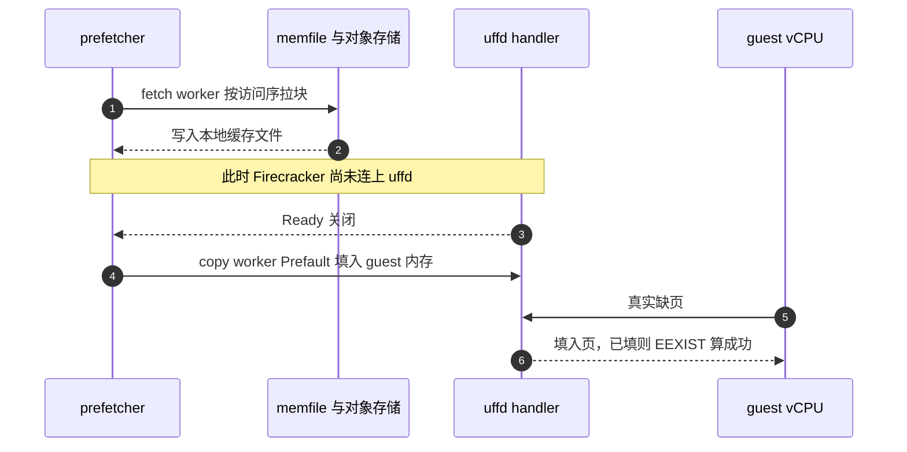

# 32 · 预取与大页

> 按需缺页把「拉起一台沙箱」的成本从「搬完整个内存文件」降到「搬用得着的那部分」，
> 代价是这部分的每一页都要等一次用户态往返。预取想把这条延迟提前吃掉；大页想把往返的次数直接砍掉。
> 两者都不是白拿的：预取会多占带宽与常驻内存，大页会把差分的粒度放大到 2 MiB。
>
> **读者**：读过 [第 31 篇 · 内存后端](31-uffd-memory-backend.md)、知道缺页事件怎么被处理的读者。
> 　**预备**：[第 04 篇 · KVM 与内存虚拟化](04-kvm-and-memory-virtualization.md)、
> [第 30 篇 · block 包](30-block-layer.md)、[第 31 篇](31-uffd-memory-backend.md)。
> 　**代码**：`packages/orchestrator/internal/sandbox/uffd/prefetch/prefetcher.go`、
> `packages/orchestrator/internal/sandbox/block/prefetch_tracker.go`、
> `packages/orchestrator/internal/template/metadata/prefetch.go`、
> `packages/orchestrator/internal/sandbox/sandbox.go`、
> `packages/orchestrator/internal/sandbox/fc/client.go`、
> `packages/api/internal/sandbox/sandbox_features.go`

---

## 0. 本篇要回答的问题

1. 按需缺页的延迟具体花在哪里？预取想省掉的是哪一段？
2. 预取的「要取哪些页」这份数据从哪来、由谁采集、存在什么地方、准不准？
3. fetch worker 和 copy worker 各做什么？为什么要拆成两组而不是一组？
4. 预取的代价是什么？它在什么情况下是净亏损？
5. 大页在 orchestrator 这一侧到底改变了哪些量？为什么说它同时降低缺页次数又放大差分？
6. 大页开关由谁决定？它是不是模板作者能设的选项？

---

## 1. 按需缺页的账

一台沙箱从快照恢复时，guest 内存不是被整体读进来的，而是注册给 userfaultfd 之后按 guest 的访问逐块填入。
每一块的填入包含四段开销：

1. guest 触碰未映射的地址，宿主产生缺页，内核把事件写进 uffd 的 fd；
2. orchestrator 的事件循环从 `poll` 返回，解析出宿主虚拟地址，换算成内存文件里的偏移；
3. 按这个偏移向 block 层要数据 —— 命中本地缓存文件就是一次 mmap 读，未命中就要从对象存储拉一个
   4 MiB 的分片（`packages/shared/pkg/storage/storage.go` 的 `MemoryChunkSize`）；
4. `UFFDIO_COPY` 把数据写进 guest 内存，唤醒被挡住的 vCPU。

第 1、2、4 段是固定开销，量级在微秒；第 3 段在未命中时是网络往返，量级在毫秒，而且**串行地挡在
vCPU 前面**。恢复一台沙箱要触碰的块数少则几百、多则上万，其中相当一部分是每次恢复都会碰的同一批：
guest 内核的正文与页表、envd 的代码页、语言运行时的堆。这批块的第一次访问在时间上高度集中，
集中在恢复后的前几十毫秒 —— 也就是用户等待「沙箱可用」的那段时间。

预取要做的事只有一件：**把这批块的第 3 段提前到 vCPU 还没跑起来的时候做完**，
让真正的缺页事件落在已经缓存好、甚至已经填好的块上。

这里有一个前提值得点明：block 层的缓存是**按块幂等**的。同一块被拉两次不会出错，
只会浪费一次带宽；`UFFDIO_COPY` 对已映射的页返回 `EEXIST`，
`packages/orchestrator/internal/sandbox/uffd/userfaultfd/userfaultfd.go` 的 `faultPage` 把它当成成功处理。
预取因此可以做成一个「尽力而为、失败不影响正确性」的旁路，而不必和缺页处理器抢锁或者协调状态。

---

## 2. 预取映射从哪来

### 2.1 采集：谁在记录

记录发生在 uffd 的填页路径上。`Userfaultfd` 结构里除了 `missingRequests` 之外还挂了一个
`prefetchTracker *block.PrefetchTracker`，在 `NewUserfaultfdFromFd` 里按内存文件的块大小创建。
`faultPage` 每成功填一块，就调用 `u.prefetchTracker.Add(offset, accessType)`。

`packages/orchestrator/internal/sandbox/block/prefetch_tracker.go` 的 `Add` 做三件事：
把偏移换算成块索引；如果这个索引还没记过，就连同一个自增的 `Order` 与访问类型
（`Read` / `Write` / `Prefetch`）一起存进 map；已经记过的不动。
于是这份数据是「**去重的、带首次访问序号的块索引集合**」，而不是访问序列。
`Order` 记的是本块第一次被填入时的名次。

`PrefetchTracker.PrefetchData()` 取数据时先把 `isTracking` 置 false 停止记录，
再在自己的读锁下复制一份 map；外层的 `Userfaultfd.PrefetchData()` 另取 `settleRequests` 的**写锁**，
保证复制的那一刻没有在途的填页请求（[第 31 篇 §5.2](31-uffd-memory-backend.md#52-settlerequests-这把锁)）。
停止记录是有意的：采集点之后的访问不再计入，采集到的就是「启动阶段」这一段。
代码注释直言 `isTracking` 与锁之间有竞态但不予处理 —— 多记或少记几块只影响下一次预取的质量。

### 2.2 两条采集路径

一条在模板构建里。`packages/orchestrator/internal/template/build/phases/optimize/builder.go` 是构建流水线
末尾的 optimize 阶段（[第 42 篇 §3](42-build-phases.md#3-五类阶段)），它不产生新的层，只更新元数据。
它做的事是：从 finalize 阶段的快照恢复一台沙箱、等 envd 就绪、调 `MemoryPrefetchData()` 取走这一轮的块集合，
如此重复 `prefetchIterations`（常量，值为 2）次，然后调用 `computeCommonPrefetchEntries` 取**交集**。

交集的规则写在 `optimize/prefetch.go` 里：只保留在所有轮次里都出现过的块索引；
`Order` 取各轮的算术平均；访问类型只要各轮不一致就降级成 `Read`。
取交集是为了滤掉随机成分 —— 时间戳、随机数、ASLR 之类只在某一轮碰到的页。
代价是漏掉真实但概率性的热点块，而且只跑两轮，这个滤波器相当粗。
访问类型降级成 `Read` 是保守的选择，理由见 §3.3。

另一条在运行时的 checkpoint 路径。`packages/orchestrator/internal/server/sandboxes.go` 在
`ResumeSandbox` 返回之后立刻调 `resumedSbx.MemoryPrefetchData(ctx)`，
注释写明「immediately after resume while it's most accurate」，
随后 `uploadPrefetchMappingAsync` 在后台把它转成映射、写回元数据、
调 `s.templateCache.Invalidate(meta.Template.BuildID)` 让缓存重新读。
这条路径没有多轮取交集，采到什么就是什么。

两条路径都不会因为预取失败而让主流程失败：optimize 阶段拿不到映射时打一条 warn 继续，
checkpoint 路径同理。

### 2.3 存在哪、长什么样

`packages/orchestrator/internal/template/metadata/prefetch.go` 的 `PrefetchEntriesToMapping`
把条目按 `Order` 排序，展平成三个并列字段，放进模板元数据的 `Prefetch.Memory`：

| 字段 | 类型 | 含义 |
|---|---|---|
| `Indices` | `[]uint64` | 按首次访问顺序排列的块索引 |
| `AccessTypes` | `[]AccessType` | 与 `Indices` 一一对齐的访问类型，取值 `r` / `w` / `p` |
| `BlockSize` | `int64` | 块大小，与内存文件一致 |

元数据整体是一个 JSON 对象，由 `metadata.UploadMetadata` 写到该 build 的
`StorageMetadataPath()`。也就是说，预取映射是**每个 build 一份**的产物，
和 memfile、rootfs、header 并列（[第 29 篇 §2](29-template-artifact-format.md#2-一代产物六个对象)）。
条目数等于块数：4 GiB 内存、2 MiB 块的模板最多 2048 个索引，
换成 4 KiB 块就是最多 1048576 个 —— 这个数量级差别在 §5 还会出现。

---

## 3. 预取怎么跑

### 3.1 起点：比 uffd 更早

`packages/orchestrator/internal/sandbox/sandbox.go` 在创建沙箱资源时，
把 uffd 的构造包在一个 promise 里，同时另起一个 goroutine 取模板的 memfile 与元数据。
只要 `meta.Prefetch != nil && meta.Prefetch.Memory != nil`，它就等 uffd 对象构造出来
（注意只是**对象**，不是服务就绪），然后再起一个 goroutine 调 `prefetch.New(...).Start(execCtx)`。

这个位置是有讲究的：此时 Firecracker 进程还没启动，更没有连上 uffd socket。
预取的取数据阶段不依赖 uffd，可以立刻开始跑；只有往 guest 内存里填的阶段才需要等。
拆成两组 worker 的直接原因就是这个。

### 3.2 两组 worker

`prefetch/prefetcher.go` 的 `Start` 建两条通道，容量都等于块总数：

```text
Indices（按访问序）
   │
   ├─► fetchCh（int64 偏移，容量 = 总块数，一次性灌满后 close）
   │
   │   fetchWorker × maxFetchWorkers
   │     source.Slice(ctx, offset, blockSize)   ← 填充本地缓存文件
   │
   ├─► copyCh（offset + data，容量 = 总块数）
   │
   │   copyWorker × maxCopyWorkers（等 uffd.Ready 之后才启动）
   │     uffd.Prefault(ctx, offset, data)       ← UFFDIO_COPY 进 guest 内存
   ▼
```

- **fetch worker** 调用 `p.source.Slice(ctx, offset, blockSize)`。source 是模板的 memfile，
  最终落到 `packages/orchestrator/internal/sandbox/block/chunk.go` 的 `NewChunker` 选出的那个
  chunker —— 默认是 `FullFetchChunker`，`chunker-config` 开关的 `useStreaming` 默认为 false
  （[第 30 篇 §6](30-block-layer.md#6-两种-chunker)）。本地缓存命中就直接返回 mmap 上的一段视图，
  未命中就按 4 MiB 分片从对象存储拉取并写进缓存文件。这一步是 I/O 密集的，所以并发度给得高。
- **copy worker** 调用 `uffd.Prefault(ctx, offset, data)`，一路走到 `Userfaultfd.Prefault`：
  用 `Mapping.GetHostVirtAddr(offset)` 换算宿主虚拟地址与该区间的页大小，
  校验 `len(data)` 恰好等于页大小，然后走和真实缺页同一个 `faultPage`，
  访问类型标成 `block.Prefetch`。这一步每块都是一次 ioctl，所以并发度给得低。

`startCopyWorkers` 是唯一的同步点：它在 `<-p.uffd.Ready()` 上阻塞，
就绪之后才拉起 copy worker。`Ready` 的通道由 `uffd.go` 在拿到 Firecracker 传来的 fd
与区间描述、构造出 `Userfaultfd` 之后关闭；handle 失败时也会关闭，
并且 `handler` promise 会被置错，让等在 `Prefault` 上的 goroutine 拿到错误而不是永久阻塞。

通道容量等于总块数，意味着 fetch worker 永远不会因为 copy 慢而阻塞。
这不像看上去那么贵：`Cache.Slice` 返回的是 mmap 区域上的切片，不是堆上的副本，
所以积压在 `copyCh` 里的是一堆指向缓存文件的视图，不是一份内存里的内存拷贝。



### 3.3 预取页上的写保护位

预取把大量页提前搬进 guest 内存，这里有一个直接的疑问：这些页会不会在下一次暂停时被当成脏页，
把差分撑大？答案是不会，理由在 `faultPage` 的一行判断上。

回顾：`UFFDIO_COPY` 默认清掉目标页的 userfaultfd 写保护位，`faultPage` 只在访问类型不是
`block.Write` 时补上 `UFFDIO_COPY_MODE_WP`，而分叉 Firecracker 把「常驻且未被写保护」
当作脏页判据（[第 31 篇 §4](31-uffd-memory-backend.md#4-一次缺页)
给出这条规则与 pagemap bit 57 的对应关系，
[第 04 篇 §7](04-kvm-and-memory-virtualization.md#7-脏页从哪里知道)给出判据的由来）。

`Prefault` 传下去的访问类型是 `block.Prefetch`，不等于 `Write`，因此预取页是**带 WP 位填入**的：
它常驻，但写保护位仍在，脏页位图里不置位。于是预取本身不放大快照 —— 只有 guest 真的写过的页
才会被清掉这一位。这也解释了 §2.2 里「各轮访问类型不一致就降级成 `Read`」的选择：
把一个块记成 `Write` 只会让它以后被无谓地算脏，记成 `Read` 至多多一次写保护缺页。
这条性质在 ARM 适配版上不成立，见 [§7](#7-arm-适配版的差异)。

---

## 4. 预取的代价

预取的收益是一段延迟，代价有四项，都不出现在成功日志里。

**带宽与 I/O。** 预取的块无论 guest 是否真的会碰都要拉一遍。交集滤波只保证「两轮都碰过」，
不保证这一次也碰。多拉的块占用对象存储带宽与本地缓存文件的空间，
在一个节点上同时恢复几十台沙箱时，这部分和真实缺页抢的是同一条链路。

**常驻内存。** copy worker 把块填进 guest 内存，这是**真实的物理页分配**。
预取 N 个块就把这台沙箱的常驻内存立刻抬高 N 个块。开了大页时一个块就是 2 MiB，
2000 个块是 4 GiB —— 等于把按需分配的收益还回去一大半。
节点的内存过量分配比例（[第 19 篇 §3](19-node-management-and-placement.md#3-放置算法采样过滤打分)）
是按配额算的，预取抬高的是实际占用，两者的差值因此变小。

**顺序只是近似。** `Indices` 是按首次访问序排的，`fetchCh` 也是按这个序灌进去的，
但默认有 16 个 fetch worker 并发消费，完成顺序取决于各自的 I/O 延迟。
`copyCh` 里的顺序进一步被打散。预取只保证「大致先取先需要的」，不保证严格有序。

**没有优先级，也没有退让。** 预取和真实缺页走同一个 block 层、同一个 uffd，
没有任何机制让真实缺页插队。`Start` 的错误被调用方记一条日志就丢掉
（`sandbox.go` 里的 `failed to start prefetcher`），单块失败只累加 `fetchSkippedCount` /
`copySkippedCount`。这是刻意的「fire and forget」：预取错了不影响正确性，
但也意味着预取拖慢真实缺页时，系统不会自我纠正，只能靠 §6 的两个特性开关手工压。

| 维度 | 纯按需缺页 | 开预取 |
|---|---|---|
| 启动阶段热块的首次访问 | 每块一次完整往返，串行挡住 vCPU | 多数已在缓存或已填入 |
| 对象存储读取量 | 只读真正碰过的块 | 加上映射里预取但未用到的块 |
| 恢复瞬间的常驻内存 | 随 guest 访问增长 | 立刻抬高到预取块总量 |
| 失败后果 | vCPU 阻塞直到取到 | 记一条 debug 日志，退回按需 |
| 需要的元数据 | 无 | 每 build 一份预取映射 |

---

## 5. 大页改变了哪些量

大页的基础 —— HugeTLB 是什么、为什么要预留、Firecracker 侧怎么开 —— 在
[第 04 篇 §6](04-kvm-and-memory-virtualization.md#6-大页) 讲过，这里只讲它在 orchestrator 这条路径上的后果。

### 5.1 它不是模板选项

一个容易产生的误解是：大页像 vCPU 数、内存大小那样，是模板作者填的一个字段。上游 2026.09 不是这样。
`packages/api/internal/sandbox/sandbox_features.go` 的 `HasHugePages()` 只看 Firecracker 版本：

```go
func (v *VersionInfo) HasHugePages() bool {
	if v.lastReleaseVersion.Major() >= 1 && v.lastReleaseVersion.Minor() >= 7 {
		return true
	}

	return false
}
```

版本串由 `NewVersionInfo` 从 `last_tag[-prerelease]_commit_hash` 这种形式里解析出来。
API 层在两处调用它：`packages/api/internal/orchestrator/create_instance.go` 里
`hasHugePages := fcSemver.HasHugePages()` 填进 `SandboxCreateRequest` 的 `SandboxConfig.HugePages`
（`packages/orchestrator/orchestrator.proto` 的 `bool huge_pages = 5`）；
`packages/api/internal/template-manager/create_template.go` 里
`HugePages: features.HasHugePages()` 填进 `TemplateConfig`。

也就是说，它是**由所用 Firecracker 版本推导、随每次请求下发的一个布尔值**，
用户在模板定义里没有对应的旋钮。orchestrator 侧 `internal/server/sandboxes.go` 把它读进
`sandbox.Config.HugePages`，最终由 `internal/sandbox/fc/client.go` 的 `setMachineConfig` 在
machine-config 上设成 `huge_pages: "2M"`。

推论：这个判断式写成 `Major() >= 1 && Minor() >= 7`，对主版本号跨到 2 之后的低次版本号会给出 false，
但在 2026.09 使用的 1.10 / 1.12 版本上不影响结果。

### 5.2 一个开关同时决定四个粒度

`packages/orchestrator/internal/template/build/config/config.go` 的 `MemfilePageSize(hugePages)`
在 `header.HugepageSize`（2 MiB）与 `header.PageSize`（4 KiB）之间二选一，
构建时用它决定内存文件的块大小（`build/phases/base/files.go`、`build/layer/create_sandbox.go`）。
这一个选择向下游传播成四个粒度：

| 粒度 | 谁用它 | 大页开时 |
|---|---|---|
| guest 内存映射的页大小 | Firecracker 的 mmap，经区间描述传给 orchestrator 的 `Region.PageSize` | 2 MiB |
| 内存文件的块大小 | header、block 层、缺页填入的单位 | 2 MiB |
| 预取映射的 `BlockSize` | `PrefetchTracker`、`Prefault` 的长度校验 | 2 MiB |
| 脏页位图的位宽 | 分叉 Firecracker 的 `get_dirty_memory(page_size)` | 2 MiB |

这四个必须一致，代码里有硬校验：`NewUserfaultfdFromFd` 遍历所有区间，
只要有一个 `region.PageSize != uintptr(blockSize)` 就直接报 `block size mismatch` 拒绝服务。
`Prefault` 也会检查 `len(data)` 是否恰好等于该区间的页大小。
这两处保证了「用 4 KiB 的块去填一个 HugeTLB 区间」这种错误不会静默发生。

### 5.3 收益：次数

对一台 4 GiB 的沙箱，4 KiB 页意味着最多约 1048576 个可缺页单位，2 MiB 页意味着最多 2048 个。
恢复阶段真正触碰的是其中一部分，但比例关系不变：**缺页事件数下降约 512 倍**。
每次事件的固定开销（`poll` 返回、地址换算、ioctl）是常数，所以这一项几乎线性地随事件数下降。
预取映射同样缩小 512 倍，元数据从上百万个索引变成上千个，
`Indices` 这个数组的序列化与解析成本从「需要考虑」变成「可以忽略」。

单次搬运的数据量则上升 512 倍。这是同一枚硬币：把很多次小往返换成少数几次大往返，
在往返固定开销高、后端吞吐充裕时是赚的，反过来就是亏的。
对象存储的分片是 4 MiB，2 MiB 的块正好是分片的一半，读放大反而比 4 KiB 块小。

### 5.4 代价：粒度浪费与差分放大

**常驻内存的粒度。** guest 碰到 2 MiB 区间里的任何一个字节，宿主就为它分配整个 2 MiB。
稀疏访问的区域因此被整块拉进常驻。与 §4 的第二项叠加：预取 + 大页意味着
「预取列表里的每一项都是 2 MiB 的实打实的物理内存」。

**差分放大。** 这是代价里最重的一项。脏页位图的位宽等于页大小（§5.2 第四行），
`fc/memory.go` 的 `DirtyMemory(ctx, blockSize)` 拿到的位图直接按这个粒度解释成
`header.DiffMetadata`。guest 在一个 2 MiB 页里改了一个字节，整页就要进差分。
每一代快照的产物大小因此不再是「改了多少」，而是「碰过多少个 2 MiB 页」
（[第 37 篇 §3](37-pause-and-snapshot.md#3-脏页判据)）。
对于频繁 pause / resume 的沙箱，这一项的累积成本可能超过大页省下来的缺页开销。

**预留。** HugeTLB 页必须从 `nr_hugepages` / `nr_overcommit_hugepages` 预留，
不能临时从普通页凑。这是部署侧的约束，见
[第 82 篇 §4](82-host-kernel-nbd-hugepages.md#4-大页预留算法与-aarch64-上的一个假设)。

---

## 6. 两个可调参数

预取的并发度是运行时读取的特性开关，不是编译期常量。
`packages/shared/pkg/feature-flags/flags.go`：

| 开关 | 上游默认 | 注释里的理由 |
|---|---|---|
| `memory-prefetch-max-fetch-workers` | 16 | 取数据是 I/O 密集的，可以给更高的并发 |
| `memory-prefetch-max-copy-workers` | 8 | 填页走 uffd 系统调用，限制并发以免压垮系统 |

`Start` 每次都用 `p.featureFlags.IntFlag(ctx, ...)` 现取，所以改动对新建的沙箱立即生效，
不需要重启 orchestrator（[第 14 篇 §2](14-config-flags-versions.md#2-特性开关)）。
两个值都是**每沙箱**的上限，不是节点级的，节点上的总并发是它乘以同时恢复的沙箱数 ——
在批量恢复时这是要盯的量。

关掉预取没有专门的开关。可用的手段是让映射不存在：
`packages/orchestrator/cmd/resume-build/main.go` 的 `-no-prefetch` 标志就是用一个包装类型
让元数据里的 `Prefetch` 返回 nil，`sandbox.go` 那个判断因此不成立。这是调试工具，不是生产开关。

---

## 7. ARM 适配版的差异

两处，方向相反。

其一，`packages/shared/pkg/feature-flags/flags.go` 的两个预取并发度默认值翻倍：
fetch worker 16 → 32，copy worker 8 → 16。
配套的还有 `max-sandboxes-per-node` 200 → 10000 等一批为单机形态放宽的默认值
（[第 77 篇 §4](77-api-and-flags-on-arm.md#4-预取-worker两个并发度各翻一倍)）。

其二，`packages/orchestrator/internal/sandbox/uffd/userfaultfd/userfaultfd.go` 里
设置 `UFFDIO_COPY_MODE_WP` 的三行被注释掉，`copyMode` 恒为 0，脏页判据塌缩成「常驻即脏」。
对预取而言这是一个直接后果：§3.3 说的「预取页带写保护位、不进差分」在 ARM 适配版上不成立，
**每一个预取进来的块都会被算成脏块**。预取块数越多，pause 产出的差分越大，
再叠加 §5.4 的 2 MiB 粒度，放大是相乘的。详见
[第 72 篇 §5](72-uffd-on-arm.md#5-后果二与预取相乘)。

另外，`packages/api/internal/sandbox/sandbox_features.go` 的 `NewVersionInfo` 加了越界保护：
ARM 适配版把默认 Firecracker 版本串改成不带 commit hash 的 `v1.13.1`，
原来的 `parts[1]` 会越界，改成先判长度。`HasHugePages()` 的判断逻辑本身没动，
1.13 仍然返回 true，所以 ARM 适配版上大页照常开启。

---

## 8. 小结

1. 按需缺页的延迟大头是「未命中本地缓存时向对象存储要一个 4 MiB 分片」这一段，
   它串行地挡在 vCPU 前面。预取要省的就是这一段。
2. 预取映射是每 build 一份的元数据，内容是去重的块索引 + 首次访问序号 + 访问类型，
   由 `PrefetchTracker` 在 uffd 填页路径上采集。
3. 采集有两条路径：构建的 optimize 阶段跑两轮取交集（`prefetchIterations = 2`），
   运行时的 checkpoint 路径在 resume 之后立刻采一次、后台上传并让模板缓存失效。
4. 执行拆成 fetch 与 copy 两组 worker：fetch 不依赖 uffd，可以在 Firecracker 起来之前就填本地缓存；
   copy 等 `uffd.Ready()` 之后才把块填进 guest 内存。通道容量等于总块数，fetch 永不被 copy 挡住。
5. 预取页用 `block.Prefetch` 访问类型填入，因此保留 `UFFDIO_COPY_MODE_WP`，
   在上游的脏页判据下不算脏页，不会放大差分。
6. 预取的代价是多拉的带宽、立刻抬高的常驻内存、只近似的顺序，以及没有优先级与退让机制。
   它是 fire-and-forget 的，出问题时只能靠两个特性开关手工压并发。
7. 大页开关不是模板选项：`HasHugePages()` 按 Firecracker 版本（1.7 及以上）推导，
   随 gRPC 请求的 `huge_pages` 字段下发给 orchestrator 与 template-manager。
8. 一个大页开关同时决定四个粒度：guest 页大小、内存文件块大小、预取映射块大小、脏页位图位宽。
   四者必须相等，`NewUserfaultfdFromFd` 有硬校验。
9. 大页把缺页事件数与预取映射规模各降约 512 倍，代价是常驻内存按 2 MiB 取整，
   以及脏页判定粒度变成 2 MiB 带来的差分放大。
10. ARM 适配版把两个预取并发度翻倍，同时因为写保护位被注释掉，
    预取块全部被算成脏块，差分放大与 2 MiB 粒度相乘。

---

## 延伸阅读 / 下一篇

- [第 31 篇 §4 · 一次缺页](31-uffd-memory-backend.md#4-一次缺页) —— 本篇反复用到的 `faultPage`、
  `Ready`、区间映射的完整讲解。
- [第 30 篇 §6 · 两种 Chunker](30-block-layer.md#6-两种-chunker) —— fetch worker 调用的 `Slice`
  背后的缓存与分片逻辑。
- [第 37 篇 §3 · 脏页判据](37-pause-and-snapshot.md#3-脏页判据) —— 脏页位图怎么变成差分产物，
  §5.4 的放大在那里量化。
- [第 42 篇 §3 · 五类阶段](42-build-phases.md#3-五类阶段) —— optimize 阶段在构建流水线里的位置。
- [第 33 篇 · 磁盘：NBD 服务器与 rootfs](33-nbd-and-rootfs.md) —— 下一篇，rootfs 侧的对应机制。
- Linux 内核文档 `Documentation/admin-guide/mm/hugetlbpage.rst` —— HugeTLB 的预留接口与语义。
