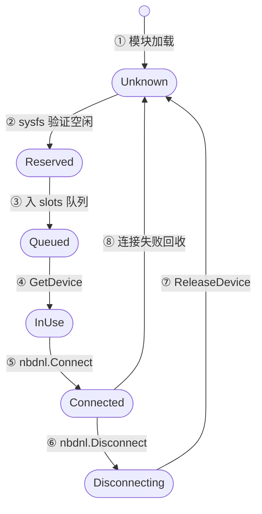
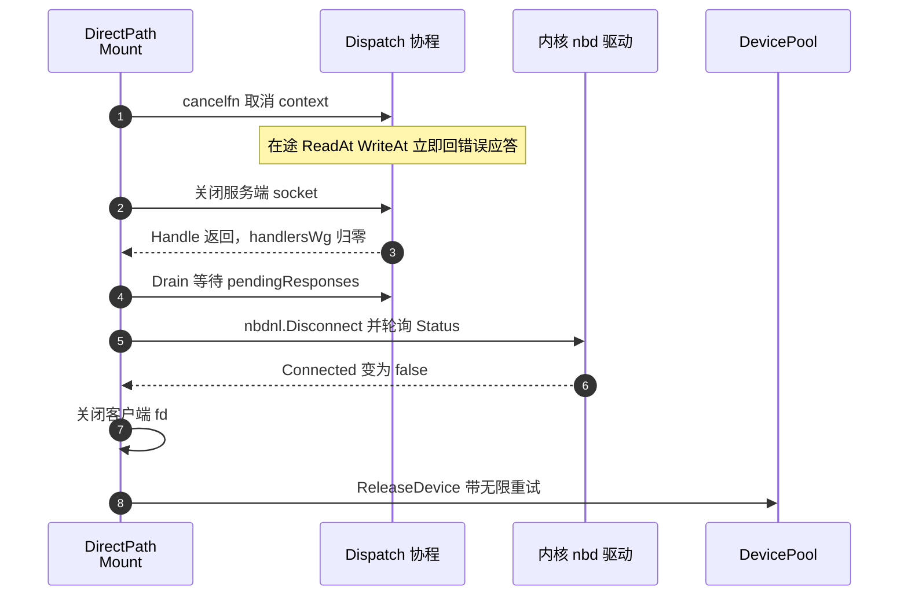

# 33 · 磁盘：NBD 服务器与 rootfs

> 一台沙箱的根文件系统在宿主上不是一个文件，而是一个 `/dev/nbdN` 设备，背后是 orchestrator
> 进程里的一段 Go 代码。本篇讲这段代码怎么被装配起来、怎么被拆掉，以及为什么装配和拆卸的**顺序**
> 比机制本身更容易出错。
>
> **读者**：系统工程师。 **预备**：[第 06 篇 · 块设备、NBD 与写时复制](06-block-devices-nbd-cow.md)（协议、netlink 直连、设备空闲判据）、
> [第 30 篇 · block 包](30-block-layer.md)（Cache 与 Overlay）。 **代码**：`packages/orchestrator/internal/sandbox/nbd/pool.go`、
> `nbd/path_direct.go`、`nbd/dispatch.go`、`packages/orchestrator/internal/sandbox/rootfs/`、
> `packages/orchestrator/internal/sandbox/fc/script_builder.go`

---

## 0. 本篇要回答的问题

1. 设备池在 orchestrator 的生命周期里处于什么位置？它的并发结构是什么，为什么要预热？
2. `Dispatch` 的读缓冲为什么是 4 MiB，写请求上限为什么是 32 MiB？多连接买到了什么？
3. rootfs provider 有两个实现，各自解决什么问题？运行期沙箱为什么必须走 NBD？
4. Firecracker 配置里的 `path_on_host` 到底是哪个路径？为什么它必须在所有节点上一模一样？
5. 一台沙箱关闭时，刷缓冲、断连接、释放槽位、删缓存文件这四件事为什么只能按一个顺序做？
6. 一台节点能同时跑多少台用 NBD 的沙箱？瓶颈是设备号还是内存？

---

## 1. 设备池：一种在进程之外的资源

NBD 设备槽位和 orchestrator 管的其它资源不一样。网络槽位、cgroup、缓存文件都由进程创建，
进程退出后由内核或清理逻辑回收。`/dev/nbdN` 不是：它由内核 nbd 模块在**加载时**一次性创建
`nbds_max` 个，模块不卸载就一直在。于是槽位是跨进程的全局资源，
「这个槽位现在能不能用」只能问内核。`nbd/pool.go` 的 `isDeviceFree()` 是这个查询的实现，
判据在 [第 06 篇 §3.3](06-block-devices-nbd-cow.md#33-nbds_max-与设备池) 已经讲过，本篇只用结论。

### 1.1 池在进程里的位置

`packages/orchestrator/main.go` 里，设备池的创建排在 tcp 出口防火墙之后、网络槽位池之前：
`nbd.NewDevicePool()` 建池，`startService` 把 `Populate(ctx)` 挂成一个后台服务，
`devicePool.Close` 进关闭器列表。

`NewDevicePool()` 读 `/sys/module/nbd/parameters/nbds_max`；文件不存在时返回
`ErrNBDModuleNotLoaded`，而调用方直接 `Fatal`。也就是说**没加载 nbd 模块的宿主上 orchestrator
起不来**，这是一条硬前置条件，`packages/orchestrator/README.md` 把它写在第一行：
`modprobe nbd nbds_max=4096`，加上一条 udev 规则把 nbd 设备的 change 事件排除出 inotify 监听。
整个进程里只有一个池实例，`sandbox.NewFactory()` 与服务层各持有一份引用。

### 1.2 预热：把扫描成本移出创建路径

`Populate()` 是一个后台协程，循环体只做一件事：调 `getFreeDeviceSlot()` 拿一个确认空闲的槽位，
塞进 `slots` channel。channel 容量是 `min(maxSlotsReady, nbds_max)`，`maxSlotsReady` 是 64。
塞满了就阻塞，被 `GetDevice()` 取走一个才继续。

为什么要预热？因为找一个空闲槽位不是 O(1)。`getFreeDeviceSlot()` 从 0 号开始，
用 bitset 找到第一个进程记账上没占用的槽位，再去 sysfs 验证它真的空闲；
验证不过就清掉该位继续找下一个，每次验证是一次 `stat` 加一次读文件。
节点跑到几百台沙箱时，一次查找就是几百次 sysfs 访问。放在后台协程里持续进行之后，
沙箱创建路径上的 `GetDevice()` 退化成一次 channel 收取。

代价是池会长期占住最多 64 个「已分配但没人用」的槽位：bitset 里它们已占用，sysfs 里它们仍空闲。
对内核而言这批槽位是自由的，同机若还跑着别的 NBD 用户，预留的槽位有可能被抢走 ——
`DirectPathMount.Open()` 的连接重试循环就是为这种情况准备的。

### 1.3 并发结构

池的并发面很窄，值得逐个点清楚：

| 参与者 | 数量 | 碰哪些状态 |
|---|---|---|
| `Populate()` | 1 个协程 | `usedSlots`（加锁）、`slots` channel 写端 |
| `GetDevice()` | 每次沙箱创建 / 恢复各一次 | `slots` channel 读端 |
| `ReleaseDevice()` | 每次沙箱关闭一次，可能重试 | `usedSlots`（加锁）、sysfs |
| `Close()` | 进程退出时 1 次 | `done` channel、`usedSlots` |

`usedSlots` 由一个 `sync.Mutex` 保护，临界区里只有 bitset 操作，sysfs 访问在锁外。
「置位」和「验证空闲」之间因此有窗口，但只有 `Populate()` 一个协程在分配，
窗口里不会有第二个分配者插进来。

`GetDevice()` 的 `select` 有三路：`done` 关闭返回 `ErrClosed`、`ctx` 取消返回 `ctx.Err()`、
从 `slots` 收到槽位。这里有一处边界情况：`Populate()` 返回时 `defer close(d.slots)`，
而它在 `ctx` 取消时也会返回。若根 context 已取消而 `Close()` 尚未调用，
`GetDevice()` 会从已关闭的 channel 收到零值 0 并返回 nil 错误，把 0 号设备当成合法槽位交出去。
实践中两件事挨得很近，窗口很短。



| 编号 | 触发 | 动作 |
|---|---|---|
| ① | 模块加载 | 创建 `nbds_max` 个设备，全部视为 Unknown |
| ② | `getFreeDeviceSlot` | bitset 置位并通过 sysfs 验证空闲 |
| ③ | `Populate` | 送入容量 64 的 `slots` channel |
| ④ | `GetDevice` | 交给一台沙箱 |
| ⑤ | `nbdnl.Connect` | 客户端 fd 绑定到内核设备 |
| ⑥ | `nbdnl.Disconnect` | 请求断开，轮询 sysfs 状态 |
| ⑦ | `ReleaseDevice` | 确认 sysfs 空闲后清位，回到可分配 |
| ⑧ | 连接失败 | 立刻释放槽位并重试 |

### 1.4 关闭

`Close()` 先关 `done`，再把 bitset 里所有已置位的槽位逐个 `ReleaseDevice`，
带 `WithInfiniteRetry()` 和 10 分钟超时（`devicePoolCloseReleaseTimeout`）。
这是**串行**的：几百个槽位里若有若干个还连着没退干净的沙箱，最坏情况是每个都等满 10 分钟。
理由与 §7 的顺序约束一致 —— 把一个还在服务的槽位标记成空闲，比慢一点危险得多。

---

## 2. 装配一个设备：`DirectPathMount.Open()`

`nbd/path_direct.go` 的 `DirectPathMount` 是「一个 block.Device 加一个设备槽位」的粘合层。
`Open()` 取槽位、按特性开关 `nbd-connections-per-device`（`packages/shared/pkg/feature-flags/flags.go`，
默认 4）建这么多对 socketpair、给每条起一个 `Dispatch` 协程，再用 `nbdnl.Connect()` 把这批客户端 fd
连同导出大小与服务端标志交给内核 —— 这几步与「握手阶段被完全跳过」的理由在
[第 06 篇 §3.2](06-block-devices-nbd-cow.md#32-内核客户端-devnbdn) 已经讲过。本篇看它外面多出来的两层结构。

第一层是**重试循环**。连接失败时这一轮的产物全部丢弃：关掉所有 socketpair、把槽位还给池、
等 25 ms 从头再来；例外是错误信息里含 `invalid argument` 的情形，那说明参数本身非法，直接返回。
注释写的失败原因是「偶尔出现的 BADF」，可见这个循环处理的是罕见瞬时错误。
连接成功后还要轮询 `nbdnl.Status()`，直到内核报告 `Connected` 才算装配完成。

第二层是两个超时参数：`nbdnl.WithTimeout` 与 `nbdnl.WithDeadconnTimeout`，
两者都取同一个常量 `connectTimeout`，值是 30 秒。前者是内核对单个块请求的超时，
后者是内核判定服务端失联的时限。含义是：**任何一个块请求，如果 30 秒内没有被 Go 侧应答完，
guest 会看到 I/O 错误。**
对一个基底在对象存储上、冷块要跨网络拉的设备来说，这是一条真实的上限；
它和 `block` 包的分片超时、重试策略共同决定了冷启动时磁盘 I/O 的失败面
（分片读取见 [第 30 篇 §6](30-block-layer.md#6-两种-chunker)）。

`Open()` 不在沙箱创建的主路径上同步执行。`internal/sandbox/sandbox.go` 里是
`go rootfsProvider.Start(execCtx)`，而 `Start()` 把 `Open()` 的结果写进一个 `SetOnce`。
需要路径的一方调 `Provider.Path()` 阻塞等待。于是设备连接可以和网络槽位分配、
内存文件打开并行进行，只在配置 Firecracker 之前汇合。

### 2.1 多连接买到了什么

`FlagCanMulticonn` 让内核把并发块请求分散到 4 条 socket 上。收益不在协议层
—— NBD 本来就允许一条连接上乱序发多个请求 —— 而在两处串行点：

- **socket 本身。** 每条 socket 上的字节流是有序的，一个 4 MiB 的读应答写回时，
  同一条 socket 上的其它应答要排在它后面。4 条连接把这个排队分成 4 队。
- **`Dispatch.Handle()` 的解包循环。** 每个 `Dispatch` 只有一个协程在读 socket、解 28 字节头。
  写命令的数据要从 socket 上收完才能派发（见 §3），这段时间该 `Dispatch` 无法处理别的请求。
  4 个 `Dispatch` 就是 4 条独立的解包流水线。

代价有两条。一是内存：每个 `Dispatch` 一个 4 MiB 读缓冲，4 条就是 16 MiB，
乘以节点上的沙箱数（§8）。二是收益到不了写路径的底：`Overlay.WriteAt()` 落到
`block.Cache.WriteAt()`，后者拿的是**写锁**（`internal/sandbox/block/cache.go`，锁的分工见
[第 30 篇 §3.3](30-block-layer.md#33-锁的三种用法)），
同一台沙箱的所有写最终在这把锁上串成一列。读走 `RLock`，可以真正并行 ——
而读恰好是可能要跨网络的那一侧。所以多连接的收益主要落在读上，这与它要解决的问题是对上的。

---

## 3. `Dispatch` 的缓冲取舍

`nbd/dispatch.go` 的 `Handle()` 是一个典型的「从字节流里切包」循环：
读进 `buffer`，从 `rp` 开始尽可能多地解出完整请求，处理完把剩下的半个包挪到缓冲区开头。
两个常量决定了它的形状：

```go
dispatchBufferSize         = 4 * 1024 * 1024
dispatchMaxWriteBufferSize = 32 * 1024 * 1024
```

`dispatchBufferSize` 是读缓冲。注释里说 4 MiB 「似乎是内核偏好的缓冲区大小」，
并留了一条 TODO：应该再加 28 字节，因为一个 4 MiB 的写请求实际是 28 字节头加 4 MiB 数据，
正好装不下。代码没有加这 28 字节，而是在写命令分支里绕开了这个问题：
先把缓冲区里已有的部分 `copy` 进一个新分配的 `data`，不够就继续从 socket 上直接读进 `data`，
直到收满 `request.Length`。注释解释了为什么选这条路而不是把缓冲区调大：

> 我们不想增大默认缓冲区，因为上限会变成 32 MiB，对几百条沙箱连接来说太大了。

缓冲区是**每连接**分配的常驻内存，而写请求的最大长度是**偶发**的峰值。
把常驻内存按峰值配，节点内存会被读缓冲吃掉一大块；按典型值配、峰值时临时分配，
代价是大写请求多一次分配和一次额外的 socket 读循环。

`dispatchMaxWriteBufferSize` 则是防御：写请求长度超过 32 MiB 直接报错断连。
32 MiB 的来历是 NBD 邮件列表里的一条共识 —— 这是各家实现都应当支持的单请求上限。
注意**读命令没有对应的检查**：`cmdRead()` 直接 `make([]byte, length)`。
这条不对称不构成问题，因为读请求长度由内核块层的 `max_sectors` 约束，
而 socket 的对端只可能是本机内核（推论）。

命令的并发模型在 [第 06 篇 §3.2](06-block-devices-nbd-cow.md#32-内核客户端-devnbdn) 讲过：
顺序解包、`go` 出去执行、加锁串行应答。本篇补两个细节。

第一，`cmdRead()` 和 `cmdWrite()` 内部还有一层 `select`：底层 `ReadAt`/`WriteAt` 在自己的协程里跑，
外层等它或者等 `ctx.Done()`。context 被取消时**立刻回一个错误应答**（错误码 1）而不是干等。
这是 §7 关闭顺序能成立的前提：取消 context 后，内核不会在某个请求上挂到 30 秒超时。

第二，`shuttingDown` 标志与 `pendingResponses` 这个 `WaitGroup` 构成 `Drain()`：
置位之后新的读写命令一律返回 `ErrShuttingDown`，然后等已派发的请求全部应答完。
`Drain()` 只在 `Close()` 里调用，且调用点在 socket 已经关掉之后 —— 这一点见 §7。

---

## 4. 两个 rootfs provider

`rootfs/rootfs.go` 的 `Provider` 接口只有四个方法：

| 方法 | 语义 |
|---|---|
| `Start(ctx)` | 让设备可用；对 NBD 是连接，对直接文件是空操作 |
| `Path()` | 返回交给 Firecracker 的宿主路径，可能阻塞 |
| `Close(ctx)` | 落盘并释放资源 |
| `ExportDiff(ctx, out, closeSandbox)` | 停沙箱并把改动导出成 diff |

`NBDProvider`（`rootfs/nbd.go`）是运行期沙箱用的那个。`NewNBDProvider()` 做三件事：
按模板只读 rootfs 的尺寸和块大小建一个 `block.Cache`（落在
`SandboxCacheRootfsPath()` 给出的路径，形如 `<SANDBOX_CACHE_DIR>/rootfs-<沙箱 ID>-<随机 ID>.cow`），
把只读基底和这个 cache 组成 `block.Overlay`，再把 overlay 交给一个 `DirectPathMount`。
`Path()` 返回 `/dev/nbdN`。

`DirectProvider`（`rootfs/direct.go`）不碰 NBD。它把一个**本地文件**整个 `mmap` 成读写映射，
`Path()` 直接返回这个文件路径。`sandbox.go` 的 `CreateSandbox()` 用
`rootfsCachePath == ""` 来二选一：为空走 NBD，非空走直接文件。

传非空路径的只有一处：`internal/template/build/phases/base/builder.go` 的基础层构建，
`layer.WithRootfsCachePath(rootfsPath)`，传进去的就是刚刚在本地造好的 ext4 镜像。
代码里的注释说明了理由 —— 「直接从源文件填充 direct cache，这是为了把所有块标记为脏并能直接读」。
基础层没有「基底」可言，它自己就是第一代产物，所有块都得进 diff；
让 guest 直接读写这个文件，比套一层 overlay 再把整个 overlay 标脏要简单得多。
相应地 `DirectProvider.ExportDiff()` 也不查位图，而是从头到尾按块读文件、
交给 `header.DiffMetadataBuilder` 逐块处理。

代价是 `DirectProvider` 只能用在「基底就在本地、且大小已知」的场景。
运行期沙箱不满足这个前提：它的基底是模板的 `rootfs.ext4` 加一串 diff，
块要按需从对象存储拉，只有用户态代码能回答「这一块在哪」。这是两个 provider 的分界线，
也是 `ResumeSandbox()` 里根本没有这个分支、无条件用 `NewNBDProvider` 的原因。

---

## 5. Firecracker 看到的路径

Firecracker 的 drive 配置里只有一个字符串 `path_on_host`，
`fc/client.go` 的 `setRootfsDrive()` 把它填成 `p.rootfsPath`。这个字符串不是 `/dev/nbdN`。
从 provider 到 Firecracker 之间隔了两跳：

```text
/fc-vm/rootfs.ext4                                  ← Firecracker 打开的路径
    │  启动脚本里的 ln -s（在 FC 的 mount namespace 内）
    ▼
<SANDBOX_CACHE_DIR>/rootfs-<沙箱 ID>-<随机 ID>.link  ← 宿主上的稳定名字
    │  fc/process.go 的 SymlinkForce
    ▼
/dev/nbdN            或        <本地 ext4 镜像路径>
（NBDProvider.Path）           （DirectProvider.Path）
```

第一跳在 `fc/script_builder.go` 的启动脚本模板 `startScriptV2` 里。脚本先 `mount --make-rprivate /`，
再在 `SANDBOX_DIR`（默认 `/fc-vm`，见 `internal/cfg/model.go`）上挂一个 tmpfs，
在里面建两个符号链接：`rootfs.ext4` 指向那个 `.link` 路径，`<内核版本>/vmlinux.bin` 指向宿主的内核文件，
最后 `ip netns exec <netns> firecracker --api-sock ...`。整台沙箱的 mount namespace 就这么一层。

第二跳在 `fc/process.go`，两步走的完整时序见
[第 28 篇 §2.1](28-firecracker-process-management.md#21-rootfs-链接的两步走)。这里只点出次序上的细节：`Create()` 和 `Resume()` 都先把 `.link`
指向 `/dev/null`，把 Firecracker 进程拉起来，之后才 `SymlinkForce` 到真正的
`rootfsProvider.Path()`。注释说明了原因 —— 有了这个占位目标，Firecracker 进程可以先起来，
不必等 rootfs 就绪。`Create()` 改完链接才调 `setRootfsDrive`；
`Resume()` 根本不调，drive 配置在快照里，链接必须在恢复前就位。

为什么要绕这一圈？答案在恢复路径上。快照文件里记着 Firecracker 当时看到的
`path_on_host` 字符串；从快照恢复时，**同一个字符串必须在新节点上指向新沙箱的设备**。
`/dev/nbdN` 的 N 每次都不同，`.cow` 文件名里有随机 ID，都不能直接写进快照。
于是引入一个中间名字：路径里只含沙箱 ID 和随机 ID 的 `.link` 文件，
以及 guest 视角完全恒定的 `/fc-vm/rootfs.ext4`。

`fc/config.go` 里的 `ConstantRootfsPaths` 把这件事标成模板版本 2：

```go
var ConstantRootfsPaths = RootfsPaths{
    // The version is always 2 for the constant rootfs paths format change.
    TemplateVersion: 2,
}
```

版本 1 的模板走另一套路径 —— `DeprecatedSandboxRootfsDir()`，
即 `/mnt/disks/fc-envs/v1/<模板 ID>/builds/<build ID>/rootfs.ext4`，路径里含模板与 build 标识。
`ResumeSandbox()` 因此不能用常量，它要从元数据把版本、模板 ID、基底 build ID 传下去，
由 `script_builder.go` 的 `getRootfsPath()` 按版本挑模板。这是纯粹为兼容老快照付出的复杂度。

drive 配置的其余字段：`IsReadOnly` 为 false、`IsRootDevice` 为 true，`IoEngine` 由调用方给；
模板构建路径传的是 `Sync`（`layer.DefaultIoEngine`，注释说是为避开 Async 的问题）。

---

## 6. 一次 guest 写走到哪里

把前五节串起来，guest 里一次 `write()` 到落进宿主文件的完整路径是：

```text
guest 用户态 write()
  → guest 内核 ext4 → guest 块层 → virtio-blk 驱动，写 virtqueue、敲 doorbell
  → KVM 退出到 Firecracker
  → Firecracker block 设备模型，按 path_on_host 打开的 fd 做 pwrite
  → 宿主内核块层 → nbd 驱动，把请求编码成 28 字节 NBD 头 + 数据
  → socketpair 的一条连接
  → Dispatch.Handle 解包 → cmdWrite → go performWrite
  → Overlay.WriteAt → Cache.WriteAt（拿写锁）
  → mmap 区域内的 memcpy + 在已缓存位图里置位
  → 宿主页缓存，最终由内核回写到 rootfs-<沙箱 ID>-<随机 ID>.cow
  ← writeResponse 写 16 字节应答头回 socket
```

读路径到 `Overlay` 之前完全相同，之后分叉：`Overlay.ReadAt()` 逐块先查 cache，
拿到 `BytesNotAvailableError` 才落到只读基底，基底再走 header 定位与分片拉取
（[第 30 篇 §5](30-block-layer.md#5-基底从-header-到一次范围读)）。

两个容易误解的点：`Cache.WriteAt()` 写的是 mmap 出来的内存而非 `write()` 系统调用；
那个 `.cow` 文件是稀疏文件，逻辑大小等于整个 rootfs，实际占用只有写过的块。

---

## 7. 拆卸：四件事的顺序

关闭一台沙箱要做四件事：让 guest 停止发 I/O、把在途数据刷下去、断开 NBD 连接、
释放槽位并删掉 cache 文件。它们的顺序不能换，换了就是静默的数据损坏。

顺序由三层代码共同保证。最外层是 `internal/sandbox/cleanup.go`：
`Cleanup.run()` 先按**逆序**跑 `priorityCleanup`，再按逆序跑普通 `cleanup`。
`sbx.Stop`（杀 Firecracker 进程并等它退出）在优先队列，
`cleanupFiles` 与 `rootfsProvider.Close` 按这个先后进普通队列、于是按相反的先后执行。
结果是：Firecracker 先死 → provider 再关 → 最后删符号链接与 socket 文件。
Firecracker 死了，宿主块层就不会再有新请求下来，这是后面所有步骤的前提。

中间层是 `NBDProvider.Close()`：

```go
err := o.sync(ctx)          // 1
err = o.mnt.Close(ctx)      // 2
o.finishedOperations <- struct{}{}
err = o.overlay.Close()     // 3
```

`sync()` 打开 `/dev/nbdN`，先发 `BLKFLSBUF` ioctl 把内核块层为这个设备缓的脏页刷下去并作废，
再 `fsync` 一次。这一步必须在断连之前：块层里压着的写请求要经由 NBD 连接才能到达 cache。
第 3 步 `overlay.Close()` 最终调到 `Cache.Close()`，而 `Cache.Close()` 除了 `Unmap()` 还会
`os.RemoveAll(c.filePath)` —— **它会把 `.cow` 文件删掉**。这就是为什么它必须排在最后：
文件一删，任何还没落地的写都无处可去。

最内层是 `DirectPathMount.Close()`，它自己也是一串有序动作：



先取消 context 而不是先关 socket，是为了让卡在 `ReadAt` 上的请求立刻返回错误应答，
而不是等 30 秒的内核超时。关掉服务端 socket 让 `Handle()` 的 `Read` 报错退出。
`Drain()` 排在 socket 关闭之后，看上去顺序反了 —— 此时应答已经写不出去了 ——
但因为 Firecracker 早已退出，正常路径上这时没有在途请求，`Drain()` 实际是一道保险
（推论：代码里没有注释说明这个顺序的意图，这是从 `Cleanup` 的优先级安排反推的）。
最后 `ReleaseDevice` 带 `WithInfiniteRetry()`：宁可一直重试，也不把可能还连着的槽位交出去。

### 7.1 pause 时的变体

pause 要的不是「关掉」，而是「关掉之后把 cache 里的脏块导出来」。矛盾在于
`Cache.Close()` 会删文件。`NBDProvider.ExportDiff()` 的解法是先**摘走** cache：

```go
cache, err := o.overlay.EjectCache()
go func() { closeSandbox(ctx) }()
select {
case <-o.finishedOperations:
case <-ctx.Done(): ...
}
m, err := cache.ExportToDiff(ctx, out)
err = cache.Close()
```

`Overlay.EjectCache()` 用一个原子标志把 cache 的所有权转移出去，此后 `Overlay.Close()`
看到标志被置位就直接返回、不关 cache。然后它在后台触发整条关闭链
（`closeSandbox` 就是 `Sandbox.Close`，也就是 §7 开头那套 `Cleanup`），
自己在 `finishedOperations` 上等 —— 这个 channel 由 `NBDProvider.Close()` 在 `mnt.Close()`
之后写入。等到了，说明 NBD 已经断开、不会再有写进来，此时导出 cache 才是安全的。
导出完由 `ExportDiff` 自己 `Close()` 掉 cache，文件也在这时被删。

这是全篇最绕的一段控制流，本质是把「资源释放」和「数据导出」两个生命周期从同一个 `Close()`
里拆开。`direct.go` 里 `DirectProvider` 用一个 `atomic.Bool` 加同名的 `finishedOperations`
做了同样的事，代码里两处 TODO 都写着「等快照流程改好后移除」。

---

## 8. 上限：设备号还是内存

「一台节点能跑多少台沙箱」这个问题，在 NBD 这一侧有两条独立的上限。

**设备号。** `nbds_max` 在模块加载时固定，是节点上 NBD 挂载数的硬上限，
也就是走 NBD 路径的沙箱数上限。上游节点镜像用 4096。超过之后
`getFreeDeviceSlot()` 返回 `NoFreeSlotsError`，`Populate()` 每 50 ms
（`waitOnNBDError`）重试一次、每 100 次失败打一条警告，
而沙箱创建路径上的 `GetDevice()` 会一直阻塞到有槽位或 context 取消 ——
注意它**不会**把 `NoFreeSlotsError` 传给调用方，池的错误只留在日志里。
表现出来就是沙箱创建变慢直至超时，而不是一个清晰的「设备号用尽」错误。

**内存。** 每台沙箱的 NBD 侧常驻内存是 `4 MiB × 连接数`，默认 4 条即 16 MiB，
纯粹是 `Dispatch` 的读缓冲；1000 台沙箱就是 16 GiB。峰值还要再加：每个在途写请求
额外分配一份等长的 `data`，每个在途读请求分配一份等长的结果缓冲。
所以在大多数配置下，先撞上的是内存而不是 4096 这个设备号上限 ——
把 `nbd-connections-per-device` 从 4 调到 8，节点的沙箱容量会直接减半。
这个开关是运行时可调的特性开关（[第 14 篇 §2](14-config-flags-versions.md#2-特性开关)），
调它之前应当先算这笔账。

`maxSlotsReady = 64` 只影响预热深度，`dispatchMaxWriteBufferSize` 只约束单个请求，
两者都不封顶并发数。单机离线版把这条上限压得更低：它用的是自行编译的 nbd 模块、`nbds_max=512`，
细节见 [第 82 篇 §3.2](82-host-kernel-nbd-hugepages.md#32-为什么要自己编译模块以及怎么固化)。
`nbd/` 与 `rootfs/` 两个目录在 ARM 适配版里没有代码改动。

---

## 9. 小结

- NBD 设备槽位是跨进程的内核资源，不随 orchestrator 退出而回收；「空闲」必须问 sysfs，
  进程内的 bitset 只是加速查找的索引。没加载 nbd 模块的宿主上 orchestrator 直接 `Fatal`。
- 设备池用一个后台协程预热最多 64 个槽位，把 O(设备数) 的 sysfs 扫描移出沙箱创建路径；
  代价是长期占住这些槽位的记账位，以及与同机其它 NBD 用户的潜在争抢。
- `Dispatch` 的 4 MiB 读缓冲是**每连接常驻**内存，32 MiB 是**偶发**的单请求上限；
  代码选择按典型值配常驻、按需临时分配峰值，并为此在写命令分支里多写了一个补读循环。
- 4 条连接买到的是 socket 排队和解包流水线的并行度，收益主要落在可能跨网络的读上；
  写在 `Cache` 的写锁上重新串行。
- 运行期沙箱必须走 `NBDProvider`，因为它的基底散布在对象存储的多代 diff 里，
  只有用户态代码能回答「这一块在哪」。`DirectProvider` 只服务于基础层构建这一种场景。
- Firecracker 看到的是 `/fc-vm/rootfs.ext4`，经 tmpfs 里的符号链接指到宿主的 `.link`，
  再指到 `/dev/nbdN`。这两跳存在的唯一理由是让快照里的路径字符串在任何节点上都可复现。
- 关闭顺序是四层嵌套的不变量：杀 Firecracker → `BLKFLSBUF` 加 `fsync` → 断 NBD →
  释放槽位与删 cache 文件。`Cache.Close()` 会删掉 `.cow` 文件，这决定了它只能排在最后。
- pause 通过 `EjectCache` 把 cache 的所有权从 overlay 转移出来，在 NBD 断开后才导出 diff。
- 单节点并发上限有两个：`nbds_max`（上游 4096）和读缓冲内存（每沙箱 16 MiB）。
  多数配置下先撞上的是后者。设备号耗尽表现为创建变慢，不是一个显式错误。

## 延伸阅读 / 下一篇

- 前置概念：[第 06 篇 §3](06-block-devices-nbd-cow.md#3-nbd把用户态代码变成一块磁盘)（协议、netlink、空闲判据）、
  [第 30 篇 · block 包](30-block-layer.md)（`Cache`、`Overlay`、`Chunker`）。
- 缓存文件在本地磁盘上的位置与清理：[第 34 篇 §3](34-template-cache-and-local-storage.md#3-节点本地目录谁建谁删)。
- 磁盘 diff 怎么变成下一代模板：[第 37 篇 §5](37-pause-and-snapshot.md#5-磁盘-diff另一条路)。
- 恢复路径上 rootfs 与内存的合流：[第 27 篇 §4](27-resume-sandbox.md#4-串行段从-fcnewprocess-到-resumevm)、
  [第 28 篇 §2](28-firecracker-process-management.md#2-启动脚本unsharetmpfs-与符号链接)。
- 模板的 ext4 镜像是怎么造出来的（`DirectProvider` 的使用场景）：
  [第 43 篇 §3](43-rootfs-construction.md#3-层解包成-ext4)。
- 宿主侧的内核模块要求与单机离线版的 `nbds_max=512`：
  [第 82 篇 §3](82-host-kernel-nbd-hugepages.md#3-nbd设备号就是并发上限)。
- 外部资料：NBD 协议规范中的 netlink 配置接口；Linux 内核 `drivers/block/nbd.c`。
