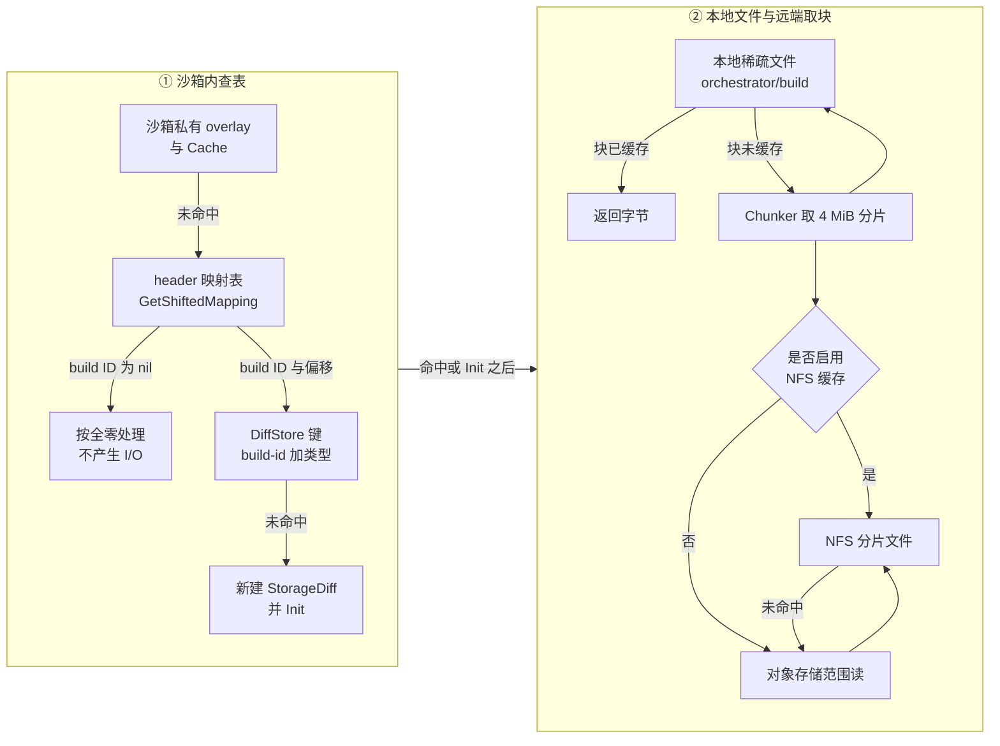
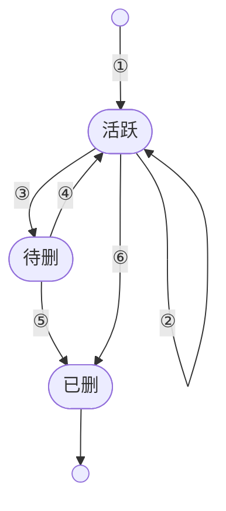

# 34 · 模板缓存与本地存储

> 一个节点上同时跑着几十台沙箱，它们的模板产物存在对象存储里，而 Firecracker 只会读本地文件。
> 中间这一段由几个互相嵌套的缓存承担。本篇讲这些缓存项各自的键、寿命与驱逐方式，
> 讲一次块读要顺序查几张表，也讲用 TTL 代替引用计数所要付的代价。
>
> **读者**：工程师、运维。
> **预备**：[第 13 篇 · 存储全景](13-storage-landscape.md)、[第 29 篇 · 模板产物格式](29-template-artifact-format.md)。
> **代码**：`packages/orchestrator/internal/sandbox/template/`、`internal/sandbox/build/`、
> `internal/template/cache/`、`internal/template/build/storage/`、
> `packages/shared/pkg/storage/template_cache.go`、`packages/orchestrator/cmd/clean-nfs-cache/`

---

## 0. 本篇要回答的问题

1. 节点本地磁盘上，哪些文件是缓存、哪些是运行态？谁创建它们、谁负责删？
2. guest 读一个块，从请求到字节返回，中间顺序查了哪几张表？每一级的键是什么？
3. 缓存项的寿命由什么决定？为什么没有引用计数，用 TTL 代替它的代价是什么？
4. 磁盘快满时，谁被删、按什么顺序删、删的那一刻数据可能正在被读怎么办？
5. NFS 上的共享缓存没有常驻进程管着，靠什么收敛？它凭什么敢删别人的文件？

---

## 1. 为什么一定要在节点上落盘

先看不落盘会怎样。一台 4 GiB 内存的沙箱从快照恢复，guest 在启动后的头几秒会碰到大量缺页，
rootfs 的随机读同样密集。每次缺页都发一次对象存储的范围读，往返时间会直接计入 guest 的执行时间，
而且这些请求高度重复：同一个模板在同一个节点上被拉起一百次，同样的字节就要取一百遍。

所以节点上必须有一份本地副本。但它不能是「先把整个模板下载下来」——
一个模板的 memfile 可能有几 GiB，而一台沙箱往往只碰其中的一小部分。
[第 30 篇 §6](30-block-layer.md#6-两种-chunker)讲的分片读取解决了「只取用到的部分」，
本篇要解决的是它的配套问题：**这些取回来的分片存在哪、谁持有它、什么时候可以删**。

这里有一个贯穿全篇的前提：**模板产物不可变**。一个 build ID 对应的
`memfile`、`rootfs.ext4`、`snapfile` 一经写入不再修改，pause 产生的是一个新的 build ID
而不是原地覆盖（见[第 13 篇 §3.2](13-storage-landscape.md#32-产物桶的键布局)与
[第 37 篇 §5](37-pause-and-snapshot.md#5-磁盘-diff另一条路)）。
因此这些缓存都不需要一致性意义上的失效协议，只需要回答一个问题：磁盘不够时先扔谁。

## 2. 五个都叫 cache 的东西

orchestrator 的代码里有五处以 cache 命名，它们的层次差别很大，先分清楚再往下读。

| 名字 | 代码位置 | 装什么 | 在哪 |
|---|---|---|---|
| 模板缓存 `Cache` | `internal/sandbox/template/cache.go` | build ID → `Template` 对象 | 进程内存 + 本地文件 |
| diff 缓存 `DiffStore` | `internal/sandbox/build/cache.go` | `<build-id>/<类型>` → `Diff` | 进程内存 + 本地文件 |
| NFS 分片缓存 | `packages/shared/pkg/storage/storage_cache.go` | 对象键 → 4 MiB 分片文件 | NFS 挂载点 |
| 构建状态缓存 `BuildCache` | `internal/template/cache/build_cache.go` | 构建 ID → 状态与日志 | 进程内存 |
| 层缓存索引 `HashIndex` | `internal/template/build/storage/cache/cache.go` | 层哈希 → build ID | 对象存储 |

后两个不装产物数据。`BuildCache` 的 TTL 是 10 分钟（`buildInfoExpiration`），
存的是 `BuildInfo` 与构建日志，供 template-manager 回答状态轮询，见
[第 46 篇 §4](46-template-manager-service.md#4-状态存在哪里活多久)。
`HashIndex` 把层哈希映射到 build ID，键是 `<cacheScope>/index/<hash>`
（`storage/paths/paths.go` 的 `HashToPath()`），整个索引住在对象存储里，见[第 45 篇 §3](45-layers-and-build-cache.md#3-查找两跳索引是弱引用)。
本篇讲前三个。

## 3. 节点本地目录：谁建、谁删

[第 13 篇 §4](13-storage-landscape.md#4-节点本地目录布局与三层缓存) 给过完整的目录清单与命名规则，
这里换一个角度看同一棵树：每个目录的**所有者**与**回收者**是谁。

| 目录 | 环境变量 | 谁在里面写文件 | 谁回收 |
|---|---|---|---|
| `/orchestrator/build` | `DEFAULT_CACHE_DIR` | `StorageDiff` 与 `LocalDiffFile` | 进程启动时整目录清空；运行中由 `DiffStore` 按水位驱逐 |
| `/orchestrator/template` | `TEMPLATE_CACHE_DIR` | `storageFile`（snapfile、metadata.json） | 缓存项被驱逐时 `TemplateCacheFiles.Close()` 删自己那一层 |
| `/orchestrator/sandbox` | `SANDBOX_CACHE_DIR` | 沙箱的 rootfs COW 层与 NBD 链接 | 沙箱结束时清理，不是缓存 |
| `/orchestrator/build-templates` | `TEMPLATES_DIR` | 构建期中间产物 | 构建流程自己清理，见[第 42 篇 §5](42-build-phases.md#5-阶段之间的沙箱状态) |
| `/orchestrator/shared-store/chunks-cache` | `SHARED_CHUNK_CACHE_PATH` | 所有节点 | 外部的周期作业，见第 7 节 |
| `/mnt/snapshot-cache` | `SNAPSHOT_CACHE_DIR` | 无 | 无 |

这八个路径（表中六项加上 `ORCHESTRATOR_BASE_PATH` 与 `SANDBOX_DIR`）由
`packages/orchestrator/main.go` 的 `ensureDirs()` 在启动最早期以 `0700` 创建，空值跳过；
路径先经 `internal/cfg/model.go` 的 `makePathsAbsolute()` 规范化，后者覆盖 11 个字段——
比 `ensureDirs()` 多出 Firecracker 版本目录、宿主内核目录与宿主 envd 二进制这三处只读不建的路径。

最后一行需要单独说明。`SNAPSHOT_CACHE_DIR` 在上游 2026.09 里是一条**已经改道的旧路径**：
除了被 `ensureDirs()` 创建、被 `makePathsAbsolute()` 规范化、被几个 `cmd/` 下的开发工具
在环境变量里设置之外，没有任何代码读 `StorageConfig.SnapshotCacheDir`。
pause 真正写出来的东西分两处：snapfile 与 metadata.json 落在 `sandbox.go` 的 `Pause()` 里
`TemplateFiles.CacheFiles()` 生成的 `TEMPLATE_CACHE_DIR` 子目录，memfile 与 rootfs 的 diff
由 `pauseProcessMemory()` / `pauseProcessRootfs()` 落在 `DefaultCacheDir`。
开机脚本 `iac/provider-gcp/nomad-cluster/scripts/start-client.sh` 仍在 `/mnt/snapshot-cache`
上挂 65 GiB tmpfs，ARM 适配版与单机离线版照抄了这一段；tmpfs 的 size 是上限而非预留，
后果只是一个空挂载点（与[第 13 篇 §4.1](13-storage-landscape.md#41-一个-client-节点的目录) 一致）。

三条清理规则值得记住。

**`build/` 每次启动清空。** `internal/sandbox/template/cache.go` 的 `NewCache()`
第一件事就是 `cleanDir(config.DefaultCacheDir)`，函数注释给出了理由：
上一代进程留下的分片文件与 diff 文件没有任何对象管着它们，属于无主数据。
代价是进程重启后所有分片缓存都要重新拉，收益是不必设计一套跨进程的文件归属账本。
顺带一提，`cleanDir()` 把 `ReadDir` 的错误用 `fmt.Errorf` 包了一层，而调用处用的是不做 unwrap 的
`os.IsNotExist()`，于是「目录不存在」这个本该被容忍的情况会让 `NewCache()` 返回错误；
正常启动路径上 `ensureDirs()` 已先建好目录，触发不到。

**`template/` 不清空。** 代码里唯一删除这棵子树的地方是
`packages/shared/pkg/storage/template_cache.go` 的 `TemplateCacheFiles.Close()`，
它只删自己那一层 `<build-id>/cache/<uuid>/`。**推论**：进程异常退出后，
`/orchestrator/template` 下的目录会留下来，且没有任何代码会回收它们。
单个目录只装 snapfile 与 metadata.json，量级远小于分片文件，因此后果是缓慢的空间泄漏而不是故障。

**路径里的随机段是防误删的。** `<uuid>` 来自 `CacheFiles()` 生成的 `CacheIdentifier`；
`build/` 下文件名末尾的随机段来自 `internal/sandbox/build/diff.go` 的 `GenerateDiffCachePath()`，
它调 `packages/shared/pkg/id` 的 `Generate()`，产出 20 个字符的小写字母数字串。
两者的注释指向同一个场景：同一个 build 的旧缓存项正在关闭、新缓存项刚刚建好，
如果路径只由 build ID 决定，旧项的 `Close()` 会把新项的文件删掉。

## 4. 缓存查找顺序：一次块读查几张表

guest 的一次缺页或一次 rootfs 读，最终落到 `internal/sandbox/build/build.go` 的
`File.ReadAt()`（uffd 侧走 `File.Slice()`）。从这里开始，请求要顺序穿过下面这些层。

逐级说明键与代价。

**第 0 级**是沙箱私有的写层，`block.Overlay` 加 `block.Cache`，只有本沙箱写过的块在这里，
属于运行态不属于缓存，见[第 30 篇 §4](30-block-layer.md#4-overlay两条规则)与
[第 33 篇 §4](33-nbd-and-rootfs.md#4-两个-rootfs-provider)。

**第 1 级是 header 映射表**，把「模板内偏移」翻译成「哪一个 build 的哪个偏移」。
这一步不查磁盘，但它决定了后面查谁：一个由多次 pause 叠出来的模板，
相邻两个块可能分别落在不同代的 build 上。这里对 `uuid.Nil` 的判断是一条短路——
基底 build 本身就是 diff 时，没写过的块不需要任何 I/O：
`Slice()` 直接返回 `header.EmptyHugePage`，
`ReadAt()` 则只把 `n` 往前推而不写入缓冲区，并在注释里写明这依赖调用方传进来的切片本来就是全零的。

**第 2 级是 `DiffStore`**，键是 `GetDiffStoreKey(buildID, diffType)`，即 `<build-id>/<memfile|rootfs.ext4>`。
注意这里的粒度：**键里是被映射到的那个 build，不是沙箱正在用的那个 build**。
`File.getBuild()` 每读一个落在祖先 build 上的块，都会以那个祖先的 ID 造一个 `StorageDiff`
交给 `store.Get()`。因此一台沙箱运行时，节点上可能同时打开这条 diff 链上每一代的缓存文件；
反过来，同一模板的一百台沙箱共享的正是这些条目——这是节点级复用实际发生的位置。
`Get()` 用 `GetOrSet` 保证同一个键只有一个 `Diff` 对象活着，新造的那个直接被丢弃。

**第 3 级是本地稀疏文件**。`StorageDiff.Init()` 用 `GenerateDiffCachePath()` 在 `build/` 下开一个文件，
交给 `block.NewChunker()`；chunker 用 `Truncate` 把它撑到对象的完整大小再 `mmap`，
所以 `ls -l` 看到的是几 GiB、`du` 看到的是实际取回的那部分。

**第 4、5 级**是 NFS 共享缓存与对象存储。这一级在代码里不是 block 包里的又一次查表，
而是一层 `StorageProvider` 装饰器：`packages/shared/pkg/storage/storage_cache.go` 的
`WrapInNFSCache()` 把真正的 provider 包起来，`OpenBlob()` / `OpenSeekable()` 返回的对象
按固定的 `MemoryChunkSize`（4 MiB，与被读 diff 的块大小无关）先查本地文件、未命中才回源。
包不包由 `internal/sandbox/template/cache.go` 的 `useNFSCache()` 在 `GetTemplate()` 里判定一次，
包好的 provider 随 `newTemplateFromStorage()` 存进模板对象，再由 `File.getBuild()` 原样传给
每一个 `StorageDiff`，所以第 3 级那个 chunker 的回源读**可能是被 NFS 缓存包装过的**。
代价写在 `GetTemplate()` 的注释里：模板对象本身也在缓存里，所以开关翻转只对新进程或新 build 生效。
判定条件有三条：
`isBuilding` 为真时一律不包装（注释给的理由是缓存正在构建的这一层不会加速下一台沙箱的启动）；
`SHARED_CHUNK_CACHE_PATH` 为空时不包装；其余情况看 feature flag
`use-nfs-for-snapshots` 或 `use-nfs-for-templates`，二者的 fallback 值都是「仅开发环境为真」。
构建侧另有一条独立的开关 `use-nfs-for-building-templates`，
在 `internal/template/build/builder.go` 的 `useNFSCache()` 里判定。
分片文件的布局与并发写见[第 13 篇 §4.2](13-storage-landscape.md#42-三层缓存)
与[§4.3](13-storage-landscape.md#43-共享缓存上的并发写)。

## 5. 缓存项的生命周期：用 TTL 代替引用计数

两个内存缓存都是 `jellydator/ttlcache`，都没有引用计数。这是一个明确的设计选择，值得展开。

`Cache.GetTemplate()` 先按需包装 NFS provider，再无条件构造一个新的 `storageTemplate`
（这一步会 `MkdirAll` 出一个新的 `<uuid>` 目录），最后交给 `getTemplateWithFetch()` 做
`cache.GetOrSet(files.CacheKey(), ...)`，而 `TemplateFiles.CacheKey()` 返回的就是 build ID。
命中则丢弃刚构造的对象、计一次 `hits`；未命中计一次 `misses`，并起一个 goroutine 跑 `Fetch()`。

`Fetch()` 用 `errgroup` 并发做四件事：拉 snapfile、拉 metadata.json、
建 memfile 的 `Storage`、建 rootfs 的 `Storage`。四个结果分别写进四个
`utils.SetOnce`；调用方通过 `Memfile()`、`Rootfs()`、`Snapfile()`、`Metadata()` 阻塞等待。
这样 `GetTemplate()` 本身几乎立即返回，真正的等待被推迟到 ResumeSandbox 里实际需要某个产物的那一刻，
见[第 27 篇 §3](27-resume-sandbox.md#3-并行段三个-promise-和一个后台预取)。四件事里只有 metadata.json 允许缺失：
对象不存在时 `Fetch()` 就地写一份 `metadata.V1TemplateVersion()` 到本地当作结果，
以兼容没有元数据文件的老模板。

这里有两处代价。其一，`Fetch()` 用 `context.WithoutCancel(ctx)`：这份数据可能被别的沙箱用到，
不该因为发起方取消就中断，代价是进程关闭时这些 fetch 也取消不掉，注释两点都写明了。
其二，**命中时刚刚建出来的那个 `<uuid>` 目录不会被删**——它从未进入缓存，
`Close()` 因而永远不会被调用。**推论**：每一次命中的 `GetTemplate` 调用都会留下一个空目录，
它们与第 3 节说的泄漏是同一笔账。

没有引用计数意味着「谁还在用」这个问题没有答案，只能用时间兜底：
`templateExpiration` 与 `buildCacheTTL` 都是 25 小时，
`cache.go` 的注释直说这个值必须长于沙箱可能的最长生命周期。
ttlcache 在命中时续期并把项移到链表头部，所以只要模板持续被拉起就不会过期。

| 编号 | 触发 | 动作 |
|---|---|---|
| ① | `GetOrSet` 未命中 | 新建缓存项并 `Init` |
| ② | 命中 | 续期 25 小时并移到链表头 |
| ③ | 磁盘水位超阈值 | 被选中，进入 60 秒延迟删除 |
| ④ | 60 秒内被再次引用 | 取消删除，回到活跃 |
| ⑤ | 60 秒到期 | `Close` 并删本地文件 |
| ⑥ | TTL 到期 | 被 ttlcache 驱逐，走 `OnEviction` |

代价是可以说清楚的：一台活过 25 小时、期间没有别的沙箱用同一模板的沙箱，
它的模板缓存项会被驱逐，`OnEviction` 回调调用 `template.Close(ctx)`，
其中 snapfile 的 `storageFile.Close()` 会 `os.RemoveAll` 掉本地文件。
**推论**：由于 snapfile 只在 Firecracker 加载快照时读一次、memfile 与 rootfs 的
`Storage.Close()` 是空实现，这种驱逐对已经跑起来的沙箱通常不产生可见影响，
但它是靠「25 小时够长」这个经验值成立的，不是靠机制保证的。

## 6. 水位驱逐与延迟删除

[第 13 篇 §4.4](13-storage-landscape.md#44-两种驱逐) 给了本地驱逐的一句话版本，这里看它的循环体。
逻辑在 `internal/sandbox/build/cache.go` 的 `startDiskSpaceEviction()`，由 `Start()` 起一个 goroutine 常驻：

1. `unix.Statfs(cachePath)` 取整个文件系统的容量与可用块——统计的是文件系统而不是目录，
   所以 `build/` 与同一块盘上的 `template/`、`sandbox/` 共享水位；已用量按「总块数减去
   非特权可用块数」算，给 root 保留的那部分也计入已用；
2. 从已用量里减去 `pdSizes` 中记着的待删体积，避免在删除真正生效之前重复触发；
3. 阈值先取 feature flag `build-cache-max-usage-percentage` 的 fallback 值 85，
   再对 `cfg.GetServices()` 返回的每个服务查一次该 flag 并取最小值——
   同一进程同时跑 orchestrator 与 template-manager 时，以更严的那个为准；
4. 未超阈值则 1 秒后再查；超了就调 `deleteOldestFromCache()` 挑一项，
   挑中后把间隔压到 1 微秒继续挑，直到水位降下来。

`deleteOldestFromCache()` 用 `cache.RangeBackwards()` 从链表尾部找第一个不在待删集合里的项。
函数注释说这是「TTL 最小的项」，实际上 ttlcache 的链表按最近访问排序，
在所有项 TTL 相同的前提下两者等价，结论一样：**最久没被读过的那份 diff 先走**。
拿不到文件大小时按 `fallbackDiffSize`（100 MiB）估算，
整个函数还包了一层 `recover()`，注释说是绕开 `RangeBackwards` 的一个已知 panic。

选中之后并不立即删。`scheduleDelete()` 把项记进 `pdSizes` 并起一个定时器，
`buildCacheDelayEviction`（60 秒）后才真正 `cache.Delete()`，触发 `OnEviction` 里的 `Close()`。
这 60 秒是给正在进行的读留的余量：注释列出了三种竞态——已经暴露出去的
`Slice` 切片、正在进行的分片拉取、正在进行的上传。期间只要有人再次
`Get()` 或 `Add()` 同一个键，`resetDelete()` 就关掉取消通道、把它从 `pdSizes` 里摘掉。

这套机制的代价是不保证及时性：60 秒延迟加上「一轮只挑一项」，
在磁盘被快速写满时（例如若干台大内存沙箱同时 pause）可能追不上。
收益是读路径上不需要任何额外的锁。

## 7. NFS 共享缓存：一个只能靠 atime 的清理器

NFS 上那份缓存是所有节点共享的，没有任何一个进程知道全局的引用情况。
`packages/orchestrator/cmd/clean-nfs-cache/` 是一个独立的一次性程序，
由 Nomad 的周期作业每小时跑一次（`iac/provider-gcp/nomad/jobs/clean-nfs-cache.hcl`：
`cron = "0 * * * *"`、`prohibit_overlap = true`，跑在 builder 节点池上），
Terraform 只在 `shared_chunk_cache_path` 非空时才创建这个作业。

难点在于要在一棵有几百万个文件的 NFS 目录树上找出「最久没被读过的一批」，完整遍历一次太贵。
`cleaner/scan.go` 的做法是**随机下降加批内排序**：

1. `findCandidate()` 从根开始，每层调 `randomSubdirOrOldestFile()`，
   在「子目录数 + 本目录文件数」上取一个均匀随机数：落在子目录段就继续下降，
   落在文件段就取该目录里 atime 最旧的那个（目录内的文件按 atime 降序排好，取末尾）
   并从内存树里摘掉，避免被重复选中；
2. 首次进入一个目录时 `scanDir()` 把整个目录读完（`ReadDir(2048)` 分批），
   再把文件名交给 `MaxConcurrentStat` 个 statter 协程做 `statx`，
   带 `AT_STATX_DONT_SYNC` 以避免让 NFS 回源取属性；
3. 攒够 `BatchN`（生产默认 10000）个候选后，`splitBatch()` 按 atime 升序排，
   最旧的 `DeleteN`（命令行默认 100，Terraform 生产默认 900）个交给删除协程，
   其余通过 `reinsertCandidates()` 放回内存树；
4. 扫到空目录时 `removeEmptyDir()` 顺手把它删掉并从父节点摘除。

这是一个近似 LRU：只保证删的是「采样出来的这一批里最旧的那些」。用随机采样换掉全局排序，
在 NFS 上才负担得起；代价是删除决策的质量随采样批次波动，日志里因此打了每批候选的 atime 直方图。

删除前还有一道复核，即[第 13 篇 §4.4](13-storage-landscape.md#44-两种驱逐) 提到的那次重新 stat：
`cleaner/delete.go` 的 `deleteFile()` 在 `os.Remove` 之前再 `statx` 一次，
**atime 与候选记录不一致就跳过**（计入 `DeleteSkipC`）。这是这个工具敢在没有任何跨节点锁的
前提下删别人文件的全部依据：从采样到删除之间如果有节点读过它，这次删除就作废。
残余风险是那段窗口本身——复核之后、`Remove` 之前仍可能有节点读到；
后果是那个分片下次未命中，需要重新从对象存储拉，不会造成错误结果。
顺带一提，这段代码里 `DeleteAlreadyGoneC` 与 `DeleteErrC` 两个计数器的分支是反的
（`!os.IsNotExist(err)` 走的是 already-gone），只影响日志汇总，不影响删除行为。

删多少由三个互相覆盖的目标决定，优先级写在 `Options` 的注释里：
`TargetFilesToDelete` > `TargetBytesToDelete` > `TargetDiskUsagePercent`。
只给了百分比时（生产传的是 90），`main.go` 的 `preRun()` 调 `GetDiskInfo()` 换算成字节数；
后者不用 `statfs`，而是 `exec` 一个 `df` 再解析输出——对 NFS 而言两者未必给出同一个答案。
命令行的 `-dry-run` 默认为 `true`，而 Terraform 变量 `filestore_cache_cleanup_dry_run`
默认为 `false`：生产是真删，手工跑是空跑。并发度（生产默认 16 个 statter、16 个 scanner、
4 个 deleter）与两个目标值还可以被 LaunchDarkly 的 JSON flag `clean-nfs-cache` 在运行时覆盖，
无需改作业定义。

## 8. 失效：不可变产物也有需要作废的时候

产物不可变，所以没有一致性意义上的失效。但缓存里还有围绕产物的元数据，
`Cache.Invalidate(buildID)` 因此在两处被调用：

- `internal/server/sandboxes.go` 的 `uploadPrefetchMappingAsync()`：
  `Checkpoint()` 在恢复出的沙箱上采集预取映射，后台上传进 `metadata.json`，
  上传成功后作废该 build 的模板缓存项，让下一次 `GetTemplate` 读到带预取信息的元数据，
  见[第 32 篇 §2.2](32-memory-prefetch-and-hugepages.md#22-两条采集路径)；
- `internal/template/build/phases/optimize/builder.go` 的 `updateMetadata()`：
  构建的 optimize 阶段写完元数据后作废同一个 build。

两处的模式相同：**先改对象存储里的元数据，再删本地缓存项**，靠「下一次读会重新 fetch」收敛。
`InvalidateAll()` 只被开发工具 `cmd/resume-build/` 用，注释写明用途是冷启动基准测试。

还有一类失效是代码没有做的。`storageTemplate.Fetch()` 失败时把错误写进 `SetOnce`，
但这一项已经在缓存里了，没有任何代码在 fetch 失败后调用 `Invalidate`。
**推论**：一次 fetch 失败（例如对象存储瞬时不可用）会让该 build 在这个节点上持续失败，
而且每次 `GetTemplate` 命中都会给它续期 25 小时。

`DiffStore.Get()` 上有一个同源但更尖锐的问题。它先 `GetOrSet` 把 `Diff` 放进缓存，
再对新项调 `diff.Init()`。而 `StorageDiff.Init()` 在 `persistence.OpenSeekable()` 失败时
直接 `return err`，没有给 `chunker` 这个 `SetOnce` 设错误值——后面两处失败（取对象大小、
建 chunker）都调了 `SetError`，只有第一处漏了，而 `SetOnce.Wait()` 是无超时地等一个 channel。
**推论**：这条路径上失败后，缓存里留下一个 `chunker` 永远不会就绪的条目，
命中它的读会一直阻塞，驱逐也救不了它——`deleteOldestFromCache()` 要调 `FileSize()`，
后者同样先 `chunker.Wait()`。这说明了「先入缓存、后做初始化」的代价：失败的对象也被共享。

## 9. ARM 适配版的差异

本篇涉及的缓存代码在 ARM 补丁里没有改动，变的是它们包着的 provider 与脚下那块盘。
provider 增加了 MinIO 实现并成为默认值，见
[第 75 篇 §5](75-minio-storage.md#5-把默认-provider-改成-minio)。
`start-client.sh` 里格式化并挂载独立缓存盘的整段被删除，`/orchestrator` 成为根文件系统上的普通目录，
因此第 6 节那个 85% 的水位阈值作用在系统盘上；NFS 挂载的整段也一并删除，
单机离线版的 `SHARED_CHUNK_CACHE_PATH` 设为空值，第 4 节里的第 4 级不存在，
本地分片缓存直接对着 MinIO。详见
[第 79 篇 §4](79-nomad-multinode-deployment.md#4-去-gcp-化一张对照表)与
[第 80 篇 §4](80-single-node-rpm.md#4-opte2b-infra-与三层叠加)。

## 10. 小结

- 节点本地有两个内存缓存与一个共享文件缓存：模板缓存按 build ID 存 `Template` 对象，
  `DiffStore` 按 `<build-id>/<类型>` 存 diff，NFS 上按对象键存 4 MiB 分片；
  另外两个叫 cache 的东西不装产物数据。
- `DEFAULT_CACHE_DIR` 在进程启动时被整个清空，`TEMPLATE_CACHE_DIR` 不清；
  两处路径里的随机段的作用是让同一个 build 的新旧缓存项不互相删文件。
- `SNAPSHOT_CACHE_DIR` 在上游 2026.09 里除了被创建之外没有任何代码使用，
  pause 的 diff 落在 `DEFAULT_CACHE_DIR`、snapfile 落在 `TEMPLATE_CACHE_DIR`。
- 一次块读顺序穿过：沙箱私有写层、header 映射、`DiffStore`、本地稀疏文件、
  可选的 NFS 分片缓存、对象存储；映射到 `uuid.Nil` 的块按全零处理，不产生 I/O。
  NFS 那一级不是独立的查表，而是包在 provider 外面的一层装饰器。
- `DiffStore` 的键是被映射到的祖先 build，所以一台沙箱可能同时打开 diff 链上每一代的缓存文件，
  而同模板的多台沙箱共享的正是这些条目。
- 两个内存缓存都没有引用计数，用 25 小时 TTL 加命中续期代替，
  代码注释要求这个值长于沙箱最长生命周期——这是经验约束，不是机制保证。
- 本地驱逐按整个文件系统的水位触发（默认 85%），选最久未访问的一项，
  延迟 60 秒执行以避开正在进行的读、取与上传；期间被再次引用即取消。
- NFS 缓存由每小时一次的 `clean-nfs-cache` 作业清理，用随机下降采样加批内排序做近似 LRU，
  删除前复核 atime，这是它在无跨节点锁的条件下的唯一安全依据。
- 缓存里的失败对象与成功对象一样被共享：fetch 失败的模板项不会被作废，
  `Init` 首步失败的 `StorageDiff` 会留下一个永不就绪的等待点。

## 延伸阅读 / 下一篇

- [第 30 篇 §6](30-block-layer.md#6-两种-chunker)：`Chunker` 的两种实现；
  [第 30 篇 §3](30-block-layer.md#3-cachemmap-加一张位图)：`Cache` 内部。
- [第 29 篇 §3](29-template-artifact-format.md#3-header-的字节布局)：header 映射的字节布局；
  [第 29 篇 §8](29-template-artifact-format.md#8-本地缓存与远端键的对应)：本地缓存与远端键的对应。
- [第 37 篇 §5](37-pause-and-snapshot.md#5-磁盘-diff另一条路)：本地 diff 文件是怎么产生并被塞进 `DiffStore` 的。
- [第 45 篇 §3](45-layers-and-build-cache.md#3-查找两跳索引是弱引用)：构建侧的哈希索引与层复用。
- [第 35 篇 · 沙箱网络](35-sandbox-networking.md)：下一篇。
