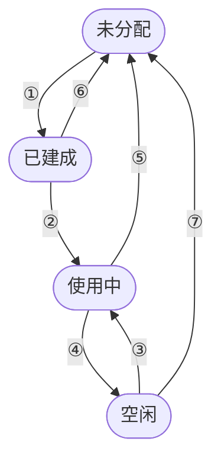
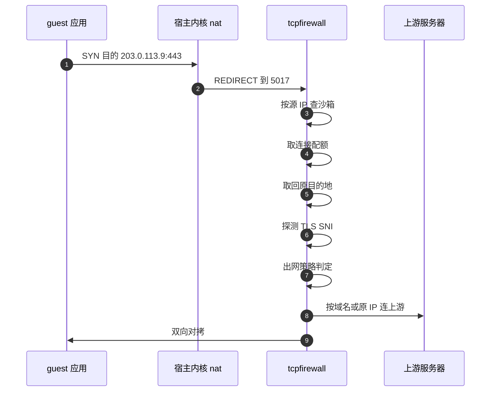

# 35 · 沙箱网络

> 一台沙箱的网络不是在创建它的时候搭起来的，而是从一个预先建好的**槽位池**里取一个现成的。
> 本篇讲这个池怎么填、槽位号怎么分配才不会撞车、还回来时复位了什么没复位什么，
> 以及那个替所有沙箱转发 TCP 出站流量的用户态防火墙进程内部长什么样。
>
> **读者**：系统工程师、平台工程师。
> 　**预备**：[第 07 篇 · 沙箱网络的内核基础](07-linux-networking-for-sandboxes.md)
> —— 内核机制与地址推导在那里讲过，本篇讲它们在 orchestrator 里的实现与代价。
> 　**代码**：`packages/orchestrator/internal/sandbox/network/`、
> `packages/orchestrator/internal/tcpfirewall/`、`packages/orchestrator/internal/portmap/`、
> `packages/shared/pkg/sandbox-network/firewall.go`

---

## 0. 本篇要回答的问题

1. 同一个节点上不会有两台沙箱拿到同一个槽位号 —— 这条保证由谁提供？两种存储后端各自怎么做到？
2. 一个槽位从无到有要执行哪些步骤，为什么这段代码必须锁定 OS 线程？
3. 「新槽位池」与「复用槽位池」为什么要分开，各自多大，取用时的优先级是什么？
4. 槽位复用时到底复位了什么？没复位的东西会带来哪些具体后果？
5. 用户态 TCP 防火墙怎么知道一条连接属于哪台沙箱、原本要去哪里？它的配额与失效边界在哪？
6. orchestrator 里为什么要自己实现一个 portmapper？

---

## 1. 槽位号的分配：两种存储，一条不变量

槽位的全部地址都由一个整数 `Idx` 推导出来（`network/slot.go` 的 `NewSlot()`，推导规则见
[第 07 篇 §3](07-linux-networking-for-sandboxes.md#3-地址规划一个槽位的五个地址)）。
于是整个网络层的正确性收缩成一条不变量：

> 在同一个节点上，任一时刻一个 `Idx` 至多被一台沙箱持有。

违反它的后果是硬性的：两个 `ns-N` 同名、两个 `veth-N` 同名、两条指向同一个 host IP 的宿主路由。
`network/storage.go` 把它抽象成一个两方法接口：

```go
type Storage interface {
	Acquire(ctx context.Context) (*Slot, error)
	Release(s *Slot) error
}
```

`main.go` 的 `newStorage()` 按环境二选一：开发模式或
`USE_LOCAL_NAMESPACE_STORAGE=true` 时用 `StorageLocal`，否则用 `StorageKV`。
包里还有 `storage_memory.go` 的 `StorageMemory`，但上游 2026.09 里没有任何调用点引用它。

### 1.1 StorageKV：Consul KV 上的乐观分配

`storage_kv.go` 把每个槽位表示成 Consul KV 里的一个键 `<nodeID>/<slotIdx>`。
分配的原子性来自 Consul 的 **check-and-set**：`kv.CAS()` 传入 `ModifyIndex: 0`，
语义是「仅当该键不存在时创建」。写成功就等于拿到了这个编号，写失败说明别人先到；
没有分布式锁，CAS 本身就是那个原子操作。

`Acquire()` 分两步。先随机试十次：`rand.Intn(slotsSize)` 取一个编号，CAS 一次，成了就返回；
十次都撞上，再退化成一次全量扫描，用 `kv.Keys()` 列出该节点已占用的键，从 0 开始逐个尝试 CAS。
随机在先、扫描在后：占用率低时一次分配只要一次 KV 写，占用率高时才付一次列举的代价。

释放对称：`Release()` 先 `kv.Get()` 读到当前 `ModifyIndex`，再 `DeleteCAS()`。
读到空值说明「已经被释放过」，`ModifyIndex` 对不上说明「已经被重新分配给别人」，
两种情况都返回错误而不是静默成功，让重复释放成为可观测事件。

两处值得注意。其一，随机与扫描都从 0 开始，而 `NewSlot()` 拒绝 `idx < 1`。
**推论**：抽到 0 时 CAS 成功但 `NewSlot()` 返回错误，键 `<nodeID>/0` 已写进 Consul
且不会被释放，相当于永久泄漏一个编号；默认 32766 个槽位下概率约三万分之一。
其二，键的生命周期完全由进程管理，orchestrator 非正常退出时 `Release()` 不会被调用。
**推论**：节点重启后这些键仍在，可用槽位数随崩溃次数单调减少，直到有人清理该节点的键前缀。
Consul 的角色见[第 09 篇 §4.3](09-nomad-consul-terraform.md#43-kv网络槽位的分配)。

### 1.2 StorageLocal：用 /var/run/netns 目录当分配表

`storage_local.go` 不依赖外部服务，它把**文件系统本身**当成分配表：命名空间以 `ip netns`
的约定挂载在 `/var/run/netns/<name>` 下，「`ns-N` 是否存在」读一次 `os.Stat` 就有答案。

`NewStorageLocal()` 启动时先 `getForeignNamespaces()` 列一遍该目录，把已存在的名字（`host` 除外）
记进 `foreignNs` 并永久跳过 —— 针对同机器上另一个容器运行时留下的命名空间。
`Acquire()` 在互斥锁内从小到大扫描，跳过 `foreignNs` 与本进程已分配的 `acquiredNs`，
再用 `isNamespaceAvailable()` 确认目录里没有同名文件，发现有就补进 `foreignNs` 继续；
整个扫描有 500 ms 的超时上限。

两个细节。扫描起点是 `slotIdx := 1` 而循环体开头就 `slotIdx++`，所以实际最小编号是 2，
注释里说的「跳过第一个槽位」实际跳过了两个。每次 `Acquire()` 都从头扫描，代价与已分配数成正比；
配合下一节的池，分配只在池被抽空时发生，这个 O(N) 不在关键路径上。
`Release()` 只从 `acquiredNs` 里删名字，不碰文件系统 —— 删命名空间是 `RemoveNetwork()` 的事。

### 1.3 两者的对比

| 维度 | StorageKV | StorageLocal |
|---|---|---|
| 分配的原子性来源 | Consul CAS | 进程内互斥锁 + 目录检查 |
| 跨进程安全 | 是 | 部分：能看见别的程序建的命名空间 |
| 外部依赖 | Consul 与 `CONSUL_TOKEN` | 无 |
| 进程崩溃后的状态 | 键泄漏，需清理 | 自愈：重启时重新扫描目录 |
| 单次分配代价 | 一次 KV 写，最坏一次列举 | O 已分配数 次 stat，上限 500 ms |
| 使用位置 | 生产集群 | 开发模式、单机部署 |

`StorageLocal` 在「进程崩溃」这一维度上反而更强：真相来源是内核状态而不是外部数据库。
它只保证同一台机器上不撞车 —— 而这恰好是不变量需要的范围，`StorageKV` 的键也带 `nodeID` 前缀。

---

## 2. 建立一个槽位：CreateNetwork 的完整步骤

`network/network.go` 的 `CreateNetwork()` 要在两个网络命名空间之间来回切换，
而 Linux 的 `setns(2)` 作用于**线程**，Go 的 goroutine 却可能在任意时刻被调度到另一个线程上。
所以函数第一行是 `runtime.LockOSThread()`，把当前 goroutine 钉死在当前线程上直到返回；
紧接着 `netns.Get()` 保存宿主命名空间的句柄，`defer` 里无条件切回去。
这两句缺一，后续所有 netlink 调用都可能落到错误的命名空间里，且失败是间歇性的。
之后的步骤按所在命名空间归类如下（省略错误处理）：

```text
[宿主 ns]  netns.NewNamed("ns-N")                    创建并切入新命名空间
[新   ns]  LinkAdd veth{Name: veth-N, Peer: eth0}    veth 对在此诞生，两端都在新 ns
           LinkSetUp(eth0) + AddrAdd(vpeer IP/31)
           LinkSetNsFd(veth-N, hostNS)               把宿主侧那一端移出去
[宿主 ns]  LinkSetUp(veth-N) + AddrAdd(veth IP/31)
[新   ns]  LinkAdd tap0 + LinkSetUp + AddrAdd(169.254.0.22/30)
           LinkSetUp(lo) + RouteAdd default via veth IP
           nat POSTROUTING -o eth0 -s guestIP -j SNAT --to hostIP
           nat PREROUTING  -i eth0 -d hostIP  -j DNAT --to guestIP
           InitializeFirewall()                      建 nftables 表 slot-firewall
[宿主 ns]  RouteAdd hostIP/32 via vpeer IP
           filter FORWARD veth-N <-> 默认网关，双向 ACCEPT
           nat POSTROUTING -s hostCIDR -o 默认网关 -j MASQUERADE
           nat PREROUTING -i veth-N -d 192.0.2.1 --dport 80   -j REDIRECT --to 5010
           nat PREROUTING -i veth-N -d 192.0.2.1 --dport 111  -j REDIRECT --to 5012
           nat PREROUTING -i veth-N -d 192.0.2.1 --dport 2049 -j REDIRECT --to 5011
           tcpProxyConfig().append()                 三条 TCP REDIRECT，见 §5
```

顺序里有两处不是随意的。第一，veth 对**在新命名空间里创建**再把一端移到宿主，
这样 `eth0` 从一开始就在新命名空间里，不会与宿主上已有的 `eth0` 冲突
（Firecracker 也在这个命名空间里启动，
见[第 28 篇 §2](28-firecracker-process-management.md#2-启动脚本unsharetmpfs-与符号链接)）。
第二，`192.0.2.1` 的三条重定向先于 `tcpProxyConfig().append()` 追加：
`nat/PREROUTING` 按追加顺序匹配，而 TCP 代理的第三条规则不带 `--dport`、匹配一切，
先后决定了沙箱访问 `192.0.2.1:80` 落到 hyperloop 代理而不是 TCP 防火墙。

还有一处隐含依赖：`iptables.New()` 返回的 `tables` 对象在两个命名空间里被复用。
`go-iptables` 不是自己下发 netlink，而是 fork 出 `iptables` 命令行进程；
子进程继承的是**发起 fork 的那个线程**的命名空间。
**推论**：这段代码之所以正确，靠的正是 `runtime.LockOSThread()`；去掉它，宿主规则可能被装进沙箱命名空间。
另外 `network/host.go` 的默认网关名是包级变量 `utils.Must(getDefaultGateway(...))`，
宿主没有默认路由时进程在 init 阶段就退出。

`RemoveNetwork()` 是逆操作，但不是严格镜像：命名空间内部的两条 NAT 规则、tap 设备、
nftables 表都不单独删除，删命名空间时随之消失；宿主侧的规则必须逐条 `Delete()`。
函数用 `errors.Join` 收集错误而不是遇错即返，一条规则删不掉不会导致 veth 与命名空间泄漏。
一个例外：`iptables.New()` 失败时代码把错误记进 `errs` 并跳过 `else` 分支，
但函数尾部删除 NFS 与 portmapper 重定向规则的两段在 `else` 之外，仍会用那个空句柄调用 `Delete`。
**推论**：`iptables.New()` 失败会让 `RemoveNetwork()` panic。
veth 设备则被**显式**删除，理由是只删命名空间时设备回收是异步的，
紧接着用同名创建新 veth 会撞上竞态 —— 这是复用一批固定名字必然要付的代价。

---

## 3. 池：两条队列，两种优先级

`network/pool.go` 的 `Pool` 只有两个 channel：

```go
newSlots    chan *Slot   // 容量 NewSlotsPoolSize-1，默认 31
reusedSlots chan *Slot   // 容量 ReusedSlotsPoolSize，默认 100
```

`Populate()` 是 `main.go` 启动时拉起的常驻 goroutine：死循环里调用 `createNetworkSlot()`
（`storage.Acquire()` 加 `CreateNetwork()`），成功就往 `newSlots` 里塞，channel 满了就阻塞在发送上，
稳态下预建好的新槽位是 31 个在缓冲里加 1 个挂在发送语句上，正好 `NewSlotsPoolSize` 个。
建失败时只记一条日志就进入下一轮，不退避、不计数 —— **推论**：失败若是持久的
（Consul 不可达、`nf_conntrack` 没加载），循环会变成满速的错误日志发生器。

`Get()` 的优先级是**复用优先**：先用一个带 `default` 的 `select` 非阻塞地试 `reusedSlots`，
拿不到才阻塞等 `newSlots` —— 复用不需要任何系统调用，取新槽位则要等 `CreateNetwork()` 里
那十几次 netlink 与 iptables 调用。取到之后 `Get()` 还要调 `ConfigureInternet()` 装用户规则，
失败时它另起一个 goroutine 把槽位还回池里再向调用方报错。

回收侧是 `Return()` 与 `cleanup()`：前者先复位防火墙，再试着把槽位塞回 `reusedSlots`；
塞不进去就走 `cleanup()`，由它 `RemoveNetwork()` 拆掉全部内核对象、`storage.Release()` 归还编号。
于是 `ReusedSlotsPoolSize` 同时是「节点上保留多少套已建好网络」的上限：
沙箱数长期低于这个值时，节点上的网络对象数不随沙箱来去而波动。



| 编号 | 触发 | 动作 |
|---|---|---|
| ① | `Populate` | 调 `CreateNetwork` 建好整套内核对象 |
| ② | `Get` 命中 `newSlots` | 取一套新建好的槽位 |
| ③ | `Get` 命中 `reusedSlots` | 复用已有槽位，不做系统调用 |
| ④ | `Return` 且队列未满 | 复位防火墙后塞回 `reusedSlots` |
| ⑤ | `Return` 时队列已满或复位失败 | 走 `cleanup`，`RemoveNetwork` 并归还编号 |
| ⑥ | `Pool.Close` | 排空 `newSlots` 并逐个拆除 |
| ⑦ | `Pool.Close` | 排空 `reusedSlots` 并逐个拆除 |

获取与归还的方式不对称。`sandbox.go` 的 `getNetworkSlot()`
把 `Pool.Get()` 包成一个 promise，与模板拉取、cgroup 创建等阶段并行
（见[第 27 篇 §3](27-resume-sandbox.md#3-并行段三个-promise-和一个后台预取)）；归还则注册成 `Cleanup` 回调，
回调内部又起一个 goroutine 调 `Return()`，并用 `context.WithoutCancel` 摘掉取消信号 ——
理由是归还不影响沙箱生命周期、不该拖慢清理。这条选择在下一节会有后果。

`Close()` 有一处并发上的粗糙。它先关闭 `done`，排空 `newSlots`，再 `close(p.reusedSlots)`；
而 `Return()` 里那个发送语句所在的 `select` 虽然也带 `<-p.done` 分支，
Go 却在多个分支同时就绪时随机选一个。**推论**：进程关闭与沙箱清理重叠时，
存在向已关闭 channel 发送而 panic 的窗口。`newSlots` 没有这个问题，
它由唯一的生产者 `Populate()` 在退出时关闭。

---

## 4. 复用一个槽位：复位了什么，没复位什么

**取用时**，`Pool.Get()` 调用 `slot.ConfigureInternet()`（`network/slot.go`）。
它先看出站配置：允许网段、拒绝网段、允许域名三个列表都为空时直接返回 ——
默认放行不需要装任何规则。否则置真 `firewallCustomRules` 标志，用 `ns.GetNS()`
打开该槽位的命名空间，在 `n.Do()` 里逐条调用 `Firewall.AddAllowedCIDR()` /
`AddDeniedCIDR()`，把网段写进 nftables 的用户集合。

这里有两条容易误读的边界。其一，**允许域名不产生任何内核规则**，它只影响
`firewallCustomRules` 标志，域名策略全部由 §5 的用户态代理执行。其二，
`network/firewall.go` 的 `installRules()` 里，用户允许集合与用户拒绝集合那两条规则
都带一个「L4 协议不等于 TCP」的匹配（`addNonTCPSetFilterRule()`）：
**用户网段策略在内核里只对非 TCP 生效**，TCP 的网段判定同样在用户态做。
内核这一层对 TCP 也强制的只有预置拒绝集合与预置允许集合（`192.0.2.1/32`），
它们排在用户集合之前，规则顺序见
[第 07 篇 §6.1](07-linux-networking-for-sandboxes.md#61-网段级命名空间里的-nftables)。
另外，`packages/shared/pkg/sandbox-network/firewall.go` 的 `DeniedSandboxCIDRs` 列了
五条 IPv4 私网与三条 IPv6 本地网段，后三条进的是 `nftables.TypeIPAddr` 集合、
由 `IPv4DestinationAddress` 查表。**推论**：它们在内核这一层不产生实际效果。

**归还时**，`Pool.Return()` 调用 `slot.ResetInternet()`。它用 `CompareAndSwap(true, false)`
判断槽位有没有装过自定义规则，没装过直接返回（省掉一次进命名空间的开销），
装过就调 `Firewall.Reset()`：预置拒绝集合重新填成 `DeniedSandboxSetData`、
预置允许集合填成 `{OrchestratorInSandboxIPAddress}/32`，两个用户集合清空。
用的是 `ClearAndAddElements()`，整集替换而不是逐项删除，
所以复位幂等，不依赖「装了哪些就删哪些」的记账正确。

`Firewall` 的 netlink 连接是在 `CreateNetwork()` 内部、线程正处于沙箱命名空间时
用 `nftables.New(nftables.AsLasting())` 建的，而 netlink socket 在创建时就绑定到当时的命名空间。
**推论**：这个连接此后一直作用于该槽位的命名空间，`ResetInternet()` 外面那层 `n.Do()` 是冗余的保险。

复位到此为止。路由、地址、设备与 NAT 规则是槽位的静态骨架，本来就不该复位；
每沙箱连接计数以 sandbox ID 为键，由 `Map.Remove()` 触发的 `OnRemove()` 删除，与槽位无关。
需要警惕的是 conntrack 表。

### 4.1 conntrack 残留与归还时序

[第 07 篇 §8](07-linux-networking-for-sandboxes.md#8-复用一个槽位的代价) 指出复用会保留
conntrack 条目。把时序补上，风险才成形。

其一，**归还异步且无静默期**：`Cleanup` 回调里起一个 goroutine 调 `Return()`，
与杀 Firecracker、断开 NBD、删 cgroup 并发推进；`ResetInternet()` 一返回就把槽位塞进
`reusedSlots`。若此刻有沙箱正在等 `Get()`，槽位可能在毫秒级内被交出去，
而复用优先策略让这条路径成为常态。

其二，**新旧两台沙箱的地址完全相同**：guest IP 都是 `169.254.0.21`，
host IP 都是 `10.11.0.<Idx>`，命名空间也是同一个。
于是旧沙箱留下的 conntrack 条目，对新沙箱来说是语法上合法的条目。

后果有两条。nftables 链里的第一条规则是「`ESTABLISHED`/`RELATED` 一律放行」，
**推论**：新沙箱若恰好用了与残留条目同五元组的连接，包会被判为已建立连接，
从而跳过后面的拒绝集合判定；`nat` 表里的转换也会按旧条目的结果执行。
两条都要求五元组碰撞 —— 源端口由 guest 内核随机选，概率不高但不为零，
而 TCP `ESTABLISHED` 条目的默认超时是五天。

`network/` 下没有任何 conntrack 相关调用。一个直接的补法是在 `ResetInternet()` 里
按命名空间冲刷 conntrack 表，代价是每次归还多一次系统调用；此条已记在
[第 86 篇 §7](86-known-issues-and-debt.md#7-继承自上游的问题)。
同样的时序还影响 `tcpfirewall` 按源 IP 做的沙箱归属判断。**推论**：旧沙箱遗留的未关闭连接
在槽位重分配后会被归到新沙箱名下，影响配额记账与日志归属，但不影响策略 —— 策略在建连时已判完。

---

## 5. TCP 防火墙进程

按目的端口分流到三个代理端口的**理由**（协议探测会卡死服务器先说话的协议）见
[第 07 篇 §6.2](07-linux-networking-for-sandboxes.md#62-域名级为什么必须在用户态)。
进程内的实现：`tcpfirewall/proxy.go` 的 `Start()` 在三个地址上注册五条路由，
HTTP 端口上一条 `AddHTTPHostMatchRoute`（匹配函数恒为真，走 `domainHandler`）
加一条兜底 `AddRoute`（走 `cidrOnlyHandler`，用于探测不出 `Host` 的连接），
TLS 端口同构地用 `AddSNIMatchRoute`，other 端口只有 `cidrOnlyHandler`。
监听器包了一层 `resilientListener`（`listener.go`）：`accept(2)` 返回 `EMFILE`、`ENFILE`、
`EAGAIN`、`ECONNABORTED` 时歇 100 ms 重试而不是让整个代理退出 —— 对每沙箱多条连接的进程，
文件描述符耗尽是现实风险。



`connectionHandler.HandleConn()` 的步骤依次是：

1. **查沙箱**。`tcpproxy.UnderlyingConn()` 剥掉为协议探测而包装的连接，取源地址，
   `sandbox/map.go` 的 `GetByHostPort()` 遍历沙箱表比对 `Slot.HostIPString()`。
   这是一次 O(沙箱数) 的线性扫描，每条连接都做一次；查不到就关连接并记一次
   `sandbox_lookup` 错误指标。
2. **配额**。`featureFlags.IntFlag(ctx, TCPFirewallMaxConnectionsPerSandbox)` 取上限，
   交给 `shared/pkg/connlimit` 的 `TryAcquire()` 做一次 CAS 自增。默认值是 **-1，即不限制**；
   按其实现，取值为 0 时**所有连接都被拒绝**，调这个开关时要留意
   （见[第 14 篇 §2](14-config-flags-versions.md#2-特性开关)）。
3. **取原始目的地**。`tcpfirewall/utils.go` 的 `getOriginalDst()` 用
   `getsockopt(fd, SOL_IP, SO_ORIGINAL_DST)` 拿回一个 `sockaddr_in`，手工按
   `family(2) + port(2, 大端) + addr(4)` 的布局解析。只处理 IPv4；失败则释放配额并关连接。
4. 进入 `handlers.go` 的两个处理器之一，外面包一层 `defer` 保证配额被释放。

判定逻辑在 `isEgressAllowed()`，优先级是：允许域名 → 允许网段 → 拒绝网段 → 默认允许。
`matchDomain()` 支持完全相等（忽略大小写）、`*`、`*.example.com` 三种模式。
判定读的是 `sbx.Config.Network`，即每条连接重读一次沙箱的当前配置，而不是把策略编译进内核规则。

**放行之后连哪里，取决于命中的是哪一类规则。** 只有 `matchType == MatchTypeDomain` 时
才走 `proxyWithIPVerification()`：丢弃 `SO_ORIGINAL_DST` 拿到的 IP，让 Go 的 `net.Dialer`
自己解析域名，并在 `ControlContext` 回调里（DNS 解析之后、`connect(2)` 之前）用
`isIPInAlwaysDeniedCIDRs()` 比对 `DeniedSandboxCIDRs`，命中就返回错误并记一次
`resolved_ip_blocked` 指标。按网段或默认放行时走 `proxy()`，目的地就是原始 IP。
重绑定防护因此只覆盖「因为域名被允许」这一种放行，与它要防的攻击面正好对齐。
上游拨号超时统一 30 s（`upstreamDialTimeout`）。

失效边界：非 80/443 端口上的 HTTP 与 TLS 不做域名判定；UDP 不经过这个进程；
`hostname` 为空的 TLS 连接（如直接访问 IP 的 HTTPS）退化成网段判定。

API 层有两处配合（`api/internal/orchestrator/create_instance.go` 的 `buildNetworkConfig()`）：
给了允许域名时自动把 `DefaultNameserver`（`8.8.8.8`）追加进允许网段，否则域名解析不出来；
`allowInternetAccess` 为假时把拒绝网段整个替换成 `0.0.0.0/0`，后者在 `addCIDRToSet()` 里
被特殊处理成一对区间端点。

---

## 6. portmap：一个只回答两个问题的 RPC 服务

`internal/portmap/` 是这一部分里最小的一块，但不知道它为什么存在，
`CreateNetwork()` 里那条 `--dport 111` 的规则会很费解。

沙箱要挂载 NFS 卷（见[第 40 篇 §4](40-volumes-and-nfsproxy.md#4-一次挂载的完整路径)）。
NFSv3 的客户端不直接连 2049，它先按 RFC 1057 的 portmapper 协议连服务端的 **111 端口**，
问「程序号 100003（nfs）与 100005（mountd）在哪个端口上」，拿到答案再去连。
宿主上没有真的 rpcbind 可以给沙箱用，就算有也不该把宿主的服务注册表暴露给 guest。
于是 orchestrator 自己实现了一个：`main.go` 在 `PortmapperPort` 上开 TCP 监听，
`portmap/server.go` 的 `NewPortMap()` 构造服务，`RegisterPort(ctx, 2049)`
把两个程序号都注册到端口 2049。guest 侧的路径是：连 `192.0.2.1:111`
→ REDIRECT 到 5012 → portmapper 回答 2049 → 连 `192.0.2.1:2049` → REDIRECT 到 5011 → NFS 代理。

三点值得一提。`portmap/main.go` 只实现了 `SET`、`GETPORT`、`DUMP`，`UNSET` 恒返回 false、
`CALLIT` 返回空结果 —— 刚好够用的子集，不是通用的 rpcbind。服务用装饰器叠了两层
（`logging.go` 与 `recover.go`），后者用 `recover()` 兜住 handler 里的 panic：请求由沙箱里的
程序发起，畸形的 XDR 报文不该带走 orchestrator 进程。第三，映射表全进程一份，内容是两条常量。

---

## 7. ARM 适配版的差异

`network/` 下唯一的实质改动是槽位池容量：`pool.go` 的 `NewSlotsPoolSize` 由 32 改为 300、
`ReusedSlotsPoolSize` 由 100 改为 1000，另加一条在 `Populate()` 里打印两条队列长度与容量的日志；
`tcpfirewall/`、`portmap/`、`shared/pkg/sandbox-network/` 未改动。
放大池容量把「等一个新槽位」的概率进一步压低，代价是节点常驻的命名空间、veth 与 iptables
规则数提高一个数量级，以及启动后一段时间内 `Populate()` 持续占用 CPU。
取值依据与实测见[第 71 篇 §7](71-orchestrator-arm-fc-changes.md#7-网络槽位池32--100--300--1000)。

---

## 8. 小结

- 整个网络层的正确性收缩为一条不变量：一个节点上一个槽位号至多一个持有者。
  `Storage` 只有 `Acquire` / `Release`，两个生产实现分别把它托付给 Consul 的 CAS
  与 `/var/run/netns` 目录；前者进程崩溃后键会泄漏，后者以内核状态为真相来源、重启自愈。
- `CreateNetwork()` 在两个命名空间之间穿梭，正确性依赖 `runtime.LockOSThread()`；
  veth 对在新命名空间里创建再把一端移出去，避免与宿主的 `eth0` 撞名；
  `192.0.2.1` 的三条重定向必须排在 TCP 代理的兜底规则之前。
- 池分两条队列：`newSlots` 由常驻 goroutine 预建，`reusedSlots` 装归还的槽位；
  取用时复用优先，因为复用不需要任何系统调用。`ReusedSlotsPoolSize` 同时是
  「节点上保留多少套已建好网络」的上限。
- 复用只复位 nftables 的四个 IP 集合，整集替换保证幂等；命名空间、设备、路由、NAT 规则
  与 conntrack 表都保留。归还异步且无静默期，而新旧沙箱地址完全相同，
  残留 conntrack 条目在五元组碰撞时可能让新沙箱的包被判为已建立连接。
- 用户配置的网段策略在内核 nftables 里只对**非 TCP** 生效；TCP 的网段与域名判定都在
  用户态代理里做。内核层对 TCP 也强制的只有预置拒绝集合与预置允许集合。
- 原始目的地址靠 `SO_ORIGINAL_DST` 取回，只处理 IPv4；沙箱归属靠源 IP 线性查表；
  每沙箱连接配额由特性开关控制，默认 -1 不限制，取值 0 时全部拒绝。
- 只有按域名放行的连接才丢弃原始目的 IP、由代理自己解析并在 `connect(2)` 之前
  拒绝私有网段的解析结果；按网段放行的连接仍直连原始 IP。
- portmap 是刚好够 NFSv3 客户端使用的最小 RPC 服务，存在的唯一理由是客户端会先问 111 端口；
  它处理来自沙箱的不可信输入，每个 handler 套了一层 `recover()`。

## 延伸阅读 / 下一篇

- 前置概念与内核机制：[第 07 篇 · 沙箱网络的内核基础](07-linux-networking-for-sandboxes.md)，
  尤其[§4 NAT 与 conntrack](07-linux-networking-for-sandboxes.md#4-nat-与-conntrack)。
- 槽位在恢复路径上的位置：[第 27 篇 §3](27-resume-sandbox.md#3-并行段三个-promise-和一个后台预取)；
  它作为沙箱持有资源之一：[第 26 篇 §4](26-sandbox-object.md#4-cleanup一个后进先出的清理栈)；
  归还与其它清理步骤的顺序：[第 39 篇 §5](39-health-errors-and-teardown.md#5-清理顺序哪些是不变量哪些不是)。
- `192.0.2.1` 上的三个服务：[第 36 篇 §5](36-orchestrator-proxy-and-envd-client.md#5-通道三hyperloop)、
  [第 40 篇 §4](40-volumes-and-nfsproxy.md#4-一次挂载的完整路径)；
  入站方向：[第 53 篇 §1](53-client-proxy-edge.md#1-这一跳为什么必须存在)。
- 出站策略的 API 形态与默认值：[第 17 篇 §2.2](17-sandbox-create-api.md#22-网络配置的校验)、
  [第 14 篇 §2.5](14-config-flags-versions.md#25-开关清单)。
- ARM 适配版的池容量：[第 71 篇 §7](71-orchestrator-arm-fc-changes.md#7-网络槽位池32--100--300--1000)；
  本篇指出的四处脆弱点（conntrack 残留、`RemoveNetwork()` panic、`Close()` 竞态、`idx 0` 泄漏）：
  [第 86 篇 §7](86-known-issues-and-debt.md#7-继承自上游的问题)。
- 外部资料：`man 7 netlink`、`nft(8)` 的集合与优先级章节、
  `iptables-extensions(8)` 的 `REDIRECT` 与 `MASQUERADE`、RFC 1057 的 portmapper 协议。
