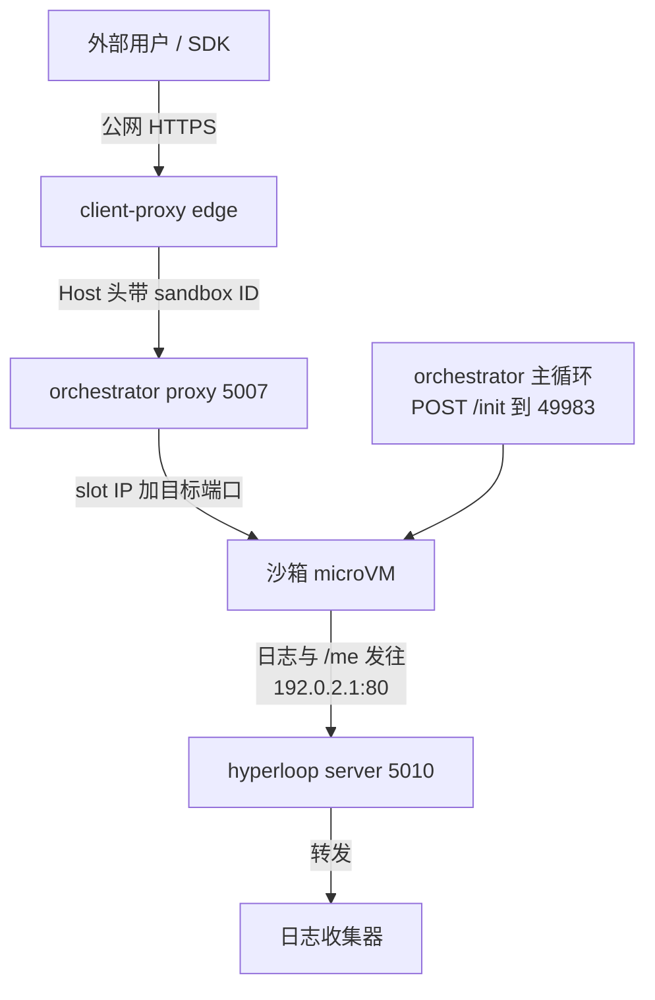
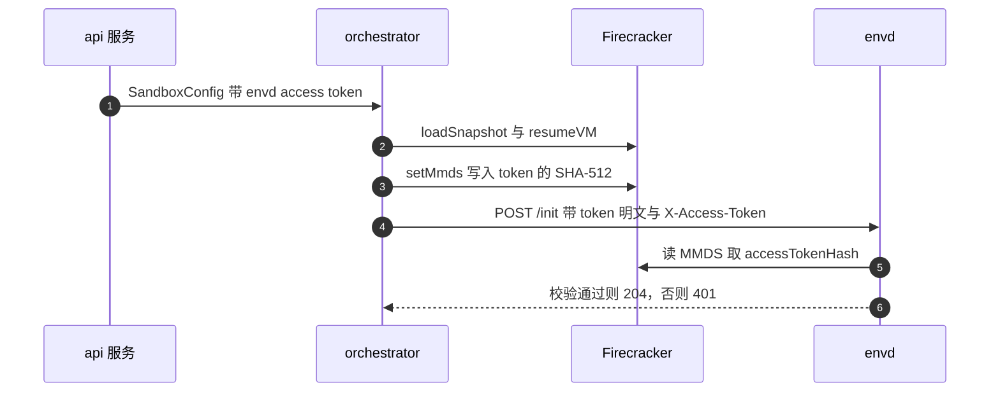

# 36 · 代理与 envd 通信

> 一台沙箱跑起来之后，宿主与 guest 之间有三条方向不同的 HTTP 通道：外部流量经 edge 进 orchestrator 的
> 代理再进沙箱；orchestrator 主动调用 envd 的 `/init` 把租户参数灌进去；沙箱里的进程反过来回调
> orchestrator 的 hyperloop 端口。本篇讲这三条通道各自解决什么问题、边界在哪里，以及
> access token 在其中的生成与校验位置。
>
> **读者**：后端与网络方向的读者。
> **预备**：[第 27 篇 · ResumeSandbox](27-resume-sandbox.md)、[第 35 篇 · 沙箱网络](35-sandbox-networking.md)。
> **代码**：`packages/orchestrator/internal/proxy/`、`packages/orchestrator/internal/sandbox/envd.go`、
> `packages/orchestrator/internal/sandbox/envd/`、`packages/orchestrator/internal/hyperloopserver/`、
> `packages/shared/pkg/proxy/`、`spec/openapi-hyperloop.yml`、`packages/envd/spec/envd.yaml`、
> `packages/envd/internal/api/init.go`

---

## 0. 本篇要回答的问题

1. 宿主与沙箱之间为什么要三条通道，而不是把它们合并成一条？
2. orchestrator 的代理怎么从一个 HTTP 请求推出「往哪个 IP 的哪个端口发」？
3. 连接池的 key 为什么用 `LifecycleID` 而不是 sandbox ID，也不是目的 IP 加端口？
4. `/init` 请求里都放了什么，为什么每次重试都要重新打时间戳？
5. envd 的 access token 是谁生成的、经过哪些环节、在哪一行代码上被校验？
6. envd 已经有 token 之后，恢复出来的沙箱怎么换发一个新 token 而不被自己的鉴权挡住？

---

## 1. 三条通道，三种信任关系

沙箱是一台 microVM，它的网络只有一个出口：宿主上那对 veth 与 netns
（[第 35 篇 §2](35-sandbox-networking.md#2-建立一个槽位createnetwork-的完整步骤)）。宿主与 guest 之间要传的东西却有三类，
它们在方向、发起方、鉴权方式上都不一样，所以上游 2026.09 没有把它们塞进一条通道。

| 维度 | 通道一：沙箱流量 | 通道二：envd 初始化 | 通道三：hyperloop |
|---|---|---|---|
| 方向 | 宿主 → guest | 宿主 → guest | guest → 宿主 |
| 发起方 | 外部用户经 edge | orchestrator 自己 | envd 与沙箱内进程 |
| 宿主侧端口 | `PROXY_PORT`，默认 5007 | 无监听，直接出站 | `SANDBOX_HYPERLOOP_PROXY_PORT`，默认 5010 |
| guest 侧端点 | 任意端口，含 envd 的 49983 | envd 的 `POST /init` | 无 |
| 鉴权 | traffic access token / envd 自己的 token | MMDS 里的 token 哈希 | 按源 IP 认沙箱 |

第一条是**数据平面**：用户要打开沙箱里跑的 Web 服务，或者 SDK 要调 envd 的进程与文件接口。
第二条是**控制平面**：沙箱刚从快照恢复出来，guest 里的 envd 还带着上一次运行的环境变量、
上一次的时钟、上一次的 token，必须由宿主推一次新状态进去。
第三条是**回程**：沙箱内的日志与「我是谁」的查询要送回宿主，而 guest 并不知道宿主的真实地址。

把它们合并有具体的坏处。控制平面若走代理端口，就要在代理里给自己开一条鉴权豁免；
回程若走代理端口，就要求 guest 能主动连宿主的公共端口，而这正是沙箱网络明确要拒绝的方向。
分成三条的代价是三份端口配置与三处超时参数，收益是每条通道的信任边界可以单独描述。

---

## 2. 通道一：orchestrator 里的沙箱代理

### 2.1 从请求到目的地

代理本体是 `packages/orchestrator/internal/proxy/proxy.go` 的 `NewSandboxProxy()`。
它不实现 HTTP 转发逻辑，只提供一个「从请求算出目的地」的回调，转发交给
`packages/shared/pkg/proxy` 的 `New()`（同一个库也被 edge 复用，见
[第 54 篇 §1](54-shared-proxy-library.md#1-一个库两个使用者)）。

回调里的四步：

1. `reverseproxy.GetTargetFromRequest(env.IsLocal())` 解析出 sandbox ID 与端口。
   非本地环境只看 Host：`packages/shared/pkg/proxy/host.go` 的 `parseHost()` 取最左侧的子域，
   按 `-` 切开，第一段是端口、第二段是 sandbox ID。本地开发时额外允许用
   `E2b-Sandbox-Id` 与 `E2b-Sandbox-Port` 两个头覆盖。
2. 在进程内的 sandbox map 里按 ID 查（`internal/sandbox/map.go`）。查不到就返回
   `NewErrSandboxNotFound`，`handler.go` 把它渲染成一张 HTML 错误页。
3. 校验 traffic access token（见 [§2.4](#24-两个-token-与两处校验)）。
4. 拼出 `http://<slot 的宿主侧 IP>:<port>`，连同一批日志字段包成 `pool.Destination` 返回。

这里有一个容易被忽略的事实：**代理不做任何跨节点寻址**。它只服务本节点 sandbox map 里的沙箱，
「哪个沙箱在哪个节点」是 edge 查 sandbox catalog 解决的
（[第 55 篇 §4](55-sandbox-catalog-and-routing.md#4-读取者client-proxy-的一次解析)）。
orchestrator 的代理拿到的请求已经确定落在本机。

### 2.2 连接池的 key 为什么是 LifecycleID

`packages/shared/pkg/proxy/pool/pool.go` 的 `ProxyPool.Get()` 用 `Destination.ConnectionKey`
在一张 map 里取 `ProxyClient`；每个 `ProxyClient` 包着自己的 `http.Transport`，也就是自己的
一套 keepalive 连接。**同一个 key 的请求共用连接，不同 key 之间的连接互不可见。**

edge 侧只用一个常量 key `client-proxy`，因为它连的是各节点的代理端口，复用没有风险。
orchestrator 侧不行，原因写在 `proxy.go` 的注释里：网络槽位是回收复用的
（[第 35 篇 §4](35-sandbox-networking.md#4-复用一个槽位复位了什么没复位什么)），**先后两台沙箱可能拿到同一个 IP 加端口**。
如果连接池按 IP 加端口去认，一台沙箱停掉之后残留的 keepalive 连接就会被下一台沙箱的请求捡起来用，
而那条 TCP 连接的对端早已不是原来的 guest。

于是需要一个「一次 microVM 生命期」粒度的标识。`internal/sandbox/sandbox.go` 里 `Sandbox`
结构上的 `LifecycleID` 正是这个：注释说明它「每启动一个新的 Firecracker 虚机就换一次」，
由 `uuid.NewString()` 生成，与 `ExecutionID` 相对——后者跨 checkpoint 保持稳定、要给 API 用。

为什么不直接用 sandbox ID？同一段注释给了答案：连接是按 key 成批关闭的
（`ProxyPool.Close()`），而 sandbox ID 在 pause / resume 前后不变。用 sandbox ID 当 key，
恢复出来的新沙箱与正在被清理的旧沙箱会撞在同一个池子上，清理动作会把新沙箱的连接一并关掉。
`internal/server/sandboxes.go` 里沙箱停止后的清理协程正是同时调
`sandboxes.RemoveByLifecycleID(...)` 与 `s.proxy.RemoveFromPool(sbx.LifecycleID)`，
两处用的是同一个 ID，语义上「只清我这一代」。模板构建路径上也一样
（`internal/template/build/layer/layer_executor.go`）。

代价是池子的条目数与沙箱的启动次数同阶，而不是与并发沙箱数同阶——所以清理必须可靠，
否则条目只增不减。`RemoveFromPool()` 先 `closeIdleConnections()` 再 `resetAllConnections()`，
把仍然活着的连接也强制断开。

### 2.3 重试、超时与连接数上限

`packages/shared/pkg/proxy/proxy.go` 的 `New()` 收三个与时间和次数有关的参数，
orchestrator 传的值与 edge 不同：

| 参数 | orchestrator 代理 | edge 代理 |
|---|---|---|
| `maxConnectionAttempts` | `SandboxProxyRetries` = 5 | `ClientProxyRetries` = 1 |
| `idleTimeout` | 620 s | 见[第 53 篇 §5](53-client-proxy-edge.md#5-转发交给共享代理库) |
| `disableKeepAlives` | `true` | `false` |

重试发生在 `pool/client.go` 的 `DialContext` 里，**只对建连失败重试**，退避是线性的
100 ms、200 ms、300 ms、400 ms。注释给了理由：沙箱内的进程绑到 localhost 之后，
envd 的端口扫描要花大约 1 s 才能发现它并起 socat 把端口转到 guest 的对外 IP
（[第 51 篇 §2](51-envd-ports-permissions-metrics.md#2-端口扫描与转发)）。
换句话说，这 5 次重试是在等 guest 内部的端口转发就位，不是在容错网络抖动。
边缘侧没有这个问题，所以只试 1 次。

`idleTimeout` 取 620 s，`proxy.go` 的注释说明它必须大于 GCP 负载均衡器 600 s 的上游空闲超时，
否则会出现「LB 认为连接还在、后端已经关掉」的竞态；同时服务端一侧的 `IdleTimeout` 又比它
再多 10 s（`idleTimeoutBufferUpstreamDownstream`），保证越靠近客户端的一层超时越长。

`disableKeepAlives` 在 orchestrator 侧是打开的（即禁用 keepalive）。注释的理由是沙箱内的服务
可能反复重启，而代理与沙箱在同一台宿主上，重新建连的开销很小。这一条与 §2.2 的连接池讨论并不矛盾：
池子仍然按 key 分开，只是每个池子里不留空闲连接。

每沙箱的并发连接数上限由特性开关 `sandbox-max-incoming-connections` 控制，
默认值 −1，`packages/shared/pkg/connlimit/limiter.go` 的 `TryAcquire()` 对负数不设限。
超限时返回的是一张「连接过多」的错误页而不是 502。

### 2.4 两个 token 与两处校验

沙箱可以有两个互不相干的 token，容易混淆：

- **traffic access token**：保护「非 envd 端口」的流量，也就是用户自己在沙箱里跑的服务。
  由 API 在创建沙箱时按需生成（`packages/api/internal/orchestrator/create_instance.go`，
  仅当 `network.Ingress.AllowPublicAccess` 显式为 false 时），随
  `SandboxConfig.Network.Ingress` 下发到 orchestrator。校验发生在
  `internal/proxy/proxy.go` 的目的地回调里：读请求头 `e2b-traffic-access-token`，
  缺失与不匹配分别对应两种错误页。
- **envd access token**：保护 envd 自己的接口。它**不**在代理层校验——`proxy.go` 里
  `isNonEnvdTraffic` 这个判断显式跳过了 49983 端口，注释说明「envd 有自己的校验机制」。

两者都由 `packages/api/internal/sandbox/sandbox_envd_secret.go` 的 `AccessTokenGenerator`
产生，用同一把 HMAC-SHA256 种子密钥（`SandboxAccessTokenHashSeed`）：
`GenerateEnvdAccessToken()` 直接对 sandbox ID 取 HMAC，`GenerateTrafficAccessToken()`
对 `sandbox-traffic-<sandbox ID>` 取 HMAC。这是一个**确定性推导**而不是随机数：
API 任何一个实例、任何时刻，只要拿到 sandbox ID 就能重算出同一个 token，不需要把它存进数据库。
`packages/api/internal/handlers/sandbox_get.go` 与 `proxy_grpc.go` 都在用这个性质——
前者在返回沙箱信息时现算，后者在校验入站 gRPC 元数据时现算并比对。

代价也在这里：种子密钥一旦泄露，所有沙箱的两个 token 都可推导；
轮换种子会让所有在跑的沙箱的 token 失效。**推论**：这是把「无状态推导」置于「可轮换」之上的取舍，
上游 2026.09 的代码里没有看到种子轮换的路径。

---

## 3. 通道二：orchestrator 调 envd 的 `/init`

### 3.1 这个请求解决什么问题

从快照恢复出来的 guest，其内存镜像是上一次运行留下的：进程还在、环境变量还是老的、
系统时钟停在打快照的那一刻。`/init` 是宿主把「这一次运行的身份」推给 envd 的唯一入口。

请求体的字段定义在 `packages/envd/spec/envd.yaml` 的 `/init` 下，orchestrator 侧由
`packages/orchestrator/internal/sandbox/envd/` 从同一份 spec 生成
（`generate.go` 直接指向 `../../../../envd/spec/envd.yaml`，所以两侧结构天然同步）。
填充在 `internal/sandbox/envd.go` 的 `doRequestWithInfiniteRetries()` 里：

| 字段 | 来源 | envd 收到后做什么 |
|---|---|---|
| `envVars` | `Config.Envd.Vars` | 逐条存进 `a.defaults.EnvVars` |
| `accessToken` | `Config.Envd.AccessToken` | 校验通过后接管为新的 token |
| `timestamp` | 每次重试前重新 `time.Now()` | 与 guest 当前时间比较，必要时校时 |
| `hyperloopIP` | `NetworkConfig.OrchestratorInSandboxIPAddress` | 改写 `/etc/hosts` 并设 `E2B_EVENTS_ADDRESS` |
| `defaultUser` / `defaultWorkdir` | 同名配置 | 存为后续 exec 的默认值 |
| `volumeMounts` | `Config.VolumeMounts` 转换而来 | 起协程挂 NFS，见[第 40 篇 §4](40-volumes-and-nfsproxy.md#4-一次挂载的完整路径) |

对时那一段值得单独看。`packages/envd/internal/api/init.go` 的 `SetData()` 拿到 timestamp 后
调 `shouldSetSystemTime(time.Now(), *data.Timestamp)`，只有当 guest 当前时间比宿主给的时间
早了超过 `maxTimeInPast`（50 ms）或者晚了超过 `maxTimeInFuture`（5 s）才会
`unix.ClockSettime(unix.CLOCK_REALTIME, ...)`。两个阈值不对称：往回拨时钟对 guest 里的程序
更危险，所以容忍度更小；网络往返本身会让 guest 时间「显得」偏早几毫秒，所以也不能取 0。
注意这一步失败只记错误日志，不让 `/init` 失败——校时被当作尽力而为的动作。

`hyperloopIP` 那一段建立的正是通道三：envd 把 `events.e2b.local` 这个名字指向宿主在沙箱内的
地址，并把 `http://<该地址>` 写进环境变量 `E2B_EVENTS_ADDRESS`，让沙箱里的用户进程能找到它。

### 3.2 无限重试与两层超时

`doRequestWithInfiniteRetries()` 的名字说得很直白：循环里发请求，只要 `sandboxHttpClient.Do`
返回错误就等 `loopDelay`（5 ms）再发一次，**没有次数上限**。停下来的唯一方式是外层 context 结束，
函数注释也写明「父 context 必须带 deadline 或 timeout」。

于是这条路径上有两层时间预算：

- **单次请求超时**：`s.internalConfig.EnvdInitRequestTimeout`，来自特性开关
  `envd-init-request-timeout-milliseconds`，上游默认 **50 ms**
  （`packages/shared/pkg/feature-flags/flags.go`），在 `Factory.GetEnvdInitRequestTimeout()`
  取值后固化进沙箱的 `internalConfig`。
- **总预算**：`WaitForEnvd()` 的 `timeout` 参数，取自 `internal/cfg/model.go` 的
  `ENVD_TIMEOUT`，默认 10 s。这个 goroutine 同时监听 Firecracker 进程的退出通道，
  FC 提前挂掉会立刻 `cancel` 掉整轮等待，而不是干等到超时。

50 ms 这个值不是「envd 应该在 50 ms 内答复」，而是「50 ms 没答复就立刻重发」。
沙箱刚恢复时 envd 可能还没被调度上 CPU，一次长等待不如快速轮询：单次超时越短，
探到 envd 就绪的时间分辨率越高。代价是失败计数会很大——
`initEnvd()` 把 `count-1` 次失败与 1 次成功分别记进 `envdInitCalls` 指标，
在慢节点上这个计数会显著抬高。

只有 204 才算成功；其它状态码会把响应体截断 100 字节记进日志再返回错误。

### 3.3 为什么每次重试都要重新打时间戳，以及重复 init 的幂等

循环体第一行是 `jsonBody.Timestamp = time.Now()`，然后才重新序列化。
理由有两个方向：

其一，时间戳是**给 guest 校时用的**，如果沿用第一次构造请求时的时刻，重试拖了几百毫秒，
guest 就会被校到一个已经偏早的时间上，而 50 ms 的容忍窗口比这个误差还小。

其二，它同时是 envd 侧的**顺序判据**。`PostInit` 里在锁内做
`a.lastSetTime.SetToGreater(initRequest.Timestamp.UnixNano())`，只有当新时间戳大于已记录的
才会真正执行 `SetData()`。这防的是一类具体的竞态：orchestrator 因为超时而重发，
其实前一发已经到达并生效了，两发的处理顺序不受控；带上单调时间戳之后，
迟到的旧请求会被静默跳过，但**仍然返回 204**——对调用方来说，重复 init 是幂等的。

---

## 4. access token 的换发：MMDS 哈希

`/init` 有一个先有鸡还是先有蛋的问题。envd 的鉴权中间件
（`packages/envd/internal/api/auth.go` 的 `WithAuthorization`）在 token 已设置时会拦下所有请求，
而 `POST/init` 被放进了 `authExcludedPaths`。这不是把 `/init` 变成无鉴权接口，
注释写得很清楚：`/init` 改用 MMDS 哈希校验。

链条是这样的：

1. **生成**：API 侧 `GenerateEnvdAccessToken(sandboxID)`，见 [§2.4](#24-两个-token-与两处校验)。
2. **下发**：随 `SandboxCreateRequest` 到 orchestrator，落在 `Config.Envd.AccessToken`。
3. **写入 MMDS**：`internal/sandbox/fc/process.go` 在 `loadSnapshot` 与 `resumeVM` 之后、
   envd init 之前调 `setMmds()`，把 `keys.HashAccessToken(*accessToken)`（SHA-512 十六进制）
   放进 `MmdsMetadata.AccessTokenHash`。没有 token 时写的是 `HashAccessToken("")`，
   这是一个**显式的「允许清空」信号**，不是留空。
4. **发送**：`/init` 的请求体里带明文 token；同时如果 token 非空，
   请求头也会带一份 `X-Access-Token`——`envd.go` 的注释说明这是为了让「已经鉴过权的 envd」
   不会把这次请求挡在中间件外面（恢复场景，或者上一发其实成功了）。
5. **校验**：`packages/envd/internal/api/init.go` 的 `validateInitAccessToken()`。
   顺序是：先比对已有 token（快路径）；不匹配再读 MMDS 哈希比对；两边都没有则视为首次初始化放行；
   请求没带 token 而 MMDS 说要 token，返回 `ErrAccessTokenResetNotAuthorized`；
   其余情况 `ErrAccessTokenMismatch`。两种错误在 `PostInit` 里都映射成 401。

MMDS 在这里的作用是一条**带外信道**：它由 Firecracker 提供，只有宿主能写、只有 guest 能读
（[第 28 篇 §6](28-firecracker-process-management.md#6-mmds沙箱身份的投递通道)）。
envd 因此能够在不信任请求内容的前提下，确认「换 token 这件事是宿主授权的」。
存进 MMDS 的是哈希不是明文，即使 guest 里的用户进程去读 MMDS，拿到的也不是可用的凭证。

顺带一提，token 在 envd 内部用 `memguard` 保护，`PostInit` 读完请求体就 `WipeBytes`，
未被接管的 token 走 `defer initRequest.AccessToken.Destroy()`。
orchestrator 侧没有这层处理——`internal/sandbox/envd/types.go` 明确写着
`SecureToken` 在 orchestrator 里只是 `string` 的别名，安全内存处理只在 envd 服务里做。

---

## 5. 通道三：hyperloop

### 5.1 沙箱怎么找到宿主

hyperloop 的服务端是 `packages/orchestrator/internal/hyperloopserver/server.go` 的
`NewHyperloopServer()`，一个 gin 引擎，监听 `SANDBOX_HYPERLOOP_PROXY_PORT`（默认 5010），
在 `main.go` 里与其它服务一起起起来。契约在 `spec/openapi-hyperloop.yml`，只有两个端点，
请求校验用 `OapiRequestValidatorWithOptions` 中间件按 spec 做，上传体限 256 MiB。

guest 并不知道 5010 这个端口。它看到的是一个约定地址
`SANDBOX_ORCHESTRATOR_IP`，默认 `192.0.2.1`——`network/pool.go` 的注释说明这取自
RFC 5737 保留给文档用途的网段，正是为了不与真实网络冲突。
`internal/sandbox/network/network.go` 在建槽位时往 netns 的 `nat/PREROUTING` 里加一条规则，
把发往这个地址 80 端口的 TCP `REDIRECT` 到宿主的 `hyperloopPort`。同样的手法还用于
NFS 的 111 与 2049 端口（[第 40 篇 §4](40-volumes-and-nfsproxy.md#4-一次挂载的完整路径)）。

于是 guest 侧只需要 `http://192.0.2.1/logs` 这样一个固定 URL，端口映射对它透明。

### 5.2 `/me` 与 `/logs`

两个端点的鉴权方式相同，而且都不是 token：`handlers/me.go` 与 `handlers/logs.go`
都先调 `sandboxes.GetByHostPort(c.Request.RemoteAddr)`。
`internal/sandbox/map.go` 的 `GetByHostPort()` 把远端地址拆出 IP，
线性扫描 sandbox map 找 `Slot.HostIPString()` 相等的那台。
**源 IP 就是身份**——每台沙箱占一个独立的网络槽位，槽位 IP 与沙箱一一对应，
这条规则由网络层保证，不需要额外的凭证。

代价是线性扫描：每条日志上报都要遍历一遍本机沙箱表。**推论**：在单机几百台沙箱、
日志量不大的情况下这不构成瓶颈，但它确实是一个随沙箱数增长的常数因子。

`/me` 返回 `{sandboxID}`。它的用处是让沙箱内部的代码知道自己是谁——guest 里没有别的地方
能拿到这个 ID，模板是共享的，快照恢复出来的 guest 更是完全不知道自己这一次的身份。

`/logs` 接收一段任意 JSON。handler 做的关键动作只有两行：
把 `payload["instanceID"]` 与 `payload["teamID"]` 用查出来的沙箱信息**覆盖**掉，
注释直接写 `to avoid spoofing`。这是必要的：沙箱里跑的是用户代码，
如果不覆盖，一台沙箱可以往另一个团队的日志流里写东西。覆盖之后再转发给
`env.LogsCollectorAddress()`，用一个超时 10 s 的 `http.Client`。

envd 自己也是这条通道的用户。`packages/envd/internal/logs/exporter/exporter.go` 从
MMDS 里拿 `address` 字段（由 `fc/process.go` 填成 `http://<orchestrator IP>/logs`），
把 envd 的结构化日志 POST 过去。所以 MMDS 在这里承担了第二个职责：
除了 token 哈希，它还是 guest 获知日志回传地址的途径。

### 5.3 顺带一提：健康检查与指标不走这三条

`internal/sandbox/health.go` 的 `getHealth()` 与 `metrics.go` 的 `GetMetrics()`
也是 orchestrator 直连 guest 的 49983 端口，与 `/init` 共用同一个
`sandboxHttpClient`（`sandbox.go` 里定义，10 s 总超时、禁用 keepalive、不尝试 HTTP/2）。
它们在结构上属于通道二的延伸，只是不走 `/init` 这个端点；`/metrics` 会带 `X-Access-Token`，
`/health` 在 envd 侧属于免鉴权路径。这两条路径的语义在
[第 39 篇 §2](39-health-errors-and-teardown.md#2-健康检查一个没有权力的探针)展开。

---

## 6. ARM 适配版的差异

ARM 适配版把特性开关 `envd-init-request-timeout-milliseconds` 的兜底值从 50 ms
改成 120000 ms（`packages/shared/pkg/feature-flags/flags.go`），同时部署侧把
`ENVD_TIMEOUT` 设为 60 s。两者叠加的后果是 §3.2 那个「快速轮询」模型失效：
单次请求的名义超时远大于总预算，而每次请求实际被 `sandboxHttpClient` 的 10 s 客户端总超时截住，
于是 60 s 预算内的重试次数从上游的成百上千次降到约六次，成败取决于这几次里有没有一次在 10 s 内返回。
另外 `packages/envd/internal/host/mmds.go` 里读 MMDS 的 HTTP 客户端去掉了
`DisableKeepAlives` 并开了空闲连接池。细节与动机见
[第 77 篇 §3](77-api-and-flags-on-arm.md#3-envd-init-超时一次尝试到底能等多久)与
[第 71 篇 §9](71-orchestrator-arm-fc-changes.md#9-参数总表)。

---

## 7. 小结

- 宿主与沙箱之间有三条 HTTP 通道，按方向与信任关系划分：代理转发的沙箱流量、
  orchestrator 主动发起的 `/init`、guest 回调宿主的 hyperloop。
- orchestrator 的代理只做本机寻址：`parseHost` 从子域取出 sandbox ID 与端口，
  在本机 sandbox map 里查槽位 IP，跨节点路由是 edge 的事。
- 连接池按 `LifecycleID` 分片，因为网络槽位会复用 IP，而 sandbox ID 跨 pause / resume 不变；
  用 `LifecycleID` 才能保证「清理只影响这一代 microVM」。
- 建连重试 5 次、线性退避，目的是等 guest 内部端口转发就位，不是容忍网络抖动；
  620 s 的空闲超时是为了压过上游负载均衡器的 600 s。
- 沙箱有两个 token：traffic token 在代理层校验，envd token 在 envd 内校验，
  代理显式跳过 49983 端口。两者都由 API 用同一把 HMAC 种子从 sandbox ID 确定性推导，
  不落库，代价是不可单独轮换。
- `/init` 把环境变量、access token、时间戳、hyperloop 地址、默认用户与卷挂载一次性推给 envd；
  校时有 50 ms / 5 s 的非对称阈值，失败不阻塞 init。
- `/init` 是无限重试 + 外层 deadline 的结构，重试前重新打时间戳，
  既保证校时准确，也让 envd 能用单调时间戳丢弃迟到的旧请求。
- envd 用 MMDS 里的 token 哈希校验 `/init`，这条带外信道使得「换发 token」这件事
  可以在不信任请求内容的前提下被授权。
- hyperloop 用源 IP 认沙箱，并强制覆盖上报日志里的 `instanceID` 与 `teamID`，
  防止沙箱内的用户代码伪造归属。

## 延伸阅读 / 下一篇

- [第 35 篇 §4](35-sandbox-networking.md#4-复用一个槽位复位了什么没复位什么)：槽位 IP 的复用与回收，本篇多处依赖它的结论。
- [第 37 篇 · Pause：脏页判定与差分导出](37-pause-and-snapshot.md)：下一篇，讲沙箱被暂停时产生什么。
- [第 48 篇 §4](48-envd-overview.md#4-init-在-envd-侧做了什么)：`/init` 在 envd 内部的完整落地；
  [第 48 篇 §5](48-envd-overview.md#5-鉴权一个开关四条豁免两种凭据)：envd 侧鉴权的四条豁免。
- [第 54 篇 §2](54-shared-proxy-library.md#2-分池connectionkey-是什么)：连接池分片的完整论证；
  [第 54 篇 §6](54-shared-proxy-library.md#6-错误页一份数据两种表现)：错误页的两种表现。
- [第 40 篇 §7](40-volumes-and-nfsproxy.md#7-volumemounts-的失败路径)：`volumeMounts` 字段之后发生的事。
- [RFC 5737](https://datatracker.ietf.org/doc/html/rfc5737)：`192.0.2.0/24` 这个保留网段的出处。
