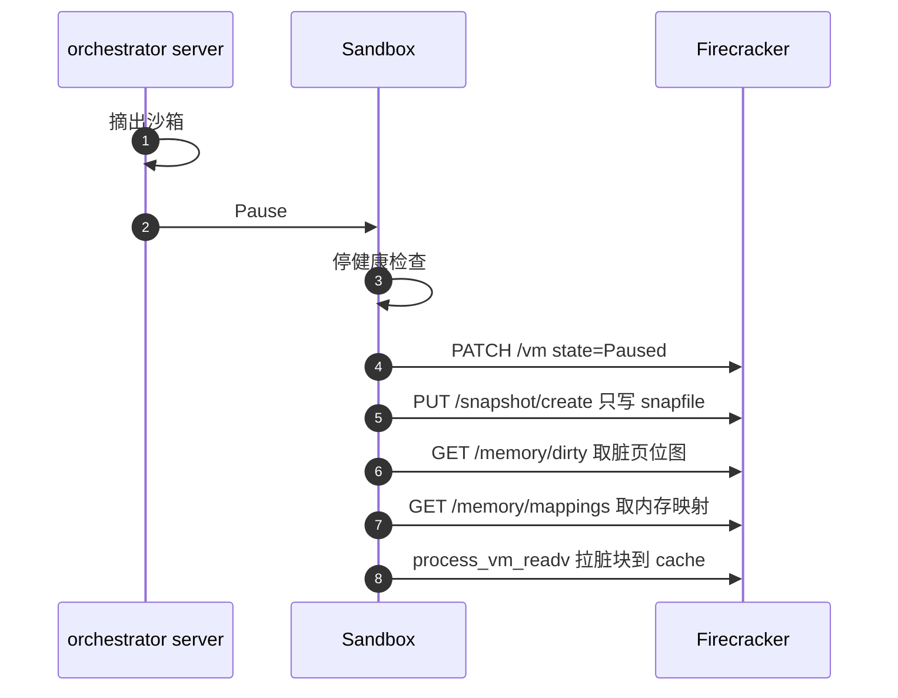
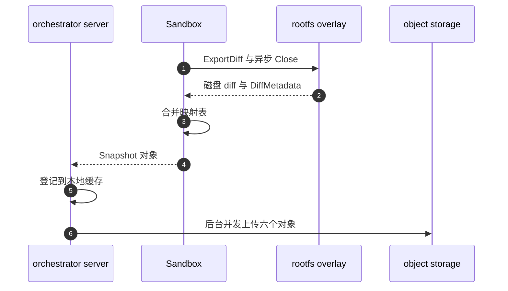

# 37 · Pause：脏页判定与差分导出

> 暂停一台沙箱不是「把内存写到磁盘」这么简单。产物必须是**差分**，否则每次暂停都要写出整个内存；
> 而「哪些块是差分」这个判据，决定了整套增量方案是真的省，还是只是看起来省。
> 本篇讲上游 2026.09 的 Pause 从暂停 VM 到上传产物的全过程，重点是脏页判据、映射表合并与失败语义。
>
> **读者**：系统工程师、后端工程师。
> **预备**：[第 29 篇 · 模板产物格式](29-template-artifact-format.md#3-header-的字节布局)、
> [第 30 篇 · block 包](30-block-layer.md#3-cachemmap-加一张位图)、
> [第 31 篇 · 内存后端：uffd 服务](31-uffd-memory-backend.md#6-暂停时的脏页位图)。
> **代码**：`packages/orchestrator/internal/sandbox/sandbox.go`、`snapshot.go`、`diffcreator.go`、
> `internal/sandbox/fc/memory.go`、`fc/client.go`、`internal/sandbox/build/`、
> `packages/shared/pkg/storage/header/`、`packages/orchestrator/internal/server/sandboxes.go`

---

## 0. 本篇要回答的问题

1. Pause 的步骤是什么，为什么调用 Firecracker 的快照接口时**不**传内存文件路径？
2. 「这一块内存是脏的」这个判据，2026.09 的代码到底从哪里拿？判据本身是什么表达式？
3. 内存 diff 是怎么从 Firecracker 进程里取出来的，为什么不是由 Firecracker 自己写文件？
4. 磁盘 diff 与内存 diff 的生成路径为什么不一样，空块处理为什么不对称？
5. 映射表（header）合并的规则是什么，哪一步会把一次暂停的成本从 O(脏块) 拉回 O(内存)？
6. 上传失败会发生什么？Checkpoint RPC 与 Pause RPC 的差别在哪里？

---

## 1. 问题：暂停的成本必须正比于改动量

一台沙箱的内存是 512 MiB 到几 GiB，rootfs 是几 GiB。如果服务端把内存和磁盘完整写出并上传，
单次暂停的时间与存储成本就正比于**沙箱规模**，而不是正比于**用户做了多少事** ——
刚拉起来跑了两条命令的沙箱和跑了半小时的沙箱代价一样。这在计费上不合理，在延迟上更不可接受。

e2b 的做法是让每次暂停只产出一个 diff：一个 build，只包含这次运行期间被改写过的块，
外加一份 header 把「每个块归属于哪一代 build」记下来。恢复时按 header 逐块回溯到最近一次写它的 build。
产物格式与 header 的结构在[第 29 篇 §3](29-template-artifact-format.md#3-header-的字节布局)已经讲过，本篇讲**产出它的过程**。

这个设计把全部压力压到一个问题上：**判定哪些块脏了。**

判据有方向性。**漏记**一个被写过的块，恢复时它会读到上一代的旧内容，是静默的数据损坏；
**多记**一个没写过的块，只是让 diff 变大、上传变慢，正确性不受影响。所以宁可多记，不可漏记。
判据退化的后果因此不是报错，而是一种静默的成本退化。

---

## 2. Pause 的时序

入口是 orchestrator 的 `Pause` RPC（`internal/server/sandboxes.go` 的 `Server.Pause()`），
它调用 `acquireSandboxForSnapshot()` 取出沙箱，再走 `snapshotAndCacheSandbox()`，
后者调用 `sandbox.go` 的 `Sandbox.Pause()` 做真正的快照。

下面分两段看：先是停机与取内存（`S` 为 orchestrator server、`SB` 为 Sandbox、`FC` 为 Firecracker）。



然后是磁盘 diff 的导出与落地（`R` 为 rootfs overlay、`O` 为对象存储）。



### 2.1 摘出沙箱：`pauseMu` 保护的是什么

`acquireSandboxForSnapshot()` 持有 `Server.pauseMu`（`internal/server/main.go` 中的 `sync.Mutex`），
在锁内做两件事：从 sandbox map 里 `Get`，然后 `Remove`。**锁只覆盖这两步，随即释放**，
并不串行化整个快照过程。它的作用是保证同一台沙箱不会被两个并发请求同时摘走：
先到者拿到对象，后到者看到 map 里已经没有这个 ID，返回 `codes.NotFound`。

沙箱一旦被摘出 map，就不再可路由、不再可被 Delete 找到，快照失败也不会把它还回去 ——
`Server.Pause()` 用 `defer s.stopSandboxAsync(...)` 注册了后台停机，无论成败都执行。暂停是单向操作。

### 2.2 暂停 VM，然后创建一个不含内存的快照

`Sandbox.Pause()` 先调 `Checks.Stop()` 停掉 envd 健康探测（否则探测会在 VM 冻结后连续失败），
再调 `s.process.Pause()` → `fc/client.go` 的 `pauseVM()` 发 `PATCH /vm` 把状态置为 `Paused`。
vCPU 线程停在这里，之后所有观测都是对一个静止的内存映像做的。

接下来这一步是整个设计的枢纽。`fc/client.go` 的 `createSnapshot()` 构造的请求是：

```go
snapshotConfig := operations.CreateSnapshotParams{
    Body: &models.SnapshotCreateParams{
        SnapshotType: models.SnapshotCreateParamsSnapshotTypeFull,
        SnapshotPath: &snapfilePath,
    },
}
```

两个细节：`SnapshotType` 固定为 `Full`，从不使用 `Diff`；`MemFilePath` 根本没有设置。
上游 `sandbox.go` 中 `Pause()` 的注释把原因写得很直白 ——
对分叉 Firecracker 来说，不传内存文件路径意味着这次调用只做三件事：
序列化 vmstate 到 snapfile、把块设备的写入排空并刷盘、保持 VM 处于 Paused。
**它不写内存文件。** 内存由 orchestrator 自己稍后从 Firecracker 进程里取。

为什么这样拆？Firecracker 原生的 `Diff` 快照依赖 KVM 的脏页日志
（`TrackDirtyPages`，见 `fc/client.go` 的 `setMachineConfig()`，上游把它设为 `false`），
而 e2b 的内存不是 Firecracker 自己分配的匿名内存，是注册给 userfaultfd 的区域，页面由 uffd 服务按需填入。
脏页的真相在 userfaultfd 一侧，不在 KVM 的日志里，于是不让 Firecracker 写内存文件，
只借它做 vmstate 序列化和磁盘刷盘。代价是 orchestrator 自己承担导出的全部复杂度：
拿映射、跨进程读、对齐、重试；收益是判据能精确到「只读不写的页不算脏」。

---

## 3. 脏页判据

### 3.1 两条来源，取决于这台沙箱是不是从快照拉起的

`Sandbox.Pause()` 通过内存后端接口取判据：

```go
memfileDiffMetadata, err := s.Resources.memory.DiffMetadata(ctx, s.process)
```

`MemoryBackend` 接口（`internal/sandbox/uffd/memory_backend.go`）有两个实现：

| 实现 | 何时使用 | `DiffMetadata()` 的做法 |
|---|---|---|
| `Uffd` | 从快照恢复的沙箱（`ResumeSandbox`） | 转调 `fc.Process.DirtyMemory()`，走 `GET /memory/dirty` |
| `NoopMemory` | 冷启动的沙箱（模板构建路径） | 转调 `fc.Process.MemoryInfo()`，走 `GET /memory` |

`uffd/uffd.go` 的 `Uffd.DiffMetadata()` 只有一行实现，把 `u.memfile.BlockSize()` 作为粒度传下去；
函数注释明确要求它**只能在 VM 已经通过 API 暂停、并且 snapshot 接口已经调用之后**被调用。
`fc/memory.go` 的 `DirtyMemory()` → `fc/client.go` 的 `dirtyMemory()` 拿到一个 `[]uint64` 位图，
包成 `header.DiffMetadata`，其中 `Empty` 被显式置为 `bitset.New(0)` —— 空位图，不标任何块为空洞。

`uffd/noop.go` 的 `NoopMemory.DiffMetadata()` 走另一条路：`memoryInfo()` 返回 `Resident` 与 `Empty`
两个位图，代码取 `Dirty = Resident \ Empty`，再把「所有块」减去 `Dirty` 得到 `Empty`。
这条路径服务于冷启动：沙箱没有基底层可继承，未驻留的块在恢复时都应读成零，所以要显式标空。
按上游注释，这里的 dirty 本质是「被 fault 进来的驻留页」而非「被写过的页」——
对冷启动是对的，整个内存本来就要从零建立。

### 3.2 分叉 Firecracker 侧：先 mincore，再 pagemap

`GET /memory/dirty` 在分叉 Firecracker 里由 `src/vmm/src/rpc_interface.rs` 的
`get_dirty_memory_info()` 处理。它先检查 VM 必须处于 `Paused`，否则返回
`OperationNotSupportedWhileRunning` —— 这解释了为什么 Go 侧要先暂停再取位图。
然后它取 `machine_config.huge_pages.page_size()` 作为粒度，调用 `src/vmm/src/lib.rs` 的
`get_dirty_memory()`。

`get_dirty_memory()` 对每个 guest 内存区域做两遍：

1. `src/vmm/src/vstate/vm.rs` 的 `mincore_bitmap()` 用一次 `mincore(2)` 拿到驻留位图。
   `mincore` 的粒度是宿主页（4 KiB），代码按 `page_size` 归并：大页内任一宿主页驻留即算驻留。
2. 只对驻留的页读 `/proc/self/pagemap`（`src/vmm/src/utils/pagemap.rs` 的 `PagemapReader`），
   注释写明这是为了减少 pagemap 读次数。

判据落在 `PagemapReader::is_page_dirty()` 上，表达式是：

```text
脏  ⟺  pagemap bit 63 (present) == 1  且  pagemap bit 57 (uffd write-protected) == 0
```

bit 57 是内核为 userfaultfd 写保护页设置的标志位。这个判据能成立，是因为 uffd 服务在填页时
按访问类型区分了写保护：`uffd/userfaultfd/userfaultfd.go` 的 `faultPage()` 里，
**读**缺页填入时带上 `UFFDIO_COPY_MODE_WP`（页填好了但仍写保护），
**写**缺页填入时不带（页直接可写）。于是一个「读进来但从没被写过」的页，bit 57 仍是 1，不算脏；
一个被写过的页，无论是写缺页填入还是后来触发写保护故障清了 WP 位，bit 57 都是 0，算脏。
这个规则属于[第 31 篇 §4](31-uffd-memory-backend.md#4-一次缺页)的范围，本篇只用它的结论。

对大页，`is_page_dirty()` 只读该大页**第一个宿主页**的 pagemap 条目，注释的理由是
一个大页内所有宿主页的脏状态通常一致。这是一处采样近似。

与 KVM 的做法对照还有一条性质。`KVM_GET_DIRTY_LOG` 是**破坏性读**，取走即清空，
用它的 VMM 必须在做任何可能失败的事之前先把位图折回用户态保存
（[第 04 篇 §7](04-kvm-and-memory-virtualization.md#7-脏页从哪里知道)）。
`GET /memory/dirty` 只读 `mincore` 与 pagemap，不写回、不清位，可重复调用而不损失信息。
代价是它**也无法被主动重置**：它反映的是「自本进程建立映射以来被写过」，不是「自上次取样以来」。
Pause 与 Checkpoint 都不受影响，因为两者之后的下一次取样面对的都是全新的进程与映射。

### 3.3 粒度必须与 block size 对齐

Firecracker 返回的位图以 `huge_pages.page_size()` 为单位，Go 侧把它直接包成
`DiffMetadata{BlockSize: u.memfile.BlockSize()}`，之后所有 `BlockIdx`、`CreateMapping`、
偏移换算都按这个 `BlockSize` 走。两者必须相同，否则位号会被错误地解释成块号。
推论：这条对齐关系没有在代码里做运行时校验，它由「模板的 hugepages 选项同时决定
FC 的 `MachineConfiguration.HugePages` 和 memfile 的 block size」这一事实来保证
（见[第 32 篇 §5.2](32-memory-prefetch-and-hugepages.md#52-一个开关同时决定四个粒度)）。

粒度不是中性参数，它直接决定 diff 的下限。开大页时它是 2 MiB，
「改了一个字节」与「改了 2 MiB」在位图上是同一件事，最坏放大倍数 `2 MiB / 4 KiB = 512`。
一台 4 GiB 内存的沙箱，位图位数从 4 KiB 粒度的 1 048 576 位降到 2048 位；
零散改动 1000 处时，两种粒度产生的 header 条目都是至多 1000 条，
内存 diff 却分别是至多 4 MiB 与至多 2 GiB（后者以驻留量封顶）—— 条目数一样，数据量差三个量级。
[第 32 篇 §5.4](32-memory-prefetch-and-hugepages.md#54-代价粒度浪费与差分放大)
把差分放大列为大页最重的代价，理由就在这里：大页省下的缺页次数是一次性的，
放大出来的存储与上传量却随暂停次数累积。真实负载有局部性，实际放大远小于 512，但方向确定。
第 9 节的写保护退化与这一项相乘，才是 ARM 适配版上的实际体积。

---

## 4. 内存导出：跨进程直读

拿到位图之后，`sandbox.go` 的 `pauseProcessMemory()` 做三件事：合并 header、导出数据、包成 `Diff`。
导出这一步落在 `fc/memory.go` 的 `ExportMemory()`：

1. `memoryMapping()`（`GET /memory/mappings`）拿到 guest 物理偏移到宿主虚拟地址的分段映射。
2. `block.BitsetRanges(include, blockSize)` 把位图里连续的置位块合并成偏移区间，
   逐个用 `memory.Mapping.GetHostVirtRanges()` 翻译成宿主虚拟地址区间。
3. `block.NewCacheFromProcessMemory()` 打开一个本地 mmap 文件当作 cache，
   用 `process_vm_readv(2)` 把这些区间从 Firecracker 进程的地址空间直接搬过来。

`block/cache.go` 的 `copyProcessMemory()` 处理三层内核限制：iovec 数量不能超过 `IOV_MAX`；
单次读写字节数不能超过 `MAX_RW_COUNT`，代码用 `getAlignedMaxRwCount(blockSize)`
把上限向下对齐到 block size 的整数倍，再用 `splitOversizedRanges()` 拆分过大的区间 ——
不对齐则一次调用会结束在块中间，无法正确标记这批块已缓存；
以及短读与瞬时错误：`EAGAIN`、`EINTR` 重试，`ENOMEM` 带抖动退避后重试，
读回字节数不等于请求长度直接报错，不容忍部分成功。

写入本地 cache 之后，`pauseProcessMemory()` 用 `build.NewLocalDiffFromCache()` 把它包成
`build.Diff`，缓存键是 `build.GetDiffStoreKey(buildID, build.Memfile)`，
文件路径由 `build.GenerateDiffCachePath()` 生成（build ID + 类型 + 随机后缀），
基目录是 `Sandbox.Pause()` 传下来的 `s.config.DefaultCacheDir`。
`packages/shared/pkg/storage/sandbox.go` 里那个 `SnapshotCacheDir`（`SNAPSHOT_CACHE_DIR`）
在上游 2026.09 的 `packages/` 下没有读者，暂停产物不落在那里
（见[第 34 篇 §3](34-template-cache-and-local-storage.md#3-节点本地目录谁建谁删)）。

收益是内存数据一次搬运到位，不经过 Firecracker 的文件写入，也不要求它理解 e2b 的 diff 格式；
代价是 orchestrator 需要落在目标进程 `ptrace` 权限域内的跨进程读能力，
且必须自己处理上面那些内核限制 —— 处理错的表现是静默的数据错位。

---

## 5. 磁盘 diff：另一条路

内存的脏块判据来自页表，磁盘没有这个东西。rootfs 的写入本来就全部经过 overlay 的 cache
（[第 30 篇 §4](30-block-layer.md#4-overlay两条规则)），cache 自己记着哪些块被写过，所以磁盘 diff 直接从 cache 导出。

`sandbox.go` 的 `pauseProcessRootfs()` 先用 `build.NewLocalDiffFile()` 开一个本地文件，
再把它交给 `diffcreator.go` 里的 `RootfsDiffCreator.process()`，后者转调 `rootfs.Provider.ExportDiff()`。
NBD 路径的实现在 `rootfs/nbd.go`：

1. `overlay.EjectCache()` 把 cache 从 overlay 上摘下来；
2. **异步**调用 `closeHook`（就是 `Sandbox.Close`），让沙箱停下、NBD 设备释放；
3. 等 `finishedOperations` 信号或 ctx 超时；
4. `cache.ExportToDiff(ctx, out)` 写出数据。

这解释了一件容易看错的事：**沙箱的停止发生在磁盘导出过程之中，不是之后**。
`Sandbox.Pause()` 传给 `RootfsDiffCreator` 的 `closeHook` 就是 `s.Close`，
`Server.Pause()` 之后的 `stopSandboxAsync` 是幂等的补漏。Close 必须发生在导出之前，
因为只有断开 NBD 才能保证 guest 的写入全部落到 cache 文件里。

`block/cache.go` 的 `ExportToDiff()` 先 `mmap.Flush()`，然后按脏块偏移排序逐块交给
`header.DiffMetadataBuilder.Process()`。这个 builder 做了内存路径没有做的一件事：

```go
isEmpty, err := IsEmptyBlock(block, b.blockSize)
if isEmpty { b.empty.Set(uint(blockIdx)); return nil }
b.dirty.Set(uint(blockIdx))
n, err := out.Write(block)
```

全零块不写进 diff 文件，只在 `Empty` 位图里置位。于是磁盘 diff 有三类块：写进文件的脏块、
标为空洞的块、以及既不脏也不空、继承上一代的块。

对照第 3.1 节可以看出不对称：**内存的恢复路径不做空块检测**（`dirtyMemory()` 把 `Empty` 置空），
磁盘导出与冷启动内存导出都做。推论：逐块比对全零会打断 `process_vm_readv` 成批的 iovec 组装，
而被写过的内存页很少恰好全零；磁盘上的大片零块（稀疏文件、未用的 ext4 空间）则常见得多。

`Empty` 为空位图在第 6 节有两个具体后果。其一，`toDiffMapping()` 里用 `uuid.Nil` 处理 `Empty`
的那一半调用产出**零条区间**，恢复路径的内存 header 里不会出现「读作零」的映射，
没被标脏的块一律继承祖先 build —— 这正是增量语义要的。
其二，guest 主动清零的页仍然整块写进 diff：它是脏的，只是内容恰好全零。
于是恢复路径的内存 diff 体积恒等于「脏块数 × block size」，没有压缩余地。

---

## 6. 映射表的合并规则

数据写出去了，还要说清楚「这一代 build 覆盖了哪些块」。这件事由
`packages/shared/pkg/storage/header/metadata.go` 的 `DiffMetadata.ToDiffHeader()` 完成，
内存与磁盘两条路径共用它。四个步骤：

**第一步，位图变区间。** `toDiffMapping()` 调 `CreateMapping()` 两次：
一次用本次 build ID 处理 `Dirty` 位图，一次用 `uuid.Nil`（代码里的 `ignoreBuildID`）处理 `Empty` 位图。
`CreateMapping()`（`mapping.go`）扫描位图，把**连续**的置位块合并成一条 `BuildMap`，
并且同时累加 `BuildStorageOffset` —— 这个字段记的是该区间在 diff 文件里的起始偏移。
因为写出顺序就是块号升序，所以偏移可以这样一边扫一边算。`uuid.Nil` 的区间没有对应数据，
恢复时读到它就返回零。

**第二步，两组区间合并。** `MergeMappings(dirtyMappings, emptyMappings)` 把脏区间与空区间并成一组。

**第三步，与基底合并。** `MergeMappings(originalHeader.Mapping, diffMapping)` 把上一代 header
的完整映射与本次的 diff 映射合并。规则是 diff 优先：完全被 diff 覆盖的基底区间被丢弃；
被 diff 从中间穿过的基底区间被切成左右两段，左段保留原 `BuildStorageOffset`，
右段的偏移按位移量前进（`base.BuildStorageOffset + rightBaseShift`）。
基底映射覆盖整个大小，diff 只是往里打补丁，所以结果仍然覆盖整个大小。

**第四步，归一化。** `NormalizeMappings()` 把相邻且 build ID 相同的区间合并成一条，长度相加，
保留第一条的 `BuildStorageOffset`。这一步压缩 header 的条目数 —— 沙箱经过几十代暂停后，
不归一化的话映射会碎成几万条，每次读块都要查表。
合并的正确性依赖一个前提：相邻且同源的两条区间在该 build 的数据文件里也相邻。
新写出的 header 一律是 `Version = 3`，因此后面的映射校验失败是硬错误而不是告警
（版本字段的完整语义见[第 29 篇 §7](29-template-artifact-format.md#7-两套版本字段)）。

最后 `ToDiffHeader()` 用 `originalHeader.Metadata.NextGeneration(buildID)` 生成新元数据 ——
`Generation + 1`，`BuildId` 换成本次的，`BlockSize`、`Size`、`BaseBuildId` 全部继承 ——
再调 `ValidateMappings()` 检查区间序列从 0 开始、首尾相接、长度是 block size 的整数倍、
总和恰好等于 size。

这一节最值得记住的是第三步的性质：**diff 映射越碎，最终 header 的条目越多。**
判据若退化到「驻留即脏」，diff 映射反而合并成少数几条大区间，条目数变少，
但 diff 文件涨到接近整个驻留量 —— 成本退化只体现在数据量上。

---

## 7. 上传与失败状态

`Sandbox.Pause()` 返回一个 `Snapshot`（`snapshot.go`），里面是两份 diff、两份 header、
snapfile 与 metadata 文件的句柄。`Server.snapshotAndCacheSandbox()` 拿到它以后先做本地登记：
`templateCache.AddSnapshot()`（`internal/sandbox/template/cache.go`）把两个 diff 放进 build store，
并按新 build ID 建一个模板缓存项。这一步之后，**同一个节点上立即就能用这个快照恢复沙箱**，
不必等对象存储。

上传在一个 goroutine 里跑，用 `context.WithoutCancel(ctx)` 脱离请求生命周期。
`Snapshot.Upload()` 里有一个细节：`MemfileDiff` 或 `RootfsDiff` 如果是 `build.NoDiff`
（`build/diff.go`，表示这一代什么都没改，diff 文件长度为零），
对应的本地路径就传 `nil`，`TemplateBuild.Upload()` 里那个分支直接跳过，不上传空对象。

`template_build.go` 的 `Upload()` 用一个 `errgroup` 并发上传六个对象：两份 header、两份 diff、
snapfile、metadata。header 与小文件走 `OpenBlob` + `Put`，两个 diff 走 `OpenSeekable` + `StoreFile`
（分片/组合上传，见[第 13 篇 §3.4](13-storage-landscape.md#34-provider-抽象三种访问形态)）。
这一层没有自己的重试逻辑，重试由 storage provider 决定。

失败语义在两个 RPC 上完全不同：

- `Server.Pause()` 拿到 `waitForUpload` 之后**丢弃**它（`_, _, err = s.snapshotAndCacheSandbox(...)`），
  注释写的就是 fire and forget。RPC 在本地缓存登记完成后即返回成功，沙箱随后被后台停掉。
  推论：如果上传此时失败，只有一行 error 日志；API 侧已经把沙箱标记为 paused，
  而它的产物只存在于这个节点的本地缓存里 —— 换节点恢复会失败。

即使上传最终成功，中间也有一段**上传窗口**：从 RPC 返回成功、API 标记为 paused，
到六个对象全部落到对象存储为止，长度正比于两个 diff 的大小，也就是正比于第 3.3 节那个粒度。
窗口内用户可以立刻 resume。落回原节点时 `templateCache` 里有这个快照，读得到；
落到别的节点时 `ResumeSandbox()` 拿到 `storage.ErrObjectNotExist`，映射为 `codes.FailedPrecondition`，
而 API 的放置逻辑没有为这个码写分支，它落进 default，于是白白排除一个健康节点
（见[第 39 篇 §6](39-health-errors-and-teardown.md#6-错误语义状态码是给调用方看的)）。
快照越大，「刚暂停就恢复」撞上重试的概率越高。
- `Server.Checkpoint()` **等待** `waitForUpload()`。上传失败时它把刚恢复出来的新沙箱从 map 里摘掉、
  后台停掉，并返回 `codes.Internal`。代码注释解释了理由：没有持久化的快照，
  这台沙箱以后无法被暂停或恢复，与其留一个残废的沙箱不如直接杀掉。

---

## 8. Checkpoint 与 Pause 的区别

SDK 的 `create_snapshot()` 走的不是 Pause。API 侧 `packages/api/internal/orchestrator/snapshot_template.go`
的 `CreateSnapshotTemplate()` 调用的是 orchestrator 的 `Checkpoint` RPC。两者共用
`snapshotAndCacheSandbox()`，也就是共用第 2 到第 7 节的全部机制，差别在前后：

| 维度 | Pause | Checkpoint |
|---|---|---|
| 快照之后 | 沙箱终止 | 立即用新 build 再 `ResumeSandbox()` 拉起 |
| 沙箱身份 | 结束；恢复时是新的 execution | 保留同一 `SandboxID` 与 `ExecutionID`，换新的 `LifecycleID` |
| 启动信号量 | 不占用 | `waitForAcquire()` 占一个名额，与 Create 同一条队列 |
| 等待上传 | 否 | 是；失败则杀掉新拉起的沙箱 |
| 额外动作 | 无 | 恢复后立刻采集 `MemoryPrefetchData()` 并后台上传预取映射 |
| API 语义 | 沙箱进入 paused | 产出一个可复用的 snapshot 模板，沙箱继续运行 |

`LifecycleID` 要换新的理由写在 Checkpoint 的注释里：旧沙箱的清理 goroutine 用
`RemoveByLifecycleID` 摘沙箱，新旧共用一个 lifecycle ID 时，旧沙箱停机会把新沙箱一起删掉。

---

## 9. ARM 适配版的差异

ARM 适配版在 `uffd/userfaultfd/userfaultfd.go` 的 `faultPage()` 中把设置
`UFFDIO_COPY_MODE_WP` 的两行注释掉了，同时在 `fc/client.go` 的 `setMachineConfig()` 中
移除了 `TrackDirtyPages` 字段（并把 `Smt` 从 `true` 改为 `false`）。
去掉写保护之后，pagemap 的 bit 57 对所有填入的页都是 0，第 3.2 节的判据
`present && !write_protected` 退化为 `present` —— 凡是驻留的页一律算脏。
按第 1 节的方向性，这不损害正确性，但把每次暂停的内存 diff 从 O(改动量) 放大到 O(驻留量)。
详见[第 72 篇 · orchestrator 的 ARM 改动 II：写保护退化](72-uffd-on-arm.md#4-后果一读过即脏)。

在此基础上恢复精确增量的做法属于 checkpoint / restore 手册的范围，
见 `../../e2b-infra-docs/rollback/docs/04-e2b-native-snapshot.md`。

---

## 10. 小结

- Pause 的产物必须是 diff，否则暂停成本正比于沙箱规模而非改动量；整套方案压在「脏块判据」这一个点上。
- 判据的方向性是「宁可多记，不可漏记」：漏记是静默数据损坏，多记只是成本退化，同样静默。
- `createSnapshot()` 固定用 `Full` 且不传 `MemFilePath`，让分叉 Firecracker 只写 vmstate 并刷盘；
  内存由 orchestrator 自己导出。相应地 `TrackDirtyPages` 在上游被设为 `false`。
- 恢复出来的沙箱走 `Uffd.DiffMetadata()` → `GET /memory/dirty`，判据在分叉 Firecracker 的
  `get_dirty_memory()` 里：先 `mincore` 筛驻留页再读 pagemap，取 `present && !uffd-wp`，
  粒度是 guest 页大小，大页只采样第一个宿主页；冷启动沙箱走 `NoopMemory` → `GET /memory`，
  后者的「脏」实际是「驻留且非全零」。
- 内存 diff 用 `process_vm_readv` 从 Firecracker 进程直读，需处理 `IOV_MAX`、
  `MAX_RW_COUNT` 的块对齐拆分与 `EAGAIN`/`ENOMEM` 重试；
  与 `KVM_GET_DIRTY_LOG` 不同，`GET /memory/dirty` 是非破坏性读，可重复调用但无法主动重置。
- 判据的粒度就是 diff 的下限：开大页时是 2 MiB，最坏放大 512 倍，且这项成本随暂停次数累积；
  恢复路径的 `Empty` 是空位图，全零的脏块照样整块写进 diff。
- 磁盘 diff 从 overlay cache 导出，导出过程中**异步停掉沙箱**以释放 NBD；
  它做全零块检测，恢复路径的内存 diff 不做。
- header 合并四步：位图变区间、脏与空合并、与基底合并（diff 优先、切分基底）、按 build ID 归一化；
  `Version = 3` 之后映射校验失败是硬错误。
- 本地登记（`AddSnapshot`）先于上传完成，同节点恢复不必等对象存储；Pause 不等上传，
  Checkpoint 等且上传失败时杀掉新沙箱；上传窗口内的跨节点 resume 会拿到 `FailedPrecondition`，
  白白排除一个健康节点，窗口长度正比于 diff 大小。
- ARM 适配版关闭了 uffd 写保护，判据退化为「驻留即脏」，正确性不变、diff 体积放大。

## 延伸阅读 / 下一篇

- [第 29 篇 · 模板产物格式](29-template-artifact-format.md#5-diff-链是怎么长出来的)：header 的字节布局与 diff 链的读取方向。
- [第 30 篇 · block 包：缓存、overlay 与分片读取](30-block-layer.md#3-cachemmap-加一张位图)：`Cache` 与 `Overlay` 的读写路径。
- [第 31 篇 · 内存后端：uffd 服务](31-uffd-memory-backend.md#4-一次缺页)：写保护位在填页时是怎么设的。
- [第 27 篇 · ResumeSandbox](27-resume-sandbox.md#3-并行段三个-promise-和一个后台预取)：本篇产物如何被重新装配成一台运行中的沙箱。
- [第 18 篇 · 沙箱生命周期 API](18-sandbox-lifecycle-api.md#4-pause-的完整链路)：pause 与 snapshot 在 API 层的状态机。
- [第 72 篇 · orchestrator 的 ARM 改动 II：写保护退化](72-uffd-on-arm.md#3-判据是怎么塌缩的)。
- 下一篇：[第 38 篇 · cgroup、资源记账与主机统计](38-cgroups-and-host-stats.md)。
