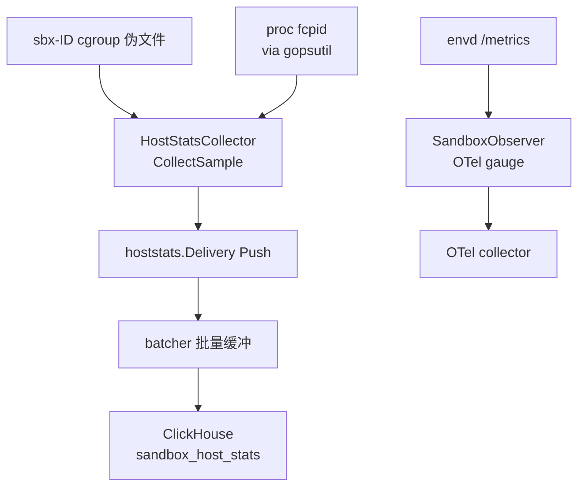

# 38 · cgroup、资源记账与主机统计

> 一台节点上同时跑几十上百台沙箱，谁保证它们不互相饿死？上游 2026.09 的回答有点反直觉：
> 宿主上的 cgroup **只记账、不设限**，真正的闸门在准入与放置那一侧。本篇讲清楚这三层各自管什么，
> 以及一个沙箱的 CPU 与内存数字有几个来源、彼此为什么会对不上。
>
> **读者**：工程师、系统工程师。　**预备**：[第 26 篇 · Sandbox 对象与 Factory](26-sandbox-object.md#4-cleanup一个后进先出的清理栈)、
> [第 28 篇 · Firecracker 进程管理](28-firecracker-process-management.md#3-进程的创建观测与关停)；知道 cgroup v2 的层级模型会读得更顺。
> **代码**：`packages/orchestrator/internal/sandbox/cgroup/manager.go`、
> `internal/sandbox/hoststats.go`、`internal/sandbox/hoststats_collector.go`、`internal/sandbox/metrics.go`、
> `internal/metrics/`、`packages/clickhouse/pkg/hoststats/`、
> `iac/provider-gcp/nomad-cluster/scripts/run-nomad.sh`

---

## 0. 本篇要回答的问题

1. 上游用 cgroup 做了什么、**没有**做什么？为什么一个多租户平台会选择不设内存上限？
2. `CLONE_INTO_CGROUP` 解决了哪一个竞态？为什么代码里有那么严格的文件描述符纪律？
3. 一台沙箱的 CPU 与内存数字有几个独立来源，各自量的是什么？什么时候会互相矛盾？
4. host stats 的采样链路是怎样的，采样开销与写入量靠什么参数控制？
5. Nomad 的 raw_exec 驱动为什么要配 `no_cgroups = true`？
6. 这些记账数据最后被谁消费：计费、放置，还是排障？

---

## 1. 问题：一台节点上的资源竞争

一台运行 orchestrator 的节点上并存着这些东西：几十到上百个 Firecracker 进程（每个进程带着自己的
vCPU 线程与 guest 内存映射）、orchestrator 自身（它在进程内跑 uffd 处理线程与 block 缓存，
见[第 31 篇 · 内存后端](31-uffd-memory-backend.md#1-内存后端是一个接口)）、NBD 服务与网络槽位池。
它们抢的是同一份 CPU、同一份物理内存、同一块本地盘。

沙箱的规格是用户在创建时选的：vCPU 数与内存 MiB。这两个数字最终落到 Firecracker 的机器配置上——
`internal/sandbox/fc/client.go` 的 `setMachineConfig()` 把 `VcpuCount` 与 `MemSizeMib` 提交给 FC API。
这里有一个容易误解的地方：**这两个数字是 guest 看得到的规格，不是宿主给的配额**。
`VcpuCount` 决定 FC 起几个 vCPU 线程，但不决定这些线程能拿到多少宿主 CPU 时间；
`MemSizeMib` 决定 guest 物理地址空间有多大，但宿主并不禁止这块内存被完全填满，也不禁止
FC 进程在此之外再用一些内存。

对付这种竞争，一般有三个层次的手段：

| 层次 | 做法 | 代价 |
|---|---|---|
| 硬限制 | 每沙箱 cgroup 写 `memory.max` / `cpu.max` | 超限即 OOM kill 或被节流，用户体验断崖；无法超售 |
| 准入控制 | 限制节点上并发运行数与并发启动数 | 粒度粗，只在创建时生效，运行期失控管不住 |
| 事后可见 | 采样并上报每沙箱与每主机的用量 | 不阻止任何事，只让人事后知道发生了什么 |

上游 2026.09 用了后两层，第一层留了骨架但没有落地。下面按这个顺序讲。

---

## 2. 上游的 cgroup：只记账，不设限

### 2.1 目录布局与启用的控制器

`cgroup/manager.go` 的常量与 `Initialize()` 定义了全部布局：

```text
/sys/fs/cgroup/                     cgroup v2 的标准挂载点
└── e2b/                            RootCgroupPath，orchestrator 启动时创建
    ├── cgroup.subtree_control      写入 "+cpu +memory"
    ├── sbx-<sandboxID>/            每台沙箱一个，Create 时创建
    │   ├── cpu.stat                usage_usec / user_usec / system_usec
    │   ├── memory.current          当前用量，字节
    │   └── memory.peak             生命周期峰值，字节
    └── sbx-<sandboxID>/
```

`main.go` 在启动早期调用 `cgroup.NewManager()` 与 `Initialize()`，任一失败都是 `Fatal`——
上游把 cgroup v2 当作节点的硬性前提。`Initialize()` 只做两件事：`MkdirAll` 建目录，
往 `cgroup.subtree_control` 写 `+cpu +memory`。**没有写任何限制项**。

`Create()` 同样：`MkdirAll` 建 `sbx-<sandboxID>` 目录，`os.Open` 拿目录的文件描述符，
再打开 `memory.peak` 备用。整个 `cgroup` 包里没有一处写 `memory.max`、`memory.high`、
`cpu.max` 或 `cpu.weight`——在 `packages/orchestrator` 下 grep 这几个文件名，一处都搜不到，
读的只有 `cpu.stat`、`memory.current`、`memory.peak` 三个统计文件。
启用的控制器也只有 `cpu` 与 `memory` 两个：没有 `io`，所以**磁盘 I/O 完全不在记账范围内**；
没有 `pids`，所以沙箱内的进程数也不受宿主约束（guest 内核自己会管）。

这个选择的收益是：不会有沙箱因为宿主侧的硬限被 OOM kill，超售得以进行（见 §3）；
代价是：一台失控的沙箱可以把宿主的 CPU 吃到满，宿主侧没有任何机制在运行期把它压回去，
只有事后的指标与告警。

### 2.2 原子放置：CLONE_INTO_CGROUP

把一个进程放进 cgroup 的传统办法是先 fork、再把子进程 PID 写进目标 cgroup 的 `cgroup.procs`。
这中间有一个窗口：子进程已经在跑，但还记在父进程的 cgroup 里。窗口期内它分配的内存算在错误的账上；
如果它在窗口内就退出了，那次写 `cgroup.procs` 会失败（ESRCH），记账彻底落空。
对一个「启动路径以毫秒计、失败要能立刻回收」的系统，这个窗口不能忽略。

cgroup v2 给了原子方案：`clone3` 带 `CLONE_INTO_CGROUP` 标志，内核在创建进程的那一刻
就把它放进由文件描述符指定的 cgroup。Go 的 `syscall.SysProcAttr` 暴露为 `UseCgroupFD` 与 `CgroupFD`。
上游用的正是这条路径：`sandbox.go` 的 `createCgroup()` 返回 `(handle, handle.GetFD())`，
FD 一路传到 `fc/process.go` 的 `configure()`，在 `p.cmd.Start()` 之前设置这两个字段。

`cgroup/manager_test.go` 的 `TestCgroupHandleNoRaceOnQuickExit` 就是为这个语义写的：
启动一个立刻退出的进程，仍然不需要写 `cgroup.procs`。

### 2.3 文件描述符纪律与生命周期

`CgroupHandle` 的注释把生命周期写成一条链：
`Create → GetFD → cmd.Start() → ReleaseCgroupFD → GetStats（反复）→ Remove`。
两个描述符的处置不同，这是读这段代码最容易绊倒的地方：

- **目录 FD**（`file`）只在 clone 的那一瞬间有用。`sandbox.go` 在 `fcHandle.Resume()` 返回后
  立即调用 `ReleaseCgroupFD()`，且**不管 Resume 成功还是失败**都调用。若不释放，
  每台沙箱都会在 orchestrator 里长期占一个描述符。释放后 `GetFD()` 返回哨兵值 `NoCgroupFD`（-1）。
- **`memory.peak` 的 FD**（`memoryPeakFile`）反过来，要一直留到 `Remove()`。
  留着它是为了将来能做「按 FD 重置峰值」——内核 6.12 起，往 `memory.peak` 的某个打开描述符写入
  可以只重置该描述符看到的峰值，从而拿到「每个采样区间的峰值」而不是「生命周期峰值」。
  代码里 `readMemoryPeak()` 有对应的 TODO，目前只读不写，打开模式也还是 `O_RDONLY`。
  所以 `memory.peak` 现在是单调不减的，采样序列上看不出峰值发生在哪一段时间。

`memory.peak` 打开失败不是致命错误（旧内核上这个文件不存在），只记一条 debug 日志，
`memoryPeakFile` 置 nil，`getStatsForPath()` 会跳过峰值字段。

删除同样有顺序要求。`sandbox.go` 的 `doStop()` 里，`cgroupHandle.Remove()` 排在
`<-s.process.Exit.Done()` 之后：cgroup 目录里还有进程时 `rmdir` 会失败。
反过来，如果内核已经因为进程全退出而自动清理了目录，`Remove()` 把 `ENOENT` 当作正常情况吞掉。
`createCgroup()` 还把 `handle.Remove` 注册进了 `Cleanup` 栈，所以启动中途失败的路径也会删掉目录
（清理栈的语义见[第 39 篇 §4](39-health-errors-and-teardown.md#4-两段式拆除stop-与-close)）。

### 2.4 谁不在这个 cgroup 里

记账的边界比「一台沙箱」窄，有三处值得单独指出：

第一，**uffd 处理不是独立进程**。内存后端跑在 orchestrator 进程内（`internal/sandbox/uffd/`），
它为填页而分配的缓冲与 block 缓存都算在 orchestrator 头上，不在 `sbx-*` cgroup 里。

第二，**构建期沙箱不进 cgroup**。`fc/process.go` 的 `Create()`（模板构建走的路径）
显式传 `cgroup.NoCgroupFD`；只有 `Resume()` 收 `cgroupFD`。也就是说
`sandbox_host_stats` 里没有构建期沙箱的 cgroup 数据。

第三，**cgroup 创建失败不阻断启动**。`createCgroup()` 里 `Create()` 出错只记一条 warn 日志、
上报一个 telemetry 事件，然后返回 `(nil, NoCgroupFD)`，沙箱照常启动，只是这台沙箱没有 cgroup 记账。
这是一个刻意的取舍：记账是可观测性，不该让沙箱起不来。代价是记账数据有静默缺口，
查数时要能区分「值为 0」和「没有采到」。

---

## 3. 准入控制才是真正的闸门

既然运行期没有硬限，压力就全落在「让多少沙箱上这台节点」上。上游有三道独立的门：

**并发运行数上限。** `internal/server/sandboxes.go` 的 `Create()` 开头读特性开关
`max-sandboxes-per-node`（`featureflags.MaxSandboxesPerNode`，默认 200），
当前运行数达到即返回 gRPC `ResourceExhausted`，让调用方重试到别的节点。

**并发启动数信号量。** `internal/server/main.go` 里 `startingSandboxes` 是一个容量为
`maxStartingInstancesPerNode = 3` 的加权信号量。两种获取方式：从模板冷启动走 `TryAcquire(1)`，
拿不到立刻返回 `ResourceExhausted`；从快照恢复走 `waitForAcquire()`，在 `acquireTimeout = 15 s`
内等待，超时才拒绝。`Checkpoint` 路径同样要拿这把信号量。
这道门管的不是稳态资源，而是**启动瞬间的资源尖峰**：恢复一台沙箱要并发拉分片、填页、建网络槽位，
三个同时进行已经能把本地盘与网络打满。

**放置时的超售比。** API 侧的 `placement/placement_best_of_K.go` 里，`CanFit()` 用
`totalCapacity = R * cpuCount` 判断节点装不装得下。`R` 不是写死的常量：
`internal/orchestrator/orchestrator.go` 读特性开关 `best-of-k-max-overcommit`（默认 400，单位是百分比）
再除以 100，于是默认 `R = 4`——**CPU 按 4 倍超售**；`NewBestOfK()` 里的默认配置同样是 `R: 4`。
`Score()` 在此基础上把已分配 vCPU 与实测 CPU 使用率按 `Alpha = 0.5` 加权，在 K 个随机候选里挑最低分。
放置算法本身是[第 19 篇 §3](19-node-management-and-placement.md#3-放置算法采样过滤打分)的题目，
这里只需要记住结论：**4 倍超售是设计前提，而超售与硬性 `cpu.max` 是互斥的**——
如果给每台沙箱写死 `cpu.max`，超售出来的那部分容量永远也用不上。这解释了 §2.1 的选择。

---

## 4. 记账数字的三个来源

同一台沙箱的「CPU 用了多少、内存用了多少」，上游有三个互不相干的来源。混用它们是排障时最常见的错误。

| 维度 | cgroup 记账 | Firecracker 进程记账 | envd 上报 |
|---|---|---|---|
| 采集位置 | 宿主，`sbx-*/cpu.stat`、`memory.current` | 宿主，gopsutil 读 `/proc/<fcpid>` | guest 内，envd 的 `/metrics` |
| 采集方 | `manager.go` 的 `getStatsForPath()` | `hoststats_collector.go` 的 `CollectSample()` | `metrics.go` 的 `GetMetrics()` |
| 量的是什么 | FC 进程及其后代的宿主资源 | 单个 FC 进程的 CPU 时间与 RSS/VMS | guest 内核眼中的 CPU 空闲率、内存与根文件系统用量 |
| 语义 | CPU 累计微秒；内存瞬时值与生命周期峰值 | CPU 累计秒；内存瞬时字节 | 瞬时百分比与字节 |
| 去向 | ClickHouse `sandbox_host_stats` | 同左 | OpenTelemetry gauge |

三者的口径差异是实质性的，不是精度问题：

- **guest 视角与宿主视角不可换算。** envd 的 `cpu_used_pct` 是 guest 内核统计的 vCPU 忙闲比例。
  一台 vCPU 全忙的沙箱在 guest 里是 100%，但如果宿主超售严重，这些 vCPU 线程实际只拿到一半时间片，
  cgroup 的 `usage_usec` 增长率就只有 vCPU 数的一半。**两个数同时正确，含义不同**：
  前者说「guest 想用多少」，后者说「宿主实际给了多少」。这个差值正是超售是否过头的信号。
- **磁盘只有 guest 视角。** envd 的 `disk_used` 来自 guest 内对 `/` 的 `statfs`
  （`packages/envd/internal/host/metrics.go` 的 `diskStats()`）。宿主侧完全没有沙箱磁盘用量的记账：
  cgroup 没开 `io` 控制器，rootfs 又是 overlay + NBD 的稀疏结构，宿主上的文件大小和 guest 里的
  已用空间不是一回事（见[第 30 篇 §4](30-block-layer.md#4-overlay两条规则)）。
- **大页会让两个宿主侧内存数字同时失真（推论）。** FC 版本 ≥ 1.7 时，API 侧
  `sandbox_features.go` 的 `HasHugePages()` 返回 true，`setMachineConfig()` 于是设
  `huge_pages = 2M`，guest 内存由 2 MiB HugeTLB 页支撑（见[第 32 篇 §5](32-memory-prefetch-and-hugepages.md#5-大页改变了哪些量)）。
  Linux 默认不把 HugeTLB 页计入 `memory.current`，也不计入进程 RSS。
  按此推论，`cgroup_memory_usage_bytes` 与 `firecracker_memory_rss` 基本只反映
  FC 自身的匿名内存与页缓存，**不包含 guest RAM**；判断一台沙箱吃了多少物理内存，
  只能用 `sandbox_memory_mb`（规格）加 envd 上报的 guest 内部用量。
  这一条没有在代码里得到确认，只能从「代码只读这两个文件、且未挂 `memory_hugetlb_accounting`」推出。

envd 上报这条链另有几个版本门槛，都写在 `internal/metrics/sandboxes.go` 的常量里：
envd < `0.1.5` 完全不采；< `0.1.3` 的上报里没有时间戳，因此不做时钟漂移检查；
< `0.2.4` 的没有字节精度的内存与磁盘字段，回退到已废弃的 MiB 字段左移 20 位。
采集是每 5 秒一轮的 OTel 回调（`sandboxMetricExportPeriod`），单次请求超时 `timeoutGetMetrics = 100 ms`，
并发度按沙箱数除以 `metricsParallelismFactor = 5` 算——沙箱越多并发越高，避免一轮采不完。
顺带做两件事：宿主与沙箱时钟差超过 `maxAcceptableSandboxClockDriftSec = 2` 秒记 warn；
内存或 CPU 使用率超过 80%（`sbxMemThresholdPct` / `sbxCpuThresholdPct`）写沙箱日志。
gauge 用的是 delta 时间性（`DeltaTemporality`），目的是沙箱停掉之后不再无限期地报同一个值。

---

## 5. host stats：采样与投递

宿主侧那条链由 `hoststats.go` 与 `hoststats_collector.go` 组成，整条链是「尽力而为」的：



启动时机在 `sandbox.go` 里排得很靠后：先 `WaitForEnvd()` 成功，再判断特性开关
`host-stats-enabled`（`featureflags.HostStatsEnabled`），才调 `initializeHostStatsCollector()`。
这个开关的默认值是 `env.IsDevelopment()`：开发环境默认开，生产环境默认关，要靠特性开关平台显式打开。
采样间隔来自 `host-stats-sampling-interval`（默认 5000 毫秒），
`NewHostStatsCollector()` 里还有一道下限：小于 100 毫秒一律抬到 100 毫秒。
若 `hostStatsDelivery` 为 nil（`main.go` 里没配 ClickHouse 连接串时就是 nil），整个函数直接返回。

`Start()` 的行为有两个细节值得注意。一是先采一个样再进 ticker 循环，
于是每台沙箱在 envd 就绪后立刻有一个基线点；二是任何一次采样失败只记日志、继续循环，
不影响沙箱——记账链路故障不能拖垮运行时。对称地，`Stop()` 用 `sync.Once` 保护，
关闭 `stopCh` 并等 `stoppedCh`，然后**再采一个末样本**，赶在 FC 进程被杀之前把最后的累计值取走；
`doStop()` 里 `hostStatsCollector.Stop()` 排在 `process.Stop()` 之前，正是为了这个。

拿 cgroup 数据的方式是一个函数值：`hoststats.go` 里若 `sbx.cgroupHandle != nil` 就把
`GetStats` 方法赋给 `CgroupStatsFunc`，否则留 nil。采集时 cgroup 读失败只记 debug 日志，
其余字段照常上报——沙箱刚退出、目录已被内核回收时，这条路径会频繁触发。

投递侧在 `packages/clickhouse/pkg/hoststats/`。`ClickhouseDelivery.Push()` 把样本压进
`batcher`，批大小、最大延迟、队列长度都由特性开关给（`ClickhouseBatcherMaxBatchSize` 等）；
队列满时 `Push` 返回 `ErrBatcherQueueFull`，样本丢掉，不阻塞采样协程。
落库表由两个迁移定义：`20260209152327_add_sandbox_host_stats.sql` 建表，
`20260213152118_add_cgroup_columns_to_host_stats.sql` 追加五个 cgroup 列。表的形状对查询有直接影响：

- `ORDER BY (sandbox_id, timestamp)`、`PARTITION BY toDate(timestamp)`，按沙箱查是快路径，按团队聚合要扫。
- `TTL 7 DAY`——**这份数据是排障与容量分析用的，不是计费凭据**。计费口径来自沙箱生命周期事件
  （见[第 61 篇 §2](61-events-and-webhooks.md#2-事件模型)）。
- CPU 三列是累计值，`hoststats.go` 的注释写明「deltas calculated in queries」，
  查询侧要自己做差分；跨 pause / resume 时 FC 是新进程、cgroup 也是新目录，累计值会归零，
  差分必须按 `sandbox_execution_id` 分组，否则会出现负值。
- 五个 cgroup 列都有 `DEFAULT 0`。因此「0」既可能是真的没用，也可能是这台沙箱没有 cgroup（§2.4），
  还可能是这批数据早于那次迁移。

---

## 6. 主机级统计：给放置用的那一份

除了每沙箱的采样，orchestrator 还按请求即时算一份**整机**数据，走的是完全独立的代码路径：
`internal/metrics/host.go` 用 gopsutil 取 CPU 使用率与核数、虚拟内存总量与已用量、以及各分区用量。
分区要过 `isRealDisk()` 这道筛子：丢掉 `/boot/` 下的挂载点、`/dev/loop*` 与 `/dev/zram*` 设备，
`disk.Partitions(false)` 本身已经排除了伪文件系统。读不出用量的分区跳过，不报错。

调用方只有一个：`internal/service/service_info.go` 的 `ServiceInfo()`。它把三类数字拼进
gRPC 响应：宿主实测用量（`MetricCpuPercent`、`MetricMemoryUsedBytes`）、宿主总量
（`MetricCpuCount`、`MetricMemoryTotalBytes`、`MetricDisks`），以及**遍历 sandbox map 现算**的已分配量
（`MetricCpuAllocated`、`MetricMemoryAllocatedBytes`、`MetricDiskAllocatedBytes`、`MetricSandboxesRunning`）。
API 侧 `nodemanager/metrics.go` 的 `UpdateMetricsFromServiceInfoResponse()` 把它们存进节点对象，
放置算法读的就是这份缓存。

这里的分工很清楚：**「已分配」是权威的、精确的，「实测」是参考的、有延迟的**。
`CanFit()` 只用已分配量做硬判断，`Score()` 才把实测使用率以 0.5 的权重掺进去。
原因也容易理解：已分配量是 orchestrator 自己的账本，实测值受采样时刻与噪声影响，
拿它做准入会让放置在负载抖动时来回摆动。

---

## 7. Nomad 与 `no_cgroups`

上游用 Nomad 的 `raw_exec` 驱动跑 orchestrator（`iac/modules/job-orchestrator/jobs/orchestrator.hcl`
里 `driver = "raw_exec"`，且**没有 `resources` 段**）。节点上的 Nomad client 配置由
`iac/provider-gcp/nomad-cluster/scripts/run-nomad.sh` 生成，其中：

```hcl
plugin "raw_exec" {
  config {
    enabled = true
    no_cgroups = true
  }
}
```

`no_cgroups = true` 让 raw_exec 不为任务单独建 cgroup，orchestrator 及其派生的 Firecracker 进程
留在 Nomad client 自己的 cgroup 里。这条配置与 §2 的机制直接相关：orchestrator 要把 FC 进程
放进 `/sys/fs/cgroup/e2b/sbx-*`，也就是要把进程移出任务 cgroup 的子树。
若 Nomad 按 cgroup 管理任务，它在停止任务时是按任务 cgroup 里的进程清单来杀的，
被移走的 FC 进程就会漏杀，变成没人管的 microVM（**推论**：仓库里没有解释这条配置的注释，
这是从「raw_exec 用 cgroup 做进程跟踪」与「orchestrator 主动改变进程的 cgroup 归属」两件事推出的）。

无论如何，事实是清楚的：**Nomad 不给 orchestrator 设任何资源限制**，
沙箱的 cgroup 也不设限，于是整台节点上没有一处硬性资源边界。这与 §3 的准入控制是配套设计——
边界靠「不放那么多进来」实现，而不是靠「进来之后卡住」。代价也直白：
放置估算一旦偏乐观，节点会整体劣化甚至触发宿主 OOM，而不是某一台沙箱先被牺牲掉。

顺带说明另一处 cgroup 用法，免得与本篇混淆：**guest 内部也用 cgroup，而且那一份是真的设了参数**。
模板构建写出的 `internal/template/build/core/rootfs/files/envd.service.tpl` 给 envd 的 systemd 单元
加了 `Delegate=yes`、`MemoryMin=50M`、`MemoryLow=100M`、`CPUAccounting=yes`、`CPUWeight=1000`；
envd 自己在 `packages/envd/main.go` 的 `createCgroupManager()` 里为 PTY、socat、用户进程三类
分别建 cgroup，给用户进程设 `memory.high`（总内存减去至多 128 MiB 的保留量）与 `cpu.weight = 50`。
这些是**保护性**参数，目的是用户负载吃满 guest 时 envd 仍能响应，而不是给用户设配额，
细节属于[第 51 篇 §4](51-envd-ports-permissions-metrics.md#4-guest-里的-cgroup)。

---

## 8. ARM 适配版的差异

ARM 适配版把宿主侧的 cgroup 记账整条关掉了：`cgroup/manager.go` 的 `NewManager()`
在检测不到 cgroup v2 时不再报错而是返回可用的 manager，`Initialize()` 遇到 v1 直接跳过；
`fc/process.go` 里设置 `UseCgroupFD` / `CgroupFD` 的三行被注释掉，因此 FC 进程不再进
`sbx-*` 目录，`sandbox_host_stats` 的五个 cgroup 列恒为 0，只剩 `/proc` 与 envd 两个数据源。

有一处半途而废值得单独指出：`Initialize()` 加了 v2 检测并在检测不到时跳过，
`Create()` 却原封不动 —— 它照旧 `os.MkdirAll(/sys/fs/cgroup/e2b/sbx-<id>)` 并 `os.Open` 目录。
在真的没有 cgroup v2 的宿主上，`/sys/fs/cgroup` 通常仍是一个可写的 tmpfs，
于是每台沙箱都会在那里留下一个**普通空目录**：没有 `cpu.stat`、没有 `memory.peak`，
`GetStats()` 每次读都失败（只记 debug 日志），目录本身由 `Remove()` 在停机时删掉。
代价不是资源，而是排障时的误导 —— 目录存在会让人以为记账还在工作。

guest 侧同样退让：`envd.service.tpl` 去掉了 `Delegate` 与 `MemoryMin` / `MemoryLow` / `CPUWeight`。
Nomad client 配置里的 `no_cgroups = true` 也被删掉。
改动的动机、代价与可回退性见[第 73 篇 §2](73-cgroup-and-host-compat.md#2-cgroup关闭宿主侧记账)。

---

## 9. 小结

- 上游 2026.09 的宿主侧 cgroup **只记账、不设限**：`Initialize()` 只写 `+cpu +memory` 到
  `subtree_control`，`Create()` 只建目录，全包没有一处写限制项，也没有启用 `io` 与 `pids` 控制器。
- 不设限是超售的前提：放置算法默认按 `R = 4` 的比例超售 CPU，硬性 `cpu.max` 会让超售容量无法兑现。
- 真正的闸门是准入：`max-sandboxes-per-node`（默认 200）管稳态，容量为 3 的 `startingSandboxes`
  信号量管启动尖峰（恢复路径等 15 秒，冷启动立即拒绝）。
- 进程放置用 `CLONE_INTO_CGROUP` 保证原子性，避免「已在跑但尚未记账」的窗口；
  目录 FD 在 `cmd.Start()` 后必须立刻释放，`memory.peak` 的 FD 反而要留到 `Remove()`。
- 记账有三个来源：cgroup（宿主实际给了多少）、FC 进程的 `/proc`（单进程视角）、
  envd 上报（guest 想用多少）。三者口径不同，不可互换；开大页时前两者很可能不含 guest RAM（推论）。
- host stats 默认每 5 秒一采，首尾各补一个样本，经 batcher 批量写入 ClickHouse
  `sandbox_host_stats`，TTL 7 天，CPU 列是累计值且跨 execution 会归零。
- 整机统计走另一条路：gopsutil 即时采集 + 遍历 sandbox map 现算的已分配量，
  经 `ServiceInfo` 上报给 API；放置的硬判断只信「已分配」，实测值只参与打分。
- 记账链路全程「尽力而为」：cgroup 建不出来、读不到、投递队列满，都只记日志，不影响沙箱运行。
  代价是数据有静默缺口，`0` 与「没采到」在表里长得一样。
- Nomad 的 raw_exec 配 `no_cgroups = true`，orchestrator 任务也没有 `resources` 段，
  节点上因此不存在任何硬性资源边界。

## 延伸阅读 / 下一篇

- [第 19 篇 · 节点管理与放置](19-node-management-and-placement.md#3-放置算法采样过滤打分)：`CanFit` / `Score` 与超售比 `R` 的完整讨论。
- [第 26 篇 · Sandbox 对象与 Factory](26-sandbox-object.md#4-cleanup一个后进先出的清理栈)：`Cleanup` 栈与 `doStop()` 的整体顺序。
- [第 32 篇 · 预取与大页](32-memory-prefetch-and-hugepages.md#5-大页改变了哪些量)：大页从哪来、为什么用它。
- [第 39 篇 · 健康检查、错误语义与清理](39-health-errors-and-teardown.md#4-两段式拆除stop-与-close)：本篇的下一篇，
  讲 cgroup 删除在整个清理顺序中的位置，以及各条退出路径。
- [第 51 篇 · 端口、权限与指标](51-envd-ports-permissions-metrics.md#4-guest-里的-cgroup)：envd 侧的 cgroup 服务与 `/metrics`。
- [第 59 篇 · ClickHouse](59-clickhouse.md#2-表五张业务表与四种角色)、[第 60 篇 · 遥测](60-telemetry.md#1-一个客户端三类信号)：批量写入与 OTel 链路。
- [第 73 篇 · orchestrator 的 ARM 改动 III：宿主兼容](73-cgroup-and-host-compat.md#2-cgroup关闭宿主侧记账)。
- Linux 内核文档 `Documentation/admin-guide/cgroup-v2.rst`，特别是 `memory.peak` 与
  `memory.current` 的语义，以及 `clone3(2)` 手册里的 `CLONE_INTO_CGROUP`。
