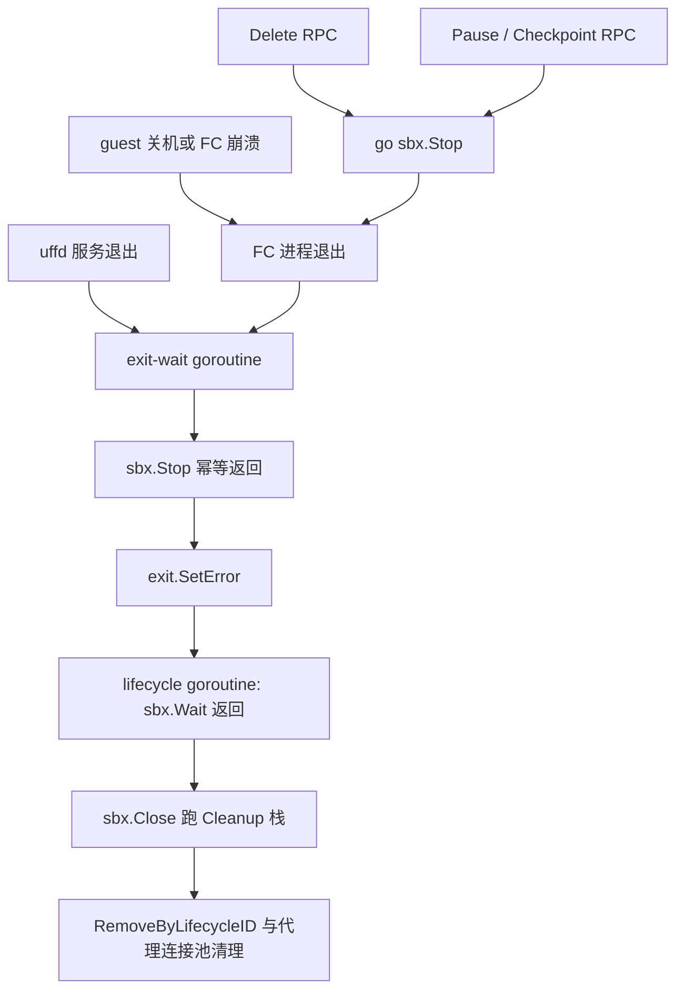

# 39 · 健康检查、错误语义与清理

> 一台沙箱有六条走向终点的路，每条路的第一发现者不同，但它们最终汇合到同一段拆除代码。
> 本篇讲这段代码的顺序不变量、orchestrator 对外暴露的错误码怎么被调用方使用，
> 以及「kill 立刻返回、清理在后台且失败只落日志」这个选择的代价。
>
> **读者**：工程师、系统工程师。
> **预备**：[第 26 篇 · Sandbox 对象与 Factory](26-sandbox-object.md#4-cleanup一个后进先出的清理栈)、
> [第 27 篇 · ResumeSandbox](27-resume-sandbox.md#6-失败回滚与超时来源)。
> **代码**：`packages/orchestrator/internal/sandbox/checks.go`、`health.go`、`cleanup.go`、
> `sandbox.go`、`packages/orchestrator/internal/server/sandboxes.go`

---

## 0. 本篇要回答的问题

1. envd 的健康探测多久做一次、超时多少、连续失败几次算死？失败之后系统做了什么？
2. 一台沙箱有哪几条退出路径？每条路谁先发现，谁触发拆除？
3. 拆除有哪些顺序不变量？它们由什么机制保证？哪些看起来是不变量、其实没有保证？
4. orchestrator 的 gRPC 状态码是按什么标准选的？调用方拿到某个码会做什么？
5. Delete RPC 不等清理完成就返回 OK，代价是什么？
6. 后台清理失败只写一条日志，会积累出什么问题？

---

## 1. 三个互不相干的失败面

「沙箱坏了」在 orchestrator 里不是一件事，而是三件事，各有各的探测手段和后果：

| 失败面 | 问的问题 | 探测手段 | 谁先知道 |
|---|---|---|---|
| guest 侧 | 沙箱内的 envd 还在响应吗 | 周期 HTTP 探测 | `Checks` |
| 宿主进程侧 | Firecracker 或 uffd 进程还活着吗 | 等待进程退出 | exit-wait goroutine |
| 请求侧 | 这次 RPC 成功了吗 | gRPC 返回值 | 调用方（API） |

三者的耦合比想象中弱。最需要先说清楚的一点是：**guest 侧的失败不会触发任何拆除动作**。
健康探测是一个纯观测组件，它改变的只有日志，不改变沙箱的生命周期。
理解了这一点，后面的退出路径矩阵才不会多出并不存在的一行。

## 2. 健康检查：一个没有权力的探针

### 2.1 参数与调用链

`checks.go` 里只有两个常量：

```go
const (
	healthCheckInterval = 20 * time.Second
	healthCheckTimeout  = 100 * time.Millisecond
)
```

`NewChecks()` 把 `healthy` 初始化为 `true`，注释写明「默认认为沙箱是健康的，状态变化时才上报」。
`Start()` 用 `context.WithCancelCause` 派生一个可取消的上下文，随后进入 `logHealth()`：
先起一个 goroutine 立刻探一次，然后每 20 s 探一次，直到上下文取消。

探测本体在 `health.go` 的 `getHealth()`：向 `http://<槽位宿主侧 IP>:49983/health` 发一个 GET，
端口来自 `packages/shared/pkg/consts` 的 `DefaultEnvdServerPort`。
只有 HTTP 204 算成功，其它状态码一律算失败。
超时通过 `context.WithTimeout(ctx, timeout)` 施加，实参就是那 100 ms；
共用的 `sandboxHttpClient` 另有一个 10 s 的客户端超时和 `DisableKeepAlives: true`，
所以 `getHealth()` 里那段「读空 body 以便复用连接」的处理在当前配置下并不会带来连接复用。

### 2.2 「失败几次算死」

答案是：**一次**，但「死」只意味着一条日志。`Healthcheck()` 的判定是边沿触发的：

```go
if !ok && c.healthy.CompareAndSwap(true, false) {
	sbxlogger.E(c.sandbox).Healthcheck(ctx, sbxlogger.Fail)
	sbxlogger.I(c.sandbox).Error(ctx, "healthcheck failed", zap.Error(err))
	return
}
if ok && c.healthy.CompareAndSwap(false, true) {
	sbxlogger.E(c.sandbox).Healthcheck(ctx, sbxlogger.Success)
	return
}
```

只有布尔值翻转时才写日志，对应 `packages/shared/pkg/logger/sandbox/sandbox_logger.go` 里的
`Sandbox healthcheck started failing` 与 `Sandbox healthcheck recovered`。
持续不健康的沙箱在日志里只出现一次，不会每 20 s 刷一条。
`healthy` 这个字段没有任何其它读者：在 `packages/` 下搜索不到把它当作杀沙箱依据的代码。

`Healthcheck()` 的第二个参数 `alwaysReport` 打开无条件上报，走 `ReportSuccess` / `ReportFail` 两个动作。
它只有一个调用点：`server/sandboxes.go` 的 `Delete()` 在停沙箱之前做一次「控制探测」，
用来在事后回答「这台沙箱是被杀死的，还是杀之前就已经不响应了」。

### 2.3 停机竞态

`Checks.Stop()` 调用 `cancelCtx(ErrChecksStopped)`，`Healthcheck()` 开头对这个原因做了特判：

```go
if errors.Is(err, ErrChecksStopped) {
	return
}
```

没有这一判断，正常停机时正在飞行的那次探测会因上下文取消而失败，
于是每台正常结束的沙箱都会留下一条「健康检查开始失败」的假告警。
`Stop()` 在 `doStop()`、`Shutdown()`、`Pause()` 三处都被显式调用，
且都排在暂停 VM 或杀进程之前，注释里写的理由正是「防止上报不健康沙箱的竞态」。

### 2.4 代价与收益

收益是这个探针不会误杀：宿主一次 GC 停顿、tap 上一次排队、envd 一次短暂卡顿，
都不会让一台正常工作的沙箱被回收。100 ms 的超时对于一次宿主到 tap 的单跳 HTTP 是宽裕的，
但对于「envd 正在处理一个大文件写入」这类情形是紧的；
边沿触发把这种抖动的后果压缩成一条日志，代价可以接受。

代价是**没有自愈**：一台 guest 内核 panic、但 Firecracker 进程还在跑的沙箱，
在 orchestrator 看来完全正常，会一直占着内存、网络槽位和 NBD 设备，直到用户设置的超时到期。
发现它的唯一途径是日志与用户报障。这是一个明确的取舍：把「判定沙箱已死」的权力留在控制面，
不下放给节点上的探针。

探针量的边界也比「沙箱可用」窄得多：它只问 envd 的 `/health` 返不返 204。
沙箱创建时声明的 Volume 挂载完全不在这个判据里 ——
envd 的 `PostInit` 为每个挂载起一个 goroutine 跑 `mount`，不等它们结束就返回 200，
挂载失败也只写 guest 内的日志。于是一台 Volume 全部挂载失败的沙箱在健康探测里是完全健康的，
用户看到的是挂载点上的空目录（见[第 40 篇 §7](40-volumes-and-nfsproxy.md#7-volumemounts-的失败路径)）。

沙箱指标走的是同一个 `Checks` 对象的另一个方法 `GetMetrics()`（`metrics.go`，
读 envd 的 `/metrics`，超时另给），与健康探测共用 HTTP 客户端但不共用周期，
细节见[第 38 篇 §4](38-cgroups-and-host-stats.md#4-记账数字的三个来源)。

## 3. 退出路径矩阵

一台沙箱有六种走向终点的方式。下表按「第一发现者」组织：

| 路径 | 第一发现者 | 进入拆除的入口 | 是否经过 `Stop` | 是否经过 `Close` | 对 API 的可见性 |
|---|---|---|---|---|---|
| guest 自己关机 / 内核 panic 后重启为退出 | `cmd.Wait()` | exit-wait goroutine | 是 | 是 | 下一次 `List` 同步时消失 |
| Firecracker 进程崩溃 | `cmd.Wait()` | exit-wait goroutine | 是 | 是 | 同上 |
| uffd 服务退出 | `fcUffd.Exit()` | exit-wait goroutine | 是 | 是 | 同上 |
| 控制面 kill | `Delete` RPC | `go sbx.Stop()` | 是 | 是（随后由 exit-wait 触发） | RPC 立即返回 OK |
| 暂停 | `Pause` / `Checkpoint` RPC | `stopSandboxAsync()` | 是 | 是（同上） | RPC 返回后沙箱已不在节点上 |
| 构建期收尾 | 构建流程自身 | `Shutdown()` 或直接 `Close()` | 是（经优先队列） | 是 | 不涉及 |

几点需要展开。

**最后一行不经过 `Delete`，但仍然经过 `Stop`。** `template/build/phases/base/provision.go` 的构建收尾调 `Shutdown()`：
先 `Checks.Stop()`，再暂停 VM，再做一次丢弃式快照以便把 rootfs 刷回设备，最后调 `Close()`。
`Close()` 跑 Cleanup 栈，优先队列里的 `sbx.Stop` 于是照样执行。

**沙箱超时不在这张表里。** orchestrator 不做超时回收。到期判定在 API：
`packages/api/internal/orchestrator/evictor/evict.go` 的 `Evictor.Start()` 每 50 ms 轮询
`store.ExpiredItems()`，对到期项按 `AutoPause` 决定发 `StateActionPause` 还是 `StateActionKill`，
最终落到 orchestrator 的 `Pause` 或 `Delete` RPC。
也就是说超时路径复用的是上表的第四、第五行，细节见
[第 18 篇 §2](18-sandbox-lifecycle-api.md#2-到期是谁驱动的)。

`sandbox.go` 里确实有一个 `WaitForExit()`，它按 `time.Until(s.GetEndAt())` 计时，
但在上游 2026.09 的 `packages/` 下没有任何调用者。
推论：它是为构建期沙箱预留的接口，当前不在任何生产路径上。

**前三行汇合到同一个 goroutine。** `ResumeSandbox()` 末尾起的 exit-wait goroutine 是这样写的：

```go
select {
case <-fcUffd.Exit().Done():
case <-fcHandle.Exit.Done():
}

err := sbx.Stop(ctx)

uffdWaitErr := fcUffd.Exit().Wait()
fcErr := fcHandle.Exit.Wait()
exit.SetError(errors.Join(err, fcErr, uffdWaitErr))
```

两个进程任意一个退出都算沙箱结束，然后主动 `Stop()` 把另一个也收掉，
最后把三个错误 join 进 `exit`（一个 `utils.ErrorOnce`）。
`CreateSandbox()` 的构建路径没有 uffd，只等 Firecracker。

`fc/process.go` 的 `configure()` 决定了什么叫「正常退出」：
`cmd.Wait()` 返回的 `ExitError` 若是被 SIGKILL 或 SIGTERM 结束的，`Exit.SetError(nil)`，
即视为正常；其它非零退出记为错误。
所以「宿主 kill」与「guest 自己关机」在 `exit` 里看起来一样，区别只在日志。

**`exit` 之后才是清理。** `server/sandboxes.go` 的 `setupSandboxLifecycle()` 在把沙箱插入
map 之后起一个 goroutine：

```go
waitErr := sbx.Wait(ctx)        // 等 exit
cleanupErr := sbx.Close(ctx)    // 跑 Cleanup 栈
s.sandboxes.RemoveByLifecycleID(sbx.Runtime.SandboxID, sbx.LifecycleID)
s.proxy.RemoveFromPool(sbx.LifecycleID)
```

这是全篇的枢纽：**服务沙箱的所有退出路径都通过 `exit` 汇合，`Close()` 只在这一个 goroutine 里被调用。**
`RemoveByLifecycleID` 而不是 `Remove`，是因为同一个 sandbox ID 可能已经被
checkpoint 之后的新进程占用，用 `LifecycleID` 做守卫避免误删新一代（见 `map.go`）。

构建路径不走这条线：`template/build/layer/layer_executor.go`、`layer/create_sandbox.go`、
`phases/optimize/builder.go` 都用 `defer sbx.Close(ctx)` 就地收尾，`Shutdown()` 内部也自己调一次 `Close()`。
两条线不会交叉，因为构建沙箱不会被插进 `server` 的 map。

**非预期退出不发事件。** 沙箱生命周期事件由 `server/sandboxes.go` 里的 `sbxEventsService.Publish()`
产出，调用点只有四处：`Create()` 发 `SandboxCreated` 或 `SandboxResumed`、`Update()` 发
`SandboxUpdated`、`Delete()` 发 `SandboxKilled`、`Checkpoint()` 发 `SandboxCheckpointed`。
`setupSandboxLifecycle()` 那个 goroutine 里一条都没有：它只写一行
`Sandbox stopped` 日志，然后把沙箱移出 map。
后果是上表的前三行 —— guest 自己关机、Firecracker 崩溃、uffd 服务退出 ——
**不产生任何 `SandboxKilled` 事件**。订阅 webhook 的用户只能看到沙箱创建，看不到它结束；
API 侧要靠下一轮 `List` 同步才发现沙箱不见了，把它当作已消失处理。
换句话说，事件流记录的是**控制面下达的动作**，不是沙箱的实际终止
（事件模型见[第 61 篇 §3](61-events-and-webhooks.md#3-事件在哪里产生)）。



## 4. 两段式拆除：Stop 与 Close

拆除被切成两段，分工很清楚：**`Stop()` 负责让进程停下，`Close()` 负责让资源归还**。

`Stop()` 用 `utils.Lazy` 包住，`GetOrInit` 保证多次调用只执行一次、后来者拿到同一个错误。
`doStop()` 的顺序是：

1. `hostStatsCollector.Stop(ctx)`——停采样并取最后一个样本；
2. `Checks.Stop()`——先停探针，再动 VM（§2.3 的理由）；
3. `process.Stop(ctx)`——发 SIGTERM，另起 goroutine 等 10 s 后补 SIGKILL；
4. `<-s.process.Exit.Done()`——**阻塞**等进程真正消失；
5. `cgroupHandle.Remove(ctx)`——进程没了才删 cgroup；
6. `Resources.memory.Stop()`——通知 uffd 服务退出。

第 4 步的注释解释了为什么不加 `select ctx.Done()`：
「如果进程还没退出，整个清理会处于糟糕的状态并导致不可预期的行为」。
这是一条硬顺序：**cgroup 只在其中没有进程时删除，uffd 只在没有人会再缺页时停止**。
反过来先停 uffd，Firecracker 的下一次缺页会永远挂住，进程进入 D 状态，连 SIGKILL 都收不掉。

第 5 步的错误只写一条 Warn，不进 `errs`；第 3、6 步的错误进 `errors.Join`。
也就是说 `Stop()` 的返回值不反映 cgroup 是否删干净。

cgroup 会被尝试删两次：`doStop()` 一次，`createCgroup()` 注册进普通清理队列的 `handle.Remove` 又一次。
第二次是空操作——`cgroup/manager.go` 的 `CgroupHandle.Remove()` 开头判 `h.removed`，置位之后直接返回 nil。
两次调用都发生在同一个 Cleanup 的串行执行流里（优先队列先跑 `Stop`），所以这个没有加锁的布尔标志不构成竞态。

`Close()` 就是 `cleanup.Run(ctx)`。`cleanup.go` 的 `Run` 用 `sync.Once` 包住，
`run` 里先倒序跑 `priorityCleanup`，再倒序跑 `cleanup`，全部错误 `errors.Join`。
上下文用 `context.WithoutCancel(ctx)` 剥掉取消，避免请求超时把清理打断到一半。

两段的衔接靠一行注册：`CreateSandbox()` 写的是 `cleanup.AddPriority(ctx, sbx.Stop)`，
`ResumeSandbox()` 写的是包着 `sbx.Stop` 的等价闭包（注释：「如果沙箱还在跑就先停掉，否则什么都不做」）。
优先级队列先跑，于是无论 `Close()` 从哪条路径被调用，
**进程一定先于任何资源释放被确认已死**。这是第一条、也是最重要的一条不变量。

## 5. 清理顺序：哪些是不变量，哪些不是

### 5.1 成立的不变量

**（1）优先于普通。** `cleanup.go` 的 `run()` 先遍历 `priorityCleanup` 再遍历 `cleanup`。
当前只有 `sbx.Stop` 注册在优先队列里。

**（2）组内后进先出。** 两个队列都从 `len-1` 倒着跑。
资源按依赖顺序注册，于是按反依赖顺序释放。

**（3）NBD 断开先于文件删除。** 在 `ResumeSandbox()` 里，
`cleanup.Add(ctx, cleanupFiles(f.config, sandboxFiles))` 注册得非常早（紧跟 `NewSandboxFiles`），
而 `cleanup.Add(ctx, overlay.Close)` 注册在 NBD provider 创建成功之后。
后进先出于是保证 `overlay.Close` 先跑、`cleanupFiles` 后跑。
`cleanupFiles` 删的是 Firecracker socket、uffd socket 和 rootfs 缓存的软链接；
如果次序反过来，NBD 服务端在 flush 时会写向一个已被删除的路径。
`NBDProvider.Close()` 内部还有第二层顺序：`sync` 刷盘 → `mnt.Close` 把 NBD 设备还给设备池 →
`overlay.Close` 关闭缓存文件。设备归还必须在缓存文件关闭之前，否则内核侧还挂着的设备会读到已关闭的后端
（细节见[第 33 篇 §7](33-nbd-and-rootfs.md#7-拆卸四件事的顺序)）。

**（4）槽位归还先于复用。** 这条不由 `Cleanup` 保证，而由网络池自己保证。
`network/pool.go` 的 `Return()` 先 `slot.ResetInternet(ctx)` 恢复出网规则，
成功才把槽位投进 `reusedSlots` 通道；`ResetInternet` 失败则调 `p.cleanup(ctx, slot)`
（`RemoveNetwork` + `slotStorage.Release`）把它彻底销毁而不是复用。
通道已满时走的也是同一个销毁分支：宁可丢掉一个干净槽位，也不阻塞归还。
一个规则没清干净的槽位不会被下一台沙箱拿到（见[第 35 篇 §4](35-sandbox-networking.md#4-复用一个槽位复位了什么没复位什么)）。

### 5.2 不成立的「不变量」

**注册顺序本身是并发的。** `ResumeSandbox()` 把网络槽位、rootfs overlay、内存三件事放进三个
promise 并行做，每个 promise 在自己成功后才调 `cleanup.Add`。
三者谁先注册取决于谁先完成，因此 `overlay.Close`、uffd 的 `Stop`、槽位归还
三者之间**没有确定的释放顺序**。唯一确定的是它们都晚于 `cleanupFiles` 注册，
以及都在 `sbx.Stop` 之后执行。后一点让前一点变得不危险：进程已经死了，
这三样资源之间不再有活跃的引用关系。

**`Close()` 返回不等于资源已归还。** `getNetworkSlot()` 注册的清理函数是这样的：

```go
cleanup.Add(ctx, func(ctx context.Context) error {
	go func(ctx context.Context) {
		returnErr := networkPool.Return(ctx, slot)
		if returnErr != nil {
			logger.L().Error(ctx, "failed to return network slot", zap.Error(returnErr))
		}
	}(context.WithoutCancel(ctx))
	return nil
})
```

注释说明了理由：「归还可以异步做，它对沙箱生命周期不重要」。
后果是 `Close()` 返回 nil 时槽位可能还在 `ResetInternet` 里，而且归还的错误**永远不会**
出现在 `Close()` 的返回值里。这是下一节的第一个例子。

**清理注册可能发生在清理之后。** `Cleanup.Add` 与 `AddPriority` 都先检查 `hasRun`：
若清理已经跑过，就地执行传入的函数，错误只打日志。
这条路径处理的是「回滚已经开始、某个 promise 才刚刚成功」的竞态，
代价同样是错误消失在日志里。

## 6. 错误语义：状态码是给调用方看的

orchestrator 的 `Sandbox` 服务只显式使用四个码——`internal/server` 下的 `status.Error*` 调用只出现
`ResourceExhausted`、`Internal`、`NotFound`、`FailedPrecondition`——再加上一类不映射状态码、到调用方变成 `Unknown` 的错误。选码的标准可以概括为一句话：
**这个错误描述的是节点的状态，还是这次请求或这台沙箱的状态。**
前者应当换一个节点重试，后者换节点也没用。

| 码 | 触发点（`server/sandboxes.go`） | API 侧动作 | 可重试 |
|---|---|---|---|
| `ResourceExhausted` | 在跑沙箱数达 `MaxSandboxesPerNode`；冷启动路径 `TryAcquire` 失败；快照恢复路径 `waitForAcquire` 15 s 内没拿到信号量 | `placement.go` 记 `Skip`，不排除节点、不计入 attempt，换节点 | 是 |
| `FailedPrecondition` | `ResumeSandbox` 返回 `storage.ErrObjectNotExist`，即快照数据还没上传完 | `placement.go` 走 default：排除该节点、attempt+1 | 名义上是 |
| `NotFound` | `Update` / `Delete` / `acquireSandboxForSnapshot` 在 map 里找不到 | `update_instance.go` 映射为 `ErrSandboxNotFound` | 否 |
| `Internal` | 创建失败、快照失败、快照后恢复失败、上传失败 | 排除节点、attempt+1 | 否 |
| 未显式映射 | `templateCache.GetTemplate` 失败等，直接 `fmt.Errorf` | gRPC 默认 `Unknown`，同 default 分支 | 否 |

三点值得注意。

**`ResourceExhausted` 是唯一被特殊对待的码。**
`packages/api/internal/orchestrator/placement/placement.go` 的分支里，
只有它不把节点加进 `nodesExcluded`、不增加 attempt 计数。
语义是「这个节点现在满了，等会儿还能用」。
`pause_instance.go` 同样特判它，转成 `PauseQueueExhaustedError` 交给上层限流逻辑。
放置策略的全貌见[第 19 篇 §6](19-node-management-and-placement.md#6-失败与重试)。

**`FailedPrecondition` 的分类是准确的，但对调用方的效果是浪费。**
缺的是对象存储里的快照文件，换哪个节点都一样缺。
可当前 API 侧没有为它写分支，它落进 default，于是白白排除一个健康节点并消耗一次重试机会。
推论：这条路径上「码分得比用得细」，改进空间在 API 侧而不在 orchestrator 侧。

**没有码的错误会被当成节点故障。** `GetTemplate` 失败（模板拉取、缓存装载）
用的是 `fmt.Errorf`，到调用方是 `Unknown`。
一次对象存储抖动因此可能把若干个健康节点逐个排除掉。

请求级超时由 `requestTimeout = 60 * time.Second` 施加，`Create` 与 `Delete` 都用
`context.WithTimeoutCause`；`Create` 的失败分支里有一句
`err = errors.Join(err, context.Cause(ctx))`，把「请求超时」这个原因拼进错误文本，
避免日志里只剩一个泛泛的 `context deadline exceeded`。

## 7. 不等清理返回，与只落日志

### 7.1 Delete 做了什么，没做什么

`Delete()` 的正文只有四步：

```go
s.sandboxes.Remove(in.GetSandboxId())   // 1. 立刻不可路由
sbx.Checks.Healthcheck(ctx, true)       // 2. 控制探测，记录死前状态
go func() {                             // 3. 后台拆除
	err := sbx.Stop(context.WithoutCancel(ctx))
	if err != nil { /* 只写日志 */ }
}()
// 4. 发事件、返回 OK
```

第 1 步的注释写得很直白：「把沙箱从缓存里移除，防止在停止期间 API 又把它加载回来。不允许再连接它」。
`Map.Remove` 还会异步触发订阅者的 `OnRemove`，
`internal/proxy/proxy.go` 与 `internal/tcpfirewall/proxy.go` 借此清掉连接限流表项。

第 3 步的注释说明了不等待的理由：「初始的 kill 请求应当作为停止流程的第一件事发出，
此时已经无法路由到该沙箱。我们不在这里等整个清理完成」。

**收益**是 Delete 的延迟与拆除成本解耦。拆除里包含 SIGTERM 后最长 10 s 的等待、
NBD 的 flush、槽位的 `ResetInternet`，把它们放进 RPC 会让 kill 的尾延迟直接由最慢的一项决定，
而 API 的 evictor 是每 50 ms 一轮的批量操作，尾延迟会传导成积压。

**代价**是 OK 的含义被削弱成「已不可达，且拆除已开始」。
更具体的后果是一个账实不符的窗口：节点容量判定用的是
`Create()` 里的 `s.sandboxes.Count() >= maxRunningSandboxesPerNode`，
而 map 在第 1 步就已经减一。于是在拆除完成之前，
账面上的容量已经释放，物理上的内存、网络槽位、NBD 设备、cgroup 还占着。
推论：在大批量重建（一批沙箱同时被 kill 又同时被创建）的场景下，
这个窗口会让节点的瞬时实际占用高于配额，`maxRunningSandboxesPerNode` 的保护效果随之下降。

`Pause` 路径有同样的结构：`acquireSandboxForSnapshot()` 在锁内把沙箱从 map 里摘掉，
`defer s.stopSandboxAsync(...)` 在快照做完后异步停机。

### 7.2 只落日志的四个地方

| 位置 | 失败的是什么 | 处理 |
|---|---|---|
| `Delete()` 的 goroutine | `sbx.Stop` 返回的 join 错误 | `sbxlogger.I(sbx).Error` |
| `setupSandboxLifecycle()` | `sbx.Close`（整个 Cleanup 栈） | Error 后**照常**移出 map |
| `getNetworkSlot()` 的清理 | `networkPool.Return` | `logger.L().Error` |
| `Cleanup.Add` 的 `hasRun` 分支 | 迟到注册的清理函数 | `logger.L().Error` |

外加 `doStop()` 里 cgroup 删除失败的那条 Warn。

后果是一条清晰的链：**清理失败不影响任何返回值，因此调用方无从得知，
资源泄漏按沙箱累积，且只能靠 orchestrator 重启回收。**
具体会漏什么：NBD 设备回不到设备池（设备池容量有限，漏够了新沙箱就创建不出来）、
网络槽位既不回 `reusedSlots` 也不被 `Release`、
`/orchestrator/sandbox` 下的 socket 与缓存链接残留、cgroup 目录残留。
`setupSandboxLifecycle()` 那一行尤其值得注意：日志文本是
「failed to cleanup sandbox, will remove from cache」——
它明确表示即使清理失败也要把沙箱从 map 里删掉，
因为留在 map 里会让 API 以为沙箱还能用，那是更坏的结果。

这个设计是有道理的：清理失败通常意味着宿主本身已经不正常（NBD 设备卡在内核里、
netlink 调用失败、文件系统只读），把错误回传给 API 也没有可执行的补救动作。
代价是**对账必须在带外做**：
网络池的 `returnedSlotCounter` / `releasedSlotCounter`、
设备池的可用设备数、以及上面那几条日志的计数，
是判断一个节点是否在静默泄漏的仅有信号。

## 8. ARM 适配版的差异

ARM 适配版把 `internal/sandbox/checks.go` 的健康探测间隔从 20 s 放宽到 300 s、
单次超时从 100 ms 放宽到 60000 ms。两个常量都只是放宽量级，判定逻辑不变。后果是状态翻转的发现延迟最坏约 310 s：
300 s 的间隔，加上一次探测的实际上限。这个上限不是 60 s——`sandboxHttpClient` 的 10 s 客户端超时先到，
所以放宽后的上下文超时在当前配置下并不生效（推论）。
同一补丁还把 `internal/server/sandboxes.go` 的 `requestTimeout` 从 60 s 改到 300 s、
`acquireTimeout` 从 15 s 改到 300 s、`maxStartingInstancesPerNode` 从 3 改到 30，
并把冷启动路径的 `TryAcquire` 换成带超时的 `Acquire`：
过载时不再立刻回 `ResourceExhausted`，而是排队等待，
于是 §6 里「换节点重试」这条路被触发的机会大幅减少。
参数与后果见[第 73 篇 §4](73-cgroup-and-host-compat.md#4-健康检查两个放宽的常量与一个没跟着改的)
与[第 71 篇 §6](71-orchestrator-arm-fc-changes.md#6-准入三个常量与一次语义变化)。

## 9. 小结

- 健康探测每 20 s 一次、单次 100 ms 超时、只认 HTTP 204；判定是边沿触发的，一次失败即翻转，
  但翻转的唯一后果是一条日志。`healthy` 没有其它读者，探针不参与生命周期决策。
- 探针只问 envd 的 `/health`：Volume 挂载是否成功不在判据里，挂载全失败的沙箱照样报告健康。
- 事件只在四个 RPC 里产生。guest 关机、FC 崩溃、uffd 退出这三条非预期退出路径不发任何事件，
  API 靠 `List` 同步才发现沙箱已消失。
- `Checks.Stop()` 在杀进程或暂停 VM 之前调用，`ErrChecksStopped` 的特判避免正常停机产生假告警。
- 六条退出路径中，前三条（guest 退出、FC 崩溃、uffd 退出）汇合于 exit-wait goroutine，
  后三条由 RPC 或构建流程主动发起；服务沙箱的所有路径最终都通过 `exit` 汇合到同一个 lifecycle goroutine，
  `Close()` 只在那里被调用；构建沙箱则由构建流程自己 `defer sbx.Close`。
- 沙箱超时不由 orchestrator 执行，由 API 的 evictor 每 50 ms 轮询后发 `Delete` 或 `Pause`。
  `WaitForExit()` 在上游 2026.09 无调用者。
- 拆除分两段：`Stop()` 停进程并阻塞等待进程真正消失，之后才删 cgroup、停 uffd；
  `Close()` 倒序执行 Cleanup 栈，优先队列里的 `sbx.Stop` 保证进程先死。
- 成立的顺序不变量：优先队列先于普通队列、组内后进先出、NBD 断开先于文件删除、
  槽位在 `ResetInternet` 成功后才可复用。不成立的：三个并行 promise 之间的释放顺序，
  以及「`Close()` 返回即资源已归还」——槽位归还是异步的。
- 状态码的选择标准是「描述节点还是描述请求」。`ResourceExhausted` 是唯一被放置逻辑当作
  可重试、且不排除节点的码；`FailedPrecondition` 与未映射的 `Unknown` 会导致健康节点被无谓排除。
- `Delete` 不等清理完成就返回 OK，换来的是稳定的 kill 延迟，代价是一段账面容量已释放、
  物理资源未释放的窗口。
- 后台清理失败一律只落日志：泄漏静默、按沙箱累积、需要靠指标与日志带外对账，
  最终靠 orchestrator 重启回收。

## 延伸阅读 / 下一篇

- [第 26 篇 · Sandbox 对象与 Factory](26-sandbox-object.md#5-五个生命周期方法各自的语义)：`Cleanup` 栈与生命周期方法的对象级语义。
- [第 28 篇 · Firecracker 进程管理](28-firecracker-process-management.md#3-进程的创建观测与关停)：`Process.Stop` 的信号序列与进程状态观测。
- [第 31 篇 · 内存后端：uffd 服务](31-uffd-memory-backend.md#5-并发与失败)、
  [第 33 篇 · 磁盘：NBD 服务器与 rootfs](33-nbd-and-rootfs.md#7-拆卸四件事的顺序)：被本篇当作「资源」释放的两样东西内部怎么关。
- [第 35 篇 · 沙箱网络](35-sandbox-networking.md#3-池两条队列两种优先级)：网络槽位池的获取与归还。
- [第 19 篇 · 节点管理与放置](19-node-management-and-placement.md#6-失败与重试)：状态码如何驱动放置重试。
- 下一篇：[第 40 篇 · Volumes 与 NFS proxy](40-volumes-and-nfsproxy.md#4-一次挂载的完整路径)。
