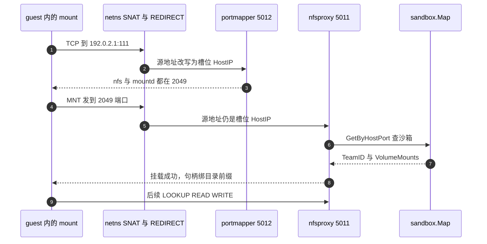
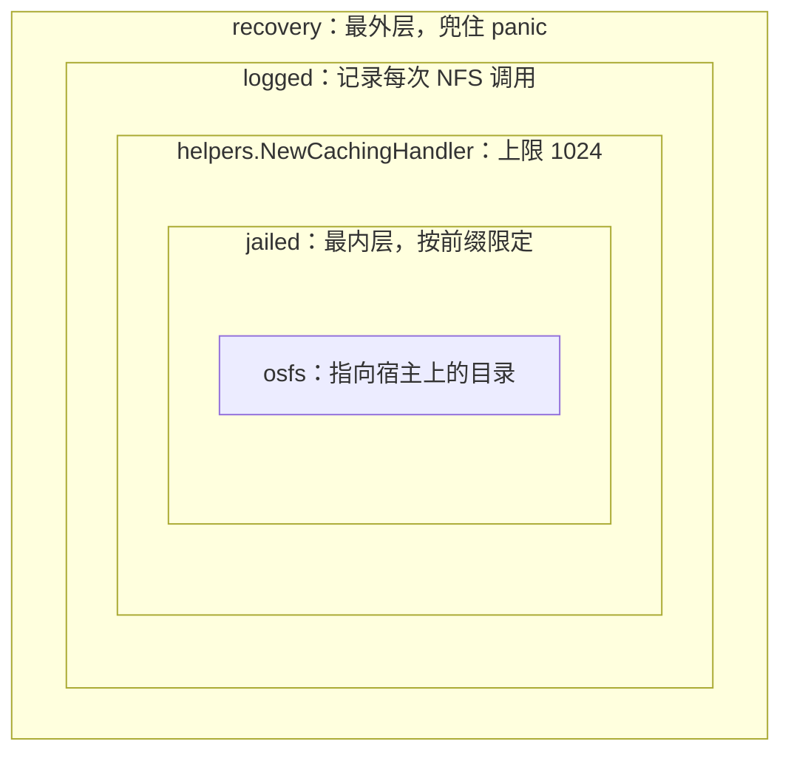

# 40 · Volumes 与 NFS proxy

> 沙箱的文件系统随沙箱一起消失。Volume 是唯一一块不随沙箱消失、又能被同一个团队的多个沙箱共享的存储。
> 它的实现方式有点出人意料：orchestrator 在宿主上跑了一个用户态 NFSv3 服务端，
> 用源 IP 认出是哪个沙箱在敲门，再把它关进一个只属于它的目录前缀里。
>
> **读者**：工程师、安全工程师。
> **预备**：[第 07 篇 · 沙箱的 Linux 网络](07-linux-networking-for-sandboxes.md#3-地址规划一个槽位的五个地址)（`192.0.2.1` 是什么）、
> [第 35 篇 · 沙箱网络](35-sandbox-networking.md#6-portmap一个只回答两个问题的-rpc-服务)（槽位与 portmapper）。
> **代码**：`packages/orchestrator/internal/nfsproxy/`、`packages/orchestrator/internal/volumes/service.go`、
> `packages/orchestrator/orchestrator.proto`、`packages/api/internal/handlers/volume_*.go`、
> `packages/api/internal/handlers/sandbox_create.go`、`packages/envd/internal/api/init.go`、
> `packages/db/migrations/20260204185039_volumes.sql`

---

## 0. 本篇要回答的问题

1. 沙箱本来就有一整块可写的 rootfs，为什么还需要 Volume？两者的生命周期差别在哪里？
2. 为什么不把一台真实的 NFS 服务器地址直接告诉沙箱，非要在宿主上代理一层？
3. 代理怎么知道「现在连进来的这条 TCP 连接属于哪个沙箱、哪个团队」？这个判断能被 guest 伪造吗？
4. `jailed` 这个包到底关住了什么，又没关住什么？
5. 创建沙箱时 `volumeMounts` 写错了会在哪一步失败，失败信息能不能回到调用方？

---

## 1. 问题：一块活得比沙箱久的盘

一个沙箱的可写存储是 rootfs：模板构建产物之上的一层写时复制。它有两个性质，
一起决定了它不能当持久盘用。

第一，**它属于一个沙箱**。沙箱销毁，overlay 里的改动就没了；
即使用 pause 保住（[第 37 篇 §1](37-pause-and-snapshot.md#1-问题暂停的成本必须正比于改动量)），存下来的也是一个新的 build，
只能由这个沙箱的 resume 用，别的沙箱看不到。

第二，**它不能共享**。两个同时运行的沙箱各自有各自的 overlay，
就算基于同一个 build，写入也互不可见 —— 这正是 [第 30 篇 §4](30-block-layer.md#4-overlay两条规则) 要保证的隔离。

于是就缺了一类东西：一块**团队级**的、**跨沙箱**的、**跨沙箱生命周期**的存储。
典型用途是一份被反复读的数据集、一个 pip / npm 缓存目录、一份多个 agent 会话共同追加的产出。
Volume 就是这个东西。它的语义很朴素：一个团队可以创建若干个有名字的 Volume，
创建沙箱时用 `volumeMounts` 把某个 Volume 挂到沙箱里的某个绝对路径上。

代价也要一起说清楚：Volume 是**网络文件系统**，不是块设备。
它没有 rootfs 那样的按需分片、缓存与预取；每一次 `open`、`read`、`stat` 都是一次到宿主的 RPC。
沙箱内的文件监听（inotify）在它上面也不工作 ——
`packages/envd/internal/services/filesystem/utils.go` 的 `IsPathOnNetworkMount()`
按超级块 magic（NFS 是 `0x6969`）识别出网络挂载，
`watch.go` 与 `watch_sync.go` 据此改走轮询而不是 inotify。
把整个工作目录放到 Volume 上，换来的是持久性，付出的是这些。

---

## 2. 控制面：一个 Volume 从哪来

Volume 在三个地方各有一份表示，缺一不可。

**数据库。** `packages/db/migrations/20260204185039_volumes.sql` 建的 `volumes` 表只有五列：
`id`（UUID 主键）、`team_id`（外键到 `teams`）、`name`、`volume_type`、`created_at`，
外加一条唯一约束 `volumes_teams_uq (team_id, name)`。
唯一约束是后面所有事情的基础：**在一个团队内，名字唯一**，所以沙箱可以按名字引用 Volume。

**HTTP API。** `spec/openapi.yml` 定义了四个操作：`GET /volumes`、`POST /volumes`、
`GET /volumes/{volumeID}`、`DELETE /volumes/{volumeID}`，
对应 `packages/api/internal/handlers/` 的 `volumes_list.go`、`volume_create.go`、
`volume_get.go`、`volume_delete.go`。
返回体 `Volume` 只有 `volumeID` 与 `name` 两个字段 —— `volume_type` 不对外暴露。
创建请求的 `name` 在 schema 层就带了 `pattern: "^[a-zA-Z0-9_-]+$"`，
`volume_create.go` 的 `isValidVolumeName()` 用同一条正则再校验一次。
这条正则同时也是一条安全约束：合法名字里不可能出现 `/` 或 `.`，后面第 5 节会用到这一点。

**宿主上的目录。** `orchestrator.proto` 里的 `VolumeService` 只有两个方法：

```protobuf
message VolumeCreateRequest {
  string volume_id = 1;
  string volume_type = 2;
  string team_id = 3;
}

service VolumeService {
  rpc Create(VolumeCreateRequest) returns (VolumeCreateResponse);
  rpc Delete(VolumeDeleteRequest) returns (VolumeDeleteResponse);
}
```

实现在 `internal/volumes/service.go`，全部逻辑就是 `buildVolumePath()` 加一次
`os.MkdirAll(path, 0o700)` 或 `os.RemoveAll(path)`。
`buildVolumePath()` 做三件事：把 `volume_type` 在 `config.PersistentVolumeMounts` 里查成一个宿主目录，
校验 `team_id` 与 `volume_id` 都是合法 UUID，然后 `filepath.Join` 成
`<类型根目录>/<teamID>/<volumeID>`。UUID 校验不是为了整洁 ——
`service_test.go` 里那条名为 `prefix attack` 的用例说明了意图：
`team_id` 传 `1/../../path1/<uuid>` 会被 `uuid.Parse` 挡下，返回 `InvalidArgument`。

`volume_type` 到宿主目录的映射来自 orchestrator 的环境变量
`PERSISTENT_VOLUME_MOUNTS`（`internal/cfg/model.go` 的 `Config.PersistentVolumeMounts`，
类型是 `map[string]string`）。`Parse()` 在启动时对每个值做 `filepath.Clean`、`filepath.Abs`
和一次 `os.Stat`，任何一个不存在就直接让进程启动失败。
`main.go` 里 NFS 代理的启动条件也是这个映射非空：`if len(config.PersistentVolumeMounts) > 0`。
换句话说，**没有配置任何持久卷类型的部署，根本不会开这两个端口**。

创建走的顺序值得看一眼。`PostVolumes()` 先查 feature flag `can-use-persistent-volumes`
（`feature-flags/flags.go` 的 `PersistentVolumesFlag`），关着就返回 403；
再用 `default-persistent-volume-type` 这个字符串 flag 决定 `volume_type`，
flag 为空时回落到 API 的 `DEFAULT_PERSISTENT_VOLUME_TYPE` 环境变量，还为空就返回 500。
然后开一个数据库事务插入 `volumes` 行，**在事务提交之前**调用 orchestrator 建目录，
最后才 `tx.Commit()`；提交失败时异步调一次 `deleteVolume()` 回滚目录。
删除是反的：先删数据库行，再异步删目录，删目录失败只记一条错误日志，
注释写得很直白 —— `if this fails, we can clean it up later`。
这个不对称是有道理的：**多一个没人引用的目录**只是浪费空间，
**多一行指向不存在目录的记录**会让后续挂载在沙箱里静默失败。

最后一个细节暴露了一个重要假设。`volume_util.go` 的 `executeOnOrchestrator()`
把集群里的节点打乱顺序，挑**第一个** `NodeStatusReady` 的节点执行，然后就返回。
也就是说建目录只在**一个**节点上做过一次。这只有在
`PERSISTENT_VOLUME_MOUNTS` 指向的目录本身就是一块所有节点都能看到的共享存储时才成立 ——
上游 2026.09 的代码里没有任何地方做跨节点分发。
Volume 的真正持久性来自那块共享存储，NFS 代理只负责把它安全地暴露给沙箱。

---

## 3. 为什么代理，而不是直连

宿主上已经有了一块共享存储，要让沙箱用上它，可以有三条路。

| 维度 | 直接把后端地址给 guest | virtio-fs / 共享目录 | 宿主用户态 NFS 代理（上游选择） |
|---|---|---|---|
| 隔离粒度 | 后端的 export 粒度 | 每沙箱一个设备，需要在 VM 启动前决定 | 每次 mount 一个前缀，运行时决定 |
| 谁来鉴权 | 后端（要认识 e2b 的团队模型） | Firecracker / 宿主目录权限 | 代理自己，按沙箱身份 |
| guest 能看到的东西 | 后端的网络地址与拓扑 | 一个设备 | 只有 `192.0.2.1` |
| 对 Firecracker 的要求 | 需要出网到后端 | 需要 virtio-fs 设备支持 | 无，走已有的 tap |
| 代价 | 后端要被改造成多租户 | 挂载集合在启动时冻结 | 多一次用户态转发，全部 I/O 过 Go 进程 |

上游走第三条，理由集中在前三行。

**沙箱不能看见后端。** guest 里跑的是不可信代码。如果把后端 NFS 服务器的地址交给它，
它就获得了一个通往内网的、有意义的目的地址；
[第 07 篇 §6](07-linux-networking-for-sandboxes.md#6-出站过滤两层两种粒度) 讲的出站过滤要为此开一个洞。
代理之后，沙箱看到的服务端只有 `192.0.2.1` —— 那是一个 TEST-NET-1 地址，
在沙箱的 netns 里被 iptables REDIRECT 到宿主本机的端口上，从来没有真的走出过这台机器。

**鉴权必须在懂 e2b 对象模型的地方做。** 「这个连接属于哪个团队」这个问题，
只有 orchestrator 答得上来 —— 它手里有 `sandbox.Map`。
让后端存储去理解 team / sandbox / volume 三级模型是不现实的。

**挂载集合要能在运行时决定。** 沙箱是从模板快照 resume 起来的
（[第 27 篇 §5](27-resume-sandbox.md#5-恢复之后envd-与-guest-看到的世界)），
模板里没有任何关于 Volume 的信息；`volumeMounts` 是每次创建沙箱时才传进来的。
NFS 的 mount 请求天然携带一个路径参数，正好用来在运行时选择目录。

代价写在表格最后一行，也要记住：所有 Volume I/O 都要经过 orchestrator 进程的用户态，
和沙箱的内存缺页、rootfs 读取抢同一个 Go 运行时。

---

## 4. 一次挂载的完整路径

服务端由 `main.go` 的 `startNFSProxy()` 拉起，两个监听：
`PortmapperPort`（默认 5012）上是 `internal/portmap` 的 RPC 服务，
`NFSProxyPort`（默认 5011）上是 `nfsproxy.NewProxy()` 构造的 `nfs.Server`。
两条 iptables 规则把 guest 发往 `192.0.2.1:111` 与 `192.0.2.1:2049` 的流量
REDIRECT 到这两个端口，规则在 `internal/sandbox/network/network.go` 的
`CreateNetwork()` 里创建，在 `RemoveNetwork()` 里删除。
portmapper 那一半在 [第 35 篇 §6](35-sandbox-networking.md#6-portmap一个只回答两个问题的-rpc-服务) 已经讲过，这里不重复。

客户端那一半在 envd。`packages/envd/internal/api/init.go` 的 `PostInit` 收到
orchestrator 发来的 `volumeMounts` 后，对每一项起一个 goroutine 跑 `setupNfs()`，
它只是顺序执行两条命令：

```bash
mkdir -p <path>
mount -v -t nfs -o mountproto=tcp,mountport=2049,proto=tcp,port=2049,nfsvers=3,noacl <target> <path>
```

`<target>` 由 orchestrator 侧的 `internal/sandbox/envd.go` 的 `convertMounts()` 拼出来，
形如 `192.0.2.1:/<volumeName>`：服务端地址恒定，导出路径就是 Volume 的名字。



服务端认身份的那一步是 `nfsproxy/proxy.go` 的 `getPrefixFromSandbox()`。
它拿到的只有一个 `net.Addr`，也就是这条 TCP 连接的对端地址，
交给 `sandbox.Map.GetByHostPort()`（`internal/sandbox/map.go`）：
拆出 IP，遍历当前所有沙箱，比对 `sbx.Slot.HostIPString()`。

这个比对之所以成立，靠的是网络那一层的一条 SNAT 规则 ——
`network.go` 在沙箱自己的 netns 里装了
`POSTROUTING -o <vpeer> -s <NamespaceIP> -j SNAT --to <HostIP>`。
每个槽位的 `HostIP` 互不相同（[第 07 篇 §3](07-linux-networking-for-sandboxes.md#3-地址规划一个槽位的五个地址)），
于是源 IP 就是一个由宿主写死、guest 改不了的身份标签。

**推论：** guest 理论上可以在自己的 netns 里发出源地址被伪造过的包。
这样的包不匹配 `-s <NamespaceIP>`，不会被 SNAT，会带着伪造的源地址到达代理，
从而可能被认成另一个沙箱。但宿主的回包按目的地址路由，会进到被冒充的那个槽位的 netns，
攻击者收不到响应。这是一个只写不读的通道，且要求攻击者猜中另一个正在运行的沙箱的 `HostIP`。
上游 2026.09 的代码里没有针对这一点的额外校验（例如反向路径过滤）。

---

## 5. 安全边界：jailed 关住了什么

拿到沙箱之后，`getPrefixFromSandbox()` 继续做四件事，每一件都是一道闸。

**路径规范化。** 请求里的 `Dirpath` 先 `filepath.Clean`，然后必须是绝对路径
（否则 `ErrMustMountAbsolutePath`），且不能是 `/`（否则 `ErrCannotMountRoot`）。
`proxy_test.go` 里一整组名为 `chroot escape attempt` 的用例覆盖了这里：
`/../good-volume` 会被 `Clean` 折叠成 `/good-volume`，正常放行；
`/good-volume/..` 折叠成 `/`，被 `ErrCannotMountRoot` 拒掉。

**Volume 归属检查。** 路径的第一段是 Volume 名字，在
`sbx.Config.VolumeMounts` 里线性查找；找不到就是 `ErrVolumeNotFound`。
注意这里查的是**这个沙箱创建时声明过的挂载列表**，
不是这个团队拥有的全部 Volume —— 沙箱不能挂载它没在创建时申请的卷。

**类型必须被本节点支持。** `volumeMount.Type` 要在 `filesystemsByType` 里找得到，
否则 `ErrVolumeTypeNotSupported`。这个映射就是启动时按 `PERSISTENT_VOLUME_MOUNTS`
建的一组 `osfs.New(path)`。

**前缀拼装。** 最终返回的前缀是 `filepath.Join(teamID, volumeName, 请求路径的第 3 段起)`。
团队 ID 由服务端从沙箱元数据里取，客户端完全无法影响。

这四步都失败的时候，`jailed/handler.go` 的 `Mount()` 返回
`nfs.MountStatusErrAcces` 和一个 `mountFailedFS{}` ——
`fs_failed.go` 里那个每个方法都返回 `ErrInvalidSandbox` 的空实现。
返回一个「什么都不让做的文件系统」而不是 `nil`，是为了让上层装饰器不必处理空指针。
代价是错误对 guest 而言是统一的「拒绝访问」，四种原因分不出来；
真正的原因只出现在宿主的日志里（`slog.Warn("failed to get prefix", ...)`）。

前缀怎么落到每一次文件操作上，在 `jailed/fs.go`。`jailedFS` 包住底层的 `osfs`，
唯一做实事的方法是 `Join()`：

```go
func (j jailedFS) Join(elem ...string) string {
	path := j.inner.Join(elem...)
	path = filepath.ToSlash(path)
	path = filepath.Clean(path)
	if len(elem) > 0 {
		if !strings.HasPrefix(elem[0], j.prefix+"/") {
			path = filepath.Join(j.prefix, path)
		}
	}
	return path
}
```

go-nfs 在把句柄里的路径片段拼成实际路径时会调 `Join()`，
于是每一条路径都被强行套上 `<teamID>/<volumeName>` 前缀，并且在套之前先 `Clean` 掉 `..`。
反方向由 `file_os.go` 的 `jailedFile.Name()` 负责：
返回给客户端的文件名会 `strings.TrimPrefix` 掉前缀，
所以 guest 看到的是 `/` 开头的相对世界，看不到团队 ID。

有三件事它**没有**做，写出来免得读者高估这道墙。

其一，**没有 uid 语义**。`Mount()` 返回的 auth flavor 列表是 `nil`，
代码里没有任何地方把 NFS 请求里的 uid/gid 映射到宿主用户。
所有文件都由 orchestrator 进程（宿主上以 root 跑）创建，
权限位由 guest 通过 NFS 指定 —— `proxy_test.go` 的 `write file` 用例断言的正是
「客户端要求 0o642，宿主上的文件就是 0o642」。
`oschange/main.go` 的 `Change` 实现把 `Chown`、`Lchown` 直接转成宿主的系统调用。
**推论：** 同一个团队的两个沙箱之间没有文件级隔离，这与 Volume 的团队级共享语义是一致的；
但这也意味着 guest 能在共享存储上留下任意属主的文件。

其二，**`FSStat` 是空的**。`jailed/handler.go` 里它只有一句
`return nil // todo: fill out fields on nfs.FSStat`，
所以沙箱里 `df` 看到的是零 —— 既没有配额，也没有容量上报。

其三，**没有配额或速率限制**。一个沙箱可以把共享存储写满，
影响同一节点上所有使用该卷类型的沙箱。

---

## 6. 四层装饰器与 panic 恢复

`NewProxy()` 把 handler 叠成四层，顺序是从内到外：



叠这四层的动因各不相同。

**caching 必须在 jailed 外面。** NFS 是句柄式协议：客户端拿到一个不透明的
file handle 之后，后续操作都只带句柄。`jailed.Handler` 的
`ToHandle`、`FromHandle`、`InvalidateHandle`、`HandleLimit` 四个方法
清一色是 `panic("this should be intercepted by the caching handler")`。
这不是偷懒，是一条用 panic 表达的断言：句柄的分配与回收由 go-nfs 自带的
`helpers.NewCachingHandler` 负责，`jailed` 只管把 mount 请求翻译成一个前缀。
缓存上限 `cacheLimit = 1024` 是全进程共用的一个数字，不分沙箱。

**recovery 必须在最外面。** `recovery/main.go` 的 `WrapWithRecovery()` 给每个 handler 方法、
每个 `billy.Filesystem` 方法、每个 `billy.File` 方法都挂了 `defer`。
两种恢复方式：有 error 返回值的用 `deferErrRecovery()`，
它 `recover()` 之后把返回值改写成 `ErrPanic`；
没有返回值的用 `tryRecovery()`，只记一条带 `zap.Stack("stack")` 的错误日志。
必要性和 portmapper 一样，来自输入的来源 —— NFS 请求由沙箱内的不可信程序构造，
XDR 解析或路径处理里的任何一个 panic 都不应该带走 orchestrator 进程，
那会连带杀掉这台机器上所有正在运行的沙箱。
`recovery/fs.go` 与 `recovery/file.go` 会把返回的 `Filesystem` 和 `File`
也逐个包起来，这样 panic 不只在 handler 入口被兜住，
在后续每一次读写上也被兜住。

代价是可观的：每次 `Read`、`Write`、`Seek` 都多一层 `defer` 与一次闭包分配。

**logged 在中间。** `logged/util.go` 的 `logStart()` 给每次调用生成一个 `requestID`，
记录参数、返回值与耗时，正常路径记 `Debug`，出错记 `Warn`。
`WrapWithLogging()` 里还有一句副作用不小的代码：
`setLogLevelOnce.Do(func() { nfs.Log.SetLevel(nfs.TraceLevel) })` ——
把 go-nfs 库自身的日志级别全局设为 Trace。
把这套日志留在生产路径上，换来的是每一次文件操作都可追溯，
付出的是每次操作至少两条日志记录与若干次反射式的 `zap.Any` 序列化。

---

## 7. volumeMounts 的失败路径

失败可以发生在四个地方，性质完全不同。

| 阶段 | 位置 | 表现 | 调用方能否知道 |
|---|---|---|---|
| API 校验 | `sandbox_create.go` 的 `convertAPIVolumesToOrchestratorVolumes()` | 400，逐条列出哪一个挂载不合法 | 能 |
| feature flag 关闭 | 同上 | 400 `Volume mounts are not enabled.` | 能 |
| 节点无此卷类型 | `nfsproxy/proxy.go` 的 `getPrefixFromSandbox()` | mount 被拒，沙箱照常运行 | 不能 |
| guest 内挂载失败 | `envd` 的 `setupNfs()` | 目录存在但是空的 | 不能 |

前两个在 API 层，做得比较扎实。`convertAPIVolumesToOrchestratorVolumes()`
先按名字批量查库（`getDBVolumesMap()` 调 `GetVolumesByName`，参数带 `teamID`，
所以跨团队引用等同于「不存在」），然后逐项检查三件事：
名字在库里存在、路径通过 `isValidMountPath()`（非空、绝对、`filepath.Clean(path) == path`）、
路径没有和同一请求里的另一个挂载重复。
不合法的项不会让循环提前退出，而是攒进 `InvalidVolumeMountsError.InvalidMounts`，
最后一次性返回，错误文本里带 `volume mount #<index>` 和原因。
这是个值得注意的选择：**一次请求把所有问题都告诉调用方**，而不是让人试一次改一处。

后两个则是静默的。`envd` 的 `PostInit` 对每个挂载起的是
`go a.setupNfs(context.WithoutCancel(ctx), ...)`，
`setupNfs()` 内部两条命令失败都只写日志然后 `return`，没有任何返回值。
`PostInit` 不等这些 goroutine，直接返回成功；
orchestrator 侧的 `WaitForEnvd()`（`internal/sandbox/sandbox.go`）
只要 `/init` 返回 200 就认为沙箱起来了。
**结论：Volume 挂载失败不会让沙箱创建失败。** 用户拿到的是一个正常运行的沙箱，
挂载点上是一个空目录 —— `mkdir -p` 总是先成功的。

这个设计的收益是明确的：一块共享存储的临时不可用不会让所有沙箱创建请求一起失败。
代价同样明确：区分「Volume 是空的」与「Volume 没挂上」需要看宿主日志。

还有一条时序上的细节。用户沙箱的启动路径是 `ResumeSandbox()` 而不是 `CreateSandbox()`
（后者只服务于模板构建，见 `internal/template/build/`），
而 `WaitForEnvd()` 只在 `ResumeSandbox()` 里被调用。
所以**每一次 resume 都会重新发一遍 `/init`，重新执行一遍 `mount`**。
挂载信息本身在 pause 时随沙箱配置存进数据库，
resume 时由 `sandbox_resume.go` 的 `convertDatabaseMountsToOrchestratorMounts()` 还原。

**推论：** 沙箱被 pause 时，guest 内核里那个 NFS 挂载连同它的 TCP 连接一起被冻在快照里；
resume 之后连接对端早已不存在，且沙箱可能落在另一个节点、拿到另一个 `HostIP`。
NFSv3 的无状态设计使得重新执行一次 `mount` 可以建立新连接，
但快照里那个旧挂载并不会被卸载 —— 新的挂载盖在同一个挂载点上。
上游 2026.09 的 `setupNfs()` 里没有 `umount`，也没有检查该路径是否已挂载。

---

## 8. 一处名字与 ID 的不一致

把第 2 节和第 5 节的结论并排放，会看到一个对不上的地方。

- `volumes/service.go` 的 `buildVolumePath()` 创建与删除的是
  `<类型根目录>/<teamID>/<volumeID>`，`volumeID` 是数据库主键 UUID。
- `nfsproxy/proxy.go` 的 `getPrefixFromSandbox()` 读写的是
  `<类型根目录>/<teamID>/<volumeName>`，`volumeName` 是用户起的名字。

两处都有测试固化这个行为：`volumes/service_test.go` 的 `valid` 用例断言
`filepath.Join(goodVolumePath, teamID, volumeID)`；
`nfsproxy/proxy_test.go` 的 `write file` 用例则直接去
`filepath.Join(volPath1, teamID, volName1, "sandbox-id.txt")` 读文件验证内容。
`api/internal/handlers/volume_create.go` 里 `Name` 取自用户请求体、`ID` 由数据库生成，
两者不可能相等。

**推论：** 在上游 2026.09 上，`POST /volumes` 预建的目录不是数据被写入的那个目录；
数据目录由 `osfs` 在第一次写入时按需创建（`osfs.Create` 会补齐父目录），
所以功能上仍然可用。但 `DELETE /volumes/{volumeID}` 删掉的是那个空的
`<teamID>/<volumeID>` 目录，`<teamID>/<volumeName>` 下的实际数据会留在共享存储上。
删除后重建一个同名 Volume，会拿到之前的数据。
这一点没有在代码或测试里被明确处理，读者若基于此版本做二次开发需要自行确认。

---

## 9. ARM 适配版的差异

宿主侧一行没改：`internal/nfsproxy/`、`internal/volumes/`、`envd` 的 `PostInit`
在 ARM 补丁的 diff 里都没有出现，端口、iptables 规则、`jailed` 的前缀逻辑与上游 2026.09 完全一致。

变的是 guest 那一端。上游模板构建脚本 `template/build/phases/base/provision.sh`
安装的包里有 `nfs-common`，它提供 `mount.nfs` 这个 helper；
ARM 适配版把包列表改成按 `/etc/os-release` 分发行版走 `apt` 或 `dnf`，
同时把 `nfs-common`（openEuler 上对应 `nfs-utils`）连同 `fuse3`、`iptables`、`git` 一并从列表里去掉。
没有 helper，第 4 节那条 `mount -t nfs` 命令在 guest 里直接失败。
按第 7 节的失败语义，这个失败是静默的：沙箱照常创建成功，挂载点是 `mkdir -p` 留下的空目录，
`WaitForEnvd()` 与健康探测都不会察觉。
换句话说，**ARM 适配版上 Volume 事实上不可用**，除非模板自己补装 `nfs-utils`。
包列表的完整对照与其余三个包的后果见
[第 74 篇 §4](74-template-build-on-arm.md#4-openeuler-guestprovisionsh)。

---

## 10. 小结

- Volume 补的是 rootfs 补不了的那一格：团队级、跨沙箱、跨沙箱生命周期的存储；
  代价是所有 I/O 走网络文件系统，且 inotify 在其上退化为轮询。
- 控制面是三份表示：`volumes` 表（`(team_id, name)` 唯一）、`/volumes` 四个 HTTP 操作、
  `VolumeService` 的 `Create` / `Delete` 两个 RPC。后者只做 `MkdirAll` 与 `RemoveAll`。
- `executeOnOrchestrator()` 只在随机一个健康节点上建目录，
  这隐含了「`PERSISTENT_VOLUME_MOUNTS` 指向的目录是跨节点共享存储」这个前提。
- 在宿主上代理 NFS，换来的是沙箱只需看见 `192.0.2.1`、鉴权发生在懂 e2b 对象模型的地方、
  挂载集合可以在运行时按请求决定；付出的是所有 Volume I/O 经过 orchestrator 的用户态。
- 身份判定的全部依据是 TCP 源 IP，可信度来自 netns 里那条把源地址改写成槽位 `HostIP` 的 SNAT 规则。
- `jailed` 关住的是路径：`Clean` 掉 `..`、限定 Volume 必须在沙箱创建时申请过、
  强制加 `<teamID>/<volumeName>` 前缀、回程剥掉前缀。
  它不关 uid、不报容量、不做配额。
- 四层装饰器各有明确分工：句柄由 caching 层管（jailed 用 panic 断言这一点），
  panic 由 recovery 层兜住以免一个畸形请求带走整个节点的沙箱。
- `volumeMounts` 的校验集中在 API 层且一次性返回全部问题；
  越过 API 之后的失败（节点不支持该卷类型、guest 内 `mount` 失败）都是静默的，
  沙箱照常创建成功，挂载点是空目录。
- ARM 适配版的宿主侧代码一行没改，但模板构建的包列表去掉了 `nfs-common`，
  guest 里缺 `mount.nfs`，Volume 在该基线上事实不可用，且失败是静默的。

---

## 延伸阅读 / 下一篇

- [第 07 篇 · 沙箱的 Linux 网络](07-linux-networking-for-sandboxes.md#3-地址规划一个槽位的五个地址)：`192.0.2.1`、netns、SNAT 与 REDIRECT 的原理。
- [第 35 篇 · 沙箱网络](35-sandbox-networking.md#2-建立一个槽位createnetwork-的完整步骤)：槽位分配、iptables 规则的创建与删除、portmapper 的实现。
- [第 26 篇 · 沙箱对象](26-sandbox-object.md#7-sandbox-map-与并发)：`sandbox.Map` 与 `Config.VolumeMounts` 在沙箱对象里的位置。
- [第 17 篇 · 创建沙箱 API](17-sandbox-create-api.md#2-请求体字段与它们的校验层)：`volumeMounts` 之外的其它请求字段与校验。
- [第 49 篇 · envd 的进程服务](49-envd-process-service.md#7-以谁的身份在哪里带什么环境跑)：envd 的 `/init` 之后还做了什么。
- RFC 1813（NFS Version 3 Protocol）与 RFC 1057（RPC / portmapper）：协议本身的定义。
