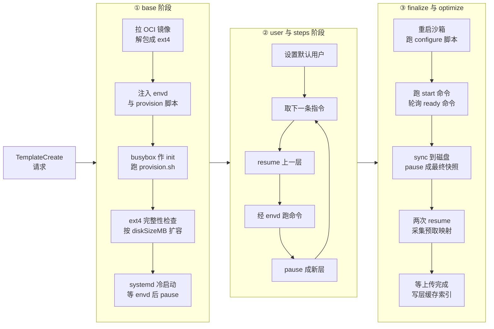

# 41 · 构建总览：从 Dockerfile 到可恢复的快照

> 模板构建看上去像 `docker build`：给一个基础镜像和一串步骤，得到一个可复用的产物。
> 但 e2b 的产物不是镜像层，而是**一台已经开机、已经跑完 start 命令、停在就绪状态的虚拟机的快照**。
> 这个差别决定了构建流程为什么必须真的开一台 microVM，也决定了它比镜像构建慢在哪里、贵在哪里。
>
> **读者**：工程师。
> **预备**：[第 11 篇 · 对象模型](11-object-model.md)、[第 13 篇 · 存储全景](13-storage-landscape.md)、
> [第 22 篇 · 模板 API](22-template-api.md)。知道 pause / resume 产生什么产物会读得更顺。
> **代码**：`packages/orchestrator/internal/template/build/builder.go`、
> `internal/template/build/phases/phase.go`、`internal/template/server/create_template.go`、
> `packages/orchestrator/template-manager.proto`

---

## 0. 本篇要回答的问题

1. 一次模板构建的输入是什么、输出是什么？输出为什么不是「镜像」？
2. 为什么构建过程中必须真的启动一台 microVM，而不能像 Docker 那样只在 chroot 里跑命令？
3. 主流程有哪几步，每一步的产物是什么，哪一步最贵？
4. 构建跑在哪台机器上、由谁触发、允许跑多久？
5. 构建失败或被取消时，谁负责清理，用户看到什么？

---

## 1. 问题：为什么「镜像」不够

沙箱的启动路径在[第 12 篇 §4](12-sandbox-lifecycle-walkthrough.md#4-orchestrator闸门与-resumesandbox-的阶段)已经走过一遍：orchestrator 拿到一个 build ID，
把内存文件、rootfs、Firecracker 状态文件挂起来，几十毫秒内让一台 microVM 从快照恢复到可用。
这条路径的前提是**产物里已经有一台开好机的虚拟机**：内存页的内容、vCPU 寄存器、设备状态，
以及一个已经在跑的 guest 用户态。

如果模板只是一个 OCI 镜像，这些东西都不存在。恢复一台沙箱就要退化成一次完整的冷启动：
加载内核、跑 init、起 systemd、起 envd、跑用户的 start 命令、等它就绪。
这个过程在几秒到几十秒之间，取决于模板里装了什么。把它从每次沙箱创建挪到每次模板构建，
是 e2b 的核心取舍：**构建付一次的代价，换取每次创建都省下的启动时间。**

所以模板构建的目标不是「把文件准备好」，而是「把一台虚拟机推进到就绪状态，然后把那一刻冻住」。
这决定了构建必须在真实的 Firecracker 虚拟机里进行 —— 用户的 `RUN` 命令、`start` 命令、
`ready` 探测都要在与运行期完全相同的 guest 内核、相同的 init 系统、相同的 envd 下执行，
否则冻住的那一刻就不可信。

## 2. 输入与输出

### 2.1 输入

输入由 api 组装成一条 gRPC 请求发给 template-manager，消息定义在
`packages/orchestrator/template-manager.proto` 的 `TemplateCreateRequest`，
在 `internal/template/server/create_template.go` 的 `TemplateCreate()` 里拆成两半：
`buildID` 单独装进 `packages/shared/pkg/storage/template.go` 的 `TemplateFiles`，
其余字段装进 `internal/template/build/config/config.go` 的 `TemplateConfig`。按用途分五组：

| 组 | 字段 | 说明 |
|---|---|---|
| 身份 | `templateID`、`buildID`、`teamID`、`cacheScope` | build ID 是这次构建的 UUID，也是产物目录名 |
| 来源 | `fromImage` 或 `fromTemplate`，`fromImageRegistry` | 二选一的 oneof；后者表示从另一个模板的 build 接着造；两者都空见下文 |
| 步骤 | `steps`，每项含 `type`、`args`、`force`、`filesHash` | 与 Dockerfile 指令一一对应，由 api 侧解析后传来 |
| 规格 | `vCpuCount`、`memoryMB`、`diskSizeMB`、`hugePages`、`kernelVersion`、`firecrackerVersion` | 这些既是构建期沙箱的规格，也写进产物元数据 |
| 就绪 | `startCommand`、`readyCommand` | 决定「冻住的那一刻」是什么状态 |

`cacheScope` 是可选字段，`TemplateCreate()` 在它缺省时用 `templateID` 顶上，
于是层缓存默认按模板隔离；显式传一个共享的 scope，多个模板才能互相命中彼此的层。
`version` 也是可选的，缺省时按有没有 `fromImage` / `fromTemplate` 推断成 v1 还是 v2 beta，
不同版本走的阶段列表不完全一样，见下文。

两个来源字段**都为空**是合法的第三种情形，对应旧版 CLI 的形态：Dockerfile 在用户机器上先构建成镜像，
经 docker-reverse-proxy 推进制品仓库，构建请求里只带标识符。
`core/rootfs/rootfs.go` 的 `CreateExt4Filesystem()` 在 `FromImage` 为空时改调 `oci.GetImage()`，
由 `packages/shared/pkg/artifacts-registry` 各实现的 `GetTag()` 拼出 `<templateID>:<buildID>` 这个 tag ——
基础镜像按**本次构建的 build ID** 定位，所以同一模板的每次构建取到的是各自那一份推上去的镜像。
这条路推镜像的一侧见[第 57 篇 §7](57-docker-reverse-proxy.md#7-与模板构建的衔接)。

值得注意的是**规格是构建期与运行期共用的**。构建期沙箱按 `vCpuCount` / `memoryMB` 起，
快照里的内存文件大小就等于 `memoryMB`；运行期从这个快照恢复时必须用同样的规格，
否则内存文件与虚拟机配置对不上。这也是模板改内存大小必须重新构建的原因。

`diskSizeMB` 的语义是**空闲磁盘**，不是总大小：`phases/base/provision.go` 的
`enlargeDiskAfterProvisioning()` 先用 `core/filesystem` 的 `GetFreeSpace()` 量出
provision 之后 rootfs 的剩余空间，与 `diskSizeMB` 相减，差多少补多少；
差值不为正就跳过。也就是说，装的东西越多，最终镜像越大，而空闲空间是定值。

### 2.2 输出

输出是产物桶里以 build ID 为前缀的一组对象。命名在
`packages/shared/pkg/storage/template.go`：

```text
<build-id>/
  ├── memfile                  # guest 内存的差分数据
  ├── memfile.header           # 内存块到某一代 diff 的映射
  ├── rootfs.ext4              # 根文件系统的差分数据
  ├── rootfs.ext4.header       # rootfs 块的映射
  ├── snapfile                 # Firecracker 的 VM 状态：vCPU 寄存器、设备状态
  └── metadata.json            # 版本、kernel / FC 版本、默认用户、start / ready、预取映射
```

`internal/sandbox/snapshot.go` 的 `Snapshot.Upload()` 说明了两件事：
`snapfile` 与 `metadata.json` 总是上传；`memfile` 与 `rootfs.ext4` 的数据部分在这一层
**没有改动**（`build.NoDiff`）时不上传，只留 header 指回上一代。
所以一个 build 目录里的对象数量是四到六个，不是固定值。


## 3. 与 Docker build 的本质区别

两者的表层很像：都有基础镜像，都有一串指令，都有层缓存。差别在产物与执行环境。

| 维度 | `docker build` | e2b 模板构建 |
|---|---|---|
| 产物 | 只读的文件系统层 + 配置 | 一台停在就绪状态的虚拟机的快照 |
| 层的内容 | 文件系统 diff | 文件系统 diff **加上** 内存 diff 与 VM 状态 |
| 指令执行环境 | 宿主内核 + 容器隔离 | 独立 guest 内核的 microVM，与运行期一致 |
| 「就绪」概念 | 无，`CMD` 只是记录 | 有，`start` 跑起来、`ready` 通过才算完 |
| 消费方式 | 拉层、解包、启动进程 | 按需拉块、从快照恢复 |

最要紧的一条是第二行。e2b 的每一层不只是文件的增量，还包括**内存的增量**：
`internal/template/build/layer/layer_executor.go` 的 `BuildLayer()` 在执行完一层的动作之后，
调用 `PauseAndUpload()`，而 `PauseAndUpload()` 做的是 `sbx.Pause()` —— 把整台虚拟机暂停并导出差分。
换句话说，e2b 的一层是「一次 pause」。层与层之间靠 resume 串起来，而不是靠 `chroot` 到上一层的 rootfs。

代价也在这里。Docker 的一条 `RUN` 只需要一次 fork/exec；e2b 的一条 `RUN` 需要
resume 一台虚拟机、通过 envd 下发命令、等命令结束、再 pause 并导出内存与磁盘的差分。
收益是层缓存的粒度与运行期完全一致：命中的层可以**直接当作快照恢复**，不需要重新解包或重新启动。

## 4. 主流程

`builder.go` 的 `Build()` 在函数注释里给了九步；实际的执行顺序由 `runBuild()` 组装的
阶段列表和 `phases/phase.go` 的 `Run()` 驱动。

`Run()` 对每个阶段跑同一套四步：`Hash()` 由上一层的 hash 与本阶段的内容算出本层 hash，
`Layer()` 拿这个 hash 去层缓存索引查、查到就把结果标成 `Cached`，命中就跳过 `Build()` 直接进入下一阶段，
没命中就先 `validateLayer()` 校验元数据齐全再 `Build()`。
每个阶段都要报一个 `Metadata()`，里面的阶段名与步号既进日志字段，也进缓存命中率与阶段耗时两组指标。
细节在[第 42 篇 · 阶段流水线](42-build-phases.md)。



### 4.1 base：从镜像到一台能开机的虚拟机

`phases/base/files.go` 的 `constructLayerFilesFromOCI()` 做三件事：调用
`core/rootfs` 的 `CreateExt4Filesystem()` 把 OCI 镜像的层解包成一个 ext4 文件，
并在这一步就把 envd、systemd 单元与由 `getProvisionScript()` 渲染出的 `provision.sh` 写进去；
然后用 `block.NewLocal()` 把 ext4 文件包成块设备；
最后用 `block.NewEmpty()` 造一个大小等于 `memoryMB` 的**空内存文件**。
这时还没有任何虚拟机状态，只有一块磁盘和一块全零内存。
镜像自带的环境变量由 `oci.ParseEnvs()` 读出来存进层元数据，后续每条命令都带着它们跑。

接着 `phases/base/provision.go` 的 `provisionSandbox()` 起第一台虚拟机。它不用 systemd：
`fc.ProcessOptions` 里 `InitScriptPath` 指向 `rootfs.BusyBoxInitPath`，
即内嵌的 busybox 作为 PID 1，只负责跑 `provision.sh`。原因是基础镜像里通常没有 systemd，
provision 脚本要做的正是把 systemd 与其它必需组件装上去。这一段
`KernelLogs: true`，内核日志直接流给用户，因为这是最容易出错的一段；
这台沙箱还配了一份空的 `SandboxNetworkConfig`，为的是让包管理器能出网。
脚本把退出码写成 `rootfs.ProvisioningExitPrefix` 打头的一行，
宿主侧一个 goroutine 扫描串口日志取这一行判定成败，超时 5 分钟。

provision 之后做三件收尾：先 `sbx.Shutdown()` 关掉这台临时虚拟机，
再用 `core/filesystem` 的 `CheckIntegrity()` 检查 ext4 是否被写坏，
最后 `enlargeDiskAfterProvisioning()` 把空闲空间补到 `diskSizeMB` 并复查一次完整性。
然后才是第二次冷启动 —— 这次以 systemd 为 init，等 envd 起来，
执行一次 `SyncChangesToDisk()`，pause，得到 base 层。

如果模板是 `fromTemplate` 而不是 `fromImage`，整个 base 阶段不会跑：
`phases/base/builder.go` 的 `Layer()` 直接从层缓存索引取出源模板的元数据并把结果标成 `Cached`，
取不到就报「你可能需要先重建基础模板」这条用户错误。

base 阶段是整个构建里最贵的一段，因为它包含两次完整冷启动和一次包管理器安装。
它也是缓存收益最大的一段：同一个基础镜像的第二次构建可以整段跳过。

### 4.2 user 与 steps：每条指令一层

`user` 阶段只在模板版本不低于 `templates.TemplateV2ReleaseVersion` 时加入
（`builder.go` 的 `runBuild()`），作用是把默认用户设成 `config.TemplateDefaultUser`，也就是 `user`。
它的 `Metadata()` 报的仍是 `base` 阶段，日志前缀也是 `base`。

`steps` 阶段由 `phases/steps/factory.go` 的 `CreateStepPhases()` 按 `Config.Steps` 展开，
一条指令一个阶段对象，步号从 1 开始，日志前缀是 `builder i/N`。
每个阶段的执行都走同一条路：把上一层的产物挂起来、经 envd 下发命令、pause，单层超时一小时。
只有「挂起来」的方式有分支：`phases/steps/builder.go` 里，如果上一层是缓存命中的，
用 `layer.NewCreateSandbox()` 冷启动（注释说明这是为了让新的 vCPU / 内存规格生效），
否则用 `layer.NewResumeSandbox()` 从上一层的快照恢复。
连续未命中的一串 step 因此共享同一条 resume 链，只有链的入口付一次冷启动。

### 4.3 finalize：跑 start，等 ready

`phases/finalize/builder.go` 的 `Build()` **总是**重新创建沙箱，注释里说明了原因：
最终层的 rootfs 路径必须指向最终 build ID 的产物。随后 `postProcessingFn()` 依次做：

1. `runConfiguration()`：跑 configure 脚本，建用户、改权限、开 swap 等，超时 5 分钟；
2. 起 `start` 命令（如果有），它是长期运行的，用一个 errgroup 托管，
   并用一个 confirm 通道确认它确实开始执行了；
3. 轮询 `ready` 命令，每 2 秒一次，直到成功或超时 10 分钟。

第 2、3 步有一个前提：层元数据里的 `Start` 不为空。`Layer()` 只在 `startCommand`
或 `readyCommand` 至少有一个非空时才填这个字段，否则它从基础模板继承。
`Start` 为空时 `postProcessingFn()` 在跑完 configure 脚本后就返回，
既不起 start 也不等 ready —— 这类模板「冻住的那一刻」就是系统刚配置完的那一刻。

`Start` 不为空而 `readyCommand` 为空时，判据由 `phases/finalize/ready.go` 决定：
有 `startCommand` 就用 `GetDefaultReadyCommand()` 返回的 `sleep 20`，
没有则退化成 `sleep 0`。也就是说，「就绪」在默认情况下不是一个探测，而是一个固定的等待时长。
代价是可能等得不够（start 命令还没监听端口就被冻住）或等得太久（白白多 20 秒构建时间）；
收益是不需要用户为每个模板写健康检查。同一个文件里还留着按 template ID 硬编码延长到 120 秒的分支，
注释明确标为临时方案。

`ready` 命令跑通之后并不立刻 pause：还要等 start 命令确认已经开始执行，
再取消它的 context 并检查它有没有提前失败。start 命令因取消而返回的 `context.Canceled`
被显式忽略，其余错误都算用户错误。

最后 `SyncChangesToDisk()` 把 page cache 刷到磁盘，再 pause。这一步不能省：
快照恢复出来的虚拟机会继续用这块 rootfs，没刷下去的写会丢。

### 4.4 optimize：采集预取映射

`phases/optimize/builder.go` 从刚做好的最终快照 resume 沙箱，等 envd 应答，
读出这段时间内从 uffd 那里缺页进来的内存块，单次采集超时 5 分钟。
`prefetchIterations = 2`，跑两遍，由 `phases/optimize/prefetch.go` 的
`computeCommonPrefetchEntries()` 取交集，只保留**两次都出现**的块，
写进 `metadata.json` 的预取映射，供运行期恢复时提前拉取。
取交集是为了滤掉与恢复无关的偶发访问，代价是漏掉真正需要但只在一次运行里出现的块。

这个阶段是「尽力而为」的：采集失败或元数据上传失败都只打一条 warn，
返回上一阶段的结果继续，不让构建失败。它也不产生新层 —— `Layer()` 直接把源层原样返回。

### 4.5 层的落地

每一层的 pause 与上传由 `layer/layer_executor.go` 的 `PauseAndUpload()` 完成，顺序是：
`sbx.Pause()` 得到 `Snapshot` → 立刻 `templateCache.AddSnapshot()` 放进本地模板缓存
（下一层可以马上用，不必等上传）→ 把上传丢进 `UploadErrGroup` 异步执行 →
上传完成并且**等所有更早的层也上传完**之后，才写层缓存索引 `index.SaveLayerMeta()`。

最后这个顺序不是可有可无的。索引一旦写下，别的构建就可能命中这一层并从它接着造；
如果它依赖的前序层还没进对象存储，那个构建会读到不存在的对象。
`layer/upload_tracker.go` 就是为这个约束存在的。

## 5. 构建在哪跑、跑多久

template-manager 不是独立进程，而是 orchestrator 二进制里的一个可选服务：
`internal/cfg/model.go` 的 `Services`（环境变量 `ORCHESTRATOR_SERVICES`）里包含
`template-manager` 时，`main.go` 才注册 `TemplateService`
（`internal/cfg/service.go` 定义了这个取值）。它与 sandbox 服务共用同一个 gRPC 端口、
同一个沙箱工厂、同一个模板缓存、同一份网络槽位池。

这带来一个直接后果：**构建节点也是能跑沙箱的节点**。构建期沙箱和运行期沙箱抢同一批
网络槽位、NBD 设备与本地缓存空间。生产部署里通常把构建节点单独分出来，
api 侧通过 `packages/api/internal/template-manager/template_manager.go` 的
`GetAvailableBuildClient()` 选择，选择依据来自特性开关 `BuildNodeInfo` 描述的机型信息；
找不到匹配机型时回落到任意可用的 builder。

触发是异步的。`TemplateCreate()` 把构建丢进一个 goroutine 就立即返回，
而且这个 goroutine 拿的是 `context.WithoutCancel(ctx)`：RPC 返回、连接断开都不会终止构建。
构建状态放在进程内的 `internal/template/cache/build_cache.go`（`buildInfoExpiration` 10 分钟），
由 api 轮询 `TemplateBuildStatus` 取回状态与日志。
两个服务共存的另一个后果是 gRPC 端口也共用：`main.go` 用 cmux 在同一个 TCP 端口上分流
HTTP 与 gRPC，`RegisterTemplateServiceServer()` 只是往同一个 gRPC server 上多挂一组方法。

时限是分层的：

| 范围 | 值 | 位置 |
|---|---|---|
| 整次构建（api 侧轮询） | 1 小时 | `packages/api/internal/template-manager/template_status.go` 的 `buildTimeout` |
| base 层 | 10 分钟 | `phases/base/builder.go` 的 `baseLayerTimeout` |
| provision 脚本 | 5 分钟 | `phases/base/provision.go` 的 `provisionTimeout` |
| 单条 step | 1 小时 | `phases/steps/builder.go` 的 `layerTimeout` |
| configure 脚本 | 5 分钟 | `phases/finalize/configure.go` 的 `configurationTimeout` |
| ready 轮询 | 10 分钟 | `phases/finalize/ready.go` 的 `readyCommandTimeout` |
| finalize 整段沙箱 | 20 分钟 | `phases/finalize/builder.go` 的 `finalizeTimeout` |
| 预取采集 | 5 分钟 | `phases/optimize/builder.go` 的 `prefetchTimeout` |
| 等 envd 起来 | 60 秒 | `layer/interfaces.go` 的 `waitEnvdTimeout` |

注意 api 侧的一小时是**轮询超时**，不是服务端的执行上限：超时后 api 把构建标记为失败，
template-manager 侧的 goroutine 并不会因此立即停下。真正让它停下的是取消路径（见下节）。

## 6. 失败与取消

### 6.1 错误分成两类

`builderrors/errors.go` 的 `IsUserError()` 用一条规则区分：错误链里有没有
`phases.PhaseBuildError`。有，就是用户错误 —— 用户的命令返回非零、ready 命令超时、
基础模板不存在，这类错误原文返回给用户，并带上出错的阶段名与步号。
没有，就是内部错误 —— 返回统一的 `InternalErrorMessage`，让用户带 build ID 找支持，
细节只进遥测。

`WrapContextAsUserError()` 补了两种：`context.Canceled` 归为「构建被取消」，
`context.DeadlineExceeded` 归为「构建超时」，两者都算用户错误。
这个分类同时驱动指标：`metrics.BuildResultUserError` 与 `BuildResultInternalError`
是两个不同的计数，好让运维区分「用户写错了」和「系统坏了」。

### 6.2 失败时清理什么

`Build()` 里挂了一串 defer。Go 的 defer 是后进先出，所以实际执行顺序与代码里的书写顺序相反：

1. **上传收尾**：`uploadErrGroup.Wait()` —— 即使构建失败，也要等所有已经发起的层上传结束，
   否则 goroutine 会在进程里悬着，产物也可能只上传一半；
2. **删除产物**：`templateStorage.DeleteObjectsWithPrefix(ctx, template.BuildID)`，
   用的是 `context.WithoutCancel(ctx)`，所以取消后仍会执行；
3. **归类错误**：把 `ctx.Err()` 并进错误链，再交给 `WrapContextAsUserError()`；
4. **panic 兜底**：`recover()` 之后报一条 critical，把错误换成一句通用提示，不让 panic 打穿整个进程；
5. **写用户可见日志**：成功打「构建耗时」，失败打 `UnwrapUserError()` 给出的那条消息；
6. **记指标**：构建时长、结果类型、rootfs 大小。

这个顺序有一个后果值得注意：删除产物排在 panic 兜底之前。
一次 panic 走到删除那一步时返回值 `e` 还是 nil，那一层直接跳过，产物不会被清掉。
推论：panic 之后的残留产物要靠外部的清理机制回收，构建流程内部不管。

这里只删了**最终 build ID** 的前缀。中间层用的是各自的 build ID，它们留在对象存储里，
由层缓存的生命周期管理，见[第 45 篇 §5](45-layers-and-build-cache.md#5-两个桶一个-scope)。
换句话说，一次失败的构建仍然可能给后续构建留下可用的缓存层 —— 这是有意的，
失败重试时前面成功的层不必重做。

### 6.3 取消

取消走的是删除接口。`internal/template/server/delete_template.go` 的 `TemplateBuildDelete()`
先查 build cache：如果这次构建还在跑，就调 `buildInfo.SetFail()` 把结果置为失败。
`create_template.go` 里有一个 goroutine 一直在等 `buildInfo.Result.Done`，
一旦看到失败状态就 `cancel()` 构建的 context。构建的各个阶段因 context 取消而中止，
上面那四层 defer 依次收尾。之后 `TemplateBuildDelete()` 继续删产物与镜像仓库里的 tag。

日志是另一条独立的路径：`create_template.go` 用 `zapcore.NewTee()` 把构建日志同时写进
进程内的环形缓冲（供 `TemplateBuildStatus` 返回）和外部日志系统。缓冲随 build cache 的
10 分钟 TTL 过期，所以构建结束太久之后再查，日志要去日志系统取。

## 7. 第五部分的其余篇目

本篇只给全貌。细节分布如下：

| 想知道 | 去哪篇 |
|---|---|
| 每个阶段的输入输出、缓存命中时怎么跳过、进度怎么回报 | [第 42 篇 · 阶段流水线](42-build-phases.md#3-五类阶段) |
| OCI 拉取与认证、ext4 解包、provision 与 configure 脚本、envd 注入 | [第 43 篇 · rootfs 制作](43-rootfs-construction.md#2-拉取镜像三种来源一次平台校验) |
| 构建期沙箱与运行期沙箱的区别、RUN / COPY / ENV 怎么实现 | [第 44 篇 · 构建期沙箱与命令](44-build-sandbox-and-commands.md#25-与运行期沙箱的差异清单) |
| 层 hash 怎么算、缓存存在哪、什么时候失效 | [第 45 篇 · 层与构建缓存](45-layers-and-build-cache.md#2-hash-怎么算) |
| gRPC 接口、构建队列与并发、状态与日志存储 | [第 46 篇 · template-manager 服务](46-template-manager-service.md#2-四个-rpc-的服务端语义) |
| 本地怎么手工造一个 build、怎么测恢复耗时 | [第 47 篇 · 本地开发工具](47-orchestrator-dev-tools.md#3-create-build造一个-build) |
| pause 本身怎么算脏页、怎么导出差分 | [第 37 篇 · Pause](37-pause-and-snapshot.md#3-脏页判据) |
| 产物格式与 header 的结构 | [第 29 篇 · 模板产物格式](29-template-artifact-format.md#3-header-的字节布局) |

## 8. ARM 适配版的差异

主流程没有变：`builder.go`、`phases/phase.go`、阶段列表的组装在 ARM 适配版与上游 2026.09 一致，
`template-manager.proto` 也没有改动。差异集中在 base 与 finalize 两个阶段的**内容**上：
`core/systeminit/busybox.go` 增加了 arm64 的内嵌二进制并按架构选择，
`core/oci/oci.go` 的 `DefaultPlatform` 从 `amd64` 改成 `arm64`，
`provision.sh` 与 `configure.sh` 增加了对 openEuler guest 的分支，
`commands/user.go` 与 `files/inittab.tpl` 随之调整，
`files/envd.service.tpl` 去掉了 `Delegate` 与 cgroup 资源设置这几行。
详见[第 74 篇 · 模板构建的 ARM 改动](74-template-build-on-arm.md#1-架构假设写在哪几个地方)。

## 9. 小结

- 模板构建的产物是一台停在就绪状态的虚拟机的快照，不是镜像层；这是为了把冷启动的代价从
  每次沙箱创建挪到每次模板构建。
- 一个 build 在产物桶里是 `<build-id>/` 下的四到六个对象：`snapfile` 与 `metadata.json` 必有，
  `memfile` / `rootfs.ext4` 的数据部分在无改动时省略，只留 header。
- e2b 的「一层」等于「一次 pause」，包含文件系统差分、内存差分和 VM 状态，
  因此命中的层可以直接当快照恢复，代价是每层都要付一次 resume 加 pause。
- 主流程是 base → user → steps → finalize → optimize；base 最贵（两次冷启动加一次包安装），
  finalize 决定「冻住哪一刻」，optimize 是尽力而为、失败不致命的优化。
- 「就绪」判据来自 `startCommand` / `readyCommand`：两者都没有就跳过这一步，
  只有 start 没有 ready 时默认是 `sleep 20` 而不是健康检查，这是用构建时间换用户配置负担的取舍。
- template-manager 是 orchestrator 二进制里的可选服务，与沙箱运行时共享节点资源；
  api 按特性开关描述的机型信息挑选构建节点。
- 失败时删掉最终 build ID 的产物，但保留中间层，让重试能复用；panic 因为 defer 的先后顺序不走这条清理路径；取消经由
  `TemplateBuildDelete` 把 build cache 置为失败，再由后台 goroutine 取消 context。
- 错误分用户错误与内部错误两类，判据是错误链里有没有 `PhaseBuildError`；分类同时决定
  用户看到的文案和指标的归属。

## 延伸阅读 / 下一篇

- 下一篇：[第 42 篇 · 阶段流水线](42-build-phases.md) —— 把本篇的五个阶段逐个拆开。
- [第 22 篇 §4](22-template-api.md#4-一次构建请求的两段) 与 [第 23 篇 §3](23-template-manager-client.md#3-触发一次构建)：
  构建请求在到达本篇之前经过了什么。
- [第 12 篇 §4](12-sandbox-lifecycle-walkthrough.md#4-orchestrator闸门与-resumesandbox-的阶段)：本篇产物的消费端。
- [第 13 篇 §3](13-storage-landscape.md#3-对象存储两个桶与键布局)：产物桶、构建缓存桶与本地缓存目录的分工。
