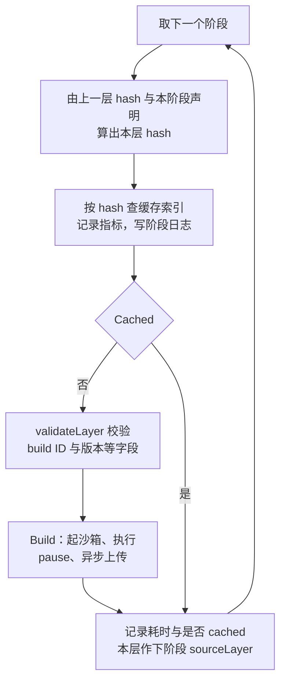
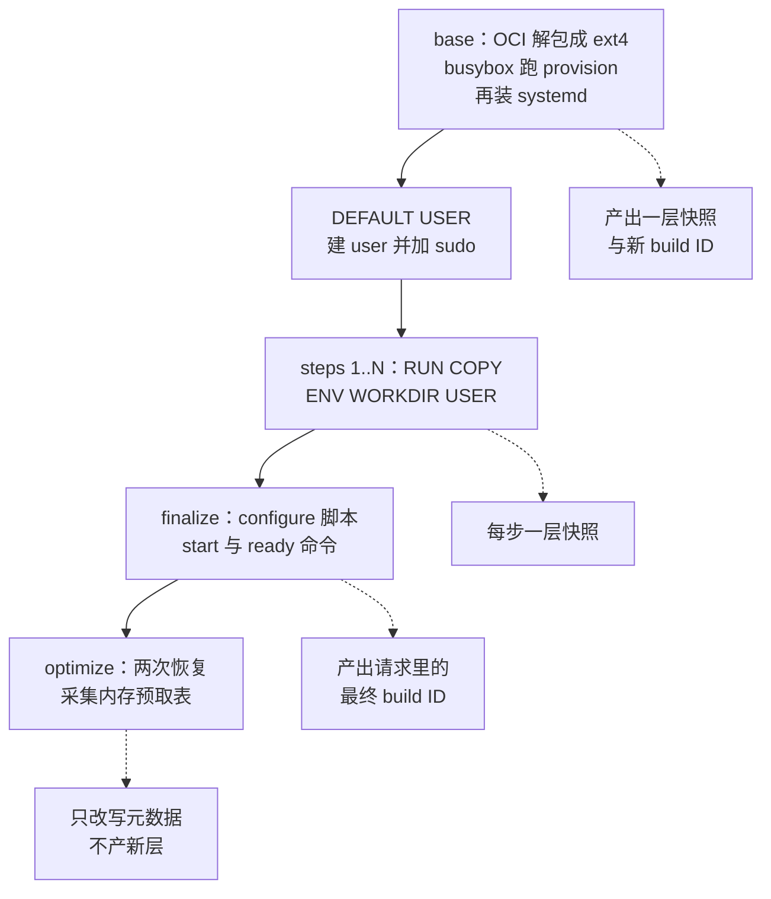

# 42 · 阶段流水线

> 一次模板构建不是一个函数，而是一串形状相同的阶段：每个阶段先算出自己的 hash、查一次缓存，
> 命中就整段跳过，未命中才起一台沙箱把活干完并 pause 成新的一层。
> 本篇讲这个流水线的骨架 —— 阶段接口、驱动循环、五类阶段各自的输入输出、
> 缓存命中时的跳过语义、阶段之间沙箱状态怎么传递，以及日志与进度如何回到用户面前。
>
> **读者**：工程师。
> **预备**：[第 41 篇 · 构建总览](41-template-build-overview.md)、
> [第 26 篇 §3](26-sandbox-object.md#3-factory把进程级资源与单次创建分开)。
> **代码**：`packages/orchestrator/internal/template/build/builder.go`、
> `internal/template/build/phases/phase.go`、`phases/base/`、`phases/steps/`、`phases/user/`、
> `phases/finalize/`、`phases/optimize/`、`internal/template/build/layer/layer_executor.go`

---

## 0. 本篇要回答的问题

1. 为什么把模板构建切成阶段，而不是写成一个自上而下的过程？阶段之间靠什么统一接口对齐？
2. base、DEFAULT USER、steps、finalize、optimize 各自的输入是什么、产出什么？
3. 哪些阶段可以被缓存命中整段跳过，哪些无论如何都要跑？跳过时被略过的到底是哪一段代码？
4. 阶段之间沙箱是同一台吗？什么时候冷启动、什么时候从上一层的快照恢复？
5. 构建日志与「还在跑」的进度信号是怎么产生、怎么送到调用方的？失败归到哪个阶段？

---

## 1. 问题：一次构建里有几种完全不同的活

把一次模板构建摊开看，要做的事至少有四类，性质彼此不同：

- **纯宿主侧的文件操作**：拉 OCI 镜像、把层解包成 ext4、注入 envd 与 systemd 单元。没有沙箱，
  只有宿主上的一个磁盘文件。
- **需要一台能跑但还没有 systemd 的沙箱**：用 busybox 当 init 启动 microVM，跑 provision 脚本装 systemd。
- **需要一台正常沙箱、并且能在里面执行用户指令**：RUN、COPY、ENV、WORKDIR、USER 这些步骤。
- **需要一台沙箱、但目的不是改它而是观察它**：跑 start 命令、等 ready 通过；
  或者反复恢复两次，记录哪些内存块被访问过。

这四类活如果写成一条自上而下的过程，会同时压上三个横切诉求，每个都会把过程撑变形：

**缓存复用。** 模板构建的价值在于第二次构建能跳过第一次已经做过的部分
（层缓存本身见[第 45 篇 §1](45-layers-and-build-cache.md#1-跳过一步需要什么保证)）。
「跳过」要求每段可跳过的工作有稳定的标识，且这个标识必须在真正开工**之前**就能算出来。

**可观测。** 用户看到的构建日志需要知道现在在第几步、这一步是否命中缓存；
运维需要按阶段分桶的耗时与缓存命中率。两样都要求「阶段」是显式的、有名字的东西。

**失败归因。** 构建失败要区分是用户的 Dockerfile 写错了还是基础设施出了问题，
还要说清楚是在哪个阶段、第几步失败的。

上游 2026.09 把这三件事收进一个统一接口，让每类活只实现自己那部分。
接口是 `phases/phase.go` 的 `BuilderPhase`，六个方法分三组：

| 方法 | 作用 | 何时被调用 |
|---|---|---|
| `Prefix()` / `String(ctx)` | 给用户看的阶段名与内容描述 | 每个阶段一次 |
| `Metadata()` | 给指标与结构化日志用的 `PhaseMeta`：阶段名、步骤类型、步骤序号 | 每个阶段一次 |
| `Hash(ctx, sourceLayer)` | 由上一层的 hash 加上本阶段自己的声明，算出本层 hash | 每个阶段一次 |
| `Layer(ctx, sourceLayer, hash)` | 查缓存，返回 `LayerResult`，其中 `Cached` 决定要不要执行 | 每个阶段一次 |
| `Build(ctx, …)` | 真正干活：起沙箱、执行、pause、上传 | 仅在未命中缓存时 |

`LayerResult` 是三元组：`Metadata`（这一层的模板元数据，含 build ID、内核与 Firecracker 版本、
默认用户、工作目录、环境变量、start / ready 命令）、`Cached`、`Hash`。它既是每个阶段的输出，
也是下一个阶段的输入，流水线靠这个值串起来。

## 2. 驱动循环

`phases.Run()` 是整条流水线的唯一驱动，逻辑不到八十行，对每个阶段做同一件事：



有几处值得注意的设计选择：

**缓存判定与执行分离。** `Hash` 与 `Layer` 都不碰沙箱，只读缓存索引；只有 `Build` 会消耗一台 microVM。
命中时被略过的是整个 `Build`：起 VM、等 envd、执行命令、pause、上传全在里面。

**hash 是链式的。** 除 base 外，每个阶段的 `Hash` 第一个输入都是 `sourceLayer.Hash`
（`phases/steps/hash.go`、`phases/user/hash.go`、`phases/finalize/builder.go`）。一个步骤的缓存标识
不只取决于它自己，还取决于它前面所有步骤 —— 中间插入一条 RUN，其后每一层 hash 全变，全部要重建。
这与 Docker 的层缓存语义一致。

**校验只在要构建时做。** `validateLayer` 先查这一层的 hash 非空，再查元数据：
build ID、内核版本、Firecracker 版本非空，上下文里的 `User` 非空、`WorkDir` 若存在则非空。
命中缓存的层不走这一步 —— 它的元数据来自存储，已经被 `storage/cache/cache.go` 的 `Cached()`
过滤过一次：`Version` 要不低于 `minimalCachedTemplateVersion`（2）且大于 `metadata.DeprecatedVersion`（1）。

**耗时对命中与未命中都记。** `RecordPhaseDuration` 带一个 `cached` 维度，命中时那条极短的耗时
也会进直方图；`RecordCacheResult` 单独记命中率。`metrics/metrics.go` 里阶段维度只有四个值：
`base`、`steps`、`finalize`、`optimize`。

**顺序固定、单线程。** `builders` 是一个切片，`Run` 顺序遍历，没有并发；唯一并发出去的是产物上传。

## 3. 五类阶段

阶段列表在 `builder.go` 的 `runBuild()` 里拼装，顺序固定：
base → DEFAULT USER（条件性）→ steps 1..N → finalize → optimize。



### 3.1 base

**输入**：`FromImage`（镜像引用）或 `FromTemplate`（另一个模板的 build ID）、磁盘大小、内核与 Firecracker 版本。
**输出**：一层快照，以及带镜像环境变量、默认用户 `root` 的元数据。

`FromTemplate` 分支（`phases/base/builder.go` 的 `Layer()`）不做任何构建：去缓存索引里读那个
build ID 的元数据，读到就返回 `Cached: true`，代码注释写得很直白 ——
「From template is always cached, never needs to be built」。读不到时返回用户错误，提示先重建基础模板。

`FromImage` 分支才有真正的 base 构建，`buildLayerFromOCI()` 里三件事接连发生：

1. `constructLayerFilesFromOCI()` 拉镜像、解包成 ext4、注入文件，得到一个宿主上的 rootfs 文件和一个空 memfile
   （细节属于[第 43 篇 §2](43-rootfs-construction.md#2-拉取镜像三种来源一次平台校验)–[§5](43-rootfs-construction.md#5-注入了哪些文件)）。
2. `provisionSandbox()` 以 `rootfs.BusyBoxInitPath` 为 init 起一台沙箱跑 provision 脚本，超时
   `provisionTimeout` 5 分钟。它的 `sandbox.Config` 里显式带了一个空的 `Network` 配置放开外网访问 ——
   provision 要从软件源装包，是构建期唯一必须联网的沙箱。之后 `filesystem.CheckIntegrity` 带修复地检查 ext4，
   `enlargeDiskAfterProvisioning()` 把 rootfs 的**空闲**空间补到 `DiskSizeMB`（这个配置项要求的是空闲空间，
   不是镜像总大小）。
3. 走通用的 `layerExecutor.BuildLayer()`：这次用 systemd 冷启动，等 envd 就绪，
   做一次 `SyncChangesToDisk` 后 pause 成第一层。超时 `baseLayerTimeout` 为 10 分钟。

base 阶段实际起了**两台**沙箱：一台 busybox 的（跑 provision，起完就关），一台 systemd 的
（做成第一层）。两台共用同一个宿主 rootfs 文件路径，所以第一台写进磁盘的改动对第二台可见。

`Layer()` 的 `FromImage` 分支在未命中时给新层写一份初始元数据：`Version` 取 `metadata.CurrentVersion`（2），
build ID 是新 UUID，上下文里默认用户 `root`、无工作目录、环境变量为空表 —— 镜像里的环境变量要等
`Build()` 读出 OCI 配置后才填。只有 v1 构建会补一个 `/home/user` 的工作目录作兼容。

base 的 hash（`phases/base/hash.go`）由四项拼成：缓存索引版本（常量 `v2`）、provision 版本、
`DiskSizeMB`、base 来源字符串。provision 版本默认取 provision 脚本的**全文**，只有
`BuildProvisionVersion` 这个特性开关返回非兜底值时才换成那个整数 —— 开发环境改一行 provision 脚本
就会自然失效 base 缓存，生产环境靠开关显式推进版本。vCPU 与内存**不在** base 的 hash 里。

### 3.2 DEFAULT USER

**输入**：上一层。**输出**：一层快照，其中已有名为 `user` 的用户并已加入 sudoers。

这个阶段（`phases/user/builder.go`）不是独立实现，而是把 `steps.StepBuilder` 包了一层，喂给它
一条合成的步骤 `USER user true`（第二个参数 `true` 表示加 sudo，见 `commands/user.go`）。
它只在模板版本不低于 `v2.1.0` 时加进流水线（`shared/pkg/templates/versions.go`）。

它自己实现的只有四个方法：`Hash`、`Prefix`、`String`、`Metadata`；`Layer` 与 `Build` 直接用嵌入的
`StepBuilder` 的实现，所以缓存判定与执行路径和一条普通步骤完全一样。
`Hash`（`phases/user/hash.go`）用的是上一层 hash 加上常量 `DEFAULT USER` 与用户名。

它对外仍自称属于 base：`Prefix()` 返回 `base`，`Metadata()` 里的 `Phase` 是 `base`、
`StepType` 也是 `base`、步骤号为空。
所以在指标里它和 base 阶段混在同一个桶里，只有 `String()` 返回的 `DEFAULT USER user` 能把它认出来。
阶段信息行照样以 info 打出，但阶段内命令的输出被写死为 debug，
而 `TemplateBuildStatus` 按调用方给的最低级别过滤，不要 debug 就看不到这段输出。

### 3.3 steps

**输入**：上一层，加一条 `TemplateStep`（类型 + 参数 + 文件 hash）。
**输出**：一层快照，以及可能被改过的上下文（USER 改默认用户、WORKDIR 改工作目录、ENV 改环境变量）。

`steps.CreateStepPhases()` 为配置里的每条步骤生成一个 `StepBuilder`，序号从 1 开始。
`Prefix()` 返回 `builder i/N`，`String()` 返回大写的指令加参数。每层超时 `layerTimeout` 1 小时。
步骤的 hash 由上一层 hash、步骤类型、参数拼接与 `FilesHash`（COPY 的上下文文件指纹）组成。
指令本身怎么在沙箱里执行属于[第 44 篇 §4](44-build-sandbox-and-commands.md#4-六类指令的实现)。

### 3.4 finalize

**输入**：最后一个 steps 层（没有步骤时是 base 层）。
**输出**：**请求里那个 build ID** 对应的快照 —— 这是这次构建对外交付的产物。

finalize 的 `Hash()` 照样接在上一层 hash 后面，再拼一个常量 `config-run-cmd`，
但这个 hash 只用来打日志和作为 `PauseAndUpload` 的索引键，没有任何地方拿它查缓存。

`phases/finalize/builder.go` 的 `Layer()` 有两件事和别的阶段不同：
一是它把 `result.Template.BuildID` 直接设成 `ppb.Template.BuildID`，即调用方指定的最终 build ID，
而不是新生成的 UUID；二是它**恒返回 `Cached: false`**，没有任何查缓存的代码。

后者是必然的：即便所有步骤都命中缓存，最终产物仍需要以请求的 build ID 落一份，
并且要把这次请求里的 start / ready 命令、默认用户、默认工作目录写进元数据。
代价是每次构建至少要起一台沙箱、跑一遍 configure 脚本与 ready 命令 ——
一次「全部命中」的重复构建也不是零成本。

`Build()` 里的动作按顺序是：

1. `runConfiguration()` 以 root 跑 `configure.sh`（建 `user`、给 sudo、写 `/.e2b`、放开 `/code` 权限），
   超时 `configurationTimeout` 5 分钟；
2. 若元数据里有 `Start`，在后台起 start 命令，同时轮询 ready 命令，
   间隔 `readyCommandRetryInterval` 2 秒，总超时 `readyCommandTimeout` 10 分钟；
3. ready 通过后等一个 `startCmdConfirm` 信号 —— 确认 start 命令确实已经开始执行，
   而不只是 goroutine 被派出去了；随后取消 start 命令的上下文（它本来就该继续在后台跑），
   `errgroup.Wait()` 检查 start 是否已提前失败；
4. `SyncChangesToDisk`（写在 defer 里，只在前面没出错时执行），然后 pause。

ready 命令为空时有默认值：完全没有 start 命令就用 `sleep 0`，
有 start 命令就用 `GetDefaultReadyCommand()` 给出的 `sleep 20`。
这个函数里还硬编码了三个模板 ID 用 `sleep 120`，代码里以 HACK 注释标明是临时措施。
整个阶段的超时是三段之和再加 5 分钟，即 `finalizeTimeout` 20 分钟。

finalize 还负责把最终模板的默认身份写进沙箱配置：`sandbox.EnvdMetadata` 的 `DefaultUser` 与
`DefaultWorkdir` 取自当前层上下文；模板版本低于 `v2.1.0` 时则强制写成用户 `user`、不设工作目录。
这是运行期沙箱里命令的默认执行身份的来源。

finalize 一定用 `NewCreateSandbox`，即冷启动，代码注释给的理由是
「Always restart the sandbox for the final layer to properly wire the rootfs path for the final template」。
它还是唯一会读 `BuildIoEngine` 特性开关来选择 Firecracker 磁盘 IO 引擎的阶段。

### 3.5 optimize

**输入**：finalize 层。**输出**：不产新层，只往同一个 build ID 的元数据里补一张内存预取表。

`phases/optimize/builder.go` 的 `Layer()` 原样透传上一层的元数据并标记未命中，
所以它也永远会执行。`Build()` 做的是：从模板缓存取到 finalize 的产物，
用 `ResumeSandbox` 恢复 `prefetchIterations`（常量 2）次，每次调 `sbx.MemoryPrefetchData()`
取出这次恢复访问过的内存块，然后求**交集** —— 只有两次都出现的块才进预取表，
顺序取两次序号的平均，访问类型有分歧时取「读」（`phases/optimize/prefetch.go`）。
单次恢复的超时是 `prefetchTimeout` 5 分钟。

这个阶段的失败是**非致命**的：采集失败或元数据上传失败都只记一条 warn，返回未加预取表的上一层结果，
构建照样成功。这是一处明确的取舍 —— 预取只影响后续沙箱的启动速度
（见[第 32 篇 §3](32-memory-prefetch-and-hugepages.md#3-预取怎么跑)），不影响模板的正确性。

上传元数据后它调 `templateCache.Invalidate()` 让本地模板缓存重新拉一份，
否则同一节点上后续的恢复会读到没有预取表的旧元数据。

## 4. 阶段 × 缓存矩阵

| 阶段 | 能否命中缓存跳过 | 命中判据 | 是否需要沙箱在跑 |
|---|---|---|---|
| base，`FROM TEMPLATE` | 恒命中 | 目标 build ID 的元数据可读 | 否 |
| base，`FROM <image>` | 能 | hash 查到层元数据且该 build ID 的元数据版本达标 | 是，两台 |
| DEFAULT USER | 能 | 同 steps，`Layer` 就继承自 `StepBuilder` | 是，一台 |
| steps 第 i 步 | 能 | 同上，且该步骤未被 `Force` | 是，一台 |
| finalize | 否 | —— | 是，一台 |
| optimize | 否 | —— | 是，两次恢复 |

「命中」的判定分两跳，都在 `storage/cache/cache.go`：`LayerMetaFromHash()` 用 hash 在索引里换出
一个 build ID，`Cached()` 再去模板存储读那个 build ID 的元数据并检查版本。
任何一跳失败都记一条 info 日志然后按未命中处理 —— 缓存缺失不是错误。

强制重建会向后传播。`builder.go` 的 `forceSteps()` 在构建开始前扫一遍步骤：一旦遇到整体 `Force`
或某一步自己的 `Force`，就把它以及它之后所有步骤的 `Force` 置真。重建了第 3 步，第 4 步的沙箱来源
就变了，再用它的旧缓存就是错的。base 只看整体 `Force`；finalize 与 optimize 本来就不查缓存。

## 5. 阶段之间的沙箱状态

### 5.1 每个阶段一台沙箱，载体是快照不是进程

流水线里没有一台贯穿始终的沙箱。每个要执行的阶段在 `layer.BuildLayer()` 里自己起一台、干完活 pause 掉、
`defer sbx.Close(ctx)`，同时把它插进 `sandbox.Map` 以便 envd 可达、退出时再摘掉并清空代理连接池。
阶段之间传递的是 `LayerResult.Metadata.Template.BuildID`，下一个阶段拿它去模板缓存里取快照
（`layer.NewCacheSourceTemplateProvider`）。收益是缓存可以在任意一层切进来：命中的层根本没起过沙箱，
后面的层照样能从它的 build ID 恢复；代价是每一层都要付一次 pause 加一次恢复的时间。

### 5.2 冷启动还是恢复

`steps.StepBuilder.Build()` 里的判据只有一行：

- `sourceLayer.Cached == true` → `NewCreateSandbox`，**冷启动**；
- `sourceLayer.Cached == false` → `NewResumeSandbox`，从上一层的快照**恢复**。

代码注释解释了原因：「First not cached layer is create（to change CPU, Memory, etc），
subsequent are layers are resumes」。缓存里的层是用**当时**的 vCPU / 内存配置 pause 的，
而快照恢复不能改这两项；本次构建请求的规格可能不同，所以从缓存层接续时必须冷启动一次。
连续未命中的层之间规格一致，恢复就够了，也更快。

`CreateSandbox.Sandbox()` 里能看到冷启动的含义：它给沙箱换上一个按当前 `RamMB` 新建的空 memfile
（`block.NewEmpty`），用 `NewMaskTemplate` 覆盖到源模板上，只保留源模板的 rootfs。
也就是说冷启动继承的是**磁盘**，丢弃的是**内存**。
两条路径都要等 envd 起来才算沙箱可用，但等待的位置不同：冷启动由 `CreateSandbox.Sandbox()` 自己调
`sbx.WaitForEnvd`，超时是 `layer/interfaces.go` 的 `waitEnvdTimeout` 60 秒；
恢复路径的等待在 `sandbox.Factory.ResumeSandbox()` 内部，超时来自 orchestrator 的配置项。
这也解释了为什么 finalize 一定冷启动 —— 它要为最终模板重新接线 rootfs 路径，并可能换 IO 引擎。

### 5.3 envd 的更新与落盘

`LayerBuildCommand.UpdateEnvd` 的取值同样是 `sourceLayer.Cached`：只在从缓存层接续时更新。
缓存层可能是很久以前构建的，里面的 envd 是旧版；未命中的连续层刚由本次构建产生，envd 已是当前版本。
`updateEnvdInSandbox()` 把宿主上的 envd 拷进沙箱、替换、`systemctl restart envd`，
再把该沙箱的连接从代理连接池里摘掉（重启后旧连接已废），等 60 秒重新就绪。

每个阶段在 pause 之前都调 `sandboxtools.SyncChangesToDisk()`。沙箱里的写入可能还在 guest 的
page cache 里，不 sync 就 pause，rootfs 差分会缺页 —— 下一层从这个快照冷启动时就会读到不完整的文件系统。

### 5.4 pause、入缓存、异步上传

`LayerExecutor.PauseAndUpload()` 是所有阶段共用的收尾：

1. `sbx.Pause()` 产出 memfile / rootfs 的差分与映射表、snapfile、metafile
   （语义见[第 37 篇 §2](37-pause-and-snapshot.md#2-pause-的时序)）；
2. `templateCache.AddSnapshot()` 立刻把这层加进本地模板缓存 —— 所以下一层不必等上传完成就能恢复；
3. 上传丢进 `bc.UploadErrGroup` 异步执行，构建主线程继续跑下一阶段。

上传里有一处顺序约束：`uploadTracker` 让每个上传在写缓存索引条目（`index.SaveLayerMeta`）之前，
先等所有**更早**的层上传完成，防止别的构建看到第 5 层的索引条目、却发现第 4 层还没进对象存储。
索引条目的写入顺序即构成层之间的依赖顺序。

阶段全部跑完后 `runBuild()` 再等一次 `UploadErrGroup.Wait()`，然后从最终 build ID 的 rootfs
映射表里读出大小回报给调用方。构建失败时 `Build()` 删掉最终 build ID 前缀下的所有对象；
中间层用各自独立的 UUID，不在这个前缀下，因此作为缓存留存。

## 6. 日志与进度回报

### 6.1 两个 logger

流水线里始终有两个 logger 并行：`builder.logger` 写运维侧日志，`userLogger` 写用户在构建输出里
能看到的内容。后者来自 `server/create_template.go` 里用 `zapcore.NewTee` 组合的 core：
一路进 `buildlogger.LogEntryLogger`（把 JSON 日志行解析成 `TemplateBuildLogEntry` 存在内存里，
供 `TemplateBuildStatus` 流式回传给 API），一路进带 `envID` / `buildID` 字段的全局构建日志。

`phases.Run()` 在每个阶段开始时用 `phase`、`step_type`、`step_number`、`step` 四个字段派生
`stepUserLogger`，所以用户日志的每一行都自带阶段归属，调用方可以按阶段折叠展示。

### 6.2 阶段信息行

每个阶段恰好向用户日志写一行状态，由 `layerInfo()` 拼成：

```text
CACHED [builder 3/7] RUN apt-get install -y curl [9f2c…]
[finalize] Finalizing template build [4ab1…]
```

格式是「可选的 `CACHED ` 前缀 + `[Prefix()]` + `String()` + `[hash]`」，
在 `Layer()` 之后、`Build()` 之前打印，用户在漫长的步骤开始前就知道它会不会跑。

### 6.3 「还在跑」的心跳

长时间没有输出的构建看起来像卡死。`writer/postprocessor.go` 的 `postProcessor` 在 core 上挂一个
zap hook：每来一条日志就重置 ticker，ticker 到点打一行 `...`。间隔是 `builder.go` 的 `progressDelay` 5 秒。

这个心跳**只对 v1 构建启用**（`isV1Build` 为真时才包一层 hooked core）：模板版本等于 `v1.0.0`，
或者既没有 `FromImage` 也没有 `FromTemplate`。新版构建的进度靠阶段信息行与步骤内的命令输出体现。

### 6.4 沙箱内的输出

阶段里执行的命令，其 stdout / stderr 由 `sandboxtools.RunCommandWithLogger()` 逐段写进用户日志，
带一个 `id` 标签区分来源（`config`、`ready`、`start`、`update-envd-replace` 等）。
不同来源的默认级别不同：configure 与 ready 是 debug，start 命令是 info，
普通步骤是 `steps.defaultLoggingLevel`，即 info。

base 的 provision 阶段是个例外 —— 它没有 envd 可用，日志只能从串口出来，和内核日志混在一起。
`provisionSandbox()` 把 Firecracker 的 stdout / stderr 接到 `writer.PrefixFilteredWriter`，
只放行带 `[external] ` 前缀的行并去掉前缀，内核启动信息被丢弃；同一个流复制一份给扫描器，
从 `ProvisioningExitPrefix` 开头的行里取退出码 —— 这台沙箱里没有 RPC 通道，
这是判断 provision 成败的唯一信号。

### 6.5 失败归到哪个阶段

`phases.NewPhaseBuildError()` 把阶段名与步骤号包进错误里，provision 失败、步骤命令失败、
configure 脚本失败、ready 与 start 命令失败都用它包装。外层 `builder.go` 用
`builderrors.IsUserError()` 把错误分成 `user_error` 与 `internal_error` 记进 `BuildResultCounter`，
用户只看到 `UnwrapUserError()` 给出的消息。`Build()` 还兜了一层 `recover()`：
构建期的 panic 转成一条对用户友好的错误，不带倒 orchestrator 进程。

## 7. ARM 适配版的差异

流水线的骨架 —— 阶段接口、驱动循环、缓存判定、沙箱创建与恢复的判据 —— 在 ARM 适配版中没有改动。
改的是各阶段里直接和 guest 发行版打交道的部分：`phases/base/provision.sh` 先读 `/etc/os-release`
再在 `apt-get` 与 `dnf` 之间分支，并把必装包列表缩短四项；`phases/finalize/configure.sh` 改写成
POSIX sh，建用户与加 sudo 时区分 `adduser` / `useradd`、`sudo` 组 / `wheel` 组；
DEFAULT USER 阶段执行的 `commands/user.go` 做了同样的分支。
原因是上游假设 guest 是 Debian 系，而 ARM 适配版的目标 guest 是 openEuler。
具体改动与后果见[第 74 篇 §4](74-template-build-on-arm.md#4-openeuler-guestprovisionsh)与[§5](74-template-build-on-arm.md#5-默认用户configuresh-与-commandsusergo)。

## 8. 小结

- 模板构建被切成形状相同的阶段，统一接口是 `BuilderPhase` 的六个方法；
  `phases.Run()` 是唯一驱动，对每个阶段做「算 hash → 查缓存 → 命中则跳过，否则构建」。
- 阶段顺序固定：base → DEFAULT USER → steps 1..N → finalize → optimize。
  DEFAULT USER 只在模板版本不低于 `v2.1.0` 时出现，且在指标与日志里并入 base。
- 可跳过的只有 base 与 steps 类阶段。`FROM TEMPLATE` 的 base 恒命中、从不构建；
  finalize 与 optimize 恒不命中 —— 最终产物必须以请求的 build ID 落一份，预取表必须实测。
- 跳过的粒度是整个 `Build()`：不起 VM、不执行、不 pause、不上传。
- hash 是链式的：改一步，其后所有层的 hash 全变。`forceSteps()` 把强制重建从第一处触发点向后传播。
- 阶段之间不共享沙箱，只共享快照的 build ID。从缓存层接续时冷启动（可换 vCPU / 内存、需更新 envd），
  连续未命中时用恢复。冷启动继承磁盘、丢弃内存。
- 每层 pause 前必须 `SyncChangesToDisk`；pause 后先入本地模板缓存，再异步上传，
  索引条目按层序写入以保证跨构建复用时依赖完整。
- 用户日志与运维日志分两路，每个阶段恰好一行 `CACHED [prefix] 内容 [hash]`；
  base 的 provision 没有 envd，靠串口日志的前缀过滤与退出码前缀判成败。
- optimize 的失败被降级为警告，构建仍算成功 —— 预取影响速度，不影响正确性。

## 延伸阅读 / 下一篇

- [第 43 篇 · rootfs 制作](43-rootfs-construction.md#5-注入了哪些文件)：base 阶段第一步的全部细节，以及注入了哪些文件。
- [第 44 篇 §5](44-build-sandbox-and-commands.md#5-一条-run-的完整路径)：steps 阶段里一条指令是怎么跑起来的。
- [第 45 篇 · 层与构建缓存](45-layers-and-build-cache.md#2-hash-怎么算)：hash 的构成、缓存存储布局与失效条件。
- [第 46 篇 §5](46-template-manager-service.md#5-日志的两条路)：构建请求从哪来、日志与状态怎么回去。
- [第 37 篇 · Pause：脏页判定与差分导出](37-pause-and-snapshot.md#2-pause-的时序)：每层收尾时 `Pause()` 做了什么。
- [第 32 篇 §2](32-memory-prefetch-and-hugepages.md#2-预取映射从哪来)：optimize 采集的预取表在恢复路径上怎么用。
- [第 74 篇 §4](74-template-build-on-arm.md#4-openeuler-guestprovisionsh)：provision 与 configure 脚本的发行版适配。
