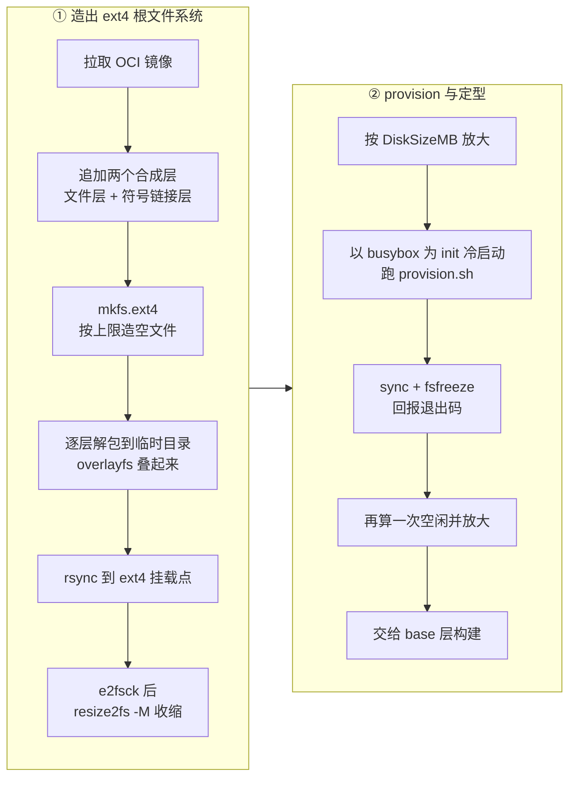

# 43 · rootfs 制作

> 一个 OCI 镜像不能直接当 microVM 的磁盘用：它没有分区表、没有 init、没有 systemd，也没有 envd。
> 本篇讲 e2b 怎么把镜像变成一个能开机、能被快照的 ext4 文件 —— 拉取与认证、层解包、
> 大小与预留、用 busybox 跑一次性 provisioning，以及最后一步的默认用户配置。
>
> **读者**：工程师、系统工程师。
> **预备**：[第 41 篇 · 构建总览](41-template-build-overview.md)、[第 42 篇 · 阶段流水线](42-build-phases.md)；
> 知道 ext4 与 OCI 镜像层的基本概念。
> **代码**：`packages/orchestrator/internal/template/build/core/oci/`、`core/filesystem/ext4.go`、
> `core/rootfs/`、`core/systeminit/`、`phases/base/`、`phases/finalize/`

---

## 0. 本篇要回答的问题

1. 从 OCI 镜像到一个可启动的 ext4 文件，中间有哪几步？每一步的失败模式是什么？
2. 为什么要先按上限造文件系统、再收缩、再放大？「预留磁盘」到底预留在哪里？
3. 为什么第一次开机不用 systemd，而是用一个塞进去的 busybox？
4. `provision.sh` 装的那十几个包，各自是被谁依赖的？它对 guest 发行版做了哪些假设？
5. envd 是怎么进到镜像里的，它的 systemd 单元为什么要写那些资源参数？
6. 默认用户 `user` 是在哪一步创建的，为什么不在 provisioning 里做？

---

## 1. 镜像不是磁盘

Docker 镜像是一组 tar 层加一份配置。容器运行时把这些层叠成一个 overlay 挂载点，再 `chroot` 进去 ——
内核是宿主的，init 是容器的入口进程，`/proc`、`/sys`、`/dev` 由运行时替你挂好。

microVM 没有这些便利。Firecracker 拿到的是一个块设备，guest 内核自己挂载它当根，
自己找 `init`，自己挂 `/proc`。于是从镜像到 rootfs 至少缺三样东西：

- **一个文件系统**。层是 tar，不是块设备；需要一个真正的 ext4 镜像文件。
- **一个能跑起来的 init**。绝大多数基础镜像里没有 systemd，`docker.io/library/ubuntu` 也没有。
- **e2b 自己的部件**。envd 必须在沙箱里跑起来，否则 SDK 无法执行任何命令。

base 阶段解决的就是这三件事，产物是一个 ext4 文件，加上一个空的 memfile。
产物的最终形态与文件布局见[第 29 篇 §2](29-template-artifact-format.md#2-一代产物六个对象)。



---

## 2. 拉取镜像：三种来源、一次平台校验

入口是 `core/rootfs/rootfs.go` 的 `CreateExt4Filesystem()`。它按模板配置分两路取镜像：

- `template.FromImage` 非空时走 `oci.GetPublicImage()`：用户在 SDK 里写的 `FROM ubuntu:22.04` 之类。
- `FromImage` 与 `FromTemplate` 都为空时走 `oci.GetImage()`，由 `artifactsregistry` 各实现的
  `GetTag()` 按 `<templateID>:<buildID>` 拼出引用去制品仓库取。这条路对应的是用户在本机把
  Dockerfile 构建成镜像、推进制品仓库的旧形态（[第 57 篇 §7](57-docker-reverse-proxy.md#7-与模板构建的衔接)）。

`GetPublicImage()` 里还有第三条分支：**没有认证信息、且引用指向默认 registry**（`docker.io`）时，
不直接去 Docker Hub，而是走 `dockerhub.RemoteRepository` 这个远端仓库代理
（`packages/shared/pkg/dockerhub/repository.go`，由 `DOCKERHUB_REMOTE_REPOSITORY_URL`
与 `DOCKERHUB_REMOTE_REPOSITORY_PROVIDER` 两个环境变量选择 GCP / AWS ECR / 无）。
这是一层缓存兼限流规避：公共镜像的拉取集中在少数几个 tag 上，
经代理后既避开 Docker Hub 的匿名速率限制，也少走一次跨境网络。代价是多一份需要运维的镜像缓存，
且未配置 URL 时 `GetRemoteRepository()` 退回 `NoopRemoteRepository`，直连上游。

### 2.1 认证

`core/oci/auth/` 只有一个接口，`RegistryAuthProvider.GetAuthOption()`，返回
go-containerregistry 的 `remote.Option`。工厂函数 `auth.NewAuthProvider()` 按 gRPC 请求里
`FromImageRegistry` 的类型分派出三种实现：

| 类型 | 实现文件 | 做法 |
|---|---|---|
| AWS ECR | `aws.go` | 用静态 AK/SK 调 `ecr:GetAuthorizationToken`，base64 解出 `user:pass` 做 Basic 认证 |
| GCP | `gcp.go` | 用 service account JSON 构造 `google.NewJSONKeyAuthenticator` |
| 通用 | `general.go` | 直接用请求里的用户名与口令做 Basic 认证 |

三者的凭据都来自 API 请求，随构建请求一次性传入，不落盘。ECR 那条路是唯一需要联网换令牌的，
也就是唯一会因为 IAM 配置错误在拉镜像**之前**就失败的。

拉取失败的错误由 `wrapImagePullError()` 翻译：把 registry 返回的
`MANIFEST_UNKNOWN`、`NAME_UNKNOWN`、`UNAUTHORIZED`、`DENIED` 四个错误码映射成给用户看的中文含义的英文句子
（「镜像不存在」「仓库名不对」「需要认证」「无权限」）。这是构建期为数不多的、
专门为终端用户可读性做的错误处理。

### 2.2 平台

`DefaultPlatform` 是包级变量，上游 2026.09 写死 `linux/amd64`。它有两处作用：
一是作为 `remote.WithPlatform()` 选项，让 registry 在多架构 manifest list 里挑对应的 manifest；
二是拉下来之后 `verifyImagePlatform()` 再读一次 image config，
若 `config.Architecture` 与期望不符就报 `image is not amd64`。

两道检查看起来冗余，实际不是：单架构镜像没有 manifest list，`WithPlatform` 对它无效，
用户拿一个 arm64 单架构镜像当基础镜像时，只有第二道检查能拦住。
代价是这个平台是**编译期常量**而非配置项，一个二进制只能构建一种架构的模板（见 [§10](#10-arm-适配版的差异)）。

---

## 3. 层解包成 ext4

`oci.ToExt4()` 是这一段的主函数，五步：`filesystem.Make` → `ExtractToExt4` →
`CheckIntegrity` → `Shrink` → 再一次 `CheckIntegrity`。

### 3.1 造一个空的 ext4

`core/filesystem/ext4.go` 的 `Make()` 调 `mkfs.ext4`，三个参数值得说：

- `-O ^dir_index,^64bit,^dir_nlink,ext_attr,sparse_super2,filetype,extent,flex_bg,large_file,huge_file,extra_isize`：
  代码注释说这套特性集对齐 `tar2ext4` 工具的产物，但额外保留了 `resize_inode`、`has_journal`、
  `metadata_csum`。保留 `resize_inode` 是硬要求 —— 后面要 `resize2fs`；关掉 `64bit`
  则限制了单个文件系统的寻址上限，对沙箱磁盘这个量级不构成约束。
- `-i 4096`（`inodesRatio`）：每 4096 字节空间分配一个 inode。块大小也是 4096
  （`header.RootfsBlockSize`，即 `2 << 11`），所以这是「一块一 inode」的极端配置。
  收益是解包大量小文件（node_modules、site-packages）时绝不会先耗尽 inode；
  代价是 inode 表本身占掉可观的空间，而且这部分空间在 `resize2fs -M` 之后依然存在。
- `-m 0`（`reservedBlocksPercentage`）：不给 root 预留块。ext4 默认预留 5%，
  目的是磁盘写满时 root 仍能登录处理。沙箱是一次性的，5% 预留纯属浪费，
  于是全部让给用户；代价是写满之后 guest 里没有任何回旋余地。

`Make()` 的入参 `sizeMb` 来自 `maxRootfsSize`，即特性开关
`build-base-rootfs-size-limit-mb` 的值（`shared/pkg/feature-flags/flags.go`，默认 25000，
约 24 GiB）。也就是说，文件系统一开始就按**允许的最大基础镜像**去造，而不是按镜像实际大小。

### 3.2 解包

`ExtractToExt4()` 把这个 ext4 文件用 `mount -o loop` 挂到临时目录，然后 `unpackRootfs()` 做三件事：

1. `createExport()` 把每一层 `Uncompressed()` 之后用 `archive.Untar` 解到
   `layer-<i>-<digest>` 目录，**各层并行**（`errgroup`），并且按逆序填进 `layerPaths` ——
   overlayfs 的 `lowerdir` 是从上到下排列的，而 OCI 层是从下到上，顺序必须反过来。
   解包时带 `IgnoreChownErrors: true`，因为构建进程未必有权限设置层里记录的任意 uid/gid。
2. `filesystem.MountOverlayFS()` 把这些目录全部作为 `lowerdir` 叠成一个只读视图。
   它没有用 `mount(2)`，而是用 `fsopen` / `fsconfig` / `fsmount` / `move_mount` 这组新接口，
   注释给的理由是老接口的 `lowerdirs` 有 4096 字符上限 —— 层多、digest 长的镜像很容易撞上。
   代价是要求宿主内核 6.8 以上。
3. `copyFiles()` 用 `rsync -aH --whole-file --inplace` 把叠好的视图拷进 ext4 挂载点。
   `-a` 保留权限、时间戳、符号链接与属主，`-H` 保留硬链接 —— 后者对基础镜像里
   busybox 风格的多命令硬链接是必需的。`--whole-file` 关掉 delta 算法（本地拷贝用不上），
   `--inplace` 免掉临时文件。

这条路径把 overlay 的白出文件（whiteout）语义交给了内核 overlayfs 处理，
比自己逐层重放 tar 并解释 `.wh.` 前缀要可靠。代价是构建节点必须允许 loop 设备与 overlay 挂载，
也就是构建必须以特权运行。

### 3.3 收缩与完整性

解包完成后连续两次 `e2fsck -pfv`（`CheckIntegrity(fix=true)`），中间夹一次 `resize2fs -M`
（`Shrink()`，收缩到「能装下现有数据的最小尺寸」）。
先检查再收缩的理由写在代码注释里：带着已有错误去收缩会把问题放大；
收缩后再检查一次，是因为 resize2fs 本身也可能留下块位图差异。

---

## 4. 大小与预留

到这里 ext4 文件已经贴着数据尺寸了，但模板配置里的 `DiskSizeMB` 说的是
「用户可用的**空闲**磁盘」，不是总容量。`CreateExt4Filesystem()` 的做法是：

```text
diskAdd = DiskSizeMB(字节) - 当前空闲字节
若 diskAdd > 0 则 Enlarge(rootfsPath, diskAdd)
```

「当前空闲字节」由 `GetFreeSpace()` 得到：跑 `debugfs -R stats`，正则抓出
`Free blocks:` 与 `Reserved block count:`，相减再乘块大小 —— 预留块不算用户可用空间
（`-m 0` 之下这一项通常为零）。而 `diskAdd` 之所以要把这段空闲减掉，
代码注释给的理由是 `resize2fs -M` 收缩之后仍会剩下一点无法回收的残余空间，
这部分对用户是可用的，不应该在放大时重复计算。
放大之后 `CreateExt4Filesystem()` 再跑一次 `CheckIntegrity(fix=true)`。

`Enlarge()` 是 `stat` 出当前文件大小加上增量，再交给 `Resize()` 跑 `resize2fs <path> <N>M`。
注意 `Resize()` 把目标字节数右移 20 位取整到 MiB，所以最终尺寸是 MiB 对齐的。

在查空闲与放大之前还有一步 `filesystem.MakeWritable()`：`tune2fs -O ^read-only`。
`mkfs` 之后的文件系统本身不是只读的，但 `ToExt4` 的产物在交出前被当作只读基线；
代码注释说「默认是只读的」，把 read-only 特性位显式清掉是为了 guest 能写。

**provisioning 之后还要再算一次。** `phases/base/builder.go` 的
`buildLayerFromOCI()` 在沙箱关掉后先做一次 `CheckIntegrity(fix=true)`，
再调 `phases/base/provision.go` 的 `enlargeDiskAfterProvisioning()`，
后者重复了同样的「查空闲、算差值、放大」逻辑（差值不为正就直接跳过），
因为 provision.sh 往里装了十几个包，空闲空间已经被吃掉了一大块。
这一次放大后的完整性检查有个额外的容错：先 `e2fsck -nfv` 不修复地查，
失败了再 `e2fsck -pfv` 修一次，注释说明原因是「偶尔出现块位图差异」。
随后校验文件大小与 `Enlarge()` 的返回值一致，最后调 `rootfs.UpdateHeaderSize()`
让内存里的块设备 header 认识新尺寸。

尺寸变化连起来看：**按上限造 → 收缩到实际 → 加上用户要的空闲 →
provisioning 消耗 → 再补齐到用户要的空闲**。收益是最终产物里没有为「可能用到」而预留的空洞，
上传到对象存储的字节数最小；代价是至多三次 `resize2fs` 与五到六次 `e2fsck`
（ToExt4 里两次、放大后一次、provisioning 之后一次、最终放大后一到两次），
它们都是全盘扫描量级的操作，构成 base 阶段固定的时间开销。

---

## 5. 注入了哪些文件

镜像拉下来之后、造文件系统之前，`additionalOCILayers()` 用 `mutate.AppendLayers()`
往镜像上追加了两个**合成层**。它们是普通的 tar 层，由 `core/oci/layer_file.go` 的
`LayerFile()` / `LayerSymlink()` 生成 —— 写 tar 前对路径排序，保证同样的输入产出同样的字节，
这样层的 digest 是可复现的。

文件层的内容：

| 路径 | 权限 | 来源 | 用途 |
|---|---|---|---|
| `/usr/bin/envd` | 0777 | 宿主上的 `BuilderConfig.HostEnvdPath` | 沙箱内守护进程 |
| `/usr/local/bin/provision.sh` | 0777 | `phases/base/provision.sh` 渲染后 | 首次开机的装机脚本 |
| `/usr/bin/busybox` | 0755 | `core/systeminit` 内嵌的二进制 | 通用工具箱 |
| `/usr/bin/init` | 0755 | 同上，第二份拷贝 | 首次开机的 init |
| `/etc/inittab` | 0777 | `files/inittab.tpl` | busybox init 的动作表 |
| `/etc/init.d/rcS` | 0777 | `files/rcS.sh.tpl` | 挂载 `/proc` `/sys` `/dev` `/tmp` `/run` |
| `/etc/systemd/system/envd.service` | 0644 | `files/envd.service.tpl` | envd 的 systemd 单元 |
| `/etc/hostname`、`/etc/hosts` | 0644 | `hostname.tpl`、`hosts.tpl` | 主机名固定为 `e2b.local` |
| `/etc/resolv.conf` | 0644 | `resolv.conf.tpl` | nameserver 取 `sandbox-network` 的 `8.8.8.8` |
| 两个 `override.conf` | 0644 | `disable-watchdog.service.tpl` | 给 journald 与 networkd 设 `WatchdogSec=0` |
| `serial-getty@ttyS0.service.d/autologin.conf` | 0644 | 同名模板 | 串口控制台免登录 |

模板的路径不写在 Go 代码里，而是由模板自己声明：每个 `.tpl` 开头调用
`{{ .WriteFile "路径" 权限 }}`（`core/rootfs/templates.go` 的 `templateModel.WriteFile`），
把路径与权限追加进 `model.paths`，返回空串。`generateFile()` 渲染完成后把同一份内容写到
该模板声明的**所有**路径 —— `disable-watchdog.service.tpl` 声明了两个路径，
一份 `WatchdogSec=0` 因此同时落到 journald 和 networkd 的 override 目录。
关掉这两个 watchdog 是因为快照恢复会让 guest 的单调时钟出现跳变，
systemd 的看门狗会据此判定服务卡死并重启它。

符号链接层只有两条，都是把单元链进 `multi-user.target.wants/`（envd 与 chrony），
等价于 `systemctl enable`。链接目标写的是相对路径 `etc/systemd/system/envd.service`，
放在 `etc/systemd/system/multi-user.target.wants/` 目录里其实解析不到真实文件；
**推论**：这不影响启用，因为 systemd 枚举 `.wants` 目录时按条目**文件名**去单元搜索路径里查找单元，
不要求链接本身可解析。

---

## 6. 用 busybox 当一次性 init

现在文件系统造好了，里面还没有 systemd。要装 systemd 就得跑 `apt-get`，
要跑 `apt-get` 就得有一个在运行的系统 —— 循环依赖。

e2b 的解法是**开两次机**。第一次开机的 init 不是 systemd，而是塞进去的 busybox：
`provision.go` 的 `provisionSandbox()` 给 `fc.ProcessOptions` 传
`InitScriptPath: rootfs.BusyBoxInitPath`，`fc/process.go` 把它拼进内核参数 `init=`。
第二次开机（构建期沙箱与后续所有层）用的是 `layer/create_sandbox.go` 里的
`constants.SystemdInitPath`，也就是 `/sbin/init`。

busybox 在镜像里有**两份**：`/usr/bin/busybox` 和 `/usr/bin/init`。
代码注释给了理由 —— init 用单独的路径，避免和后来装上的 systemd 抢 `/sbin/init`；
而且「从 init 文件启动时任何对它的改写都会损坏文件系统」，所以这份拷贝必须是没人会去动的路径。

`/etc/inittab` 是这次开机的全部剧本：

```text
::sysinit:/etc/init.d/rcS
::wait:/bin/sh -c '/usr/local/bin/provision.sh 2>&1 | sed "s/^/[external] /"'
::wait:/usr/bin/busybox sync
::wait:fsfreeze --freeze /
::wait:/bin/sh -c 'echo "E2B_PROVISIONING_EXIT:$(cat /provision.result || printf 1)"'
::wait:/usr/bin/busybox sleep infinity
```

（日志前缀与结果路径实际由模板变量填入，见 `provision.go` 的 `provisionLogPrefix`
与 `provisionScriptResultPath`。）

六行里藏着完整的控制流：

- `rcS` 只做一件事：挂 `/proc`、`/sys`、`/dev`、`/tmp`、`/run`。容器里这些是运行时给的，
  裸机开机得自己来，否则 `apt-get` 立刻失败。
- provisioning 的输出被 `sed` 加上 `[external] ` 前缀。宿主侧
  `writer.PrefixFilteredWriter` 按这个前缀过滤，把 guest 里的装机日志转成用户可见的构建日志。
  这条通道走的是 Firecracker 进程的 stdout（`ProcessOptions.Stdout`），
  所以 provisioning 阶段特意打开了 `KernelLogs: true` —— 内核参数里加 `console=ttyS0`，
  日志级别调到 5。运行期沙箱不开这个（`quiet`、`loglevel=1`），因为串口输出会拖慢启动。
- `sync` 之后 `fsfreeze --freeze /` 冻结根文件系统。这一步是快照正确性的关键：
  宿主接下来要直接读那个 ext4 文件，guest 里必须没有在途的写。
- 退出码不通过任何 RPC 回报，而是**打印一行带魔法前缀的文本**。宿主侧
  `provisionSandbox()` 起一个 goroutine 扫描日志流，遇到 `E2B_PROVISIONING_EXIT:` 就取后面的数字，
  `0` 判成功，其它判失败。这是一个刻意的选择：此时 envd 还没起来，没有别的通道可用。
  代价是这个契约依赖字符串匹配，而且脚本里 `cat` 失败时用 `printf 1` 兜底 ——
  读不到结果文件一律算失败，方向是安全的。
- `sleep infinity` 让 VM 不退出。宿主拿到退出码后主动 `sbx.Shutdown()`。

最后宿主用 `filesystem.RemoveFile()` 走 `debugfs -w -R rm` 把 `/provision.result`
从**未挂载的**镜像里删掉 —— 不需要再挂一次 loop。

整个 provisioning 有 5 分钟超时（`provisionTimeout`），沙箱在此期间是**允许联网**的
（`Network: &orchestrator.SandboxNetworkConfig{}`），否则 `apt-get` 无从谈起。

---

## 7. provision.sh 装什么

脚本由 `getProvisionScript()` 渲染，只有两个变量：busybox 的绝对路径与结果文件路径。
它做的事包括：

1. `chattr +i /etc/resolv.conf` —— 先把 DNS 配置设成不可改。装 systemd 的过程中
   `systemd-resolved` 之类的包会试图接管 `/etc/resolv.conf`，一旦接管，
   沙箱里的 DNS 就依赖一个在快照恢复后未必还正常的服务。脚本末尾再 `chattr -i` 解锁。
2. 装包。包列表是
   `systemd systemd-sysv openssh-server sudo chrony linuxptp socat curl ca-certificates fuse3 iptables git nfs-common`，
   先用 `dpkg-query -W -f='${Status}'` 逐个查，只装缺的。各自的用途：

   | 包 | 谁需要它 |
   |---|---|
   | `systemd`、`systemd-sysv` | 第二次开机的 init 与服务管理 |
   | `chrony`、`linuxptp` | 快照恢复后校时；配置成 `refclock PHC /dev/ptp0` |
   | `openssh-server`、`sudo` | 用户在沙箱里的交互与提权 |
   | `socat`、`curl`、`ca-certificates` | 用户命令与 ready 检查常用 |
   | `fuse3` | 挂载类工作负载 |
   | `iptables` | guest 内的网络规则 |
   | `git` | 用户脚本里最常见的外部命令之一 |
   | `nfs-common` | 挂载 volumes，见[第 40 篇 §4](40-volumes-and-nfsproxy.md#4-一次挂载的完整路径) |

3. 设 shell 环境：`SHELL=/bin/bash`、`PS1='\w \$ '`，写进 `/etc/profile.d/` 与 `/root/.bashrc`，
   并在 `/etc/profile` 末尾追加对 `~/.bashrc` 与 `~/.profile` 的 source。
4. `passwd -d root` 删掉 root 口令；SSH 配置打开 `PermitRootLogin`、`PermitEmptyPasswords`、
   `PasswordAuthentication`。沙箱的安全边界在 VM 与网络上，不在 guest 的口令上。
5. chrony 配置成用 PTP 硬件时钟（`/dev/ptp0`）做参考源，poll 间隔 2，
   并加一个 `/etc/chrony.conf` 的 include 转发（注释说某些镜像里的 timemaster 期望它在那个位置），
   再用 drop-in 把 chronyd 改成以 root 运行。
   快照恢复后 guest 的墙上时钟会停在快照那一刻，chrony 从 PTP 拉回来是最快的路径。
6. `fs.inotify.max_user_watches=65536` —— 前端开发工具链的常见瓶颈。
7. 三次 `systemctl mask`：`serial-getty@ttyS0`（内核参数里已经把 ttyS0 当控制台）、
   `systemd-networkd-wait-online`（网络由宿主配好，等它只会拖慢启动）、
   `systemd-firstboot`（注释指名 Ubuntu 24.04 会卡在首次启动向导里直到 envd 等待超时）。
8. `rm -rf /etc/machine-id`：清掉 Docker 镜像里带的 machine-id，让每次开机重新生成。
9. `ln -sf /lib/systemd/systemd /usr/sbin/init`：把 systemd 接到 init 的位置上，
   第二次开机的 `init=/sbin/init` 才有着落。
10. 删掉 `/etc/init.d/rcS` 与自己，然后 `printf "0" > /provision.result`。

**这个脚本对 guest 的假设很具体**：Debian 系的包管理（`dpkg-query` + `apt-get`）、
包名按 Debian 命名（`nfs-common` 而非 `nfs-utils`）、`/lib/systemd/systemd` 这个路径、
`/sbin` 与 `/usr/sbin` 合并（脚本链的是 `/usr/sbin/init`，内核参数用的是 `/sbin/init`）、
以及 `fsfreeze`（util-linux）与 `chattr`（这里用的是内嵌 busybox 的实现，不依赖 e2fsprogs）。
换一个发行版，这些假设逐条失效 —— [§10](#10-arm-适配版的差异) 是一个具体例子。

---

## 8. envd 注入与它的 systemd 单元

envd 的二进制由构建进程从**宿主**读进来（`BuilderConfig.HostEnvdPath`），
以 0777 写进 `/usr/bin/envd`（`storage.GuestEnvdPath`）。也就是说，
envd 的版本跟随 orchestrator 二进制，而不是跟随模板 —— 版本号由
`core/envd/envd.go` 的 `GetEnvdVersion()` 跑一次 `envd -version` 取得。

这带来一个问题：从缓存里命中的旧层，里面的 envd 是旧版本。
处理办法是 `layer/layer_executor.go` 的 `updateEnvdInSandbox()`：
当 `LayerBuildCommand.UpdateEnvd` 为真时，把宿主上的新 envd 复制到沙箱 `/tmp/envd_updated`，
再 `chmod +x` 并 `mv -f` 覆盖 `/usr/bin/envd`。
`phases/steps/builder.go` 与 `phases/finalize/builder.go` 都把这个开关设成 `sourceLayer.Cached`：
**只有源层来自缓存时才更新**，新建的层里 envd 本来就是新的。base 阶段则固定为 `false`。

`files/envd.service.tpl` 渲染出的单元有几处值得解释：

```text
ExecStart=/bin/bash -l -c "/usr/bin/envd"
Environment="GOMEMLIMIT={{ .MemoryLimit }}MiB"
LimitCORE=infinity
OOMPolicy=continue
OOMScoreAdjust=-1000
Delegate=yes
MemoryMin=50M
MemoryLow=100M
CPUAccounting=yes
CPUWeight=1000
```

- 用 `bash -l -c` 而不是直接 exec，是为了让 envd 继承登录 shell 的环境
  （`/etc/profile`、`profile.d`），用户在模板里用 `ENV` 设的变量因此对 envd 启动的进程可见。
  代价是多一层进程，并且强依赖 guest 里有 `/bin/bash`。
- `GOMEMLIMIT` 由 `templateModel.MemoryLimit()` 算出：`min(MemoryMB / 2, 512)`，单位 MiB。
  这是给 Go 运行时的软上限，让 GC 在接近该值时更积极，而不是等到系统 OOM。
- `OOMScoreAdjust=-1000` 把 envd 排除在 OOM killer 之外，`OOMPolicy=continue`
  让 cgroup 内其它进程被杀时 envd 不跟着停。理由直白：envd 死了，沙箱就完全失联，
  连「内存不足」这个事实都报不出去。
- `MemoryMin` / `MemoryLow` / `CPUWeight=1000` 是 cgroup v2 的资源保护，
  意思是不论用户负载多重，envd 都保得住 50 MiB 内存与相当高的 CPU 权重。
  `Delegate=yes` 让 systemd 把子 cgroup 的管理权交给这个单元。
  这些指令**要求 guest 跑在 cgroup v2 的统一层级下**。

envd 本身的启动流程、它读 MMDS 拿元数据、以及 `/init` 接口做什么，
见[第 48 篇 §2](48-envd-overview.md#2-启动从-systemd-单元到-49983-端口)与[§4](48-envd-overview.md#4-init-在-envd-侧做了什么)。

---

## 9. configure.sh：默认用户在最后一步创建

`phases/finalize/configure.sh` 在 finalize 阶段跑，路径完全不同于 provisioning：
它不是靠 inittab，而是通过 envd 在**已经跑着 systemd 的沙箱**里执行
（`finalize/configure.go` 的 `runConfiguration()` → `sandboxtools.RunCommandWithLogger()`，
以 root 身份，5 分钟超时）。这条通道的细节见[第 44 篇 §3](44-build-sandbox-and-commands.md#3-命令通道)。

它做四件事：

1. 写 `/.e2b`，内容是 `ENV_ID` / `TEMPLATE_ID` / `BUILD_ID`。沙箱内的程序（以及旧版 SDK）
   可以读它知道自己是谁。`ENV_ID` 与 `TEMPLATE_ID` 取的是同一个值，是历史命名的遗留。
2. 创建默认用户 `user`：`adduser -disabled-password --gecos "" user`。
   有一段专门的补救逻辑 —— 如果 `/home/user` 已经存在（基础镜像自带），`adduser` 会跳过家目录，
   于是脚本抓它的输出，匹配到 "The home directory ... already exists" 就手动
   `cp -rn /etc/skel/. /home/user/` 把骨架文件补上。
3. 授权：`usermod -aG sudo user`、`passwd -d user`，并往 `/etc/sudoers` 追加
   `user ALL=(ALL:ALL) NOPASSWD: ALL`。加组和加 sudoers 行是重复的，但前者依赖发行版把
   `sudo` 组写进了 sudoers，后者不依赖。
4. 目录：`chown -R user:user /home/user`、`chmod 777 -R /usr/local`、
   `mkdir -p /code` 且 `chmod 777 -R /code`。`/code` 是 SDK 侧约定的默认工作目录之一，
   777 是为了不管进程以哪个身份跑都能写。

**为什么放在最后而不是 provisioning 里**：provisioning 结束时用户的 `RUN` 步骤还没执行；
放在最后，用户在步骤里创建的 `/home/user`、安装的包、改的 skel 都已经就位，
`configure.sh` 在它们之上做收尾。代价是 `chmod 777 -R /usr/local` 这类递归操作
要在一个可能已经很大的目录树上跑，而且 finalize 的 `Layer()` 恒返回 `Cached: false`，
这一步每次构建都要重做。

脚本之外还有一处对应：`finalize/builder.go` 的 `Build()` 把
`sandbox.EnvdMetadata.DefaultUser` 设成当前层元数据里的 `Context.User`
（base 阶段初值是 `root`，见 `phases/base/builder.go` 的 `defaultUser` 常量，可被 `USER` 指令改写），
旧构建版本上还有一处强制覆盖，见[第 42 篇 §3.4](42-build-phases.md#34-finalize)。

---

## 10. ARM 适配版的差异

ARM 适配版改了这条路径上的五个点：`core/oci/oci.go` 的 `DefaultPlatform` 硬编码成 `arm64`；
`core/systeminit/busybox.go` 从单一内嵌二进制改成按 `runtime.GOARCH` 在 x86 与 arm64
两份内嵌 busybox 之间选择（arm64 用的是 1.35）；`provision.sh` 增加基于 `/etc/os-release`
的发行版检测，openEuler 走 `rpm -q` 与 `dnf install --nogpgcheck`，
并从包列表里去掉了 `fuse3`、`iptables`、`git`、`nfs-common`；
`configure.sh` 改用 `#!/bin/sh`，按是否存在 `/etc/debian_version` 分支，
RHEL 系用 `useradd` 并加入 `wheel` 组；`envd.service.tpl` 删掉了
`Delegate` 与 `MemoryMin` / `MemoryLow` / `CPUAccounting` / `CPUWeight` 这一组 cgroup 指令。
每一项的理由与后果见[第 74 篇 §2](74-template-build-on-arm.md#2-内嵌-busybox一个不在源码里的二进制)到[§6](74-template-build-on-arm.md#6-两个模板文件)，
cgroup 相关的宿主与 guest 兼容问题见[第 73 篇 §2.4](73-cgroup-and-host-compat.md#24-guest-侧的同向退让)。

---

## 11. 小结

- rootfs 制作要补齐镜像相对于块设备缺的三样东西：文件系统、init、e2b 自己的部件。
- 镜像有三条来源（公共 registry、远端仓库代理、制品仓库），认证由三个
  `RegistryAuthProvider` 实现覆盖 ECR / GCP / 通用 Basic；平台检查做两次，
  因为单架构镜像逃得过 `WithPlatform`。
- 解包路径是「并行解层 → overlayfs 叠成只读视图 → rsync 进 loop 挂载的 ext4」，
  白出语义交给内核，代价是要求宿主内核 6.8 以上并以特权运行。
- 尺寸经历「按上限造 → 收缩 → 补空闲 → provisioning 消耗 → 再补空闲」几轮调整，
  换来最小的上传字节数，代价是多轮全盘扫描量级的 `resize2fs` 与 `e2fsck`。
- 装 systemd 需要一个运行中的系统，这个循环由「第一次开机用内嵌 busybox 当 init」打破；
  `/etc/inittab` 六行同时定义了装机、落盘、冻结与退出码回报。
- provisioning 的退出码通过带 `E2B_PROVISIONING_EXIT:` 前缀的一行日志回报，
  因为此时 envd 还没有启动，没有别的通道。
- envd 的二进制跟随 orchestrator 而非模板，缓存命中的层在构建时会被就地替换成新版本。
- envd 的 systemd 单元用 OOM 豁免与 cgroup 保护换取「沙箱失联」这一最坏情况的概率，
  代价是对 guest 的 bash 与 cgroup v2 有硬依赖。
- 默认用户 `user`、sudo 免密与 `/code` 都在 finalize 的 `configure.sh` 里做，
  以便叠在用户步骤的结果之上；代价是这一步不进缓存。
- 整条路径对 guest 发行版的假设集中在 `provision.sh` 与 `configure.sh` 两个脚本里，
  这也是移植到非 Debian guest 时改动最密集的地方。

---

## 延伸阅读 / 下一篇

- [第 42 篇 §3](42-build-phases.md#3-五类阶段)：base 与 finalize 在整条流水线里的位置。
- [第 44 篇 §3](44-build-sandbox-and-commands.md#3-命令通道)：`configure.sh` 走的那条命令通道。
- [第 45 篇 §2.2](45-layers-and-build-cache.md#22-五类阶段各放了什么)：base 层的 hash 与命中条件。
- [第 29 篇 §2](29-template-artifact-format.md#2-一代产物六个对象)：这个 ext4 文件最终变成什么。
- [第 48 篇 · envd 总览](48-envd-overview.md#1-guest-里为什么需要一个守护进程)：被注入的那个守护进程做什么。
- [第 74 篇 · 模板构建的 ARM 改动](74-template-build-on-arm.md#1-架构假设写在哪几个地方)：本篇各处 ARM 差异的展开。
- ext4 特性位与 `resize2fs -M` 的语义：`man mke2fs`、`man resize2fs`。
- overlayfs 的新挂载接口：Linux 文档 `filesystems/overlayfs.rst`。
