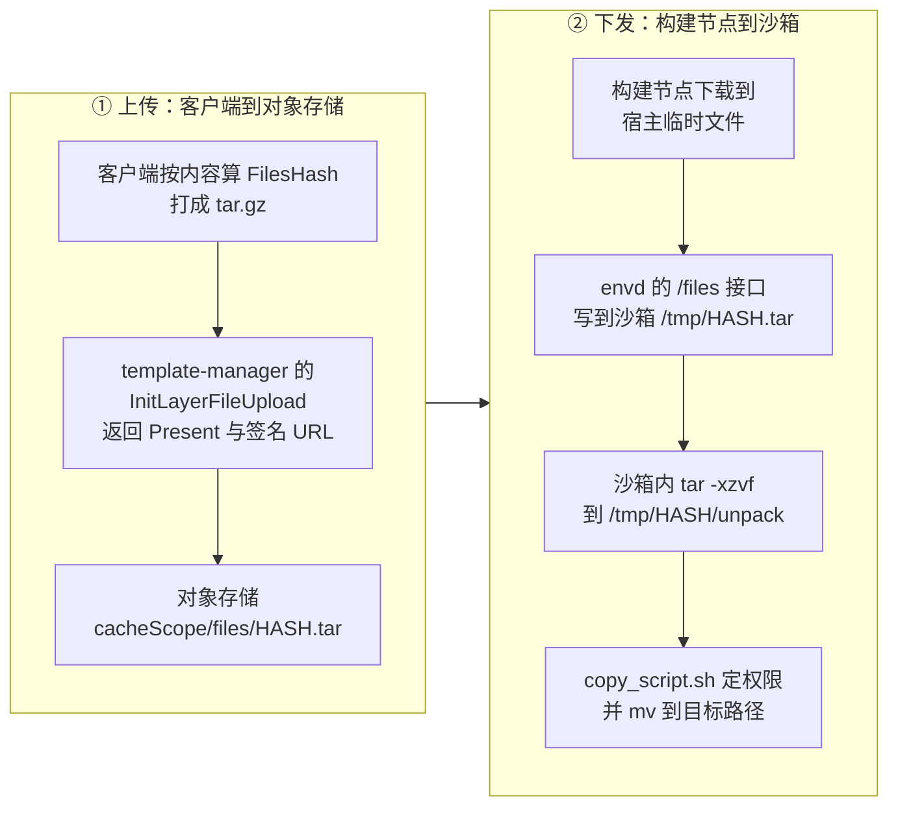
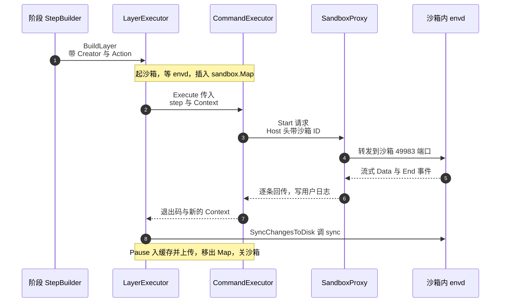

# 44 · 构建期沙箱与命令

> 模板构建的每一层都要在一台真的 microVM 里执行一条指令。这台沙箱和用户拿到的沙箱不是同一种东西：
> 它冷启动、不挂 userfaultfd、不建 cgroup、不做健康检查，命令通过 envd 的进程服务下发。
> 本篇讲它怎么起、怎么下发命令、六类指令各自怎么实现，以及哪些环节会重试、哪些不会。
>
> **读者**：工程师、系统工程师。　**预备**：[第 42 篇 · 阶段流水线](42-build-phases.md)、
> [第 36 篇 §2](36-orchestrator-proxy-and-envd-client.md#2-通道一orchestrator-里的沙箱代理)。
> **代码**：`packages/orchestrator/internal/sandbox/sandbox.go`、
> `internal/template/build/layer/create_sandbox.go`、`internal/template/build/sandboxtools/`、
> `internal/template/build/commands/`、`internal/sandbox/template_build.go`

---

## 0. 本篇要回答的问题

1. 构建期沙箱与运行期沙箱在资源接线上差了哪些部件？为什么可以差这么多？
2. orchestrator 明明和沙箱在同一台机器上，为什么下发命令还要绕自己的反向代理？
3. `RUN` 里的命令是以什么身份、在什么 shell、带什么 `PATH` 跑的？
4. `COPY` 的文件从用户机器到沙箱里的目标路径，中间经过几次搬运？
5. 一条指令失败会不会重试？哪些环节内建了重试，哪些没有？

---

## 1. 问题：构建期需要一台什么样的沙箱

构建的产物是「运行中系统的快照」，所以每一层都必须真的把指令执行一遍。执行的地方只能是一台
microVM —— 不能在宿主上 chroot，因为 guest 内核、systemd、以及指令可能依赖的一切内核接口
都要真实存在，否则快照下来的系统和用户将来跑到的系统不是一个东西。

但这台 microVM 的用途和用户沙箱完全不同，需求也就不同：

- 它**没有历史内存**。第一层从 rootfs 冷启动，后续层从上一层的快照恢复
  （选用规则见 [§2](#2-冷启动一台构建期沙箱)）。冷启动这一支不需要
  从对象存储按需拉内存页，因为根本没有页可拉。
- 它**不计费、不限额**。用户沙箱要按团队档位记 CPU 与内存用量，构建期沙箱只服务于一次构建，
  宿主上同时只有有限几台。
- 它**不对外提供服务**。用户沙箱要被 edge 路由、要跑健康检查、要上报宿主统计；
  构建期沙箱只被同一进程内的构建代码调用，活不过一层。
- 它的**寿命由代码显式管理**。用户沙箱靠 API 的 keepalive 续命；构建期沙箱在
  `layer.BuildLayer()` 里 `defer sbx.Close(ctx)`，一层做完就关。

这四条差异直接决定了 `Factory.CreateSandbox()` 比 `Factory.ResumeSandbox()` 少接了多少东西。

## 2. 冷启动一台构建期沙箱

入口是 `internal/template/build/layer/create_sandbox.go` 的 `CreateSandbox.Sandbox()`，
它实现 `layer.SandboxCreator` 接口，与 `ResumeSandbox` 并列，由阶段自己选用。
全仓库构造这两者的地方只有五处，规则是固定的：

| 阶段 | 用哪一种 | 位置 |
|---|---|---|
| base 的 provisioning 沙箱 | 都不用，直接调 `Factory.CreateSandbox()` | `phases/base/provision.go` |
| base 的建层沙箱 | 恒 `NewCreateSandbox`，带 `WithRootfsCachePath` | `phases/base/builder.go` |
| DEFAULT USER 与 steps | 源层命中缓存用 `NewCreateSandbox`，未命中用 `NewResumeSandbox` | `phases/steps/builder.go` |
| finalize | 恒 `NewCreateSandbox`，带 `WithIoEngine` | `phases/finalize/builder.go` |
| optimize | 恒 `NewResumeSandbox`，同一个 creator 连用两次 | `phases/optimize/builder.go` |

只有 steps 这一行是运行时判断的，判据是源层的 `Cached` 字段；其余四行在代码里写死。
为什么必须这样分，见[第 42 篇 §5.2](42-build-phases.md#52-冷启动还是恢复)。

### 2.1 换掉内存：空 memfile 与 noop 后端

`CreateSandbox.Sandbox()` 做的第一件事是给源模板套一层遮罩：

```go
memfile, err := block.NewEmpty(
    cs.config.RamMB<<constants.ToMBShift,
    config.MemfilePageSize(cs.config.HugePages),
    uuid.MustParse(sourceTemplate.Files().BuildID),
)
template := sbxtemplate.NewMaskTemplate(sourceTemplate, sbxtemplate.WithMemfile(memfile))
```

`NewMaskTemplate` 保留源模板的 rootfs、snapfile、metafile，只把 memfile 换成一个
按本次请求的 `RamMB` 新建的空块设备。冷启动继承磁盘、丢弃内存，这是「冷」字的确切含义。
顺带解决了一个约束：快照恢复不能改 vCPU 与内存规格，而冷启动可以，
所以从缓存层接续构建时必须走这条路。

到了 `Factory.CreateSandbox()` 里，内存后端被直接置成 noop：

```go
resources := &Resources{
    Slot:   ips,
    rootfs: rootfsProvider,
    memory: uffd.NewNoopMemory(memfileSize, memfile.BlockSize()),
}
```

`ResumeSandbox` 那一路要先 `uffd.New(memfile, fcUffdPath)`、起 uffd 进程、
`serveMemory()`、可能还要起预取器；这里一样都没有。Firecracker 是走正常内核引导起来的，
guest 内存由宿主匿名内存直接支撑，缺页由内核处理，不需要用户态 handler。
`NoopMemory` 只保留 `Dirty()` 之类的接口形状，供后面 pause 时统一调用
（pause 的语义见[第 37 篇 §2](37-pause-and-snapshot.md#2-pause-的时序)）。

代价是构建期沙箱起来时要真的把内存页分配出来，没有按需拉取的省内存效果；
收益是启动路径上少了 uffd 进程、socket 握手、映射表加载三段，也没有缺页处理的抖动。

### 2.2 rootfs：NBD 还是 direct

`Factory.CreateSandbox()` 按 `rootfsCachePath` 是否为空二选一：

- 空 → `rootfs.NewNBDProvider(...)`，和运行期沙箱一样走 NBD overlay；
- 非空 → `rootfs.NewDirectProvider(ctx, rootFS, rootfsCachePath)`。

`WithRootfsCachePath()` 这个选项目前只有 base 阶段用（`phases/base/builder.go`），
把刚在宿主上做好的 rootfs 文件直接当 COW 缓存喂进去。代码里的注释说明了动机：
这样所有块都被标为脏，且能被直接读出来 —— 第一层的产物本来就是全新的，
没有必要再经过 NBD 绕一圈。其余阶段（steps、finalize）不带这个选项，走 NBD。

另一处小差别是 rootfs 在宿主上的路径：`CreateSandbox` 传 `fc.ConstantRootfsPaths`，
其 `TemplateVersion` 恒为 2；`ResumeSandbox` 传的是从快照 metafile 里读出来的版本与 build ID，
因为老快照必须按当时的路径格式挂载。

### 2.3 Firecracker 进程选项

`CreateSandbox.Sandbox()` 组装的 `fc.ProcessOptions` 有四项值得看：

| 选项 | 取值 | 含义 |
|---|---|---|
| `InitScriptPath` | `constants.SystemdInitPath`，即 `/sbin/init` | 用 systemd 起 guest，与用户沙箱一致 |
| `KernelLogs` | `env.IsDevelopment()` | 生产环境不打 guest 内核日志 |
| `KvmClock` | 由 envd 版本决定 | envd ≥ `0.2.11` 才启用 |
| `IoEngine` | 默认 `models.DriveIoEngineSync` | 注释写明「避免 Async 引擎的问题」 |

`KvmClock` 的门槛是 `minEnvdVersionForKVMClock = "0.2.11"`，用 `utils.IsGTEVersion()` 比较。
这是构建期少见的一处版本协商：模板可以指定较老的 envd 版本，而 kvmclock 需要 envd 配合，
版本不够就不开。

`/sbin/init` 这个取值把构建期沙箱和 base 阶段的 provisioning 沙箱区分开了。
后者在 `phases/base/provision.go` 里直接调 `sandboxFactory.CreateSandbox()`，
`InitScriptPath` 是 `rootfs.BusyBoxInitPath`，也不走 envd —— 它靠解析串口日志里的
`ProvisioningExitPrefix` 前缀拿退出码（细节见[第 43 篇 §6](43-rootfs-construction.md#6-用-busybox-当一次性-init)）。
本篇讲的构建期沙箱是**有 envd 的**那一种。

### 2.4 等 envd 就绪

沙箱起来之后是 `sbx.WaitForEnvd(ctx, waitEnvdTimeout)`，`waitEnvdTimeout` 在
`layer/interfaces.go` 里定义为 60 秒。它内部调 `initEnvd()`，向
`http://<沙箱IP>:49983/init` POST 一个 JSON，用 `doRequestWithInfiniteRetries()`
以 5 ms 间隔无限重试，直到成功或者外层 60 秒的 context 被取消，或者 Firecracker 进程提前退出。

请求体里的字段（`envd.PostInitJSONBody`）对构建期沙箱大多是空的。
steps 与 base 阶段构造的 `sandbox.EnvdMetadata` 只填了 `Version`，
finalize 阶段额外填 `DefaultUser` 与 `DefaultWorkdir`；`AccessToken` 在整个构建路径上都没有设置。
推论：构建期沙箱内的 envd 不校验访问 token，构建代码后续的命令请求也不带 `X-Access-Token`。
它的可达性靠两点约束：沙箱 ID 是随机生成的、带 `config.InstanceBuildPrefix`（`"b"`）前缀，
且这台沙箱只被插入 orchestrator 本地的 `sandbox.Map`，不进 API 的沙箱目录。

### 2.5 与运行期沙箱的差异清单

| 维度 | 运行期沙箱（`ResumeSandbox`） | 构建期沙箱（`CreateSandbox`） |
|---|---|---|
| 内存来源 | uffd 按需从 memfile 拉块 | `block.NewEmpty` 空 memfile，内核直接分配 |
| 内存后端 | `uffd.New` + `serveMemory` | `uffd.NewNoopMemory` |
| 内存预取 | 有，读 metafile 里的 `Prefetch.Memory` | 无 |
| 启动方式 | Firecracker 加载 snapfile 恢复 | 正常内核引导，`/sbin/init` |
| rootfs 提供者 | NBD overlay | NBD overlay，base 阶段用 direct |
| rootfs 路径 | 按快照记录的模板版本与 build ID | `fc.ConstantRootfsPaths`，版本恒为 2 |
| cgroup | `createCgroup()` 建并挂到 FC 进程 | 不建 |
| 健康检查循环 | `go sbx.Checks.Start(execCtx)` | 只 `NewChecks(sbx, false)`，不启动 |
| 宿主统计采集 | `hostStatsCollector` | 无 |
| envd access token | 有，随 `/init` 下发 | 无 |
| 寿命 | API keepalive 续期 | 一层做完即 `Close()` |

这张表也可以反过来读：构建期沙箱少接的每一个部件，都是为「多租户下长期运行、需要被外部观测和计费」
准备的。构建期两条都不成立，于是可以全部省掉。省掉的直接收益是每层多起一次沙箱的成本降低；
代价是构建期沙箱的资源用量不受 cgroup 约束，一条失控的 `RUN` 能占满宿主内存 ——
上游 2026.09 在这里靠的是构建节点与运行节点分离，而不是隔离本身。

## 3. 命令通道

### 3.1 为什么绕自己的代理

`sandboxtools/command.go` 的 `runCommandWithAllOptions()` 并不直接连沙箱 IP，
而是把请求发到 `http://localhost<proxy.GetAddr()>`，也就是 orchestrator 自己的
`SandboxProxy` 监听端口，再用一个伪造的 `Host` 头告诉代理目标是谁：

```go
host := fmt.Sprintf("%d-%s-00000000.%s", consts.DefaultEnvdServerPort, sandboxID, domain)
header.Set("Host", host)
```

这是 `shared/pkg/grpc/envd_command.go` 的 `SetSandboxHeader()`。格式与外部访问沙箱端口时
用的域名一致：`<端口>-<沙箱ID>-<旧 client ID>.<域名>`，其中 client ID 已退化为常量
`00000000`。代理端 `internal/proxy/proxy.go` 用 `GetTargetFromRequest()` 解析出沙箱 ID 与端口，
在 `sandbox.Map` 里查到沙箱，转发到 `<沙箱IP>:49983`。

绕这一圈买到三样东西：连接池与连接数限制、失败重试（`reverseproxy.SandboxProxyRetries` 为 5，
注释说明是为了容忍沙箱内 envd 的端口转发延迟）、以及和外部流量完全一致的路径 ——
构建期用的通道和用户 SDK 用的通道是同一条，出问题时不需要区分两套代码。
代价是多一跳本机转发，以及构建代码必须先把沙箱 `Insert` 进 `sandbox.Map`
（`layer.BuildLayer()` 里做的，退出时 `Remove` 并 `RemoveFromPool(sbx.LifecycleID)`）。

### 3.2 一条命令的请求长什么样

命令走 envd 的进程服务（`process.proto` 的 `Start`，是一个服务端流式方法，
细节见[第 49 篇 §3](49-envd-process-service.md#3-一次-start-的内部时序)）。请求体固定成这个形状：

```go
&process.StartRequest{
    Process: &process.ProcessConfig{
        Cmd:  "/bin/bash",
        Cwd:  metadata.WorkDir,
        Args: []string{"-l", "-c", command},
        Envs: envs,
    },
}
```

三点值得注意：

**总是 `/bin/bash -l -c`。** `-l` 是登录 shell，会读 `/etc/profile` 与用户的 profile。
所以 `RUN` 里的命令能看到发行版默认的 `PATH` 与 profile 里的设置，
这与 Docker 的 `RUN` 默认用 `/bin/sh -c` 且不读 profile 不同。

**`PATH` 只在已存在时才追加。** 代码是：

```go
envs := maps.Clone(metadata.EnvVars)
if _, ok := envs["PATH"]; ok {
    envs["PATH"] += ":/usr/local/sbin:/usr/local/bin:/usr/sbin:/usr/bin:/sbin:/bin"
}
```

注释说这是为了「用户把 `PATH` 设坏了也还能找到基本工具」。反过来，如果用户从没用
`ENV PATH=` 覆盖过，`envs` 里没有 `PATH` 键，什么也不追加，`PATH` 完全由登录 shell 决定。

**身份走 HTTP Basic 头。** `SetUserHeader()` 把 `<user>:` 做 base64 塞进 `Authorization: Basic`。
envd 用它决定以哪个用户执行。构建期的大量内部命令写死 `metadata.Context{User: "root"}`。

HTTP 客户端的 `Timeout` 是 `commandHardTimeout = 1 * time.Hour`。这是一条命令的硬上限，
和层级的 `layerTimeout`（同为 1 小时，作为沙箱的 `sandboxTimeout` 传入）是两个独立的钟。

### 3.3 日志流与退出码

`Start` 返回一个流。`grpc.StreamToChannel()` 把它转成 channel，主循环按事件类型分派：

- `Data` 事件 → 调 `processOutput(stdout, stderr)` 回调；
- `End` 事件 → 取 `ExitCode`，非零就 `return errors.New(end.GetStatus())`。

四个封装的区别只在回调：`RunCommand` 丢弃输出，`RunCommandWithOutput` 把输出交给调用者
（`ENV` 和 `WORKDIR` 用它取命令的标准输出），`RunCommandWithLogger` 把每一行输出写进用户日志，
`RunCommandWithConfirmation` 多一个 `confirmCh`，在 `Start` 调用返回后立刻 `close`。
最后这个只有 finalize 阶段用：start 命令是常驻进程，ready 命令必须等它**已经发出**再开始轮询，
否则可能在服务还没启动时就判定就绪。

写日志的 `logStream()` 按行切分，跳过空行，拼成 `[<prefix>] [stdout]: <行>`。
`prefix` 由阶段传入（步骤是 `builder N/M` 形式，COPY 的解包子命令固定用 `"unpack"`），
所以用户在构建输出里能看出每一行属于哪一步。

### 3.4 文件通道

`sandboxtools/file.go` 的 `CopyFile()` 走的是另一条协议：envd 的 REST `/files` 接口。
它用 `io.Pipe` + `multipart.Writer` 边读边传，不把整个文件读进内存，
查询参数是 `path`（目标路径）与 `username`，同样带 `SetSandboxHeader()` 设的 `Host` 头，
经本机代理转发。超时是 `fileCopyTimeout = 10 * time.Minute`。

用到它的地方有两处：`COPY` 指令的层文件，以及 `layer.updateEnvdInSandbox()` 更新 envd 二进制。

## 4. 六类指令的实现

### 4.1 指令之间传递什么

`commands.Command` 接口只有一个方法，签名的最后一个参数和唯一的返回值都是
`metadata.Context`（`internal/template/metadata/template_metadata.go`）：

```go
type Context struct {
    User    string            `json:"user,omitempty"`
    WorkDir *string           `json:"workdir,omitempty"`
    EnvVars map[string]string `json:"env_vars,omitempty"`
}
```

这就是构建期的「当前状态」：以谁的身份、在哪个目录、带哪些环境变量。
每条指令拿到上一条的 `Context`，返回新的 `Context`；`steps.StepBuilder.Build()`
把它写回 `metadata.Template.Context`，随快照一起 pause 下来，
所以下一层从快照恢复后仍然知道当前用户与工作目录。它也是模板 metadata 的一部分，
运行期启动沙箱时用来填 envd `/init` 的默认用户与默认工作目录。

`CommandExecutor.getCommand()` 是一个纯分发：

| 指令 | 实现 | 是否修改 `Context` |
|---|---|---|
| `RUN` | `commands/run.go` | 否（临时改 user，返回原值） |
| `COPY` / `ADD` | `commands/copy.go` | 否 |
| `ENV` / `ARG` | `commands/env.go` | 改 `EnvVars` |
| `WORKDIR` | `commands/workdir.go` | 改 `WorkDir` |
| `USER` | `commands/user.go` | 改 `User` |

没有列在表里的指令类型直接返回 `command type %s is not implemented`。
这是一份刻意收窄的 Dockerfile 子集：没有 `CMD`、`ENTRYPOINT`、`EXPOSE`、`VOLUME`，
因为这些概念在 e2b 的模型里由 start / ready 命令与运行期配置承担，而不是模板本身。

### 4.2 RUN

`args` 是 `[command, optional_user]`。若给了第二个参数，就用它临时覆盖 `Context.User`，
然后调 `RunCommandWithLogger`。关键的一行是最后：

```go
originalMetadata := cmdMetadata
...
return originalMetadata, nil
```

`RUN` **返回的是执行前的 `Context`**。也就是说指定用户只对这一条命令生效，
命令里 `export` 的变量、`cd` 到的目录也都不会带到下一条 —— 每条 `RUN` 是一个独立的
`bash -l -c`，副作用只留在文件系统里。这与 Docker 的语义一致。

### 4.3 ENV 与 ARG

两者共用 `Env` 实现，`args` 是扁平的 `[k1 v1 k2 v2 ...]`，个数为奇数直接报错。
每个值不是原样存下，而是**送进沙箱求值一次**：`evaluateValue()` 先做转义
（`\`、`"`、反引号、`$(` 各自加反斜杠），再拼成 `printf "%s" "<value>"` 在沙箱里以 root 执行，
把标准输出当作最终值。

这样做是为了支持 `ENV PATH=$PATH:/opt/bin` 这类引用已有变量的写法：`$VAR` 展开被有意保留，
命令替换 `$(...)` 被转义掉。代价是每个 `ENV` 键值对都要付一次完整的
「起进程 + 流式回传 + 收流」的往返，一条 `ENV` 设 5 个变量就是 5 次往返。

注意 `evaluateValue()` 用的是 `metadata.Context{User: "root"}`，没有把当前 `EnvVars` 传进去。
推论：被引用的 `$PATH` 来自登录 shell 而不是构建累积的环境变量。

### 4.4 WORKDIR

`args` 是 `[path]`。相对路径按当前 `WorkDir` 解析，`WorkDir` 为空时按 `/` 解析。

真正执行的是一段内联 shell：先判断目标目录是否已存在，存在就直接退出；不存在则从目标往上找到
**第一个不存在的祖先**，`mkdir -p` 之后只对这个祖先递归 `chown`。
注释解释了动机：已有 `/home/user`，要建 `/home/user/project/test` 时，
只应该把 `project` 及其子目录改成当前用户所有，不该动 `/home` 和 `/home/user`。

这段脚本以 root 执行，并且**故意不设 `Cwd`** —— 注释说是「防止当前工作目录已被删除时报错」。
随后 `saveWorkdirMeta()` 再跑一次 `cd "<dir>" && pwd`，把 shell 解析出来的绝对路径写回
`Context.WorkDir`。多这一次往返是为了让符号链接与 `..` 归一化。

### 4.5 USER

`args` 是 `[username, optional_add_to_sudo]`。流程是三步：

1. `id -u <user>` 判断用户是否存在 —— 用命令的退出码当布尔值，非零即不存在；
2. 不存在则 `adduser --disabled-password --gecos "" <user>`；
3. 第二个参数为字符串 `"true"` 时调 `addToSudoers()`：`usermod -aG sudo`、`passwd -d` 清空密码、
   再用 `grep -q ... || echo ... >>/etc/sudoers` 幂等地追加一行 `NOPASSWD: ALL`。

最后 `saveUserMeta()` 又跑一次 `printf "<user>"` 把用户名写回 `Context.User`。
这一次往返没有做任何解析，纯粹是把值原样取回来，可以视为与 `WORKDIR` 对齐的写法。

`USER` 还有一个非用户指令的用法：默认用户阶段（`phases/user/builder.go`）
构造了一个合成的步骤 `TemplateStep{Type: "USER", Args: []string{user, "true"}}`，
复用同一套实现来创建模板的默认用户并加进 sudoers。

### 4.6 COPY 与 ADD

`COPY` 是唯一需要把宿主侧数据搬进沙箱的指令，也是这几条里链路最长的。文件的旅程分五段：



**第一段**在客户端。步骤里的 `FilesHash` 由客户端计算并随步骤下发；
`copy.go` 一开始就检查它非空，否则报 `COPY requires files hash to be set`。
客户端先调 template-manager 的 `InitLayerFileUpload`（`internal/template/server/upload_layer_files_template.go`），
服务端算出对象路径 `paths.GetLayerFilesCachePath(cacheScope, hash)`，
返回该对象是否已存在（`Present`）与一个 30 分钟有效的签名上传 URL。
已存在就不必再传 —— 这是内容寻址带来的天然去重。

**第二段**在构建节点。`copy.go` 用 `FilesStorage.OpenBlob()` 打开该对象，
边下载边写进宿主的 `os.CreateTemp("", "layer-file-*.tar")`，函数退出时删除。

**第三段**是 `sandboxtools.CopyFile()`，以 root 身份把这个临时文件写到沙箱的
`/tmp/<hash>.tar`。

**第四段**在沙箱里解包：`mkdir -p /tmp/<hash>/unpack && tar -xzvf ... -C ...`。
文件名写的是 `.tar`，实际用 `-z` 解压，所以客户端上传的是 gzip 压缩的 tar。
多套一层 `unpack` 目录是为了让「归档根下有多个条目」这种情况能被正确识别。

**第五段**是 `copy_script.sh`，一个用 `text/template` 渲染的 bash 脚本，以 root 执行。
它的逻辑值得完整理解，因为 `COPY` 的语义细节都在这里：

- 先 `cd` 到当前 `WorkDir`；`WorkDir` 为空时用 `getent passwd <user> | cut -d: -f6` 取用户家目录；
- 目标路径不是绝对路径时，相对当前目录展开；
- 取解包目录下的**第一个条目**（`ls -A | head -n 1`），**先判类型再改属主**，
  这样对符号链接用的是 `chown -h`，不会穿透到链接目标；
- 是文件：`chown` 后 `mkdir -p` 父目录，`mv` 成目标路径（可改名）；
- 是目录：递归 `chown -R`、可选 `chmod -R`，然后
  `find <dir> -mindepth 1 -maxdepth 1 -exec mv {} <target>/ \;` 把内容（含隐藏文件）搬过去。

属主的默认值来自 `parseCopyArgs()`：`<当前用户>:<当前用户>`；
第三个参数可显式指定，不含冒号时组名同用户名；第四个参数是可选权限，传给 `chmod`。
源路径里的 glob 由 `doublestar.SplitPattern()` 截掉——通配已在客户端展开过，
服务端只需要拿到 glob 之前的固定前缀。

留在 `/tmp` 的中间文件不显式删除。代码注释给了理由：`/tmp` 是 tmpfs，
下一层冷启动或恢复时会清空。这条推理只在 `/tmp` 确实是 tmpfs 时成立，是对 guest 的一个假设。

## 5. 一条 RUN 的完整路径

把前面几节串起来，一条 `RUN` 从阶段调度到落盘是这样：



图里 `SyncChangesToDisk` 那一步容易被忽略但不可省：它以 root 跑
`<busybox 路径> sync`，把 guest page cache 里的写入刷到 rootfs 块设备上。
不刷就 pause，下一层冷启动（只继承磁盘）会读到不完整的文件系统。

## 6. 失败与重试

构建期的重试是**分层的**，而且刻意不覆盖用户命令。

**会重试的：**

- **envd 就绪**。`doRequestWithInfiniteRetries()` 对 `/init` 无限重试，5 ms 一次，
  上限是外层的 60 秒 context 与 Firecracker 进程存活。启动早期连接被拒是常态，
  这里只重试传输层失败；HTTP 状态码不是 204 时直接返回错误，不再重试。
- **本机代理转发**。`reverseproxy.SandboxProxyRetries = 5`，用于容忍 envd 内部端口转发的延迟。
- **ready 命令**。`phases/finalize/ready.go` 的 `runReadyCommand()` 每 2 秒重跑一次，
  直到成功或 `readyCommandTimeout = 10 * time.Minute` 到期。
  它还有一个反直觉的分支：如果 context 是被 start 命令那一侧取消的（而非超时），
  就认为「start 命令已经跑完，模板就绪」，返回成功。

**不会重试的：**

- **用户的 `RUN`**。退出码非零就是失败，`Run.Execute()` 包一层
  `failed to run command '%s'` 直接返回。
- **`COPY` 的任何一段**。下载、上传、解包、移动，任一失败即整条指令失败。
- **`ENV` / `WORKDIR` / `USER` 内部的辅助命令**。它们本身就是一次性判断。

设计上的取舍很清楚：构建指令可能有副作用（装了一半的包、写了一半的文件），
自动重试会让「重试一次就好了」和「重试后状态更坏了」变得不可区分，
所以失败一律上抛，由用户决定是否重跑构建。

失败之后的收尾在层这一级：`layer.BuildLayer()` 的 `defer sbx.Close(ctx)` 保证沙箱被关，
`defer` 里还会把它移出 `sandbox.Map` 并从代理连接池摘掉连接。
再往上，步骤失败会被包成 `phases.NewPhaseBuildError(sb.Metadata(), err)`，
带上阶段名与步号，最终被判定为用户错误、原文返回给用户；
产物清理与取消路径见[第 41 篇 §6](41-template-build-overview.md#6-失败与取消)。

一个容易踩的边界：`layerTimeout` 为 1 小时，被当作 `sandboxTimeout` 传给工厂，
只写进沙箱的 `Metadata.endAt`。构建期沙箱不在 API 的生命周期管理之下，
所以这个值不会自动杀掉沙箱；真正的上限来自 `commandHardTimeout`（HTTP 客户端 1 小时）
与整个构建的 context。推论：一条卡住的 `RUN` 会在一小时后由 HTTP 客户端超时打断。

## 7. ARM 适配版的差异

`USER` 指令的两处实现依赖 Debian 系的工具与约定，在 openEuler guest 上不成立。
ARM 适配版在 `commands/user.go` 里加了两次探测：创建用户前用 `test -f /etc/debian_version`
判断发行版，是 Debian 系用 `adduser --disabled-password --gecos ""`，否则用
`useradd -m -s /bin/bash -c ""`；加 sudo 组前用 `getent group wheel` 探测，
有 `wheel` 组就加进 `wheel`，否则仍用 `sudo`。
其余文件（`sandboxtools/`、`layer/`、`internal/sandbox/template_build.go`）没有改动。
详见[第 74 篇 §5.2](74-template-build-on-arm.md#52-commandsusergo)。

## 8. 小结

- 构建期沙箱是 `Factory.CreateSandbox()` 起的冷启动沙箱：空 memfile、
  `uffd.NewNoopMemory` 内存后端、不建 cgroup、不启动健康检查循环、不采集宿主统计、不做预取。
- 冷启动继承源模板的 rootfs、丢弃内存，这正是它能改 vCPU 与内存规格、
  从而能从任意缓存层接续构建的原因。
- 命令不直接发往沙箱 IP，而是发往 orchestrator 自己的 `SandboxProxy`，
  用 `<端口>-<沙箱ID>-00000000.<域名>` 形式的 `Host` 头寻址，
  换来连接池、5 次重试与「构建期与运行期同一条通道」。
- 每条命令都是一次 envd `Start` 流式调用，固定 `/bin/bash -l -c`，
  身份走 HTTP Basic 头，输出按行写进用户日志，退出码非零即失败。
- 指令之间传递的状态只有 `metadata.Context` 三个字段：用户、工作目录、环境变量。
  `RUN` 不修改它，`ENV` / `WORKDIR` / `USER` 各改一项。
- `ENV`、`WORKDIR`、`USER` 都额外跑一次命令把值送进沙箱求值再取回，
  语义上更准确，代价是每条指令多若干次往返。
- `COPY` 的文件按内容哈希去重，经签名 URL 进对象存储，再经宿主临时文件、
  envd `/files`、沙箱内解包、`copy_script.sh` 定权限移动，共五段。
- 重试只加在「必然短暂失败」的环节：envd 就绪、代理转发、ready 轮询。
  用户命令一律不重试，因为副作用不可逆。

## 延伸阅读 / 下一篇

- [第 42 篇 §5](42-build-phases.md#5-阶段之间的沙箱状态)：谁决定这一层冷启动还是恢复，pause 与上传怎么收尾。
- [第 43 篇 · rootfs 制作](43-rootfs-construction.md#3-层解包成-ext4)：本篇沙箱启动前，rootfs 是怎么造出来的。
- [第 45 篇 §5](45-layers-and-build-cache.md#5-两个桶一个-scope)：`FilesHash` 与层 hash 的关系、缓存命中判定。
- [第 49 篇 §7](49-envd-process-service.md#7-以谁的身份在哪里带什么环境跑)：`Start` 流的事件模型、PTY、用户切换的 envd 侧实现。
- [第 36 篇 §2.1](36-orchestrator-proxy-and-envd-client.md#21-从请求到目的地)：本机代理的寻址与连接池。
- [第 37 篇 §4](37-pause-and-snapshot.md#4-内存导出跨进程直读)：一层做完之后，快照是怎么导出的。
