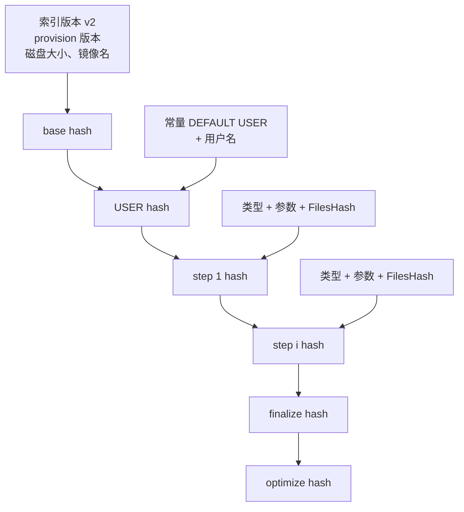
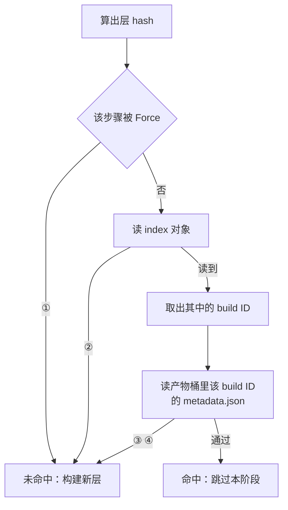

# 45 · 层与构建缓存

> 一次模板构建的每一步都可能被跳过，前提是有一个键能证明「这一步的结果我已经有了」。
> 本篇讲这个键怎么算、算的时候放进去了什么、更重要的是漏掉了什么，
> 以及为什么索引对象不是缓存的真相，产物桶才是。
>
> **读者**：工程师、系统工程师。
> **预备**：[第 42 篇 · 阶段流水线](42-build-phases.md)、[第 13 篇 · 存储全景](13-storage-landscape.md)。
> **代码**：`internal/template/build/storage/cache/cache.go`、`storage/paths/paths.go`、
> `internal/template/build/layer/`、`phases/*/hash.go`、`internal/template/build/metrics/metrics.go`、
> `packages/shared/pkg/feature-flags/flags.go`

---

## 0. 本篇要回答的问题

1. 一个层 hash 里放了哪些东西？哪些**没有**放进去，后果由谁承担？
2. 为什么缓存判定要走两跳，而不是索引里存什么就信什么？
3. 一条索引条目在什么时刻才被写下来，为什么不能更早？
4. 缓存在什么条件下失效？有哪些「本该失效却不会失效」的情况？
5. 这套缓存与 Docker 的层缓存，哪些地方一样，哪些地方不可能一样？

---

## 1. 跳过一步需要什么保证

构建的每一步都有副作用：装一个包、写一个文件、改一个环境变量。跳过一步，
等于断言「另一次构建在同样的起点上执行同样的动作，得到的结果与这次会得到的结果等价」。
这个断言不可能被验证，只能被**编码**：把决定结果的全部输入压进一个键，键相同就复用。

于是缓存的正确性完全取决于键的完备性。键里少放一样真正影响结果的输入，
就会命中一个不该命中的层，而且是静默的 —— 构建成功，产物不对。
键里多放一样不影响结果的输入，只是白白重建。这条不对称决定了取舍方向：
**宁可多放**。但 e2b 的键里恰恰有几样东西被有意留在外面，第 2.4 节说明它们各自的补偿机制。

还有一层含义容易被忽略：这里的「层」不是文件系统 diff，而是**一次 pause 的产物**
（[第 41 篇 §3](41-template-build-overview.md#3-与-docker-build-的本质区别)）。
命中一层意味着后续步骤会从这一层的快照恢复出一台虚拟机，
所以键必须同时覆盖磁盘内容与虚拟机状态两者的决定因素。

## 2. hash 怎么算

### 2.1 原语

只有一个函数，`storage/cache/cache.go` 的 `HashKeys()`：把 base key 写进 SHA-256，
再对每个后续 key 先写一个 `;` 再写内容，最后取十六进制摘要。所有阶段的 hash 都由它产出，
所以层 hash 是一串 64 个十六进制字符 —— 它出现在构建日志每一行的方括号里，
也直接作为对象键的最后一段。

分隔符只是 `;`，参数本身在拼进去之前已经被 `strings.Join(args, " ")` 压成一个字符串。
推论：`args` 为 `["a", "b"]` 与 `["a b"]` 的两个步骤 hash 相同。由于两者展开成的命令行文本一致，
这个歧义在当前的命令实现下不会导致错误的命中，但它说明这套编码不是无歧义的。

### 2.2 五类阶段各放了什么

| 阶段 | base key | 其余 key | 代码 |
|---|---|---|---|
| base，`FROM <image>` | 索引版本 | provision 版本、磁盘大小 MB、镜像名 | `phases/base/hash.go` |
| base，`FROM TEMPLATE` | 索引版本 | provision 版本、磁盘大小 MB、`template:<build-id>` | 同上 |
| DEFAULT USER | 上一层 hash | 常量 `DEFAULT USER`、用户名 | `phases/user/hash.go` |
| steps 第 i 步 | 上一层 hash | 步骤类型、参数拼接、`FilesHash` | `phases/steps/hash.go` |
| finalize | 上一层 hash | 常量 `config-run-cmd` | `phases/finalize/builder.go` |
| optimize | 上一层 hash | 常量 `optimize` | `phases/optimize/builder.go` |

只有 base 的 base key 不是上一层的 hash。除它之外每个阶段都把上一层的 hash 作为第一个输入，
所以整条链是一条 hash 链：任何一环变化，其后所有环的 hash 全变。



finalize 与 optimize 的 hash 算了也不查：这两个阶段的 `Layer()` 一律返回 `Cached: false`。
finalize 仍然会以自己的 hash 写下一条索引条目（`layer.PauseAndUpload()` 的参数就是它的 hash），
但没有任何阶段会去读这个 hash，因此那是一条只写不读的条目。

### 2.3 两个版本号

hash 里有两个纯粹用来「主动作废」的输入。

**索引版本**：`cache.go` 的常量 `hashingVersion = "v2"`，通过 `HashIndex.Version()` 进入 base hash，
再沿链传导到所有层。改动 hash 口径时把它加一，全平台所有团队的层缓存一次性作废，
不需要去删任何对象。

**provision 版本**：`phases/base/hash.go` 读特性开关 `build-provision-version`
（`packages/shared/pkg/feature-flags/flags.go` 中的整型开关，fallback 为 0）。
取值等于 fallback 时，代码退回用 `//go:embed provision.sh` 嵌进二进制的**脚本正文**当版本串；
取值不等于 fallback 时，用这个整数。这个分支的实际含义是：
接了 LaunchDarkly 的部署由运维手工递增数字来作废 base 层；没接的部署
（`feature-flags/client.go` 的 `NewClient()` 在没有 API key 时用离线数据源，所有开关返回 fallback）
自动跟随 provision 脚本的内容变化 —— 脚本改一个字符，base 层 hash 就变。
代价是：只要嵌入的脚本变了，即使改的是注释，整个团队的 base 层也要重建。

### 2.4 没有放进 hash 的东西

| 未参与 hash | 后果 | 补偿机制 |
|---|---|---|
| vCPU 数、内存 MB | 缓存层是用另一套规格 pause 的 | 命中之后的第一个未命中层用冷启动而非恢复（`phases/steps/builder.go`） |
| envd 版本 | 缓存层里的 envd 可能很旧 | 同一处：`UpdateEnvd` 取 `sourceLayer.Cached`，接续时替换二进制并重启 |
| 内核版本、Firecracker 版本 | 缓存层可能由另一版本产出 | 无。两者写在层元数据里，恢复时按元数据取用 |
| 镜像 tag 指向的内容 | `FROM node:latest` 内容变了 hash 不变 | 无。`phases/base/hash.go` 的注释明确承认这一点，只能靠强制重建 |
| 拉取镜像用的 platform | 同一个镜像名在两种架构上算出同一个 base hash | 无。它是编译期常量，不是运行期输入 |
| COPY 文件的实际字节 | hash 由客户端算并上传 | 无。服务端不校验（[第 22 篇 §5](22-template-api.md#5-文件按-hash-上传)） |

前两行是这套设计里最值得学习的一处：不把 vCPU、内存、envd 版本放进键，
换来的是**同一条指令链在不同资源规格下共享缓存**；
代价是命中之后必须付一次冷启动，并且要把 envd 就地升级一次。
这两笔代价都是有界的常数，而把规格放进键会让缓存命中率按规格组合数下降。
第三行则是纯粹的裸露面：换了内核或 Firecracker 版本，旧层照样命中，
恢复能否成功取决于快照格式的兼容性（推论：代码里没有任何一处把这两个版本纳入命中判据）。

最后一行需要展开一句，因为它在 ARM 适配版上有直接后果。拉取基础镜像时用的 platform
是 `internal/template/build/core/oci/oci.go` 里的包级变量 `DefaultPlatform`，
上游 2026.09 把它写成 `linux/amd64`，`GetPublicImage()` 与 `GetImage()` 都直接取它，
既不从模板配置读，也不按宿主架构推导。它不进任何 hash：
`phases/base/hash.go` 的四个输入里没有它。于是「同一个镜像名 + 同一份 provision 脚本」
在两种架构上算出的 base hash 完全相同，区分两者的只有编译进二进制的那个常量值。
ARM 适配版把它改成 `linux/arm64`（[第 74 篇 §3](74-template-build-on-arm.md#3-defaultplatform把架构写死在常量里)），
两个基线因此各自解释同一个 hash。只要两种架构的构建节点不共用同一个构建缓存桶与同一个 `cacheScope`，
这就不会出事；反过来说，这个不变量没有任何代码在守。

## 3. 查找：两跳，索引是弱引用

`Cached()` 与 `LayerMetaFromHash()` 是 `cache.Index` 接口的两个方法，
判定要它们依次成功：



| 编号 | 落到未命中的原因 |
|---|---|
| ① | 该步骤被 Force，直接绕过缓存 |
| ② | 构建缓存桶里读不到 index 对象 |
| ③ | 产物桶里读不到 metadata.json |
| ④ | metadata 版本低于 2 |

第一跳读的是构建缓存桶里的 `index/<hash>` 对象，内容是一段 JSON，
只有一个字段：`{"template":{"build_id":"..."}}`。第二跳用这个 build ID 去**产物桶**读
`<build-id>/metadata.json`，并要求 `Version` 不低于 `minimalCachedTemplateVersion`（当前为 2）
且大于 `metadata.DeprecatedVersion`。

这个结构的要害在于：**索引对象是弱引用，产物桶的 `metadata.json` 才是判据**。
好处有三条。其一，删除一个 build 只需删产物桶里那个前缀，不必反查有多少条索引指向它；
悬空的索引条目表现为一次未命中，不是一次错误。其二，元数据版本可以当作第二个失效闸门：
产物格式演进时抬高 `minimalCachedTemplateVersion`，旧层自动不再命中。
其三，命中时顺带把整份 `metadata.Template` 读了回来 —— 里面带着默认用户、工作目录、
环境变量与 start / ready 配置，所以跳过一个 `ENV` 或 `WORKDIR` 步骤不会丢掉它对上下文的修改。

代价是每次查找要打两次对象存储，且两次分属不同的桶。两跳中任何一跳失败都只写一条 info 日志
（`phases/steps/builder.go`、`phases/base/builder.go`），按未命中处理。

## 4. 写入：一条索引条目何时才可信

层的产物与索引条目不是一起落地的。`layer/layer_executor.go` 的 `PauseAndUpload()`
先 pause、立刻把快照塞进本地模板缓存让下一层能用，再把上传丢进 `UploadErrGroup` 异步做；
索引条目 `SaveLayerMeta()` 在两件事之后才写：本层上传完成，且**所有更早的层**上传完成
（`layer/upload_tracker.go` 的 `StartUpload()` 返回的 `waitForPrevious`）。

约束的理由在代码注释里：别的构建可能在这条链上更早命中。假如第 5 层的索引条目先写下去，
另一次构建就会拿着第 5 层的 build ID 去恢复，而第 5 层的差分链指向第 4 层，
第 4 层此刻还没进对象存储。**索引条目的写入顺序即是层之间的依赖顺序**。
异步上传与顺序发布的具体时序见[第 42 篇 §5.4](42-build-phases.md#54-pause入缓存异步上传)。

`Cached()` 只验证被命中层自己的 `metadata.json`，不验证它的祖先层是否还在。
推论：若某个祖先层的对象被清掉，命中判定照样通过，失败会推迟到恢复时读差分链的那一刻，
表现为构建失败而不是缓存未命中。上面那条顺序约束防的是同一类问题的写入侧，读取侧没有对称的检查。

## 5. 两个桶、一个 scope

层缓存的键由 `storage/paths/paths.go` 拼出，只有两个函数，都落在同一个 scope 前缀下：

```text
<build-cache-bucket>/
└── <cache-scope>/
    ├── index/<sha256-hex>        # LayerMetadata：一个 build ID
    └── files/<sha256-hex>.tar    # COPY 的上下文文件包
```

`cacheScope` 由 API 侧填成 team ID（`packages/api/internal/template-manager/create_template.go`
与 `upload_template_layer_files.go`），orchestrator 侧在字段为空时回退到模板 ID
（`internal/template/server/create_template.go`、`upload_layer_files_template.go`）。
桶的划分与键布局在[第 13 篇 §3](13-storage-landscape.md#3-对象存储两个桶与键布局)已经给过，
这里只强调一点：**层索引与 COPY 文件包共用同一个 scope**。
这不是巧合 —— 步骤 hash 里的 `FilesHash` 正是 `files/<hash>.tar` 的那个 hash，
它由客户端算出、随构建请求下发（[第 22 篇 §5](22-template-api.md#5-文件按-hash-上传)），
构建期由 `commands/copy.go` 拿它去同一个 scope 下取回 tar 包。
两条路径共享同一个作用域，团队内的模板之间就共享同一份文件池与同一份层缓存。

`paths.GetLayerFilesCachePath()` 在整个仓库里只有两个调用点，正好对应这条路径的两端。
写端在 `internal/template/server/upload_layer_files_template.go` 的 `InitLayerFileUpload()`：
它按同一个 `cacheScope` 与 `FilesHash` 算出对象路径，回一个签名上传 URL 和一个 `present` 布尔，
由客户端据此决定这份 tar 包要不要真的传（[第 46 篇 §2.4](46-template-manager-service.md#24-initlayerfileupload一次带副作用的查询)）。
读端在 `commands/copy.go`：执行一条 COPY 时用完全相同的两个参数 `OpenBlob` 取回 tar 包。
两端算路径的函数是同一个，因此「上传时用哪个 scope」与「构建时去哪个 scope 找」不会各自漂移；
代价是 `cacheScope` 一旦在两次调用之间变化（例如 api 侧给了 team ID 而 orchestrator 侧回退到模板 ID），
COPY 会在构建期报文件不存在，而不是在上传期就暴露。

这条链上有一个开放的信任假设：`FilesHash` 是客户端自报的，
服务端既不校验上传内容的哈希，也不在构建期重算。
推论：同一团队内，先上传一个内容不符的 tar 包再引用它的 hash，
可以让后续构建复用到一个与 hash 不对应的层。信任边界因此落在团队上，不在模板上。

构建代码从不删构建缓存桶里的东西 —— 全仓库对 `DeleteObjectsWithPrefix()` 的调用只作用于产物桶。
构建失败时删掉的也只是**最终** build ID 的前缀（`build/builder.go`），
中间层各自用独立 UUID，留在产物桶里继续作为缓存生效。
这解释了为什么一次失败构建的前半段下次仍然能命中，
也意味着中间层与索引条目只能靠桶的生命周期规则回收（推论：代码里没有任何回收路径）。

## 6. 失效条件清单

| 触发 | 作用范围 | 机制 |
|---|---|---|
| 改一条指令 / 改参数 / 换 `FilesHash` | 该步骤及其后所有层 | hash 链 |
| 换基础镜像名、改磁盘大小 | 全链 | base hash |
| 请求里 `Force` 或某步骤 `Force` | 该步骤及其后所有步骤 | `builder.go` 的 `forceSteps()` 向后传播 |
| 递增 `build-provision-version`，或改 provision 脚本正文 | 全链 | base hash 的 provision 版本项 |
| 递增 `hashingVersion` | 全平台全团队 | base hash 的 base key |
| 抬高 `minimalCachedTemplateVersion` | 所有旧格式的层 | `Cached()` 的版本闸门 |
| 产物桶里的 build 被删或过期 | 该层及依赖它的层 | 索引悬空，第二跳失败 |
| `cacheScope` 变化（团队变更或回退到模板 ID） | 整个命名空间 | 键前缀不同 |

反过来，以下情况**不会**失效：基础镜像 tag 指向的内容变了；COPY 的文件内容变了但客户端报了旧 hash；
envd、内核或 Firecracker 升级了；`RUN` 的命令依赖了外部网络上会变的资源。
前两项与最后一项和 Docker 完全同病 —— 指令寻址的缓存无法感知指令**执行环境**的变化。

## 7. 与 Docker 层缓存的异同

相同的部分比想象的多：都是指令链寻址，都把上一层的键当作本层键的输入，
都对拷贝进来的文件取内容哈希，都靠人工的 `--no-cache` / `Force` 兜底。

| 维度 | Docker build | e2b 层缓存 |
|---|---|---|
| 层的内容 | 文件系统 diff | 一次 pause 的产物：rootfs diff + memfile diff + VM 状态 |
| 缓存的位置 | daemon 本地层存储，可用 registry 导入导出 | 对象存储的构建缓存桶，天然跨节点 |
| 共享范围 | 一台 daemon 或显式 `--cache-from` | 一个团队内所有模板，自动 |
| 命中后的代价 | 零，层直接挂进联合文件系统 | 需要从快照恢复；从缓存层接续时还要冷启动一次并升级 envd |
| 层能否被别的链复用 | 能，只要父层链相同 | 不能。差分链绑定祖先 build ID，层不可移植到另一条链 |
| 失效判据的存放 | 本地元数据 | 索引对象 + 产物桶元数据，两跳 |
| 回收 | `docker builder prune`，有 GC | 无回收路径，靠桶生命周期规则 |

第五行是本质差别。Docker 的层是内容寻址的只读目录，同一层可以被任意多条不同的镜像链引用；
e2b 的层是一台虚拟机在某一时刻的差分快照，它的 header 指向上一代的 build ID，
脱离祖先链就无法读出完整的内存与磁盘。这带来的直接后果是：
e2b 的缓存只能沿着**同一条前缀**复用，两个模板只要第一步不同，后面就再无共享的可能。
Docker 在这一点上同样受限于前缀，但它至少允许两条链共享同一个基础层的物理副本，
而 e2b 每条链的 base 层都是各自的一份快照。

第四行是收益的另一面：Docker 命中一层几乎不花时间，e2b 命中一层省下的是执行命令的时间，
但仍要为链的续接付出一次冷启动。因此 e2b 的层缓存对「装依赖」这种耗时步骤收益极大，
对 `ENV`、`WORKDIR` 这种毫秒级步骤，命中与否的差别主要在于不必起沙箱。

## 8. 怎么观测

`internal/template/build/metrics/metrics.go` 提供两个与缓存直接相关的埋点：
`RecordCacheResult()` 按 `phase` / `step_type` / `hit` 三个维度累加计数器，
`RecordPhaseDuration()` 的属性里带一个 `cached` 布尔。前者给出命中率，
后者能把「命中的阶段耗时」与「未命中的阶段耗时」分开统计，二者相除就是缓存实际省下的时间。
调用点在 `phases/phase.go` 的 `Run()` 里，每个阶段恰好各记一次。
用户侧看到的是构建日志里带 `CACHED ` 前缀的那些行，每个阶段一行。

## 9. ARM 适配版的差异

ARM 适配版把两个桶都换成了 MinIO：`packages/shared/pkg/storage/storage.go` 增加了
`MinioBucketStorageProvider` 并把它设为默认 provider，`GetTemplateStorageProvider()` 与
`GetBuildCacheStorageProvider()` 各多一个分支（[第 75 篇 §5](75-minio-storage.md#5-把默认-provider-改成-minio)）。
键布局与两跳判定完全不变。`DefaultPlatform` 从 `linux/amd64` 改成 `linux/arm64`，
它不参与 hash（§2.4），因此两个基线对同一个 base hash 的解释不同。此外 `phases/base/provision.sh` 在 ARM 适配版里有实质改动，
而离线部署没有 LaunchDarkly key、`build-provision-version` 恒取 fallback，
于是 base 层的 provision 版本串就是脚本正文 —— 换版本即整体作废 base 层
（[第 74 篇 §4](74-template-build-on-arm.md#4-openeuler-guestprovisionsh)）。

## 10. 小结

- 层 hash 由 `HashKeys()` 一个函数产出：SHA-256，`;` 分隔，base 之外每一层都以上一层 hash 打头，构成 hash 链。
- base hash 的四项是索引版本、provision 版本、磁盘大小、镜像名或源模板 build ID；
  vCPU、内存、envd 版本、内核与 Firecracker 版本都不在任何 hash 里。
- 前两项的缺席由「命中之后冷启动一次并升级 envd」补偿，换来跨规格共享缓存；后两项没有补偿。
- 拉镜像用的 `DefaultPlatform` 是编译期常量且不进 hash，所以「同一个镜像名在 x86 与 aarch64 上是不是同一层」
  这件事，由二进制的编译目标而不是缓存键决定。
- 命中判定走两跳：`index/<hash>` 换出 build ID，产物桶的 `metadata.json` 决定这个 build ID 是否还算数。
  索引是弱引用，悬空表现为未命中而非错误。
- 索引条目在本层与所有更早层都上传完成之后才写，写入顺序即依赖顺序；
  读取侧不检查祖先是否存在，祖先缺失会在恢复时才暴露。
- 层索引与 COPY 文件包共用 team 级 scope，`FilesHash` 由客户端自报且不校验，信任边界在团队。
- 失效有两个人工版本号（`hashingVersion`、`build-provision-version`）、一个格式闸门
  （`minimalCachedTemplateVersion`）和一个强制开关（`Force`，向后传播）。
- 与 Docker 最大的差别是层不可跨链复用，且命中之后仍要付一次恢复或冷启动的代价。
- 构建缓存桶没有任何回收路径，中间层与索引条目只能靠桶的生命周期规则清理。

## 延伸阅读 / 下一篇

- [第 42 篇 · 阶段流水线](42-build-phases.md)：阶段接口、驱动循环、阶段 × 缓存矩阵。
- [第 22 篇 §5](22-template-api.md#5-文件按-hash-上传)：`FilesHash` 从哪来、文件怎么上传。
- [第 44 篇 §4](44-build-sandbox-and-commands.md#4-六类指令的实现)：COPY 如何把 tar 包送进沙箱。
- [第 13 篇 §3](13-storage-landscape.md#3-对象存储两个桶与键布局)：两个桶的键布局与生命周期。
- [第 29 篇 §5](29-template-artifact-format.md#5-diff-链是怎么长出来的)：差分链为什么绑定祖先 build ID。
- [第 46 篇 §2.4](46-template-manager-service.md#24-initlayerfileupload一次带副作用的查询)：`InitLayerFileUpload` 的服务侧实现。
