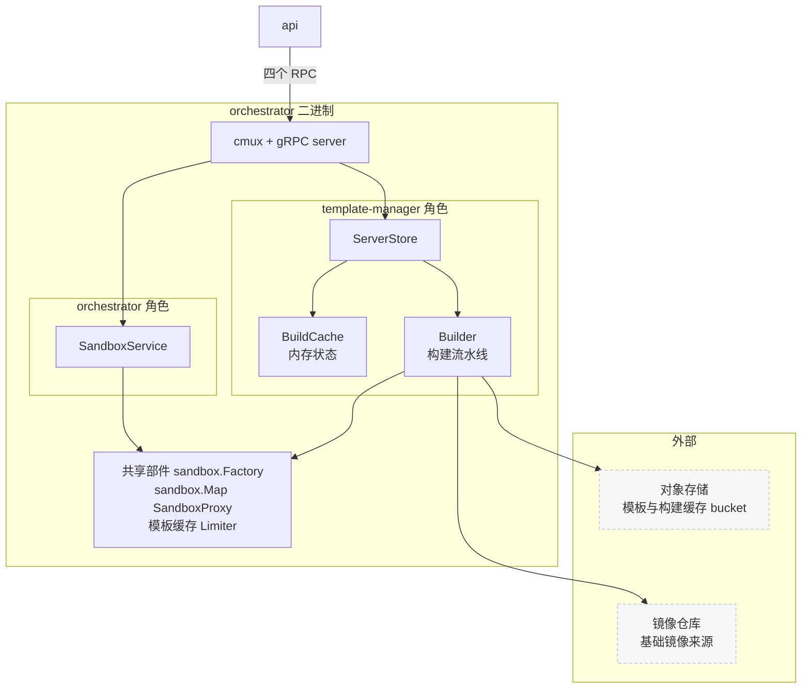
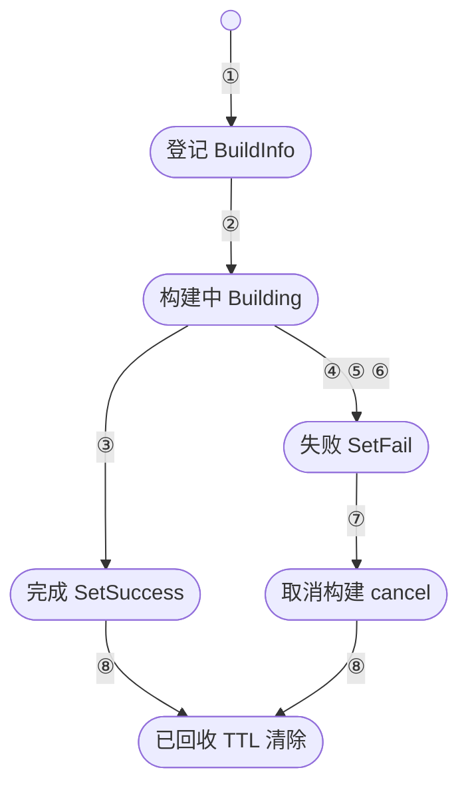

# 46 · template-manager 服务

> 构建的执行细节前面五篇已经讲完，本篇讲包住它们的那层壳：四个 gRPC 方法各自的服务端语义、
> 一次构建在进程里以什么形式存在、日志从 zap 走到用户眼前的两条路，以及
> template-manager 与 orchestrator 共用一个二进制这件事到底共用了什么。
>
> **读者**：要在 build 节点上排障、或要给构建加限流与配额的工程师。
> **预备**：[第 41 篇 · 构建总览](41-template-build-overview.md)（构建流水线做什么）、
> [第 23 篇 · API 侧的构建管理](23-template-manager-client.md)（调用方的行为）。
> **代码**：`packages/orchestrator/internal/template/server/`、`internal/template/cache/build_cache.go`、
> `internal/template/build/buildlogger/`、`builderrors/`、`buildcontext/`、`build/writer/`、
> `packages/orchestrator/template-manager.proto`、`iac/provider-gcp/nomad/jobs/template-manager.hcl`

---

## 0. 本篇要回答的问题

1. template-manager 是一个独立进程还是 orchestrator 的一部分？两种说法各在什么意义上成立？
2. 四个 gRPC 方法在服务端分别做了什么？为什么 `TemplateCreate` 立刻返回？
3. 「构建队列」在代码里对应什么数据结构？谁在限制同一台机器上的并发构建数？
4. 一次构建的状态存在哪里、活多久？构建结束之后状态什么时候消失？
5. 构建日志有内存与持久两份，分别由谁写、谁读、什么时候只剩一份？
6. `TemplateBuildDelete` 删掉了什么，没删掉什么？

---

## 1. 一个二进制，两个角色

template-manager 没有自己的 `main`。`packages/orchestrator/main.go` 里，
它是这个二进制可以承担的两个角色之一：`internal/cfg/service.go` 定义了 `ServiceType`
只有 `orchestrator` 与 `template-manager` 两个合法值，`GetServices()` 解析环境变量
`ORCHESTRATOR_SERVICES`（逗号分隔）得到本进程要启动的角色列表。
`main.go` 的 `run()` 里只有一处判断：`slices.Contains(services, cfg.TemplateManager)`
为真时才调 `tmplserver.New()` 并把它注册进已有的 gRPC server
（`templatemanager.RegisterTemplateServiceServer`）。

所以「template-manager 是不是独立进程」取决于部署，不取决于代码。上游 2026.09 在 GCP 上
把它部署成独立进程：`iac/provider-gcp/nomad/main.tf` 给 template-manager job 传的
`orchestrator_services` 就是字符串 `"template-manager"`，也就是这个进程**不**承担
orchestrator 角色，不接受沙箱创建请求。反过来，`ORCHESTRATOR_SERVICES` 写成
`orchestrator,template-manager` 时两个角色在同一进程里，共用同一个监听端口——
gRPC 与 HTTP 在 `GRPC_PORT` 上由 cmux 复用（[第 25 篇 §5](25-orchestrator-process.md#5-一个端口上的三种协议)）。

角色列表还有一个对外可见的后果：`internal/service/info.go` 的 `serviceRolesMapper`
把 `cfg.TemplateManager` 映射成 `ServiceInfoRole_TemplateBuilder`，随
`ServiceInfo` 上报，api 靠这个字段筛选 build 节点。

### 1.1 同进程时共享什么

`tmplserver.New()` 的参数列表说明了共享的边界。传进去的是 orchestrator 已经建好的部件：

| 传入的部件 | 用途 | 共享的后果 |
|---|---|---|
| `sandbox.Factory` | 起构建期沙箱 | 与运行期沙箱共用 network pool、device pool、cgroup 管理 |
| `sandbox.Map` | 登记在跑的沙箱 | 构建期沙箱对 orchestrator proxy 可见 |
| `proxy.SandboxProxy` | 访问沙箱内的 envd | 构建期命令走和运行期同一条通道 |
| `sbxtemplate.Cache` | 本地模板缓存 | 基于模板构建时能命中已有的本地副本 |
| `storage.StorageProvider`（template） | 模板产物读写 | 与 orchestrator 用同一个 bucket 与同一份客户端 |
| `limit.Limiter` | 对象存储上传并发信号量 | 构建的上传与沙箱的上传抢同一个额度 |
| `featureflags.Client`、`metric.MeterProvider` | 开关与指标 | 同一份连接 |

`New()` 自己创建的只有四样：镜像仓库客户端（`artifactsregistry.GetArtifactsRegistryProvider`）、
Docker Hub 远端仓库（`dockerhub.GetRemoteRepository`）、构建缓存存储
（`storage.GetBuildCacheStorageProvider`，指向另一个 bucket `BUILD_CACHE_BUCKET_NAME`）、
以及本篇的主角 `cache.NewBuildCache`。这四样构建独有，orchestrator 用不到。

`sandbox.Map` 的共享值得单独说。构建期沙箱在
`internal/template/build/layer/layer_executor.go` 与 `phases/base/provision.go` 里
用 `sandboxes.Insert(sbx)` 登记、`defer sandboxes.Remove(...)` 摘除，与运行期沙箱同一张表。
收益是 proxy、hyperloop、host stats 这些按沙箱 ID 查表的部件不必区分两类沙箱；
代价是节点上报的沙箱数把构建期沙箱也算了进去。

一处**不**共享的是崩溃锁：`main.go` 里的 `OrchestratorLockPath` 检查带了
`slices.Contains(services, cfg.Orchestrator)` 条件，只有 orchestrator 角色才写锁文件。
纯 build 节点重启不会因为上次没干净退出而拒绝启动——构建可以重来，
而 orchestrator 非正常重启意味着有沙箱失联，需要人介入。



---

## 2. 四个 RPC 的服务端语义

`packages/orchestrator/template-manager.proto` 的 `TemplateService` 只有四个方法，
全是一元调用，没有流。调用方的行为在[第 23 篇](23-template-manager-client.md)，这里只讲服务端。

### 2.1 TemplateCreate：受理，然后立刻返回

`create_template.go` 的 `TemplateCreate()` 是一个「登记 + 起协程」的函数，主体只有三步。

**第一步是翻译。** 把 proto 的 `TemplateConfig` 拷进
`internal/template/build/config.TemplateConfig`。两处不是直接拷贝：
`cacheScope` 在请求没给时默认取 `templateID`；`version` 在请求没给时按来源猜——
`fromImage` 与 `fromTemplate` 都为空就当 `TemplateV1Version`，否则当
`TemplateV2BetaVersion`，代码里的 TODO 说明这是 api 尚未统一发送版本时的临时处理。
镜像仓库凭证经 `core/oci/auth.NewAuthProvider()` 变成一个 provider 对象，
之后构建流程只认这个接口。

**第二步是登记。** `s.buildCache.Create(teamID, buildID, logs)` 在内存里建一条记录。
这一步同时是幂等性闸门：`Create()` 内部用 `GetOrSet`，键已存在就返回
`build %s already exists in cache` 错误，于是重复的 `TemplateCreate` 会被拒绝，
而不是起第二个构建协程去写同一批产物。

**第三步是起协程**，然后 `return nil, nil`——返回一个空的 `Empty`。
协程的 context 用 `context.WithoutCancel(ctx)` 从 RPC 的生命周期上摘下来，
否则 handler 一返回构建就被取消了。协程内部再包一层 `context.WithCancel`，
这个 cancel 是后面取消机制的抓手。

协程里还挂了两个 defer 与一个监听协程：

- `recover()`：构建协程 panic 时，上报一条 critical error，并用
  `builderrors.UnwrapUserError(nil)` 把状态置成失败。传 `nil` 意味着拿不到用户可读的原因，
  于是走 `InternalErrorMessage` 分支，用户看到的是「内部错误，请带上 build ID 联系支持」。
- 结果处理：`s.builder.Build()` 返回后，成功则 `SetSuccess`，带上
  `RootfsSizeKey` 与 `EnvdVersionKey`；失败则先 `builderrors.UnwrapUserError(err)`
  ——它用 `phases.UnwrapPhaseBuildError` 判断，能剥出阶段错误的把阶段名放进 `reason.step`
  并原样透出错误文本，剥不出的一律换成 `InternalErrorMessage`。这道门不让内部实现细节
  （路径、bucket 名、Go 错误链）出现在用户日志里；代价是用户报的错误文本没有信息量，
  只能靠 build ID 回查。
- 监听协程：`select` 在 `ctx.Done()` 与 `buildInfo.Result.Done` 之间。后者被触发且结果是
  `Failed` 时调 `cancel()`。这就是「外部把构建标记成失败」能真正停下构建的机制，
  第 6 节展开。

注意这里的对称性：`Build()` 内部也会在失败时调 `SetFail`，外部取消也调 `SetFail`。
两者不冲突，因为 `BuildInfo.Result` 是一个 `utils.SetOnce`，第二次 `SetValue` 返回
`ErrAlreadySet` 并被丢弃（`_ =`）。先到者定义最终状态。

### 2.2 TemplateBuildStatus：状态与日志一起返回

`template_status.go` 的实现是纯读：从 `buildCache` 取出 `BuildInfo`，
取不到就返回 `error while getting build info, maybe already expired`。
取到之后先复制一份日志切片（`BuildInfo.GetLogs()` 返回浅拷贝，避免持锁遍历），
按 `direction` 稳定排序，再顺序过滤 level、时间窗、`offset` 与 `limit`。
`limit` 上限 `maxLogEntriesPerRequest` 是 100，时间窗默认最近 24 小时（`defaultTimeRange`）。

状态部分只有三行：`buildInfo.GetResult()` 为 `nil` 即返回 `Building`，
否则原样返回 `SetSuccess` / `SetFail` 存进去的 `Status`、`Reason`、`Metadata`。
「还没有结果」和「正在构建」在这里是同一件事——服务端不区分「已受理未开始」与「构建中」。

### 2.3 TemplateBuildDelete：取消与删产物合一

`delete_template.go` 的 `TemplateBuildDelete()` 要求 `templateID` 与 `buildID` 都非空，
然后做两件事：若该 build 还在 `buildCache` 里且 `IsRunning()`，
调 `SetFail(ErrCanceled)`；接着调 `internal/template/template.Delete()` 删产物。
两件事之间没有等待也没有条件，即使 build 已经完成，产物照删。语义在第 6 节展开。

方法体开头有一对 `s.wg.Add(1)` / `defer s.wg.Done()`，让删除也被计入「未完成的工作」，
进程关停时会等它做完——中断它会留下删了一半的产物目录。

### 2.4 InitLayerFileUpload：一次带副作用的查询

`upload_layer_files_template.go` 的实现是三次存储调用：
用 `paths.GetLayerFilesCachePath(cacheScope, hash)` 算出对象路径（形如
`<cacheScope>/files/<hash>.tar`），`OpenBlob` 拿到该对象的句柄，
`UploadSignedURL` 拿一个有效期 30 分钟的签名上传 URL（`signedUrlExpiration`），
再 `Exists()` 查对象在不在。`cacheScope` 在请求没给时同样默认取 `templateID`，
与 `TemplateCreate` 的回退规则一致——两处必须一致，否则上传落的 scope 与 COPY 找的 scope 会分家
（[第 45 篇 §5](45-layers-and-build-cache.md#5-两个桶一个-scope)）。

`present` 的语义要说清楚，因为它决定了客户端要不要传一份可能几百 MiB 的 tar 包：

- 它是 `Exists()` 的返回值，**只是一次时点观察**，不加锁、不占位，
  也不保证在客户端读到它的那一刻仍然成立。
- `url` 与 `present` **都会填**，即使 `present` 为真也照给签名 URL。
  服务端不替客户端做决定，只把两件事实一起交出去：这个对象在不在、以及要传的话往哪传。
  api 侧 `handlers/template_layer_files_upload.go` 把两个字段原样转成
  `TemplateBuildFileUpload` 响应，不做任何解释。
- 因此「`present` 为真但客户端仍然上传一遍」是安全的：路径由 `hash` 决定，
  重复上传写的是同一个对象；代价只是白花一次带宽。
  反过来「`present` 为真于是跳过上传」也是安全的，因为对象路径是内容寻址的
  ——**前提是那个 hash 真的是内容的哈希**，而这一点服务端从不校验
  （[第 45 篇 §5](45-layers-and-build-cache.md#5-两个桶一个-scope) 末尾的信任假设）。
- 三次调用里任何一次出错都直接返回 error，没有降级路径。
  特别是 `UploadSignedURL` 在不支持签名 URL 的 provider 上恒失败，
  于是「查一下在不在」也跟着失败——这在单机离线版上是一个真实故障（§8）。

这个方法与其它三个不同：它完全不碰 `buildCache`，不需要本机上有任何构建在跑。
它放在 template-manager 上只是因为 build 节点手里有构建缓存 bucket 的凭证，
于是 api 挑任意一个健康 builder 来问都行（`GetAvailableBuildClient()`），
答案与真正执行构建的节点无关。

---

## 3. 「构建队列」是一个 WaitGroup

`ServerStore` 里与并发有关的字段只有两个：`wg *sync.WaitGroup` 和
`activeBuilds atomic.Int64`，后者的注释直说是「for debugging」。
`Wait()` 打印的日志是 `Template build queue cleaned`。也就是说，
代码里的「队列」是一个计数器，不是队列：**没有排队，没有上限，没有准入控制**。
`TemplateCreate` 一到就起协程，来十个就并发跑十个。

那么谁在限制并发？三道约束都在服务之外：

1. **Nomad 层面的一机一实例。** `template-manager.hcl` 的 group 上有
   `constraint { operator = "distinct_hosts" }`，一台机器最多一个 template-manager
   allocation。注释还说明了为什么用 `static` 端口：api 与 edge 靠 Nomad 服务发现
   找到这个 job 并注册（[第 21 篇 §4](21-clusters-and-discovery.md#4-三种发现来源)）。
2. **实例数跟着节点数走。** job 的 `scaling` 块用 `nomad-nodepool-apm` 插件，
   把「build 节点池里的节点数」直接当成期望实例数；配合 `distinct_hosts`，
   效果等价于一个 system job
   （[第 64 篇 §5](64-nomad-jobs.md#5-构建节点template-manager-与-clean-nfs-cache)）。
3. **api 侧的分发。** 一次构建落在哪台 builder 上由 api 随机挑选
   （[第 23 篇 §2](23-template-manager-client.md#2-选一个-build-节点)）。随机分发在期望上均摊负载，
   但不看目标机器当前有几个构建在跑。

结论是：**同一台 build 节点上的并发构建数没有硬上限，只有软约束**。
真正会先撑不住的是节点资源——每个构建都要起 Firecracker 沙箱，占网络槽位、
NBD 设备与大页内存。这些池子耗尽时构建会失败，而不是排队。推论：这是有意的简化，
代价是负载尖峰下失败率上升而非延迟上升，收益是服务端不必维护队列状态，
任何一台 builder 挂掉都不会丢排队中的请求——因为根本没有排队中的请求。

job 里的 `resources { memory = 1024, cpu = 256 }` 不构成限制：raw_exec 驱动下
这两个值只用于 Nomad 的调度记账，构建期沙箱的内存来自宿主，不受此约束。

---

## 4. 状态存在哪里，活多久

服务端对一次构建的全部记忆是 `internal/template/cache/build_cache.go` 里的一条
`BuildInfo`，字段只有三个：`TeamID`、一个日志缓冲 `logs`、一个
`Result *utils.SetOnce[BuildInfoResult]`。`BuildInfoResult` 就是
`TemplateBuildStatus` 要返回的三元组：状态、原因、元数据。

存放它的是一个 `ttlcache.Cache[string, *BuildInfo]`，键是 build ID，
TTL 是 `buildInfoExpiration = 10 分钟`，`NewBuildCache()` 里 `go cache.Start()`
起后台清理协程。

十分钟这个值容易引起误解。ttlcache 默认在每次 `Get` 时刷新过期时间，
而 `BuildCache.Get()` 调的是不带选项的 `cache.Get(buildID)`，
所以 **TTL 是滑动的**：只要有人在轮询，记录就不会过期。api 的轮询间隔是 1 秒，
远小于 10 分钟，因此一个跑两小时的构建同样能被查到状态。
`Create()` 里传的 `ttlcache.WithDisableTouchOnHit` 并不改变这一点——
在 ttlcache v3 里这个选项是调用级而非条目级的，只影响 `GetOrSet` 内部那次查找，
不会记在条目上。推论：本意大概是让 TTL 从创建时刻起算，实际效果是滑动窗口；
差别只在「构建结束后多久回收」上体现，对在跑的构建无影响。

十分钟真正起作用的是**结束之后**：api 拿到终态就停止轮询，10 分钟后条目连同日志缓冲一起被清掉，
再查就得到 `maybe already expired`。这是内存有界的唯一保证——`LogEntryLogger`
只增不减，构建期间日志缓冲会一直涨。

`BuildCache` 还导出了一个 `Delete(buildID)`，但全仓库没有调用者。
推论：它是早期显式清理逻辑的残留，现在回收完全交给 TTL。

构建数指标也挂在这个缓存上：`NewBuildCache()` 注册了一个 observable up-down counter，
每次采集遍历全部条目，按 `TeamID` 分组统计 `IsRunning()` 为真的条数，
并且对出现过的团队即使计数为 0 也上报一次，好让上一次的非零值被冲掉。



| 编号 | 触发 | 动作 |
|---|---|---|
| ① | `TemplateCreate` 受理 | 写入 `BuildCache` |
| ② | 构建协程启动 | 状态置构建中 |
| ③ | `Build` 返回成功 | `SetSuccess` |
| ④ | `Build` 返回错误 | `SetFail` |
| ⑤ | 协程 panic 被 recover | `SetFail` |
| ⑥ | `TemplateBuildDelete` | 置 `ErrCanceled` |
| ⑦ | 监听协程调 cancel | 中断构建 context |
| ⑧ | TTL 到期 | 条目连同日志缓冲清除 |

图里「失败」是一个终态：`SetOnce` 保证它不会再变。被外部置失败之后构建协程仍在跑，
要等它自己从取消的 context 里退出来，`wg` 才会减一。

---

## 5. 日志的两条路

用户能看到的构建日志和运维能看到的服务日志是同一批 zap 条目，
在 `TemplateCreate` 里被分成两路：

```go
encoder := zapcore.NewJSONEncoder(zap.NewProductionEncoderConfig())
bufferCore := zapcore.NewCore(encoder, logs, zapcore.DebugLevel)
core := zapcore.NewTee(bufferCore, s.buildLogger.Detach(ctx).Core().
    With([]zap.Field{ /* envID, buildID */ }))
```

`zapcore.NewTee` 把每条日志同时写进两个 core。

**第一路是内存缓冲。** `logs` 是 `buildlogger.NewLogEntryLogger()`，
它实现 `io.Writer`：`Write()` 按 `\n` 切行，每行用 `logs.FlatJsonLogLineParser`
解析成 `map[string]string` 当作 `fields`，再单独取出 `ts`、`msg`、`level` 三个字段
（`ZapEntry`）并从 fields 里删掉，拼成一条 `TemplateBuildLogEntry` 追加进切片。
解析失败的行被记录错误并**丢弃**——代价是非 JSON 的输出（例如某个库直接写 stderr）
不会出现在用户日志里，收益是缓冲里的每条都带结构化字段，能按 level 与时间过滤。

**第二路是持久日志。** `buildLogger` 是 `main.go` 里建的 `tmplSbxLoggerExternal`：
`sbxlogger.NewLogger()` 配 `ServiceName: constants.ServiceNameTemplate`、`IsInternal: false`、
`CollectorAddress: env.LogsCollectorAddress()`，用 `logger.NewHTTPWriter` 把 JSON
推给 logs-collector，最终落进 Loki；`IsInternal` 为假同时禁用了堆栈。
`.With(envID, buildID)` 两个字段是后续按 build 检索的依据。

两路的分工由生命周期决定：内存那份最新、可按 offset 分页，但只活到 TTL 到期或进程重启；
持久那份有延迟，但构建结束几天后仍在。api 的取数顺序正是先内存后持久
（[第 23 篇 §6](23-template-manager-client.md#6-日志)）。

### 5.1 writer 包：两个让日志能读的小工具

`internal/template/build/writer/` 只有两个文件，都服务于「用户日志的可读性」。

`filtered_writer.go` 的 `PrefixFilteredWriter` 做前缀过滤：按行切分，
只放行以 `PrefixFilter` 开头的行，并把前缀去掉。唯一的使用点在
`phases/base/provision.go`，前缀值是那里的 `provisionLogPrefix = "[external] "`。
回顾：provisioning 阶段的串口上混着内核消息、busybox 消息与脚本输出，
guest 侧用一个 `sed` 给脚本输出打上这个前缀，宿主侧再用这个 writer 把带标的行挑出来
（[第 43 篇 §6](43-rootfs-construction.md#6-用-busybox-当一次性-init)）。

`postprocessor.go` 的 `NewPostProcessor` 解决另一个问题：某些阶段几十秒不产生日志，
客户端无从判断是卡住还是在干活。它用 `zapcore.RegisterHooks` 挂钩，每写一条日志重置
ticker，ticker 触发时输出一条 `...`，间隔是 `builder.go` 的 `progressDelay = 5 秒`。
它只在 `isV1Build` 为真时启用——v2 的阶段流水线本身逐阶段汇报进度
（[第 42 篇 §6](42-build-phases.md#6-日志与进度回报)）。
代价是日志里多出无信息量的行，收益是「静默」与「卡死」可区分。

### 5.2 buildcontext 与 builderrors

另外两个小包顺带说明。`buildcontext/context.go` 只定义了结构体 `BuildContext`，
把一次构建的不变量打成一包（`BuilderConfig`、`TemplateConfig`、`TemplateFiles`、
`UploadErrGroup`、`EnvdVersion`、`CacheScope`、`IsV1Build`、`Version`），
在 `Builder.Build()` 里组装一次，逐层传给所有阶段。`UploadErrGroup` 放在这里是关键：
各阶段把异步上传任务加进同一个 errgroup，`Build()` 用一个 defer 等它们全部结束
——**构建失败时也等**，否则半途取消会留下写了一半的对象。

`builderrors/errors.go` 定义了用户错误与内部错误的边界，`UnwrapUserError` 见 §2.1。
还有一个 `WrapContextAsUserError`：`Build()` 的 defer 里若 `ctx.Err()` 非空，
就把 `context.Canceled` 包成 `ErrCanceled`、`context.DeadlineExceeded` 包成 `ErrTimeout`，
两者都算用户错误。动机写在注释里——让用户主动取消的构建不污染内部错误率。

值得指出的是，服务端没有给整个构建设任何超时：
`internal/template/build/` 里只有 finalize 阶段的配置脚本与 ready 命令带
`context.WithTimeout`。`ErrTimeout` 因此只在这些局部超时或调用方取消时出现。

一次构建能跑多久，实际由 api 决定，而这里有一处语义落差值得单独记住。
`packages/api/internal/template-manager/template_status.go` 里 `buildTimeout = time.Hour`，
`PollBuildStatus.poll()` 每秒查一次 `TemplateBuildStatus`；轮询 context 到期时，
它做的**只有一件事**：调 `SetStatus()` 把 Postgres 里的构建状态置成 failed，
理由写成 `build status polling timed out. Maximum build time is 1h0m0s.`，然后 `return`。
这条路径不发 `TemplateBuildDelete`，也不发任何别的 RPC——
全仓库对 `DeleteBuild()` 的调用只有两处，管理员取消团队构建与旧版启动构建时作废未开始的构建
（[第 23 篇 §7](23-template-manager-client.md#7-取消的三种含义)），都不在超时路径上。

于是超过一小时之后：用户看到构建失败，数据库里是失败，而 build 节点上的构建协程仍在跑，
一直跑到自己结束。它占着网络槽位、NBD 设备与内存，关停时 `Wait()` 仍会等它；
结束时写下的产物与索引条目也照样有效，下一次同链构建甚至可能命中它留下的层。
这不是资源泄漏——协程终会结束——而是一段没有任何一方在等结果的计算。
要真正停下它，只能走 `TemplateBuildDelete`（§2.3）。

---

## 6. 删除的语义

`template.Delete()`（`internal/template/template/main.go`）只做两件事：

```go
templateStorage.DeleteObjectsWithPrefix(ctx, buildId)
artifactRegistry.Delete(childCtx, templateId, buildId)
```

第一句删模板 bucket 里以 build ID 为前缀的全部对象。这能成立是因为一个 build 的六个对象
都以 build ID 作目录（[第 29 篇 §2](29-template-artifact-format.md#2-一代产物六个对象)），
build ID 是产物的唯一身份。第二句删镜像仓库里对应的中间镜像；
镜像不存在（`ErrImageNotExists`）时视为成功，因为暂停沙箱产生的 build 本来就没有镜像。

没有删掉的东西有三类，都值得记住：

- **构建缓存 bucket 里的层文件不删。** 它们的路径以 `cacheScope` 而非 build ID 组织
  （`paths.GetLayerFilesCachePath`），跨 build 共享，删了会伤及别的构建。
  这批对象的回收依赖对象存储的生命周期策略，不在代码里。
- **各节点本地模板缓存里的副本不删。** `template.Delete` 只碰远端存储。
  第 23 篇提到的那段回退逻辑——找不到原节点时借任意 builder 执行删除——
  就是被这一点限制住的：产物删了，缓存副本还在
  （[第 34 篇 §3](34-template-cache-and-local-storage.md#3-节点本地目录谁建谁删)）。
- **`buildCache` 里的条目不删。** `TemplateBuildDelete` 只把它置成失败，
  条目本身等 TTL 回收。好处是紧接着的一次 `TemplateBuildStatus` 仍能查到
  「已取消」这个结论，而不是得到「不存在」。

还有一个方向上的不对称：构建**自己**失败时，`Builder.Build()` 的 defer 会调
`templateStorage.DeleteObjectsWithPrefix(template.BuildID)` 清掉自己写的产物，
用的是 `context.WithoutCancel(ctx)`，所以取消也照清。
也就是说失败构建的产物有两处清理点，服务端一处、调用方一处，两者都是按 build ID 前缀删，
重复执行无害。

---

## 7. 关停：为什么可以等一个小时

构建可能跑几十分钟，而部署要滚动更新，这两件事在关停路径上碰头。
`main.go` 的关停顺序是：收到 SIGTERM → 把 `ServiceInfo` 置为 `Draining`
并睡 15 秒等状态传播出去 → 调 `tmpl.Wait(closeCtx)` → 逆序执行 closers。

`ServerStore.Wait()` 做三件事：`s.wg.Wait()` 等所有构建协程（以及正在进行的删除）结束；
然后在非 local 环境再睡 15 秒，日志写的是「等消费方来查构建状态」——
让 api 最后一次轮询能拿到终态，而不是拿到连接被关；最后打印
`Template build queue cleaned`。

`Wait()` 与 `Close()` 都先 `select` 一下 `ctx.Done()`，已取消就立刻返回
`force exit, not waiting for builds to finish`；这个 context 由 `config.ForceStop`
（环境变量 `FORCE_STOP`）控制，为真时 `closeCtx` 一建好就被取消。

Nomad 那边配套的是 `kill_timeout = "70m"`：从发出 `kill_signal = "SIGTERM"`
到强制 SIGKILL 之间留 70 分钟，够跑完一次在途构建（job 注释指出这需要 Nomad 客户端的
`max_kill_timeout` 放开）。`update` 块里 `progress_deadline = "80m"` 必须大于它，
`max_parallel = 1` 保证同一时刻只有一台 builder 在滚动。
同一个模板的另一条分支（`update_stanza` 为假、不带 scaling 与 update）则是
`kill_timeout = "1m"` 加 `FORCE_STOP = "true"`。两条分支的差别就是「优雅」值多少钱：
70 分钟的滚动更新窗口，换在途构建不被打断。

---

## 8. ARM 适配版的差异

服务端 Go 代码本身没有改动，变的全是 job 文件与环境。
`iac/provider-gcp/nomad/jobs/template-manager.hcl` 里 Terraform 的模板变量
（`${node_pool}`、`${current_count}`、`${port}`）换成了部署脚本用 `envsubst` 渲染的大写变量，
`count`、`scaling` 与 `update` 三个块被整体删掉——单机部署里节点只有一个，
跟随节点池伸缩无从谈起；`kill_timeout` 也随之消失，回落到 Nomad 默认值，
在途构建在重启时会被很快杀掉（第 7 节那 70 分钟的余地在这里不存在）。
二进制从 GCS artifact 改为 RPM 装好的 `/usr/bin/template-manager`，
`ORCHESTRATOR_SERVICES` 固定为 `template-manager`，
`ARTIFACTS_REGISTRY_PROVIDER` 设为 `Local`——这个分支下 `TemplateBuildDelete`
只删对象存储，不动镜像，因为 `packages/shared/pkg/artifacts-registry/registry_local.go` 的
`LocalArtifactsRegistry.Delete()` 是一个直接 `return nil` 的空实现，注释写着「本地镜像可以手工删」。
需要说明的是这段空实现是**上游 2026.09 的代码**，不是 ARM 补丁加的；
ARM 适配版做的只是把 provider 切到 `Local`，从而第一次让这条空路径成为默认路径
（[第 86 篇 §4.5](86-known-issues-and-debt.md#45-localartifactsregistrydelete-是空实现)）。
存储换成 MinIO；但单机离线版的这份 job 把 `STORAGE_PROVIDER` 硬编码成 `Local`，
而 `fsStorage.UploadSignedURL()` 不支持签名 URL，于是 `InitLayerFileUpload`
在那种形态下必然失败（[第 75 篇 §6](75-minio-storage.md#6-三种部署形态各用哪个-provider)）。
构建流程的 ARM 改动集中在 rootfs 与 provisioning
（[第 74 篇 §4](74-template-build-on-arm.md#4-openeuler-guestprovisionsh)），
部署形态见[第 80 篇 §7](80-single-node-rpm.md#7-一个进程两个角色)。

---

## 9. 小结

- template-manager 与 orchestrator 是同一个二进制的两个角色，由 `ORCHESTRATOR_SERVICES`
  选择；上游 GCP 部署把它单独跑在 build 节点池上，代码本身不要求这样。
- 同进程时共享 sandbox factory、sandbox map、proxy、模板缓存、上传限流器与遥测；
  独有镜像仓库客户端、构建缓存存储与 `BuildCache`。崩溃锁只属于 orchestrator 角色。
- 四个 RPC 全是一元调用。`TemplateCreate` 只受理不等待，`TemplateBuildStatus`
  同时返回状态与分页日志，`TemplateBuildDelete` 同时是取消与删产物，
  `InitLayerFileUpload` 与本机构建无关，任何 builder 都能回答。
- 「构建队列」是一个 `sync.WaitGroup`。服务端没有并发上限与准入控制，
  并发实际由节点资源、Nomad 的 `distinct_hosts` 与 api 的随机分发共同约束，
  资源耗尽表现为失败而非排队。
- 一次构建的服务端状态是 `BuildInfo`，结果字段是 `SetOnce`，先写者定终态；
  条目存在 10 分钟 TTL 的 ttlcache 里，TTL 实际随每次查询滑动，
  所以长构建不会中途失联，而结束后约 10 分钟被回收。
- 日志用 `zapcore.NewTee` 分两路：`LogEntryLogger` 的内存缓冲供分页查询，
  外部 sandbox logger 推给 logs-collector 落 Loki 供事后检索。
  非 JSON 的行在内存那一路被丢弃。
- 删除只覆盖模板 bucket 中以 build ID 为前缀的对象与镜像仓库中的镜像；
  层缓存、节点本地副本与内存条目都不动。
- 服务端不给构建设总超时。api 的 1 小时轮询上限到点只写数据库状态、不发取消 RPC，
  于是超时之后服务端的构建照跑，形成一段无人等待结果的计算。
- 关停时靠 `Wait()` 加 Nomad 的 70 分钟 `kill_timeout` 给在途构建留出跑完的余地，
  `FORCE_STOP` 则放弃这份余地。

## 延伸阅读 / 下一篇

- [第 23 篇 · API 侧的构建管理](23-template-manager-client.md)：同样四个 RPC 的调用方视角，
  以及 Postgres 里的构建状态机。
- [第 41 篇 · 构建总览](41-template-build-overview.md)、
  [第 42 篇 · 阶段流水线](42-build-phases.md)：`Builder.Build()` 里发生的事。
- [第 47 篇 §3](47-orchestrator-dev-tools.md#3-create-build造一个-build)：不经过 gRPC 直接跑一次构建的方法。
- [第 64 篇 §5](64-nomad-jobs.md#5-构建节点template-manager-与-clean-nfs-cache)：template-manager job 与其它 job 的对照。
- [第 60 篇 §4](60-telemetry.md#4-采集器与落点)：logs-collector 与 Loki 这一段。
