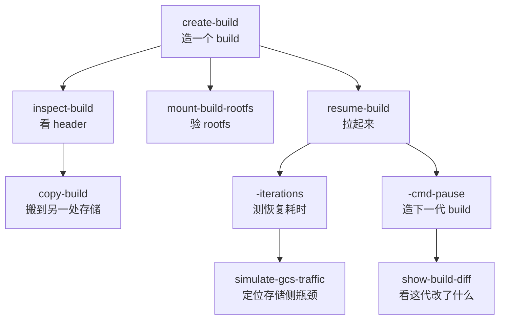

# 47 · 本地开发工具（cmd/）

> orchestrator 仓库里 `packages/orchestrator/cmd/` 下有十个独立的可执行程序。它们让一个人在一台机器上
> 造出模板、拉起沙箱、拆开产物、压测存储，而不需要 API、数据库、Nomad 与 edge。本篇讲每个工具做什么、
> 走的是不是生产代码路径、以及在排障与性能测量中怎么用它们。
>
> **读者**：工程师、运维。　**预备**：[第 27 篇 · ResumeSandbox](27-resume-sandbox.md)、
> [第 29 篇 · 模板产物格式](29-template-artifact-format.md)、[第 41 篇 · 构建总览](41-template-build-overview.md)。
> **代码**：`packages/orchestrator/cmd/`（全部子目录）、`packages/orchestrator/cmd/internal/cmdutil/`、
> `packages/orchestrator/README.md`、`packages/orchestrator/Makefile`

---

## 0. 本篇要回答的问题

1. 不起整套集群，怎么在一台机器上造一个 build、把它拉起来、看它内部长什么样？
2. 这些工具是另写了一套简化实现，还是复用生产代码路径？两者的差别在哪里？
3. `resume-build -iterations` 测出来的耗时代表什么？「冷启动」是怎么模拟的？口径上有哪些坑？
4. 产物出问题（映射不合法、rootfs 损坏、层引用缺失）时，用哪个工具能定位到「哪一层的哪些块」？
5. `clean-nfs-cache` 与两个 `simulate-*-traffic` 为什么和开发工具放在一起，它们各自解决什么问题？

---

## 1. 为什么需要这一组工具

一次沙箱恢复在生产里要穿过很多层：SDK 调 API，API 查数据库、选节点，orchestrator 收 gRPC，
再从对象存储把模板拉下来、起 Firecracker、等 envd。这条链路对功能是必要的，对排障是负担 ——
想弄清「为什么这个模板恢复要 3 秒」，先得有一套集群、一个团队、一个 API key。

`cmd/` 下的程序把这条链路截断在 orchestrator 内部。它们直接调用 `internal/` 里的构建器、
`sandbox.Factory` 与 block 层，把外部依赖换成本地目录或一个对象存储桶。这样带来两件事：

- **收益**：一台装了 KVM 的开发机就能复现产物问题与耗时问题，迭代周期从「部署一遍」变成「跑一条命令」。
- **代价**：跑出来的环境和生产**不完全一样**。少了 cgroup 限额、少了宿主统计采集、
  少了并发压力（[§5.3](#53-口径与陷阱)会逐条列出）。把这些工具的数字直接当生产数字用会得到偏乐观的结论。

十个程序按用途分三类：

```text
造与跑    create-build          造一个 build（走完整构建流水线）
          resume-build          从 build 拉起沙箱；跑命令；再 pause 成新 build
          mount-build-rootfs    把 build 的 rootfs 挂到宿主目录上

看与搬    inspect-build         打印 memfile / rootfs 的 header 与数据块统计
          show-build-diff       比较两个 build 的映射，预览合并结果
          copy-build            把一个 build 连同它引用的所有层搬到另一处存储

压与清    hammer-file           单个对象的顺序 / 并发 range read 对比
          simulate-gcs-traffic  按参数矩阵压 GCS，输出 CSV
          simulate-nfs-traffic  按参数矩阵压 NFS 挂载点，附 nfsstat 差值
          clean-nfs-cache       按 LRU 清理 NFS 缓存盘（唯一会上生产的）
```

另外 `cmd/smoketest/` 不是可执行程序而是一个测试包，见 [§9](#9-smoketest建一次跑一次)。

---

## 2. 环境自举：local mode 做了什么

生产 orchestrator 的路径与后端全部来自环境变量（[第 14 篇 §1](14-config-flags-versions.md#1-配置的四条渠道)）。
开发工具不另起一套配置，而是**在进程启动时把环境变量填好**，再让 `cfg.Parse()` 照常读。
这就是 `-storage` 这个参数的全部含义。

`cmd/internal/cmdutil/storage.go` 的 `SetupStorage()` 是最小版本：路径以 `gs://` 或 `gs:` 开头就设
`STORAGE_PROVIDER=GCPBucket` 与 `TEMPLATE_BUCKET_NAME`，否则设 `STORAGE_PROVIDER=Local` 与
`LOCAL_TEMPLATE_STORAGE_BASE_PATH={storage}/templates`。`inspect-build`、`show-build-diff`、
`mount-build-rootfs` 用的都是它。

`create-build` 与 `resume-build` 各有一个更完整的 `setupEnv()`（分别在两个 `main.go` 里），
它们还要建目录、准备内核与 Firecracker 二进制：

| 环境变量 | local mode 的值 | 生产的值 |
|---|---|---|
| `ORCHESTRATOR_BASE_PATH` | `{storage}/orchestrator` | `/orchestrator` |
| `SANDBOX_DIR` | `{storage}/sandbox` | `/fc-vm` |
| `SNAPSHOT_CACHE_DIR` | `{storage}/snapshot-cache` | `/mnt/snapshot-cache` |
| `HOST_KERNELS_DIR` | `{storage}/kernels` | `/fc-kernels` |
| `FIRECRACKER_VERSIONS_DIR` | `{storage}/fc-versions` | `/fc-versions` |

两个 `setupEnv()` 都用 `if os.Getenv(k) == ""` 判断后才写，所以**外部已设的变量优先**；
想把快照缓存放到另一块 NVMe 上，直接在命令前面加 `SNAPSHOT_CACHE_DIR=...` 即可。
`resume-build` 还会设 `HOST_ENVD_PATH={storage}/envd/envd` 与 `USE_LOCAL_NAMESPACE_STORAGE=true`
（后者让网络槽位的分配状态存在本地而不是共享存储，见[第 35 篇 §1](35-sandbox-networking.md#1-槽位号的分配两种存储一条不变量)）。

`create-build` 的 `setupKernel()` 与 `setupFC()` 会在 local mode 下检查
`{storage}/kernels/{version}/vmlinux.bin` 与 `{storage}/fc-versions/{version}/firecracker`，
不存在就分别从 `storage.googleapis.com/e2b-prod-public-builds/kernels/` 与
`github.com/e2b-dev/fc-versions` 的 release 下载。这是唯一会自动联网取二进制的地方。

三个宿主前提在 `README.md` 里写得很清楚，缺一个就会失败：`modprobe nbd nbds_max=4096`
（外加一条 udev 规则关掉对 NBD 设备的 inotify 监听）、预分配足够的 2 MiB 大页、以及以 root 运行。
`resume-build` 直接用 `os.Geteuid() != 0` 拦截，`create-build` 只在 local mode 下拦截。

---

## 3. create-build：造一个 build

`create-build` 是 template-manager 的构建入口的一层薄壳。它自己搭出构建器需要的全部依赖 ——
沙箱代理（端口 5007）、TCP 防火墙、NBD 设备池、网络池（8/8）、两个存储 provider、
制品仓库、Docker Hub 仓库、模板缓存、`sandbox.Factory` —— 然后调
`build.NewBuilder(...)` 与 `builder.Build(ctx, storage.TemplateFiles{BuildID: buildID}, tmpl, ...)`。
这正是 `internal/template/server/` 收到 `TemplateCreate` 后走的同一个函数
（[第 46 篇 §2.1](46-template-manager-service.md#21-templatecreate受理然后立刻返回)），所以阶段流水线、
层缓存、日志格式都与生产一致。

命令行参数映射到 `config.TemplateConfig` 的字段：`-vcpu`、`-memory`、`-disk`、`-hugepages`、
`-start-cmd`、`-ready-cmd`、`-kernel`、`-firecracker`。两个细节值得注意：

- `-setup-cmd` 不是模板字段，而是被包成一个 `TemplateStep{Type: "RUN", Args: []string{cmd, "root"}}`
  塞进 `Steps`。也就是说它等价于 Dockerfile 里的一条以 root 执行的 `RUN`
  （[第 44 篇 §4](44-build-sandbox-and-commands.md#4-六类指令的实现)）。
- 给了 `-from-build` 就设 `FromTemplate`，做增量构建；不给就设 `FromImage = "e2bdev/base:latest"`。
  `Force` 恒为 `true`，即**不查层缓存直接重建**。想验证缓存命中要走 template-manager，不能用这个工具。

`doBuild()` 给整次构建套了 `context.WithTimeout(parentCtx, 5*time.Minute)`。这个上限是硬编码的，
拉大镜像或装重依赖的模板会在这里被砍掉，报错看起来像是构建失败而不是超时。

构建结束后 `printArtifactSizes()` 打印产物：对本地存储，用 `cmdutil.GetFileSizes()`
读 `stat.Blocks * 512`，即**磁盘实际占用**而不是逻辑大小 —— 差分文件是稀疏的，两者能差一个数量级；
再从 `.header` 里取总大小，打印成 `X MB diff / Y MB total (Z%)`。这个百分比是判断
「这一层到底改了多少」最快的办法。

---

## 4. resume-build：把 build 拉起来

`resume-build` 是这组工具里最长的一个，也是最重要的一个。它的核心只有一行：

```go
sbx, err := r.factory.ResumeSandbox(ctx, r.tmpl, r.sbxConfig, runtime, t0, t0.Add(24*time.Hour), nil)
```

`internal/server/sandboxes.go` 在处理 gRPC 的沙箱创建与恢复时调的是**同一个**
`Factory.ResumeSandbox()`。所以 uffd 服务、NBD 服务、网络槽位获取、Firecracker 启动、
envd 初始化这些环节，`resume-build` 一步不少地走了一遍
（[第 27 篇 §3](27-resume-sandbox.md#3-并行段三个-promise-和一个后台预取)、
[§4](27-resume-sandbox.md#4-串行段从-fcnewprocess-到-resumevm)）。
同理，pause 模式调的 `sbx.Pause()` 也是生产的那个（[第 37 篇 §2](37-pause-and-snapshot.md#2-pause-的时序)）。

差别在构造 Factory 的那一行：

```go
factory := sandbox.NewFactory(config.BuilderConfig, networkPool, devicePool, flags, nil, nil)
```

最后两个参数在生产里是 `hostStatsDelivery` 与 `cgroupManager`（`main.go` 的 `NewFactory` 调用），
这里都是 `nil`。`sandbox.go` 的 `createCgroup()` 在 `cgroupManager == nil` 时直接返回，
`hoststats.go` 的 `initializeHostStatsCollector()` 在 delivery 为 nil 时直接返回。
后果是：**没有 per-sandbox cgroup 限额，也没有宿主指标采集**
（[第 38 篇 §2](38-cgroups-and-host-stats.md#2-上游的-cgroup只记账不设限)、
[§5](38-cgroups-and-host-stats.md#5-host-stats采样与投递)）。

`sbxConfig` 里 `Vcpu` 与 `RamMB` 被硬编码成 1 与 512，`Envd.AccessToken` 是字符串 `"local"`，
`Network` 是空的 `SandboxNetworkConfig`。恢复路径下 Firecracker 的 vCPU 与内存来自快照本身，
这两个字段主要影响记账（推论：`ResumeSandbox` 内部未把它们传给 `fcHandle.Create`，
只有 `CreateSandbox` 的冷启动路径会用）。

### 4.1 四种模式

模式由参数决定，`main()` 里有一组互斥检查（三个 pause 参数只能给一个；`-cmd` 不能和 pause 参数同用；
`-signal-pause` / `-cmd-pause` 不能和 `-iterations` 同用；`-to-build` 必须配 pause 参数）。

| 模式 | 触发参数 | 做什么 | 典型用途 |
|---|---|---|---|
| 交互 | 都不给（`-iterations 0`） | 拉起后挂住，打印进沙箱的 `nsenter` + `ssh` 命令，Ctrl+C 清理 | 进沙箱手工看现场 |
| 恢复基准 | `-iterations N` | 连做 N 次「恢复 + 立即 Close」，统计耗时 | 测恢复延迟 |
| 命令 | `-cmd "..."` | 恢复后经 envd 跑一条命令，打印分段耗时；配 `-iterations` 则重复 N 次 | 测「恢复 + 首个任务」的端到端 |
| 快照 | `-pause` / `-signal-pause SIG` / `-cmd-pause "..."` | 恢复后分别是立即 / 等信号 / 跑完命令再 `Pause()`，产出一个新 build | 链式造 build；测 pause 耗时 |

交互模式与 `-signal-pause` 都会打印
`sudo nsenter --net=/var/run/netns/<ns> ssh -o StrictHostKeyChecking=no root@169.254.0.21` ——
这是从宿主进入沙箱网络命名空间的标准做法，比走 orchestrator 代理少一层。

命令怎么进沙箱：`runCommandInSandbox()` 用 `sandbox.SandboxHttpTransport` 直连
`http://<slot 的宿主 IP>:49983` 上的 envd，发 Connect-RPC 的 `Process.Start`，
命令固定包成 `/bin/bash -l -c "<cmd>"`，用户头设成 `root`，然后把 stdout / stderr 流式打印，
读到 `ProcessEvent_End` 时用退出码判定成败（[第 49 篇 §3](49-envd-process-service.md#3-一次-start-的内部时序)）。

pause 模式在快照之前会先跑 `syncAndDropCaches()`：在沙箱里执行 busybox 的 `sync`，
再 `echo 3 > /proc/sys/vm/drop_caches`。这一步把 guest 页缓存里的脏数据落盘并丢掉可回收页，
让快照小一些、也更可复现；失败只打印警告，不中止。新 build 的元数据是把原模板的
`metadata.Template` 复制一份、替换 `BuildID` 得来的，所以链式造出来的 build 继承内核与
Firecracker 版本。`-to-build` 不给时自动 `uuid.New()`。

---

## 5. 用 `-iterations` 做恢复耗时测量

### 5.1 测的是哪一段

`resumeOnce()` 的计时区间是：`t0 := time.Now()` 到 `ResumeSandbox()` 返回。
`sbx.Close()` 在计时之后执行，**不计入**。也就是说这个数字是「从模板对象到一台能响应的沙箱」的时间，
与 API 侧看到的创建延迟相比，少了 API、放置、gRPC 往返。

`-cmd` 与 `-pause` 模式分别多测一段：命令执行、`Pause()` 执行，并把 resume / command / total 或
resume / pause / total 三个数分别汇总。要定位「慢在恢复还是慢在快照」，用这两个模式而不是裸 `-iterations`。

### 5.2 冷启动是怎么模拟的

`-cold` 只在 `i > 0` 的迭代前生效，三步：

1. `r.cache.InvalidateAll()` —— 清空 orchestrator 的模板缓存与本地 build store
   （[第 34 篇 §8](34-template-cache-and-local-storage.md#8-失效不可变产物也有需要作废的时候)）；
2. `dropPageCache()` —— `unix.Sync()` 后写 `3` 到 `/proc/sys/vm/drop_caches`，丢掉宿主页缓存；
3. `r.cache.GetTemplate(ctx, buildID, false, false)` 重新加载模板。

两层缓存都清掉之后，下一次恢复必须重新从存储后端拉分片。这就是为什么 `-cold` 只在
`-storage gs://...` 下才真正有意义：本地存储的「冷」只是少了页缓存，网络往返那一项根本不存在。

`-no-prefetch` 走的是另一条路：用 `noPrefetchTemplate` 包住模板，覆盖 `Metadata()`
把 `meta.Prefetch` 置成 `nil`。恢复路径看到没有预取清单，就退化成纯按需缺页
（[第 32 篇 §3](32-memory-prefetch-and-hugepages.md#3-预取怎么跑)）。
`-cold -no-prefetch` 组合出来的是最坏情况，`-cold` 单独用是「有预取的冷启动」，
两个都不给是「热缓存」。三条数字放在一起才能说明预取值不值。

### 5.3 口径与陷阱

`printResults()` 输出 Min / Max / Avg / StdDev / P95 / P99，百分位用
`int(float64(n-1) * 0.95)` 取下标。**n 较小时 P95 与 P99 都会落到最后一两个样本上**，
n = 10 时两者都等于第 9 个样本。要让百分位有意义，迭代数至少几十次。

除此之外，还有几条把这里的数字外推到生产之前必须交代的差异：

| 维度 | `resume-build` | 生产 orchestrator |
|---|---|---|
| 并发 | 串行，一次一个沙箱 | 同节点上几十到上百个沙箱同时跑 |
| cgroup | 无（`cgroupManager` 为 nil） | 每沙箱一个 cgroup，有 CPU / 内存限额 |
| 宿主统计 | 不采集 | 周期采样并上报 |
| 网络池 | 8 预热 / 8 上限 | 由配置决定，通常大得多 |
| 特性开关 | LaunchDarkly 客户端可能连不上，取默认值 | 线上取真实值 |

按 STYLE 的要求，凡是引用这里跑出来的数字，都要同时写明机型、内核、存储后端、模板大小与
「串行、无 cgroup」这个口径。ARM 适配版的实测数据与方法在
[第 84 篇 §1.1](84-arm-performance.md#11-与-resume-build--iterations-的差别)，那里用的是另一套脚本，口径不能混。

---

## 6. 看产物：四个只读工具

这四个工具都不起沙箱，只读产物文件，因此不需要 KVM，也不都需要 root。

**`inspect-build`** 读 `<build>/memfile.header` 或 `rootfs.ext4.header`，用
`header.DeserializeBytes()` 反序列化，先跑 `header.ValidateMappings()`，不合法就在最前面打一条警告
（不退出，方便继续看内容），然后打印元数据（version、generation、build ID、base build ID、
大小、块大小、块数）、逐条映射、以及按来源 build 汇总的「映射摘要」。摘要里三个来源会被标注：
当前 build 标 `(current)`、父 build 标 `(parent)`、全零 UUID 标 `(sparse)`。
一个模板恢复慢却说不清原因时，这张摘要能直接回答「要从几代 diff 里拼这台机器的内存」
（[第 29 篇 §4](29-template-artifact-format.md#4-一次查找从偏移到某一代的文件与偏移)）。

加 `-data` 会顺带扫数据文件：按块读，用 `bytes.Count(b, []byte("\x00"))` 数零字节，
逐块打印非零字节数或 `EMPTY`，最后汇总空块 / 非空块数量。这一步在 GCS 上是逐块 range read，
块多时很慢，所以有 `-start` / `-end` 限定范围。`-template <id或alias>` 是个便利路径：
带 `E2B_API_KEY`（可选 `E2B_DOMAIN`）去 `/templates` 列表里按 template ID、alias 或全名匹配，
把 build ID 解析出来再照常读。

**`show-build-diff`** 回答「这一次 pause 到底改了什么」。它读两个 header，
先打印 base 的全部映射，再从 diff 的映射里**只挑出 `BuildId == 自身 BuildId` 的那些**
（即本代真正新增的块），最后用 `header.MergeMappings(base, onlyDiff)` 算出合并后的映射并打印。
`-visualize` 会调 `header.Visualize()` 画出 128 列的文本条带，一眼看出改动落在地址空间的哪些区域。
合并结果同样过一次 `ValidateMappings()`，失败只写 stderr —— 因为「合并后不合法」正是要查的现象本身。

**`copy-build`** 搬一个 build。难点在于一个 build 的产物不是自足的：它的 header 会引用父代乃至更早代的
数据文件。`getReferencedData()` 遍历 memfile 与 rootfs 两个 header 的映射，收集所有出现过的
build ID（去掉全零 UUID），换算成各自的数据文件路径，再加上两个 header、snapfile 与 metadata，
构成待拷贝清单。传输用外部命令：两端都是本地走 `rsync -aH --whole-file --mkpath --inplace`，
其余情况走 `gcloud storage cp`；并发上限 20；两端 CRC32C（Castagnoli）相同且非零时跳过。
注意**代码里的参数是 `-build`、`-from`、`-to`**，与 README 写的 `-from-storage` / `-to-storage` 不一致，
以代码为准。

**`mount-build-rootfs`** 把 build 的 rootfs 变成宿主上的一个目录。路径是：
`testutils.TemplateRootfs()` 拿到只读的 build 设备，`block.NewCache()` 在 `/tmp` 建一个
COW 缓存文件，`block.NewOverlay(rootfs, cache)` 叠成可写设备，`testutils.GetNBDDevice()`
把它挂成 `/dev/nbdX`，可选地 `unix.Mount(device, mountPath, "ext4", ...)`
（[第 30 篇 §4](30-block-layer.md#4-overlay两条规则)、
[第 33 篇 §2](33-nbd-and-rootfs.md#2-装配一个设备directpathmountopen)）。
所有写都进 COW 缓存，退出时删掉，**原产物不会被改**。`-verify` 会跑 `e2fsck -nfv` 与对
`/var/log/journal` 下每个目录的 `journalctl --verify`，用来判定「构建出来的 rootfs 本身是不是好的」。
`-empty` 则完全不读 build，用 `testutils.NewZeroDevice()` 造一个全零设备走同样的叠加与 NBD 路径，
用于单独验证 NBD 与 overlay 这一层。

---

## 7. 压存储：三个测量工具

模板恢复对存储后端的访问模式很特别：**大量 4 MiB 级别的随机范围读**，不是顺序流式下载
（[第 13 篇 §3](13-storage-landscape.md#3-对象存储两个桶与键布局)）。用常规的 `gsutil cp` 测出来的吞吐说明不了问题，
所以有这三个工具。

**`hammer-file`** 最简单：给一个 bucket 与 object，先顺序按 4 MiB 分块读完整个对象，
再以并发 10 重复一遍，打印每块的 mean / P50 与总时间，并把两个场景的时间线写成
`scenario1.mmd` / `scenario2.mmd` 两个 mermaid 甘特图。它用的 GCS 客户端是 gRPC 版，
带 4 条连接池、32 MiB 连接窗口、4 MiB 流窗口 —— 这组参数正是 block 层实际使用的那组，
所以它测的是「生产客户端在这个对象上的表现」。

**`simulate-gcs-traffic`** 把上面的手工对比变成参数矩阵。`experiments.go` 里是一张
`map[维度]map[取值]experiment` 的表：并发数、缓冲区复用与否、gRPC 连接池大小、
初始窗口与连接窗口、读缓冲、压缩、客户端类型（HTTP / gRPC）、分片大小、读次数、是否允许重复读，
等等。`generateScenarios()` 对这张表做笛卡尔积，逐个场景跑 `p.run()`，
结果（min / mean / P50 / P95 / P99 / max / 标准差 / 直方图）连同环境元数据写进 CSV。
表里大多数取值是注释掉的，跑之前按需打开 —— 全打开会产生成百上千个场景。
一个细节：单次读耗时低于 `implausibleTime`（4 ms）时会打印 `!!` 警告，
因为这种速度只可能是命中了本地缓存，该样本不该算进后端延迟。

**`simulate-nfs-traffic`** 是同一套骨架换到本地文件系统。它遍历给定路径，
只挑大小恰好等于 4 MiB 的文件（`expectedFileSize`，即分片大小），随机选文件做 `ReadAt`。
它的实验维度是 NFS 相关的旋钮：`readahead`（默认 128 KiB 对比 4 MiB）、`net.core.rmem_max`、
`net.ipv4.tcp_rmem`、`sunrpc.tcp_slot_table_entries`（默认 2 对比 128）、并发 8/16/32。
另外两个开关：`-drop-nfs-cache`（默认开）在每个场景前丢缓存，`-nfs-stat` 在场景前后各取一次
`/proc/net/rpc/nfs`，用 `nfsstat --list --since` 算差值，打印这一轮实际发出的 RPC 调用分布。
这条信息比延迟数字更能说明问题：readahead 调大之后 `READ` 次数是不是真的降了。
两个工具都带 `-pprof <addr>`，可以在压测中直接抓 Go 侧的 profile。

---

## 8. clean-nfs-cache：唯一会上生产的

它和其它工具放在一起，但性质不同。`packages/orchestrator/Makefile` 单独编译它
（`go build -o bin/clean-nfs-cache ./cmd/clean-nfs-cache`），`Dockerfile` 把它拷进镜像，
`Makefile` 有 `upload/clean-nfs-cache` 上传到对象存储，
`iac/provider-gcp/nomad/jobs/clean-nfs-cache.hcl` 把它注册成一个 `periodic` 的 batch job，
每小时整点跑一次、禁止重叠（[第 64 篇 §5](64-nomad-jobs.md#5-构建节点template-manager-与-clean-nfs-cache)）。

它解决的问题：NFS 缓存盘会被沙箱产物的分片填满，需要按最近访问时间淘汰
（[第 40 篇 §3](40-volumes-and-nfsproxy.md#3-为什么代理而不是直连)）。目标有三个层级，
`cleaner.Options` 的注释写明了覆盖顺序：`target-files-to-delete` 覆盖 `target-bytes-to-delete`，
后者覆盖 `disk-usage-target-percent`（默认 90）。没给前两个时，`preRun()` 先取磁盘使用情况，
算出要腾出多少字节。

内部是三组 goroutine 加一个批处理循环（`cleaner/clean.go` 的 `Clean()`）：
`Scanner` 遍历目录树产出候选，`Statter` 负责取元数据，`Deleter` 执行删除。
主循环攒够 `files-per-loop`（默认 10000）个候选后调 `splitBatch()` 按 atime 排序，
最老的 `deletions-per-loop`（默认 100）个送去删，其余**重新插回目录树**等下一轮 ——
这样内存占用与批大小成正比，而不是与目录里的文件总数成正比。

两个细节值得单独说：

- 取元数据用 `unix.Statx` 并带 `AT_STATX_DONT_SYNC`（`cleaner/stat_linux.go`）。
  在 NFS 上这个标志允许内核返回可能陈旧的属性而不回源验证，代价是 atime 可能不是最新的，
  收益是扫描百万级文件时不会打爆服务端。
- `deleteFile()` 在真正 `os.Remove` **之前再 stat 一次**，只有 atime 与候选记录的一致才删；
  不一致计入 `del_skip_changed` 跳过。这条是为了不删掉在扫描与删除之间刚被访问过的分片。

`-dry-run` 默认是 `true`，要真删必须显式 `--dry-run=false`。
另外 `CleanNFSCache` 这个特性开关（LaunchDarkly 的 JSON flag）可以在运行时覆盖并发度、
重试次数与两个目标值，覆盖发生在解析完命令行之后，也就是**开关优先于命令行**。

---

## 9. smoketest：建一次，跑一次

`cmd/smoketest/smoke_test.go` 是一个测试而不是命令。`TestSmokeAllFCVersions` 遍历
`featureflags.FirecrackerVersionMap` 里的每个 Firecracker 版本，各自：下载内核与该版本的 FC，
用 `ubuntu:22.04` 作基础镜像构建一个模板，再从它恢复一台沙箱。
前提与其它工具一样（root、Docker、envd 二进制、KVM、NBD、大页），整个测试的超时是 30 分钟。
它的价值在于「换了 Firecracker 版本还能不能跑通」这件事有个自动化答案
（[第 62 篇 §2](62-testing.md#2-单元测试的组织)）。

---

## 10. 工具 × 场景



| 场景 | 首选工具 | 关键参数 | 看什么 |
|---|---|---|---|
| 复现一次构建失败 | `create-build` | `-v`、`-setup-cmd` | 阶段日志；注意 5 分钟超时 |
| 沙箱恢复后行为异常 | `resume-build` | 无参数（交互模式） | `nsenter` 进去看现场 |
| 恢复太慢，想定位 | `resume-build` | `-iterations 50 -cold`、`-no-prefetch` | 三组数字的差 |
| 想知道 pause 有多贵 | `resume-build` | `-pause -iterations N` | resume / pause 分段 |
| 快照体积异常 | `inspect-build` | `-data -end N` | 空块比例、映射摘要 |
| 层链路可疑 | `show-build-diff` | `-visualize` | 本代映射与合并结果 |
| rootfs 疑似损坏 | `mount-build-rootfs` | `-verify` | `e2fsck` 与 journal 校验 |
| 把线上 build 拉到本地复现 | `copy-build` | `-from gs://... -to .local-build` | 引用层是否齐全 |
| 对象存储延迟可疑 | `hammer-file` / `simulate-gcs-traffic` | 并发、连接池、窗口 | P95 / P99 与直方图 |
| NFS 缓存盘慢或满 | `simulate-nfs-traffic` / `clean-nfs-cache` | `-nfs-stat`；`--dry-run=false` | RPC 计数；删除量与年龄分布 |

---

## 11. ARM 适配版的差异

ARM 补丁没有改动 `cmd/` 下的任何文件，也没有改 `packages/orchestrator/README.md`，
所以工具的行为与参数一致。变化在构建方式：`packages/orchestrator/Makefile` 的 `build` 目标
从「docker build --platform linux/amd64」改成直接 `CGO_ENABLED=1 GOOS=linux go build`，
并去掉了 `GOARCH=amd64`，因而在 aarch64 机器上直接产出本机架构的 `orchestrator` 与 `clean-nfs-cache`。
`create-build` 默认下载的内核与 Firecracker 来自上游的 x86_64 发布产物，
在 aarch64 上需要自备（推论：这两个 URL 未做架构区分）；详见
[第 69 篇 §3](69-guest-kernel-for-arm.md#3-输出命名与寻址)、[第 70 篇 §3](70-firecracker-fork.md#3-在-aarch64-上构建)
与[第 85 篇 §3](85-dev-workflow-and-packaging.md#3-两条开发线)。

---

## 12. 小结

- `cmd/` 下十个程序的共同做法是**在进程内把环境变量填好，再复用 `internal/` 的生产代码**，
  而不是另写一套简化实现。`-storage` 参数的全部作用就是决定这些变量指向本地目录还是 GCS 桶。
- `create-build` 调的是 template-manager 用的同一个 `builder.Build()`；但它恒置 `Force = true`，
  不查层缓存，且整次构建被硬编码的 5 分钟超时约束。
- `resume-build` 调的是 `internal/server/sandboxes.go` 用的同一个 `Factory.ResumeSandbox()`，
  pause 调的是同一个 `sbx.Pause()`；差别只在构造 Factory 时把 `hostStatsDelivery` 与 `cgroupManager` 传成 nil，
  于是没有 cgroup 限额与宿主统计。
- `-iterations` 测的是 `ResumeSandbox()` 的返回时间，不含 `Close()`；`-cold` 同时清模板缓存与宿主页缓存，
  `-no-prefetch` 通过覆盖 `Metadata()` 去掉预取清单。三种组合并列才能说明预取的价值。
- 百分位下标用 `int((n-1)*0.95)` 计算，小样本下 P95 与 P99 会退化成最大值；迭代数要够大才有意义。
- 只读工具里，`inspect-build` 的映射摘要（current / parent / sparse）与 `-data` 的空块统计是判断产物健康的第一手材料；
  `show-build-diff` 只挑本代映射再做合并预览；`copy-build` 必须沿 header 递归收集被引用的全部层，
  否则搬过去的 build 无法恢复。
- `mount-build-rootfs` 的所有写都落在临时 COW 缓存里，原产物只读，因此 `-verify` 可以放心在生产产物上跑。
- 三个压测工具针对的是「4 MiB 随机范围读」这一真实访问模式；`simulate-*` 的实验矩阵默认大部分被注释掉，
  用之前需要按目标打开对应维度。
- `clean-nfs-cache` 不是开发工具：它随镜像发布，由 Nomad 每小时跑一次，默认 dry-run，
  删除前二次 stat 比对 atime，且可被特性开关在运行时覆盖参数。

---

## 延伸阅读 / 下一篇

- [第 27 篇 · ResumeSandbox](27-resume-sandbox.md) —— `resume-build` 调的那条主路径。
- [第 37 篇 §2](37-pause-and-snapshot.md#2-pause-的时序) —— pause 模式产出新 build 的机制。
- [第 29 篇 §3](29-template-artifact-format.md#3-header-的字节布局) —— 读懂 `inspect-build` 与 `show-build-diff` 的输出。
- [第 46 篇 §2](46-template-manager-service.md#2-四个-rpc-的服务端语义) —— `create-build` 绕过的那一层。
- [第 66 篇 §7](66-local-development.md#7-造出第一个模板) —— 把这些工具放进完整的本地开发流程。
- [第 84 篇 §4](84-arm-performance.md#4-工具链run--collect--parse) —— 另一套测量脚本与已有数据。
- 下一篇：[第 48 篇 · envd 总览](48-envd-overview.md)。
