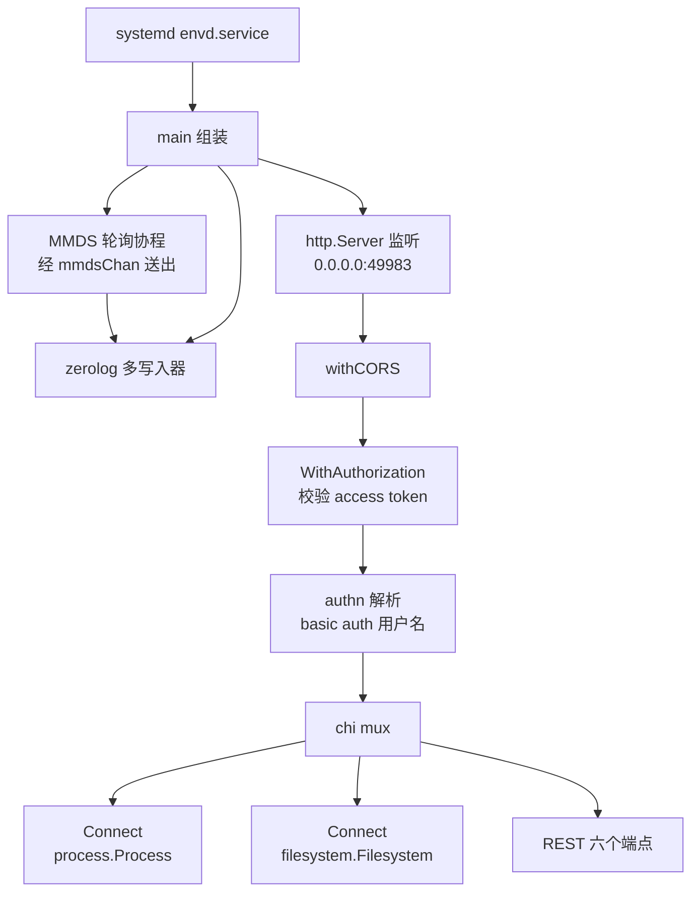
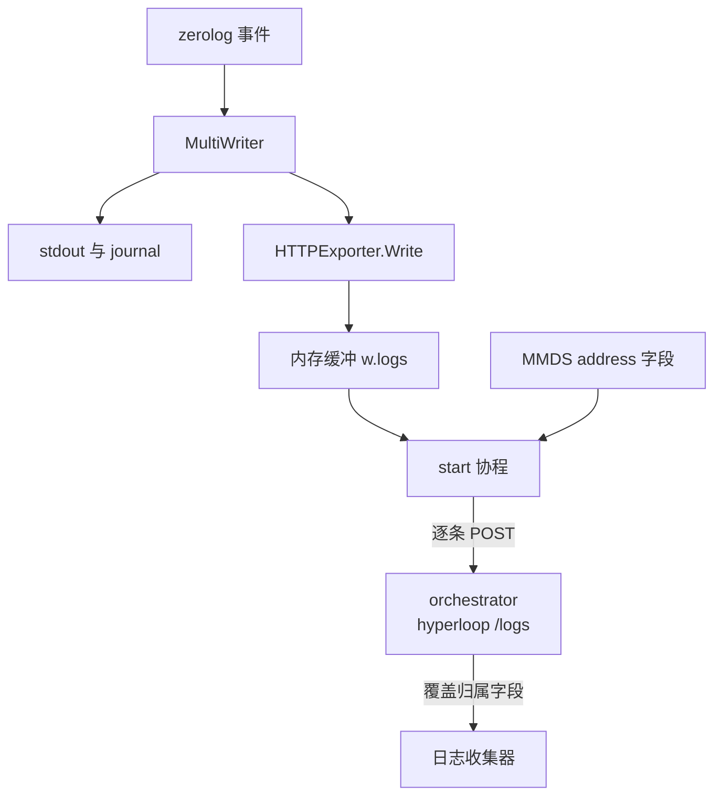

# 48 · envd 总览

> 沙箱是一台从共享模板的快照里恢复出来的 microVM：它开机时不知道自己是谁、不知道现在几点、
> 不知道该信任谁。envd 是 guest 里唯一常驻的守护进程，它把这三件事补齐，并且在同一个端口上
> 同时提供 Connect-RPC 与 REST 两套接口。本篇讲 envd 的启动顺序、身份的两个来源
> （MMDS 与 `/init`）、鉴权的边界，以及日志怎么离开沙箱。
>
> **读者**：后端工程师、SDK 开发者。
> **预备**：[第 36 篇 · 代理与 envd 通信](36-orchestrator-proxy-and-envd-client.md)、
> [第 43 篇 · rootfs 制作](43-rootfs-construction.md)。
> **代码**：`packages/envd/main.go`、`packages/envd/internal/api/`、`packages/envd/internal/host/mmds.go`、
> `packages/envd/internal/logs/`、`packages/envd/spec/envd.yaml`、
> `packages/orchestrator/internal/template/build/core/rootfs/files/envd.service.tpl`

---

## 0. 本篇要回答的问题

1. 一台从快照恢复出来的 guest，凭什么知道自己是哪台沙箱？这个信息从哪条路进来？
2. envd 启动时按什么顺序把自己组装起来？哪些部件在 MMDS 就绪之前就必须能工作？
3. `/init` 在 envd 内部依次做了哪几件事，哪些会失败、失败之后怎么样？
4. 为什么 `/health`、`/files`、`/init` 三类接口可以不带 access token，它们各自靠什么替代？
5. envd 自己的日志怎么走出沙箱？在拿到收集器地址之前的那些日志去哪了？
6. 同一个 49983 端口上的两套协议是怎么共存的，这个组合有什么硬约束？

---

## 1. guest 里为什么需要一个守护进程

一台沙箱能提供的能力，归根到底是「在 guest 里跑一条命令」「在 guest 里读写一个文件」。
这两件事必须由 guest 内部的代码执行：宿主能看到的只是一个 ext4 镜像文件与一片 guest 内存，
从外面改写运行中 guest 的文件系统会与 guest 内核的页缓存冲突，读写正在运行的进程更无从谈起。
所以 e2b 在 guest 里放一个常驻进程 envd，把这些能力包装成网络接口。

真正让 envd 的设计变得不平凡的，是**模板与快照**这两件事。

模板是共享的：同一个模板可能同时跑着几百台沙箱，它们的 rootfs 与初始内存完全一样。
模板里烘焙不进任何与「这一次运行」有关的信息 —— 沙箱 ID、团队的环境变量、这次的访问凭证，
全都不能进模板，否则一个模板只能服务一个租户。

快照更进一步：沙箱可以被暂停再恢复（[第 37 篇 §2](37-pause-and-snapshot.md#2-pause-的时序)）。
恢复出来的 guest 内存是上一次运行的原样，envd 进程还在，但它内存里的沙箱 ID 是旧的、
access token 是旧的、系统时钟停在打快照的那一刻。也就是说 envd 不能只在开机时初始化一次，
它必须能被**反复重新初始化**，而且要能安全地判断「这次重新初始化是宿主授权的」。

于是 envd 有两个信息入口，一个拉一个推：拉的是 MMDS（§3），推的是 `/init`（§4）。
两者职责不同，也不能互相替代 —— 这一点在 §5 的鉴权里体现得最清楚。

---

## 2. 启动：从 systemd 单元到 49983 端口

### 2.1 二进制怎么进 rootfs，怎么被拉起

envd 的二进制在模板构建阶段作为一层 OCI 层写进 rootfs。
`packages/orchestrator/internal/template/build/core/rootfs/rootfs.go` 的 `additionalOCILayers()`
把宿主上的 envd 文件读进内存，写到 `storage.GuestEnvdPath`，也就是 `/usr/bin/envd`，权限 `0o777`；
同一个函数还建了一条符号链接层，把
`etc/systemd/system/multi-user.target.wants/envd.service` 指向 `etc/systemd/system/envd.service`，
这相当于离线做了一次 `systemctl enable`，不需要在构建容器里真的跑 systemd。

单元文件由模板 `core/rootfs/files/envd.service.tpl` 渲染。它的几个字段值得看：

| 字段 | 值 | 作用 |
|---|---|---|
| `Restart` | `always` | envd 崩了就重启；重启后 token 与环境变量全丢，要靠 `/init` 重灌 |
| `ExecStart` | `/bin/bash -l -c "/usr/bin/envd"` | 用登录 shell 起，让 `/etc/profile` 里的 PATH 等生效 |
| `OOMScoreAdjust` | `-1000` | 内存耗尽时优先杀用户进程，不杀 envd |
| `OOMPolicy` | `continue` | 单元内某个进程被 OOM 杀死不牵连整个单元 |
| `GOMEMLIMIT` | `min(内存/2, 512) MiB` | Go 运行时软内存上限，由 `templates.go` 的 `MemoryLimit()` 算出 |
| `Delegate` | `yes` | 把 cgroup 子树交给 envd 自己管，这是 §2.2 里 cgroup 管理器的前提 |
| `MemoryMin` / `MemoryLow` | 50M / 100M | 给 envd 保底内存，避免用户进程把它挤出去 |
| `CPUWeight` | `1000` | envd 的 CPU 权重远高于用户进程的默认值 |

这一组参数的共同目标是：**沙箱里的用户代码可以把自己搞死，但不能把 envd 搞死**。
代价是 envd 会长期占住一份内存与 CPU 份额，对内存很小的沙箱档位不划算 —— `GOMEMLIMIT`
取内存的一半正是对这一点的让步。

### 2.2 `main()` 的组装顺序

`packages/envd/main.go` 的 `main()` 是一段线性的组装代码，顺序本身有信息量：

1. `parseFlags()`。四个有实际作用的标志：`-port`（默认常量 `defaultPort` = 49983）、
   `-isnotfc`（本机调试模式，见下）、`-cmd`（已废弃的启动命令）、`-cgroup-root`。
2. 建 `/run/e2b` 目录（`host.E2BRunDir`）。
3. 构造 `execcontext.Defaults`：默认用户 `root`、一张空的环境变量表。
   常量注释写明这个 `root` 「应当总是被模板构建时的 `/init` 覆盖」。
4. 把 `E2B_SANDBOX` 写进默认环境变量，同时写一份 `/run/e2b/.E2B_SANDBOX` 文件。
5. 如果不是 `-isnotfc`，起 `host.PollForMMDSOpts` 协程去拉 MMDS（§3）。
6. 建 logger（`logs.NewLogger`），它内部按是否 FC 模式决定要不要挂 hyperloop 导出器（§6）。
7. 建 chi 路由，挂 filesystem 与 process 两个 Connect 服务（`Handle()`）。
8. 建 cgroup 管理器（`createCgroupManager()`），失败时退回 no-op 实现。
9. 建 `api.New(...)`，用 `api.HandlerFromMux` 把 OpenAPI 生成的六个 REST 路由挂到同一个 mux 上。
10. 三层包装：`authn.NewMiddleware(permissions.AuthenticateUsername).Wrap` → `service.WithAuthorization` → `withCORS`。
11. 起 `http.Server`，起端口扫描与转发协程，`ListenAndServe`。

`-isnotfc` 这个反向命名的标志把 envd 变成「不在 Firecracker 里」的调试模式：不拉 MMDS、
日志只写 stdout、`/init` 的 MMDS 哈希校验直接返回「无授权信息」。
它服务的是 `make start-docker` 那条本机开发路径（`packages/envd/README.md`）。

注意第 5 步与第 6 步的先后：MMDS 轮询协程比 logger 先起，而 logger 又需要 MMDS 给的收集器地址。
这不是竞态，而是刻意的解耦 —— 协程通过一个容量为 1 的 channel `mmdsChan` 把结果送给导出器，
导出器在收到之前一直缓冲日志（§6）。



---

## 3. MMDS：guest 唯一的带外身份来源

### 3.1 两步取值协议

MMDS 是 Firecracker 提供的元数据服务：宿主通过 Firecracker 的 HTTP API 写入一段 JSON，
guest 通过链路本地地址 `169.254.169.254` 读出来
（[第 28 篇 §6](28-firecracker-process-management.md#6-mmds沙箱身份的投递通道)）。
`packages/envd/internal/host/mmds.go` 实现了 guest 侧的取值：

1. `getMMDSToken()`：`PUT http://169.254.169.254/latest/api/token`，
   请求头 `X-metadata-token-ttl-seconds` 设为 60。响应体就是会话令牌，空字符串视为失败。
2. `getMMDSOpts()`：`GET http://169.254.169.254/`，带上 `X-metadata-token` 与
   `Accept: application/json`，把响应反序列化成 `MMDSOpts`。

这个两步握手是 MMDS 的 V2 风格协议，目的是让 guest 里的 SSRF 类漏洞难以顺手把元数据读走：
一次简单的 GET 拿不到东西，必须先发一个带自定义头的 PUT。

`MMDSOpts` 只有四个字段，对应宿主侧 `packages/orchestrator/internal/sandbox/fc/mmds.go` 的
`MmdsMetadata`：`instanceID`（沙箱 ID）、`envID`（模板 ID）、`address`（日志收集地址）、
`accessTokenHash`。

### 3.2 轮询一次就退出

`PollForMMDSOpts()` 是一个 50 ms 的 ticker 循环，每一轮取令牌、取元数据，任何一步出错就
打到 stderr 然后进入下一轮。成功之后它做四件事然后 **return**：

- 把 `E2B_SANDBOX_ID` 与 `E2B_TEMPLATE_ID` 存进 `defaults.EnvVars`；
- 把同样两个值写成 `/run/e2b/.E2B_SANDBOX_ID` 与 `/run/e2b/.E2B_TEMPLATE_ID` 两个文件；
- 若 `address` 非空，把整个 `MMDSOpts` 推进 `mmdsChan`；
- 退出循环。

写文件这一步容易被忽略，但它解决的是一个真实问题：环境变量只对 envd 之后启动的进程有效，
而沙箱里还有 systemd 拉起的其它服务、用户自己以别的方式起的进程。
落成 `/run` 下的文件之后，任何进程都能用 `cat` 读到自己所在沙箱的 ID。
代价是这两个文件的权限是 `0o666`，沙箱内任何用户可写 —— 它们是便利信息，不是可信凭据。

「成功一次就退出」意味着这个协程不会持续跟踪 MMDS 的变化。恢复出来的沙箱换了新的沙箱 ID
与新的收集器地址，envd 并不会自己发现。补这个缺口的是 `/init`：`PostInit` 的最后会再起一个
带 60 s 超时的协程重跑 `PollForMMDSOpts`（§4.1）。也就是说，**MMDS 是拉取通道，
但拉取的时机由推送通道触发**。

`/init` 的鉴权要读 `accessTokenHash`，走的是另一条路：`GetAccessTokenHashFromMMDS()`，
用一个独立的 `mmdsAccessTokenClient`（10 s 超时、`DisableKeepAlives: true`）现取现用，
不复用轮询协程的结果。这是必要的：轮询协程读到的哈希属于上一次运行，
而校验必须用宿主刚刚写进去的那一份。

---

## 4. `/init` 在 envd 侧做了什么

orchestrator 侧怎么构造这个请求、怎么无限重试、token 怎么推导，
在[第 36 篇 §3](36-orchestrator-proxy-and-envd-client.md#3-通道二orchestrator-调-envd-的-init)里已经讲过。
这里只看 envd 收到之后的处理。

### 4.1 `PostInit` 的外层流程

`packages/envd/internal/api/init.go` 的 `PostInit()`：

1. 分配一个 operation ID 用于日志关联。
2. 若请求体非空，`io.ReadAll` 读成 `[]byte`，并立刻 `defer memguard.WipeBytes(body)`。
   反序列化成 `PostInitJSONBody` 之后再 `defer initRequest.AccessToken.Destroy()`，
   保证任何一条提前返回的路径都不会把明文 token 留在堆上。
3. 取 `initLock`，串行化整个 `/init` 处理。
4. 时间戳判据：`initRequest.Timestamp == nil || a.lastSetTime.SetToGreater(...)` 为真才执行
   `SetData()`。迟到的旧请求被静默跳过，但仍然返回 204。
5. 起一个 60 s 超时的协程重跑 `host.PollForMMDSOpts`。
6. 返回 204，并显式设置 `Cache-Control: no-store` 与空的 `Content-Type`。

第 5 步在函数里的位置很关键：它在 `if r.Body != nil` 这个分支**之外**。
一次不带请求体的 `POST /init` 什么都不会设置，但仍然会触发一次 MMDS 重读。
这就是「快照恢复后的重新初始化」在最小形态下的样子。

错误映射只有两档：`ErrAccessTokenMismatch` 与 `ErrAccessTokenResetNotAuthorized` 映射成 401，
其余一律 400，错误文本原样写进响应体。

### 4.2 `SetData()` 的六件事

`SetData()` 先做 token 校验（§5.3），通过之后按固定顺序处理六类字段：

| 字段 | 动作 | 失败语义 |
|---|---|---|
| `timestamp` | 必要时 `unix.ClockSettime(unix.CLOCK_REALTIME, ...)` | 只记 error 日志，不中断 |
| `envVars` | 逐条 `defaults.EnvVars.Store` | 不会失败 |
| `accessToken` | `TakeFrom` 接管；请求未带 token 则销毁现有 token | 不会失败 |
| `hyperloopIP` | 起协程改写 `/etc/hosts` 并设 `E2B_EVENTS_ADDRESS` | 异步，错误只进日志 |
| `defaultUser` / `defaultWorkdir` | 覆盖 `defaults` 里的同名字段，空串不覆盖 | 不会失败 |
| `volumeMounts` | 每个卷起一个协程执行 `mkdir -p` 与 `mount -t nfs` | 异步，错误只进日志 |

这张表里只有 token 校验能让 `/init` 返回非 2xx。其余五项要么不会失败，要么**失败了也不告诉调用方**。
这是一个明确的取舍：`/init` 的语义是「尽力把这一次运行的身份灌进去」，
如果 NFS 挂载失败就让整个沙箱创建失败，可用性会显著变差；代价是调用方无法从 204 推出
「所有字段都生效了」，卷挂载与 hyperloop 的实际状态要另行观察。

对时那一段的阈值（早于宿主 50 ms 或晚于宿主 5 s 才校时）与其不对称的理由在
[第 36 篇 §3.3](36-orchestrator-proxy-and-envd-client.md#33-为什么每次重试都要重新打时间戳以及重复-init-的幂等)
里已展开。这里补一点 envd 侧的前提：
`ClockSettime` 需要 `CAP_SYS_TIME`，而 envd 由 systemd 以 `User=root` 启动，
没有额外的 capability 裁剪，所以这个调用能成功。同一个 rootfs 里还装了 chrony
（`rootfs.go` 同样为它建了 `multi-user.target.wants` 符号链接），
两者是互补关系：`/init` 负责恢复瞬间的一次性跳变，chrony 负责之后的持续走时。

`hyperloopIP` 那一段调用 `SetupHyperloop()`，它持 `hyperloopLock`，
用 `txeh` 库改写 `/etc/hosts`，把 `events.e2b.local` 指到给定 IP。
函数会先查一遍现有记录，地址没变就直接返回，所以重复 `/init` 不会让 hosts 文件越写越长。

---

## 5. 鉴权：一个开关、四条豁免、两种凭据

### 5.1 总开关在最外层

`packages/envd/internal/api/auth.go` 的 `WithAuthorization()` 包住整个 handler 链，
Connect-RPC 与 REST 一视同仁。它的第一行判断是 `if a.accessToken.IsSet()`：
**token 没设置时，envd 完全不鉴权**。

这不是疏漏，而是启动次序的必然结果。envd 起来时还没有 token，`/init` 是唯一能给它 token 的入口，
而 `/init` 本身要能被调用。真正兜底的是网络：49983 端口只在沙箱的网络槽位里可达，
外部流量要经过 edge 与 orchestrator 的代理，代理会显式跳过 49983 端口的 traffic token 校验
并交给 envd 自己判断（[第 36 篇 §2.4](36-orchestrator-proxy-and-envd-client.md#24-两个-token-与两处校验)）。
代价是：如果某条路径让请求在 `/init` 之前到达 envd，它就是无鉴权的。

这个「token 已设才生效」的前置判断出现了两次，两处必须一起看。
除了 `WithAuthorization()` 的最外层判断，`validateSigning()` 开头也有一条
`if !a.accessToken.IsSet() { return nil }`——即 §5.2 讲的 `/files` 预签名校验，
在没有 token 时同样直接放行。于是准确的说法不是「三类路径豁免鉴权」，
而是**整个鉴权体系以 token 是否已设为总闸**：闸未合上时，
豁免路径与非豁免路径没有区别，都不校验；闸合上之后，两者才分成「验 token」与「验签名」两条。
这解释了为什么 `/init` 的四分支判定（§5.3）必须自己去读 MMDS：
它是唯一一个在闸未合上时也要做出授权决定的端点。

token 存在 `SecureToken` 里（`internal/api/secure_token.go`），底层是 `memguard.LockedBuffer`：
内存锁定、带保护页、销毁时清零。比较用 `buffer.EqualTo`，是常数时间比较。
`UnmarshalJSON` 直接把 JSON 字符串的内容拷进安全缓冲区并擦掉输入，中途不产生 Go 的 `string`
（`string` 不可变、无法擦除，会一直留在堆上直到被 GC 回收）。

### 5.2 四条豁免路径各自靠什么

```go
var authExcludedPaths = []string{
	"GET/health",
	"GET/files",
	"POST/files",
	"POST/init",
}
```

匹配的是 `req.Method + req.URL.Path`，不含查询串，所以 `/health?x=1` 也命中。
四条豁免的替代凭据各不相同：

- **`GET /health`**：没有替代凭据，就是公开的。它要服务的是 orchestrator 的健康探测
  （[第 39 篇 §2](39-health-errors-and-teardown.md#2-健康检查一个没有权力的探针)），
  响应是 204 空体，不泄露任何沙箱状态。
- **`GET /files` 与 `POST /files`**：改用**签名**。`validateSigning()` 先看请求头里有没有
  `X-Access-Token`，有就按 token 校验；没有则要求查询参数 `signature`，
  用 `generateSignature()` 重算一遍比对。签名的原文是
  `path:operation:username:token` 拼串（带过期时间时再拼一个 Unix 时间戳），
  取 SHA-256 后加 `v1_` 前缀，`operation` 是 `read` 或 `write`。
  这条路径存在的理由是浏览器：预签名 URL 可以直接放进 `` 或下载链接，
  而自定义请求头做不到这一点。代价是签名一旦泄露，在过期前对该路径持续有效。
- **`POST /init`**：改用 MMDS 哈希（§5.3）。

其余所有路径 —— `/envs`、`/metrics`，以及 `/process.Process/*` 与 `/filesystem.Filesystem/*`
两组 Connect 端点 —— 都必须带 `X-Access-Token`。

### 5.3 `/init` 的四分支判定

`validateInitAccessToken()` 的判定顺序：

1. 已有 token 且请求 token 与之相等 → 放行（快路径，不读 MMDS）。
2. 否则读 MMDS 哈希：请求 token 的 SHA-512 与之相等 → 放行。
   请求没带 token 时，比较的是 `HashAccessToken("")` —— 宿主用这个值**显式**表达「允许清空 token」。
3. 本地没有 token、MMDS 也没有哈希 → 视为首次初始化，放行。
4. 请求没带 token 而 MMDS 有要求 → `ErrAccessTokenResetNotAuthorized`；其余 → `ErrAccessTokenMismatch`。

MMDS 在这里的价值是**带外**：它由 Firecracker 提供，宿主写、guest 读，
沙箱里的用户代码即使读到 MMDS，拿到的也只是 SHA-512 哈希，不是可用的凭证。
envd 因此可以在不信任请求内容的前提下确认「换 token 这件事是宿主授权的」。
哈希算法在 `packages/shared/pkg/keys/sha512.go`，两侧共用同一个函数。

### 5.4 用户名不是凭据

容易混淆的一点：envd 的 HTTP Basic 认证头**不用于鉴权**。
`main.go` 里 `authn.NewMiddleware(permissions.AuthenticateUsername)` 装的中间件，
在 `internal/permissions/authenticate.go` 里只做一件事 —— 从 Basic 头里取出用户名，
用 `user.Lookup` 查 guest 的用户数据库，把 `*user.User` 放进 context。密码从头到尾没被读过。
没带用户名时它返回 `nil, nil`，后续由 `GetAuthUser()` 回落到 `defaults.User`。

换句话说，Basic 头在这里被借用为「以哪个 guest 用户执行」的选择器，
门禁是 `X-Access-Token`。这个区分在[第 51 篇 §3](51-envd-ports-permissions-metrics.md#3-权限模型)
里还会继续。

---

## 6. 日志：从 zerolog 到 hyperloop

`internal/logs/logger.go` 的 `NewLogger()` 建一个 zerolog logger，
时间字段名改成 `timestamp`、格式 RFC3339Nano、级别 Debug，写入目标是一个 `io.MultiWriter`：
调试模式下只有 `os.Stdout`，FC 模式下是 `exporter.NewHTTPLogsExporter(...)` 加 `os.Stdout`。
两者并存意味着日志在 guest 的 journal 里也有一份，但 journal 随沙箱销毁而消失，
所以导出器才是有效的那条路。

`internal/logs/exporter/exporter.go` 的结构解决的是一个时序问题：
**envd 在拿到收集器地址之前就已经在产生日志了**。

- `Write()` 是 `io.Writer` 接口的实现。它把字节切片拷一份，然后起一个协程调 `addLogs`，立即返回。
  拷贝是必需的，zerolog 会复用底层缓冲区。
- `addLogs()` 持锁把这条日志追加进 `w.logs` 切片，然后往容量为 1 的 `triggers` channel
  做一次非阻塞发送。
- `listenForMMDSOptsAndStart()` 阻塞在 `mmdsChan` 上。第一次收到 `MMDSOpts` 时，
  用 `startOnce` 起 `start()` 协程；之后每次收到都只更新地址与 ID。
- `start()` 从 `triggers` 取信号，每次把 `w.logs` 整体取走并清空，
  逐条用 `mmdsOpts.AddOptsToJSON()` 注入 `instanceID` 与 `envID` 两个字段，
  再 POST 到 `LogsCollectorAddress`。发送失败就把原始日志打到 stdout。

所以启动初期的日志不会丢：它们堆在 `w.logs` 里，等 MMDS 就绪后一次性冲出去。
代价有三个，都不小：

1. **每条日志一个 HTTP POST**。没有批量打包，`sendInstanceLogs` 一次只发一个 JSON 对象。
   客户端超时 10 s（`ExporterTimeout`）。
2. **顺序不保证**。`Write` 为每条日志起一个协程去抢锁，日志进入切片的顺序不等于产生顺序。
   下游要靠日志里的 `timestamp` 字段重排。
3. **无上限缓冲**。收集器长时间不可达时 `w.logs` 只增不减，没有丢弃策略。
   **推论**：一个疯狂打日志的沙箱在收集器故障期间会让 envd 的内存持续增长，
   最终由 `GOMEMLIMIT` 与 cgroup 的 `MemoryMin` 决定后果。

地址本身来自 MMDS 的 `address` 字段，由 orchestrator 在
`internal/sandbox/fc/process.go` 填成 `http://<沙箱内的宿主地址>/logs`，
落点是 orchestrator 的 hyperloop 服务器。hyperloop 侧会按源 IP 认出是哪台沙箱，
并**强制覆盖**上报 JSON 里的 `instanceID` 与 `teamID` 之后再转发给真正的日志收集器
（[第 36 篇 §5.2](36-orchestrator-proxy-and-envd-client.md#52-me-与-logs)）。
也就是说 envd 注入的那两个字段并不被下游信任 —— 它们只在 envd 与 hyperloop 之间有意义，
真正的归属由宿主判定。



---

## 7. 一个端口，两条协议

### 7.1 两套接口怎么共存

envd 只监听一个端口，两套接口挂在同一个 `chi.Mux` 上：

- **Connect-RPC**：`internal/services/filesystem/Handle()` 与 `internal/services/process/Handle()`
  各自调生成代码的 `NewFilesystemHandler` / `NewProcessHandler`，拿到 `(path, handler)`
  再 `server.Mount(path, handler)`。挂载前缀由 proto 的包名与服务名决定，
  即 `/filesystem.Filesystem/` 与 `/process.Process/`。
- **REST**：`api.HandlerFromMux(service, m)` 把 OpenAPI 生成的路由注册到同一个 mux，
  一共六条：`GET /health`、`GET /metrics`、`GET /envs`、`POST /init`、`GET /files`、`POST /files`。
  契约是 `packages/envd/spec/envd.yaml`。

两套接口分工清晰：**REST 面向控制与传输**（初始化、健康、指标、整文件上传下载），
**Connect-RPC 面向交互**（进程与文件系统的细粒度操作，需要流式响应）。
文件的整体传输之所以不放进 RPC，是因为 proto 消息要整体驻留内存，
而 `POST /files` 走 multipart 流式处理，还能被浏览器直接使用。

| 维度 | Connect-RPC | REST |
|---|---|---|
| 契约 | `spec/process/process.proto`、`spec/filesystem/filesystem.proto` | `spec/envd.yaml` |
| 端点 | `/process.Process/*`、`/filesystem.Filesystem/*` | 六条固定路径 |
| 编码 | protobuf 或 JSON，由 Connect 协议协商 | JSON 或 multipart 或 octet-stream |
| 鉴权 | 一律要 `X-Access-Token` | health / files / init 三类豁免 |
| 流式 | 服务端流（`Start`、`Connect`、`WatchDir`） | 无 |
| 日志 | `logs.NewUnaryLogInterceptor` 拦截器 | 各 handler 自行打 |

### 7.2 只有 HTTP/1.1

`main.go` 里的 `http.Server` 直接把 handler 交给 `ListenAndServe`：没有 TLS，
也没有 `h2c` 包装（整个 `packages/envd` 里搜不到 `http2` 或 `h2c` 的引用）。
Go 的 HTTP/2 只在 TLS 的 ALPN 协商中自动启用，所以 **envd 只讲 HTTP/1.1**。

这带来一个硬约束。Connect 协议在 HTTP/1.1 上只支持 unary 与服务端流，
客户端流与双向流需要 HTTP/2。`process.proto` 里确实声明了一个客户端流方法
`StreamInput`，注释写着「客户端输入流保证消息顺序」，但 **推论**：它在当前部署形态下用不上。
佐证是 SDK 侧：JS 与 Python SDK 的命令与 PTY 实现（`sandbox/commands/index.ts`、
`sandbox_sync/commands/command.py` 等）调的都是 unary 的 `SendInput`，
生成的 `stream_input` 存根没有被业务代码引用。
这个约束的代价与影响在[第 49 篇 §5](49-envd-process-service.md#5-输入通路与-eof)里展开。

超时口径也在这里定：`ReadTimeout` 与 `WriteTimeout` 都设成 0，
注释说明「连接由沙箱关闭与 keepalive 关闭来终止」—— 长时间的流式响应不能被写超时打断。
`IdleTimeout` 是 640 s，常量上方的注释写明「下游超时应当大于上游（orchestrator 代理里的）」，
对应代理侧的 620 s。这个 20 s 的余量保证空闲连接总是由代理先关，
而不是 envd 先关掉一条代理还认为可用的连接。

最外层的 CORS 中间件允许任意来源、任意请求头，暴露 Connect 需要的响应头加上
`Location`、`Cache-Control`、`X-Content-Type-Options`，预检结果缓存 2 小时。
放开到 `*` 是必要的：沙箱的域名是按沙箱 ID 动态生成的，无法预先枚举来源。
安全性由 access token 承担，不由同源策略承担。

---

## 8. ARM 适配版的差异

ARM 补丁对 `packages/envd/` 只动了两个文件。`Makefile` 把写死的 `GOARCH=amd64`
改成按 `uname -m` 推导的 `$(PLATFORM)`，让 envd 能在 aarch64 上原生编译；
`internal/host/mmds.go` 里读 MMDS 哈希的那个 HTTP 客户端去掉了 `DisableKeepAlives: true`，
换成 `MaxIdleConns` / `MaxIdleConnsPerHost` 各 10、`IdleConnTimeout` 90 s 的连接池。
envd 的业务逻辑逐字节未变。构建侧的差异见
[第 74 篇 §7](74-template-build-on-arm.md#7-envd-侧的两处改动)，
MMDS 客户端调整的动机与 `/init` 超时放宽的关系见
[第 71 篇 §5](71-orchestrator-arm-fc-changes.md#5-uffd-监听超时10-s--120-s)。

---

## 9. 小结

- envd 存在的理由是模板共享与快照恢复：模板里不能烘焙任何一次运行的身份，
  恢复出来的 guest 带的是上一次运行的身份，两者都要求一个能被反复重新初始化的 guest 内进程。
- 身份有两个入口：MMDS 是拉取通道（沙箱 ID、模板 ID、日志地址、token 哈希），
  `/init` 是推送通道（环境变量、token、时间、hyperloop 地址、默认用户与卷）；
  MMDS 的重新拉取由 `/init` 触发，两者互相依赖。
- systemd 单元用 `OOMScoreAdjust=-1000`、`MemoryMin`、`CPUWeight=1000` 把 envd 保护起来，
  代价是固定占用一份内存与 CPU 份额。
- `/init` 只有 token 校验会返回非 2xx；对时、NFS 挂载、hosts 改写失败都只进日志，
  调用方无法从 204 推断这些副作用已生效。
- 鉴权总开关是「token 是否已设」：`WithAuthorization()` 与 `validateSigning()` 都以它为前置判断，
  设之前 envd 完全开放，兜底靠网络隔离与代理对 49983 的端口跳过。
- 三类豁免路径各有替代凭据：`/health` 无凭据但不泄露状态，`/files` 用 SHA-256 预签名（为浏览器而设），
  `/init` 用 MMDS 里的 SHA-512 哈希做带外授权。
- HTTP Basic 头里的用户名是「以哪个 guest 用户执行」的选择器，不是凭据；密码不被读取。
- 日志导出器在 MMDS 就绪前无限缓冲、就绪后逐条 POST 到 hyperloop；
  代价是每条一个请求、顺序不保证、缓冲无上限。
- 同一端口上 Connect-RPC 与 REST 共存，分工是「交互」与「控制加传输」；
  没有 h2c 意味着只有 HTTP/1.1，客户端流方法实际用不上。
- 640 s 的空闲超时是刻意大于 orchestrator 代理的 620 s，让空闲连接总是由上游先关。

---

## 延伸阅读 / 下一篇

- [第 36 篇 · 代理与 envd 通信](36-orchestrator-proxy-and-envd-client.md)：`/init` 的宿主侧构造、
  无限重试与两层超时，以及 access token 的生成链条。
- [第 49 篇 · 进程服务](49-envd-process-service.md)：下一篇，Connect-RPC 上最复杂的那个服务。
- [第 50 篇 · 文件系统服务与文件接口](50-envd-filesystem-service.md)：`/files` 与 filesystem RPC 的完整语义。
- [第 51 篇 · 端口、权限与指标](51-envd-ports-permissions-metrics.md)：本篇略过的端口扫描、
  cgroup 管理器与 `/metrics` 的数据来源。
- [第 52 篇 · legacy 服务与 SDK 兼容](52-envd-legacy-and-sdk-compat.md)：envd 版本与 SDK 的兼容矩阵。
- [第 43 篇 · rootfs 制作](43-rootfs-construction.md)：envd 二进制与 systemd 单元怎么进的镜像。
- Connect 协议规范：<https://connectrpc.com/docs/protocol>，其中说明了各协议对 HTTP 版本的要求。
