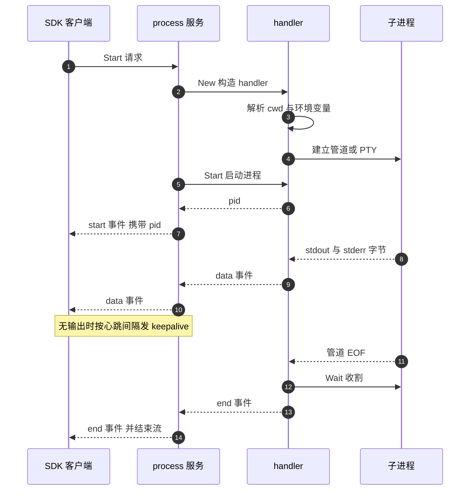

# 49 · 进程服务

> 沙箱的价值最终落在「跑一条命令，把输出拿回来」这件事上。envd 的 process 服务用八个 Connect-RPC
> 方法实现它：进程在沙箱里跑，输出以事件流推给调用方，连接断了还能重新接上。本篇讲这八个方法的语义、
> 输出多路复用的结构，以及这套设计在背压、权限与重连上的代价。
>
> **读者**：工程师、SDK 开发者。
> **预备**：[第 48 篇 · envd 总览](48-envd-overview.md)。知道 Connect-RPC 的四种流式模式会读得更顺。
> **代码**：`packages/envd/spec/process/process.proto`、`packages/envd/internal/services/process/`、
> `packages/envd/internal/services/process/handler/`、`packages/envd/internal/permissions/`

---

## 0. 本篇要回答的问题

1. 为什么「在沙箱里执行命令」不能做成一次普通的请求 - 响应，需要八个方法和两种流式模式？
2. 一次 `Start` 从收到请求到发出 end 事件，内部经过哪些步骤？事件的顺序由什么保证？
3. PTY 与非 PTY 两条路径在输出、输入、结束语义上分别差在哪里？stdout 与 stderr 什么时候合流？
4. 进程以哪个用户、哪个工作目录、哪套环境变量运行？这些值从哪里来、谁能覆盖谁？
5. 客户端断线后 `Connect` 能恢复什么、恢复不了什么？哪些情况下重连会挂住？
6. 沙箱里同时跑很多命令时，谁在限制资源？一个慢客户端会不会拖住别人？

---

## 1. 为什么是一组流式方法

先看不这么做会怎样。最朴素的接口是 `Exec(cmd) -> (stdout, stderr, exit_code)`：一次 HTTP 请求，
进程跑完再返回。这个接口有四个撑不住的场景。

**长命令。** 训练脚本跑二十分钟，中间没有任何输出返回给调用方；用户看不到进度，
中间的代理也没有理由把一条长时间没有字节流动的连接留着。

**交互式命令。** `python` 的 REPL、`vim`、任何需要读 stdin 的程序，在请求 - 响应模型里无法表达：
请求体在进程启动前就已写完。

**后台进程。** 启动一个 web server 让它一直跑，调用方希望立刻拿到 pid 并断开，
而不是把 HTTP 连接挂在那里。

**断线。** 客户端与沙箱之间隔着边缘代理与 orchestrator 的代理链
（[第 36 篇 §2](36-orchestrator-proxy-and-envd-client.md#2-通道一orchestrator-里的沙箱代理)）。
连接会断，而进程不应该跟着死。

process 服务的接口面就是这四个约束的直接产物：进程的**生命周期**与 RPC 的**连接生命周期**解耦，
输出走服务端流，输入走客户端流或一元调用，另有一个专门的方法把新连接接回已有进程。

---

## 2. 八个方法与两种流式模式

`spec/process/process.proto` 里 `service Process` 声明了八个方法：

| 方法 | 模式 | 作用 |
|---|---|---|
| `Start` | 服务端流 | 启动进程，流式返回 start / data / end 事件 |
| `Connect` | 服务端流 | 接到一个已有进程上，流式返回后续事件 |
| `List` | 一元 | 列出 envd 记录在册的进程 |
| `Update` | 一元 | 目前只用于改 PTY 窗口大小 |
| `SendInput` | 一元 | 写一次 stdin 或 pty |
| `StreamInput` | 客户端流 | 连续写输入，由流本身保证顺序 |
| `SendSignal` | 一元 | 只接受 SIGTERM 与 SIGKILL |
| `CloseStdin` | 一元 | 关闭 stdin 管道，向进程发 EOF |

两种流式模式各自解决一个问题。**服务端流**用于输出：一次请求，服务端持续推送，
直到进程结束或连接断开。**客户端流**用于输入，proto 的注释直接写明了理由 ——
`Client input stream ensures ordering of messages`。若用 `SendInput` 连发多次一元调用，
HTTP/2 的多路复用不保证这些请求在服务端按发出顺序被处理，键入的字符可能乱序进入 stdin；
一条客户端流则天然有序。代价是要多维护一条长连接，所以两个方法都保留：
偶发的一次输入用 `SendInput`，交互式会话用 `StreamInput`。

`StreamInput` 的第一条消息必须是 `StartEvent`，携带 `ProcessSelector` 指明写给谁；
后续消息是 `DataEvent`，另有一种 `KeepAlive` 事件，服务端收到后什么也不做，只是让流上有字节流动。
`internal/services/process/input.go` 的 `streamInputHandler`
把选择结果存在局部变量 `proc` 里，然后每条数据事件都交给 `handleInput` 写给它。
若客户端先发数据再发 start，`proc` 为 `nil`，`handleInput` 会调用 `proc.WriteStdin`
或 `proc.WriteTty`，这两个方法的第一件事都是读 `p.tty` 字段，于是解引用空指针 ——
**推论：** 代码中没有对这种顺序做检查，这条路径依赖客户端遵守约定。

`ProcessSelector` 是一个 oneof，可以按 `pid` 选，也可以按 `tag` 选。tag 是 `StartRequest`
里的可选字符串，用来给进程起个稳定的名字，这样重连时不必记住 pid。
不过 Python SDK 的 `commands.connect` 只接受 pid（`e2b/sandbox_sync/commands/command.py`），
按 tag 选主要留给直接用 proto 的调用方。

---

## 3. 一次 Start 的内部时序

`internal/services/process/start.go` 的 `handleStart` 是理解整个服务的入口。它做的事按顺序是：

1. `permissions.GetAuthUser(ctx, s.defaults.User)` 解析出以哪个用户运行。
2. `determineTimeoutFromHeader` 读 `Connect-Timeout-Ms` 请求头，得到进程的**寿命上限**。
3. 用 `context.Background()` 而不是请求的 ctx 造出 `procCtx`，只在超时非零时加 `WithTimeout`。
4. `handler.New(...)` 构造 handler：解析 cwd、拼环境变量、建立输出管道或 PTY。
5. 在 handler 的 `DataEvent`、`EndEvent` 两个多路复用通道上各 `Fork()` 一个消费者，
   另造一个只用一次的 `startMultiplexer` 承载 start 事件。
6. 起一个 goroutine 作为「发送方」，它先等 start 事件，再循环转发 data 事件，最后等 end 事件。
7. 调 `proc.Start()` 真正启动进程，拿到 pid，存进 `s.processes`，把 start 事件交给发送方。
8. 再起一个 goroutine 调 `proc.Wait()`，并在其返回后把 pid 从 map 里删掉。
9. 主 goroutine 阻塞在 `ctx.Done()` 与发送方的 `exitChan` 之间。

第 5 步的先后关系很重要：两个消费者是在进程启动**之前**注册的，所以从第一个字节起就不会漏。

第 3 步是整个设计的支点。代码里有一行注释说明了原因：
`We do not want the command to be killed if the request context is cancelled`。
进程的 ctx 与请求的 ctx 完全脱钩，所以客户端断开、`Start` 流结束，进程照样活着。
反过来，`Connect-Timeout-Ms` 这个本来属于 RPC 层的超时头被复用成了进程的生存期上限：
`exec.CommandContext` 在 ctx 到期时会杀掉进程。SDK 正是这么用的 ——
`e2b/sandbox_sync/commands/command.py` 的 `_start` 把用户传的 `timeout` 交给 `timeout=` 参数，
文档写「Using 0 will not limit the command connection time」；SDK 连接层
（`e2b_connect/client.py` 的 `_create_stream_timeout`）在 `timeout` 为假值时不发这个头，
envd 侧 `determineTimeoutFromHeader` 便得到 0，落进 `timeout > 0` 判断的否定分支，不加超时。
`procCtx` 的取消函数被一路传给 `handler.New`，最终在 `Handler.Wait()` 发完 end 事件之后调用，
用来释放 `context.WithTimeout` 占的计时器。

`handleStart` 不是唯一入口。`start.go` 还有一个 `InitializeStartProcess`，
供 `main.go` 在带 `--cmd` 参数启动时跑一条命令；它复用同一个 handler，但没有流、没有消费者，
输出只进日志。这条路径在代码里已标注不再用于模板构建。

事件的顺序不靠时间戳，靠发送方 goroutine 的结构：它先在一个 `select` 里等 start 事件并发出，
之后才进入 data 循环，data 通道关闭后才去等 end。三段是串行的，所以流上事件顺序恒为
start → data\* → end。

流上还有第四种事件：`KeepAlive`。`permissions.GetKeepAliveTicker` 读
`Keepalive-Ping-Interval` 请求头，值以秒为单位，解析失败或缺失时取默认的 90 秒；
每发出一个 data 事件就 `resetKeepalive()` 重置计时器。它的作用是让一条长时间没有输出的流上仍有字节流动，
免得中间任何一跳的空闲超时把连接掐掉。要注意 keepalive 只覆盖 data 循环那一段：
发送方跳出 data 循环、进入等 end 事件的最后一个 `select` 之后，可选分支只剩 `ctx.Done()` 与 end，
计时器还在走但没人再读它，流上不会再有 keepalive。第 8 节会讲这段窗口变长时的后果。
envd 自己的 HTTP 服务器把
`ReadTimeout` 与 `WriteTimeout` 设为 0、`IdleTimeout` 设为 640 秒，
`main.go` 里的注释说明了口径：下游的超时必须大于上游 orchestrator 代理的超时。

---

## 4. 输出通路：多路复用与两条路径

一个进程的输出可能有多个订阅者：发起 `Start` 的那条流，加上任意条后来 `Connect` 上来的流。
`handler/multiplex.go` 的 `MultiplexedChannel[T]` 就是这个扇出结构：
一个 `Source` 通道进，一组 `channels` 出；后台 goroutine `for v := range c.Source`，
对每个消费者做一次 `cons <- v`。`Fork()` 注册一个新消费者并返回取消函数。
`Source` 关闭后，这个 goroutine 先把 `exited` 置位，再关闭所有已注册的消费者通道；
此后的 `Fork()` 看到 `exited` 为真，直接返回一个已关闭的通道。
**推论：** 收尾的关闭循环没有持锁，`Fork()` 的 `exited` 检查也在加锁之前，
于是存在一个极窄的窗口：恰好在置位与关闭之间完成注册的消费者通道不会被关闭。

handler 上挂两个这样的通道：`DataEvent`（缓冲 64）与 `EndEvent`（无缓冲）。

**非 PTY 路径。** `handler.New` 调 `cmd.StdoutPipe()` 与 `cmd.StderrPipe()`，
各起一个 goroutine 以 `stdChunkSize`（`2 << 14`，即 32 KiB）为单位读，
把读到的字节包成 `DataEvent` 的 `stdout` 或 `stderr` 字段推进 `Source`。
两条流在协议层**保持区分**：`ProcessEvent.DataEvent` 是一个 oneof，客户端能分辨每一段来自哪里。
但两条 goroutine 写的是同一个 `Source` 通道，所以 stdout 与 stderr 之间的**相对顺序不保证** ——
它们在源头就是两个独立的管道，内核也不保证顺序，envd 没有加时间戳或序号来恢复它。

**PTY 路径。** 请求里带了 `pty` 字段时，`New` 直接调 `pty.StartWithSize(cmd, ...)`。
伪终端只有一个 master 端，stdout 与 stderr 在内核里就已经合流了，读出来的字节包成
`DataEvent` 的 `pty` 字段。这是「合流」的确切含义：不是 envd 把两条流拼起来，
而是 PTY 这种设备本身只有一条。代价是客户端再也分不出哪些字节是 stderr；
收益是终端控制序列、行编辑、作业控制都能正常工作，因为进程看到的是一个真正的 tty。
PTY 的读缓冲是 `ptyChunkSize`（`2 << 13`，即 16 KiB），比非 PTY 小一半。

两条路径还有一个容易忽略的差别：PTY 进程在 `handler.New` 里就已启动，而不是等到 `Start()`；
注释说明原因是 `creack/pty` 不支持把创建与启动分开。`Handler.Start()` 因此对 PTY 跳过
`cmd.Start()`，其余动作照做。

### 4.1 背压与并发

`Fork()` 返回的消费者通道是**无缓冲**的，而扇出循环里的 `cons <- v` 是**阻塞发送，没有 select、没有超时**。
这条链路的后果是确定的：任何一个消费者不读，扇出 goroutine 就停住；
`Source` 的 64 个槽位填满后，读管道的 goroutine 也停住；管道写满后，
子进程的 `write()` 阻塞。也就是说，**一个读得慢的客户端会经由流控一路顶到子进程本身**，
并且同时冻结这个进程的所有其它订阅者。

这是这套设计付出的最大一笔代价。收益是实现极简、不会丢事件、内存占用有界；
代价是缺少按消费者隔离的缓冲与丢弃策略。对交互式终端这是合理取舍，终端本来就该背压；
对「一个客户端拉日志、另一个客户端也在拉」的场景则不是。

真正的资源限制不在这一层，而在 cgroup。`main.go` 的 `createCgroupManager` 在 guest 内建三个
cgroup v2 目录，`handler.New` 通过 `getProcType(req)` 决定进程归哪个：带 PTY 的进 `ptys`，其余进 `user`
（`socats` 那一档归端口转发）。归属靠 `SysProcAttr.UseCgroupFD` 与 `CgroupFD`，即在 `clone3` 时直接指定
cgroup，而不是启动后再写 `cgroup.procs`，避免了「进程已经开始分配内存但还没进 cgroup」的窗口。
配套地，`handler/oom.go` 的 `adjustOomScore` 在 `Handler.Start()` 里把每个新进程的 `oom_score_adj`
设为 100，让真的发生 OOM 时优先牺牲用户进程而不是 envd 自己；写失败只打一行 stderr，不影响进程运行。
三个 cgroup 各自的旋钮取值、`memory.high` 为什么是节流而不是杀死、以及 cgroup v2 不可用时的静默降级，
在 [第 51 篇 §4](51-envd-ports-permissions-metrics.md#4-guest-里的-cgroup) 展开。

---

## 5. 输入通路与 EOF

非 PTY 进程的 stdin 是可选的。`StartRequest.stdin` 是 `optional bool`，proto 注释写明
「This is optional for backwards compatibility. We default to true」：
`handler.New` 里的判断是 `req.Stdin == nil || req.GetStdin() == true` 才建 stdin 管道，
否则进程的 stdin 是 `/dev/null`。SDK 侧对应地做了版本检查 ——
`command.py` 在 `stdin is False` 且 envd 版本低于 `ENVD_COMMANDS_STDIN` 时直接抛错，
因为老 envd 无法关掉 stdin。

`Handler.WriteStdin` 与 `Handler.WriteTty` 互相排斥：有 tty 时写 stdin 报错，
反之亦然，错误信息直接告诉调用方该用哪个字段。`WriteStdin` 用 `stdinMu` 串行化写入，
`WriteTty` 没有对应的锁 —— PTY 路径的顺序完全交给 `StreamInput` 那条客户端流去保证。

EOF 是两条路径分歧最明显的地方。非 PTY 进程要读到 EOF 才知道输入结束（`wc -l`、`cat` 这类命令），
所以有 `CloseStdin`：关闭管道并把 `p.stdin` 置为 `nil`（注释说明即使 `Close` 出错也置 nil，
因为跨发行版没有可安全重试的关闭语义）。PTY 进程不能这么做，关掉 master 端等于挂断整个终端。proto 与 `Handler.CloseStdin` 的错误信息都给出了替代方案：
发 `Ctrl+D`（`0x04`），由行规程把它翻译成 EOF。

---

## 6. 结束语义

`Handler.Wait()` 是唯一产生 end 事件的地方，顺序是：先 `<-p.outCtx.Done()` 等输出管道读完或被取消，
再 `p.cmd.Wait()` 收割，然后关闭 tty，最后组装 `EndEvent` 推进 `EndEvent.Source`。

先等输出再 `Wait()` 的原因是避免丢尾巴：`cmd.Wait()` 会关闭管道，
若在读 goroutine 结束前调用，最后一批输出就没了。

`EndEvent` 有四个字段，都直接来自 Go 的 `os.ProcessState`：

| 字段 | 来源 | 含义 |
|---|---|---|
| `exit_code` | `ProcessState.ExitCode()` | 正常退出是退出码；被信号杀死时是 -1 |
| `exited` | `ProcessState.Exited()` | 是否是自己退出的；被信号杀死时为 false |
| `status` | `ProcessState.String()` | 人可读的描述，例如 `signal: killed` |
| `error` | `cmd.Wait()` 的 error | 非零退出时 Go 会返回 error，这里转成字符串 |

所以「被 SIGKILL 杀死」与「退出码 -1」在协议上可区分：看 `exited`。只看 `exit_code` 会把两者混为一谈。

`SendSignal` 只认 SIGTERM 与 SIGKILL，`Signal` 枚举里就只有这两个值加一个未指定值，
其它值返回 `CodeUnimplemented`。`Handler.SendSignal` 在这两个信号上多做一件事：
调 `p.outCancel()`。这是必要的 —— 若被杀的进程有子进程继承了管道写端，
管道不会因为父进程死掉而 EOF，`Wait()` 会一直卡在 `<-p.outCtx.Done()` 上。
主动取消输出上下文让收割能够继续，代价是可能丢掉尚未读出的最后一段输出。

end 事件是**一次性**的，没有回放。`EndEvent` 的 `Source` 在代码里从未被关闭，
事件推进去时只发给当时已注册的消费者；没有消费者就直接丢掉。这一点在下一节有直接后果。

---

## 7. 以谁的身份、在哪里、带什么环境跑

三件事都在 `handler.New` 里定下，来源各不相同。

**用户。** HTTP 层用 `connectrpc.com/authn` 中间件，`permissions.AuthenticateUsername`
从 HTTP Basic Auth 的**用户名**部分取值（密码被忽略），`permissions.GetUser` 用 `user.Lookup`
查出 `*user.User` 放进 ctx，查不到返回认证错误。
没带用户名时中间件返回 nil 而不报错，由 `permissions.GetAuthUser` 兜底：
经 `execcontext.ResolveDefaultUsername` 取 `s.defaults.User`，其初值是 `main.go` 的常量 `"root"`，
可被 `/init` 的 `DefaultUser` 覆盖（`internal/api/init.go` 的 `SetData`）；
代码注释写明这个默认值应当总是在构建模板时被 `/init` 覆盖掉。
拿到用户后，`permissions.GetUserIdUints` 解析 uid/gid，`user.GroupIds()` 取附加组，
一起写进 `SysProcAttr.Credential`，由内核在 `fork` 时切换身份。取不到附加组只记一条 warning，不中断。

这里有一个值得注意的不对称：**只有 `Start` 检查用户**。`Connect`、`SendInput`、`SendSignal`、
`CloseStdin`、`Update`、`List` 都不校验调用方身份与进程属主是否匹配 ——
它们只用 `getProcess` 按 pid 或 tag 找到 handler 就动手。也就是说，
envd 的用户切换是「以什么身份创建进程」的机制，不是「谁能操作哪个进程」的隔离机制。
统一的门禁在更外层：`internal/api/auth.go` 的 `WithAuthorization` 校验 `X-Access-Token`，
豁免清单里只有 `GET/health`、`GET/files`、`POST/files`、`POST/init`，
所有 Connect-RPC 路径都在保护范围内 —— 前提是 access token 已设上，
`WithAuthorization` 的整段校验包在 `a.accessToken.IsSet()` 之内，没设时全部放行。
**推论：** 这个设计假设「能连上 envd 的都是同一个沙箱的主人」，
沙箱内的多用户不构成信任边界。

**工作目录。** `permissions.ExpandAndResolve(cwd, user, defaults.Workdir)`：
先经 `execcontext.ResolveDefaultWorkdir`，请求里的 `cwd` 为空则用 `defaults.Workdir`
（同样来自 `/init` 的 `DefaultWorkdir`），两者都空则得到空串；
以 `~` 开头的展开成用户家目录，但 `~other` 形式被 `expand` 明确拒绝；
相对路径拼到用户家目录下再取绝对路径，因此空串会解析成家目录本身。
解析完 `New` 会 `os.Stat` 一次，目录不存在直接返回 `CodeInvalidArgument` 而不是让进程启动失败。

**环境变量。** `cmd.Env` 是显式拼出来的，不继承 envd 的整个环境。顺序是：

1. `PATH`，从 envd 自己的环境里取（代码注释说这个值理想情况下应该在环境里设好）；
2. `HOME`、`USER`、`LOGNAME`，从解析出的用户对象取；
3. `defaults.EnvVars` 的全部内容 —— 这个 `utils.Map` 由 `main.go` 初始化（`E2B_SANDBOX`）、
   由 `host.PollForMMDSOpts` 轮询补充、由 `/init` 的 `EnvVars` 写入；
4. 请求里 `ProcessConfig.envs` 的全部内容。

因为 Go 的 `exec` 取重复键的**最后一个**值，这个顺序等价于「请求覆盖沙箱默认，沙箱默认覆盖内建」。
注意其中**没有**读取用户的 `.profile` 或 `.bashrc`。SDK 之所以看起来像有 ——
`command.py` 的 `_start` 固定把命令包成 `cmd="/bin/bash"`、`args=["-l", "-c", cmd]`，
`-l` 让 bash 以登录 shell 启动，profile 是那时候被 bash 自己读的，不是 envd 读的。

---

## 8. 重连：Connect 能恢复什么

`internal/services/process/connect.go` 的 `handleConnect` 比 `handleStart` 短得多，因为它不创建任何东西：
`getProcess` 按选择器找到 handler，先 `Fork()` 出 data 与 end 两个消费者，
再发一个合成的 start 事件（`Pid: proc.Pid()`），然后进与 `Start` 相同的转发循环。
先注册再发 start，以免漏掉这两步之间的输出。

这带来一个清晰的语义边界：`Connect` 恢复的是**订阅**，不是**历史**。
断线期间产生的输出已经被扇出给当时的消费者、或者因为没有消费者而丢弃，
不存在任何缓冲区可以回放。客户端拿到的是「从现在起」的字节。
合成的 start 事件只是让 `Connect` 与 `Start` 的流形状一致，SDK 因此复用同一套解析逻辑 ——
`command.py` 的 `connect` 与 `_start` 都先 `events.__next__()` 读一个 start 事件再包成 `CommandHandle`。

三种边界情况值得单独说。

**进程已经结束但还没被清理。** `handleStart` 的收尾 goroutine 是 `defer s.processes.Delete(pid)` +
`proc.Wait()`，所以 pid 从 map 里消失发生在 end 事件发出**之后**。在这个窗口里 `Connect` 会成功，
然后：`DataEvent` 的 `Source` 已关闭，`Fork()` 返回一个已关闭的通道，data 循环立刻 `break`；
接着去等 end —— 但 `EndEvent.Source` 从不关闭，`exited` 永远是 false，`Fork()` 会正常注册一个消费者，
而 end 事件早已发过且不重发。**推论：** 这条流会一直挂着，而且此时发送方已离开 data 循环、不会再发 keepalive，
所以它是**静默地**挂着，直到请求 ctx 被取消为止，而不是马上返回一个结束事件。

**进程已经被清理。** `getProcess` 返回 `CodeNotFound`。SDK 把它翻译成正常的「没有这个进程」。

**按 tag 查找。** `service.go` 的 `getProcess` 在 tag 分支里用 `s.processes.Range` 遍历，
回调对未打 tag 的项返回 `true`（继续），对 tag 匹配的项**也**返回 `true`，
只有遇到 tag 不匹配的项才返回 `false` 停止遍历。
`s.processes` 是 `internal/utils/map.go` 里的泛型 `utils.Map`，内部就是 `sync.Map`，遍历顺序未定义；
当沙箱里存在多个打了 tag 的进程时，一次不匹配就会提前终止扫描，目标可能被漏掉并返回 `CodeNotFound`。
按 pid 查找是 map 直查，没有这个问题。

**pause / resume 之后。** `s.processes` 只是 envd 进程内的一张表，
而 pause 保存的是整台虚机的内存与磁盘（[第 27 篇 §5](27-resume-sandbox.md#5-恢复之后envd-与-guest-看到的世界)）。
恢复后 envd 与所有子进程连同这张 map 一起回来，pid 仍然有效，`Connect` 依然能接上。
断掉的只是宿主侧的 TCP 连接。**推论：** 这是 `Connect` 与 tag 机制在 e2b 里最主要的用途 ——
不只是应付网络抖动，也是应付沙箱本身被暂停过。

`List` 是这套机制的目录：它遍历 `s.processes` 返回每项的 pid、tag 与原始 `ProcessConfig`。
注意它列的是 **envd 启动并仍在册的进程**，不是沙箱里 `ps` 能看到的全部进程；
由这些进程再 fork 出来的孙进程不在其中。

---

## 9. ARM 适配版的差异

进程服务在 ARM 适配版上没有改动。对 `packages/envd` 的补丁只触及两个文件：
`Makefile`（增加 aarch64 交叉编译目标）与 `internal/host/mmds.go`，
`internal/services/process/`、`internal/services/process/handler/` 与 `internal/permissions/`
在两个基线之间逐字节相同。改动地图见[第 67 篇 §3](67-arm-port-overview.md#3-改动地图)，
交叉编译与出包见[第 85 篇 §4](85-dev-workflow-and-packaging.md#4-四个仓库怎么汇成一个包)。

---

## 10. 小结

- process 服务把**进程生命周期**与 **RPC 连接生命周期**解耦：`handleStart` 用
  `context.Background()` 派生进程 ctx，客户端断开不杀进程；`Connect-Timeout-Ms` 头被复用为进程寿命上限。
- 服务端流用于输出、客户端流用于输入，后者存在的唯一理由是保证多次输入的顺序；
  事件顺序 start → data\* → end 由发送方 goroutine 的三段串行结构保证，不依赖时间戳。
- PTY 与非 PTY 是两条不同的路径：前者在 `handler.New` 里就启动进程、输出在内核层合流为单条 `pty` 字段、
  EOF 靠 `Ctrl+D`；后者有独立的 stdout / stderr 字段（但两者相对顺序不保证）、stdin 可关闭、可以整个禁用。
- 退出信息有四个字段，`exit_code` 与 `exited` 必须一起看才能区分「退出码 -1」与「被信号杀死」。
- 输出扇出的消费者通道无缓冲且阻塞发送，慢客户端会经由流控顶到子进程，并冻结同一进程的其它订阅者。
- 资源限制由 cgroup v2 承担：PTY 进程与普通用户进程分属不同 cgroup，`memory.high` 是节流不是杀死，
  cgroup 创建失败时静默退回无限额模式。
- 用户、cwd、环境变量三者的默认值都可被 `/init` 改写，请求里的值覆盖默认值；
  envd 不读用户 profile，登录 shell 由 SDK 拼出。
- 用户切换只作用于进程创建；`Connect` / `SendSignal` / `SendInput` 不校验进程属主，
  真正的门禁是 HTTP 层的 access token。
- `Connect` 恢复订阅而不恢复历史；对刚刚结束的进程重连会挂到超时；按 tag 查找在多 tag 场景下会提前终止扫描。

---

## 延伸阅读 / 下一篇

- [第 48 篇 · envd 总览](48-envd-overview.md)：envd 的启动、认证与三条对外通道。
- [第 50 篇 · 文件系统服务与文件接口](50-envd-filesystem-service.md)：同一套 Connect-RPC 框架下的另一个服务。
- [第 51 篇 §3](51-envd-ports-permissions-metrics.md#3-权限模型)：`internal/permissions/` 与 guest 内 cgroup 的完整讲法。
- [第 52 篇 §1](52-envd-legacy-and-sdk-compat.md#1-一次解码-bug-如何变成服务端的长期负担)：老版本 Python SDK 为什么需要一层响应转换。
- [第 36 篇 §2](36-orchestrator-proxy-and-envd-client.md#2-通道一orchestrator-里的沙箱代理)：这些流在到达 envd 之前经过的代理链与超时口径。
- Connect-RPC 的流式规范：<https://connectrpc.com/docs/protocol>
