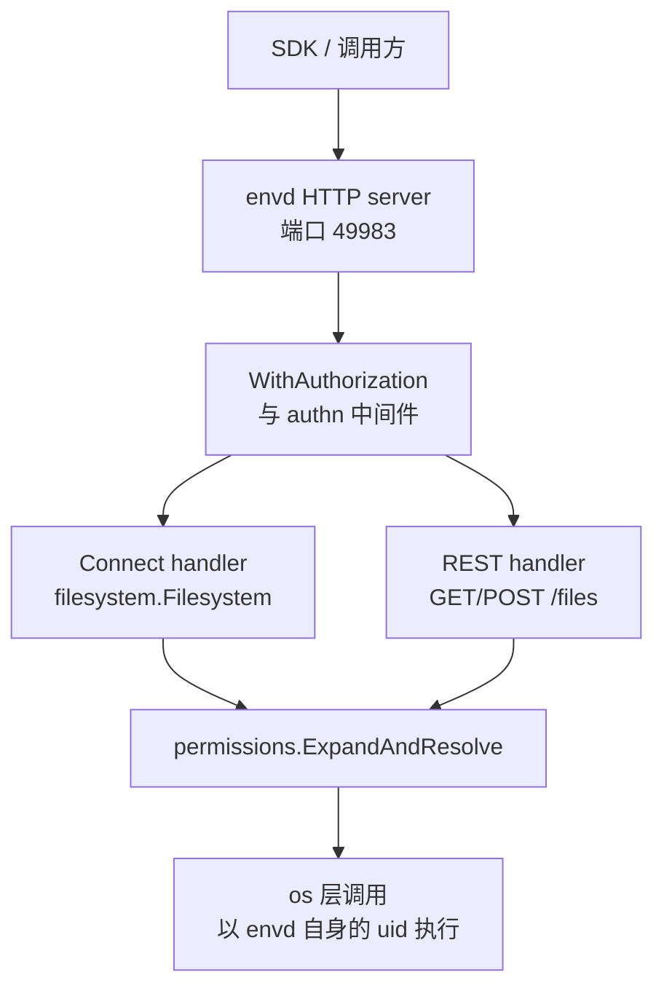
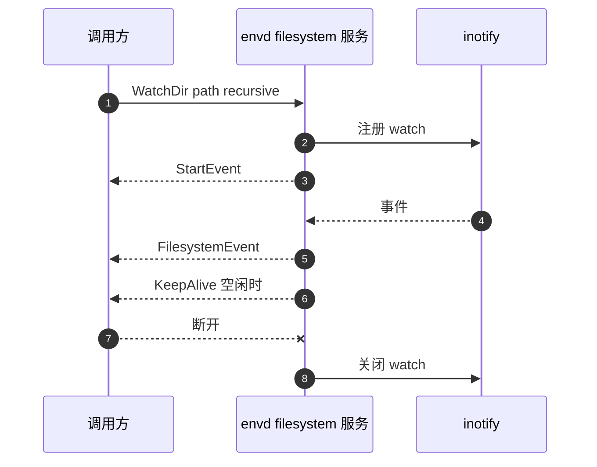
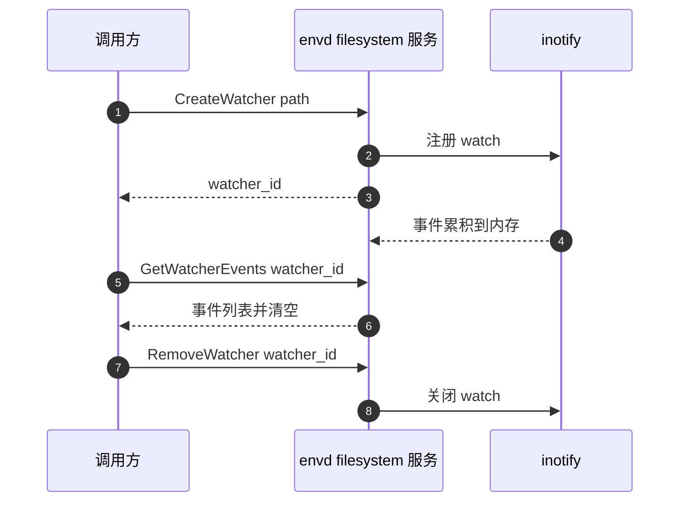

# 50 · 文件系统服务与文件接口

> 把文件送进沙箱、把结果取出来，是沙箱最高频的操作之一。envd 为此提供了两套接口：
> 一套 Connect-RPC 管元数据与目录结构，一套 REST 管字节流。本篇讲这两套接口各自的语义边界、
> 路径与用户是怎么解析的、目录监听为什么有流式与轮询两种模式，以及大文件在这条通路上的内存代价。
>
> **读者**：工程师、SDK 开发者。
> **预备**：[第 48 篇 · envd 总览](48-envd-overview.md)、[第 49 篇 · 进程服务](49-envd-process-service.md)。
> **代码**：`packages/envd/spec/filesystem/filesystem.proto`、`packages/envd/internal/services/filesystem/`、
> `packages/envd/internal/api/`、`packages/envd/spec/envd.yaml`、`packages/envd/internal/permissions/`

---

## 0. 本篇要回答的问题

1. 为什么文件操作被拆成 Connect-RPC 与 REST 两套接口？各自的边界在哪里？
2. 请求里的 `path` 与 `username` 经过哪些变换才落到真实的 inode 上？「以某个用户操作」到底意味着什么？
3. 一次多文件上传在 envd 里是怎么走的？失败发生在第三个文件时，前两个会怎样？
4. 目录监听为什么有 `WatchDir` 与 `CreateWatcher` 两套语义相同的接口？各自的丢事件风险在哪里？
5. `recursive` 监听的代价是什么？为什么网络文件系统上直接被拒绝？
6. 传一个 2 GiB 的文件，envd 会不会把它读进内存？哪些路径上有隐藏的内存放大？

---

## 1. 为什么是两套接口

先看只用一套会怎样。

如果全部走 Connect-RPC，文件内容就得放进 protobuf 的 `bytes` 字段。protobuf 的解码是一次性的：
一条消息要先在内存里凑齐才能反序列化，一个 500 MiB 的文件在 envd 里至少要占一份完整拷贝，
加上 Connect 层的缓冲往往不止一份。要避免这一点，就得自己把文件切成块、定义分块协议、
定义重传与顺序语义 —— 这实际上是在 HTTP 之上重新实现一遍 HTTP 已有的东西。

如果全部走 REST，元数据操作就得靠 URL 与 JSON 自己拼一套约定：`ListDir` 的深度参数、
`EntryInfo` 里的 owner / group / mode、`WatchDir` 的事件流，每一个都要定义编码、定义错误码，
而且 SDK 侧拿不到生成的类型。

上游 2026.09 的选择是按**载荷形态**切分：

| 维度 | Connect-RPC（`filesystem.proto`） | REST（`spec/envd.yaml` 的 `/files`） |
|---|---|---|
| 负责什么 | 元数据、目录结构、事件 | 文件内容的字节流 |
| 消息大小 | 小而结构化 | 与文件同量级 |
| 传输方式 | 一元或服务端流 | `multipart/form-data` 上传、`http.ServeContent` 下载 |
| 认证 | HTTP 头 `X-Access-Token` + Basic 用户名 | 头 `X-Access-Token` 或 URL 签名 |
| 代码位置 | `internal/services/filesystem/` | `internal/api/upload.go`、`internal/api/download.go` |

两者跑在**同一个 chi 路由器、同一个监听端口**上：`main.go` 先由
`filesystemRpc.Handle(m, &fsLogger, defaults)` 把 Connect handler 挂到 mux，再由
`api.HandlerFromMux(service, m)` 把 OpenAPI 生成的 REST 路由挂到同一个 mux，
最后统一包上 `service.WithAuthorization(...)` 与 authn 中间件。所以两套接口共享同一条鉴权链路，
差别只在 `internal/api/auth.go` 的 `authExcludedPaths` 把 `GET/files` 与 `POST/files` 排除在
access token 强校验之外 —— 它们改用签名校验，见 [§4.3](#43-签名与免-token-通道)。



## 2. 路径与用户：所有接口共用的前置变换

九个 RPC 与两个 REST 端点，第一步做的事完全一样：把请求里的 `path` 与「用户」变成一个绝对路径。
这一步集中在 `internal/permissions/path.go` 的 `ExpandAndResolve()`，三段：

1. `execcontext.ResolveDefaultWorkdir(path, defaultPath)`：请求里的路径为空串时，
   换成 `/init` 传进来的 `defaultWorkdir`（`internal/execcontext/context.go`）。
   注意这里只判断「空串」，不判断「相对路径」—— 默认工作目录不是相对路径的基准。
2. `expand()`：处理 `~` 前缀，展开成该用户的 `HomeDir`。`~otheruser/x` 这种形式被显式拒绝，
   返回 `cannot expand user-specific home dir`。
3. 绝对路径直接返回；相对路径**以用户的 home 目录为基准**做 `filepath.Join` 再 `filepath.Abs`。

第 3 点是容易踩到的地方：相对路径的基准是 home 目录，不是默认工作目录，也不是 envd 进程的 cwd。
`ExpandAndResolve` 里那行注释说明了 `filepath.Abs` 的用途 —— 让 `/home/user/../file` 这类路径
在字符串层面归一化。归一化是纯词法的，不看 symlink，所以它**不构成沙箱边界**：
`../../etc/passwd` 会被老老实实地解析成 `/etc/passwd`。

「用户」从哪里来，两套接口不同：

- Connect-RPC：`permissions.AuthenticateUsername()` 从 HTTP Basic Auth 的**用户名**字段取值
  （密码字段被忽略），查 `user.Lookup` 后塞进 authn 的上下文；各 RPC 用
  `permissions.GetAuthUser(ctx, s.defaults.User)` 取回。没带用户名时回落到 `/init` 设置的
  `defaultUser`（`main.go` 的初值是 `root`）。
- REST：从查询参数 `username` 取，`execcontext.ResolveDefaultUsername()` 做同样的回落。

关键结论：**这个「用户」不是执行身份**。整个 filesystem 服务与 `/files` 的 `os.Stat`、
`os.OpenFile`、`os.RemoveAll` 都由 envd 进程自己执行，而 envd 以 root 运行。
envd 全仓只有一处设置 `syscall.Credential`，在 `internal/services/process/handler/handler.go`，
属于进程服务。所以用户名在这里只有两个作用：**决定 `~` 与相对路径展开成什么**，
以及**决定新建文件与目录的属主**。它不做访问控制 —— 一个声明为普通用户的请求照样能读写 `/etc`。
真正的门禁在 HTTP 层的 access token 与签名。这个取舍与 e2b 的威胁模型一致：
沙箱边界是 microVM，不是沙箱内的 Unix 权限；代价是 envd 的鉴权一旦被绕过，沙箱内没有第二道防线。

## 3. 五个同步 RPC

`filesystem.proto` 里的九个方法，五个是普通的一元调用。

**`Stat`** 解析路径后调 `utils.go` 的 `entryInfo()`。这个函数用 `os.Lstat`，
所以对符号链接返回的是链接本身的信息，再单独处理链接目标：能解析就填
`symlink_target` 并用**目标**的类型与权限位覆盖 `type` 与 `mode`；解析不了就把 `type` 留成
`FILE_TYPE_UNSPECIFIED`、`mode` 留成 0。`permissions` 字段是 Go 的 `FileMode.String()`
（形如 `-rw-r--r--`），`owner` / `group` 走 `user.LookupId` 与 `user.LookupGroupId`，
查不到就退回数字字符串。`size` 是 `Lstat` 的结果 —— 对符号链接是链接路径的长度，不是目标的大小。

**`ListDir`** 有一个 `depth` 字段，`0` 被当作 `1`（只列直接子项）。实现在 `dir.go` 的 `walkDir()`：
先 `followSymlink()` 解析出真实目录，再 `filepath.WalkDir` 遍历，用相对路径里的分隔符个数算当前深度，
超过 `depth` 就返回 `filepath.SkipDir`。由于同一目录下的所有子项深度相同，
在第一个超深子项上剪枝等价于跳过整个目录的剩余部分，结果是对的。
返回的 `path` 字段被改写回**请求路径**下的形式（`filepath.Join(requestedPath, relPath)`），
而不是 symlink 解析后的真实路径 —— 调用方拿到的路径能原样再传回来。
遍历过程中消失的条目（`entryInfo` 返回 `CodeNotFound`）被跳过，不中断整次列举。

代价有两条。一是 `ListDir` 不是流式的：一次调用把所有 `EntryInfo` 攒在切片里一次返回，
`depth` 给大了就是一条巨大的 protobuf 消息。二是它跟随入口 symlink 但不跟随内部 symlink
（`WalkDir` 本身不跟随），所以同一棵树的两次不同入口可能给出不同的结果集。

**`MakeDir`** 先 `os.Stat` 判存在，已存在且是目录返回 `CodeAlreadyExists`，
已存在但不是目录返回 `CodeInvalidArgument`；然后调 `permissions.EnsureDirs()`。
后者在 `path.go` 里，把路径拆成从根开始的所有前缀，逐级 `os.Mkdir(subpath, 0o755)` 并
`os.Chown` 到目标 uid/gid。**只有新建的那几级被 chown**，已存在的层级不动。
返回的 `EntryInfo` 是手工拼的，只有 `name` / `type` / `path` 三个字段有值。

**`Move`** 对源与目标各做一次 `ExpandAndResolve`，用 `EnsureDirs` 保证目标父目录存在，
然后 `os.Rename`。`os.Rename` 是单次 `rename(2)`，**不跨文件系统**。
envd 支持通过 `/init` 的 `volumeMounts` 挂载 NFS（`internal/api/init.go` 的 `setupNfs`），
所以「把 home 里的文件移进挂载点」这种操作会失败。推论：失败以 `EXDEV` 形式出现，
既不是 `os.IsNotExist`，会被包成 `CodeInternal` 而不是一个可解释的错误码。

**`Remove`** 是一行 `os.RemoveAll`。它递归删除，且**对不存在的路径不报错**。
没有任何「这是目录，你确定吗」的确认；`Remove("/")` 在语义上会尝试删掉整个 rootfs。

## 4. REST `/files`

### 4.1 上传

`internal/api/upload.go` 的 `PostFiles()` 是全篇最长的一段控制流，顺序值得逐步看：

1. `a.validateSigning(...)` 做签名校验（[§4.3](#43-签名与免-token-通道)）。
2. `execcontext.ResolveDefaultUsername` 解析用户名；两个 `defer` 负责统一记一条 `File write` 日志。
3. `getDecompressedBody(r)`：按 `Content-Encoding` 决定是否套一层 `gzip.NewReader`。
   `internal/api/encoding.go` 只支持 `gzip` 与 `identity`，其它值直接 400。
4. `r.MultipartReader()`：**流式**读 multipart，不是 `ParseMultipartForm`。
   这一点决定了上传不会先落到临时文件或内存里再处理。
5. `user.Lookup` + `permissions.GetUserIdInts` 拿到 uid/gid。
6. 循环 `f.NextPart()`，每个 part 交给 `handlePart()`。

`handlePart()` 先跳过 `FormName() != "file"` 的 part —— 表单里其它字段被静默忽略。
然后 `resolvePath()` 决定这个 part 写到哪里，规则是：**查询参数 `path` 优先**；没有 `path` 时，
用 `utils.NewCustomPart(part).FileNameWithPath()` 从 `Content-Disposition` 里取 `filename`。
`internal/utils/multipart.go` 存在的唯一理由就是这个：标准库的 `Part.FileName()` 会做
`filepath.Base`，把目录部分丢掉；这里需要保留 `a/b/c.txt` 这样的相对路径，所以复制了一份实现，
去掉那次 `Base`。

由此得到多文件上传的两种用法：一次请求带多个 `file` part、不带 `path` 参数，
每个 part 的路径由自己的 `filename` 决定；或者一次一个文件，路径由查询参数给出。
两者混用时，**所有 part 会解析到同一个路径**，`resolvePath` 里那段线性扫描会检出重复并报错。
错误消息本身说明了后果：`only the first specified file was uploaded`。

`processFile()` 写盘的顺序有讲究：

- 先 `EnsureDirs` 建父目录；
- 若目标文件已存在，**先 chown 再打开**（`canBePreChowned`）。这样在 `O_TRUNC` 之前属主已经就位；
- `os.OpenFile(path, O_WRONLY|O_CREATE|O_TRUNC, 0o666)`；
- 若之前没 chown 过（新建文件），此时补一次 chown；
- `file.ReadFrom(part)` 把 part 的内容拷进去。

`ENOSPC` 被分两处捕获：打开文件时的 ENOSPC 被解释为 inode 耗尽，写入时的 ENOSPC 被解释为磁盘满，
两者都映射到 HTTP 507（`spec/envd.yaml` 里的 `NotEnoughDiskSpace`）。这是少见的把 507 用在
文件写入上的设计，好处是调用方能把「沙箱盘满」与「envd 出错」区分开。

**部分失败的语义**：循环里任何一个 part 失败，`PostFiles` 立即 `jsonError` 并 `return`，
但前面已经写完的文件**留在盘上**，而且响应体是错误 JSON，调用方拿不到已成功的列表。
成功路径下响应是一个 `EntryInfo` 数组，每项只有 `path` / `name` / `type`（恒为 `file`）。

### 4.2 下载

`internal/api/download.go` 的 `GetFiles()`：签名校验 → 解析用户名 → `ExpandAndResolve` →
`os.Stat`（不存在 404、是目录 400）→ 内容编码协商 → `os.Open` → 输出。

编码协商在 `encoding.go` 里按 RFC 7231 §5.3.4 实现得相当完整：解析 `q` 值、按质量排序、
处理 `identity;q=0` 与 `*;q=0` 的组合，判断 identity 是否被显式拒绝。
但真正支持的编码只有 `gzip` 一种（`SupportedEncodings`）。

有一条关键的降级规则：请求带 `Range`、`If-Modified-Since`、`If-None-Match`、`If-Range`
中任何一个时，**强制回落到 identity**，因为压缩后的字节偏移与文件偏移对不上，
`http.ServeContent` 的 206 / 304 语义会失效。如果此时客户端又用 `Accept-Encoding` 拒绝了
identity，返回 406。

两条输出路径：gzip 路径自己设 `Content-Encoding` 与按扩展名猜的 `Content-Type`，
然后 `io.Copy` 进 `gzip.Writer`；identity 路径交给 `http.ServeContent`，
由标准库负责 `Content-Type` 嗅探、`Range` 处理、`Last-Modified` 与条件请求。
所以**断点续传只在不压缩时可用**。两条路径都会先设
`Content-Disposition: inline; filename="<base>"`，`Vary: Accept-Encoding` 也总是设置。

### 4.3 签名与免 token 通道

`internal/api/auth.go` 的 `WithAuthorization()` 是全局中间件：只要 access token 被 `/init` 设置过，
所有请求都要带匹配的 `X-Access-Token`，例外是 `authExcludedPaths` 里的四条 ——
`GET/health`、`GET/files`、`POST/files`、`POST/init`。

前三条里的 `/files` 之所以豁免，是因为它们要支持**在 URL 里带凭据**的用法：
浏览器里点一个下载链接、把链接交给第三方去取，都没法加自定义头。
`validateSigning()` 因此提供了第二条路径：

- 若 access token 未设置，直接放行；
- 若请求头里带了 token 且匹配，放行；
- 否则要求查询参数 `signature`，用 `generateSignature()` 算期望值比对。

签名的构造是 `path:operation:username:token` 用 `:` 拼接后做 SHA-256，
带过期时间时再追加一个 Unix 时间戳字段，结果加 `v1_` 前缀
（`packages/shared/pkg/keys` 的 `NewSHA256Hashing`）。`operation` 是 `read` 或 `write`，
于是同一个路径的读签名不能拿去写。过期时间是签名内容的一部分，改了时间戳签名就失配，
所以不需要额外的完整性保护。

代价有三条，都值得写在文档里。其一，签名里没有随机数，同一 `(path, op, user, exp)`
的签名是确定值，泄漏即可复用到过期为止。其二，`signature_expiration` 可以省略，
省略时签名**永不过期**。其三，`WithAuthorization` 的白名单是按
`req.Method + req.URL.Path` 精确匹配的字符串，路径必须恰好是 `/files`。

## 5. 目录监听：一个机制、两种接口

### 5.1 底层：inotify 与递归的代价

两种接口的底层都是 `github.com/e2b-dev/fsnotify`（e2b 的分叉），Linux 上就是 inotify。
inotify 的一条硬约束是：**一个 watch 只覆盖一个目录，不覆盖子目录**。
要递归监听，就得对每个子目录各注册一个 watch，并且在新目录被创建时补注册。

上游把这件事包成了一个约定：`internal/utils/rfsnotify.go` 的 `FsnotifyPath()`
在 `recursive` 为真时给路径拼上 `...` 后缀，交给分叉版 fsnotify 去理解。

```go
func FsnotifyPath(path string, recursive bool) string {
	if recursive {
		return filepath.Join(path, "...")
	}
	return path
}
```

分叉版 fsnotify 的源码不在本书的代码基线里。推论：它按上述方式为每个子目录建立 watch，
并在收到目录创建事件时增量补注册 —— SDK 侧有一个专门覆盖「开始监听之后再新建嵌套目录」
的用例（`e2b/tests/.../test_watch.py` 的 `test_watch_recursive_directory_after_nested_folder_addition`），
说明这条路径是被支持的。

递归的代价直接体现在内核资源上：watch 数与目录数同阶，受 `fs.inotify.max_user_watches` 限制。
模板构建时的 `packages/orchestrator/internal/template/build/phases/base/provision.sh`
把这个值调到 `65536`，正是为此。对 `node_modules` 这种目录树，一次递归监听就可能吃掉几万个 watch。
第二个代价是事件队列：inotify 的每实例队列有上限，消费不及时会溢出并丢事件，
而 fsnotify 只能把溢出报成一个错误。

监听前还有两道检查（`watch.go` 与 `watch_sync.go` 里各写了一遍）：路径必须存在且是目录；
路径不能在网络文件系统上。后者由 `utils.go` 的 `IsPathOnNetworkMount()` 用
`syscall.Statfs` 比对魔数实现，拒绝 NFS、CIFS、SMB、SMB2 与 FUSE。
原因是 inotify 只看本地 VFS 的事件：另一台机器对 NFS 共享的修改不会产生任何事件，
监听会「成功」但永远静默。与其给一个静默失效的接口，不如在入口就返回 `CodeInvalidArgument`。
这项检查在 envd 支持 NFS volume 之后是必要的。

### 5.2 WatchDir：服务端流

`watch.go` 的 `watchHandler()` 在检查通过后创建 watcher（`defer w.Close()`，
生命周期绑在这次 RPC 上），先发一条 `StartEvent`，然后进 `select` 循环：

- `w.Events`：一条 fsnotify 事件可能带多个操作位，代码逐位检查
  Create / Rename / Chmod / Write / Remove，**为每一位发一条独立的 `FilesystemEvent`**。
  事件的 `name` 是相对被监听目录的路径（`filepath.Rel`）。
- `w.Errors`：任何 watcher 错误都终止整条流。
- keepalive ticker：`permissions.GetKeepAliveTicker()` 读请求头 `Keepalive-Ping-Interval`
  （秒），解析失败时用 90 秒默认值；到点发一条 `KeepAlive` 消息。每发一条真实事件后
  `resetKeepalive()` 重置计时，所以 keepalive 只在真正空闲时出现。
- `ctx.Done()`：客户端断开即结束。

keepalive 的存在理由是中间的代理链：orchestrator 与 client-proxy 都有空闲超时，
一条几小时没有文件变动的监听流会被中途掐断（[第 36 篇 §2](36-orchestrator-proxy-and-envd-client.md#2-通道一orchestrator-里的沙箱代理)）。

这个模式的语义很干净 —— 事件推送、无轮询延迟、断开即释放 —— 代价是**它要求调用方能维持一条长连接**。
Python 的同步 SDK、无服务器环境里的短生命周期函数都做不到。

### 5.3 CreateWatcher：服务端保存状态的轮询

`watch_sync.go` 提供了另一套：`CreateWatcher` / `GetWatcherEvents` / `RemoveWatcher`。

`CreateFileWatcher()` 做了一件关键的事：

```go
// We don't want to cancel the context when the request is finished
ctx, cancel := context.WithCancel(context.WithoutCancel(ctx))
```

`context.WithoutCancel` 切断了与请求上下文的关联，于是后台 goroutine 在
`CreateWatcher` 这次 RPC 返回之后继续活着，把事件累积进 `FileWatcher.Events`（由 `Lock` 保护）。
watcher 以 `"w" + id.Generate()` 为键存进 `Service.watchers`（`utils.Map`，包了 `sync.Map`）。

`GetWatcherEvents` 是**取走并清空**：加锁、把切片交出去、把字段重置为空切片。
所以两个客户端轮询同一个 watcher 会互相抢事件。`RemoveWatcher` 关闭 fsnotify watcher 并 `cancel()`，
再从 map 里删除。

这套接口把「谁来保存尚未消费的事件」从连接挪到了服务端，代价有三条：

1. **无界积压。** `Events` 切片没有上限。创建一个 watcher 后不再轮询，
   事件会一直堆在 envd 的堆上直到沙箱结束。
2. **泄漏。** 只有显式的 `RemoveWatcher` 会清理，没有超时回收，也没有与任何会话绑定。
   客户端崩溃后，watcher 与它占用的 inotify watch 一直留着。
3. **错误的可见性延后。** 后台 goroutine 把错误写进 `fw.Error` 就 `return`，
   调用方要到下一次 `GetWatcherEvents` 才看得到；那次调用会直接返回错误，
   而**已经积累但尚未取走的事件被一起丢弃**（代码先判 `w.Error != nil` 再读 `Events`）。

另外两处细节：`GetWatcherEvents` 与 `RemoveWatcher` 都**不做用户与路径校验**，
只认 watcher ID；`fw.Error` 的写入在 goroutine 里、读取在 RPC 里，没有共用 `fw.Lock`
（`Lock` 只保护 `Events`）。推论：这是一处数据竞争，实践中因为只写一次且随后 goroutine 退出，
表现为错误可能晚一轮才被看到。

流式的 `WatchDir` 一路把事件推给调用方（`C` 调用方、`E` envd filesystem 服务、`K` inotify）：



轮询的一套则把事件先攒在 envd 内存里，等调用方来取：



两套接口在客户端的选择由 SDK 决定：异步 SDK 用 `WatchDir` 的流，同步 SDK 用
`CreateWatcher` 加轮询。两者都要求模板里的 envd 不低于 `0.1.4` 才允许 `recursive=true`
（`e2b/envd/versions.py` 的 `ENVD_VERSION_RECURSIVE_WATCH`），版本协商的机制见
[第 52 篇 §4](52-envd-legacy-and-sdk-compat.md#4-版本协商envd-版本存在哪里)。

## 6. 大文件与内存

把上面几条串起来看内存占用，结论是：**字节流路径是流式的，元数据路径不是**。

上传：`r.MultipartReader()` 逐 part 读，`file.ReadFrom(part)` 在 part 不是 `*os.File` 时
走 Go 的通用拷贝循环，缓冲区是常数量级。gzip 请求体多一层 `gzip.Reader` 的窗口，也是常数。
所以传 2 GiB 文件时 envd 的常驻内存不随文件大小增长，瓶颈在磁盘与网络。

下载：identity 路径是 `http.ServeContent`，内部用固定缓冲；gzip 路径是 `io.Copy` 加
`gzip.Writer`。同样是常数内存。

真正会放大的是三处：

- **`ListDir` 的响应**。所有 `EntryInfo` 先在 `walkDir` 里攒成切片，再序列化成一条 protobuf 消息。
  一个几十万条目的目录树配上大 `depth`，这条消息本身就是几十 MiB，而且序列化时至少还要一份编码缓冲。
  代码里没有任何条目数上限。
- **`FileWatcher.Events` 的积压**（[§5.3](#53-createwatcher服务端保存状态的轮询)）。
- **`getFileOwnership` 的查表**。每个条目做两次 `user.LookupId` / `user.LookupGroupId`，
  在没有 nss 缓存的沙箱里，这是每条目两次 `/etc/passwd`、`/etc/group` 的解析。
  推论：这不放大内存但放大 `ListDir` 的耗时，且与条目数成正比。

还有一条不在 envd 里但影响端到端行为的：`/files` 的上传与下载要穿过 client-proxy 与
orchestrator 的代理链（[第 53 篇 §5](53-client-proxy-edge.md#5-转发交给共享代理库)、
[第 36 篇 §2](36-orchestrator-proxy-and-envd-client.md#2-通道一orchestrator-里的沙箱代理)），
超时与体积限制以那一层的口径为准，envd 自身对请求体大小不设上限
——`main.go` 把 `ReadTimeout` 与 `WriteTimeout` 都置为 0，只留 `IdleTimeout` 为 640 秒。

## 7. ARM 适配版的差异

本篇涉及的代码在 ARM 适配版里没有逻辑改动：补丁对 `packages/envd/` 只触及 `Makefile`
（把写死的 `GOARCH=amd64` 换成按 `uname -m` 推导）与 `internal/host/mmds.go`，
`internal/services/filesystem/`、`internal/api/` 与 `internal/permissions/` 两个基线逐字节相同。
唯一有间接影响的是模板基础层：ARM 适配版的 `provision.sh` 去掉了 `fuse3` 与 `nfs-common`，
`/init` 的 `volumeMounts` 挂载 NFS 因此在该形态下不可用，`Move` 跨挂载点失败的场景也就不会出现
（见 [第 74 篇 §4](74-template-build-on-arm.md#4-openeuler-guestprovisionsh)）。

## 8. 小结

- 文件操作按载荷形态分成两套接口：Connect-RPC 管元数据与事件，REST `/files` 管字节流；
  两者挂在同一个 chi mux、同一个端口、同一条鉴权链上。
- 所有接口的第一步都是 `permissions.ExpandAndResolve()`：空路径回落到默认工作目录，
  `~` 展开到 home，相对路径以 **home 目录**为基准，归一化是纯词法的，不构成沙箱边界。
- 请求里的用户名只决定路径展开与新建文件的属主，**不是执行身份** ——
  filesystem 服务的所有系统调用都以 envd 自身（root）执行，访问控制完全落在 access token 与签名上。
- `ListDir` 跟随入口 symlink、不跟随内部 symlink，返回路径改写回请求路径形式；
  `Remove` 是 `RemoveAll`，递归且对不存在的路径不报错；`Move` 是单次 `rename`，不跨文件系统。
- 上传是流式 multipart：路径来自查询参数或 part 的 `filename`（保留目录部分，为此复制了标准库实现）；
  多个 part 解析到同一路径会报错；中途失败时先前写成的文件留在盘上，且响应里拿不到成功列表。
- 下载实现了完整的 `Accept-Encoding` 协商但只支持 gzip；带 `Range` 或条件头时强制回落到 identity，
  因此断点续传与压缩互斥。
- `/files` 被排除在 access token 强校验之外，改用 `path:operation:username:token[:exp]` 的
  SHA-256 签名；签名无随机数、过期时间可省略。
- 目录监听底层是 inotify，递归靠对每个子目录各注册一个 watch，代价与目录数同阶，
  模板把 `fs.inotify.max_user_watches` 调到 65536；网络文件系统上的监听在入口被拒绝，
  因为 inotify 看不到远端修改。
- `WatchDir` 是服务端流，事件即时推送、带可配置的 keepalive、断开即释放；
  `CreateWatcher` 把未消费事件存在服务端，适合无长连接的客户端，代价是无界积压、
  无超时回收，以及出错时把已积累的事件一并丢弃。
- 字节流路径的内存占用与文件大小无关；会随规模放大的是 `ListDir` 的一次性响应与
  watcher 的事件积压。

## 延伸阅读 / 下一篇

- [第 48 篇 §4](48-envd-overview.md#4-init-在-envd-侧做了什么)：启动、`/init`、access token 的来源与三条对外通道。
- [第 49 篇 §7](49-envd-process-service.md#7-以谁的身份在哪里带什么环境跑)：同一套 Connect-RPC 框架下的另一个服务，
  以及唯一一处真正切换执行身份的地方。
- [第 51 篇 §3](51-envd-ports-permissions-metrics.md#3-权限模型)：`internal/permissions/` 的完整讲法。
- [第 52 篇 §2](52-envd-legacy-and-sdk-compat.md#2-legacy-包做了什么)：`EntryInfo` 字段在新旧协议间的转换与版本协商。
- [第 36 篇 §2](36-orchestrator-proxy-and-envd-client.md#2-通道一orchestrator-里的沙箱代理)：上传下载与监听流经过的代理链与超时口径。
- [第 16 篇 §5](16-auth-and-multitenancy.md#5-hash-seed-与沙箱级-token)：签名所依赖的 access token 是怎么派生出来的。
- inotify 的语义与限制：`inotify(7)`；fsnotify 的跨平台抽象：<https://github.com/fsnotify/fsnotify>
