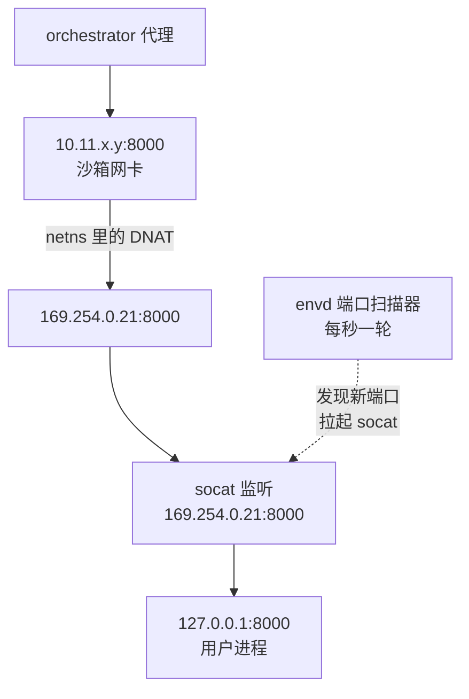

# 51 · 端口、权限与指标

> envd 除了跑进程和读写文件，还做三件容易被忽略的事：把沙箱内监听的端口暴露到外面、
> 决定每个请求以哪个 guest 用户执行、以及把 guest 内的资源用量报给宿主。
> 三件事共用同一个前提 —— envd 是 guest 里唯一以 root 运行的对外代办进程。
>
> **读者**：工程师、系统工程师。
> **预备**：[第 48 篇 · envd 总览](48-envd-overview.md)、[第 35 篇 · 沙箱网络](35-sandbox-networking.md)。
> **代码**：`packages/envd/internal/port/`、`packages/envd/internal/permissions/`、
> `packages/envd/internal/services/cgroups/`、`packages/envd/internal/api/`、
> `packages/envd/internal/host/metrics.go`、`packages/orchestrator/internal/sandbox/metrics.go`

---

## 0. 本篇要回答的问题

1. 用户在沙箱里 `python -m http.server` 监听 `127.0.0.1:8000`，外面为什么能访问到？这条路是谁铺的、代价多少？
2. 一个请求「以某个用户的身份」执行，这句话在内核层面到底落成了什么？哪些操作其实没有落成？
3. envd 在 guest 内部建的那几个 cgroup 各管什么，为什么用 `memory.high` 而不是 `memory.max`？
4. `/metrics` 的每个字段从哪里来？其中的 CPU 百分比统计的是哪一段时间？
5. 这些数字怎么变成 orchestrator 的时间序列，中间有哪些门槛？

---

## 1. 一个前提：guest 里只有 envd 有特权，也只有它对外可见

沙箱的网络布局在 [第 35 篇 §2](35-sandbox-networking.md#2-建立一个槽位createnetwork-的完整步骤) 里讲过：每个槽位有一个宿主侧 IP
（`10.11.x.y`，`Slot.HostIPString()`），netns 里有一条 iptables DNAT 规则把发往这个 IP 的包
改写到 `169.254.0.21`，也就是 guest 的 `eth0`
（`packages/orchestrator/internal/sandbox/network/network.go`，`Slot.NamespaceIP()`）。
反方向有一条对应的 SNAT。于是宿主看到的「这台沙箱」就是一个 IP，而 guest 里能被这个 IP 命中的，
只有绑在 `0.0.0.0` 上的监听套接字。

envd 正好是这样一个进程。它由 systemd 拉起，单元文件模板是
`packages/orchestrator/internal/template/build/core/rootfs/files/envd.service.tpl`，
里面写着 `User=root`、`Group=root`、`Restart=always`、`OOMScoreAdjust=-1000`，
`main.go` 把 HTTP 服务器绑在 `0.0.0.0:49983`。root 身份不是可有可无的装饰：
后面会看到 envd 要给别的进程写 `/proc/<pid>/oom_score_adj`、要 `chown` 任意文件、
要调 `unix.ClockSettime` 校时、要在 `/sys/fs/cgroup` 下建目录、要在 `fork` 时切换 uid/gid。
这些都需要 root 或对应的 capability。

由此推出本篇三个主题的问题形态：

- 用户自己起的服务通常绑在 `127.0.0.1`，DNAT 过来的包目的地址是 `169.254.0.21`，**打不中**。
- 请求来自沙箱外部，外部只知道「用户名」这样一个字符串，envd 必须把它翻译成内核认得的 uid/gid。
- 宿主只能看到 Firecracker 进程占了多少内存、多少 CPU 时间，看不到 guest 内核眼里的用量。

三个问题，三套机制。

---

## 2. 端口扫描与转发

### 2.1 谁在给谁铺路

`internal/port/forward.go` 的文件头注释把意图写得很直白：周期性扫描 `127.0.0.1` 上打开的 TCP 端口，
为每一个端口在后台拉起一个 `socat`，把 `169.254.0.21:port` 的流量转到 `127.0.0.1:port`。
那个网关地址是 `forward.go` 里的 `defaultGatewayIP = net.IPv4(169, 254, 0, 21)`。
`startPortForwarding()` 拼出来的命令形态是：

```bash
socat -d -d -d TCP4-LISTEN:4000,bind=169.254.0.21,reuseaddr,fork TCP4:localhost:4000
```

`socat` 是模板基础层装进去的（`packages/orchestrator/internal/template/build/phases/base/provision.sh`
的 `PACKAGES` 列表），不是运行时下载的。

这条机制最常被用到的地方是 code-interpreter 模板：Jupyter Server 绑在 `localhost:8888`，
外层的 uvicorn 应用绑在 `0.0.0.0:49999`。前者只对沙箱内可见、由这里的扫描器兜住，
后者因为直接绑通配地址而不需要 socat；SDK 访问的正是 `49999-<sandboxID>.<domain>`
（[第 52 篇 §5](52-envd-legacy-and-sdk-compat.md#5-code-interpreter在-envd-之上跑-jupyter)、
[第 83 篇 §6](83-sdk-adaptation.md#6-code-interpreter-模板与-49999)）。

铺好之后，一条外部请求的完整路径是：client-proxy 按 `<port>-<sandboxID>.<domain>` 解析出端口和沙箱，
转给该沙箱所在节点的 orchestrator 代理，orchestrator 代理连 `10.11.x.y:port`，DNAT 到 `169.254.0.21:port`，
落在 socat 上，socat 再连 `127.0.0.1:port` 交给用户进程
（[第 53 篇 §3](53-client-proxy-edge.md#3-域名解析从-host-头到-sandboxid-与端口)、
[第 36 篇 §2](36-orchestrator-proxy-and-envd-client.md#2-通道一orchestrator-里的沙箱代理)）。



代价先说清楚：**每一个被转发的端口多一个进程、多一跳用户态拷贝**。socat 在两个套接字之间来回搬字节，
延迟和吞吐都要付账。收益是用户完全不需要知道 `169.254.0.21` 的存在，
写 `app.run(host="127.0.0.1")` 也能被外面访问到。

### 2.2 扫描器：一秒一轮的全量快照

`internal/port/scan.go` 的 `Scanner` 是一个极简的发布订阅结构：一张订阅者表、一个退出通道、一个周期。
`ScanAndBroadcast()` 的循环体只有三步 —— 调 `gopsutil` 的 `net.Connections("tcp")` 取全量连接快照，
挨个 `sub.Signal(processes)` 广播，然后 `time.Sleep(period)`。周期在 `main.go` 里是
`portScannerInterval = 1000 * time.Millisecond`。

过滤在订阅侧做。`scanSubscriber.go` 的 `Signal()` 逐条调 `ScannerFilter.Match()`，
`scanfilter.go` 的匹配条件是「本地 IP 在列表里**且**状态字符串相等」。
唯一的订阅者是转发器，它注册的过滤器是 `IPs: {"127.0.0.1", "localhost", "::1"}` 加 `State: "LISTEN"`。
两个直接后果：只转发**监听**套接字，不管已建立的连接；只转发绑在回环地址上的，
用户自己绑 `0.0.0.0` 的端口不会被 socat 抢占，DNAT 之后本来就能打中。

有几处设计上的粗糙值得如实指出：`Scanner` 结构里的 `Processes` 通道从未被写入或读取，是一个残留字段；
`Signal()` 往**无缓冲**通道发送，也就是说扫描循环会阻塞到转发器处理完这一轮，
实际周期是「1 秒 + 一轮处理时间」，不是精确的 1 秒；`Unsubscribe()` 会关闭订阅者的通道，
若此时扫描循环正在发送就会 panic，不过上游没有任何地方调用它。
`net.Connections("tcp")` 的错误被直接丢弃（`processes, _ := …`），一轮取不到就当作「一个端口都没有」，
表现为把当轮所有转发全部停掉。
`Destroy()` 只关闭 `scanExit`，而循环体的顺序是「扫描 → 广播 → 检查退出 → 睡眠」：
退出信号若落在睡眠期间，还要再跑完一整轮扫描与广播才会被看到。

### 2.3 转发器：两遍标记法

`Forwarder.StartForwarding()` 维护一张 `map[string]*PortToForward`，键是 `"<pid>-<port>"`。
每收到一轮快照就跑一次三段式：先把表里所有条目标成 `DELETE`；
再遍历本轮快照，已存在的改回 `FORWARD`，不存在的新建条目并 `startPortForwarding()`；
最后把仍是 `DELETE` 的条目 `stopPortForwarding()`。这是一个标准的标记清除，
它的语义是「表的内容 = 上一轮快照」，不需要 diff，也不需要额外的事件源。

启停两端各有一个细节。启动时 `SysProcAttr` 里设了 `Setpgid: true`，
停止时 `syscall.Kill(-pid, SIGKILL)` 杀的是整个进程组 —— 因为 socat 带 `fork`，
每来一条连接会派生子进程，只杀父进程会留下孤儿。
命令行里的 `reuseaddr` 是为了让快速重启的 socat 不撞上 `Address already in use`，代码注释写明了这一点。
另外 `startPortForwarding` 把 socat 放进了 `ProcessTypeSocat` 对应的 cgroup，见 [§4](#4-guest-里的-cgroup)。

键里带 pid 意味着**同一个端口换了进程会被当成新端口**：旧条目在这一轮被标记删除，
新条目被创建，socat 重启一次。对于「服务重启」这种常见场景，这是想要的行为。

### 2.4 轮询的代价

`net.Connections("tcp")` 在 Linux 上的实现不是读一个文件就完事。gopsutil v4 的
`connectionsPidMaxWithoutUidsWithContext` 在 pid 为 0（全量）时先调 `getProcInodesAllWithContext`：
枚举 `/proc` 下所有 pid，对每个 pid 打开 `/proc/<pid>/fd` 目录，
对目录里每一个 fd 做一次 `readlink`，挑出形如 `socket:[12345]` 的，建立 inode 到 pid/fd 的映射；
之后才去解析 `/proc/net/tcp` 与 `/proc/net/tcp6`，按 inode 关联回进程。

也就是说，**每秒一次全量 `readlink` 遍历沙箱内所有进程的所有文件描述符**。
一个只跑几个进程的沙箱这点开销可以忽略；一个跑着几百个进程、每个进程开着几十个 fd 的沙箱，
这就是一笔持续的固定成本，且完全花在「大多数轮次什么都没变」上。
**推论：** 这是用轮询换实现简单 —— 内核侧有 `inet_diag` 之类的接口可以直接列监听套接字，
不需要遍历 fd，但那要么多引一个依赖，要么自己写 netlink。
上游选了通用库加固定周期，代价是恒定的后台开销与最多 1 秒的端口发现延迟。

---

## 3. 权限模型

### 3.1 四个层次

外部请求要在 guest 里做事，中间隔着四道东西，它们解决的问题完全不同，很容易被混为一谈。

| 层次 | 载体 | 校验位置 | 管什么 |
|---|---|---|---|
| 连接门禁 | `X-Access-Token` 头 | `internal/api/auth.go` 的 `WithAuthorization` | 能不能跟这个 envd 说话 |
| 免签名放行 | 查询参数 `signature`、`signature_expiration` | `auth.go` 的 `validateSigning` | 无 token 的一次性文件读写 |
| 请求用户 | HTTP Basic Auth 的用户名部分 | `permissions.AuthenticateUsername` | 这次操作算在谁头上 |
| 默认用户 | `defaults.User` | `permissions.GetAuthUser` | 没指定用户时算在谁头上 |

第一层是唯一的门禁。`WithAuthorization` 只在 access token 已设置时生效，
豁免清单 `authExcludedPaths` 里只有 `GET/health`、`GET/files`、`POST/files`、`POST/init`；
其中两个 `/files` 由签名机制自己兜底，`/init` 由 MMDS 哈希兜底
（[第 36 篇 §4](36-orchestrator-proxy-and-envd-client.md#4-access-token-的换发mmds-哈希)）。
`/metrics` 与 `/envs` 都不在豁免清单里，token 一旦设置就必须带。
所有 Connect-RPC 路径同样在保护范围内。

第三层不是认证。`AuthenticateUsername` 从 Basic Auth 里取用户名，**忽略密码**，
`user.Lookup` 查得到就返回 `*user.User`，查不到才报错；没带用户名时它返回 `nil, nil`，
把事情交给 `GetAuthUser` 去取默认用户。换句话说，只要通过了第一层门禁，
调用方可以随便声称自己是 guest 里的任何一个用户。这是刻意的：
沙箱里的用户不是租户边界，token 才是。

默认用户的初值是 `main.go` 的常量 `defaultUser = "root"`，注释说它「应当总是在构建模板时被 `/init` 覆盖」。
覆盖点在 `internal/api/init.go` 的 `SetData()`：`DefaultUser` 非空则写进 `a.defaults.User`，
`DefaultWorkdir` 同理。所以一台正常创建的沙箱里，不带用户名的请求跑在模板声明的默认用户下，
而不是 root；只有当 `/init` 没送 `defaultUser` 时才退回 root。

### 3.2 setuid / setgid 落在哪里

只有**创建进程**这一条路径真的切换了内核身份。`internal/services/process/handler/handler.go`
的 `New()` 用 `permissions.GetUserIdUints()` 把 `*user.User` 里的 uid、gid 字符串解析成 `uint32`，
再用 `user.GroupIds()` 取附加组列表，一并填进 `syscall.SysProcAttr.Credential`：

```go
cmd.SysProcAttr = &syscall.SysProcAttr{
    UseCgroupFD: ok,
    CgroupFD:    cgroupFD,
    Credential: &syscall.Credential{
        Uid: uid, Gid: gid, Groups: groups,
    },
}
```

真正的 `setgroups` / `setgid` / `setuid` 由 Go 运行时在 `fork` 之后、`exec` 之前执行，
顺序由标准库保证。附加组取不到只记一条 warning，进程照常以主组启动。
`permissions.GetUserIdInts` 是同一件事的 `int` 版本，供 `chown` 使用。
进程侧的其余细节（工作目录展开、环境变量拼装、`Connect` 不校验属主）在
[第 49 篇 §7](49-envd-process-service.md#7-以谁的身份在哪里带什么环境跑) 里已经展开，这里不重复。

**文件路径完全不同。** REST 的 `/files` 与 Connect-RPC 的文件系统服务都**没有**切换身份：
`internal/api/download.go` 的 `GetFiles` 解析出用户之后，只拿它做两件事 ——
`permissions.ExpandAndResolve` 用 `user.HomeDir` 展开 `~` 和相对路径，
以及日志里记一个 `username` 字段；随后的 `os.Stat`、`os.Open` 都是 envd 自己（root）在做。
上传侧 `internal/api/upload.go` 的 `processFile` 也是 root 写文件，
只是写完（或写前）调 `os.Chown(path, uid, gid)` 把属主改成请求用户，
父目录由 `permissions.EnsureDirs` 逐级 `os.Mkdir(0o755)` 加 `os.Chown` 补齐。
`internal/services/filesystem/` 下的 `ListDir`、`MakeDir`、`Move`、`Remove` 同样是
「用用户解析路径、用 root 执行操作」（见 [第 50 篇 §2](50-envd-filesystem-service.md#2-路径与用户所有接口共用的前置变换)）。

这条区别的后果要说清楚：**文件接口不受 guest 文件权限位约束**。
以 `user` 身份请求读一个 `0600 root` 的文件会成功，因为真正调 `open` 的是 root。
路径展开里唯一的硬约束是 `permissions.expand` 拒绝 `~other` 形式，
理由是「无法展开针对其他用户的家目录」，这是实现限制，不是安全边界。

### 3.3 这个模型不是什么

把上面几条合起来，envd 的权限模型可以概括成一句话：
**用户是「以谁的身份跑进程、文件归谁所有、相对路径从哪里算起」的参数，不是访问控制主体。**
沙箱内的多用户不构成信任边界，唯一的边界是 access token 和沙箱本身。
这与 e2b 的整体假设一致 —— 一台沙箱属于一个调用方，沙箱内没有需要互相防备的两方。
代价是：如果有人想在一台沙箱里跑两份互不信任的代码，envd 提供不了任何隔离。

---

## 4. guest 里的 cgroup

### 4.1 三类进程，三组旋钮

`internal/services/cgroups/` 是一个很小的包：`iface.go` 定义 `Manager` 接口（只有
`GetFileDescriptor` 与 `Close`）和三个进程类型常量，`cgroup2.go` 是真实实现，
`noop.go` 是永远返回「没有 fd」的空实现。配置全在 `main.go` 的 `createCgroupManager()` 里：

| 进程类型 | 目录 | 属性 | 用意 |
|---|---|---|---|
| `pty` | `<root>/ptys` | `cpu.weight=200` | 交互式终端要跟手 |
| `socat` | `<root>/socats` | `cpu.weight=150`、`memory.min=5 MiB`、`memory.low=8 MiB` | 端口转发不能在内存压力下先死 |
| `user` | `<root>/user` | `memory.high=MemTotal-预留`、`cpu.weight=50` | 用户代码不能把整机吃干 |

`<root>` 由 `-cgroup-root` 参数指定，默认 `/sys/fs/cgroup`。预留量的算法写在
`createCgroupManager()` 里：取内存总量的 1/8，但不超过 128 MiB，两者取小。
内存总量来自 `host.GetMetrics()` —— 也就是说 `/metrics` 的采集函数在启动时还兼了一次容量规划的差事。

三个 `cpu.weight` 的排序意图（PTY > socat > 默认 100 > 用户代码）在代码注释里写着，
但 **推论：** 这个比较未必成立。`envd.service` 里写的是 `Delegate=yes` 与 `CPUWeight=1000`，
也就是说 envd 自己位于 `system.slice/envd.service` 之下；而 `Cgroup2Manager` 是在
`-cgroup-root`（默认 `/sys/fs/cgroup`）下直接建目录，这三个 cgroup 是 `system.slice` 的兄弟，
不是 `envd.service` 的子级。`cpu.weight` 只在同层兄弟之间比较，
代码注释里那句「less than envd」跨了层级，拿不到保证。这一条没有在代码或测试里得到确认。

`memory.high` 与 `memory.max` 的区别是这里的关键选择：`memory.high` 是**软限**，
超过之后内核对该 cgroup 施加回收压力并节流分配，但不触发 OOM kill；`memory.max` 是硬限，
超了就杀。上游选软限，意思是「用户代码可以慢，但不要莫名其妙地被杀掉」。
配套的一手在别处：`handler.Start()` 给每个用户进程写 `oom_score_adj = 100`
（`handler/oom.go` 的 `adjustOomScore`），而 envd 自己的单元文件里是 `OOMScoreAdjust=-1000`。
真到了全局 OOM，内核先挑用户进程，最后才轮到 envd。
socat 那组 `memory.min` / `memory.low` 是同一个思路的另一面：给端口转发留一块不被回收的底。

### 4.2 放置方式与降级

进程进入 cgroup 用的是 `SysProcAttr` 的 `CgroupFD` + `UseCgroupFD`，
底层是 `clone3` 的 `CLONE_INTO_CGROUP`：子进程**诞生时**就在目标 cgroup 里，
不存在「先在父 cgroup 里跑一小会再迁移」的窗口。
所以 `Cgroup2Manager` 持有的是打开着的目录 fd（`unix.Open(fullPath, O_RDONLY, 0)`），
`Close()` 逐个关掉。这与 orchestrator 在宿主侧放置 Firecracker 的做法是同一个机制，
只是这里发生在 guest 内部（[第 38 篇 §2.2](38-cgroups-and-host-stats.md#22-原子放置clone_into_cgroup)）。

降级路径写在 `createCgroupManager()` 的 `defer` 里：只要 `host.GetMetrics()` 失败
或 `NewCgroup2Manager()` 失败，就往 stderr 打一行并返回 `NewNoopManager()`。
`NoopManager.GetFileDescriptor` 返回 `(0, false)`，调用方据此把 `UseCgroupFD` 置 false，
进程照常启动，只是不进任何 cgroup。`createCgroups` 本身也是全或无的：
任何一个类型建失败就把已建成的 fd 全关掉并返回错误。
**这意味着 guest 内核若没挂 cgroup v2，envd 依然能工作，只是所有资源约束静默消失。**
静默是这里的代价 —— 只有 stderr 上一行日志，没有任何指标反映这个降级。

---

## 5. 三个 REST 端点的数据来源

`/health`、`/metrics`、`/envs` 都定义在 `spec/envd.yaml`，实现在 `internal/api/store.go`
与 `internal/api/envs.go`。它们的共同点是简单到没有状态，区别在于数据从哪里来、谁在消费。

| 端点 | 实现 | 数据来源 | 认证 | 主要消费者 |
|---|---|---|---|---|
| `GET /health` | `API.GetHealth` | 无，恒返回 204 | 豁免 | orchestrator 的 `Checks.getHealth` |
| `GET /metrics` | `API.GetMetrics` | `host.GetMetrics()` | 需 token | orchestrator 的 `SandboxObserver` |
| `GET /envs` | `API.GetEnvs` | `defaults.EnvVars` 快照 | 需 token | SDK |

`/health` 是纯粹的活性探针：不查任何东西，能返回就说明 envd 的 HTTP 服务器还在转、
guest 内核还在调度。它测不出用户代码是否正常，也测不出磁盘是否写满。
`/envs` 把 `defaults.EnvVars` 这张并发 map 拷成一个普通 map 返回，
内容的来源是三处：`main.go` 写入的 `E2B_SANDBOX`、MMDS 轮询补充的、`/init` 的 `EnvVars` 写入的。

`/metrics` 的字段全部来自 `internal/host/metrics.go` 的 `GetMetrics()`：

| 字段 | 来源 | 口径 |
|---|---|---|
| `ts` | `time.Now().UTC().Unix()` | guest 时钟 |
| `cpu_count` | `cpu.Counts(true)` | 逻辑核数 |
| `cpu_used_pct` | `cpu.Percent(0, false)` | 见下 |
| `mem_total` / `mem_used` | `mem.VirtualMemory()` | 字节 |
| `disk_total` / `disk_used` | `unix.Statfs("/")` | 字节，`Blocks×Bsize` 与 `Bavail×Bsize` 之差 |
| `mem_total_mib` / `mem_used_mib` | 同上除以 1024 两次 | 已标注 Deprecated |

`cpu_used_pct` 这一项的时间口径需要单独说，因为它不是直觉上的「当前使用率」。
gopsutil 的 `cpu.Percent` 在 `interval <= 0` 时走 `percentUsedFromLastCall`：
读一次 `/proc/stat` 的累计时间，跟**进程内全局变量里上一次的值**做差，然后把这次的值存回去。
那个全局变量在包 `init()` 时用当时的快照初始化。于是：

- envd 启动后第一次调用（发生在 `createCgroupManager()` 里）拿到的是「自 envd 启动以来的平均」；
- 之后每次 `GET /metrics` 拿到的是「距上一次任何人调用 `GetMetrics` 以来的平均」。

**推论：** 这个窗口由调用方的轮询节奏定义，而不是由 envd 定义。
orchestrator 每 5 秒采一次，窗口就是 5 秒；如果 SDK 同时也在拉 `/metrics`，
两个调用方会互相缩短对方的窗口，各自拿到一段更短、更抖的平均值。
读者若要对比两份 CPU 曲线，需要先确认它们是不是同一个采样源。

---

## 6. 这些数字怎么到达 orchestrator

宿主侧的拉取方在 `packages/orchestrator/internal/sandbox/metrics.go`：`Checks.GetMetrics()`
按 `Slot.HostIPString()` 加 `consts.DefaultEnvdServerPort`（49983）拼出 `/metrics` 的地址，
带上沙箱配置里的 `Envd.AccessToken` 作 `X-Access-Token` 头，解析 JSON 成宿主侧的 `Metrics` 结构。
注意宿主侧的结构体字段是有符号整型，envd 侧是无符号，JSON 层面靠字段名对齐。
`/health` 的拉取在同目录的 `health.go`，**不带** token —— 因为它在豁免清单里，
而且它会把响应体读干净以便复用连接。

真正的采集循环在 `packages/orchestrator/internal/metrics/sandboxes.go` 的 OTel 回调里，
每 5 秒一轮，按 envd 版本分三档过滤字段，单次超时 100 ms，
并发度按沙箱数除以 5 计算，顺带做时钟漂移检查。
这条链的完整讨论、以及它与宿主侧 cgroup 记账、Firecracker 进程记账三者的口径差异，
在 [第 38 篇 §4](38-cgroups-and-host-stats.md#4-记账数字的三个来源) 与
[第 26 篇 §8](26-sandbox-object.md#8-挂在对象上的观测面) 里，这里不重复。
从 envd 的角度只需记住一件事：**`/metrics` 是一个同步的、无缓存的端点**，
每次调用都要完成三次 `/proc` 读取加一次 `statfs`，全部要在调用方给的 100 ms 内做完，
超时就是这一轮这台沙箱没有数据 —— 不会重试，也不会补报。

---

## 7. ARM 适配版的差异

本篇涉及的 envd 代码在 ARM 适配版里没有逻辑改动，`packages/envd/Makefile` 只是把写死的
`GOARCH=amd64` 换成按 `uname -m` 推导。有关联的一处改动在宿主侧：
`packages/orchestrator/internal/sandbox/checks.go` 的 `healthCheckInterval` 从 20 s 放宽到 300 s、
`healthCheckTimeout` 从 100 ms 放宽到 60 s。指标侧的 `timeoutGetMetrics = 100 ms` **没有**跟着改，
于是两者出现了量级上的不一致：健康检查几乎不会超时，指标拉取仍按 100 ms 掐断。
详见 [第 73 篇 §4](73-cgroup-and-host-compat.md#4-健康检查两个放宽的常量与一个没跟着改的) 与
[第 86 篇 §4.1](86-known-issues-and-debt.md#41-健康检查放宽与-timeoutgetmetrics-不一致)。

---

## 8. 小结

- 沙箱内绑在回环地址上的监听端口，靠 envd 每秒一轮的扫描加 socat 转发暴露到 `169.254.0.21`，
  再经 netns 的 DNAT 对宿主可见；绑 `0.0.0.0` 的端口不走这条路。
- 端口发现的代价是恒定的：每轮扫描要枚举所有 pid 并 `readlink` 所有 fd，发现延迟上界 1 秒。
- envd 的「用户」是执行参数，不是访问控制主体。只有创建进程时通过
  `SysProcAttr.Credential` 真正做了 setuid/setgid；文件接口一律以 root 执行，用户只决定路径基准与属主。
- 唯一的信任边界是 `X-Access-Token`，豁免清单只有四条，其中两条由签名机制、一条由 MMDS 哈希兜底。
- 默认用户初值是 root，正常路径上由 `/init` 的 `defaultUser` 覆盖；覆盖失败就退回 root。
- envd 在 guest 内建三个 cgroup：PTY 与 socat 优先，用户代码用 `memory.high` 软限加低 `cpu.weight`
  节流；配套的 `oom_score_adj` 让 OOM 时先杀用户进程。cgroup v2 不可用时静默降级成 noop。
- `/metrics` 的字段全部是 guest 自报，其中 `cpu_used_pct` 是「距上次调用以来的平均」，
  窗口由调用方的轮询节奏决定，多个调用方会互相干扰。
- `/health` 只证明 envd 的 HTTP 服务器活着，不证明沙箱可用。

---

## 延伸阅读 / 下一篇

- [第 49 篇 §7](49-envd-process-service.md#7-以谁的身份在哪里带什么环境跑)：用户、工作目录、环境变量在进程创建路径上的完整处理。
- [第 50 篇 §4](50-envd-filesystem-service.md#4-rest-files)：`/files` 与文件系统 RPC 的接口面。
- [第 38 篇 §4](38-cgroups-and-host-stats.md#4-记账数字的三个来源)：宿主侧的 cgroup 与三个记账来源的对照。
- [第 26 篇 §8](26-sandbox-object.md#8-挂在对象上的观测面)：`Checks` 的健康检查与指标拉取挂在哪里。
- [第 35 篇 §5](35-sandbox-networking.md#5-tcp-防火墙进程)：槽位、DNAT/SNAT 与防火墙。
- [第 24 篇 §3](24-api-metrics-and-analytics.md#3-指标端点)：这些时间序列最终怎么被查询。
- 下一篇：[第 52 篇 · legacy 服务与 SDK 兼容](52-envd-legacy-and-sdk-compat.md)：SDK 侧怎么使用这些端口与版本门槛。
