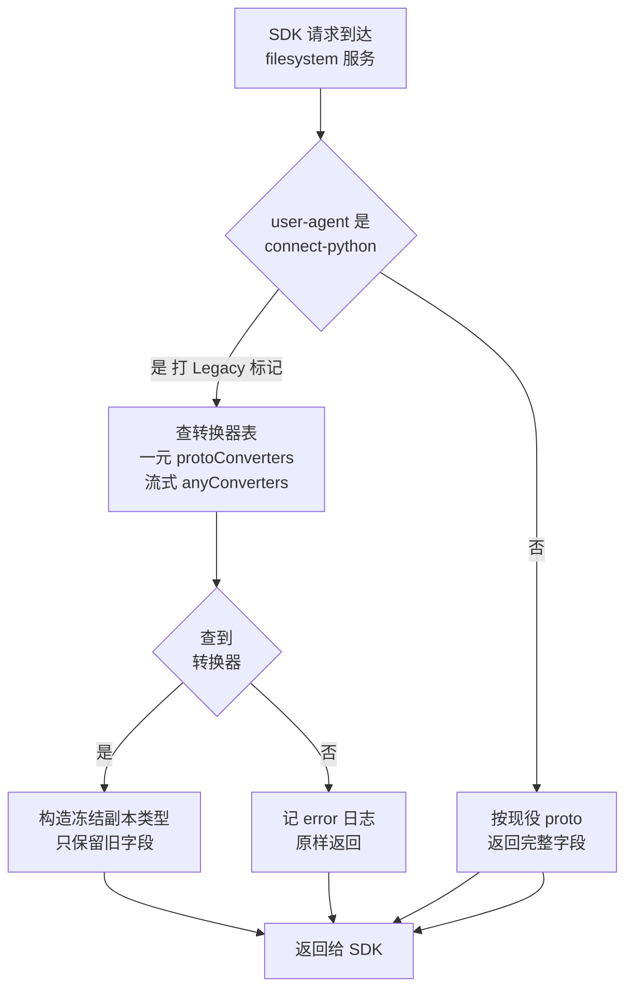
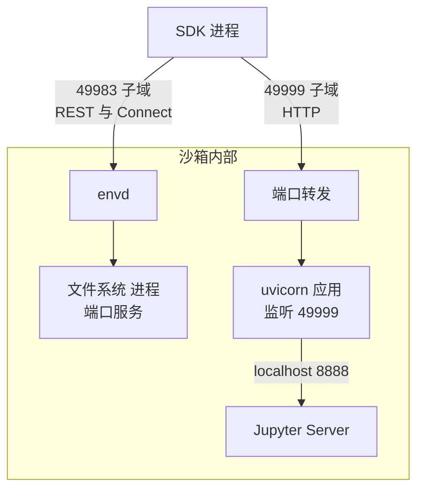

# 52 · legacy 服务与 SDK 兼容

> envd 的代码里有一个叫 `legacy` 的包，里面是两份被冻结的 proto 和一个会「把响应改回旧样子」的拦截器。
> 它的存在不是历史遗留的惰性，而是一次客户端解码 bug 留下的账单。本篇讲这笔账怎么记、怎么还，
> 顺带把 SDK 从进程外找到 envd 的整条路径与版本协商机制说清楚。
>
> **读者**：工程师、SDK 开发者。
> **预备**：[第 48 篇 · envd 总览](48-envd-overview.md)、[第 36 篇 · 代理与 envd 通信](36-orchestrator-proxy-and-envd-client.md)。
> **代码**：`packages/envd/internal/services/legacy/`、`packages/envd/main.go`、
> `packages/shared/pkg/proxy/host.go`、`packages/api/internal/handlers/sandbox_create.go`、
> `packages/python-sdk/e2b/connection_config.py`、`packages/python-sdk/e2b/envd/versions.py`

---

## 0. 本篇要回答的问题

1. protobuf 加字段本该是向后兼容的，为什么 envd 还要专门为老客户端造一份「旧响应」？
2. `legacy` 包是怎么判断「这是老客户端」的？它转换了哪些消息、漏掉了哪些、什么时候能删？
3. SDK 在沙箱外面怎么定位到一个具体沙箱的 envd？端口是怎么编进域名的？
4. envd 是一个流式 RPC 服务，为什么 SDK 不需要 HTTP/2 也能跑？
5. 「这个沙箱的 envd 是哪个版本」这条信息存在哪里，服务端和 SDK 各自拿它做什么判断？
6. code-interpreter 的 `run_code` 走的是 envd 的哪个接口？

---

## 1. 一次解码 bug 如何变成服务端的长期负担

protobuf 的兼容性契约里有一条：给消息加一个新字段，老客户端解码时应当忽略它。
这条契约让服务端可以单方面演进接口，是 e2b 敢在 `filesystem.proto` 里往 `EntryInfo` 上一口气加
六七个字段的前提。契约成立的条件是**解码器真的会忽略未知字段**。

envd 与 SDK 之间跑的是 Connect-RPC，Python SDK 用的编解码是 JSON 而不是二进制 protobuf
（`packages/python-sdk/e2b/sandbox_sync/filesystem/filesystem.py` 构造 `FilesystemClient` 时传了 `json=True`）。
JSON 编解码走的是 `json_format.Parse`，而这个函数默认对未知字段抛异常。
当前 SDK 里 vendored 的 `e2b_connect/client.py` 的 `JSONCodec.decode` 显式写了
`ignore_unknown_fields=True`——这是修复后的样子。**推论：** 在这行修复之前，凡是响应里出现
新字段，老 Python SDK 就会在解码阶段抛出 `ParseError`，而不是忽略它。

`packages/envd/internal/services/legacy/readme.md` 的第一句正是这么说的：
「The python SDK had a bug: new fields introduced to the API would throw exceptions when processed.」

于是问题的形状变了。它不是「要不要支持一个旧协议」，而是：**服务端已经加了字段，而外面还跑着一批
会被这些字段毒死的客户端，且这批客户端不受服务端控制、也不会自动升级。**
沙箱是短命的，模板不是；SDK 装在用户自己的机器上，升级节奏由用户决定。
服务端唯一能做的，是在响应离开进程之前，把新字段擦掉。

代价要说清楚：擦掉字段意味着这些客户端**永远拿不到新能力**，而且服务端要长期维护一份
「当年长什么样」的快照。收益是这批客户端不会在某次服务端发布后集体崩溃。
`readme.md` 也给了退出条件：「This entire package can be removed once we no longer have clients
that send a user agent of `connect-python`.」

---

## 2. `legacy` 包做了什么

### 2.1 两份冻结的 proto

包里有 `legacyprocess.proto` 与 `legacyfilesystem.proto`，是当年那批 SDK 见过的接口的副本，
`readme.md` 要求它们「should never be modified」。把它们和现役的
`packages/envd/spec/filesystem/filesystem.proto`、`spec/process/process.proto` 对照，
差异只有下面这些：

| 消息 / 方法 | 现役定义有、冻结副本没有 | 在响应里还是请求里 |
|---|---|---|
| `filesystem.EntryInfo` | `size`、`mode`、`permissions`、`owner`、`group`、`modified_time`、`symlink_target` | 响应 |
| `process.ProcessConfig` | `optional bool stdin` | 请求 |
| `process.Process` 服务 | `CloseStdin` 方法及其请求 / 响应消息 | 请求为主 |

这张表解释了整个包的形状。`EntryInfo` 是 `Stat`、`ListDir`、`MakeDir`、`Move`、`WatchDir`
这一组方法的返回值里的公共结构，它长胖了七个字段，全部落在**响应**方向——老客户端解码响应，
会撞上未知字段。而进程服务这边加的是**请求**方向的东西：请求由客户端构造，客户端不知道
`stdin` 这个字段就不填，服务端按 proto 里的注释默认为 `true`；`CloseStdin` 是个新方法，
老客户端不会去调。请求方向的演进对老客户端是无害的。

结论落到代码上就是：`packages/envd/internal/services/filesystem/service.go` 的 `Handle()`
在 `connect.WithInterceptors(...)` 里挂了 `legacy.Convert()`，而
`packages/envd/internal/services/process/service.go` 的 `Handle()` 只挂了日志拦截器。
全仓搜索 `legacy.` 在 envd 非测试代码里只有 `filesystem/service.go` 一处引用。
**`legacyprocess.proto` 是一份存档，不参与任何运行时路径。**

### 2.2 判定：一个 user-agent 字符串

`interceptor.go` 的 `shouldHideChanges()` 只做一件事：

```go
const brokenUserAgent = "connect-python"
const notifyHeader = "X-E2B-Legacy-SDK"

func shouldHideChanges(request http.Header, response http.Header) bool {
	if request.Get("user-agent") != brokenUserAgent {
		return false
	}
	response.Set(notifyHeader, "true")
	return true
}
```

判据是请求头 `user-agent` 精确等于 `connect-python`——那是 `connect-python` 这个第三方 Connect
客户端库的默认 user-agent，老 SDK 没有覆盖它。现在的 Python SDK 在
`connection_config.py` 里把 `User-Agent` 设成 `e2b-python-sdk/<version>`，并通过
`sandbox_headers` 一路带到 Connect 客户端的请求头里，因此不会命中这条判据。

匹配上之后，响应会被打上 `X-E2B-Legacy-SDK: true`。这个头在上游 2026.09 的整个仓库里
没有第二处引用——没有代码消费它。它的用途是让运维和排障的人在抓包或代理日志里
**看得见**「这次请求走了降级路径」。这类可观测性标记的代价接近于零，收益是把一个隐蔽的行为
变成可以计数的信号，从而能回答「还能不能删掉这个包」。

用 user-agent 做协议判据本身是有代价的：它是一个可以被任意伪造、也可能被中间层改写的字符串，
而且精确相等的判定对「同一个库的其它版本」是脆的。这里能接受，是因为判错的后果只是
少给一些字段，不是错误的数据。

### 2.3 转换：一张类型到构造函数的表

`conversion.go` 在 `init()` 里用泛型辅助函数 `addConverter[TIn, TOut]` 注册了八个转换器，
覆盖 `MoveResponse`、`ListDirResponse`、`MakeDirResponse`、`RemoveResponse`、`StatResponse`、
`WatchDirResponse`、`CreateWatcherResponse`、`GetWatcherEventsResponse`。
每个转换器把现役消息逐字段抄进冻结副本定义的类型里，`convertEntryInfo()` 只抄
`Name`、`Type`、`Path` 三个字段，其余的自然就消失了。

注册结果同时进了两张表：`protoConverters` 供一元调用用（`maybeConvertResponse()`），
`anyConverters` 供流式调用用（`maybeConvertValue()`）。一元与流式要分开处理，是因为
Connect 的一元响应是 `connect.AnyResponse`（带 header 与 trailer，转换后要用 `copyHeaders()`
把它们抄回新对象），而流式响应是一个个直接 `Send()` 出去的消息。
`stream.go` 的 `streamConverter` 就是把 `connect.StreamingHandlerConn` 包一层，
只改写 `Send()`，其余方法原样转发。

查不到转换器时的行为值得注意：`maybeConvertResponse()` 打一条 `error` 级别日志然后
**原样返回**。也就是说，将来给 filesystem 服务加一个新方法而忘了写转换器，
老客户端会重新开始崩溃，而服务端只留下一行日志。这是这个设计的软肋：
兼容性的完整性没有编译期保证，靠的是写代码的人记得回来加一行。



---

## 3. SDK 从外面怎么找到 envd

### 3.1 端口编进域名

envd 监听在沙箱内的 `49983`（`packages/envd/main.go` 的 `defaultPort`），
这是一个沙箱私网里的地址，公网无法直达。e2b 的做法是把**目标端口编进主机名的最左一段**：

```text
https://49983-i7d4nq3jkl2mvxyz.e2b.app/
        └─┬─┘ └──────┬───────┘ └──┬──┘
        端口      沙箱 ID        域名
```

Python SDK 的 `connection_config.py` 里 `get_host()` 就是这一行：
`f"{port}-{sandbox_id}.{sandbox_domain}"`；`get_sandbox_url()` 用 `envd_port = 49983`
拼出 envd 的 base URL。JS SDK 的 `src/connectionConfig.ts` 的 `getHost()` 是同一条规则。

服务端的解析在 `packages/shared/pkg/proxy/host.go` 的 `parseHost()`：取第一个 `.` 之前的部分，
按 `-` 切开，第一段解析成端口、第二段作为沙箱 ID，再用 `id.ValidateSandboxID()` 校验。
注意它用的是 `strings.Split` 后取前两段，所以主机名里多出来的段（早期版本的 client ID）
会被忽略，这条规则在 [第 53 篇 §3](53-client-proxy-edge.md#3-域名解析从-host-头到-sandboxid-与端口) 里展开。

这个编码方案的收益是：**任何 HTTP 客户端、任何浏览器，不需要特殊 SDK 就能访问沙箱里的任意端口**，
代价是需要一张泛域名证书，并且端口号会出现在 URL 里、被日志与 Referer 带走。

`host.go` 里还有第二条路径：`parseHeaders()` 读 `E2b-Sandbox-Id` 与 `E2b-Sandbox-Port`
两个请求头。但它只在 `GetTargetFromRequest(processHeaders)` 的参数为真时启用，
而 `packages/client-proxy/internal/proxy/proxy.go` 与
`packages/orchestrator/internal/proxy/proxy.go` 传的都是 `env.IsLocal()`——
也就是**只在本地开发时**用头定址。生产环境仍然只认主机名。

### 3.2 两个调用面

envd 对 SDK 暴露两组接口，SDK 侧也就有两个客户端对象。
下表是 Python SDK 里的对应关系（`e2b/sandbox_sync/main.py` 的 `__init__`）：

| 调用面 | 协议 | SDK 侧载体 | 典型方法 | 服务端位置 |
|---|---|---|---|---|
| REST | HTTP + JSON | `httpx.Client`（`self._envd_api`） | `/health`、`/files`、`/envs`、`/metrics`、`/init` | `internal/api/`，规格见 `spec/envd.yaml` |
| RPC | Connect-RPC | `e2b_connect.Client`（走 `httpcore` 连接池） | `Filesystem.*`、`Process.*` | `internal/services/filesystem/`、`internal/services/process/` |

两者共用同一个连接池：`get_transport()`（`e2b/api/client_sync/__init__.py`）造一个进程级单例
`TransportWithLogger`，`httpx.Client` 直接用它，Connect 客户端拿它的 `.pool`
（一个 `httpcore.ConnectionPool`）。共用的收益是一个沙箱只维持一组 TCP / TLS 连接，
代价是所有调用共享同一套连接数上限。

### 3.3 Connect 为什么不必要求 HTTP/2

gRPC 的传输层要求 HTTP/2，因为它的流式语义依赖 HTTP/2 的帧与 trailer。
Connect 协议把这个要求拆掉了：一元调用就是一次普通的 `POST`，
`e2b_connect/client.py` 的 `_prepare_unary_request()` 设的头是
`connect-protocol-version: 1` 加 `content-type: application/json`；
服务端流式调用是 `content-type: application/connect+json`，请求体与响应体是自带长度前缀的
「信封」帧（`encode_envelope`），在 HTTP/1.1 的 chunked body 上就能跑。
超时通过 `connect-timeout-ms` 头传递，而不是 HTTP/2 的机制。

这条性质对 e2b 很重要：从 SDK 到 envd 中间隔着边缘代理与 orchestrator 的沙箱代理
（见 [第 36 篇 §2](36-orchestrator-proxy-and-envd-client.md#2-通道一orchestrator-里的沙箱代理)），
不要求全链路 h2，就意味着中间任何一跳降级到 HTTP/1.1 时功能不受影响，只是并发连接数变多。

两个 SDK 都是「能用 h2 就用 h2」：Python 侧 `get_transport()` 构造 `httpx.HTTPTransport`
时传 `http2=True`；JS 侧 `src/envd/http2.ts` 在 Node 运行时动态加载 `undici`，
用 `new Agent({ allowH2: true })` 作为 dispatcher，加载失败时打一条 warning 退回全局 `fetch`。
**推论：** 实际用哪个版本由 TLS 的 ALPN 协商决定，明文 `http://` 场景下必然是 HTTP/1.1。
JS 侧还区分了两个 fetch：REST 用的那个把连接数限成 1，RPC 用的那个不限，
注释给的理由是 RPC 的流可能长期挂着，不能和短请求抢同一条连接。

### 3.4 两个方向不同的凭证

打到 envd 的请求上通常有两个与身份有关的头，作用完全不同：

- `X-Access-Token`：**这个沙箱的 envd 访问令牌**。API 在创建 / 恢复 / 连接沙箱时下发
（`packages/api/internal/handlers/sandbox_create.go` 的 `getEnvdAccessToken()`），
SDK 收到后放进 `extra_sandbox_headers`，之后所有请求都带。
envd 侧在 `internal/api/auth.go` 的 `WithAuthorization()` 里比对，
只有 `GET/health`、`GET/files`、`POST/files`、`POST/init` 四条路径免检。
它回答的是「你有没有资格碰这个沙箱」。
- `Authorization: Basic base64("<user>:")`：**这次操作以哪个 Linux 用户执行**。
`e2b/envd/rpc.py` 的 `authentication_header()` 生成，envd 侧
`internal/permissions/authenticate.go` 的 `AuthenticateUsername()` 解析出用户名并查 `passwd`。
它回答的是「以谁的身份跑」，不是「能不能进来」。

把「进门」和「以谁的身份」分成两个头，好处是 envd 不需要维护自己的用户体系，
坏处是 `Authorization` 这个头名字容易让人误以为它在做鉴权——它没有密码部分，
冒号后面永远是空的。

---

## 4. 版本协商：envd 版本存在哪里

### 4.1 一条从构建走到 SDK 的链路

envd 的版本号是编译进二进制的常量（`packages/envd/main.go` 的 `var Version = "0.5.3"`，
上游 2026.09 的值）。它按下面这条链路走到 SDK 手里：

```text
envd 二进制
   │  orchestrator 构建模板时执行 `envd -version`
   │  packages/orchestrator/internal/template/build/core/envd/envd.go 的 GetEnvdVersion()
   ▼
构建产物元数据 TemplateBuildMetadata.envdVersionKey
   │  template-manager 回报，API 落库
   │  packages/api/internal/template-manager/template_status.go 的 SetFinished()
   ▼
数据库 env_builds.envd_version
   │  创建 / 恢复 / 连接沙箱时读出，随响应返回
   ▼
SDK：Sandbox._envd_version（Python 侧是 packaging.version.Version）
```

这条链路有两个值得注意的地方。第一，版本是**模板构建时**确定并固化的，不是运行时探测的；
一个老模板即使跑在最新的集群上，它的 envd 也还是当年那一版，除非重建模板。
SDK 抛出的错误信息里反复出现的 "please rebuild your template" 就是这个意思。
第二，SDK 在 debug 模式下拿不到这条信息，于是用哨兵值兜底：
`e2b/envd/versions.py` 的 `ENVD_DEBUG_FALLBACK = Version("99.99.99")`，
意为「本地开发时假定 envd 是最新的，所有特性都开」。

### 4.2 服务端一侧的门槛

服务端用 `packages/shared/pkg/utils/version.go` 的 `IsGTEVersion()` 做比较
（内部是 `golang.org/x/mod/semver`，会先补上 `v` 前缀）。上游 2026.09 里针对 envd 的门槛有：

| 门槛常量 | 值 | 位置 | 不满足时 |
|---|---|---|---|
| `minEnvdVersionForSecureFlag` | `0.2.0` | `packages/api/internal/handlers/sandbox_create.go` | 返回 400，提示重建模板 |
| `minEnvdVersionForKVMClock` | `0.2.11` | `packages/orchestrator/internal/template/build/layer/create_sandbox.go` | 不启用 KVM clock |
| `minEnvdVersionForMetrics` | `0.1.5` | `packages/orchestrator/internal/metrics/sandboxes.go` | 不采集该沙箱指标 |
| `minEnvVersionForMetricsTimestamp` | `0.1.3` | 同上 | 不校验时钟漂移 |
| `minEnvdVersionForMemoryPrecise` / `ForDiskMetrics` | `0.2.4` | 同上 | 内存按 MiB 粗粒度、无磁盘指标 |

注意这里没有特性开关（feature flag）的事。`packages/shared/pkg/feature-flags/flags.go`
里没有任何 envd 版本相关的开关：特性开关控制的是**集群的行为**（走不走 NFS、并发上限、
Firecracker 版本等，见 [第 14 篇 §2](14-config-flags-versions.md#2-特性开关)），
版本门槛控制的是**单个沙箱能不能用某个能力**。两者的输入不同，一个来自 LaunchDarkly，
一个来自模板构建记录，不应混为一谈。

`packages/api/internal/sandbox/sandbox_features.go` 里的 `VersionInfo` / `HasHugePages()`
判的是 **Firecracker** 版本而不是 envd 版本，格式是 `last_tag_commit_hash`；
把它和 envd 的版本门槛并排看，能看出 e2b 对「模板携带的运行时版本」有两套独立记录。

### 4.3 SDK 一侧的兼容矩阵

SDK 侧的矩阵集中在一个文件里，Python 是 `e2b/envd/versions.py`，
JS 是 `src/envd/versions.ts`，两份内容逐条对应：

| 常量 | 最低 envd 版本 | 影响的调用 | 低于门槛时的行为 |
|---|---|---|---|
| `ENVD_VERSION_RECURSIVE_WATCH` | `0.1.4` | `files.watch_dir(recursive=True)` | 抛 `TemplateException` |
| `ENVD_COMMANDS_STDIN` | `0.3.0` | `commands.run(stdin=False)` | 抛 `SandboxException` |
| `ENVD_DEFAULT_USER` | `0.4.0` | 所有带 `user` 的调用 | SDK 补上默认用户名 `user` |
| `ENVD_ENVD_CLOSE` | `0.5.2` | —— | 在 Python SDK 中已无引用 |
| `ENVD_OCTET_STREAM_UPLOAD` | `0.5.7` | `files.write(use_octet_stream=True)` | 退回 multipart 上传 |

这张表里有三种降级策略，值得分开看：

**抬错。** 递归 watch 与显式关闭 stdin 都是「用户明确要求了一个做不到的事」，
静默忽略会让用户得到一个看似成功、实则行为不同的结果，所以直接抛异常并指明修复方法
（重建模板）。

**静默补默认值。** `ENVD_DEFAULT_USER` 之前的 envd 没有「默认用户」的概念，请求必须带用户名；
之后的 envd 会用模板里配置的用户。SDK 的处理是：调用方没传 `user` 且 envd 版本低于 `0.4.0` 时，
补上 `user`（`e2b/envd/rpc.py` 的 `authentication_header()`、`filesystem.py` 的多处）。
这是安全的降级，因为补上的正是旧版本的固定默认值。

**静默降级实现。** `files.write()` 在新 envd 上可以用 `application/octet-stream` 单文件直传，
旧 envd 上退回 multipart。用户看到的语义完全一致，只是少一层 MIME 封装，所以不需要告知。
这一条要与服务端对照着看：本书的代码基线里 envd 是 `0.5.3`，
`packages/envd/internal/api/upload.go` 的 `PostFiles` 拿到请求体后**只**调 `r.MultipartReader()`，
一个 `application/octet-stream` 的请求体在这里会直接解析失败并返回 500。
所以这不是「新路径更快、旧路径也能用」的可选优化，而是「打到 `0.5.3` 上必然失败」的硬约束，
门槛不能省。SDK 侧还压了一层保险：`use_octet_stream` 的默认值是 `False`
（`e2b/sandbox_sync/filesystem/filesystem.py`），调用方不显式要求就一律走 multipart，
版本判断只在调用方主动要求时才起作用。

对照第 4.2 节可以看到一个对称性：**服务端的门槛保护自己不去调用不存在的能力，
SDK 的门槛保护用户不去期待不存在的能力。** 两边各自维护一份常量表，没有运行时协商握手。
代价是这两份表可能不同步——上一段的 `ENVD_OCTET_STREAM_UPLOAD` 就是现成的例子：
SDK 的表里写着 `0.5.7`，而本书基线里的 envd 只有 `0.5.3`，说明 SDK 是按更新的 envd 发布的。
这种「SDK 比服务端新」的情形在这套设计下是安全的：SDK 只会因为版本比较不通过而少用一条路径。
反过来「服务端比 SDK 新」才是危险方向，而那正是第 1 节里 `legacy` 包要收拾的局面。

---

## 5. code-interpreter：在 envd 之上跑 Jupyter

`e2b-code-interpreter` 提供的 `run_code()` 常被理解成 envd 的一个接口。它不是。
envd 只提供进程、文件系统与端口这三类原语，没有任何与 Jupyter、内核（kernel）、
执行上下文（context）相关的概念。

真正的实现在**模板里**。code-interpreter 模板（`code-interpreter-v1`）装了两个 systemd 单元：
`jupyter.service` 起一个 Jupyter Server（监听 `localhost:8888`，`--IdentityProvider.token=""`），
`code-interpreter.service` 起一个 uvicorn 应用，监听 `0.0.0.0:49999`，
`Requires=jupyter.service` 且启动前跑一次 `jupyter-healthcheck.sh`。
那个 uvicorn 应用是一层薄封装：对外暴露 `/execute`、`/contexts` 这类 HTTP 接口，
对内用 `JUPYTER_BASE_URL = "http://localhost:8888"` 和 Jupyter 通信。

SDK 侧对应地不走 envd 的 RPC：`e2b_code_interpreter` 的 `JUPYTER_PORT = 49999`，
`_jupyter_url` 拼出 `https://49999-<sandboxID>.<domain>`，
然后 `POST /execute` 并流式读回结果，请求头里带 `X-Access-Token`
与 `E2b-Sandbox-Port: 49999`。

于是分层是这样的：



`49999` 之所以从沙箱外可达，靠的是 envd 的端口转发器：
`packages/envd/internal/port/forward.go` 周期性扫描监听在 `127.0.0.1` / `localhost` / `::1`
上的 TCP 端口，为每个这样的端口拉起一个 `socat`，把网关侧地址上的同号端口转发到本地。
uvicorn 直接绑 `0.0.0.0`，所以它本身不需要这层转发；但模板里其它绑本地回环的服务需要
（见 [第 51 篇 §2](51-envd-ports-permissions-metrics.md#2-端口扫描与转发)）。

这个分层的收益很明确：**Jupyter 的复杂度全部留在模板里，envd 不必知道 Python、内核或图表格式。**
换一门语言、换一个执行引擎，只要在模板里换掉那两个 systemd 单元，envd 与整个服务端一行不改。
代价同样明确：`/execute` 这条路径上没有 envd 的认证与权限模型参与——
它的安全边界完全由边缘代理的令牌校验和沙箱本身的隔离提供，
沙箱内任何能访问 `localhost:49999` 的进程都能提交代码执行。
另外，这条链路上的故障（Jupyter 起不来、内核死掉）在 envd 的日志与指标里是看不见的，
只能从模板自己的 journal 里查。

---

## 6. ARM 适配版的差异

infra 一侧没有差异：ARM 补丁对 `packages/envd/` 只改了 `Makefile` 的目标架构与
`internal/host/mmds.go` 的 HTTP 连接复用，`internal/services/legacy/` 与 `main.go` 的路由挂载
与上游 2026.09 完全一致，`packages/shared/pkg/proxy/host.go` 也未改动。

差异在 SDK 一侧：`connection_config.py` 增加了 `E2B_HTTP_SSL` 环境变量，
置为 `false` 时 `verify_ssl` 为假，`get_sandbox_url()` 生成的是 `http://` 而不是 `https://`。
这是为单机离线版没有公网证书的场景准备的，代价是沙箱流量在这种部署下不加密。
详见 [第 83 篇 §5.1](83-sdk-adaptation.md#51-connection_configpy协议降级)。

---

## 7. 小结

- `legacy` 包不是「旧协议实现」，而是一个**响应裁剪层**：它把现役 proto 的响应转换成一份
被冻结的旧定义，只对 user-agent 恰为 `connect-python` 的客户端生效。
- 它存在的根因是老 Python SDK 的 JSON 解码器不忽略未知字段，使 protobuf 的加字段兼容契约失效。
- 只有 filesystem 服务挂了转换拦截器。process 服务的接口演进全在请求方向，对老客户端无害，
`legacyprocess.proto` 是存档而非运行时依赖。
- 转换表查不到时只记一条 error 日志并原样返回；兼容性的完整性没有编译期保证。
- `X-E2B-Legacy-SDK` 响应头没有代码消费者，作用是把降级路径变成可观测的信号，
从而能判断这个包何时可以删除。
- SDK 用 `<port>-<sandboxID>.<domain>` 定位沙箱内任意端口，服务端在
`shared/pkg/proxy/host.go` 的 `parseHost()` 解析；头定址只在本地开发启用。
- Connect 协议不依赖 HTTP/2，链路上任何一跳降级到 HTTP/1.1 都不影响功能；
两个 SDK 都以 ALPN 协商的方式尽量使用 h2。
- 打到 envd 的两个头职责不同：`X-Access-Token` 决定能否进入，
`Authorization: Basic` 决定以哪个 Linux 用户执行。
- envd 版本在模板构建时由 `envd -version` 取得，落在 `env_builds.envd_version`，
随创建 / 恢复 / 连接响应回到 SDK；服务端与 SDK 各持一份版本门槛表，没有运行时握手。
- code-interpreter 不是 envd 的能力：Jupyter 与其 HTTP 封装跑在模板内的 `49999` 端口上，
SDK 用同一套域名编码直接访问，envd 不参与。

---

## 延伸阅读 / 下一篇

- [第 48 篇 · envd 总览](48-envd-overview.md)：envd 的启动、认证与三条对外通道。
- [第 49 篇 §2](49-envd-process-service.md#2-八个方法与两种流式模式)：`process.proto` 的流式模式，
本篇提到的 `stdin` 与 `CloseStdin` 在那里展开。
- [第 50 篇 §3](50-envd-filesystem-service.md#3-五个同步-rpc)：被 `legacy` 裁剪的那些字段
原本是做什么用的。
- [第 36 篇 §2](36-orchestrator-proxy-and-envd-client.md#2-通道一orchestrator-里的沙箱代理)：
SDK 请求在到达 envd 之前经过的两跳代理与两处令牌校验。
- [第 53 篇 §3](53-client-proxy-edge.md#3-域名解析从-host-头到-sandboxid-与端口)：主机名解析规则的完整版本。
- [第 14 篇 §2](14-config-flags-versions.md#2-特性开关)：特性开关与版本门槛的分工。
- [第 83 篇 §3](83-sdk-adaptation.md#3-两条并行的改法与配置项)：ARM 适配版与单机离线版对 SDK 连接层的改动。
- 下一篇：[第 53 篇 · client-proxy（edge）](53-client-proxy-edge.md)。
