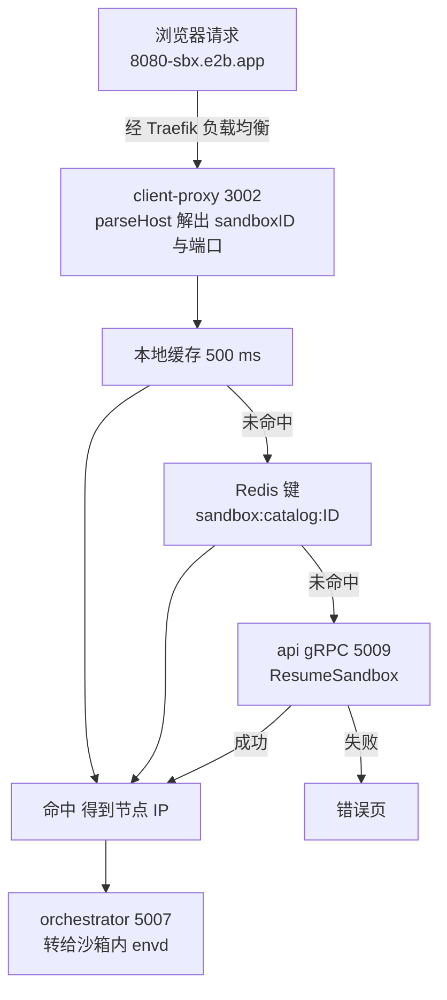
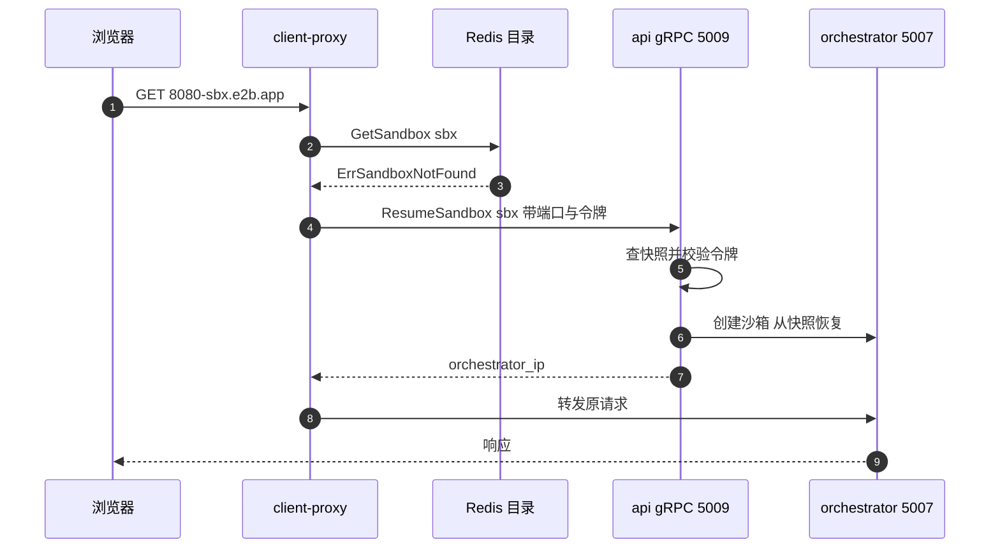

# 53 · client-proxy（edge）

> 一台沙箱里跑着一个监听 8080 的 web 服务，用户在浏览器里访问 `8080-<sandboxID>.e2b.app` 就能看到它。
> 中间这一跳由 client-proxy（edge）完成：它从域名里解出沙箱与端口，从沙箱目录里查出节点，
> 把请求转给那台节点上的 orchestrator。本篇讲这个进程的结构、寻址规则、转发路径，
> 以及访问一台已暂停沙箱时它怎么把沙箱唤醒。
>
> **读者**：工程师、运维。　**预备**：[第 10 篇 · 系统架构](10-system-architecture.md)、
> [第 36 篇 · 代理与 envd 通信](36-orchestrator-proxy-and-envd-client.md)。
> **代码**：`packages/client-proxy/main.go`、`packages/client-proxy/internal/proxy/`、
> `packages/shared/pkg/proxy/host.go`、`packages/api/internal/handlers/proxy_grpc.go`、
> `iac/modules/job-client-proxy/jobs/client-proxy.hcl`

---

## 0. 本篇要回答的问题

1. 上游 2026.09 的 client-proxy 进程里到底跑着哪几个服务器，「edge API」在哪里？
2. `<port>-<sandboxID>.<domain>` 这个域名是怎么解析的，为什么域名里那段 clientID 已经不起作用？
3. 从一个沙箱 ID 到一个可转发的 IP，中间经过哪些查找，每一步的时延与失效风险是什么？
4. 访问一台已经暂停的沙箱时，是谁触发的恢复，凭什么判断请求方有权触发？
5. WebSocket 与长连接怎么穿过这一跳，滚动升级时它们会被怎样处理？

---

## 1. 这一跳为什么必须存在

沙箱是一台 microVM，跑在某个 orchestrator 节点上，节点的 IP 属于集群内网；
沙箱的生命周期以分钟计，节点分配是运行时决定的。要让公网用户访问沙箱里的端口，
可选的做法有三类：给每台沙箱分配公网地址（地址不够、也无法在暂停后保号）、
让用户先查 API 拿到节点地址再直连（把内网拓扑暴露给客户端，且沙箱迁移后地址失效）、
或者在入口放一层代理，由它承担「名字到位置」的解析。e2b 选第三类。

于是需要一个**无状态**的入口进程：它自己不保存沙箱到节点的映射，
每个请求都去共享存储里查一次；这样任意多个副本可以并行跑在负载均衡后面，
挂掉一个不会丢路由信息。代价是每个请求多一次外部查找，
以及入口层和写入方（api）之间存在一个不可避免的时间窗 —— 沙箱刚创建、
或刚迁移到另一台节点时，目录里的记录可能还是旧的。

这个进程在代码里叫 client-proxy（`packages/client-proxy/`），在部署与文档里常叫 edge（边缘代理），
两个名字指同一个二进制。本书统一用 client-proxy 指进程、用 edge 指它在拓扑里的位置。

## 2. 进程结构：两个端口，没有第三个

`packages/client-proxy/main.go` 的 `run()` 里只起了两个 HTTP 服务器：

| 服务器 | 端口来源 | 默认 | 作用 |
|---|---|---|---|
| 流量代理 | `PROXY_PORT` | 3002 | 沙箱 HTTP 流量的入口，由 `e2bproxy.NewClientProxy()` 构造 |
| 健康检查 | `HEALTH_PORT` | 3003 | 返回 `healthy` / `unhealthy`，供 Nomad 与负载均衡判活 |

配置项在 `internal/cfg/model.go`，一共只有六个：上面两个端口，
三个 Redis 相关变量（`REDIS_URL`、`REDIS_CLUSTER_URL`、`REDIS_TLS_CA_BASE64`），
以及 `API_GRPC_ADDRESS`。健康端口上挂的是一个 `http.HandlerFunc` 而不是路由表，
所以**任何路径**都会得到同一个应答；`client-proxy.hcl` 里配的 `/health` 只是习惯写法。

值得强调的是这里**没有** edge API 服务器。`packages/shared/pkg/http/edge/` 里那份 `openapi-edge.yml`
在上游 2026.09 只生成客户端代码，服务端实现不在本仓库，client-proxy 也不监听它的端口
（[第 56 篇 §1](56-edge-api.md#1-一个刻意留下的缺口) 展开这一点）。读部署模板时容易被 `EDGE_API_PORT`
这类变量误导，判断依据应当是 `cfg.Config` 里有没有对应字段。

启动时还做三件事：用 `factories.NewRedisClient()` 建 Redis 客户端，
失败且不是「Redis 未配置」时直接退出；未配置时退回 `NewMemorySandboxesCatalog()`，
并打一条警告说明它只在单实例部署下成立。若 `API_GRPC_ADDRESS` 非空，
建一个 `grpcPausedSandboxResumer`；为空则记录「paused sandbox checks disabled」，
自动恢复功能整体关闭。

### 2.1 三段式下线

`main.go` 里的关停协程分三段，这是为长连接服务设计的：收到 `SIGTERM` 后先把状态置为 `Draining`
并睡 15 秒，让健康检查与上游负载均衡把自己摘出去；然后调用 `trafficProxy.Shutdown()`，
其上下文超时设为 24 小时 —— 也就是说，**等到最后一个在途请求结束**为止；
之后状态置 `Unhealthy` 再睡 15 秒，最后关健康端口、依次关闭 Redis、特性开关客户端与 gRPC 连接。
`internal/info.go` 的 `ServiceInfo` 就是这三个状态的持有者。

与之配套，`client-proxy.hcl` 在启用 update stanza 时把 `kill_timeout` 设成 `24h`、
`kill_signal` 设成 `SIGTERM`，并用 canary + `auto_promote` 做滚动升级。
代价是一次升级可能拖很久：只要还有一个 WebSocket 没断，旧实例就不会退出。

## 3. 域名解析：从 Host 头到 sandboxID 与端口

解析规则在 `packages/shared/pkg/proxy/host.go`，由 orchestrator 与 client-proxy 共用。
`GetTargetFromRequest(processHeaders bool)` 返回一个闭包，闭包内先按需读 header，再退回 `parseHost(r.Host)`。

`parseHost` 只做四步：取第一个 `.` 之前的最左标签；按 `-` 切分；
`hostParts[0]` 转成 uint64 作为端口；`hostParts[1]` 作为 sandboxID。切分结果少于两段就是 `ErrInvalidHost`。
拿到 sandboxID 后再过一遍 `id.ValidateSandboxID()`，它要求全部匹配 `^[a-z0-9]+$`。

| Host | sandboxID | 端口 | 说明 |
|---|---|---|---|
| `49983-isv6ril5xadwn1k9t2jye.e2b.app` | `isv6ril5xadwn1k9t2jye` | 49983 | 常规形式 |
| `49983-isv6ril5xadwn1k9t2jye-6532622b.e2b.app` | `isv6ril5xadwn1k9t2jye` | 49983 | 第三段被丢弃 |
| `49983-isv6ril5xadwn1k9t2jye.demo.e2b.app` | `isv6ril5xadwn1k9t2jye` | 49983 | 只看最左标签，多级域名无影响 |
| `isv6ril5xadwn1k9t2jye.e2b.app` | — | — | 少了端口段，`ErrInvalidHost` |
| `abcd-isv6ril5xadwn1k9t2jye.e2b.app` | — | — | 端口段非数字，`InvalidSandboxPortError` |
| `49983-isv6ril5xadwn1k9t2jye:8080` | — | — | 没有 `.`，`ErrInvalidHost` |

这些用例逐条对应 `host_test.go` 的 `TestGetTargetFromRequest`。
第二行是历史包袱：老的域名形态是 `<port>-<sandboxID>-<clientID>.<domain>`，clientID 标识节点；
现在 `parseHost` 根本不读第三段，**clientID 已经退化为一个不参与寻址的常量**，
留着只是为了让旧域名继续可解析。定位改由沙箱目录承担（下一节）。

端口是 `uint64` 而不是 `uint16`，`parseHost` 也不检查它是否落在 1–65535 内。
超范围的端口会一路传到 orchestrator，在那里拼成 `IP:port` 后由 `net.Dial` 报错，
最终表现为一个 502（推论：代码里没有显式的端口范围校验，这是按调用链推出的行为）。

### 3.1 本地模式的 header 定址

`NewClientProxy()` 传给 `GetTargetFromRequest` 的是 `env.IsLocal()`，即 `ENVIRONMENT=local` 时才为真。
此时 `parseHeaders()` 先看两个 header：

- `E2b-Sandbox-Id`：沙箱 ID
- `E2b-Sandbox-Port`：目标端口

两个都缺就退回域名解析；只给一个则报 `MissingHeaderError`，handler 回 400。
这条路径是给本地开发用的：开发机上没有通配泛域名，直接 `curl -H` 指定目标最省事。
生产环境 `ENVIRONMENT` 不是 `local`，这两个 header 不被解释，
所以外部无法用它们绕过域名寻址。

## 4. 从沙箱 ID 到节点 IP

`internal/proxy/proxy.go` 的 `catalogResolution()` 调 `catalog.GetSandbox(ctx, sandboxId)`。
读侧实现是 `packages/shared/pkg/sandbox-catalog/catalog_redis.go`：
先查进程内的 `ttlcache`（TTL 500 ms，`catalogRedisLocalCacheTtl`），未命中再查 Redis
键 `sandbox:catalog:<sandboxID>`，超时 1 秒，值是 `SandboxInfo` 的 JSON。
500 ms 这个数字的取舍写在代码注释里：缓存久了，沙箱换节点后会持续转发到旧节点。

写侧在 api：`packages/api/internal/orchestrator/lifecycle.go` 的 `addSandboxToRoutingTable()`
在沙箱进入运行态时写入记录，过期时间取 `MaxLengthInHours` 小时 —— 也就是沙箱理论上的最长寿命。
记录里的 `OrchestratorIP` 就是 client-proxy 要用的那个字段；`proxy.go` 里留着一条注释说明，
将来若改用 edge 做 orchestrator 发现，这个 IP 就不必再存进目录。
目录里存了什么、为什么存这些见 [第 55 篇 §2](55-sandbox-catalog-and-routing.md#2-表里存了什么以及为什么存这些)，
多实例一致性与失效窗口见 [第 55 篇 §6](55-sandbox-catalog-and-routing.md#6-多个-edge-实例之间)。

拿到 IP 后，目标 URL 固定拼成 `http://<nodeIP>:5007` —— 5007 是 `proxy.go` 里的常量
`orchestratorProxyPort`，与 orchestrator 侧 `internal/cfg/model.go` 中 `PROXY_PORT` 的默认值一致。
这里是硬编码：两侧改端口必须同步改代码，配置文件改不了它。

## 5. 转发：交给共享代理库

解析与查找的结果被包成一个 `pool.Destination` 返回给共享库
（`packages/shared/pkg/proxy/`，见 [第 54 篇 §1](54-shared-proxy-library.md#1-一个库两个使用者)）。
client-proxy 填的字段很少：`Url`、`SandboxId`、`SandboxPort`、`RequestLogger`，
以及 `ConnectionKey: pool.ClientProxyConnectionKey` —— 一个常量字符串 `client-proxy`。
这意味着**整个 client-proxy 只有一个连接池**，所有沙箱的连接混用。
orchestrator 侧不能这么做：那里的 `ConnectionKey` 取 `sbx.LifecycleID`，
因为网络槽位会被复用，不同沙箱可能先后拿到同一个 `IP:port`，
复用 keepalive 连接会把请求送错地方；而 edge 到 orchestrator 是一台长期存在的节点，
不存在这个歧义。

两侧还有三处刻意的不对称：

| 维度 | client-proxy | orchestrator proxy |
|---|---|---|
| 拨号重试 | `ClientProxyRetries` = 1 | `SandboxProxyRetries` = 5 |
| idle timeout | 610 s | 620 s |
| keepalive | 保留 | `disableKeepAlives = true` |

重试次数的差别有注释解释：重试是为了兜住沙箱内 envd 端口转发的延迟（进程刚 bind 到 localhost，
端口扫描加 socat 启动要一秒左右），这个等待应当发生在离沙箱最近的一跳，
在 edge 上重试只会放大总时延。超时是一道递增的阶梯：GCP 负载均衡的上游空闲超时是 600 s，
edge 取 610 s，orchestrator 取 620 s，`reverseproxy.New()` 里下游 `IdleTimeout`
再比上游多 10 s（`idleTimeoutBufferUpstreamDownstream`）。
方向必须是「越靠后越长」，否则后端先关连接、前端仍以为可用，就会出现偶发的连接复用失败。

请求头基本原样透传：`pool/client.go` 的 `Rewrite` 在没有 `MaskRequestHost` 时执行
`r.Out.Host = r.In.Host`，即**保持原始 Host 头**。这一点是必要的 —— orchestrator 收到请求后
会再跑一次同样的 `GetTargetFromRequest`，从同一个 Host 头里解出同样的沙箱与端口。
两跳共用一套解析代码，避免了在跳与跳之间自定义一套内部协议。

### 5.1 WebSocket 与长连接

`reverseproxy.New()` 构造的 `http.Server` 把 `ReadTimeout`、`WriteTimeout`、
`ReadHeaderTimeout` 全设为 0，只留 `IdleTimeout`。也就是说，一个请求可以读很久、写很久，
只有闲置才会被回收。这是流式响应（SSE、envd 的长轮询与流式执行，见
[第 49 篇 §4](49-envd-process-service.md#4-输出通路多路复用与两条路径)）能工作的前提。

WebSocket 不需要 client-proxy 写任何代码：转发用的是标准库 `httputil.ReverseProxy`，
它在上游回 101 Switching Protocols 时会接管底层连接做双向复制，
`Connection: Upgrade` 这类 hop-by-hop 头由库自己处理。
`DisableCompression: true` 也避免了代理层去动响应体。
代价在运维一侧：升级时这些连接不会自己断，只能靠第 2.1 节那套 24 小时的排空流程等它们结束。

连接规模由池子控制：`maxClientConns` 为 16384，单个 host 的空闲连接上限是它的四分之一
（`hostConnectionSplit`）。三个指标 —— 服务端在途连接数、池大小、池内连接数 ——
在 `NewClientProxy()` 里注册成 OpenTelemetry 的 observable up-down counter。
其中两个的名字与观测量在上游 2026.09 里是对调的：
`ClientProxyPoolConnections…` 观测 `CurrentServerConnections()`，
`ClientProxyServerConnections…` 观测 `CurrentPoolConnections()`
（见 [第 86 篇 §7](86-known-issues-and-debt.md#7-继承自上游的问题)）。

## 6. 访问一台暂停的沙箱

沙箱被暂停后，api 会把它从目录里删掉，于是 `GetSandbox` 返回 `ErrSandboxNotFound`。
如果到此为止，用户看到的就是一个 502 错误页 —— 但沙箱的快照还在，
理论上可以就地恢复。上游 2026.09 把这条路径接了起来。

`catalogResolution()` 在遇到 `ErrSandboxNotFound` 时调 `handlePausedSandbox()`，它按顺序做三次判断：
`pausedChecker` 为 nil（没配 `API_GRPC_ADDRESS`）则放弃；
特性开关 `sandbox-auto-resume` 为假则放弃（默认值是 `env.IsDevelopment()`，
即只有 `ENVIRONMENT` 为 `dev` 或 `local` 时默认开启，见
[第 14 篇 §2.2](14-config-flags-versions.md#22-flag-的定义即默认值)）；
都通过则调 `PausedSandboxResumer.Resume()`。

`internal/proxy/paused_sandbox_resumer_grpc.go` 的实现把三样东西塞进 gRPC metadata：
原始请求端口（`e2b-sandbox-request-port`）、从请求头 `e2b-traffic-access-token` 取到的流量令牌、
从请求头 `X-Access-Token` 取到的 envd 令牌，然后调 `proxy.proto` 里的 `SandboxService/ResumeSandbox`。
连接用的是 `insecure.NewCredentials()`，即明文 —— 这条链路被假定跑在集群内网上。

服务端在 api 进程里：`packages/api/internal/handlers/proxy_grpc.go` 的 `ResumeSandbox()`，
注册在 `packages/api/main.go`，端口来自 `API_GRPC_PORT`，默认 5009。它的检查顺序是：

1. 查最近一次快照，没有则返回 `NotFound`；
2. 快照的 `AutoResume.Policy` 不是 `any` 则返回 `NotFound` —— 自动恢复是**按沙箱**开关的，
   不是全局的；
3. 若沙箱的 ingress 不允许公开访问，且请求端口不是 envd 端口 49983，
   就用 `subtle.ConstantTimeCompare` 校验流量令牌，不匹配返回 `PermissionDenied`；
4. 若是 envd 端口且沙箱是 secure 模式，同样比对 envd 令牌；
5. 通过后调 `startSandboxInternal()`，超时**固定 5 分钟**，节点提示取快照的 `OriginNodeID`；
6. 成功后从节点管理器取出 `IPAddress` 返回。

第 3、4 条里的「是不是 envd 流量」由 `isNonEnvdTrafficRequest()` 判定，
依据是 client-proxy 塞进 metadata 的 `e2b-sandbox-request-port`；
这个值缺失或解析不出数字时它返回 true，也就是**按更严的那条分支**处理，
宁可多要一次流量令牌，也不因为元数据缺失而放行。

固定 5 分钟这条在代码注释里写明了意图：不允许调用方通过 gRPC 覆盖超时。
代价是通过这条路径唤醒的沙箱一律只活 5 分钟，与用户创建时设定的超时无关。

client-proxy 侧对错误码做了区分：`PermissionDenied` 变成 `SandboxResumePermissionDeniedError`，
`NotFound` 被当作「不允许自动恢复」并降级为 `ErrNodeNotFound`，其余错误照原样上抛；
但在 `NewClientProxy()` 的目标解析函数里，除权限拒绝外的所有失败最终都被换成
`NewErrSandboxNotFound(sandboxId)`。也就是说，**用户能区分的只有两种结局**：无权恢复，或者找不到沙箱。

恢复本身发生在 orchestrator，机制见 [第 27 篇 §3](27-resume-sandbox.md#3-并行段三个-promise-和一个后台预取)。
从用户视角，这次请求会阻塞到沙箱恢复完成 —— 沙箱越大等得越久，
而这一跳上没有为它设专门的上限，唯一的界限是客户端自己的超时。

## 7. 错误页

所有寻址失败都在共享库的 `handler()` 里落地（`packages/shared/pkg/proxy/handler.go`）。
它按错误类型分支，一类直接 `http.Error()` 返回纯文本，一类走 `template` 包渲染。
`template.go` 的 `isBrowser()` 用正则匹配 User-Agent，命中浏览器关键字就回 HTML 页面，
否则回同样字段的 JSON —— 同一个错误对人和对程序给出不同表示。
状态码写死在构造函数里：`sandbox_not_found.go` 是 502，
`sandbox_resume_permission_denied.go` 是 403，`sandbox_too_many_connections.go` 是 429，
`port_closed.go` 是 502。

| 错误 | 状态码 | 形式 |
|---|---|---|
| `ErrInvalidHost` / `ErrInvalidSandboxID` / 端口非法 | 400 | 纯文本 |
| `MissingHeaderError` | 400 | 纯文本 |
| `SandboxNotFoundError` | 502 | HTML 或 JSON 模板 |
| `SandboxResumePermissionDeniedError` | 403 | HTML 或 JSON 模板 |
| 上游连接失败 | 502 | 纯文本 `Failed to route request to sandbox` |

最后一行的成因要说准：`pool/client.go` 的 `ErrorHandler` 只有在
`Destination.DefaultToPortError` 为真时才渲染 `browser_port_closed.html`（「端口没开」页），
否则一律落到 `http.Error(w, "Failed to route request to sandbox", http.StatusBadGateway)`。
而 `NewClientProxy()` 构造 `pool.Destination` 时只填 `Url`、`SandboxId`、`SandboxPort`、
`RequestLogger`、`ConnectionKey` 五个字段，`DefaultToPortError` 保持零值 `false`。
也就是说，「沙箱在、但那个端口没有服务监听」这条更精确的提示由 orchestrator 侧产生，
edge 侧只会给出一个笼统的 502 纯文本。
连接数超限页（`browser_sandbox_too_many_connections.html`）同理：
限流配置在 orchestrator 的代理里，`NewClientProxy()` 给共享库传的 `connLimitConfig` 是 nil。

与之相对，权限拒绝走的是另一条分支，不经过 `ErrorHandler`：
`catalogResolution()` 返回 `SandboxResumePermissionDeniedError` 时，请求还没有拨号出去，
`handler()` 直接用模板渲染 403。共享库里还有两类流量令牌错误
（`MissingTrafficAccessTokenError` / `InvalidTrafficAccessTokenError`，同样是 403），
但产生它们的是 `packages/orchestrator/internal/proxy/proxy.go`，client-proxy 不产生这两种错误。

## 8. ARM 适配版的差异

ARM 补丁没有改 client-proxy 的任何 Go 代码，只改了构建方式：
`packages/client-proxy/Makefile` 把写死的 `GOARCH=amd64` 换成按 `uname -m` 推导的 `arm64` / `amd64`，
镜像名改为推向私有仓库的 `e2b-orchestration/client-proxy`；
`packages/client-proxy/Dockerfile` 从多阶段构建改成单层 `debian:bookworm-slim` 加一个预先编译好的二进制，
适配离线环境下先编译、后打包的流程。

部署侧，`iac/provider-gcp/nomad/jobs/edge.hcl` 与 `helm/templates/edge.yaml` 跑的都是这个镜像，
端口沿用 `EDGE_PROXY_PORT` = 3002 与 `EDGE_HEALTH_PORT` = 3003。
两份模板里还留着 `EDGE_PORT`、`EDGE_SECRET`、`SERVICE_DISCOVERY_*`、`USE_PROXY_CATALOG_RESOLUTION`
等环境变量，而上游 2026.09 的 client-proxy 代码里没有任何一处读取它们，
这些是早期 edge 服务模板的残留，不影响运行。详见
[第 78 篇 §3.2](78-helm-k8s-deployment.md#32-edge名字是-edge跑的是-client-proxy) 与
[第 79 篇 §7](79-nomad-multinode-deployment.md#7-名为-edge-的-job)。
另需注意两份模板都把 `ENVIRONMENT` 设为 `dev`，而 `sandbox-auto-resume` 的默认值是
`env.IsDevelopment()`，在没有 LaunchDarkly 的离线部署里，自动恢复因此默认处于开启状态。

## 9. 小结

- 上游 2026.09 的 client-proxy 只有两个监听端口：流量代理 3002 与健康检查 3003；
  健康端口对任何路径返回同一应答，edge API 的服务端不在本仓库。
- 寻址靠 `parseHost`：取最左标签、按 `-` 切分、第一段是端口、第二段是沙箱 ID，
  第三段（历史上的 clientID）被丢弃，不参与定位。
- 只有 `ENVIRONMENT=local` 时才启用 `E2b-Sandbox-Id` / `E2b-Sandbox-Port` 两个 header 定址，
  生产环境无法用它绕过域名。
- 节点位置来自沙箱目录：进程内 500 ms 缓存 + Redis 键 `sandbox:catalog:<sandboxID>`，
  写入者是 api，过期时间是沙箱的理论最长寿命。
- 目标地址硬编码为 `http://<nodeIP>:5007`；Host 头原样透传，由 orchestrator 用同一套代码再解析一次。
- 与 orchestrator 侧相比，edge 只重试一次拨号、空闲超时短 10 s、保留 keepalive 且全进程共用一个连接池。
- 目录未命中时可经 gRPC 调 api 的 `ResumeSandbox`（默认 5009）唤醒暂停的沙箱；
  是否允许由特性开关、沙箱自身的 `AutoResume` 策略与两种访问令牌共同决定，恢复后的超时固定为 5 分钟。
- 用户可见的失败只有两类：无权恢复与找不到沙箱；「端口未监听」「连接数超限」两种更细的提示由 orchestrator 侧给出。
- 关停分三段（draining 15 s、排空至多 24 h、unhealthy 15 s），长连接因此会显著拖长滚动升级。

## 延伸阅读 / 下一篇

- [第 54 篇 §7](54-shared-proxy-library.md#7-两侧到底差在哪)：连接池、错误页模板与两侧代理的复用关系。
- [第 55 篇 §3](55-sandbox-catalog-and-routing.md#3-写入者api在沙箱可达的那一刻)：目录的写入、失效与多实例一致性。
- [第 56 篇 §2](56-edge-api.md#2-端点清单)：那份只生成客户端的 OpenAPI 规范到底是给谁用的。
- [第 36 篇 §2](36-orchestrator-proxy-and-envd-client.md#2-通道一orchestrator-里的沙箱代理)：这条链路的下一跳。
- [第 27 篇 §2](27-resume-sandbox.md#2-入口create-rpc-在调-resumesandbox-之前做什么)：自动恢复触发之后真正发生的事。
- [第 91 篇 §1](91-ports-paths-keys.md#1-进程端口)：本篇出现的各个端口的全局位置。
