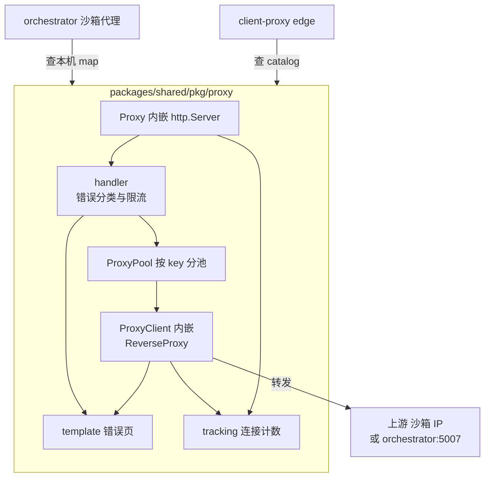

# 54 · 共享代理库

> `packages/shared/pkg/proxy` 是一个只有一千多行的包，但 e2b 的所有沙箱入站流量都从它身上过。
> 它把「怎么转发」与「转到哪里」切开：转发由它实现，寻址由使用者以回调形式注入。
> 本篇讲这个切口划在哪里、连接池为什么要按 key 分、一串看似随意的超时数字是怎么排出来的。
>
> **读者**：工程师、系统工程师。
> **预备**：[第 08 篇 · 本书用到的 Go 服务工程](08-go-service-toolkit.md)；
> 知道 HTTP keepalive 与反向代理的基本概念。
> **代码**：`packages/shared/pkg/proxy/`（`proxy.go`、`handler.go`、`host.go`、`errors.go`、
> `pool/`、`template/`、`tracking/`）、`packages/orchestrator/internal/proxy/proxy.go`、
> `packages/client-proxy/internal/proxy/proxy.go`

---

## 0. 本篇要回答的问题

1. 两个进程共用一个代理库，它们共用的到底是哪一部分，各自又留了什么给自己？
2. 连接池为什么按 key 分，而不是像标准 `http.Transport` 那样按目的地址分？
3. 600 s、610 s、620 s、640 s 这一串空闲超时是怎么排出来的，起点为什么是 600？
   库里那个「下游比上游多 10」的缓冲真的生效了吗？
4. `ForceAttemptHTTP2: false` 关掉了什么，代价是什么？
5. WebSocket 与流式响应在这个库里为什么没有一行专门的代码？
6. 一次转发失败，用户看到的是 JSON 还是 HTML，由谁决定？

---

## 1. 一个库，两个使用者

上游 2026.09 里有两处需要把一个 HTTP 请求转发到别处，并且要求几乎一样：

- **orchestrator 的沙箱代理**（`packages/orchestrator/internal/proxy/proxy.go`）：
  收到 `<port>-<sandboxID>.<domain>` 形式的请求，转发到本机某台 microVM 的
  网络槽位宿主侧 IP 加端口。
- **client-proxy（edge）**（`packages/client-proxy/internal/proxy/proxy.go`）：
  收到同样形式的请求，转发到某个节点的 orchestrator 代理端口 5007。

两者的差别只有一句话：**怎么从请求算出目的地**。前者查本进程内的 sandbox map，
后者查 Redis 里的 sandbox catalog，必要时还会触发一次恢复
（[第 55 篇 §4](55-sandbox-catalog-and-routing.md#4-读取者client-proxy-的一次解析)）。
剩下的部分——建连、连接复用、重试、超时、错误页、连接计数——完全一致。

如果不抽库，这些部分要在两个进程里各写一遍。它们又恰恰是最容易写错、最难在测试里覆盖的部分：
连接复用错一次，用户会看到「请求打到了别人的沙箱」这种最坏的故障。
所以 `packages/shared/pkg/proxy` 的切口划在这里：

```text
packages/shared/pkg/proxy/
├── proxy.go        Proxy：内嵌 http.Server，New() 收六个参数
├── handler.go      handler()：错误分类 + 连接数限流 + 取池转发
├── host.go         GetTargetFromRequest()：从 Host 或请求头解析 sandbox ID 与端口
├── errors.go       七种寻址错误的类型定义
├── pool/
│   ├── pool.go        ProxyPool：按 ConnectionKey 分池
│   ├── client.go      ProxyClient：内嵌 httputil.ReverseProxy + 自建 http.Transport
│   ├── destination.go Destination：寻址回调的返回值
│   └── context.go     Destination 通过 context 传给 ReverseProxy 的三个钩子
├── template/       六张错误页，浏览器给 HTML、程序给 JSON
└── tracking/       给 net.Listener 与 net.Conn 套一层计数与强制 RST
```

`proxy.go` 的 `New()` 是整个库唯一的入口，签名把「共用什么、注入什么」写得很直白：

```go
func New(
	port uint16,
	maxConnectionAttempts MaxConnectionAttempts,
	idleTimeout time.Duration,
	getDestination func(r *http.Request) (*pool.Destination, error),
	connLimitConfig *ConnectionLimitConfig,
	disableKeepAlives bool,
) *Proxy
```

`getDestination` 是注入点，其余五个是参数化点。使用者拿到的 `Proxy` 内嵌了 `http.Server`，
因此 `Shutdown()`、`Close()` 这些方法直接可用，两个进程的优雅退出逻辑都建立在这上面。



## 2. 分池：`ConnectionKey` 是什么

### 2.1 标准做法在这里为什么不成立

Go 的 `http.Transport` 自带连接复用，复用的判据是 `(scheme, host, port)` 加上代理与 TLS 配置。
对普通的服务间调用这是对的：同一个 `host:port` 后面就是同一个服务。

沙箱这一侧不成立。网络槽位是回收复用的（[第 35 篇 §4](35-sandbox-networking.md#4-复用一个槽位复位了什么没复位什么)），
先后两台沙箱可能拿到同一个宿主侧 IP 与同一个端口。一条残留的 keepalive 连接如果按
`host:port` 认，就会被下一台沙箱的请求捡去用，而连接的另一端早已不是原来的 guest。

所以库在 `http.Transport` 之上又加了一层：`pool/pool.go` 的 `ProxyPool` 是一张
`ConnectionKey → *ProxyClient` 的并发 map（`smap.Map`），每个 `ProxyClient` 拥有
**自己的** `http.Transport`，也就是自己的一套连接。`Destination.ConnectionKey` 的注释
把这层关系说得很清楚：它「先于 IP:port 的比对生效」。

key 取什么由使用者决定。edge 侧用常量 `pool.ClientProxyConnectionKey`（值是 `client-proxy`），
因为它连的是各节点固定的代理端口，复用没有风险；orchestrator 侧用 `sbx.LifecycleID`，
即「一次 Firecracker 进程」的粒度，理由与 pause / resume 的竞态有关，
[第 36 篇 §2.2](36-orchestrator-proxy-and-envd-client.md#22-连接池的-key-为什么是-lifecycleid) 有完整推导，这里不重复。

库自身对 key 的语义不作任何假设，它只保证一件事：**不同 key 之间的 TCP 连接互不可见**。
`proxy_test.go` 里 `TestProxyReuseConnectionsWhenBackendChangesFails` 与
`TestProxyDoesNotReuseConnectionsWhenBackendChanges` 是同一个场景的两半——同一个地址上换了后端进程，
key 不变时请求拿到 502，key 变了时请求正常——这两个测试就是这条保证的可执行说明。

### 2.2 池条目怎么退场

`ProxyPool` 没有过期回收：条目只在 `Close(connectionKey)` 被显式调用时消失。
`Close()` 做两件事，顺序有意义：

1. `closeIdleConnections()`：关掉 `http.Transport` 里空闲的连接；
2. `resetAllConnections()`：遍历 `ProxyClient.activeConnections`，对**仍在使用**的连接逐条
   `tracking.Connection.Reset()`。

`Reset()` 先 `SetLinger(0)` 再 `Close()`，也就是发 RST 而不是 FIN。差别在于 FIN 是「我说完了」，
对端可以继续发；RST 是「这条连接作废」，两端立刻放弃。
沙箱已经不在了，还在传输中的响应没有任何完成的可能，让客户端立刻收到错误比让它挂到超时更好。

代价是池条目的数量与「启动过多少次沙箱」同阶，而不是与「当前有多少沙箱」同阶，
清理漏一次就永久多一个条目。库把这个责任留给了使用者：
edge 侧只有一个 key，条目恒为 1；orchestrator 侧则在沙箱停止与模板构建的多条路径上调用
`RemoveFromPool()`。

### 2.3 每个池能开多少连接

`proxy.go` 里 `maxClientConns = 16384`，注释说明这个数字选得比可用端口数小。
`ProxyPool.Get()` 在造 `ProxyClient` 时把它拆成两个上限：

| 字段 | 值 | 含义 |
|---|---|---|
| `MaxIdleConns` | 16384 | 这一个池的空闲连接总数上限 |
| `MaxIdleConnsPerHost` | 16384 / 4 = 4096 | 单个上游 `host:port` 的空闲连接上限 |

分母是 `pool.go` 的常量 `hostConnectionSplit = 4`，注释给的理由是「避免一个上游把可用端口耗尽」。
它同时留了一条退化规则：当总数本身不大于 4 时，两个上限取同一个值。

这个拆分对两侧的意义不同。orchestrator 侧一个池只对应一台沙箱，只有一个上游，两个上限里
实际起作用的是 4096；edge 侧只有一个池却有很多上游节点，4096 是「单个 orchestrator 节点」的上限，
16384 是全局上限。**推论**：edge 侧这组数字意味着一个 edge 实例最多与四个 orchestrator 节点
维持满额空闲连接；节点更多时空闲连接会被更早地关掉，表现为复用率下降而不是报错。

## 3. Transport 的每个字段

`pool/client.go` 的 `newProxyClient()` 手工构造 `http.Transport`，逐字段偏离默认值。
把它们放在一起看，能读出这个库的运行环境假设。

| 字段 | 值 | 为什么 |
|---|---|---|
| `ForceAttemptHTTP2` | `false` | 见下 |
| `DisableCompression` | `true` | 代理不解析也不改写响应体，压缩由两端自己协商 |
| `TLSHandshakeTimeout` | `0` | 上游一律是明文 HTTP，字段本身不会被用到 |
| `ResponseHeaderTimeout` | `0` | 沙箱里的服务可能长时间不吐头，超时会误杀长任务 |
| `IdleConnTimeout` | 使用者传入 | 见 §4 |
| `DisableKeepAlives` | 使用者传入 | orchestrator 传 `true`，edge 传 `false` |
| `DialContext` | 自定义 | 带线性退避的建连重试，并把连接包进 `tracking.Connection` |

`ForceAttemptHTTP2` 是 Go 在自定义 `Transport` 上默认关闭、在默认 `Transport` 上打开的开关。
打开时，Go 会为 HTTPS 连接尝试 ALPN 协商 h2。这里关掉它有两个后果：
一是上游连接一律走 HTTP/1.1；二是 HTTP/1.1 的连接语义得以保留——一条连接同时只承载一个请求，
`ProxyClient` 因此可以用「关掉这个池的全部连接」来实现「切断这台沙箱的全部流量」。
如果走 HTTP/2，多个沙箱的请求可能复用同一条连接上的不同 stream，§2 那套按 key 隔离的设计就失去了物理基础。

代价是明确的：从代理到上游不再有 HTTP/2 的多路复用，每个并发请求占一条 TCP 连接，
这也是 `MaxIdleConns` 要开到 16384 的原因。上游侧也确实没有 HTTP/2 服务端：
`packages/envd/main.go` 里的 `http.Server` 没有配置 h2c，orchestrator 的代理端口同样是纯 HTTP/1.1。
**推论**：客户端到 edge 这一段是否用 HTTP/2 由前置负载均衡器决定，与本库无关；
本库只保证从自己往上游是 HTTP/1.1。

`DialContext` 里的重试是这个库唯一的重试：只对**建连失败**重试，
退避 100 ms、200 ms、300 ms、400 ms，最多 `maxConnectionAttempts` 次。
注释说明它是为了等 envd 的端口扫描发现新监听并起 socat（约 1 s）。
请求一旦发出就不再重试——转发一个可能带 body 的请求本来就不可重放。
`TestProxyRetriesOnDelayedBackendStartup` 覆盖了这条路径。

## 4. 空闲超时的阶梯

一条 keepalive 连接的两端各有自己的空闲超时。如果**下游的超时比上游短**，
就会出现这样的竞态：上游认为连接还能用、下游已经把它关了，上游把请求写进一条正在关闭的连接，
用户看到一个无法解释的失败。

避免它的办法是让超时沿着数据流方向单调递增：越靠近客户端的一层，超时越长。
上游 2026.09 的整条链路确实是这么排的：

```text
GCP 负载均衡器 后端 keepalive 空闲超时        600 s   （云厂商默认值）
  ↓
client-proxy  http.Server.IdleTimeout         610 s   下游，见下文的 +10 说明
client-proxy  Transport.IdleConnTimeout       610 s   client-proxy/internal/proxy/proxy.go
  ↓
orchestrator  http.Server.IdleTimeout         620 s   下游
orchestrator  Transport.IdleConnTimeout       620 s   orchestrator/internal/proxy/proxy.go
  ↓
envd          http.Server.IdleTimeout         640 s   envd/main.go
```

每个进程里的两个数由库统一算：`New()` 把 `idleTimeout` 原样交给连接池，
把 `idleTimeout + idleTimeoutBufferUpstreamDownstream` 交给 `http.Server.IdleTimeout`，
注释写明理由是「面向客户端的空闲超时要大于面向服务端的」。使用者只需要传一个数，
不变量不会因为谁忘了加而破掉。

这个缓冲的量值需要说清楚。`proxy.go` 里 `idleTimeoutBufferUpstreamDownstream = 10`
写在一个没有类型标注的 `const` 块里，因此它是一个无类型整数常量；
与 `time.Duration` 相加时按 `time.Duration` 的底层单位解释，也就是 **10 ns 而不是 10 s**。
方向仍然成立（下游确实比上游大），但余量小到不具备工程意义：
同一个进程里下游与上游的空闲超时实际上是同一个值。真正提供余量的是跨进程的那三级台阶
——600 → 610 → 620 → 640，每级 10 s 到 20 s，它们各自写死在使用者的常量里，不经过这个缓冲。
**推论**：把常量写成 `10 * time.Second` 才是注释描述的行为；当前写法下，
进程内那条不变量退化成了一个恒真但无用的比较。

起点 600 s 来自代码注释里链接的 GCP 文档：负载均衡器的后端 keepalive 超时是 600 s，
后端服务的空闲超时必须比它大。**这个数字是外部约束，不是本库的选择**——
它一路把 610、620、640 顶了出来。

**推论**：单机离线版没有 GCP 负载均衡器，80 端口的流量由 iptables REDIRECT 直接改道到
client-proxy 的 3002 端口（`deploy-docs/07-single-node-traffic-architecture.md`），
600 这个起点在那里不再对应任何真实部件，但整条阶梯仍然自洽，因此保留原值没有副作用。

`http.Server` 的 `ReadTimeout`、`WriteTimeout`、`ReadHeaderTimeout` 全部设成 0，即不限时。
对一个代理来说这是必须的：它无法知道被代理的请求该花多久。
限时的职责被推给了上层——每沙箱的并发连接数上限（`ConnectionLimitConfig`）与沙箱自身的生命周期。

## 5. 转发本体：三个钩子

`ProxyClient` 内嵌 `httputil.ReverseProxy`，只覆写它的三个钩子，转发主体逻辑全部来自标准库。

**`Rewrite`**（Go 1.20 之后取代 `Director` 的新接口）负责改写出站请求。它做两件事：

1. `r.SetURL(t.Url)`：把目的地换成 `Destination.Url`。
2. 处理 Host 头。默认分支是 `r.Out.Host = r.In.Host`，即**原样透传客户端看到的 Host**。
   代码注释解释了为什么不用标准库的 `SetXForwarded()`：某些服务端会据此把
   `Content-Location` 头改写成 `http`，破坏客户的服务。
   另一个分支是 `Destination.MaskRequestHost` 非空时把 Host 换成指定值，
   同时把原 Host 放进 `X-Forwarded-Host`；这一路用于绕过上游服务对来源 Host 的校验，
   值里的占位符 `${PORT}`（`pool.MaskRequestHostPortPlaceholder`）由 orchestrator 侧
   替换成实际端口。

**`ErrorHandler`** 在转发失败时被调用。它按 `Destination.DefaultToPortError` 分岔：
为真时渲染「端口未开放」错误页（orchestrator 侧传真——转发失败通常意味着沙箱里没有服务监听那个端口），
为假时返回朴素的 502（edge 侧传假——那里的失败是节点级问题，不该说成端口问题）。

**`ModifyResponse`** 不改响应，只按状态码分级打日志：5xx 记 warn，其余记 debug。

三个钩子都需要知道「这个请求是发给哪台沙箱的」，但 `ReverseProxy` 的接口里没有这个位置。
库的做法是 `handler.go` 在转发前把 `Destination` 塞进请求 context
（`pool.WithDestination()`），钩子里再取出来（`pool/context.go` 的 `getDestination()`）。
取不到时钩子会退化成一条 error 日志加 500，不会 panic。

### 5.1 WebSocket 与流式响应

这个库里没有一行 WebSocket 代码，也没有 `FlushInterval` 的设置，但两者都工作。原因全在标准库：

- `httputil.ReverseProxy` 识别 `Connection: Upgrade`，在上游返回 101 时接管两侧连接并双向拷贝字节。
  这条路径要求上游是 HTTP/1.1——§3 关掉 HTTP/2 顺带保证了它。
- `FlushInterval` 为 0 时，`ReverseProxy` 对 `Content-Type: text/event-stream`
  以及 `Content-Length` 未知的响应立即逐块刷出，不做缓冲。

也就是说，长连接能工作，靠的是**不去设置**那些会破坏它的字段：`ReadTimeout`、`WriteTimeout`、
`ResponseHeaderTimeout` 都是 0，`FlushInterval` 保持默认。这是一处「配置的缺席即是设计」的地方，
读代码时容易略过。

### 5.2 连接计数

`tracking/` 只有两个类型，都是薄包装：

- `tracking.Listener` 包 `net.Listener`，`Accept()` 时给计数器加一——数的是**下游**连接
  （客户端到本进程）。
- `tracking.Connection` 包 `net.Conn`，在 `DialContext` 里创建，数的是**上游**连接
  （本进程到目的地），同时把自己注册进 `ProxyClient.activeConnections`，供 §2.2 的强制重置使用。

`Proxy` 暴露四个读数：`CurrentServerConnections()`（下游）、`CurrentPoolConnections()`（上游）、
`TotalPoolConnections()`（上游累计）、`CurrentPoolSize()`（池条目数）。
两个使用者把它们注册成 OpenTelemetry 的 observable up-down counter
（[第 60 篇 §5](60-telemetry.md#5-名称表)）。

这里有一处名实不符：`packages/client-proxy/internal/proxy/proxy.go` 把
`ClientProxyPoolConnectionsMeterCounterName` 接到了 `CurrentServerConnections()`、
把 `ClientProxyServerConnectionsMeterCounterName` 接到了 `CurrentPoolConnections()`，
而 orchestrator 侧的两个同名指标接法与之相反。两个数都在采，只是 edge 侧这两个指标的
名字与含义对调了。**推论**：这是接线笔误，不影响转发行为，但按名字读 edge 的连接曲线会得到反的结论。
这是上游 2026.09 自带的问题，不是 ARM 适配版引入的，登记在
[第 86 篇 §7](86-known-issues-and-debt.md#7-继承自上游的问题)。

## 6. 错误页：一份数据，两种表现

寻址失败与转发失败要告诉用户，而「用户」有两类：浏览器里的人，和 SDK 里的程序。
`template/` 用一个泛型类型同时服务两者。

`template/template.go` 的 `TemplatedError[T]` 持有一个 `html/template` 与一份变量 `T`，
`T` 只需满足 `StatusCode() int`。`HandleError()` 用正则匹配 `User-Agent`：

```go
var browserRegex = regexp.MustCompile(`(?i)mozilla|chrome|safari|firefox|edge|opera|msie`)
```

命中就渲染 HTML 页（`Content-Type: text/html`），否则把同一份变量 `json.Marshal` 出去
（`Content-Type: application/json`）。两条路用同一个状态码，
JSON 里靠结构体 tag 隐去只对页面有意义的字段（例如 `Host` 标了 `json:"-"`）。
六张 HTML 页以 `//go:embed` 编进二进制，样式内联，不依赖任何外部资源——
错误页要在网络已经出问题的时候还能显示。

库支持的错误如下，前六种由 `handler.go` 在寻址阶段按 `errors.As` / `errors.Is` 分派，
最后一种由 `ErrorHandler` 在转发阶段触发：

| 错误类型 | 状态码 | 表现 | 谁产生 |
|---|---|---|---|
| `MissingHeaderError` | 400 | 纯文本 | `host.go` 解析请求头 |
| `ErrInvalidHost` | 400 | 纯文本 | `host.go` 解析 Host |
| `ErrInvalidSandboxID` | 400 | 纯文本 | `host.go` 校验 ID |
| `InvalidSandboxPortError` | 400 | 纯文本 | `host.go` 解析端口 |
| `SandboxNotFoundError` | 502 | 模板页 | 两侧使用者 |
| `SandboxResumePermissionDeniedError` | 403 | 模板页 | edge 侧恢复被拒 |
| `MissingTrafficAccessTokenError` / `InvalidTrafficAccessTokenError` | 403 | 模板页 | orchestrator 侧校验 |
| 超过并发连接上限 | 429 | 模板页 | `handler.go` 限流 |
| 转发失败且 `DefaultToPortError` | 502 | 模板页 | `ErrorHandler` |

分界线是「请求本身写错了」与「请求没错但沙箱侧有问题」：前者用 400 加一行纯文本，
后者才值得一张页面。**推论**：把「沙箱不存在」映射成 502 而不是 404，是为了区分
「代理层没找到沙箱」与「沙箱里的服务返回了 404」；代码与注释里没有直接说明这一点。

`host.go` 的 `parseHost()` 与 `GetTargetFromRequest()` 也在这个包里，
两侧共用同一份解析规则；规则本身在
[第 53 篇 §3](53-client-proxy-edge.md#3-域名解析从-host-头到-sandboxid-与端口) 里讲。

## 7. 两侧到底差在哪

把使用者传给 `New()` 的参数并排列出来，差异一目了然（**回顾**：其中前三行也出现在
[第 53 篇 §5](53-client-proxy-edge.md#5-转发交给共享代理库)，这里补齐其余四行并给出统一的解释）：

| 参数 | orchestrator 沙箱代理 | client-proxy（edge） |
|---|---|---|
| `maxConnectionAttempts` | `SandboxProxyRetries` = 5 | `ClientProxyRetries` = 1 |
| `idleTimeout` | 620 s | 610 s |
| `disableKeepAlives` | `true` | `false` |
| `connLimitConfig` | 按沙箱限流，三个指标回调 | `nil`，不限流 |
| `ConnectionKey` | `sbx.LifecycleID` | 常量 `client-proxy` |
| `DefaultToPortError` | `true` | `false` |
| `MaskRequestHost` | 按沙箱配置设置 | 不设置 |

一条线索能把这些差异串起来：**orchestrator 是链路的最后一跳，edge 是中间一跳**。
最后一跳直接面对可能还没起好、可能刚重启的 guest 服务，所以要重试 5 次、
所以失败时说「端口没开」、所以每台沙箱要限流；而且它与沙箱同在一台宿主上，
重新建连的开销小到可以直接关掉 keepalive。中间一跳面对的是稳定的节点端口，
重试没有意义（真正需要等待的那 1 s 由下一跳负责），保持 keepalive 收益明显，
错误也只能诚实地报成 502。

`connLimitConfig` 只有 orchestrator 传，逻辑却写在库里（`handler.go`）：
它在拿到 `Destination` 之后、取连接池之前 `TryAcquire()`，用 `defer` 保证 `Release()`，
上限来自特性开关，回调把计数与时长喂给指标。`packages/shared/pkg/connlimit` 的
`ConnectionLimiter` 对负数上限不设限、对 0 全部拒绝。
放在库里而不是 orchestrator 里的理由是它需要拦在转发之前，
而那个位置属于库；`nil` 时整段逻辑被跳过。

## 8. ARM 适配版的差异

ARM 适配版没有改动 `packages/shared/pkg/proxy/` 与两个使用者的任何一行 Go 代码——
对 `f8c2f0cde..fbee6fcd1` 的 diff 在这几个目录下只命中 `packages/client-proxy/Dockerfile`
与 `packages/client-proxy/Makefile`，改的是交叉编译目标（按 `uname -m` 选 `GOARCH`）
与镜像仓库地址。转发路径与超时数字都保持上游原样，详见
[第 85 篇 §4](85-dev-workflow-and-packaging.md#4-四个仓库怎么汇成一个包)。

## 9. 小结

- 库把「怎么转发」与「转到哪里」切开：`New()` 的 `getDestination` 回调是唯一的注入点，
  另外五个参数是两侧唯一的差异面。
- 连接池按 `Destination.ConnectionKey` 分，不按 `host:port` 分。这是网络槽位复用逼出来的：
  key 相同才允许复用同一条 TCP 连接。
- 池条目没有过期回收，只能由使用者调 `RemoveFromPool()` 关闭；关闭时对活跃连接发 RST 而非 FIN。
- `ForceAttemptHTTP2: false` 让上游一律走 HTTP/1.1。收益是连接与请求一一对应，
  按池切断流量与 WebSocket 升级都成立；代价是失去多路复用，连接数上限要开到 16384。
- 空闲超时排成 600 → 610 → 620 → 640 的单调递增阶梯，起点是 GCP 负载均衡器的外部约束；
  库用常量 `idleTimeoutBufferUpstreamDownstream` 给进程内的下游再加一点余量，
  但这个常量无类型，实际只加了 10 ns，因此进程内的余量等于没有。
- WebSocket 与流式响应没有专门代码，靠的是 `ReverseProxy` 的内建支持加上
  `ReadTimeout` / `WriteTimeout` / `ResponseHeaderTimeout` 都为 0。
- 错误页用一个泛型 `TemplatedError[T]` 同时产出 HTML 与 JSON，按 `User-Agent` 正则分流；
  400 一律纯文本，403 / 429 / 502 才给页面。
- 差异的根源是位置：orchestrator 是最后一跳（重试、限流、端口错误页、无 keepalive），
  edge 是中间一跳（不重试、不限流、502、保持 keepalive）。

## 延伸阅读 / 下一篇

- [第 53 篇 · client-proxy（edge）](53-client-proxy-edge.md)：域名解析规则（[§3](53-client-proxy-edge.md#3-域名解析从-host-头到-sandboxid-与端口)）与 edge 的进程结构（[§2](53-client-proxy-edge.md#2-进程结构两个端口没有第三个)）。
- [第 55 篇 · 沙箱目录与跨节点路由](55-sandbox-catalog-and-routing.md)：edge 侧
  `getDestination` 回调背后的查找（[§4](55-sandbox-catalog-and-routing.md#4-读取者client-proxy-的一次解析)）与恢复（[§5](55-sandbox-catalog-and-routing.md#5-resume-on-connect让访问本身唤醒沙箱)）。
- [第 36 篇 · 代理与 envd 通信](36-orchestrator-proxy-and-envd-client.md)：orchestrator 侧
  `getDestination` 回调（[§2.1](36-orchestrator-proxy-and-envd-client.md#21-从请求到目的地)）、
  `LifecycleID` 作 key 的完整推导（[§2.2](36-orchestrator-proxy-and-envd-client.md#22-连接池的-key-为什么是-lifecycleid)）、
  两个 access token（[§2.4](36-orchestrator-proxy-and-envd-client.md#24-两个-token-与两处校验)）。
- [第 35 篇 §3](35-sandbox-networking.md#3-池两条队列两种优先级)：网络槽位为什么会被复用。
- [第 60 篇 §2](60-telemetry.md#2-两个-meter-provider)：本篇提到的四个连接计数如何进入指标系统。
- Go 标准库 `net/http/httputil` 的 `ReverseProxy` 文档，尤其是 `Rewrite`、`FlushInterval`
  与 protocol upgrade 三节。
