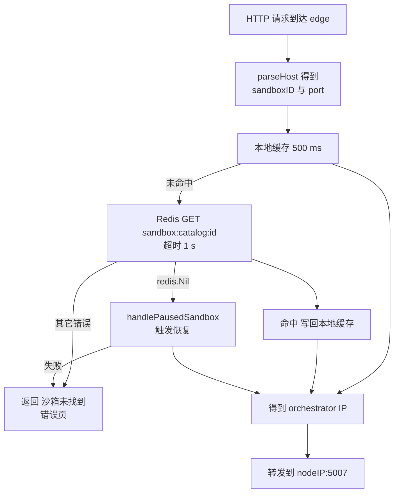
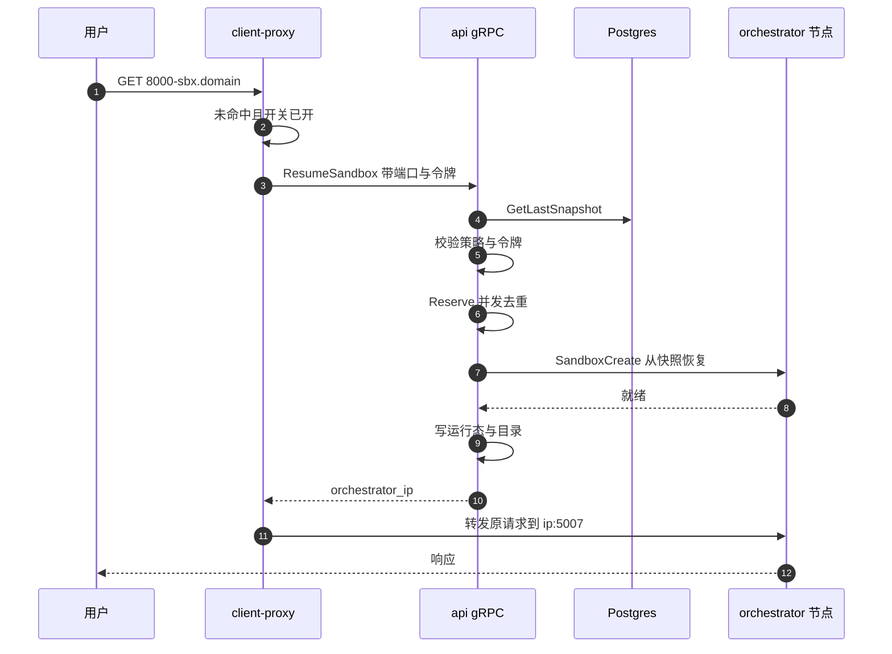

# 55 · 沙箱目录与跨节点路由

> 一个沙箱只存在于集群里的某一台机器上，而用户的 HTTP 请求先落在任意一台边缘代理上。
> 把「沙箱 ID」翻译成「节点 IP」的那张表叫 sandbox catalog。本篇讲这张表由谁写、由谁读、
> 什么时候失效，以及当请求指向一台已经暂停的沙箱时，边缘代理如何反过来驱动 api 把它恢复。
>
> **读者**：工程师、运维。　**预备**：[第 20 篇 · 沙箱运行态存储](20-sandbox-state-storage.md)、
> [第 21 篇 · 集群与服务发现](21-clusters-and-discovery.md)。
> **代码**：`packages/shared/pkg/sandbox-catalog/`、`packages/api/internal/orchestrator/lifecycle.go`、
> `packages/client-proxy/internal/proxy/proxy.go`、`packages/shared/pkg/grpc/proxy/proxy.proto`、
> `packages/api/internal/handlers/proxy_grpc.go`

---

## 0. 本篇要回答的问题

1. 为什么路由需要一张单独的表，而不是复用数据库或服务发现？
2. 这张表的写入发生在沙箱生命周期的哪个点上，为什么必须是同步的？
3. TTL 是多长、由什么决定，为什么说 TTL 是兜底而不是主要的失效手段？
4. 访问一台已暂停的沙箱时会发生什么？谁发起恢复，谁做鉴权，并发的重复请求在哪里被合并？
5. 多个 edge 实例之间的视图能差多久？表与现实不一致时，会不会把请求转给错误的沙箱？

---

## 1. 问题：一次请求要跨过两次不知道

用户访问沙箱里的服务，用的是形如 `<port>-<sandboxID>.<domain>` 的域名
（解析规则见[第 53 篇 §3](53-client-proxy-edge.md#3-域名解析从-host-头到-sandboxid-与端口)）。这个域名是泛解析的：
它指向 client-proxy 这一层，而不是指向某台具体的宿主机。于是请求到达 edge 时，
系统面对两次「不知道」：edge 不知道这个沙箱在哪台节点上，也不知道它现在是不是还活着。

有几种显而易见的做法，e2b 都没有采用，理由值得先摆出来。

**把节点写进域名。** 沙箱一旦换节点（pause 之后 resume 到另一台机器），
用户手上的 URL 就失效，而 pause / resume 恰好是 e2b 的核心能力。上游 2026.09 里
`consts.ClientID` 已经退化成一个不参与寻址的常量，正是这条路走不通留下的痕迹。

**每次查数据库。** 沙箱的权威状态在运行态存储里（[第 20 篇 §1](20-sandbox-state-storage.md#1-为什么需要单独一份运行态)），
但量级不匹配：创建与销毁是每秒几十次，穿过 edge 的请求是每秒几万次。
把一条最频繁的读路径压在业务数据库上不划算。

**让 edge 广播询问所有节点。** 节点数到三位数后一次请求要扇出上百次探测，不可行。

sandbox catalog 是第三条路：**一张为读优化的、允许短暂陈旧的、只回答「在哪台机器上」这一个问题的表。**
它存在 Redis 里，键是 `sandbox:catalog:<sandboxID>`，值是一段 JSON。
把它与运行态存储放在一起对比的表格在[第 20 篇 §5](20-sandbox-state-storage.md#5-与-sandbox-catalog-的关系)，
这里不重复；本篇关心的是它两端的行为。

## 2. 表里存了什么，以及为什么存这些

`packages/shared/pkg/sandbox-catalog/catalog.go` 定义的 `SandboxInfo` 只有五个字段：

| 字段 | 含义 | 谁在用 |
|---|---|---|
| `OrchestratorID` | orchestrator 进程的 service instance ID | 预留给 edge 侧的节点池解析 |
| `OrchestratorIP` | 节点 IP | client-proxy 直接用它拼转发目标 |
| `ExecutionID` | 本次执行的 UUID，从 start/resume 到 stop/pause 不变 | 删除时的归属校验 |
| `StartedAt` | 沙箱启动时刻 | 诊断 |
| `MaxLengthInHours` | 该沙箱可能运行的最长小时数 | 计算 TTL |

这里**没有**端口、没有团队、没有模板、没有状态：端口由请求自带，团队与鉴权在别处做，
状态是这张表回答不了的问题。`proxy.go` 里还留了一句待办 ——
等 edge 全面接管 orchestrator 的发现之后，IP 就不必再写进目录。

接口只有四个方法：`GetSandbox`、`StoreSandbox`、`DeleteSandbox`、`Close`。
没有列举、没有按节点反查、没有批量。这是刻意的：任何「扫描全表」的接口都会
在 Redis 上引入 `KEYS` 或一份额外的索引，而路由不需要它。

两份实现。`catalog_redis.go` 是生产形态；`catalog_memory.go` 是单进程回退，
在 Redis 客户端构造返回 `ErrRedisDisabled` 时选用（`packages/client-proxy/main.go`
与 `packages/api/internal/orchestrator/orchestrator.go`），日志写着它「只在单实例部署下工作」。
两份的 `DeleteSandbox` 都带 `executionID` 参数，语义一致，差别在原子性上，§7 会讲。

## 3. 写入者：api，在沙箱可达的那一刻

唯一的写入点是 `packages/api/internal/orchestrator/lifecycle.go` 的
`addSandboxToRoutingTable()`。它被注册成 `sandbox.Store` 的一个回调：

```go
o.sandboxStore = sandbox.NewStore(
    sandboxStorage,
    reservationStorage,
    sandbox.Callbacks{
        AddSandboxToRoutingTable: o.addSandboxToRoutingTable,
        AsyncSandboxCounter:      o.sandboxCounterInsert,
        AsyncNewlyCreatedSandbox: o.handleNewlyCreatedSandbox,
    },
)
```

三个回调里只有它是同步调用的，另外两个都用 `go` 起协程。
`packages/api/internal/sandbox/store.go` 在 `Callbacks` 的字段上写明了理由：
路由写入「应当同步调用，以免出现我们还不知道往哪里路由的竞态」。

顺序值得看清楚。`create_instance.go` 的 `CreateSandbox()` 先做团队并发占位（`Reserve`），
再挑节点、发 `SandboxCreate` gRPC，拿到成功应答后才调 `sandboxStore.Add()`；
`Add()` 里先写运行态存储，成功后才同步写目录：

```text
节点上沙箱已就绪 → 写运行态存储 → 写 catalog → HTTP 201 返回给用户
```

在「沙箱已就绪」与「写 catalog」之间存在一个窗口，窗口里沙箱是活的但目录里查不到。
这个窗口对用户不可见，因为用户还没拿到 201、还不知道沙箱 ID。

两个分支决定了写不写：

```go
if !node.IsNomadManaged() && !env.IsLocal() {
    return
}
```

`IsNomadManaged()` 判断的是 `NomadNodeShortID != "unknown"`
（`packages/api/internal/orchestrator/nodemanager/node.go`）。对远端集群的节点，
api 不写自己这边的 Redis，而是把路由注册塞进发往该节点的 gRPC metadata：
`nodemanager/metadata.go` 的 `GetSandboxCreateCtx()` 调
`edge.SerializeSandboxCatalogCreateEvent()`，把沙箱 ID、执行 ID、orchestrator ID、启动时刻与最长小时数
写成 `sandbox-catalog-create` 事件头（注意没有节点 IP，接收方自己知道）；删除对应 `GetSandboxDeleteCtx()` 与 `sandbox-catalog-delete`。这条链路的另一端不在 infra 仓库里：
配对的解析函数在上游 2026.09 中没有任何调用者，理由见
[第 56 篇 §1](56-edge-api.md#1-一个刻意留下的缺口)。因此**一个集群的目录只由该集群自己的 api 维护**，
跨集群路由靠请求本身带着注册信息走过去，见[第 21 篇 §7](21-clusters-and-discovery.md#7-跨集群的两条数据通路)。

### 3.1 TTL 从哪来

```go
info.MaxLengthInHours = int64(sandbox.MaxInstanceLength / time.Hour)
lifetime := time.Duration(info.MaxLengthInHours) * time.Hour
err := o.routingCatalog.StoreSandbox(ctx, sandbox.SandboxID, &info, lifetime)
```

`MaxInstanceLength` 在 `create_instance.go` 里由 `time.Duration(team.Limits.MaxLengthHours) * time.Hour`
构造，本来就是整小时，所以中间那次除法与乘法的截断是无损的。

这个 TTL 容易误读：**它不是沙箱的超时时间，而是该团队档位允许的最长运行时长。**
一台设置了 5 分钟超时的沙箱，若团队档位是 24 小时，目录记录的 TTL 就是 24 小时。
TTL 的作用是保证一条记录不会永远留下，而不是让记录跟着沙箱一起消失：
正常结束靠显式删除清理，只有删除失败时 TTL 才兜底，
代价是陈旧记录最长可存活到档位上限。§7 会说明这为什么仍然是安全的。

**推论**：若某个档位的 `max_length_hours` 为 0，`lifetime` 就是 0，
go-redis 的 `Set` 把 0 解释为「不设过期」，该记录将永久驻留。上游 2026.09 的代码里
没有对这种情况的防护；实际的档位表是否可能出现 0，本书没有对应的数据。

删除在 `packages/api/internal/orchestrator/delete_instance.go` 的 `removeSandboxFromNode()` 里，
位置在向节点发 pause / kill 请求**之前**：先让 edge 停止送新请求，再动真正的沙箱。
这个顺序把「已摘掉路由但还在跑」的窗口留在删除侧，方向是安全的。

## 4. 读取者：client-proxy 的一次解析

`packages/client-proxy/internal/proxy/proxy.go` 的 `NewClientProxy()` 给共享代理库
（[第 54 篇 §5](54-shared-proxy-library.md#5-转发本体三个钩子)）注册了一个目标解析函数，它做三件事：
从 Host 解析出沙箱 ID 与端口、调 `catalogResolution()` 拿节点 IP、
把目标拼成 `http://<nodeIP>:5007`。5007 是 orchestrator 的沙箱代理端口，
常量 `orchestratorProxyPort` 直接写死在这个文件里。

`catalogResolution()` 的主体只有十几行：

```go
s, err := c.GetSandbox(ctx, sandboxId)
if err != nil {
    if errors.Is(err, catalog.ErrSandboxNotFound) {
        nodeIP, res, pausedErr := handlePausedSandbox(...)
        ...
    }
    return "", fmt.Errorf("failed to get sandbox from catalog: %w", err)
}
return s.OrchestratorIP, nil
```

命中就返回 IP，未命中走恢复路径（§5），其它错误（Redis 超时、JSON 解析失败）
原样上抛，最终翻成 `NewErrSandboxNotFound` 的错误页。这里没有重试：
一次 Redis 抖动就是一次用户可见的失败。

`RedisSandboxCatalog.GetSandbox()` 前面挡着一层本地缓存：一个 TTL 500 ms、
关闭了 touch-on-hit 的 `ttlcache`。命中直接返回，未命中才查 Redis
（套 1 s 的 `context.WithTimeout`，常量 `catalogRedisTimeout`），拿到结果后写回缓存。
500 ms 这个值代码注释给了理由：缓存太久，沙箱换到别的 orchestrator 之后就找不到了。

这层缓存的三个性质决定了后面的一致性讨论：

- **只缓存正结果。** `GetSandbox()` 在 `redis.Nil` 时直接返回 `ErrSandboxNotFound`，
  不写缓存。「查不到」这个结论没有被缓存，每一次请求都会重新查 Redis。
- **写入方也填缓存。** `StoreSandbox()` 写完 Redis 后顺手 `c.cache.Set(...)`，
  这只对 api 侧那份目录对象有意义，client-proxy 从不写。
- **两级 TTL 互不相关。** 本地缓存固定 500 ms，Redis 记录是小时级。

一次典型的解析路径：



## 5. resume-on-connect：让访问本身唤醒沙箱

### 5.1 问题

沙箱 pause 之后，它在节点上的进程没了，目录记录也删了，但用户手上的 URL 还在。
如果什么都不做，下一次访问就是一个 404，用户必须回到 SDK 调一次 resume 再刷新。
对「长期存在的开发环境」这种用法，体验是断裂的。

上游 2026.09 让**流量本身**成为恢复的触发器：edge 发现目录里没有这个沙箱时，
反向调用 api 的一个 gRPC 接口请求恢复，拿到节点 IP 后这次请求继续往下转发。
用户感知到的只是一次比较慢的请求。

### 5.2 接口

契约在 `packages/shared/pkg/grpc/proxy/proxy.proto`，是全书最短的一份 proto：

```proto
service SandboxService {
  rpc ResumeSandbox(SandboxResumeRequest) returns (SandboxResumeResponse);
}
```

请求只有 `sandbox_id`（`timeout_seconds` 字段号 2 已被 `reserved`），响应只有
`orchestrator_ip`。其余信息走 gRPC metadata，键在同目录的 `metadata.go`：
`e2b-sandbox-request-port`、`e2b-traffic-access-token`、`e2b-envd-access-token`。

客户端是 `packages/client-proxy/internal/proxy/paused_sandbox_resumer_grpc.go`
的 `grpcPausedSandboxResumer`，用 `insecure.NewCredentials()` 连 `API_GRPC_ADDRESS`。
上游的 GCP 部署里这个地址是 `api-grpc.service.consul:<port>`
（`iac/provider-gcp/nomad/main.tf`），即**任意一个 api 实例**；
地址为空时 `main.go` 把 resumer 置为 nil 并记一条告警，恢复能力整体关闭。
服务端是 `packages/api/internal/handlers/proxy_grpc.go` 的
`SandboxService.ResumeSandbox()`，注册在独立的 gRPC 端口（`API_GRPC_PORT`，默认 5009）上。

### 5.3 完整时序与四道闸门



从 edge 到 api，请求要过四道闸门，任何一道不通都不会恢复：

**第一道，特性开关。** `handlePausedSandbox()` 先查 `featureflags.SandboxAutoResumeFlag`
（键 `sandbox-auto-resume`，`packages/shared/pkg/feature-flags/flags.go` 里的代码默认值是
`env.IsDevelopment()`，即生产环境默认关闭）。关闭时直接返回 `autoResumeNotAllowed`，不发 RPC。
开关机制见[第 14 篇 §2](14-config-flags-versions.md#2-特性开关)。

**第二道，快照存在。** api 用 `GetLastSnapshot(sandboxID)` 查最近一次快照
（`packages/db/queries/snapshots/get_last_snapshot.sql`，条件含 `eb.status_group = 'ready'`），
查不到返回 `codes.NotFound`。

**第三道，沙箱自己允许被自动恢复。** 快照的 `Config.AutoResume` 必须存在且
`Policy == dbtypes.SandboxAutoResumeAny`，否则同样 `NotFound`。这是沙箱创建时由用户
显式声明的属性 —— resume-on-connect 因此**双重可选**：运维控总闸，用户控单个沙箱。

**第四道，令牌。** `isNonEnvdTrafficRequest()` 用 metadata 里的请求端口区分两种流量：
端口等于 `consts.DefaultEnvdServerPort` 的算 envd 流量，其余算普通流量；
两类流量各比对一种令牌，用 `subtle.ConstantTimeCompare`，不等则 `PermissionDenied`。
两次比对的具体条件在
[第 53 篇 §6](53-client-proxy-edge.md#6-访问一台暂停的沙箱)已经列过，这里不重复；
本篇只补一处边界：**端口 metadata 缺失或解析失败时按普通流量处理**，方向偏严。

这道闸门的必要性在于：常规的流量鉴权发生在 orchestrator 的沙箱代理里
（[§7](#7-两个方向的不一致为什么都不会走到错误的沙箱)），而目录未命中时还没有 orchestrator 可以问。
不在这里校验，任何知道沙箱 ID 的人都能用一次 HTTP 请求把别人的私有沙箱唤醒，让拥有者为此付费。
edge 侧把 `PermissionDenied` 翻成 `SandboxResumePermissionDeniedError`，
渲染成一个与「找不到」不同的错误页（`packages/shared/pkg/proxy/handler.go`）；
其余错误码一律收敛成「找不到」，不泄露沙箱是否存在。

四道闸门都过了，`ResumeSandbox()` 调 `startSandboxInternal()` 走与 REST resume 相同的路径，
只有一处硬编码：超时固定 300 s，注释写明「有意不允许调用方通过 gRPC 覆盖超时」。
最后从节点池取 IP 返回；此刻节点对象还查不到时返回 `codes.Internal`。

### 5.4 并发去重

一个页面刷新会同时发出十几个请求，它们会在同一时刻全部撞上目录未命中 ——
而且因为负结果不缓存（§4），每一个都会真的发出一次 `ResumeSandbox`。
去重不在 edge，而在 api 的团队占位层：`CreateSandbox()` 第一件事就是
`o.sandboxStore.Reserve(ctx, teamID, sandboxID, limit)`，返回三元组
`(finishStart, waitForStart, err)`。同一个沙箱 ID 的第二个调用者拿到 `waitForStart`，
阻塞等第一个调用者的结果，返回同一个 `sandbox.Sandbox`；恢复因此只发生一次。
占位层的实现见[第 20 篇 §4](20-sandbox-state-storage.md#4-reservations创建期的占位)。

还有一处关键分支：`Store.Reserve()`（`packages/api/internal/sandbox/store.go`）
在底层返回 `ErrAlreadyExists`（占位脚本发现沙箱已在运行态存储里）时不报错，
而是合成一个 `waitForStart`，把已有的沙箱读出来返回。于是「目录里没有、但沙箱其实在跑」
这种不一致会被正确处理：不重复创建，而是返回该沙箱当前所在节点的 IP。

代价是这条修复是**逐请求**的，不是持久的：目录记录并没有被补写回去。
`addSandboxToRoutingTable()` 只在 `Store.Add()` 成功时触发，而这条路径没有走 `Add()`；
节点同步循环（`cache.go` 的 `keepInSync`，周期 20 s）也帮不上忙 ——
Redis 存储后端的 `Sync()` 是空实现（注释写明「只为兼容遗留代码保留」），
memory 后端的 `Sync()` 只把存储里缺失的沙箱补进去。
**推论：一条被误删或写失败的目录记录，在沙箱剩余生命期内不会自愈**，
此后每个请求都要付一次「Redis 未命中 + 一次数据库查询 + 一次占位往返」。
更尖锐的是：如果这台沙箱当初没有开 auto-resume 策略，第三道闸门会把它挡在 `NotFound` 上，
一台活着的沙箱将持续返回「找不到」。

## 6. 多个 edge 实例之间

edge 是无状态的水平扩展：每个实例各自连 Redis、各自维护一份 500 ms 的本地缓存，
实例之间没有直接通信，也没有缓存失效广播。一致性模型因此很好描述：

- **权威只有一份**，就是 Redis 里的 `sandbox:catalog:<id>` 键。
- **任意两个 edge 实例的视图，最多差一个本地缓存 TTL，也就是 500 ms。**
  这是一个上界而不是平均值：只有在窗口内该键刚好被改动过才会真的不同。
- **新增的记录传播得比删除快。** 新增时没有旧值可缓存，未命中直接穿透到 Redis；
  删除时旧值可能还在某些实例的缓存里，最长压住 500 ms。这个不对称的方向是有利的：
  刚创建的沙箱立刻可达，刚删除的沙箱只在极短时间里仍被路由到一台会拒绝它的节点。
- **恢复的并发去重不在 edge 层。** 多个 edge 实例会各自发一次 `ResumeSandbox`，
  它们可能落在不同的 api 实例上，最终由 Redis 占位（`reservations/redis`）合并成一次恢复；
  若用 memory 占位后端，跨 api 实例的去重就不存在。

把 TTL 从 500 ms 调大能省下 Redis 的读，代价是 pause / resume 之后的错误窗口按比例变长；
调小则反过来。500 ms 是一个经验值，代码里没有给出它的测量依据。

## 7. 两个方向的不一致，为什么都不会走到错误的沙箱

目录与现实的偏差只有两种方向，分别看。

**方向一：目录有，现实没有。** 沙箱已经暂停或被杀，但某个 edge 的本地缓存还留着旧记录，
或者删除因 Redis 故障没成功、只能等 TTL。这时 edge 把请求转到那台节点的 5007 端口，
接住它的是 orchestrator 的沙箱代理（`packages/orchestrator/internal/proxy/proxy.go`），
它的目标解析函数第一件事就是：

```go
sbx, found := sandboxes.Get(sandboxId)
if !found {
    return nil, reverseproxy.NewErrSandboxNotFound(sandboxId)
}
```

它用**沙箱 ID** 在本机的沙箱表里查，不相信 edge 转发时带来的任何东西。
沙箱 ID 在集群内唯一，这次查找要么找到同一个沙箱，要么什么都找不到 ——
陈旧记录的后果是一个 404，不是一次错投。同一个函数还负责 traffic access token 的校验，
即**鉴权的权威点在 orchestrator，不在 edge**：edge 认错了机器不会造成越权。
细节见[第 36 篇 §2.1](36-orchestrator-proxy-and-envd-client.md#21-从请求到目的地)与
[§2.4](36-orchestrator-proxy-and-envd-client.md#24-两个-token-与两处校验)。

连接池上还有一层保护：orchestrator 侧的 `ConnectionKey` 取 `sbx.LifecycleID`，
两代沙箱即使拿到同一个 IP 与端口也不会共用连接
（[第 54 篇 §2](54-shared-proxy-library.md#2-分池connectionkey-是什么)）。

**方向二：目录没有，现实有。** 这就是 §5.4 讲的情形：`ResumeSandbox` 通过占位层
发现沙箱已在运行，返回它当前的节点 IP。这条路径同样不会指向别的沙箱，
因为它用的是同一个沙箱 ID 在同一份运行态存储里查。

真正需要额外机制来防的是第三种情况：**一次迟到的删除，抹掉新一代的记录。**
沙箱 pause 后再 resume，沙箱 ID 不变，执行 ID 换新。若 pause 那次的
`DeleteSandbox` 延迟几秒才到达 Redis，而这期间 resume 已写好新记录，
按 ID 无条件删除就会让新记录消失、沙箱活着却不可达。这是 `ExecutionID` 存在的理由：

```go
data, err := c.redisClient.Get(ctx, c.getCatalogKey(sandboxID)).Bytes()
...
if info.ExecutionID != executionID {
    return nil
}
c.redisClient.Del(ctx, c.getCatalogKey(sandboxID))
c.cache.Delete(sandboxID)
```

删除请求必须带上自己那一代的执行 ID，只有与键里存着的一致才真删。
调用侧在 `delete_instance.go` 里传的正是 `sbx.ExecutionID`。
`catalog_memory.go` 做同样的判断，并且额外跳过已过期项。

不过 Redis 实现的这段是 **GET 然后 DEL，两次独立往返，没有 Lua 脚本也没有 WATCH**。
存在一个窄窗口：A 读到旧记录、判断执行 ID 匹配，此时 B 写入了新一代记录，A 随后执行 DEL，
新记录被误删。内存实现不存在这个窗口，因为它的 `StoreSandbox` 与 `DeleteSandbox`
都在同一把 `sync.RWMutex` 的写锁里。**推论：这个竞态在上游 2026.09 中确实存在，
但它要求两次操作相隔不到一次 Redis 往返，且后果被降级为「方向二」**——
目录缺记录、由后续请求承担代价，而不是把流量导向错误的沙箱。
换成一段 Lua 脚本做「比较执行 ID 再删」可以消除它，代价是多一份需要维护的脚本。

把三种情形并起来：

| 不一致 | edge 的行为 | 用户看到 | 会不会到错误的沙箱 |
|---|---|---|---|
| 目录有，沙箱没了 | 转发到旧节点 | 404 错误页 | 不会，orchestrator 按 ID 二次查找 |
| 目录没有，沙箱在跑 | 触发 ResumeSandbox | 正常响应，或 404（未开 auto-resume） | 不会，占位层返回同一沙箱 |
| 目录记录被迟到的删除抹掉 | 同上一行 | 同上一行 | 不会 |

结论是：**目录是一份 hint，不是一份权威。** 需要正确性的判断都在 orchestrator 侧重做一遍，
目录错了只会浪费一次往返或产生一次可见的失败。
这也解释了它为什么敢用 500 ms 的本地缓存和小时级的 TTL —— 陈旧的代价是性能问题，不是安全问题。

## 8. ARM 适配版的差异

目录本身与 resume-on-connect 的代码在 ARM 适配版中没有实质改动：
`git diff` 在 `packages/shared/pkg/sandbox-catalog/`、`packages/shared/pkg/grpc/proxy/`
与 `packages/api/internal/handlers/proxy_grpc.go` 上都是空的。
一处间接影响是：ARM 适配版新增的 Kubernetes 节点发现
（`packages/api/internal/orchestrator/k8s_discovery.go`）把 `NomadNodeShortID`
填成 k8s 的节点名，`IsNomadManaged()` 仍为真，写入分支照常生效 ——
目录在 k8s 部署形态下不需要额外处理。
有一处差异对 §5 的第一道闸门是实质性的：ARM 适配版把 `iac/provider-gcp/nomad/jobs/edge.hcl`
与 `api.hcl` 的 `ENVIRONMENT` 硬编码成 `"dev"`，单机离线版的 `e2b-deploy/dep/.env` 则设成 `local`；
`packages/shared/pkg/env/env.go` 的 `IsDevelopment()` 对这两个值都返回真，
而 `sandbox-auto-resume` 的代码默认值正是 `env.IsDevelopment()`。
这两种部署又都没有 LaunchDarkly 密钥，`feature-flags/client.go` 的 `NewClient()`
在密钥为空时切到离线数据源，于是代码默认值就是最终值 ——
**resume-on-connect 在这两种部署里默认开启**，与上游生产环境默认关闭相反
（[第 77 篇 §1](77-api-and-flags-on-arm.md#1-没有开关服务的部署开关就是常量)）。

恢复能力所依赖的 `API_GRPC_ADDRESS` 在 Helm 的 edge 部署（`helm/templates/edge.yaml`）里有值，
同一处还配了一批 client-proxy 不读取的 edge API 形状变量，清单与后果见
[第 56 篇 §6](56-edge-api.md#6-arm-适配版的差异)。另见
[第 76 篇 §4](76-k8s-discovery.md#4-第二层api-里的-nodediscovery)、
[第 78 篇 §3.2](78-helm-k8s-deployment.md#32-edge名字是-edge跑的是-client-proxy)
与[第 81 篇 §5.2](81-single-node-traffic.md#52-沙箱流量五跳)。

## 9. 小结

- sandbox catalog 是一张只回答「沙箱在哪台节点」的路由表，键 `sandbox:catalog:<sandboxID>`，
  值只有五个字段，接口只有四个方法，刻意不支持任何形式的枚举。
- 写入者只有 api：`lifecycle.go` 的 `addSandboxToRoutingTable()`，作为 `sandbox.Store` 的
  **同步**回调，在沙箱已就绪、运行态存储已写入之后触发；远端集群的节点不写本地 Redis，
  改用 gRPC metadata 事件，其服务端不在 infra 仓库里。
- TTL 等于团队档位的最长运行小时数，是兜底而不是主要失效手段；
  正常路径靠 `removeSandboxFromNode()` 在向节点发指令之前显式删除。
- 读取者是 client-proxy，前面挡着一层 500 ms 的本地缓存，只缓存正结果；
  Redis 读超时 1 s，且没有重试。
- resume-on-connect 由 edge 发起、api 执行，要连过特性开关、快照存在、
  沙箱的 auto-resume 策略、访问令牌四道闸门，超时固定 300 s 且不可由调用方覆盖。
- 恢复的并发去重发生在 api 的 reservation 层而不是 edge 层；
  多个 edge 实例会各自发起 RPC，靠 Redis 占位合并成一次真正的恢复。
- 多 edge 实例之间没有失效广播，视图差异的上界是 500 ms；新增比删除传播得快，
  这个不对称的方向是有利的。
- 目录是 hint 不是权威：orchestrator 的沙箱代理按沙箱 ID 在本机重新查找并重做令牌校验，
  两种不一致方向都只会造成一次失败或一次额外往返，不会把流量送进错误的沙箱。
- 代价清单：负结果不缓存使恢复期间的请求全部穿透；目录记录一旦丢失不会自愈；
  Redis 版 `DeleteSandbox` 的「读后删」不是原子的。

## 延伸阅读 / 下一篇

- [第 53 篇 §3](53-client-proxy-edge.md#3-域名解析从-host-头到-sandboxid-与端口)：域名解析规则；
  [§6](53-client-proxy-edge.md#6-访问一台暂停的沙箱)：resume-on-connect 的概览版。
- [第 54 篇 · 共享代理库](54-shared-proxy-library.md)：连接池（[§2](54-shared-proxy-library.md#2-分池connectionkey-是什么)）与错误页（[§6](54-shared-proxy-library.md#6-错误页一份数据两种表现)），本篇多次用到。
- [第 20 篇 §5](20-sandbox-state-storage.md#5-与-sandbox-catalog-的关系)：目录与运行态存储的对照表；
  [§4](20-sandbox-state-storage.md#4-reservations创建期的占位)：reservation 的实现。
- [第 21 篇 §7](21-clusters-and-discovery.md#7-跨集群的两条数据通路)：跨集群路由为什么走 gRPC metadata。
- [第 36 篇 §2](36-orchestrator-proxy-and-envd-client.md#2-通道一orchestrator-里的沙箱代理)：目录之后的那一跳。
- [第 27 篇 §1](27-resume-sandbox.md#1-恢复而不是启动)：orchestrator 侧同名的恢复实现，与本篇的 api gRPC 接口不是一回事。
- 下一篇：[第 56 篇 · edge API](56-edge-api.md)。
