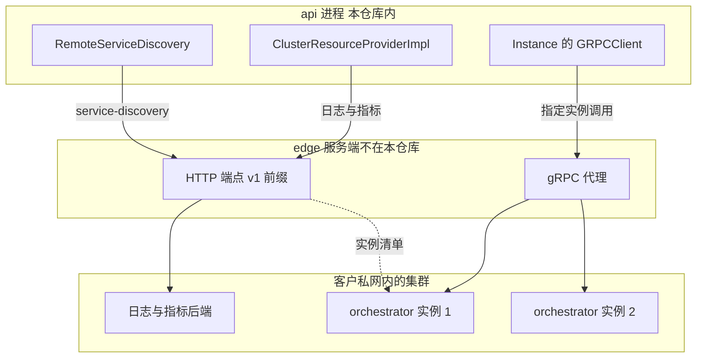

# 56 · edge API

> 上游 2026.09 的仓库里有一份 `spec/openapi-edge.yml`，但没有任何代码实现它。
> 本篇把这份规格读完：它有哪些端点、鉴权怎么做、api 怎么消费它、
> 以及为什么它的服务端不在这个仓库里；最后说明 ARM 适配版部署里那个叫 edge 的进程实际是什么。
>
> **读者**：工程师、架构师。
> **预备**：[第 21 篇 · 集群与服务发现](21-clusters-and-discovery.md)（集群一侧的机制）、
> [第 53 篇 · client-proxy（edge）](53-client-proxy-edge.md)（同名进程的流量代理职责）。
> **代码**：`spec/openapi-edge.yml`、`packages/shared/pkg/http/edge/`、
> `packages/api/internal/clusters/discovery/remote.go`、`packages/api/internal/clusters/resources_remote.go`、
> `packages/shared/pkg/consts/edge.go`

---

## 0. 本篇要回答的问题

1. 一份 OpenAPI 规格「只生成客户端」意味着什么？谁负责实现它的服务端，怎么判断？
2. edge API 有哪些端点，每个端点解决的是哪个具体问题？鉴权模型是什么？
3. api 怎么把「查一个远端集群里某个沙箱的指标」翻译成一次 edge 的 HTTP 调用？错误是怎么映射的？
4. 同一个 edge 地址上的 HTTP 与 gRPC 是什么关系，为什么密钥要出现两次？
5. ARM 适配版的 `edge.hcl` 与 `helm/templates/edge.yaml` 里跑的是什么镜像，
   为什么说那里的「edge」不是这份规格的服务端？

---

## 1. 一个刻意留下的缺口

先约定用词，本篇通篇有两个容易混淆的名字。按本书术语表
（[第 88 篇](88-glossary.md#1-中文词条按拼音)）的约定，**client-proxy 指进程与二进制，
edge 指这个进程在拓扑里的位置**；而在上游 2026.09 的代码里，`spec/openapi-edge.yml`
描述的是另一套东西——集群对外的控制与观测面。本篇里凡说「edge API」指后者那份规格，
凡说「client-proxy」指 `packages/client-proxy/` 编出来的那个二进制。
两者的关系在 [§5](#5-这份规格在整个系统里的位置) 收口。

e2b 的 Go 服务全部用 `oapi-codegen` 从 OpenAPI 规格生成 HTTP 层代码。
生成什么由每个包自己的 `cfg.yaml` 决定，四份配置放在一起，差别一眼可见：

| 规格 | 配置位置 | 生成的东西 |
|---|---|---|
| `spec/openapi.yml` | `packages/api/internal/api/cfg.yaml` | `gin-server`、`client`、`models`、`embedded-spec` |
| `spec/openapi-dashboard.yml` | `packages/dashboard-api/internal/api/cfg.yaml` | `gin-server`、`models`、`embedded-spec` |
| `spec/envd.yaml` | `packages/envd/internal/api/cfg.yaml` | `chi-server`、`models`，`client: false` |
| `spec/openapi-edge.yml` | `packages/shared/pkg/http/edge/cfg.yaml` | `client`、`models` |

只有 edge 这一份不生成服务端骨架。这不是遗漏：其它三份都明确写出了自己要哪一种服务端框架，
envd 那份甚至显式写了 `client: false`。edge 的 `generate.go` 里那行 `go:generate`
指向仓库根的 `spec/openapi-edge.yml`，产物是单文件 `generated.go`，
里面是 `Client`、`ClientWithResponses` 与一组模型类型，没有 `ServerInterface`。

再往仓库里搜一遍，结论一致。全仓库搜 `/v1/service-discovery`、`/v1/info`、`health/traffic`
这些路径字符串，除了 `spec/openapi-edge.yml` 自己与生成的客户端，没有任何命中；
`packages/client-proxy/` 下只有 `internal/proxy/`（沙箱 HTTP 流量代理）、
`internal/cfg/model.go`（六个环境变量）与 `internal/info.go`（三态健康标志），
没有任何 handler 注册这些路径，也没有按 `service-instance-id` 转发 gRPC 的代理。

**推论**：edge 的服务端是 e2b 的闭源组件，不在 `e2b-dev/infra` 中。
支持这个推论的旁证有三条。其一，`e2b-dev` 组织的公开仓库列表（`infra`、`fragments`、
`code-interpreter`、`firecracker`、`fc-kernels` 等三十个）里没有名为 edge 或类似的服务仓库。
其二，规格里保留了一个已废弃端点，并附注释
「todo: remove deprecated endpoint when all APIs are redeployed」——
只有当规格的两端由**不同的发布节奏**管理时，才需要这样的过渡期。
如果服务端和客户端在同一个仓库里同一次发布，直接改掉即可。
其三，同样的「只有一半」出现在 gRPC 侧：`packages/shared/pkg/edge/events.go` 里
`SerializeSandboxCatalogCreateEvent()` 有调用者（`packages/api/internal/orchestrator/nodemanager/metadata.go`），
配对的 `ParseSandboxCatalogCreateEvent()` 与 `ParseSandboxCatalogDeleteEvent()`
在整个上游 2026.09 里**没有任何调用者**。写事件与读事件的代码放在同一个共享包里，
读的那一半却没人调，最直接的解释是读者在另一个仓库
（[第 55 篇 §3](55-sandbox-catalog-and-routing.md#3-写入者api在沙箱可达的那一刻)
从写入侧描述了同一件事）。

这个缺口对读者的意义是明确的：**本篇描述的是契约，不是实现**。
「edge 收到 `/v1/service-discovery` 会返回集群里所有 orchestrator」这句话，
依据是 OpenAPI 规格与 api 侧对响应的使用方式，不是读过服务端代码。
凡是关于 edge 内部行为（它从哪里拿到 orchestrator 列表、日志从哪个后端查）的说法，
本篇一律不给，因为读不到。

代价这一侧同样清楚。契约先行、客户端生成，好处是 api 侧不需要手写 HTTP 调用与 JSON 解码，
参数名拼错在编译期就会暴露；坏处是**规格的正确性无人在本仓库内验证**。
没有服务端骨架，就没有「服务端必须实现所有端点」这道编译期约束；
规格写错一个字段名，只有在联调时才会发现。

---

## 2. 端点清单

规格标题是 `E2B Edge API`，版本 `0.1.0`，一共九个 `operationId`，分三组。

| 端点 | 操作 ID | 鉴权 | 用途 |
|---|---|---|---|
| `GET /health` | `healthCheck` | 无 | 进程存活 |
| `GET /health/machine` | `healthCheckMachine` | 无 | 机器状态 |
| `GET /v1/info` | `v1Info` | 无（可返回 401） | edge 自身的节点信息 |
| `GET /v1/service-discovery` | `v1ServiceDiscovery` | `X-API-Key` | 集群内 orchestrator 列表 |
| `GET /v1/service-discovery/nodes/orchestrators` | `v1ServiceDiscoveryGetOrchestrators` | `X-API-Key` | 同上，已废弃 |
| `GET /v1/sandboxes/{sandboxID}/logs` | `v1SandboxLogs` | `X-API-Key` | 单沙箱日志 |
| `GET /v1/sandboxes/{sandboxID}/metrics` | `v1SandboxMetrics` | `X-API-Key` | 单沙箱时间序列指标 |
| `GET /v1/sandboxes/metrics` | `v1SandboxesMetrics` | `X-API-Key` | 批量沙箱最新指标，上限 100 个 ID |
| `GET /v1/templates/builds/{buildID}/logs` | `v1TemplateBuildLogs` | `X-API-Key` | 构建日志 |

九个操作全部是 `GET`。这份 API 只读：没有创建沙箱、没有暂停、没有触发构建。
**写操作走的是另一条通路**——gRPC，见 [§4](#4-一把密钥两个头)。
把读与写分成两种协议，是这套设计里最容易被忽略的一个决定，[§4](#4-一把密钥两个头) 会解释代价。

鉴权模型只有一种：`securitySchemes` 里唯一的 `ApiKeyAuth`，
类型 `apiKey`、位置 `header`、名字 `X-API-Key`。
`packages/shared/pkg/consts/edge.go` 把这个头名固化成 `EdgeApiAuthHeader`。
没有作用域、没有过期、没有按端点区分的权限：一把密钥要么全通，要么全不通。
密钥的粒度是**每个集群一把**，存在数据库集群记录的 `token` 列里（见
[第 21 篇 §2](21-clusters-and-discovery.md#2-数据模型集群是一行数据库记录)）。

`/v1/info` 是个例外：它没有 `security` 段，却声明了 401 响应。
**推论**：服务端对它做的是可选鉴权，或者规格在这里不够严谨。
api 侧从不调用这个端点（生成的 `V1InfoWithResponse` 在 `packages/api/` 下没有调用点），
因此这个不一致在上游没有实际后果。

### 2.1 数据模型

服务发现的响应是 `ClusterServiceDiscovery`，只有一个字段 `orchestrators`，
元素类型 `ClusterOrchestratorNode`，七个必填字段：

| 字段 | 含义 | 生命周期 |
|---|---|---|
| `nodeID` | 节点标识 | 与机器同寿 |
| `serviceInstanceID` | 服务实例标识 | 进程重启即变 |
| `serviceVersion` / `serviceVersionCommit` | 版本与提交 | 与进程同寿 |
| `serviceHost` | 节点私网地址与服务端口 | 与部署同寿 |
| `serviceStartedAt` | 注册时刻 | — |
| `serviceStatus` / `roles` | 健康状态与角色 | 随时变化 |

`serviceStatus` 的取值是 `healthy` / `draining` / `unhealthy`，
与 `packages/client-proxy/internal/info.go` 里 `ServiceHealth` 的三个常量同名同值；
`roles` 的取值是 `orchestrator` / `template-builder`，
与 orchestrator 自报的 `ServiceInfoRole` 对应。
也就是说，edge 报的是它自己看到的、关于这些节点的**二手信息**。

日志与指标各有一套模型。日志分两种形状：`SandboxLog` 只有 `timestamp` 与 `line`（纯文本行），
`SandboxLogEntry` 有 `timestamp`、`level`、`message`、`fields`（结构化）。
`SandboxLogsResponse` 同时带这两个数组，一个是过渡期的旧形状，一个是新形状。
构建日志只有结构化的 `BuildLogEntry`。
`SandboxMetric` 是八个字段的定点结构：时间戳两种表示、CPU 使用率与核数、内存总量与用量、磁盘总量与用量。

### 2.2 兼容性的痕迹

规格里有三处过渡痕迹，值得单独指出，因为它们说明了跨仓库契约的演进方式。

**废弃的服务发现端点。** `/v1/service-discovery/nodes/orchestrators` 直接返回一个
`ClusterOrchestratorNode` 数组，`/v1/service-discovery` 返回的是一个带 `orchestrators` 字段的对象。
后者比前者多了一层包装，代价是响应体多几个字节，收益是以后要加字段（比如 template builder 的独立列表）
不必再造一个端点。规格把旧端点标了 `deprecated: true` 并留下注释，说明要等所有 api 实例重新部署后才删。

**已废弃的必填参数。** `/v1/templates/builds/{buildID}/logs` 的 `orchestratorID` 参数标了
`deprecated: true`、`required: false`，但 `templateID` 是 `required: true`。
api 侧 `resources_remote.go` 的 `getBuildLogsFromEdge()` 里对应地写着
`OrchestratorID: utils.ToPtr("unused")`，旁边一行 TODO 说等规格不再要求它就删掉。
读代码时看到一个被填成字符串 `"unused"` 的参数，原因就在这里。

**两种日志形状并存。** `SandboxLogsResponse` 同时要求 `logs` 与 `logEntries`。
api 把两个数组都搬进自己的 `api.SandboxLogs`，由更上层决定给调用方哪一种。

这三处的共同点：**旧的东西不删，新的东西并排加**。
在同一个仓库里这样做是技术债，在跨仓库契约里这是必要成本——
客户端与服务端不可能同时上线，中间那段时间两边都要能跑。

---

## 3. api 怎么用这个客户端

远端集群的对象在 `packages/api/internal/clusters/cluster.go` 的 `newRemoteCluster()` 里构造。
它做的第一件事就是造这个 HTTP 客户端：

```go
endpointBaseUrl := fmt.Sprintf("%s://%s", scheme, endpoint)

httpClient, err := api.NewClientWithResponses(
    endpointBaseUrl,
    func(c *api.Client) error {
        c.RequestEditors = append(
            c.RequestEditors,
            func(_ context.Context, req *http.Request) error {
                req.Header.Set(consts.EdgeApiAuthHeader, secret)

                return nil
            },
        )

        return nil
    },
)
```

`RequestEditors` 是 `oapi-codegen` 生成客户端提供的钩子：每个请求发出前依次执行。
密钥在这里挂上去一次，之后所有调用都不必再关心鉴权。
这个客户端随后被交给两个消费方：`discovery.NewRemoteServiceDiscovery()` 与
`newRemoteClusterResourceProvider()`。整个 api 里对 edge API 的调用只有这两处的五个方法。

### 3.1 服务发现

`packages/api/internal/clusters/discovery/remote.go` 的 `RemoteServiceDiscovery.Query()`
是最短的一个：调 `V1ServiceDiscoveryWithResponse()`，检查 `StatusCode() != http.StatusOK`
与 `JSON200 == nil` 两道，然后把每个 `ClusterOrchestratorNode` 映射成 `discovery.Item`。

值得注意的是它**丢掉了什么**。响应里有七个字段，`Item` 只接三个：
`UniqueIdentifier` 与 `InstanceID` 都填 `n.ServiceInstanceID`，`NodeID` 填 `n.NodeID`。
`serviceHost`、`serviceStatus`、`roles`、`serviceVersion` 全部不用。

不用是有理由的。地址不用，是因为远端集群的所有实例共用 edge 这一个 gRPC 目标地址，
api 拿到私网地址也连不上（见 [第 21 篇 §5](21-clusters-and-discovery.md#5-连接与鉴权)）。
状态与角色不用，是因为 `Instance.Sync()` 会通过 gRPC 直接问 orchestrator 自己的 `ServiceInfo`，
拿到的是一手的、且与 api 判定健康所用的是同一套语义。

代价是每轮同步的调用数：一次 HTTP 服务发现 + 每个实例一次 gRPC `ServiceInfo`。
若把 edge 报的状态直接采信，可以省掉后者，但那样 api 的健康判据就变成了「edge 认为它健康」，
edge 与 orchestrator 之间的探测周期会叠加到 api 的故障发现时延上。
这套代码选了多问一次。

### 3.2 指标与日志

`resources_remote.go` 里的 `ClusterResourceProviderImpl` 实现了 `ClusterResource` 接口的四个方法，
每个方法的形状完全一样：装参数 → 调生成的 `...WithResponse` → 检查状态码 → 逐字段搬运模型。

「逐字段搬运」不是修辞。`GetSandboxMetrics()` 里 `edgeapi.SandboxMetric` 到
`api.SandboxMetric` 是八个字段一一对应的赋值，两个结构的字段名与类型都相同，
差别只在它们由**两份不同的 OpenAPI 规格**生成，因而是两个不能互相赋值的 Go 类型。
这是契约分离的直接成本：外部 API 的 `SandboxMetric` 与 edge API 的 `SandboxMetric` 可以各自演进，
代价是每加一个字段要在这里多写一行。

构建日志那条路稍复杂。`GetBuildLogs()` 不直接调 edge，而是先把 edge 包成一个闭包
`getBuildLogsFromEdge()`，再交给 `resources.go` 的 `getBuildLogsWithSources()`：
后者先尝试从构建所在的 builder 实例经 gRPC 取「临时日志」，取不到再落到持久化日志这个闭包。
本地集群走的是同一个函数，只是闭包换成查 Loki。edge 在这里的角色是**远端集群的持久化日志后端**。

时间窗由 `resources.go` 的 `LogQueryWindow()` 算，硬编码 `logsOldestLimit = 7 * 24 * time.Hour`：
没有游标时窗口是「最近 7 天」，有游标时按方向从游标向前或向后取 7 天，
并把两端都夹到 7 天保留期内。这个窗口以毫秒 Unix 时间戳传给 edge 的 `start` / `end` 参数。

### 3.3 错误映射

`resources_remote.go` 末尾的 `handleEdgeErrorResponse()` 把 edge 的错误翻译成 api 自己的 `APIError`。
它的行为需要留意：

- 400：把 edge 返回的 `message` **原样**作为 `ClientMsg` 传给调用方，`Code` 也是 400；
- 401 与 500：把 `message` 记进 `Err`（形如 `edge error: <消息> (http code 401)`），
  但 `Code` 一律置为 `http.StatusInternalServerError`，`ClientMsg` 用调用点传入的通用文案；
- 其它状态码（403、404、502、超时后的空响应等）：不进 switch，`errMsg` 保持为空，
  最后被填成 `"Unexpected error occurred"`，同样归为 500。

后果是：**集群密钥配错时，终端用户看到的是 500 而不是 401**。
这个选择本身站得住脚——edge 的密钥是 e2b 与集群之间的凭证，不是调用方的凭证，
把它的 401 透传给调用方会误导对方去检查自己的 API key。
但运维侧要知道，判断这类故障只能看 api 的日志里那条 `edge error: ... (http code 401)`。

---

## 4. 一把密钥两个头

edge 地址上跑着两套协议。同一个 `endpoint`（数据库集群记录里的一个 `host:port`）既是
HTTP 客户端的 base URL，也是 `instance_client.go` 里 `grpc.NewClient()` 的目标。
密钥因此出现两次，头名不同：

| 通路 | 头 | 常量 | 内容 |
|---|---|---|---|
| HTTP | `X-API-Key` | `consts.EdgeApiAuthHeader` | 集群密钥 |
| gRPC | `authorization` | `consts.EdgeRpcAuthHeader` | 集群密钥 |
| gRPC | `service-instance-id` | `consts.EdgeRpcServiceInstanceIDHeader` | 目标实例 |

三个常量都定义在 `packages/shared/pkg/consts/edge.go`，一共七行，是整个仓库里
关于 edge 协议约定的全部内容。gRPC 那两个头由 `instanceAuthorization.GetRequestMetadata()` 挂上，
它实现的是 gRPC 的 `PerRPCCredentials` 接口。

分工是清楚的：**gRPC 用来对某一个具体实例做操作，HTTP 用来问集群层面的问题**。
创建沙箱要落到某个节点上，所以要 `service-instance-id`；
查服务发现、查某个沙箱的日志则不关心落在哪个实例上，edge 自己知道去哪里取。
这也解释了为什么 edge API 全是 `GET`：需要指定目标实例的操作都在 gRPC 那边。



图里的虚线是推论：edge 从哪里得到实例清单，代码里读不到。
实线部分都有代码依据：三条出边分别对应 `remote.go`、`resources_remote.go`、`instance_client.go`。

**推论**：既然同一个 `host:port` 同时承载 HTTP/1.1 的 REST 与 HTTP/2 的 gRPC，
edge 前面要么是一个能按 content-type 分流的 L7 入口，要么 edge 进程自身用一个
支持 h2c 与 HTTP/1.1 混合的服务器。`instance_client.go` 里那条注释
「AWS ALB with TLS termination is using TLS 1.2 as default」旁证了第一种：
生产部署里 edge 前面有 ALB。

---

## 5. 这份规格在整个系统里的位置

把 edge API 放回全局，它服务的是一个具体场景：**客户自带集群**。
沙箱跑在客户自己的网络里，e2b 的控制面在外面，两边只有一条出口。
这条出口上要过三类流量：控制（创建、暂停、删除沙箱）、观测（日志、指标）、
以及沙箱本身的用户流量。前两类由本篇与 [第 21 篇 §7](21-clusters-and-discovery.md#7-跨集群的两条数据通路) 覆盖，
第三类是 client-proxy 的职责，见 [第 53 篇 §5](53-client-proxy-edge.md#5-转发交给共享代理库) 与
[第 55 篇 §4](55-sandbox-catalog-and-routing.md#4-读取者client-proxy-的一次解析)。

这也解释了 edge 这个名字的双重含义。按 §1 的约定，client-proxy 是进程、edge 是位置，
两者指的是同一个东西；但在上游 2026.09 的代码里，这两个名字对应的是**两套互不相干的东西**：
`packages/client-proxy/` 是流量代理的实现，`spec/openapi-edge.yml` 是控制与观测面的契约。
一个有实现没规格，一个有规格没实现。

**推论**：这两者在 e2b 的闭源部署里合并在同一个二进制里。
支持这个推论的是 ARM 适配版的部署文件——它们把 client-proxy 的镜像部署成了一个名为 edge 的服务，
并给它配上了 edge API 的端口与密钥。下一节说明这件事。

---

## 6. ARM 适配版的差异

ARM 适配版给两种部署形态各加了一个 edge 定义，上游都没有对应文件。

`iac/provider-gcp/nomad/jobs/edge.hcl` 是从上游
`iac/modules/job-client-proxy/jobs/client-proxy.hcl` 改写来的：把 Terraform 模板变量换成
`envsubst` 的 shell 变量，去掉 `update` 滚动更新段与 LaunchDarkly 变量，
加上 `dns_servers = ["127.0.0.1"]` 与 `auth_soft_fail`。
job 名仍是 `client-proxy`，镜像是 `${REGISTRY_URL}/${CLIENT_PROXY_DOCKER_IMAGE}`，
端口只有 `proxy`（`EDGE_PROXY_PORT`，默认 3002）与 `health`（`EDGE_HEALTH_PORT`，默认 3003）。
文件名叫 edge，内容是 client-proxy。

`helm/templates/edge.yaml` 走得更远。Deployment 与 Service 都叫 edge / `edge-api`，
镜像是 `.Values.image.edge`，而 `helm/values-template.yaml` 里这一项的值是
`${CLIENT_PROXY_DOCKER_IMAGE}` —— 仍是同一个镜像。
容器上配了一串 edge API 形状的环境变量：`EDGE_PORT`、`EDGE_SECRET`、
`SERVICE_DISCOVERY_ORCHESTRATOR_PROVIDER=DNS`、`SERVICE_DISCOVERY_EDGE_DNS_QUERY=edge-api.e2b.svc.cluster.local`、
`USE_PROXY_CATALOG_RESOLUTION`、`DNS_SERVER`、`LOKI_URL`、`ORCHESTRATOR_TYPE` 等。

把这串变量对照 `packages/client-proxy/internal/cfg/model.go`，会发现 `Config` 结构体
一共只声明了六个：`HEALTH_PORT`、`PROXY_PORT`、`REDIS_URL`、`REDIS_CLUSTER_URL`、
`REDIS_TLS_CA_BASE64`、`API_GRPC_ADDRESS`；此外进程还直接读 `env.GetNodeID()`
与遥测装配用的几个变量，都不经过这个结构体。
配置解析用 `caarlos0/env`，未声明的环境变量被静默忽略，因此这些变量既不报错也不生效；
无读取方的条目汇总在[第 90 篇 §6](90-config-reference.md#6-无读取方的残留条目)。
`EDGE_API_PORT=3001` 在 `e2b-deploy/dep/.env` 里有值，但 Deployment 的 `containerPort`
与 Service 的端口都只声明了 health 与 proxy，3001 上没有进程监听。
同一份 `.env` 里的 `LOCAL_CLUSTER_ENDPOINT=localhost:3001` 与 `LOCAL_CLUSTER_TOKEN`
在两个代码基线中都没有任何 Go 代码读取。

这一串照搬来的变量里只有一个是**真生效**的：`edge.hcl` 与 `helm/templates/edge.yaml`
都把 `ENVIRONMENT` 设成 `"dev"`（单机离线版的 `.env` 设成 `local`），
而 `env.IsDevelopment()` 对两者都返回真，`sandbox-auto-resume` 的代码默认值正是它。
于是这些部署里 resume-on-connect 默认开启，与上游生产环境默认关闭相反，见
[第 55 篇 §5.3](55-sandbox-catalog-and-routing.md#53-完整时序与四道闸门)。

还有一处：`livenessProbe` 打的是 `/health/traffic`，这个路径不在 `openapi-edge.yml` 里，
也不在 client-proxy 的代码里。它之所以能通过，是因为 client-proxy 的健康服务器
把一个 `http.HandlerFunc` 直接当成整个 `Handler` 用（`packages/client-proxy/main.go`），
没有路由表，任何路径都按同一条规则返回 200 或 503。

结论：**ARM 适配版部署里名为 edge 的服务，跑的是上游的 client-proxy 二进制，
只提供沙箱流量代理与健康检查，不提供 edge API**。
那些 edge 形状的配置项是从 e2b 的部署模板照搬来的占位，当前无效。
这在单机与单集群部署下没有后果：所有团队都落在本地集群，
api 走的是本地服务发现与本地 ClickHouse / Loki，从不构造远端集群客户端
（`clusters_sync.go` 的 `PoolInsert()` 只在集群 ID 不等于 `consts.LocalClusterID` 时才调
`newRemoteCluster()`）。真要接一个远端集群，还需要一个本仓库之外的 edge 服务端。
部署形态的完整说明见 [第 78 篇 §3.2](78-helm-k8s-deployment.md#32-edge名字是-edge跑的是-client-proxy)、
[第 79 篇 §7](79-nomad-multinode-deployment.md#7-名为-edge-的-job)、
[第 80 篇 §7](80-single-node-rpm.md#7-一个进程两个角色)，
遗留配置项的清单见 [第 86 篇 §4.3](86-known-issues-and-debt.md#43-edge-作业跑的是-client-proxy-镜像)。

---

## 7. 小结

- `spec/openapi-edge.yml` 是上游 2026.09 里唯一一份只生成客户端的 OpenAPI 规格
  （`packages/shared/pkg/http/edge/cfg.yaml` 的 `generate` 只有 `client` 与 `models`），
  服务端实现不在这个仓库里。
- **推论**：edge 服务端是 e2b 的闭源组件；`e2b-dev` 的公开仓库列表里没有对应仓库，
  规格里「等所有 API 重新部署后再删废弃端点」的注释也指向两端由不同发布节奏管理。
- 九个操作全部是 `GET`，分健康、服务发现、日志与指标三组；
  鉴权只有一种，`X-API-Key` 头携带的集群密钥，无作用域无过期。
- 服务发现返回七个字段，api 只取三个；健康与角色仍由直接问 orchestrator 的 gRPC `ServiceInfo` 决定，
  代价是每轮多一次调用，收益是健康判据一手且与本地集群一致。
- 指标与日志的每个方法都是「装参数、调生成客户端、逐字段搬运模型」；
  两套 OpenAPI 生成的同名结构不能互相赋值，这是契约分离的直接成本。
- `handleEdgeErrorResponse()` 只透传 400，401 与 500 都归为 500，
  因此集群密钥错误在调用方看来是服务器错误，只能从 api 日志里区分。
- 同一个 edge 地址上 HTTP 与 gRPC 并存：HTTP 问集群层面的问题，
  gRPC 靠 `service-instance-id` 头对单个实例做操作，两者共用同一把密钥。
- 规格里有三处过渡痕迹（废弃端点、废弃但必填的 `orchestratorID`、两种日志形状并存），
  它们是跨仓库契约的必要成本，不是技术债。
- ARM 适配版的 `edge.hcl` 与 `helm/templates/edge.yaml` 部署的都是 client-proxy 镜像；
  其中 edge API 形状的环境变量、3001 端口与 `LOCAL_CLUSTER_*` 都无代码读取，
  当前部署里不存在 edge API 服务端。

## 延伸阅读 / 下一篇

- 本篇的另一半：[第 21 篇 · 集群与服务发现](21-clusters-and-discovery.md)
  （集群池与实例池的[两级同步](21-clusters-and-discovery.md#3-两级同步循环)、
  [三个标识符](21-clusters-and-discovery.md#6-三个标识符)）。
- 同名进程的另一职责：[第 53 篇 §2](53-client-proxy-edge.md#2-进程结构两个端口没有第三个)、
  [第 54 篇 · 共享代理库](54-shared-proxy-library.md)、
  [第 55 篇 §5](55-sandbox-catalog-and-routing.md#5-resume-on-connect让访问本身唤醒沙箱)。
- 数据来源一侧：[第 24 篇 §5](24-api-metrics-and-analytics.md#5-同一个接口的两种实现)、
  [第 59 篇 §2](59-clickhouse.md#2-表五张业务表与四种角色)、[第 60 篇 §3](60-telemetry.md#3-日志内部与外部两套)。
- 另一个反向代理：[第 57 篇 · docker-reverse-proxy](57-docker-reverse-proxy.md)。
- 配置与端口的总表：[第 90 篇 · 环境变量与配置项总表](90-config-reference.md)、
  [第 91 篇 §1](91-ports-paths-keys.md#1-进程端口)。
- 外部资料：[oapi-codegen 的配置项文档](https://github.com/oapi-codegen/oapi-codegen)。
