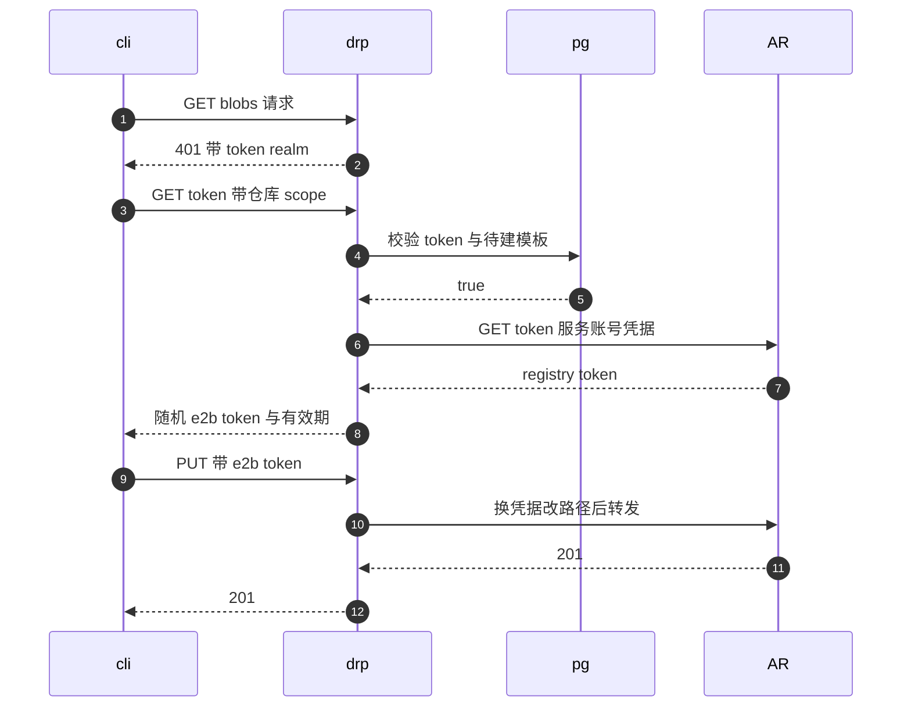

# 57 · docker-reverse-proxy

> 模板构建的老路径要求用户先把镜像推到 e2b 自己的 registry。e2b 并没有自建 registry，
> 而是在 Artifact Registry 前面放了一个不到一千行的 HTTP 反向代理：
> 它讲 Docker Registry v2 的认证方言，把 e2b 的 access token 换成上游 registry 的 token，
> 并且只放行一条路径。本篇把这条链路从 `docker login` 讲到 template-manager 拉镜像。
>
> **读者**：工程师、运维。
> **预备**：[第 16 篇 · 认证与多租户](16-auth-and-multitenancy.md)、
> [第 41 篇 · 构建总览](41-template-build-overview.md)。知道 Docker Registry v2 的认证流程会读得更顺，
> 不知道也能读，[§2](#2-docker-registry-v2-的认证方言) 会铺垫。
> **代码**：`packages/docker-reverse-proxy/`、`packages/shared/pkg/artifacts-registry/registry_gcp.go`、
> `iac/provider-gcp/docker-reverse-proxy.tf`、`iac/provider-gcp/nomad/jobs/docker-reverse-proxy.hcl`

---

## 0. 本篇要回答的问题

1. 为什么不让 CLI 直接把镜像推到 Artifact Registry，而要在中间加一个代理？
2. Docker Registry v2 的客户端是怎么被引导去取 token 的？这个握手有哪几步？
3. 一个 e2b access token 凭什么能换到 Artifact Registry 的 token？中间校验了什么？
4. 代理放行哪些路径、拒绝哪些？为什么会有两条绕过路径校验的例外通道？
5. 镜像推上去之后，template-manager 是怎么把它取回来的？
6. ARM 适配版为什么不部署这个进程？

---

## 1. 问题：镜像要从用户的机器走到构建节点

模板构建的输入是一个 OCI 镜像。[第 41 篇 §4](41-template-build-overview.md#4-主流程)讲的是拿到镜像之后的事情 ——
解包成 ext4、provision、冷启动、pause。本篇讲的是镜像**怎么到手**。

上游 2026.09 有两条路径。新路径由用户给出一个公开镜像名，
构建期由 template-manager 直接去公共 registry 拉：`TemplateCreateRequest` 里的 `fromImage`
与 `fromImageRegistry`，落到 `packages/orchestrator/internal/template/build/core/oci/oci.go` 的
`GetPublicImage()`。老路径是 CLI 在用户本机 `docker build`，把成品推到 e2b，
再调 `POST /templates/{templateID}/builds/{buildID}` 触发构建 ——
`packages/api/internal/handlers/deprecated_template_start_build.go` 上的注释把顺序写得很清楚：
「triggers a new build after the user pushes the Docker image to the registry」。
docker-reverse-proxy 服务的是这条老路径。

老路径要解决的问题是：**镜像最终要落进 Artifact Registry，但用户手里只有一个 e2b 的 access token。**
三种朴素做法都不成立。

给每个用户发一份 Google 服务账号凭据 —— 凭据泄漏面等于整个 registry，
而且 Artifact Registry 的 IAM 粒度到仓库，做不到「这个用户只能写这一个模板的 tag」。

在 Artifact Registry 上按团队开仓库 —— 仓库数量随团队增长，
Terraform 要为每次注册团队改基础设施，与「注册一个团队只是写一行数据库」冲突。

让 api 代收镜像再转存 —— api 要把整个镜像收进内存或磁盘再上传，
一个几 GiB 的镜像会把 api 的内存与超时预算打穿，而且丢掉了 registry 分层去重的好处。

docker-reverse-proxy 走的是第四条路：**不碰数据，只碰凭据**。
它是一个无状态的 HTTP 反向代理，对客户端假装自己是一个 registry，
对 Artifact Registry 则用服务账号的身份说话；镜像的字节流原样穿过，不落地。
它要做的判断只有一个：这个 access token 能不能往这个模板的仓库里写。

## 2. Docker Registry v2 的认证方言

Registry v2 的认证不是 HTTP Basic，而是一套 bearer token 的握手，
`packages/docker-reverse-proxy/internal/utils/authorization.go` 的 `SetDockerUnauthorizedHeaders()`
实现的正是这套握手的服务端一半：

1. 客户端访问任意 registry 端点，不带 `Authorization`；
2. 服务端回 401，并在 `Www-Authenticate` 头里写明去哪儿取 token：
   `Bearer realm="https://docker.<domain>/v2/token"`，同时回一个
   `Docker-Distribution-API-Version: registry/2.0` 表明自己讲的是 v2；
3. 客户端到 realm 指定的地址取 token，带上 `docker login` 时输入的用户名与口令（HTTP Basic），
   并用 `scope` 查询参数说明它要对哪个仓库做什么；
4. 服务端回一个 JSON：`{"token": "...", "expires_in": ...}`；
5. 客户端带 `Authorization: Bearer <token>` 重放原请求。

关键在于 **realm 可以指向任意主机**。这条协议规定给了 docker-reverse-proxy 全部的操作空间：
它把 realm 指向自己，于是拿到了签发 token 的位置；
它又是数据面的反向代理，于是拿到了校验 token 的位置。

`docker login docker.<domain>` 时用户名固定是 `_e2b_access_token`，口令是 e2b 的 access token
（`sk_e2b_` 打头，见 `packages/shared/pkg/keys/constants.go` 的 `AccessTokenPrefix`）。
`internal/auth/validate.go` 的 `ExtractAccessToken()` 解开 Basic 的 base64，
按冒号切两段，用户名对不上 `_e2b_access_token` 就直接报错；
口令两侧的引号与空白会被剥掉，注释里点明了这是给 Windows 用户留的余地。

## 3. 请求的分流

`main.go` 只注册了一个 `/` 处理函数，内部按顺序判断，读一遍就知道这个进程的全部行为：

```go
if req.URL.Path == "/health" { store.HealthCheck(w, req); return }
if req.Method == http.MethodPatch && strings.HasPrefix(path, constants.GCPArtifactUploadPrefix) { … }
if req.URL.Path == "/v2/token" && req.Method == http.MethodPost { w.WriteHeader(404); return }
if req.Header.Get("Authorization") == "" { utils.SetDockerUnauthorizedHeaders(w); return }
if req.URL.Path == "/v2/token" { store.GetToken(w, req); return }
if req.URL.Path == "/v2/" { store.LoginWithToken(w, req); return }
store.Proxy(w, req)
```

有两处值得解释。

`POST /v2/token` 一律回 404。Registry 的认证规范里有两种取 token 的方式：
GET 加查询参数（token 方式）与 POST 表单（OAuth2 方式）。
客户端会优先试 OAuth2，收到 404 才退回 GET。这里用 404 把客户端推回它实现的那一半。

缺 `Authorization` 头就回 401 —— 这一条放在分流的中段，意味着**除了健康检查与上传补丁通道，
所有请求都必须带凭据**，包括 `/v2/` 与 `/v2/token` 自己。第一次 `docker login` 的
「无凭据探测」正是靠它拿到 `Www-Authenticate`。

## 4. 换 token：`GetToken()`

`internal/handlers/token.go` 的 `GetToken()` 是整个进程唯一做授权决策的地方。

先取 access token，再看 `scope` 查询参数在不在。**不带 scope 的请求**是 `docker login` 的那一次：
此时客户端只想确认凭据可用，还没有具体仓库。代码用
`ValidateAccessToken()`（`auth/validate.go`）验一次 token 存在，
然后调 `AuthCache.Create("not-yet-known", "undefined-docker-token", 3600)`：
发一个随机串给客户端，但缓存里存的 registry token 是个占位字符串。
换句话说，登录成功拿到的 token **不携带任何对 Artifact Registry 的权限**，
拿它去访问数据面只会在上游被拒。这是一个刻意的分级：登录不等于授权。

**带 scope 的请求**才是真正要权限的那一次。scope 的格式由一个正则钉死：

```go
var scopeRegex = regexp.MustCompile(`^repository:e2b/custom-envs/(?P<templateID>[^:]+):(?P<action>[^:]+)$`)
```

仓库名的前两段 `e2b/custom-envs/` 是硬编码的，只有第三段模板 ID 是变量。
不匹配就是 400。动作里含 `delete` 直接 403 —— 删除 tag 是 template-manager 的事
（`registry_gcp.go` 的 `Delete()`），不对用户开放。

然后是那次真正的授权判断，`auth/validate.go` 的 `Validate()` 调
`packages/db/queries/builds/validate_build.sql` 里的 `ExistsWaitingTemplateBuild`：

```sql
SELECT EXISTS (
    SELECT 1 FROM envs e
      JOIN users_teams ut ON ut.team_id = e.team_id
      JOIN access_tokens at ON at.user_id = ut.user_id
      JOIN env_build_assignments eba ON eba.env_id = e.id
      JOIN env_builds eb ON eb.id = eba.build_id
    WHERE at.access_token_hash = @access_token_hash
      AND e.id = @template_id
      AND eb.status_group = 'pending'
) AS valid;
```

这条查询同时约束了三件事：token 属于某个用户，该用户在拥有这个模板的团队里，
而且这个模板**当前有一个处于 pending 状态的构建**。
第三个条件让写权限成为一个短暂的窗口：CLI 必须先向 api 注册一次构建
（[第 22 篇 §4](22-template-api.md#4-一次构建请求的两段)），才有资格推镜像；构建一旦跑起来或结束，窗口就关上。
数据库里存的是哈希，比对用 `keys.VerifyKey()` 现算，明文 token 不落库。

通过之后，`getToken()` 用服务账号去 Artifact Registry 换一份真 token：

```go
url := fmt.Sprintf("https://%s-docker.pkg.dev/v2/token?service=%s-docker.pkg.dev&scope=repository:%s/%s/%s:push,pull", …)
r.Header.Set("Authorization", fmt.Sprintf("Basic %s", consts.EncodedDockerCredentials))
```

`consts.EncodedDockerCredentials`（`packages/shared/pkg/consts/gcp.go`）是
`_json_key_base64:<GOOGLE_SERVICE_ACCOUNT_BASE64>` 的 base64，
也就是 Artifact Registry 认服务账号密钥的那种 Basic 凭据。
注意上游 scope 里的仓库路径是 `<project>/<repo>/<templateID>`，与客户端看到的
`e2b/custom-envs/<templateID>` 不同 —— 前缀替换是这个代理做的第二件事，见下一节。

最后 `internal/cache/auth.go` 的 `AuthCache.Create()` 生成一个 128 字节的随机串
（`utils.GenerateRandomString()`，`crypto/rand` + base64），把
`{DockerToken, TemplateID}` 存进 `ttlcache`，把随机串连同上游报的 `expires_in` 回给客户端。
**客户端从头到尾拿不到 Artifact Registry 的 token。**
缓存的 TTL 是固定的 `authInfoExpiration = 2 小时`，与回给客户端的 `expires_in` 并不联动：
上游 token 的实际有效期短于两小时时，缓存里会留下一份已经过期的 registry token，
表现为后续请求被上游拒绝而不是被代理拒绝（`store.go` 的 `ModifyResponse` 会把这种 401 打进日志）。

下面把这段握手按时间顺序画一遍：`cli` 是 Docker CLI，`drp` 是本代理，`pg` 是 PostgreSQL，`AR` 是 Artifact Registry。



## 5. 转发面：`Proxy()`

`internal/handlers/proxy.go` 的 `Proxy()` 处理除 `/v2/`、`/v2/token`、`/health` 之外的一切。
四步：

**换凭据。** 从 `Authorization: Bearer` 里取随机串，查缓存；查不到就按 401 处理。
命中之后把请求头换成缓存里的 registry token。

**路径白名单。** 只有两个前缀被接受：客户端视角的 `/v2/e2b/custom-envs/`，
以及上游视角的 `/v2/<project>/<repo>/`。其它一律 403，日志记一行
`No matching route found for path`。这条是本篇标题里「只放行一条路径」的落点：
`/v2/_catalog`、别的团队的仓库、Artifact Registry 的管理端点，都到不了上游。

**模板归属检查。** 把路径里 `/v2/e2b/custom-envs/` 之后的第一段按冒号切开取模板 ID，
与缓存里那份 token 绑定的 `TemplateID` 比对，不等就 403。
于是「用 A 模板换来的 token 去写 B 模板」被挡住 —— 授权判断在 `GetToken()` 里做过一次，
这里做的是**票据与目标的一致性**检查。

**前缀替换。** `strings.Replace` 把 `/v2/e2b/custom-envs/` 换成 `/v2/<project>/<repo>/`，
交给 `store.go` 的 `ServeHTTP()`。后者用 `httputil.NewSingleHostReverseProxy`
指向 `https://<region>-docker.pkg.dev`，转发前把 `req.Host` 置成 `req.URL.Host`。
推论：服务端收到的请求其 `URL.Host` 为空，这一句的实际效果是清掉原始 Host 头，
让出站请求改用目标 URL 的主机名，从而与 Artifact Registry 的 TLS 与虚拟主机对上。

白名单之外还开了三条例外通道，都与分块上传有关。Registry v2 的 blob 上传是
`POST /blobs/uploads/` 拿一个 `Location`，再往这个 `Location` 上 `PATCH` 数据、`PUT` 收尾；
`Location` 由上游生成，形如
`/artifacts-uploads/namespaces/<project>/repositories/<repo>/uploads/<很长的随机串>`，
不在 `/v2/` 下面，也不带模板 ID。三条例外是：

- `main.go` 里的第一条：`PATCH` 且路径以 `constants.GCPArtifactUploadPrefix` 打头的，
  在**检查 `Authorization` 之前**就直接转发。注释解释了原因：这类请求不带 access token，
  但路径里含一个很长的一次性随机串。
- `Proxy()` 里的第二条：同一前缀的其它方法（`PUT`、`DELETE` 等）走完换凭据再转发，
  跳过路径白名单与模板归属检查。
- 另有一条 `/v2/<project>/<repo>/pkg/blobs/uploads/` 前缀同样跳过归属检查。

代价要说清楚：第一条例外意味着**存在一条完全不校验凭据的转发路径**，
安全性完全依赖那串上传 ID 猜不到，而且它一旦泄漏，写入的是 e2b 服务账号身份下的仓库。
第二条与第三条例外让 blob 上传阶段不受模板归属约束 —— blob 是按内容寻址的，
写错仓库的后果有限，但这确实放宽了隔离。推论：这几条例外是为了适配 Artifact Registry
把上传会话放在 `/v2/` 之外的实现细节，通用 registry 未必需要它们。

## 6. 部署

进程本身很轻：Alpine 基础镜像、单个静态二进制、`--port` 默认 5000
（`Dockerfile`、`main.go`）。`internal/constants/main.go` 的 `CheckRequired()`
在启动时检查五个环境变量，缺一个就 `log.Fatal`：`GCP_PROJECT_ID`、`DOMAIN_NAME`、
`GCP_DOCKER_REPOSITORY_NAME`、`GOOGLE_SERVICE_ACCOUNT_BASE64`、`GCP_REGION`。
另外还要一个 `POSTGRES_CONNECTION_STRING`（`handlers/store.go` 的 `NewStore()`），
它开两个连接池，每个上限 3 条连接。

Terraform 侧只有三个资源（`iac/provider-gcp/docker-reverse-proxy.tf`）：
一个服务账号、把它加为 `custom_environments_repository` 的
`roles/artifactregistry.writer`、以及一把服务账号密钥。
仓库本身建在 `iac/provider-gcp/api.tf` 的 `custom_environments_repository`。
权限是 writer 而不是 admin —— 删 tag 用的是 api / template-manager 那份 repoAdmin 身份。

Nomad job（`iac/provider-gcp/nomad/jobs/docker-reverse-proxy.hcl`）跑在 api 节点池，
`network_mode = "host"`、静态端口、`priority = 85`，健康检查打 `/health`，间隔 20 s。
资源是 512 MiB 内存加 256 MHz CPU，上限 2048 MiB —— 因为镜像字节流是流式转发的，
内存不随镜像大小增长。

域名侧，`iac/provider-gcp/nomad-cluster/network/main.tf` 的 `orch_map` 为
`docker.<domain>` 单开了一条 `host_rule`，指向名为 `docker-reverse-proxy` 的后端服务，
后端超时 `timeout_sec = 30`。这个 30 s 是**单个 HTTP 请求**的上限，不是整次推送的上限：
分块上传把大镜像拆成了很多个请求。证书由同一份 certificate map 覆盖
（`*.<domain>` 的通配条目），所以 `docker.<domain>` 不需要额外的证书配置。

## 7. 与模板构建的衔接

镜像推完，CLI 调 `POST /templates/{templateID}/builds/{buildID}`，
api 把构建交给 template-manager（[第 23 篇 §3](23-template-manager-client.md#3-触发一次构建)）。构建期
`packages/orchestrator/internal/template/build/core/rootfs/rootfs.go` 在
`template.FromImage` 为空时走 `oci.GetImage()`，后者调
`packages/shared/pkg/artifacts-registry/registry_gcp.go` 的 `GetImage()`：

```go
func (g *GCPArtifactsRegistry) GetTag(_ context.Context, templateId, buildId string) (string, error) {
	return fmt.Sprintf("%s-docker.pkg.dev/%s/%s/%s:%s", consts.GCPRegion, consts.GCPProject, consts.DockerRegistry, templateId, buildId), nil
}
```

它**不经过 docker-reverse-proxy**，直接用服务账号凭据从 Artifact Registry 拉。
这是一处容易误解的地方：代理只在写入方向上存在，读取方向是集群内部的事。
tag 用 build ID，因此同一个模板的多次构建互不覆盖；
构建产物用完之后 `Delete()` 按 `packages/<templateID>/tags/<buildID>` 删掉这个 tag。

拿到镜像之后的事情由[第 41 篇 §4](41-template-build-overview.md#4-主流程)接手：
解包成 ext4、provision、两次冷启动、pause 成快照
（[第 43 篇 §3](43-rootfs-construction.md#3-层解包成-ext4) 讲解包那一段）。

## 8. 这个设计的边界

收益是清楚的：一个无状态、不落盘、不需要额外存储的进程，
把「多租户的写权限」这件 IAM 做不了的事做成了一次数据库查询，
而且对客户端完全透明 —— 用户用的是原装 `docker push`。

代价有四条。

**它与 GCP 绑死。** 路径前缀、token 端点格式、上传会话前缀、凭据格式都写着 Artifact Registry。
换一个 registry 后端就要改代码，而不是改配置 —— 对照
`packages/shared/pkg/artifacts-registry/` 那个有 GCP / AWS / Local 三个实现的接口，
这里没有做同样的抽象。

**授权窗口的粒度是模板而不是构建。** `ExistsWaitingTemplateBuild` 只问「有没有 pending 的构建」，
scope 里也只有模板 ID。同一个模板上有 pending 构建时，持票者可以往任意 tag 写。

**缓存是进程内的。** `ttlcache` 不共享，多副本部署时同一个客户端的后续请求必须落到同一个副本，
否则 token 查不到、回 401、客户端重新走一次握手。
推论：由于握手可以重来，这表现为额外的往返而不是失败。

**两条例外通道弱化了「只放行一条路径」这句话。** 第 5 节已经展开。

## 9. ARM 适配版的差异

ARM 适配版不改这个包：`packages/docker-reverse-proxy/` 与
`iac/provider-gcp/nomad/jobs/docker-reverse-proxy.hcl` 在补丁前后逐字节相同。
变化在于**它不再被提交给 Nomad**。ARM 适配版新增的部署脚本各带一份写死的 job 列表，
两份都没有它：

| 部署形态 | 提交脚本 | job 列表 |
|---|---|---|
| ARM 适配版（多节点 Nomad） | `iac/provider-gcp/nomad/jobs/deploy.sh` | redis、clickhouse、loki、otel-collector、logs-collector、orchestrator、template-manager、edge、api，共九个 |
| 单机离线版 | `e2b-deploy/dep/deploy.sh` | redis、template-manager、edge、api，共四个 |

两份脚本都用 `envsubst` 渲染同目录下的**全部** `*.hcl`。RPM 把
`iac/provider-gcp/nomad/jobs/` 里的每个 `.hcl` 都装进 `/opt/e2b-infra/nomad/`，
所以 `docker-reverse-proxy.hcl` 在单机上仍然会被渲染出来，只是不在提交列表里，产物无人使用。
单机离线版少的那五个里，orchestrator 是被合并掉的：`e2b-deploy/dep/template-manager.hcl`
覆盖了同名文件，它是一个 system job，`ORCHESTRATOR_SERVICES` 设成
`orchestrator,template-manager`，一个进程担两个角色
（[第 80 篇 §7](80-single-node-rpm.md#7-一个进程两个角色)）；
ClickHouse、Loki 与两个采集器的 job 文件在盘上，但不提交。

顶替它的是 Harbor：`helm/templates/` 下同样没有 docker-reverse-proxy 的资源，
template-manager 的 `GCP_DOCKER_REPOSITORY_NAME` 直接填 Harbor 的地址，
`ARTIFACTS_REGISTRY_PROVIDER` 取 `Local`（走本机 docker daemon，见 `registry_local.go`），
镜像由 Harbor 与宿主上的 docker 直接供给，中间没有代理 ——
也就是说老路径的「用户推镜像」入口在这两种部署里都不存在。
细节见[第 79 篇 §6](79-nomad-multinode-deployment.md#6-镜像与产物harbor-顶两条路)与
[第 80 篇 §7](80-single-node-rpm.md#7-一个进程两个角色)；Harbor 的 443 由 nginx 反代到 2900 这一段在
[第 81 篇 §4](81-single-node-traffic.md#4-镜像层nginx-443-与自签证书)。

## 10. 小结

- docker-reverse-proxy 是模板构建老路径的写入前门：CLI 把镜像推到 `docker.<domain>`，
  代理转发到 Artifact Registry，读取方向不经过它。
- 它靠 Registry v2 的 `Www-Authenticate` realm 可指向任意主机这一条，
  把 token 的签发位置抢到自己手里。
- `docker login` 用户名固定为 `_e2b_access_token`，口令是 `sk_e2b_` 开头的 access token。
- 授权只发生在 `GetToken()`：scope 正则限定 `e2b/custom-envs/<templateID>`，
  拒绝含 `delete` 的动作，再用 `ExistsWaitingTemplateBuild` 要求「该模板此刻有 pending 构建」。
- 换来的 Artifact Registry token 存在进程内的 ttlcache 里，回给客户端的是一个 128 字节随机串；
  客户端始终看不到上游凭据。缓存 TTL 固定两小时，与上游的 `expires_in` 不联动。
- 数据面只放行 `/v2/e2b/custom-envs/` 与 `/v2/<project>/<repo>/`，
  并检查路径里的模板 ID 与票据绑定的模板 ID 一致。
- 三条例外通道服务于 blob 分块上传，其中 `PATCH` 那条完全不校验凭据，
  安全性依赖上传 ID 的不可猜测性。
- 部署上它是一个 512 MiB 的 Nomad 任务，靠 GCP 负载均衡的 `docker.<domain>` host rule 引流，
  单请求超时 30 s。
- ARM 适配版保留代码但不提交这个 job：多节点形态的 `deploy.sh` 提交九个 job、
  单机离线版提交四个，两份列表里都没有它；镜像改由 Harbor 加 `Local` registry provider 供给。

## 延伸阅读 / 下一篇

- [第 22 篇 §4](22-template-api.md#4-一次构建请求的两段)：构建是怎么注册出来的，也就是那个 pending 状态从哪来。
- [第 41 篇 §4](41-template-build-overview.md#4-主流程)：镜像到手之后的完整流程。
- [第 16 篇 §4](16-auth-and-multitenancy.md#4-凭证的存储与哈希)：access token 的生成、哈希与团队关系。
- [第 63 篇 §4](63-gcp-terraform.md#4-网络负载均衡与-cloudflare)、[第 64 篇 §3](64-nomad-jobs.md#3-api-节点池上的-job)：
  负载均衡、后端服务与 job 的全貌。
- [第 58 篇 §2](58-postgres-schema-and-migrations.md#2-表与关系)：
  `envs`、`access_tokens`、`env_builds` 这些表的完整关系。
- 外部资料：Docker Registry HTTP API V2 与其 token 认证规范
  （`distribution.github.io/distribution/spec/api/`），代码注释直接引用了它。
