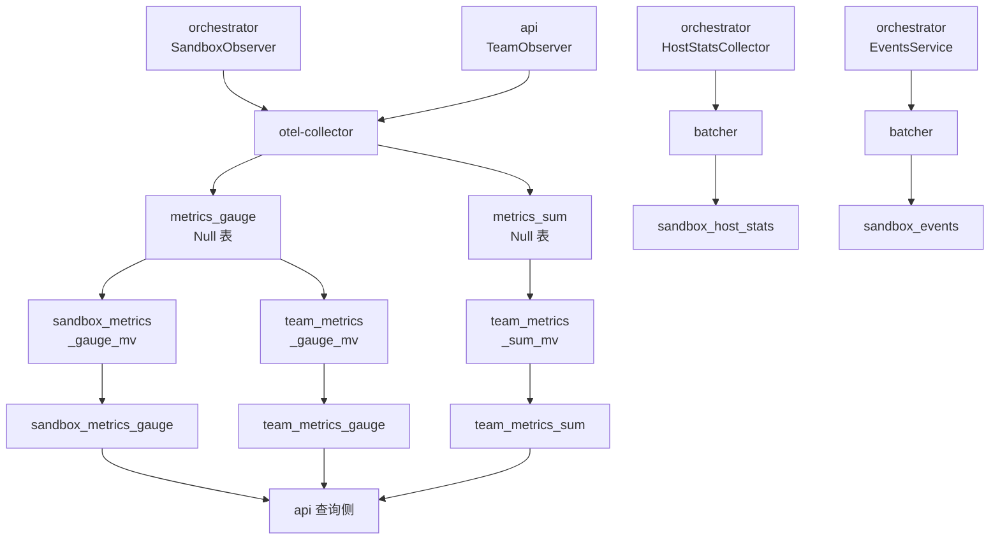

# 59 · ClickHouse

> 沙箱每 5 秒一条采样、每台节点几十上百台沙箱，这类数据既不能进 Postgres，也不适合只走 Grafana。
> 上游 2026.09 为它单独立了一套 ClickHouse：五张业务表、两条写入路径、一个只有三个参数的批处理器，
> 以及一套「分片但不复制」的部署。本篇讲这套东西的形状、参数取值，以及每处取舍换来了什么、赔上了什么。
>
> **读者**：后端工程师、平台工程师。
> **预备**：[第 13 篇 · 存储全景 §1](13-storage-landscape.md#1-五类存储五种约束)、
> [第 24 篇 · API 的指标、日志与分析事件 §1](24-api-metrics-and-analytics.md#1-控制面不存时间序列)。
> **代码**：`packages/clickhouse/migrations/`、`packages/clickhouse/pkg/`、
> `packages/clickhouse/pkg/batcher/batcher.go`、`pkg/events/delivery.go`、`pkg/hoststats/delivery.go`、
> `packages/shared/pkg/feature-flags/flags.go`、`packages/api/internal/metrics/team.go`、
> `iac/modules/job-clickhouse/`、`iac/modules/job-otel-collector/configs/otel-collector.yaml`

---

## 0. 本篇要回答的问题

1. 为什么观测数据要一个列式数据库，而不是 Postgres 的一张宽表或者纯粹的 Prometheus？
2. 迁移里到底建了几张表？`_local`、Distributed、Null 引擎与物化视图这四种角色各自负责什么？
3. 每张表的 TTL 是多少、按什么排序、按什么分片？这些选择限制了哪些查询？
4. 两条写入路径（经 OTel collector 与 orchestrator 直连）为什么不统一？各自会在哪里丢数据？
5. 批处理器的队列长度、批大小、最大延迟取什么值、由谁决定、改了会立刻生效吗？
6. 部署上它是单机还是集群？有副本吗？备份怎么做、恢复要做什么？

---

## 1. 为什么要一个列式数据库

先把待存的数据摆出来。一台 orchestrator 节点上限是 200 台沙箱
（`max-sandboxes-per-node`，见[第 19 篇 §2](19-node-management-and-placement.md#2-节点池发现同步与状态)），
每台沙箱每 5 秒上报六个指标（CPU 总量与使用率、内存总量与已用、磁盘总量与已用），
再加每 5 秒一条宿主侧统计。单节点稳态写入量因此是每秒几百行；一个几十节点的集群是每秒上万行。
这些行只追加、不更新，几乎只按「一个 ID + 一段时间」范围扫描，允许丢一小部分，
也允许延迟几秒才可见。

三种候选各有明显的不合适之处。放进 Postgres，写入压力会与控制面共享同一套 WAL 与连接池，
而控制面的可用性是沙箱能否创建的前提。只放进 Prometheus 或 Grafana Cloud，
标签基数（每台沙箱一个 `sandbox_id`）会迅速失控，查询结果也不便直接当作 API 响应。
只写对象存储再离线分析，秒级可见性就没了。

ClickHouse 落在中间：列存加 ZSTD 压缩让「六个指标 × 每 5 秒」这种高度重复的数据体积可控，
MergeTree 的主键排序让「按 `sandbox_id` 扫一段时间」变成顺序读，
原生 TTL 让过期数据整块 drop 掉而不需要写清理任务。
代价也是三条，本篇会逐条兑现：写入必须成批，于是链路上多了一层批处理器与它的丢样行为；
排序键一旦定下来，不按排序键前缀的查询就只能全扫；
运维上多了一个有状态组件，它的备份、迁移与扩容都要自己安排。

---

## 2. 表：五张业务表与四种角色

`packages/clickhouse/migrations/` 下有 18 个 goose 迁移文件，但最终留下的业务表只有五张。
要读懂迁移，先要分清 ClickHouse 里四种表在这套设计中承担的角色。

### 2.1 四种角色

**`_local` 表**是真正存数据的 MergeTree，每个分片一份，互不知道彼此。
所有 TTL、`PARTITION BY`、`ORDER BY` 都定义在这一层。

**Distributed 表**不存数据，只是同名 `_local` 表的集群视图。
写入它时按分片键把行路由到某个分片，读取它时向所有分片扇出再汇总。
迁移里一律写成 `ENGINE = Distributed('cluster', currentDatabase(), '<表>_local', xxHash64(<键>))`，
分片键是 `sandbox_id` 或 `team_id`——同一台沙箱的全部采样一定落在同一个分片上，
这样按沙箱查询虽然仍会扇出，但只有一个分片真的有数据要扫。

**Null 引擎表**是这套设计里最容易被误读的一环。`20250721084412_routing.sql`
把原本存数据的 `metrics_gauge_local` 整个删掉，换成一张 `ENGINE = Null` 的 `metrics_gauge`；
`20250801113226_team_counters.sql` 又建了同样是 Null 引擎的 `metrics_sum`。
往 Null 表插入的数据**立刻被丢弃**，但挂在它上面的物化视图仍然会被触发。
它在这里的作用是一个「插入点」：OTel collector 只知道往 `metrics_gauge` / `metrics_sum` 写 OTLP 原始格式，
不知道 e2b 的业务表长什么样。

两张 Null 表的来历不同。`metrics_sum` 建出来就是 Null；`metrics_gauge` 则是把原先那张
MergeTree 的 `metrics_gauge_local`（`ORDER BY (ServiceName, MetricName, Attributes, 时间戳)`，
TTL 7 天）连同它的 Distributed 视图一起删掉之后重建的。收益是省掉一份宽表的存储与后台合并开销——
Map 类型的 `Attributes` 进排序键本身就昂贵；代价是改物化视图只对新数据生效，
投影时丢掉的列无法回填，也没有原始行可以重放。

**物化视图（MV）**是插入触发器。三张 MV 从 Null 表读、往 Distributed 表写：

| MV | 源 | 过滤条件 | 目标 |
|---|---|---|---|
| `sandbox_metrics_gauge_mv` | `metrics_gauge` | `MetricName LIKE 'e2b.sandbox.%'` | `sandbox_metrics_gauge` |
| `team_metrics_gauge_mv` | `metrics_gauge` | `MetricName LIKE 'e2b.team.%'` | `team_metrics_gauge` |
| `team_metrics_sum_mv` | `metrics_sum` | `MetricName LIKE 'e2b.team.%'` | `team_metrics_sum` |

三张 MV 都做同一件事：把 OTLP 那套宽而通用的列（`ResourceAttributes`、`ScopeName`、
`Attributes` 这个 Map、`TimeUnix`）压成四五列窄表，把 `Attributes['sandbox_id']`、
`Attributes['team_id']` 从 Map 里提升为真正的列。收益是查询侧不必再解 Map，
排序键可以直接落在 `sandbox_id` 上；代价是 OTLP 原始数据**一行都不留**——
Null 表不存，MV 只保留投影出来的五列，Resource 与 Scope 上的一切属性（包括节点 ID）就此丢失，
既不能按节点排查沙箱指标，也没有原始行可以重放。

两张 MV 同时挂在 `metrics_gauge` 上，这里有一份容易被忽略的双写代价：
collector 每插入一批 gauge 行，两个 MV 的 `SELECT` 各要跑一遍、各判一次 `WHERE`，
即使一批里全是 `e2b.sandbox.` 前缀的行，`team_metrics_gauge_mv` 也要扫完才发现自己一行都不要。
收益是两类 gauge 共用一个插入点，collector 侧只配一张目标表；
代价是插入侧的 CPU 开销随挂在同一张 Null 表上的 MV 数量线性增长。
`metrics_sum` 只挂一个 MV，没有这个问题；它与 `metrics_gauge` 分成两张表，
是因为 sum 的 OTLP 列多出 `AggregationTemporality` 与 `IsMonotonic` 两项。

`sandbox_metrics_gauge_mv` 的过滤条件被改过一次：建表时写的是
`WHERE Attributes['sandbox_id'] IS NOT NULL`，`20250801113225_sandbox_filter.sql` 用
`ALTER TABLE ... MODIFY QUERY` 改成按 `e2b.sandbox.` 前缀过滤。ClickHouse 里 Map 取不存在的键
返回空字符串而非 NULL，原条件恒真，团队指标会被误收进沙箱表（**推论**：迁移文件里没有写理由）。

### 2.2 五张业务表

| 表 | 排序键 | 分片键 | TTL | 写入方 |
|---|---|---|---|---|
| `sandbox_metrics_gauge` | `sandbox_id, metric_name, 纳秒时间戳` | `sandbox_id` | 7 天 | MV（源自 OTel） |
| `team_metrics_gauge` | `team_id, metric_name, 纳秒时间戳` | `team_id` | 90 天 | MV（源自 OTel） |
| `team_metrics_sum` | `team_id, metric_name, 纳秒时间戳` | `team_id` | 90 天 | MV（源自 OTel） |
| `sandbox_events` | `sandbox_id, timestamp` | `sandbox_id` | 7 天 | orchestrator 直写 |
| `sandbox_host_stats` | `sandbox_id, timestamp` | `sandbox_id` | 7 天 | orchestrator 直写 |

五张表都是 `PARTITION BY toDate(timestamp)`，即一天一个分区。这与 TTL 是配套的：
TTL 到期时 ClickHouse 可以整块 drop 掉一个分区，而不必逐行重写数据部分。

两个 TTL 的差别值得解释。`sandbox_metrics_gauge` 是 7 天：
一台沙箱通常活几分钟到几小时，超过一周之后按沙箱查曲线没有意义，而它的行数是全库最多的。
`team_metrics_*` 起初也是 30 天，`20250822155059_extend_team_metrics_ttl.sql` 改成了 90 天：
团队指标一个团队一条时间线、基数低得多，而它要支撑的是「上个季度的并发峰值是多少」这类问题
——`/teams/{id}/metrics/max` 的默认查询窗口是 7 天，但调用方可以传更长的区间。
这条迁移只 `ALTER` 两张 `_local` 表，Distributed 表不存数据。

排序键的形状决定了哪些查询快。沙箱指标表把 `metric_name` 放在 `sandbox_id` 之后、时间戳之前，
于是「某台沙箱的某个指标的一段时间」是主键前缀扫描；而 `sandbox_host_stats` 与 `sandbox_events`
只有 `(sandbox_id, timestamp)`，它们本来就是宽行，一行含全部字段，不需要按名字再分一层。
反过来，没有任何一张表把 `team_id` 放在沙箱表的排序键首位，
所以「一个团队所有沙箱的指标聚合」必须扫整个分区——这类查询在上游的 API 里不存在，
`/sandboxes/metrics` 走的是「给定至多 100 个 sandbox_id」的形式
（`packages/clickhouse/pkg/sandbox.go` 的 `latestMetricsSelectQuery`）。

### 2.3 两张表的历史包袱

`sandbox_events` 建表时的列是 `event_category` / `event_label` / `event_data` 这一套。
`20251017213615` 加了 `type` 与 `version`（`DEFAULT 'v1'`），`20251017213616` 加了 `id UUID`，
`20251017213618` 用五条 `ALTER TABLE ... UPDATE` 把历史行的 `(lifecycle, create)` 这类组合
翻译成 `version='v2', type='sandbox.lifecycle.created'`。
而现在的写入语句 `InsertSandboxEventQuery`（`pkg/events/delivery.go`）**不再写**
`event_category` 与 `event_label` 两列。后果是同一张表里两代行的形状不同：
老行两套字段都有，新行只有 `type`；写查询时必须以 `type` 为准。
另外那五条 `ALTER ... UPDATE` 在 ClickHouse 里是 mutation，会重写涉及的数据部分：
在一张存着一周数据的表上是一次实打实的重 I/O，且每个分片各做一遍。

`product_usage` 是另一段历史：`20250825213612` / `13` 建了它，`20251017213617` 又把它删掉，
现存代码里没有任何地方读写它。

第三点也值得记下：`sandbox_events` 与 `sandbox_host_stats` 在上游 2026.09 的仓库里
**只有写入方，没有读取方**。`grep` 整个 `packages/` 只能找到两条 `INSERT`。
它们服务的是仓库之外的消费者——计费、排障看板或人工查询
（[第 61 篇 §2](61-events-and-webhooks.md#2-事件模型)讲事件本身的语义）。
这也解释了为什么这两张表的排序键如此朴素：没有已知查询要优化。

---

## 3. 两条写入路径

### 3.1 经 OTel collector 的间接路径

指标不是由生产者直接写进 ClickHouse 的。生产者有两个：
orchestrator 的 `internal/metrics/sandboxes.go` 里的 `SandboxObserver`（六个沙箱 gauge），
与 api 的 `internal/metrics/team.go` 里的 `TeamObserver`（`e2b.team.sandbox.running` 这个 gauge
加 `e2b.team.sandbox.created` 这个 counter）。回顾：两者的导出周期都是 5 秒、温度性都改成了 delta，
理由与代价见[第 60 篇 §2.2](60-telemetry.md#22-外部指标5-秒delta)。

数据经 OTLP 送到 otel-collector。`iac/modules/job-otel-collector/configs/otel-collector.yaml`
里有一条专门的 `metrics/external` 流水线：`filter/external_metrics` 只放行名字匹配 `e2b.*` 的指标，
`batch/clickhouse` 按 5 秒或 50000 条成批，`clickhouse` exporter 以
`async_insert: true`、`create_schema: false` 写入 `metrics_gauge` 与 `metrics_sum` 两张 Null 表。
`create_schema: false` 是关键的一行：建表这件事完全交给 goose 迁移，
exporter 不得按自己的默认模式创建表，否则它会建出一张 MergeTree 而不是 Null 表，物化视图就断了。

这条路径的取舍很清楚。收益是生产者只依赖 OTel SDK，不需要 ClickHouse 的连接串与驱动，
otel-collector 也充当了一层缓冲与背压点。代价是链路长：从 observer 采样到查询可见要经过
5 秒导出周期、5 秒 collector 批、异步插入与 MV 触发，端到端十几秒的延迟是常态；
中间任何一段丢数据，在 ClickHouse 里都表现为「这段时间没有采样」，与沙箱真的没跑分不开。
[第 60 篇 §4.1](60-telemetry.md#41-otel-collector每节点一个)讲这条采集链路的其余部分。

### 3.2 orchestrator 直写路径

事件与宿主统计走另一条路：orchestrator 直连 ClickHouse。
`packages/orchestrator/main.go` 在 `config.ClickhouseConnectionString` 非空时
用 `clickhouse.NewDriver()` 建一个连接（`MaxOpenConns = 10`、`MaxIdleConns = 3`、`TLS = nil`），
在它之上建两个 delivery：`clickhouseevents.NewDefaultClickhouseSandboxEventsDelivery` 与
`clickhousehoststats.NewDefaultClickhouseHostStatsDelivery`，两者都注册进关闭链。
连接串为空时这一整段跳过，`hostStatsDelivery` 留成 nil，采集器根本不会启动
（[第 38 篇 §5](38-cgroups-and-host-stats.md#5-host-stats采样与投递)）。

为什么这两类数据不走 OTel？可以推断两条理由：它们是宽行事实记录而不是数值时间序列，
硬塞进 OTLP 的 `Attributes` Map 会让基数爆炸；而且事件对丢失更敏感，
少一层中转就少一处可以静默丢数据的地方（**推论**：代码里没有写明动机）。
代价是 orchestrator 从此有了一个对 ClickHouse 的直接依赖，
并且要自己实现批量、队列与丢弃策略——那就是下一节的 batcher。

---

## 4. 批处理器

ClickHouse 不能按行插入。每次 `INSERT` 都会生成一个数据部分（part），
逐行插入会造出海量小 part，把后台合并压垮。所以直写路径必须先攒批。
`packages/clickhouse/pkg/batcher/batcher.go` 是一个不到两百行的泛型批处理器，
被两个 delivery 共用。

### 4.1 三个参数与它们的来源

`Batcher[T]` 只有三个尺寸参数：`QueueSize`（未处理项的通道容量）、
`MaxBatchSize`（一批最多多少项）、`MaxDelay`（从上一次冲刷到下一次的最大间隔）。
代码里的兜底默认值是 8192 / 65536 / 100 ms，但两个 delivery 都不用它们：
它们从特性开关取值（`packages/shared/pkg/feature-flags/flags.go`）：

| 开关 | 默认值 | 含义 |
|---|---|---|
| `clickhouse-batcher-queue-size` | 1000 | 队列容量，单位是项 |
| `clickhouse-batcher-max-batch-size` | 100 | 一次 `INSERT` 最多 100 行 |
| `clickhouse-batcher-max-delay` | 1000 | 最大延迟，单位毫秒 |

这三个值比 batcher 自带的默认值小一到两个数量级，方向是「宁可批小一点，也不要压着数据不写」。
以宿主统计为例：一台节点 200 台沙箱、每 5 秒一样本，稳态是每秒 40 行，
攒满 100 行要 2.5 秒，`MaxDelay` 的 1 秒先到，于是实际批大小在几十行量级、每秒插入一次。

有一处细节需要留意：**三个值都在构造 delivery 时读一次，之后不再刷新**。
`NewDefaultClickhouseHostStatsDelivery` 在 orchestrator 启动时调用一次，
把三个 `featureFlags.IntFlag(...)` 的结果固化进 `BatcherOptions`。
改了 LaunchDarkly 上的值，要等 orchestrator 重启才生效——这与
[第 14 篇 §2](14-config-flags-versions.md#2-特性开关)里那些每次读取都求值的开关不同。
另外事件 delivery 取 `ClickhouseBatcherQueueSize` 时多传了一个
`flags.SandboxContext("clickhouse-batcher")`，即以一个名叫 `clickhouse-batcher` 的
「沙箱」身份去求值；宿主统计 delivery 没有传。两处对同一个开关用了不同的求值上下文，
在特性开关平台上按沙箱做定向时会得到不一致的结果。

### 4.2 冲刷循环

`processBatches()` 是一个单协程循环：通道里有货就一直取，攒进 `batch`；
通道空且 `batch` 为空时阻塞等下一项，不空转；通道空但 `batch` 非空时，
最多再等 `MaxDelay` 减去自上次冲刷以来的时间，超时就落到冲刷判断。
冲刷条件是 `len(batch) >= MaxBatchSize || time.Since(lastPushTime) > MaxDelay`，
其中 `lastPushTime` 只在冲刷时更新，因此 `MaxDelay` 度量的是**冲刷间隔**而不是单项的排队时间。
通道被 `Stop()` 关闭时，循环把手里剩下的 `batch` 冲刷掉再退出，
所以正常关停不丢数据。冲刷后 `batch = batch[:0]` 复用底层数组，
这也是 `BatcherFunc` 的文档里写明「必须在返回前处理完，不得持有该切片引用」的原因。

冲刷是**同步**的：`call()` 直接在这个协程里执行 `batchInserter`，
后者 `PrepareBatch` → 逐行 `Append` → `Send`。ClickHouse 慢，这个协程就卡住，
队列开始积压，直到满。

### 4.3 满了就丢

`Batcher.Push()` 用 `select` + `default` 往通道写：写不进去立刻返回 `(false, nil)`，
两个 delivery 把它翻译成 `ErrBatcherQueueFull`。这里没有阻塞、没有重试、没有落盘。
调用侧的处理同样是「记一笔就过」：`hoststats_collector.go` 的 `CollectSample` 把错误往上返，
采集循环只记日志继续；`internal/events/events.go` 的 `Publish` 对每个投递目标的错误
只调 `logger.L().Error(...)`。

这是一个明确的取舍：**观测数据的完整性让位于沙箱运行时的可用性**。
1000 项的队列在每秒 40 行的写入速率下大约能吸收 25 秒的 ClickHouse 不可用；
超过这个时长，样本开始按到达顺序被丢弃，而且丢的是新样本不是旧样本。
链路上还有第二个丢点：`ErrorHandler` 只是打一行日志，
一批 `INSERT` 失败意味着这一整批（至多 `MaxBatchSize` 行）永久消失，没有重试队列。
`sandbox_host_stats` 因此不是计费凭据，只能用于排障与容量分析；
表里的空洞与「这台沙箱当时没跑」在数据上无法区分。

---

## 5. 查询侧的两个约束

读取端的端点、鉴权与降级行为属于
[第 24 篇 §3](24-api-metrics-and-analytics.md#3-指标端点)，
这里只讲被表结构决定的两件事。

**一是分桶必须在 SQL 里做。** `pkg/sandbox.go` 与 `pkg/team.go` 的四条查询都用
`toStartOfInterval(timestamp, interval {step:UInt32} second)` 把原始采样点归到桶里，
`step` 由 `pkg/utils/step.go` 的 `CalculateStep()` 按区间长度分六档给出
（1 小时内 5 秒，7 天以上 15 分钟），目标是返回点数少于 1000。
原始点不能直接返回，5 秒一采、7 天就是 12 万个点。
桶内聚合用 `maxIf` 而不是 `avgIf`：读者看到的是每个桶的峰值，不是均值。

**二是「最新值」要靠 `argMaxIf` 一次扫出来。** `latestMetricsSelectQuery` 在一次
`GROUP BY sandbox_id, team_id` 里用六个 `argMaxIf(value, timestamp, metric_name = '...')`
取出六个指标各自时间戳最大的那个值，`ts` 取 `max(timestamp)`。
SQL 里的注释写明这一步的前提是「所有指标在同一时刻记录」——
这个前提由 `SandboxObserver` 的单次回调里一并 observe 六个 gauge 来保证，
是一条跨越 Go 代码与 SQL 的隐式契约，两边都没有断言。

还有一条与部署相关：所有查询打的都是 Distributed 表，
「按 sandbox_id 查一条曲线」的扇出度等于分片数，其中至多一个分片真的有行。

---

## 6. 部署形态

`iac/modules/job-clickhouse/` 是一个 Nomad 模块，`server_count > 0` 时创建四个 job。

**服务本体**（`jobs/clickhouse.hcl`）不是一个 count = N 的 group，
而是用 Terraform 的 `for` 循环展开成 `server-1` … `server-N` 共 N 个 group，每个 `count = 1`，
用 `constraint` 钉到带有对应 `meta.job_constraint` 的机器上。
GCP 侧（`iac/provider-gcp/nomad-cluster/nodepool-clickhouse.tf`）为每个序号建一块
100 GiB 的 `pd-ssd` 持久盘和一个 `google_compute_per_instance_config`，
把盘与 `job-constraint` 元数据都放进 `preserved_state`，
启动脚本 `scripts/start-clickhouse.sh` 按实例名找到这块盘、必要时 `mkfs.xfs`、
挂到 `/clickhouse`，容器再把 `/clickhouse/data` 映射为 `/var/lib/clickhouse`。
机器换代时数据留在盘上，`environment == "dev"` 才允许随实例删除。

**这套集群分片但不复制。** `configs/config.xml` 的 `remote_servers` 里，
每个 server 是一个独立的 `<shard>`，每个 shard 只有一个 `<replica>`；
业务表用的是 `MergeTree` 而不是 `ReplicatedMergeTree`；
配置里也没有 ZooKeeper / Keeper 段。因此一台 ClickHouse 节点丢失就是那个分片的数据丢失，
唯一的恢复手段是备份。这与「7 天 TTL、允许丢样、不是计费凭据」的定位是一致的：
用可用性换掉了复制带来的运维复杂度。集群内部通信用 `<secret>` 共享密钥，
`configs/users.xml` 里给业务账号开了 `async_insert = 1` 与 `wait_for_async_insert = 1`，
即服务端再攒一层批，但客户端要等这层批落盘才返回。

**迁移**（`jobs/clickhouse-migrator.hcl`）同样按 server 展开成 N 个 batch group，
每个都用 `network_mode = "host"` 连 `localhost` 上的那台 ClickHouse 跑一遍
`goose -table _migrations -dir migrations up`。之所以要跑 N 遍，
是因为 `_local` 表不是复制表、建表语句也没有 `ON CLUSTER`，每个分片都要自己建一遍；
goose 的 `_migrations` 记录表本身也是每分片一份。
镜像由 `packages/clickhouse/Dockerfile` 构建：在 golang alpine 里 `go install` 一份 goose v3.24.2，
再拷进一个精简 alpine。

**备份**（`jobs/clickhouse-backup.hcl`）是一个 periodic batch job，
cron `0 2,8,14,20 * * *`（America/Los_Angeles），即每 6 小时一次，`prohibit_overlap = true`。
它用 `altinity/clickhouse-backup:2.6.22` 跑
`clickhouse-backup create_remote --delete-local --tables='default.*' auto_backup_<日期时间>`，
按 `provider_name` 写 GCS 或 S3，路径是 `<backup_folder>/backup/server-<i>/`，
默认 `backup_folder = "clickhouse-data"`，桶名由上层传入
（GCP 下是 `module.init.clickhouse_backups_bucket_name`）。
`--delete-local` 让本地不留副本，省盘但恢复必须走网络。

**恢复**（`jobs/clickhouse-backup-restore.hcl`）是一个 `parameterized` job，
必须传 `backup_name` 这个 meta，跑 `restore_remote --tables='default.*' $NOMAD_META_backup_name`。
两个 job 的 `restart` 都是 `attempts = 0, mode = "fail"`，失败不重试。
每个分片的备份是独立的，因此恢复也要逐分片指定备份名，
上游没有提供「把整个集群恢复到某个一致时间点」的机制——分片之间没有一致性快照
（**推论**：从两个 job 都按 `server-<i>` 分目录、且没有任何协调步骤推出）。

配额上，Nomad 侧给 ClickHouse 任务的默认资源是 4 核与 8192 MiB
（`iac/provider-gcp/variables.tf` 的 `clickhouse_resources_cpu_count` / `_memory_mb`），
`config.xml` 把 `max_server_memory_usage_to_ram_ratio` 从默认的 0.9 收到 0.8。
本地开发用 `packages/clickhouse/Makefile` 的 `run` 目标起一个
`clickhouse/clickhouse-server:25.4.5.24` 容器，`local/config.tpl.xml` 里的 `cluster`
只有一个指向 `localhost` 的分片——单机与集群共用同一套迁移，靠的就是「至少有一个名为
cluster 的集群」这条约定。

---

## 7. ARM 适配版的差异

表结构、批处理器与查询没有任何改动；差异集中在构建与部署。
`packages/clickhouse/Dockerfile` 被改成单阶段的 `debian:bookworm-slim`，
goose 二进制与 `migrations-clickhouse/` 目录由外部预先准备好再 `COPY` 进去，
不再在镜像里 `go install`；`Makefile` 去掉了 GCP / AWS 镜像仓库分支，
构建平台从写死的 `linux/amd64` 改为按 `uname -m` 判断——两处都是为了在没有外网的
aarch64 环境里能把镜像做出来。
部署侧新增的 `helm/templates/clickhouse.yaml` 是一个 `replicas: 1` 的 Deployment，
数据放 `hostPath: /clickhouse/data`，`remote_servers` 里只有一个指向服务域名的分片，
并且**没有对应的备份与恢复 job**；ARM 适配版新增的 `iac/.../jobs/clickhouse.hcl` 同样只有 `server-1`。
单机离线版的默认配置里 `CLICKHOUSE_SERVER_COUNT=0`（`e2b-deploy/dep/.env`），
即默认不部署 ClickHouse，指标端点走 `NoopClient` 返回空。但 ARM 适配版新增的
`iac/provider-gcp/nomad/jobs/orchestrator.hcl` 把 `CLICKHOUSE_CONNECTION_STRING`
硬写成指向 `127.0.0.1` 的串，而 `clickhouse.Open()` 不做连接探测，
于是 orchestrator 照常建起两个 delivery，之后每一批 `INSERT` 都失败并只留一行日志
（**推论**：由「连接串非空即装配」与批处理器的错误处理推出）。
详见[第 78 篇 §3](78-helm-k8s-deployment.md#3-逐份读模板)与
[第 80 篇 §6](80-single-node-rpm.md#6-buildsh--s从空机器到可用集群)。

---

## 8. 小结

- 观测数据被整体移出控制面：ClickHouse 承接沙箱指标、团队指标、沙箱事件与宿主统计四类数据，
  换来的是控制面与观测负载解耦，代价是多一个有状态组件与一条会静默丢数据的链路。
- 迁移最终留下五张业务表：数据存在每分片一份的 `_local` MergeTree 里，
  Distributed 表只做路由与扇出，分片键一律是 `sandbox_id` 或 `team_id`。
- `metrics_gauge` 与 `metrics_sum` 是 Null 引擎的插入点，三张物化视图从它们分流出业务表。
  OTLP 原始行一行不留，Resource 与 Scope 上的属性（包括节点 ID）在这一步永久丢失；
  两个 MV 共挂 `metrics_gauge`，每批 gauge 数据要被扫两遍。
- TTL 分两档：沙箱粒度的三张表 7 天，团队粒度的两张表 90 天（由 30 天扩展而来）；
  所有表按天分区，让 TTL 到期时能整块 drop。
- 指标走 OTel collector 间接落库（`create_schema: false`，建表权全在 goose），
  事件与宿主统计由 orchestrator 直连写入；两条路径的可见性延迟与丢数据方式都不同。
- 批处理器只有队列 1000、批 100 行、延迟 1000 ms 三个参数，全部来自特性开关，
  且只在进程启动时读一次；队列满时 `Push` 立即丢样，`INSERT` 失败时整批丢弃，均无重试。
- 查询侧的分桶宽度由 `CalculateStep()` 单方面决定；「最新值」查询依赖
  「六个指标在同一时刻记录」这条跨语言的隐式契约，两侧都没有断言。
- 部署是分片而不复制：N 个独立 shard、每 shard 一个 replica、普通 MergeTree、无 Keeper。
  单节点故障即该分片数据丢失，兜底手段只有每 6 小时一次的 `clickhouse-backup` 远程备份，
  且恢复要逐分片指定备份名。
- `sandbox_events` 与 `sandbox_host_stats` 在上游仓库里只有写入方没有读取方；
  `sandbox_events` 还携带一次 v1 到 v2 的字段迁移，新旧行的形状不同。

## 延伸阅读 / 下一篇

- [第 24 篇 · API 的指标、日志与分析事件 §2](24-api-metrics-and-analytics.md#2-端点到数据源的矩阵)：本篇这些表的读取端。
- [第 38 篇 · cgroup、资源记账与主机统计 §5](38-cgroups-and-host-stats.md#5-host-stats采样与投递)：`sandbox_host_stats` 每一列的来源与口径。
- [第 58 篇 · Postgres 模式与迁移 §5](58-postgres-schema-and-migrations.md#5-迁移goosemigrator-容器与在线安全)：控制面那一半数据，以及同样基于 goose 的迁移。
- [第 60 篇 · 遥测：tracing、metrics、logs §4](60-telemetry.md#4-采集器与落点)：本篇的下一篇，讲 OTel collector 这条链路的全貌。
- [第 61 篇 · 沙箱事件与 webhook §4](61-events-and-webhooks.md#4-投递一个接口三个实现)：`sandbox_events` 里那些事件的语义与其它投递目标。
- [第 64 篇 · Nomad job 详解 §6](64-nomad-jobs.md#6-全节点与数据面)：本篇提到的四个 job 在整套编排里的位置。
- ClickHouse 官方文档中 MergeTree 的 `ORDER BY` 与稀疏主键索引、Distributed 引擎的分片键，
  以及 `async_insert` 的语义。
