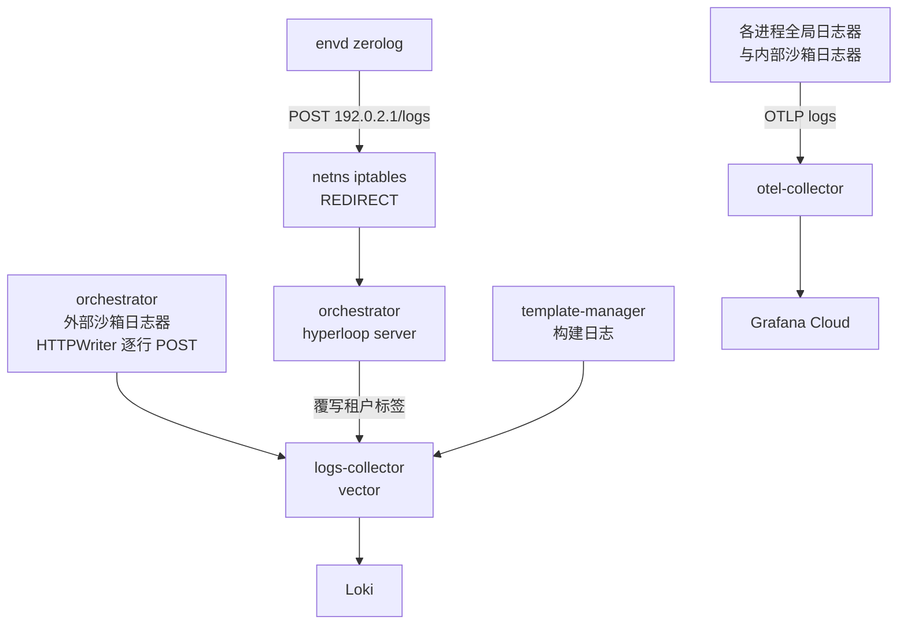
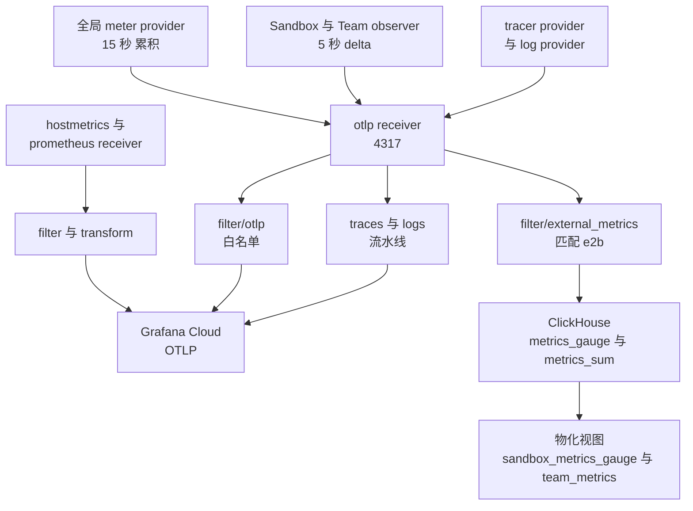

# 60 · 遥测：tracing、metrics、logs

> 一次沙箱创建会同时产生一条 trace、若干条 metric 数据点和几十行日志。它们由同一个 OpenTelemetry
> 客户端发出，走同一个 gRPC 端点，却在采集器里被拆成六条流水线，落到两个完全不同的后端。
> 本篇讲这条管线怎么组装、每类信号在哪里分叉、以及沙箱日志为什么要绕一圈才出得来。
>
> **读者**：后端工程师、平台工程师、运维。
> **预备**：[第 08 篇 · 本书用到的 Go 服务工程 §7](08-go-service-toolkit.md#7-遥测与日志一次装配处处可用)、
> [第 24 篇 · API 的指标、日志与分析事件 §2](24-api-metrics-and-analytics.md#2-端点到数据源的矩阵)（读侧）。
> **代码**：`packages/shared/pkg/telemetry/`、`packages/shared/pkg/logger/`、
> `packages/shared/pkg/logger/sandbox/`、`packages/orchestrator/internal/metrics/sandboxes.go`、
> `packages/api/internal/metrics/team.go`、`packages/orchestrator/internal/hyperloopserver/`、
> `packages/envd/internal/logs/`、`packages/otel-collector/`、
> `iac/modules/job-otel-collector/`、`job-otel-collector-nomad-server/`、`job-logs-collector/`、`job-loki/`

---

## 0. 本篇要回答的问题

1. 三类信号（trace、metric、log）在进程内由谁初始化？没有配置采集器地址时进程会怎样？
2. 为什么每个进程里有**两个** meter provider，一个 15 秒一个 5 秒，一个累积一个 delta？
3. 沙箱内 envd 打的一行日志，要经过哪几跳才能被 `GET /sandboxes/{id}/logs` 读到？
4. otel-collector 把收到的东西分成了几条流水线，各自过滤什么、送到哪里？
5. 「内部日志」与「外部日志」在代码里是怎么分开的，分开之后走的是不是同一条路？
6. 关键的 span 名与 metric 名分别是什么，命名规则是否一致？

---

## 1. 一个客户端，三类信号

### 1.1 初始化与空后端路径

四个长驻进程（api、orchestrator、client-proxy、dashboard-api）的 `main.go` 里都有同一行：

```go
tel, err := telemetry.New(ctx, nodeID, serviceName, commitSHA, version, serviceInstanceID)
```

`packages/shared/pkg/telemetry/main.go` 的 `New()` 依次建立四样东西：metric exporter 与 meter provider、
资源描述（resource）、log provider、span exporter 与 tracer provider，并把 meter provider、
tracer provider、文本传播器注册为 OpenTelemetry 的全局对象。函数的第一行是本篇最该先看的一行：

```go
if otelCollectorGRPCEndpoint == "" {
    return NewNoopClient(), nil
}
```

`otelCollectorGRPCEndpoint` 是 `config.go` 里的包级变量，值来自环境变量 `OTEL_COLLECTOR_GRPC_ENDPOINT`，
在包被加载时读取一次。也就是说：**不配这个环境变量，整套遥测就退化成一组空实现**——
`noopMetricExporter`（聚合方式返回 `AggregationDrop`）、`noopSpanExporter`（`ExportSpans` 直接返回 nil）、
`noopLogProvider`、以及不带任何 propagator 的复合传播器。

这条设计的收益是本地开发与最小部署不需要先跑起一个采集器：所有 `tracer.Start`、`counter.Add`、
`logger.L().Info` 的调用点原样保留，只是数据被丢弃，调用方无需写 `if telemetryEnabled` 分支。
代价有两条。其一，它是**静默**的：进程不会因为拿不到采集器而报错，也不会打印警告，
遥测不见了和采集器挂了在进程侧看不出区别。其二，这个变量在包初始化时读取，
运行期改环境变量无效，也没有任何接口能把它切回来。

与之相对的是**已配置但连不上**的情况：`otlptracegrpc.New`、`otlpmetricgrpc.New`、`otlploggrpc.New`
建立的都是惰性连接，端点不通时导出会失败并由 SDK 内部重试，进程照常运行。
**推论**：因此「采集器地址写错」在生产里的表现与「没配采集器」几乎一样，都是数据静默消失。

三个 exporter 的公共配置是同一套：`WithInsecure()`（明文 gRPC）、`WithEndpoint(otelCollectorGRPCEndpoint)`。
traces 与 logs 额外加了 `WithCompressor(gzip.Name)`，metrics 没有。明文是可以接受的，
因为采集器就在同一台机器上（[§4.1](#41-otel-collector每节点一个)）。

### 1.2 资源属性

`config.go` 的 `GetResource()` 给每个进程的所有信号打上同一组资源属性：
`service.name`（进程名）、`service.version`（`<版本>-<commit>` 拼成一个字符串）、
`service.instance.id`（进程启动时生成的 UUID）、`host.id`（节点 ID）、`host.name`（`os.Hostname()`）
以及 SDK 语言标识。

`service.instance.id` 用 UUID 而不是主机名，意味着**同一台机器上进程重启会换一个实例 ID**。
好处是能区分重启前后的两段生命周期；代价是任何按实例 ID 分组的看板在重启处会断成两条序列。
采集器随后会把这个属性重写掉（[§4.1](#41-otel-collector每节点一个)）。

### 1.3 tracing 的采样与传播

`traces.go` 的 `NewTracerProvider` 用 `sdktrace.AlwaysSample()`：**全量采样，不做任何抽样**，
配一个批量 span 处理器。这是一个把成本压在采集器与后端上的选择——
控制面的请求速率不高，全量 trace 对排查单次沙箱创建极有价值；
但沙箱数量上去以后，orchestrator 侧那些每个块、每次缺页都开 span 的路径会成为主要成本来源。

tracer 的**名字**统一是包的导入路径，例如
`otel.Tracer("github.com/e2b-dev/infra/packages/orchestrator/internal/sandbox")`。
好处是从 span 的 instrumentation scope 一眼能定位到代码包；
代价是重构包路径会改掉 scope 名，按 scope 过滤的查询会失效。

传播器是 `TraceContext` + `Baggage` 的组合。但 api 的入口处做了一件相反的事：
`packages/api/internal/middleware/otel/tracing/middleware.go` 在每个请求上删掉
`traceparent` 请求头，注释说明原因是「它来自我们的用户，会导致多次调用共享同一个 trace ID」。
这条取舍很实在：SDK 是长驻客户端，如果它在整个会话里复用一个 trace context，
服务端所有请求会挂在同一棵树上，trace 变得无法使用。代价是**跨端链路断了**——
客户端 SDK 的 span 与服务端的 span 无法在同一条 trace 里看到。

进程之间的传播是靠 gRPC 做的：`packages/shared/pkg/grpc/server.go` 的 `NewGRPCServer`
装了 `otelgrpc.NewServerHandler`，api 侧的客户端（`internal/clusters/instance_client.go`、
`internal/orchestrator/nodemanager/client.go`）装了对应的 `NewClientHandler`。
所以 api → orchestrator 的调用是同一条 trace，api ← SDK 不是。

### 1.4 错误报告：span 与日志缝在一起

`tracing.go` 里的四个函数是全仓库最常被调用的遥测入口：
`SetAttributes`、`ReportEvent`、`ReportError`、`ReportCriticalError`。
后两个做的是同一件事的两个等级——把消息与错误同时写进当前 span
（`RecordError` + 栈回溯 + 属性）和 zap 全局日志器，`ReportCriticalError` 额外把 span 状态置为
`codes.Error`。`ReportErrorByCode` 按 HTTP 状态码在两者间选择：5xx 用 critical，其余用普通。

反方向也有一条缝合：`logger.go` 的 `TracedLogger.generateFields` 在每条日志上，
从 context 里取出当前 span 的 `trace_id` 与 `span_id` 作为字段。
于是 trace 与 log 双向可跳转，而不需要引入额外的关联 ID。
`attributesToZapFields` 负责把 OTel 的 `attribute.KeyValue` 转成 zap 字段，
`telemetry/fields.go` 里的 `ZapFieldToOTELAttributeEncoder` 负责反方向的转换，
两个方向的字段名因此是同一套：`sandbox.id`、`template.id`、`build.id`、`team.id`、`node.id`、
`cluster.id`、`envd.version`（`logger/fields.go`）。

## 2. 两个 meter provider

### 2.1 内部指标：15 秒、累积

`telemetry.New` 建立的 meter provider 用 `metricExportPeriod = 15 * time.Second`，
温度性（temporality）走 OTLP 默认，即累积（cumulative），
直方图的聚合被换成 base2 指数直方图（`MaxSize: 160`、`MaxScale: 20`）。
这个 provider 被注册为全局，`packages/shared/pkg/telemetry/meters.go` 里那些
`orchestrator.*`、`api.*`、`template.*`、`client_proxy.*` 的仪表都挂在它上面。

### 2.2 外部指标：5 秒、delta

沙箱与团队两组指标不用全局 provider，各自新建一个：

- `packages/orchestrator/internal/metrics/sandboxes.go` 的 `NewSandboxObserver`，
  周期 `sandboxMetricExportPeriod = 5 * time.Second`；
- `packages/api/internal/metrics/team.go` 的 `NewTeamObserver`，周期 `ExportPeriod = 5 * time.Second`。

两者都用 `otlpmetricgrpc.WithTemporalitySelector` 把温度性改成 delta，
并用 `exemplar.AlwaysOffFilter` 关掉 exemplar。orchestrator 侧只对 gauge 用 delta，
其余仪表仍是累积，代码里给了理由：

```go
// Use delta temporality for gauges and cumulative for all other instrument kinds.
// This is used to prevent reporting sandbox metrics indefinitely.
```

这一条值得展开。OpenTelemetry 的可观测 gauge 是**回调式**的：每个导出周期 SDK 调一次回调，
回调里 `so.sandboxes.Items()` 遍历当前活着的沙箱。沙箱消失后回调不再上报它，
但在累积温度性下 SDK 会记住上一次的数据点并继续导出，于是一个已经死掉的沙箱会永远有一条平直的
CPU 曲线。delta 温度性下每个周期只报本周期观测到的点，沙箱消失，序列自然断掉。
代价是下游必须理解 delta：累积语义下能做的「重启检测」「跨周期求差」在这里不适用。

对 counter 而言 delta 的影响更直接。`e2b.team.sandbox.created` 是一个 `Int64Counter`，
delta 导出意味着每 5 秒的数据点是**这 5 秒内新建的沙箱数**，而不是累计总数。
`/teams/{id}/metrics/max` 的 `sandbox_start_rate` 分支因此把分桶宽度写死为 `metrics.ExportPeriod`，
按 5 秒分桶求和再除以 5 才是每秒速率。这构成一条**读写耦合**：
改动 `ExportPeriod` 会让历史数据与新数据的桶宽不一致，端点算出来的峰值失真，
而代码里没有断言或注释约束这件事（[第 24 篇 §3.3](24-api-metrics-and-analytics.md#33-团队指标)）。

### 2.3 沙箱指标的采集侧

`SandboxObserver.startObserving` 注册的回调在每个 5 秒周期做这些事：
遍历 `sandbox.Map`，跳过 envd 版本低于 `minEnvdVersionForMetrics`（`0.1.5`）的沙箱，
跳过 `sbx.Checks.UseClickhouseMetrics` 为 false 的沙箱（该值来自
`featureflags.MetricsWriteFlag`，见 `packages/orchestrator/internal/sandbox/sandbox.go`），
然后并发向 envd 取一次指标，超时 `timeoutGetMetrics = 100 * time.Millisecond`。
并发度是 `ceil(沙箱数 / metricsParallelismFactor)`，`metricsParallelismFactor = 5`。

采到的值还会做一次时钟校验：envd 版本高于 `0.1.3` 时指标里带 guest 时间戳，
与宿主时间差超过 `maxAcceptableSandboxClockDriftSec = 2` 秒就打一条警告日志。
另外，内存或 CPU 使用率超过 80%（`sbxMemThresholdPct`、`sbxCpuThresholdPct`）时，
会用**外部沙箱日志器**打一条用户可见的告警——这是指标与日志两条管线在采集侧的一个交叉点。

## 3. 日志：内部与外部两套

### 3.1 zap 的 tee 结构

`packages/shared/pkg/logger/logger.go` 的 `NewLogger` 把一个 zap 配置和一组额外的
`zapcore.Core` 用 `zapcore.NewTee` 串起来，控制台输出是其中一个 core，调用方传进来的是另一些。
每条日志固定带三个字段：`service`、`internal`（布尔）、`pid`。

`internal` 这个布尔是全篇的分水岭。它的语义在 `LoggerConfig` 的注释里写得很清楚：
「区分我们的（内部）日志与用户可访问的（外部）日志」。四个进程的全局日志器都是
`IsInternal: true`，core 是 `logger.GetOTELCore(tel.LogsProvider, serviceName)`——
经 `otelzap` 桥接成 OTLP 日志，走 §1 那条 gRPC 通道。

### 3.2 沙箱日志器：同一个接口，两条物理路径

`packages/shared/pkg/logger/sandbox/logger.go` 的 `NewLogger` 是另一套：

```go
if !config.IsInternal && config.CollectorAddress != "" {
    // JSON 编码 + HTTP 写入器
} else {
    core = logger.GetOTELCore(loggerProvider, config.ServiceName)
}
```

也就是说：**外部沙箱日志走 HTTP 直发 logs-collector，内部沙箱日志走 OTLP 发 otel-collector**。
两者是两条完全不同的物理链路，落点也不同（[§4](#4-采集器与落点)）。

HTTP 写入器是 `logger/exporter.go` 的 `HTTPWriter`：每次 `Write` 复制一份缓冲（zap 会复用底层数组），
起一个 goroutine 按换行切分，**逐行**发一个 POST。它不做批量、不做重试，发送失败只把这行打到本地
`log.Printf`。收益是实现简单、延迟低、不会在进程里堆积；
代价是每行日志一次 HTTP 请求，沙箱日志量大时这是可观的开销，且失败即丢。
`Sync()` 用一个可替换的 `WaitGroup` 等待在飞的请求，进程退出时能冲刷一次。

`sandbox/global.go` 把两个日志器放在包级变量里，用 `SetSandboxLoggerInternal` /
`SetSandboxLoggerExternal` 在 `main.go` 里注入，调用点用 `sbxlogger.I(sbx)` 与 `sbxlogger.E(sbx)`
取用。`sandbox/metadata.go` 的 `Fields()` 给每条沙箱日志附上两套键：
点分风格的 `sandbox.id`、`template.id`、`team.id`，以及注释标明「Fields for Vector」的
`instanceID`、`envID`。两套并存是为了兼容采集器侧的标签映射，见 §4.2。

翻遍上游 2026.09 的调用点，`E()` 用在「Killing sandbox」「Pausing sandbox」「Sandbox stopped」
「healthcheck 状态变化」「资源使用率超阈值」这几处，`I()` 用在各种内部错误。
`sandbox/sandbox_logger.go` 里还有一个 `Metrics()` 方法，往外部日志里写 `category="metrics"`
的一行——**在上游 2026.09 中没有任何调用点**（沙箱指标已改走 ClickHouse）。
读侧的 LogQL 选择器至今仍带着 `category!="metrics"` 来排除这类旧数据
（[第 24 篇 §4.1](24-api-metrics-and-analytics.md#41-沙箱日志)）。

### 3.3 从 envd 到 Loki：四跳

沙箱内部的 envd 不接 OpenTelemetry，它用 zerolog，写到
`packages/envd/internal/logs/exporter/exporter.go` 的 `HTTPExporter`（同时也写 stdout）。
这个导出器启动时不知道往哪发：目标地址来自 MMDS。
`packages/envd/internal/host/mmds.go` 轮询 `169.254.169.254`，拿到
`MMDSOpts{instanceID, envID, address}` 后通过一个 channel 通知导出器，导出器才开始发送。
在拿到地址之前，日志只落在 guest 的 stdout 里。

MMDS 的内容由 orchestrator 写入。`packages/orchestrator/internal/sandbox/fc/process.go`
在 Firecracker 起来之后 `setMmds`，其中：

```go
LogsCollectorAddress: fmt.Sprintf("http://%s/logs", p.config.NetworkConfig.OrchestratorInSandboxIPAddress)
```

`OrchestratorInSandboxIPAddress` 默认是 `192.0.2.1`（`sandbox/network/pool.go`），
一个 TEST-NET-1 保留地址。`sandbox/network/network.go` 在沙箱的 netns 里下了一条 iptables 规则，
把发往这个地址 80 端口的 TCP 重定向到宿主上的 hyperloop 端口。
所以 envd 眼里的「日志采集器」其实是 orchestrator 自己。

hyperloop 服务在 `packages/orchestrator/internal/hyperloopserver/`。
`handlers/logs.go` 的处理是三步：用 `c.Request.RemoteAddr` 在 `sandbox.Map` 里反查是哪个沙箱
（`GetByHostPort`），**覆写** payload 里的 `instanceID` 与 `teamID`
（注释写明是为了避免 spoofing），再把整个 JSON 转发给 `LOGS_COLLECTOR_ADDRESS`。
这一跳的价值就在覆写：沙箱里跑的是用户代码，任何来自 guest 的标签都不可信，
而下游 Loki 的租户隔离恰恰靠 `teamID` 标签。代价是每一行沙箱日志都要在 orchestrator 里
过一次 JSON 解析与重新序列化，并占用一个 HTTP 客户端连接（`CollectorExporterTimeout = 10 * time.Second`）。



### 3.4 构建日志

模板构建的日志有两个去处，在 `packages/orchestrator/internal/template/server/create_template.go`
里用一个 tee 同时接上：

- `buildlogger.NewLogEntryLogger()` 产生的内存缓冲，挂在 build cache 上，
  由 `TemplateBuildStatus` gRPC 返回——这是[第 24 篇 §4.4](24-api-metrics-and-analytics.md#44-构建日志的双源回退)
  里的「临时来源」；
- `s.buildLogger`（`main.go` 里建立的 `tmplSbxLoggerExternal`，服务名
  `constants.ServiceNameTemplate`，`IsInternal: false`），附加 `envID` 与 `buildID` 两个字段，
  经 HTTPWriter 发往 logs-collector，最终成为 Loki 里的持久来源。

两条路的分工解释了读侧为什么要做双源回退：构建进行中时 Loki 那边还没有或不全，
构建结束后内存缓冲随实例消失。

## 4. 采集器与落点

### 4.1 otel-collector：每节点一个

`iac/modules/job-otel-collector/jobs/otel-collector.hcl` 把
`otel/opentelemetry-collector-contrib:0.146.0` 作为 Nomad 的 `system` 类型 job，
`node_pool = "all"`，`network_mode = "host"`，即**每个节点一份**。
所有业务进程的 `OTEL_COLLECTOR_GRPC_ENDPOINT` 都是 `localhost:<port>`
（`iac/provider-gcp/nomad/main.tf`）。这条选择的收益是：导出永远是本机回环，
不受跨节点网络影响，采集器重启只影响本节点；代价是节点宕机时它缓冲区里的数据一起消失，
而且每个节点都要为采集器留出 CPU 与内存配额。

`configs/otel-collector.yaml` 有三个 receiver：`otlp`（gRPC 4317，收业务进程的三类信号）、
`prometheus`（抓本机 Nomad client 的 `/v1/metrics`）、`hostmetrics`（挂载 `/:/hostfs:ro`，
30 秒采一次宿主指标）。hostmetrics 的 scraper 是逐项显式开关的，配置里注明这样做是为了
「明确我们选择包含或排除了哪些指标」；其中 huge pages 一组是本书关心的
（[第 32 篇 · 预取与大页 §5](32-memory-prefetch-and-hugepages.md#5-大页改变了哪些量)），
它依赖 collector-contrib v0.146.0 才加入的支持。

六条流水线的分工：

| 流水线 | receiver | 关键处理器 | exporter |
|---|---|---|---|
| `metrics` | otlp | `filter/otlp` 白名单正则 | Grafana Cloud |
| `metrics/prometheus` | prometheus | `filter/only_client_allocs` | Grafana Cloud |
| `metrics/rpc_only` | otlp | `filter/rpc_duration_only`、删实例 ID | Grafana Cloud |
| `metrics/host` | hostmetrics | `metricstransform/single_cpu` | Grafana Cloud |
| `metrics/external` | otlp | `filter/external_metrics`（`e2b.*`） | ClickHouse |
| `traces` / `logs` | otlp | `resourcedetection`、`resource/set_attributes` | Grafana Cloud |



分流规则是**按指标名的正则**。`filter/otlp` 的白名单是 `orchestrator.*`、`template.*`、`api.*`、
`client_proxy.*`、`db.sql.connection.*`、`pgxpool.*`、`otelcol.*` 等，**不含 `e2b.*`**；
`filter/external_metrics` 只要 `e2b.*`。于是 §2 那两个 provider 导出的东西天然分开：
内部运维指标进 Grafana Cloud，面向用户的沙箱与团队指标进 ClickHouse，供 api 读回
（[第 24 篇 §3](24-api-metrics-and-analytics.md#3-指标端点)）。这条边界完全靠命名维持——
新加一个 `e2b.` 开头的指标会自动进 ClickHouse，反之则不会，代码里没有任何类型层面的约束。

ClickHouse exporter 写的是 `metrics_gauge` 与 `metrics_sum` 两张表，
`async_insert: true`，前面挂 `batch/clickhouse`（5 秒或 50000 条）。
配置里的 `create_schema: false` 划了一条职责线：**建表与改表全归 goose 迁移**，
exporter 只管往已存在的表里写。这一行不能少——默认的 `create_schema: true` 会让 exporter
按自己的模式建出一张 MergeTree，而迁移期望的是 Null 引擎，物化视图就接不上了
（[第 59 篇 §2.1](59-clickhouse.md#21-四种角色)）。
落到这两张表之后还有一层：`packages/clickhouse/migrations/` 里的物化视图按指标名再分一次——
`e2b.sandbox.%` 进 `sandbox_metrics_gauge`（TTL 7 天），`e2b.team.%` 进
`team_metrics_gauge` / `team_metrics_sum`（TTL 经一次迁移从 30 天延长到 90 天）。
两张源表的引擎**都是 `Null`**，即写进去的 OTLP 原始行落地即丢，只有物化视图投影出来的窄表留下来。
代价是采集器这一侧看不出区别：往一张只会丢弃数据的表里写，插入照样返回成功，
指标是否真的落库要到业务表才验证得了。

另外三个处理器值得记住：`resourcedetection` 按云厂商探测实例信息；
`transform/set-name` 把 `service.instance.id` 从探测到的实例名重写为数据点属性，
并删掉 `datacenter`、`node_id`、`node_class` 等 Nomad 带来的高基数标签；
`resource/set_attributes` 在 traces 与 logs 上做类似的事，并删掉 `internal`、`telemetry.sdk.*`。
可以看到，§1.2 里进程自报的 `service.instance.id` 在这里被覆盖掉了。

采集器还给自己发指标：`service.telemetry.metrics` 配了一个指向 `localhost:4317` 的 OTLP reader，
也就是**自己发给自己**，再经 `filter/otlp` 里的 `otelcol.*` 规则送往 Grafana Cloud。

### 4.2 logs-collector：vector 与 Loki

`iac/modules/job-logs-collector/` 跑的是 `timberio/vector:0.34.X-alpine`，同样是 `system` job、
host 网络、每节点一份，HTTP 源接 ndjson。`configs/vector.toml` 的处理分三段：

**归一化。** `transforms.add_source_http_server` 把各种写法的键统一到一套标签名：
`sandbox_id`、`sandbox.id`、`instanceID` 都归到 `sandboxID`，`template.id` 归到 `templateID`，
`build.id`、`env.id`、`team.id` 同理，时间戳解析失败就取 `now()`。
这一段的存在正是因为 §3.2 里那两套字段名同时在用。缺失的键补默认值：
`envID`、`teamID`、`sandboxID`、`buildID` 补 `"unknown"`，`category` 补 `"default"`，
`service` 补 `"envd"`——最后这条默认值意味着**任何没写 `service` 字段的日志都会被当成 envd 的**。

**按 `internal` 分流。** `transforms.internal_routing` 把 `.internal == true` 的分出去发往
Grafana Cloud 的 Loki（配了 `grafana_logs_endpoint` 时），其余的删掉 `internal` 字段后发本地 Loki。

**打标签。** 本地 Loki sink 的标签是 `source`、`service`、`teamID`、`envID`、`buildID`、
`sandboxID`、`category` 七个。读侧的选择器正是由这几个标签构成的。
标签基数直接决定 Loki 的流数：`sandboxID` 作为标签意味着**每个沙箱一条流**，
这也是 `loki.yml` 里把 `max_streams_per_user` 与 `max_global_streams_per_user` 都设为 0（不限）、
并把 `per_stream_rate_limit` 提到 80 MB 的原因。

`iac/modules/job-loki/configs/loki.yml` 的其余口径：单副本、ring 用 `inmemory`，
索引用 tsdb shipper，chunk 存对象存储（GCS 或 S3），
`compactor` 开启保留期删除，`limits_config.retention_period: 168h`，即**7 天**。
读侧 `LogQueryWindow` 的 `logsOldestLimit` 恰好也是 7 天，两边是对齐的。
`wal.enabled: false` 值得单独指出：ingester 不写预写日志，进程异常退出会丢掉尚未落盘的 chunk，
换来的是写入路径上少一次磁盘同步。

### 4.3 第三个采集器：Nomad server

`iac/modules/job-otel-collector-nomad-server/` 是一个 `service` 类型的 job，只有一条流水线：
用 Consul 服务发现找到所有 Nomad server，抓它们的 `/v1/metrics`，按白名单过滤后发 Grafana Cloud。
白名单里是 raft、调度器（plan queue、evaluate）、broker、heartbeat、gossip 这些
Nomad 控制面自身的健康指标。它与 §4.1 的采集器分开的原因是作用域不同：
一个是每节点的 client 指标，一个是集群级的 server 指标，后者只需要一份。
它的 `service.telemetry.metrics.level` 是 `none`，不给自己发指标。

## 5. 名称表

metric 名集中定义在 `packages/shared/pkg/telemetry/meters.go`，按仪表类型分组，
每个名字都有一份描述与单位的映射，`GetCounter` / `GetGaugeInt` 等构造函数据此填充。
挑出跨篇会用到的：

| 名称 | 类型 | 产出者 | 落点 |
|---|---|---|---|
| `e2b.sandbox.cpu.used` | gauge（float） | orchestrator `SandboxObserver` | ClickHouse |
| `e2b.sandbox.cpu.total`、`ram.used`、`ram.total`、`disk.used`、`disk.total` | gauge（int） | 同上 | ClickHouse |
| `e2b.team.sandbox.running` | gauge（int） | api `TeamObserver` | ClickHouse |
| `e2b.team.sandbox.created` | counter | api `TeamObserver` | ClickHouse |
| `api.env.instance.running` / `.started` | up-down counter / counter | api | Grafana Cloud |
| `api.orchestrator.created_sandboxes`、`api.orchestrator.status` | counter / gauge | api | Grafana Cloud |
| `orchestrator.env.sandbox.running` | 可观测 up-down counter | orchestrator | Grafana Cloud |
| `orchestrator.sandbox.envd.init.duration` / `.calls` | 直方图 / counter | orchestrator | Grafana Cloud |
| `orchestrator.proxy.*`、`client_proxy.proxy.*` | 可观测 up-down counter | orchestrator / client-proxy | Grafana Cloud |
| `orchestrator.tcpfirewall.*` | counter / 直方图 | orchestrator | Grafana Cloud |
| `template.build.duration`、`.phase.duration`、`.step.duration`、`.rootfs.size` | 直方图 | template 构建 | Grafana Cloud |
| `template.build.result`、`template.build.cache.result` | counter | 同上 | Grafana Cloud |

这张表里有一处名实不符，用到 `client_proxy.proxy.*` 时必须知道：
`packages/client-proxy/internal/proxy/proxy.go` 把
`client_proxy.proxy.pool.connections.open` 的回调接到了 `proxy.CurrentServerConnections()`，
又把 `client_proxy.proxy.server.connections.open` 接到了 `proxy.CurrentPoolConnections()`，
**两个名字对调了**。`meters.go` 里的描述文字（前者「到 orchestrator proxy 的连接」、
后者「来自负载均衡器的连接」）按名字读是对的，按数据读是反的。
orchestrator 侧同名的一对（`packages/orchestrator/internal/proxy/proxy.go`）接得正确，
两边一比就能看出问题出在 client-proxy 这一侧。这是上游 2026.09 的问题，不是 ARM 适配版引入的，
后果是照名字读盘的看板会把两条连接数曲线画反（[第 86 篇 §7](86-known-issues-and-debt.md#7-继承自上游的问题)）。

命名有两套并存的规则：面向用户、要进 ClickHouse 的以 `e2b.` 开头；内部运维指标以进程名开头。
`meters.go` 里另有一个 `TimerFactory`，它用**同一个名字**注册直方图、字节 counter 与次数 counter 三个仪表，
块层的耗时统计走这条路（[第 30 篇 · block 包 §6](30-block-layer.md#6-两种-chunker)）。

span 名没有集中定义，散落在各处的 `tracer.Start` 调用里。跨进程的主干是：

| span | 位置 |
|---|---|
| `create-sandbox` | `packages/api/internal/orchestrator/create_instance.go`、`placement/placement.go` |
| `sandbox-create` / `sandbox-pause` / `sandbox-delete` / `sandbox-checkpoint` | `packages/orchestrator/internal/server/sandboxes.go` |
| `create sandbox` / `resume sandbox` / `shutdown sandbox` / `sandbox-snapshot` | `packages/orchestrator/internal/sandbox/sandbox.go` |
| `template-background-build` / `template-build` | `packages/orchestrator/internal/template/server/`、`build/` |
| `sandbox-catalog-get` / `-store` / `-delete` | `packages/shared/pkg/sandbox-catalog/` |

命名并不统一：连字符（`sandbox-create`）与空格（`create sandbox`）混用，
同一件事在 api 侧叫 `create-sandbox`、在 orchestrator 侧叫 `sandbox-create`。
这不影响功能，但按 span 名做聚合查询时需要知道。
除了这些手写的 span，gRPC 与 gin 的自动插桩还会生成一层 `rpc.server.*` 与 HTTP 服务端 span，
采集器里那条 `metrics/rpc_only` 流水线处理的就是它们派生出来的 `rpc.server.duration.*` 指标。

## 6. ARM 适配版的差异

管线的形状不变，两端的实现替换掉了。otel-collector 在 ARM 适配版里以 DaemonSet 形式跑
（`helm/templates/otel-collector.yaml`），镜像从私有 registry 取
`otel/opentelemetry-collector-contrib:0.119.0`；配置里去掉了 `hostmetrics` receiver 与
`resourcedetection` 处理器，改用一个静态的 `resource/local` 处理器，
把 `host.name`、`service.instance.id`、`host.id`、`deployment.environment` 直接写成 Helm 值——
因为私有环境里没有云厂商的元数据服务可探测。
logs-collector 换成 `timberio/vector:0.50.0-alpine`，Grafana 那个 sink 被移除，
`internal` 路由分支因此没有下游，内部标记的日志被丢弃；Loki 的 `object_store` 从 GCS 改为
`filesystem`，配一个本地卷。Nomad 形态下的同类改动在
`iac/provider-gcp/nomad/jobs/otel-collector.hcl`、`logs-collector.hcl`、`loki.hcl`。
细节见[第 78 篇 · 部署形态一：Helm / Kubernetes §3](78-helm-k8s-deployment.md#3-逐份读模板)与
[第 80 篇 · 部署形态三：单机离线 RPM §6](80-single-node-rpm.md#6-buildsh--s从空机器到可用集群)。

## 7. 小结

- `OTEL_COLLECTOR_GRPC_ENDPOINT` 为空时，`telemetry.New` 返回一整套空实现，
  所有埋点保留但数据被丢弃，且没有任何提示；地址配错的表现与不配几乎相同。
- 每个进程有两个 meter provider：全局的 15 秒累积，供内部运维指标；
  沙箱与团队各自的 5 秒 delta，供面向用户的 `e2b.*` 指标。
- gauge 用 delta 温度性的直接原因是回调式 gauge 在累积语义下会让已消失的沙箱永远有曲线。
- counter 用 delta 使得数据点是「本周期增量」，读侧 `sandbox_start_rate` 的分桶宽度必须等于
  `ExportPeriod`，这条读写耦合没有任何机制保护。
- 日志按 `internal` 布尔分成两条物理链路：内部日志走 OTLP 到 otel-collector 再到 Grafana Cloud，
  外部（用户可见）日志走 HTTP 直发 vector 再到 Loki。
- 沙箱日志经四跳出来：envd 从 MMDS 拿到 `192.0.2.1/logs`，iptables 重定向到 orchestrator 的
  hyperloop，hyperloop 覆写 `instanceID` 与 `teamID` 以防伪造，再转发给 vector。
- 构建日志双写：内存缓冲供构建中查询，外部日志器供构建后从 Loki 查询。
- 采集器按**指标名正则**分流：`e2b.*` 进 ClickHouse，其余进 Grafana Cloud。
  这条边界只靠命名维持，没有类型层面的约束。
- 两个采集器都是每节点一份、经 localhost 接收，好处是不受跨节点网络影响，
  代价是节点宕机会带走它缓冲区里的数据。
- Loki 保留期 168 小时，与读侧的 `logsOldestLimit` 和 `sandbox_metrics_gauge` 的 TTL 一致；
  ingester 关闭了 WAL，异常退出会丢未落盘的 chunk。

## 延伸阅读 / 下一篇

- [第 24 篇 · API 的指标、日志与分析事件 §7](24-api-metrics-and-analytics.md#7-分析事件)：本篇管线的读侧，
  以及 posthog 与 analytics collector 两条与 OpenTelemetry 并行的出站通道。
- [第 59 篇 · ClickHouse §2](59-clickhouse.md#2-表五张业务表与四种角色)：`metrics_gauge` / `metrics_sum` 之后的表与物化视图。
- [第 48 篇 · envd 总览 §6](48-envd-overview.md#6-日志从-zerolog-到-hyperloop)：沙箱内那一端的日志出口。
- [第 64 篇 · Nomad job 详解 §6](64-nomad-jobs.md#6-全节点与数据面)：`system` 类型 job 与本篇两个采集器的调度方式。
- 下一篇：[第 61 篇 · 沙箱事件与 webhook](61-events-and-webhooks.md)，
  另一条把沙箱状态送到外部的通道，它不走遥测管线。
