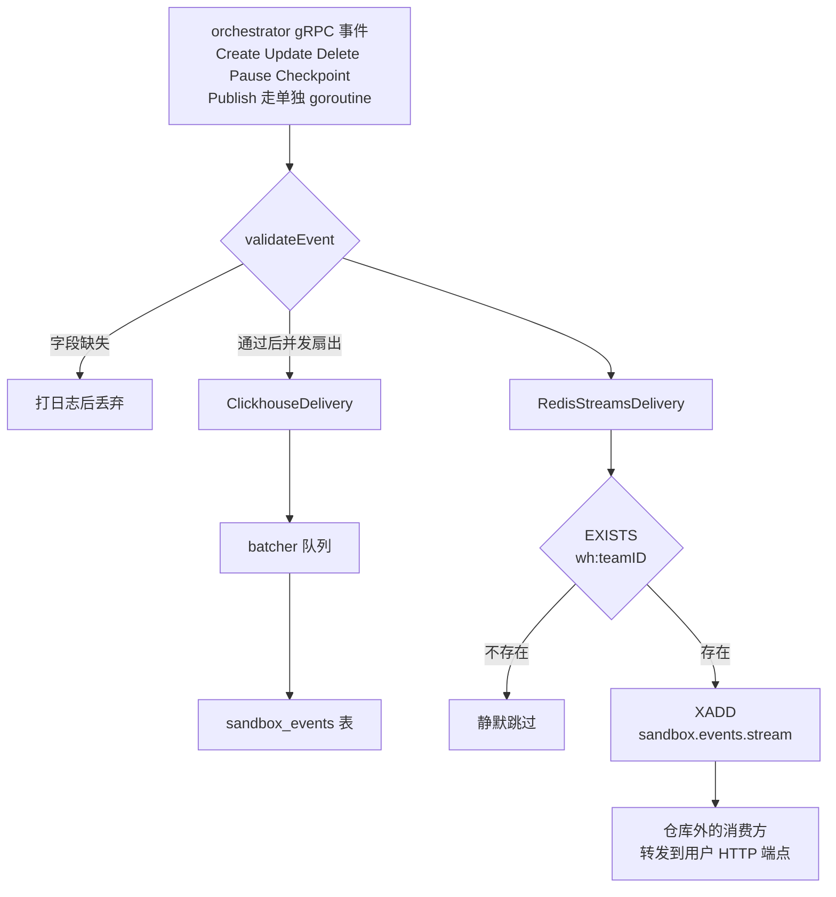

# 61 · 沙箱事件与 webhook

> 沙箱的生老病死要让外面知道：平台自己要算账，用户的程序要被通知。上游 2026.09 用一个很小的
> 事件模块做这件事 —— 一个结构体、一个 `Delivery` 接口、三个实现，加上一条「没人订阅就不投递」的门禁。
> 本篇讲这个模块的边界在哪里，以及为什么最后一段路（真正把 HTTP 请求发给用户）不在这个仓库里。
>
> **读者**：工程师。 **预备**：[第 12 篇 · 端到端走查 §9](12-sandbox-lifecycle-walkthrough.md#9-两种结束)、
> [第 59 篇 · ClickHouse §2](59-clickhouse.md#2-表五张业务表与四种角色)。 **代码**：`packages/shared/pkg/events/`、
> `packages/orchestrator/internal/events/events.go`、`packages/orchestrator/internal/server/sandboxes.go`、
> `packages/clickhouse/pkg/events/`

---

## 0. 本篇要回答的问题

1. 沙箱事件有哪几种类型？一条事件里带什么字段，谁填的？
2. 事件从哪些代码点发出？为什么「沙箱自己死掉」不一定产生事件？
3. 三个投递通道各自的语义是什么？为什么 Redis 那一条要先做一次 `EXISTS`？
4. 投递失败会怎样？跨通道、跨事件的顺序有没有保证？
5. 谁消费这些事件？为什么在这个仓库里找不到发 webhook 的代码？

---

## 1. 问题：三种「想知道」

「沙箱发生了什么」这件事有三类需求，它们对延迟、完整性、可查询性的要求完全不同。

**平台自己要算账。** 一个团队这个月跑了多少沙箱、每台活了多久、占了多少 vCPU 与内存。
这类需求容忍分钟级延迟，但要能按团队、按时间范围聚合查询，数据量大且只写不改。

**用户的程序要被通知。** 用户在自己的服务里挂一个 HTTP 端点，沙箱创建、暂停、被杀时收到一条 JSON。
这类需求要低延迟、要保序（至少同一个沙箱内部要保序），但只有少数团队会开。

**运维要排查。** 某个沙箱为什么在 14:03 消失了。这类需求是查询式的，和第一类共用一份数据即可。

上游 2026.09 的做法是：**一种事件结构，多个投递目标**。事件由 orchestrator 在状态真正变化的那一刻构造，
交给一个 `EventsService`，它把同一条事件扇出到所有配置好的投递目标。
第一类和第三类落到 ClickHouse，第二类落到一条 Redis Stream，由仓库外的消费方转成 webhook。

代价是这个模块对「投递成功」不做任何保证 —— 后面几节会看到，失败只打日志。
收益是它足够薄：orchestrator 的热路径上多出的只是一个 goroutine 和一次 `XADD`。

---

## 2. 事件模型

结构体是 `packages/shared/pkg/events/sandbox.go` 的 `SandboxEvent`，JSON 序列化后就是投递的载荷。
字段分三组。

| 组 | 字段 | 说明 |
|---|---|---|
| 标识 | `id`、`version`、`type`、`timestamp` | `id` 是每条事件新生成的 UUID；`timestamp` 由发送方取 `time.Now().UTC()` |
| 兼容 | `event_category`、`event_label` | 两个字段在代码里都标了 `Deprecated` |
| 主体 | `event_data`、`sandbox_id`、`sandbox_execution_id`、`sandbox_template_id`、`sandbox_build_id`、`sandbox_team_id` | `event_data` 是自由的 `map[string]any` |

事件类型是六个字符串常量，命名用点分层次：

```text
sandbox.lifecycle.created
sandbox.lifecycle.killed
sandbox.lifecycle.paused
sandbox.lifecycle.resumed
sandbox.lifecycle.updated
sandbox.lifecycle.checkpointed
```

这六个是全部 —— 没有构建事件，没有 envd 层面的事件，没有错误事件。
模板构建的进度走的是另一条路（[第 41 篇 §4](41-template-build-overview.md#4-主流程)），
沙箱内部的行为走日志与指标（[第 60 篇 §3](60-telemetry.md#3-日志内部与外部两套)）。

### 2.1 v1 到 v2 的迁移

`version` 字段有 `v1` 与 `v2` 两个取值。v1 用 `event_category` + `event_label` 两段式描述事件
（`lifecycle` + `create`），v2 改用 `type` 的点分命名。
`packages/shared/pkg/events/migration.go` 的 `LegacySandboxEventMigrationMapping()` 做双向补齐：
收到 v1 事件就按 category/label 反推 `type`，收到 v2 事件就按 `type` 反填 category/label，
`version` 为空时默认按 v1 处理，两者都不匹配则返回 `ErrUnknownEventFormat`。

同一张 ClickHouse 表里的历史数据由迁移脚本 `20251017213618_migrate_sandbox_events.sql` 就地改写：
五条 `ALTER TABLE ... UPDATE` 把 `version = 'v1'` 的行按 category/label 映射成新的 `type` 并置为 `v2`。

这里有一个可以看出模块年龄的细节：`SandboxCheckpointedEvent` 在 `migration.go` 里**没有**对应的
`SandboxEventType` 配对项。也就是说 checkpoint 事件只有 v2 形态，
一个只认 category/label 的旧消费方会看到这两个字段为空。
推论：checkpoint 是在 v2 之后才加进来的事件类型，不需要向后兼容。

---

## 3. 事件在哪里产生

发送方只有一个：orchestrator 的 gRPC 服务端。全仓库对 `sbxEventsService.Publish` 的调用一共五处，
都在 `packages/orchestrator/internal/server/sandboxes.go`：

| 调用点 | 事件类型 | 触发条件 |
|---|---|---|
| `Create()` | `created` 或 `resumed` | 按 `req.GetSandbox().GetSnapshot()` 二选一 |
| `Update()` | `updated` | 改超时，`event_data` 里加 `set_timeout` |
| `Delete()` | `killed` | 收到删除请求，在异步 `Stop()` 之后发 |
| `Pause()` | `paused` | 快照写完之后发 |
| `publishSandboxEvent()` | `checkpointed` | 只被 `Checkpoint()` 调用，且在快照上传确认成功之后 |

「创建」与「恢复」共用一个调用点，是因为对 orchestrator 来说两者是同一个动作的两个分支
（[第 27 篇 · ResumeSandbox §7](27-resume-sandbox.md#7-与-createsandbox-的区别)），区别只在有没有快照可拉。

这张表里有一个缺口值得强调：**没有一处在沙箱非预期退出时发事件**。
`setupSandboxLifecycle()` 里那个等待 `sbx.Wait()` 返回、然后清理的 goroutine
（[第 39 篇 §3](39-health-errors-and-teardown.md#3-退出路径矩阵)）不发任何事件。
沙箱因为 guest 崩溃或 Firecracker 进程死掉而消失时，`killed` 事件要等 api 发现状态不对、
经由 `RemoveSandbox()` 打过来一次 `Delete` 才会产生。
推论：因此 `killed` 事件表达的是「有人要求删除」，不是「沙箱不在了」；
用它来做「沙箱结束时间」的账，会漏掉崩溃的那一批。

### 3.1 载荷是怎么攒出来的

`prepareSandboxEventData()` 返回三样东西：团队 ID、build ID、以及一个初始的 `event_data`。
它从 `sbx.APIStoredConfig` 里取 build ID，并把沙箱的用户元数据浅拷贝一份放进 `event_data["sandbox_metadata"]`
—— 注释写明了拷贝是为了避免与仍在运行的沙箱共享 map 造成竞态。

这里有一条静默失败路径：`sbx.Runtime.TeamID` 解析失败时，函数只打一条日志，
返回的 `teamID` 是零值 `uuid.Nil`。事件照常构造，随后被 `validateEvent()` 拒掉（见 §5）。

### 3.2 执行指标：`executionEventDataKey`

`Delete()` 与 `Pause()` 这两处 —— 也只有这两处 —— 会在 `event_data` 里额外塞一段执行指标，
键名是常量 `executionEventDataKey`，值为 `"execution"`，注释直接写明用途是 webhook：

```go
if s.featureFlags.BoolFlag(ctx, featureflags.ExecutionMetricsOnWebhooksFlag) {
    eventData[executionEventDataKey] = s.getSandboxExecutionData(sbx)
}
```

`getSandboxExecutionData()` 返回四个字段：`started_at`（RFC3339）、`vcpu_count`、`memory_mb`、
`execution_time`（从启动到现在的毫秒数）。

它挂在特性开关 `execution-metrics-on-webhooks` 上，默认值是 `false`
（`packages/shared/pkg/feature-flags/flags.go`，[第 14 篇 §2](14-config-flags-versions.md#2-特性开关)）。
选在这两个事件上是合理的：`killed` 与 `paused` 是沙箱这一次执行的终点，此刻 `execution_time` 才有意义。
代价是同一类事件的载荷形状随开关变化，消费方不能假定这个键一定存在。

---

## 4. 投递：一个接口，三个实现

`packages/shared/pkg/events/delivery.go` 定义的接口只有两个方法：

```go
type Delivery[Payload any] interface {
    Publish(ctx context.Context, deliveryKey string, payload Payload) error
    Close(ctx context.Context) error
}
```

注意 `deliveryKey` 不是消息的 key，而是**一个用来判断该不该投递的键**，见 §5。

三个实现：

| 实现 | 文件 | 落到哪里 | 用不用 `deliveryKey` |
|---|---|---|---|
| `RedisStreamsDelivery` | `delivery_redis_streams.go` | `XADD` 到 `sandbox.events.stream` | 用 |
| `RedisPubSubDelivery` | `delivery_redis_pubsub.go` | `PUBLISH` 到 `sandbox-events` 频道 | 用 |
| `ClickhouseDelivery` | `packages/clickhouse/pkg/events/delivery.go` | 批量 `INSERT INTO sandbox_events` | 忽略 |
| `NoopDelivery` | `delivery_noop.go` | 丢弃 | 忽略 |

`RedisPubSubDelivery` 在上游 2026.09 里**没有任何调用方** —— 全仓库对
`NewRedisPubSubDelivery` 的引用只有它自己的定义。它是 Stream 版本的前身，留在代码里但没接线。
两者的语义差别不小：pub/sub 是即发即弃，订阅方掉线期间的消息直接丢失；
Stream 会把条目留在 Redis 里，消费方可以从上次的 ID 续读。

装配在 `packages/orchestrator/main.go`：目标列表 `sbxEventsDeliveryTargets` 从空切片开始，
配了 `ClickhouseConnectionString` 就追加 ClickHouse 目标，Redis 客户端建起来了就追加 Stream 目标，
最后 `events.NewEventsService(sbxEventsDeliveryTargets)` 交给 gRPC 服务端。
两个都没配就是一个空列表 —— `Publish()` 遍历零个目标，等价于 `NoopDelivery`，不会报错。
这也是[第 13 篇 §5](13-storage-landscape.md#5-元数据与运行态)里那条观察的来源：orchestrator 对 Redis 只写这一条流，
沙箱运行态与路由目录的键都是 api 与 client-proxy 在写。



---

## 5. 按需投递与校验

两道门夹着扇出。

**第一道在扇出之前**，是 `packages/orchestrator/internal/events/events.go` 的 `validateEvent()`：
`version`、`type`、`sandbox_id`、`sandbox_team_id`、`timestamp` 五个字段任一为空
（团队 ID 为 `uuid.Nil` 也算空），整条事件被打一条 error 日志后丢弃，一个目标都不会收到。
这道校验是全局的，ClickHouse 那一路也会跟着丢。

**第二道在每个 Redis 目标内部**，是 `shouldPublish()`：

```go
func (r *RedisStreamsDelivery[Payload]) shouldPublish(ctx context.Context, key string) (bool, error) {
    exists, err := r.redisClient.Exists(ctx, key).Result()
    ...
    return exists > 0, nil
}
```

`key` 就是 `EventsService.Publish()` 算出来的 `events.DeliveryKey(teamID)`，
格式是 `wh:<team-uuid>`（前缀常量 `DeliveryKeyPrefix = "wh"`，`wh` 即 webhook）。
键不存在就直接返回，连序列化都不做。

这是一条**按需投递**的门禁：只有配置了 webhook 的团队，其事件才会进 Redis Stream。
这样做的收益很直接 —— 绝大多数团队不开 webhook，省掉的是每台沙箱四五次 `XADD` 与流的无限增长。
代价有两个。其一，每条事件多一次 Redis 往返，且这次往返在 `EXISTS` 失败时会让整条投递返回错误
（错误信息是 `could not determine if redis stream is published`），即 Redis 抖动会表现为事件丢失而不是延迟投递。
其二，**这个键的写方不在 infra 仓库里**：全仓库对 `DeliveryKey` 的引用只有定义处与 `EventsService.Publish()`，
没有任何地方写入 `wh:` 开头的键。

门禁之后的 `XAdd` 还有两个由参数决定的性质。其一，`redis.XAddArgs` 里既没有 `MaxLen` 也没有 `MinID`，
仓库里也没有任何 `XTRIM`：**这条流只增不减**，裁剪完全依赖仓库外的消费方或 Redis 自身的内存策略。
某个团队的 `wh:` 键存在而消费方停了，流就会一直涨下去。
其二，全平台只有一条流（`SandboxEventsStreamName = "sandbox.events.stream"`），不按团队分流，
每个条目只有一个字段 `payload`，值是整条事件的 JSON。消费方因此要读到所有团队的事件、
再自己按 `sandbox_team_id` 过滤。收益是生产侧不必管理成千上万条流的生命周期，
代价是租户隔离被推给了消费方，任何能读这条流的进程都能看到全部团队的沙箱元数据。

---

## 6. 谁在消费

三个通道的消费侧，在上游 2026.09 的仓库里能看到的深浅不一。

**ClickHouse** 是最完整的一路。表 `sandbox_events_local` 由
`20250725223340_add_sandbox_events_local.sql` 建出，MergeTree 引擎，
`PARTITION BY toDate(timestamp)`、`ORDER BY (sandbox_id, timestamp)`、`TTL 7 DAY`；
同名不带后缀的是按 `xxHash64(sandbox_id)` 分片的 Distributed 表。
写入走 `packages/clickhouse/pkg/batcher` 的通用批处理器，参数来自三个特性开关，
默认 100 条一批、最多攒 1000 ms、队列 1000 条。
七天 TTL 说明它的定位是排查与近期聚合，不是长期账本。
不过读侧在仓库里是空的：`sandbox_events` 这个表名只出现在写入语句与迁移文件里，
`packages/api` 没有任何查询它的代码。推论：查询由 Grafana 或 e2b 的控制台直接连 ClickHouse 完成。

**Redis Stream** 这一路，仓库里没有任何 `XREAD` / `XGROUP` / `XACK`，也没有对流做 `XTRIM` 的地方。
连同上一节的结论（没人写 `wh:` 键），可以确定：**webhook 的注册与投递整体不在 infra 仓库内**。
推论：它属于 e2b 的控制面服务，和[第 56 篇 §1](56-edge-api.md#1-一个刻意留下的缺口)讲的 edge API 服务端是同一类情况 ——
基础设施仓库只负责把事件放到约定的位置，商业控制面负责取走。
这个边界对自建部署的影响是明确的：把这套基础设施部署起来，沙箱事件会写进 ClickHouse，
但没有任何团队的 `wh:` 键存在，Redis Stream 上一条事件也不会有。

**不要把沙箱事件与 analytics collector 混起来。** 后者是 api 侧另一条独立的路
（`packages/api/internal/orchestrator/analytics.go` 的 `analyticsInsert()` / `analyticsRemove()`，
以及 PostHog 客户端），走 gRPC 打给一个外部收集器，事件名是 `closed_instance` 这样的产品分析口径，
和本篇讲的 `sandbox.lifecycle.*` 没有共享代码。它属于[第 24 篇 §7](24-api-metrics-and-analytics.md#7-分析事件)。

---

## 7. 失败处理与顺序

**发布是异步的，但不是即发即忘的。** 五个调用点都写成 `go s.sbxEventsService.Publish(...)`，
并且传的是 `context.WithoutCancel(ctx)` —— gRPC 请求返回后 context 被取消，投递不受影响。
而 `Publish()` 内部是同步的：`sync.WaitGroup` 等所有目标都返回才结束。
所以这个 goroutine 的存活时间取决于最慢的目标，orchestrator 的请求延迟不受影响。

**失败只打日志。** 任何目标返回错误，`Publish()` 记一条 error 日志就算完，
没有重试、没有死信、没有降级到本地磁盘。ClickHouse 队列满时 `batcher.Push()` 返回 `false`，
`ClickhouseDelivery.Publish()` 把它翻译成 `ErrBatcherQueueFull` 向上返回，结果也只是一条日志。
批处理器自身的插入失败走 `ErrorHandler`，同样只记日志。这是一个明确的取舍：
事件通道不能反压沙箱生命周期，代价是事件是尽力而为的，不能作为对账的唯一凭据。

**顺序几乎没有保证。** 三层都会打乱顺序：

其一，每次发布各起一个 goroutine，Go 不保证它们的启动次序。同一个沙箱先 `updated` 后 `killed`，
两个 `XADD` 谁先到 Redis 是竞争出来的。

其二，跨通道不同步。同一条事件在 ClickHouse 里可能晚一秒才可见（批处理器的 `MaxDelay`），
在 Redis Stream 上则是立刻可见。

其三，跨节点没有全局时钟。事件的 `timestamp` 由发送节点自己取，
一台沙箱在 pause / resume 之后可能落到另一个节点上（[第 37 篇 §7](37-pause-and-snapshot.md#7-上传与失败状态)），
两条事件的时间戳来自两台机器的时钟。

消费方要排序，只能自己按 `timestamp` 排，并接受毫秒级的乱序。
`sandbox_execution_id` 在这里很有用：它在一次执行内稳定，checkpoint 也刻意保持不变
（`Checkpoint()` 的注释写明保留同一个 `ExecutionID`，只换 `LifecycleID`），
可以用它把属于同一次执行的事件归堆。

推论：以上这些性质合起来说明，这套事件适合做通知与近似统计，不适合做严格的计费输入。
计费用的是 analytics collector 那一路。

---

## 8. 小结

- 沙箱事件只有六种类型，全部是 `sandbox.lifecycle.*`，全部由 orchestrator 的 gRPC 服务端发出，
  调用点共五处（`Create`、`Update`、`Delete`、`Pause`、`Checkpoint`）。
- 事件结构有 v1 / v2 两代，`migration.go` 做双向补齐；`checkpointed` 没有 v1 形态。
- 沙箱非预期退出不产生事件；`killed` 表达的是「收到删除请求」。
- `Delivery` 接口有四个实现，实际接线的是 ClickHouse 与 Redis Stream 两个；
  pub/sub 版本留在代码里但无人调用。
- Redis 那一路有 `EXISTS wh:<team-id>` 的按需门禁，没订阅就不写；这个键的写方不在 infra 仓库内。
- ClickHouse 表 `sandbox_events` 是 MergeTree + Distributed，TTL 七天，经 batcher 批量写入；
  仓库内没有读侧代码。
- 校验在扇出前统一做，五个必填字段缺一即整条丢弃，包括团队 ID 解析失败的情况。
- 投递失败只打日志，无重试无死信；顺序在 goroutine 层、通道层、节点时钟层都不保证。
- 事件通道与 api 侧的 analytics collector 是两套独立机制，不共享代码也不互为备份。

## 延伸阅读 / 下一篇

- [第 59 篇 · ClickHouse §4](59-clickhouse.md#4-批处理器)：batcher 的参数、表的组织方式与其它几张表。
- [第 60 篇 · 遥测 §3](60-telemetry.md#3-日志内部与外部两套)：日志与指标这两条与事件平行的观测通道。
- [第 13 篇 · 存储全景 §5](13-storage-landscape.md#5-元数据与运行态)：Redis 三套键空间的全貌，以及各自的写方与读方。
- [第 24 篇 · API 的指标、日志与分析事件 §7](24-api-metrics-and-analytics.md#7-分析事件)：analytics collector 与 PostHog 那一路。
- [第 62 篇 · 测试体系](62-testing.md)：下一篇。`migration_test.go` 是本模块唯一的测试。
