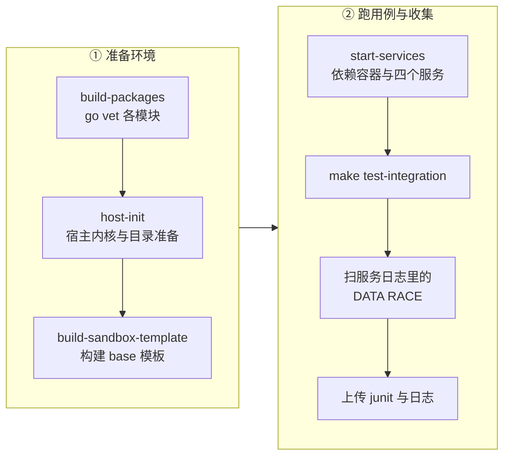
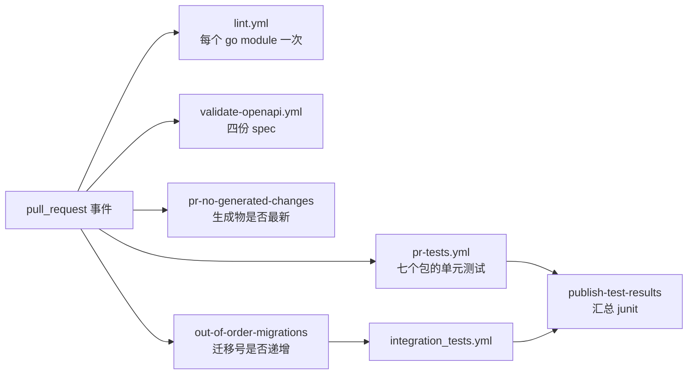

# 62 · 测试体系

> 一个要 root、要 `/dev/kvm`、要 NBD 设备、要大页、还要 Postgres 与对象存储的系统，
> 测试不可能只靠 `go test`。上游 2026.09 把它分成了四层：单元测试、集成测试、线上巡检与基准测试，
> 每一层能测什么、要付出什么环境代价，是本篇要讲清楚的事。
>
> **读者**：工程师、运维。　**预备**：[第 10 篇 · 系统架构 §2](10-system-architecture.md#2-进程清单)、
> [第 25 篇 · orchestrator 进程 §3](25-orchestrator-process.md#3-启动顺序)。
> **代码**：`tests/`、`.github/workflows/`、`.github/actions/`、`.mockery.yaml`、
> `packages/db/pkg/testutils/`、`packages/orchestrator/benchmark_test.go`、根 `Makefile`

---

## 0. 本篇要回答的问题

1. 一个依赖内核接口与真 microVM 的系统，单元测试还能测到什么？测不到的部分谁来兜底？
2. 哪些包的测试密、哪些几乎没有？这个分布说明了什么？
3. mocks 是怎么生成与维护的？为什么整个仓库只有七个测试文件用到它们？
4. 集成测试需要一整套什么环境？CI 是怎么在一台机器上把这套环境搭起来的？
5. periodic-test 与集成测试的分工是什么？它跑在哪里、失败了谁会知道？
6. `benchmark_test.go` 测的是哪一段时间？怎么跑？
7. 这套体系有哪些明确的空白？

---

## 1. 问题：这个系统难测在哪

先看被测对象的依赖面。orchestrator 在一次沙箱恢复里要用到：userfaultfd（注册内存、处理缺页）、
HugeTLB 挂载点、NBD 内核模块与设备号、netns 与 tap 设备、cgroup v2 层级、`/dev/kvm`，
以及一个真实存在的 Firecracker 二进制与 guest 内核。api 要用到 Postgres、ClickHouse、Redis、
LaunchDarkly 的特性开关服务与对象存储。envd 跑在 guest 里，它的文件系统服务要测挂载与权限。

这些依赖分三类，各自的可测性完全不同：

- **纯逻辑**：映射表合并、分页参数解析、放置算法打分、错误分类。进程内可测，快，无外部依赖。
- **内核接口**：userfaultfd、cgroup、NBD、FUSE 挂载。可以在 CI 机器上测，但要 root，
  要预先加载模块、开 sysctl，而且测试会改动宿主状态。
- **完整系统**：从 HTTP 请求到沙箱里跑出一行输出。必须把 api、orchestrator、client-proxy、
  数据库、缓存、一个已构建的模板全部拉起来。

上游 2026.09 对应这三类给了四层测试。层次与覆盖对象如下表，后面几节逐层展开。

| 层次 | 位置 | 需要的环境 | 覆盖对象 | 触发方式 |
|---|---|---|---|---|
| 单元测试 | 各 package 的 `*_test.go` | Go 工具链；部分需要 root 与 Docker | 纯逻辑；uffd / cgroup / NBD 的内核交互；SQL 查询 | PR 与 push main（`pr-tests.yml`） |
| 集成测试 | `tests/integration/` | 全套服务 + Postgres + ClickHouse + Redis + 一个已构建模板 | api / orchestrator / envd / 代理的对外行为 | PR 与 push main（`integration_tests.yml`） |
| 线上巡检 | `tests/periodic-test/` | 一个真实运行的集群与真 API key | 端到端可用性：起沙箱、跑代码、暂停恢复、出网、时间同步 | 每 10 分钟定时（`periodic-test.yml`） |
| 基准测试 | `packages/orchestrator/benchmark_test.go` 等 | root、NBD、大页、KVM | 沙箱恢复耗时；放置算法、块层的微基准 | 手工 |

四层之外还有两类检查跟测试同属一条流水线：`golangci-lint`（`.golangci.yml` 用
`default: all` 打开全部 linter 再逐个关掉不要的，因此 `paralleltest`、`thelper`、`testifylint`
这些与测试写法有关的规则默认生效）和「生成物是否最新」的校验（第 5 节）。

---

## 2. 单元测试的组织

### 2.1 分布

先看规模。下表按包统计测试函数数与代码行数；「非测试行」含 sqlc、oapi-codegen、protoc 生成的代码，
所以比值只能横向比较，不能当作覆盖率读。

| 包 | 测试函数 | 测试代码行 | 非测试代码行 | 测试密集的子包 |
|---|---|---|---|---|
| `packages/shared` | 176 | 8204 | 44044 | `pkg/storage`、`pkg/utils`、`pkg/keys`、`pkg/cache` |
| `packages/api` | 155 | 7647 | 31707 | `internal/orchestrator/placement`、`internal/sandbox/*` |
| `packages/orchestrator` | 154 | 11111 | 35407 | `internal/sandbox/block`、`internal/sandbox/uffd`、`internal/nfsproxy` |
| `packages/envd` | 70 | 4200 | 15182 | `internal/api`、`internal/services/filesystem` |
| `packages/db` | 66 | 2177 | 5243 | `pkg/tests/*`（按查询分目录） |
| `packages/client-proxy` | 13 | 210 | 635 | `internal/proxy` |
| `packages/clickhouse` | 10 | 340 | 1122 | `pkg/batcher` |
| `packages/auth`、`docker-reverse-proxy`、`local-dev` | 各 1 | < 200 | — | — |
| `packages/dashboard-api`、`nomad-nodepool-apm` | 0 | 0 | 474 / 179 | — |

密的地方有共同特征：**输入输出都是纯数据，且错一位就静默损坏**。
`internal/sandbox/block` 的 `range_test.go`、`tracker_test.go`、`streaming_chunk_test.go`
测的是块区间与分片读；`shared/pkg/storage/header/mapping_test.go` 测映射表合并
（[第 29 篇 · 模板产物格式 §5](29-template-artifact-format.md#5-diff-链是怎么长出来的) 讲的那套结构）；
`internal/orchestrator/placement` 有五个测试文件，其中两个是基准测试，因为放置算法的行为只有在
大量节点上才看得出差别（[第 19 篇 · 节点管理与放置 §3](19-node-management-and-placement.md#3-放置算法采样过滤打分)）。

稀的地方同样有规律。在 `packages/orchestrator/internal` 下，**四十多个目录一个测试文件都没有**，
其中包括几个核心：

- `internal/sandbox`（12 个文件，沙箱对象与 `Factory.ResumeSandbox()` 本身）
- `internal/sandbox/network`（10 个文件，网络槽位与池）
- `internal/sandbox/template`（9 个文件，模板缓存）
- `internal/sandbox/rootfs`、`internal/sandbox/uffd`（handler 主体）、`internal/proxy`
- `internal/template/build/phases/*`（构建阶段）

这些正是「必须有真 microVM 才能验证」的部分。它们不是没被测到，而是**被上移了一层**：
由集成测试、`cmd/smoketest` 与 benchmark 覆盖。代价是反馈慢、定位难 ——
集成测试报 `sandbox create failed`，落到哪一行要靠日志与 trace 反推。

### 2.2 需要 root 与内核能力的单元测试

有一批测试写在 `_test.go` 里，但实际是「包内 e2e」。它们统一用运行时判断跳过，而不是 build tag：

- `internal/sandbox/cgroup/manager_test.go`：九处 `t.Skip("test requires root privileges")`。
- `internal/nfsproxy/e2e_test.go`：非 root 跳过；用 testcontainers 起容器做对端
  （[第 40 篇 · volumes 与 nfsproxy §3](40-volumes-and-nfsproxy.md#3-为什么代理而不是直连)）。
- `internal/sandbox/uffd/userfaultfd/`：六个测试文件，`async_wp_test.go` 直接验证
  `UFFD_FEATURE_WP_ASYNC` 的语义 —— 读缺页填页后 pagemap 的 bit 57 该置位，写过之后该清零，
  这正是 [第 37 篇 · Pause §3](37-pause-and-snapshot.md#3-脏页判据) 里脏页判据的地基。
  这些测试**没有**对内核特性做能力探测后跳过：内核不支持就是失败。
- `cmd/smoketest/smoke_test.go`：非 root 或没有 `/dev/kvm` 就跳过，跑通则遍历
  `featureflags.FirecrackerVersionMap` 逐个版本建模板再恢复
  （见 [第 47 篇 §9](47-orchestrator-dev-tools.md#9-smoketest建一次跑一次)）。
- `packages/envd/internal/services/cgroups/cgroup2_test.go` 与 `internal/api/upload_test.go`
  的部分用例同样要 root。

这种「运行时跳过」的写法有一个后果：**在开发者机器上安静地少跑一批测试，而 CI 里跑**。
没有任何机制统计跳过了多少。

### 2.3 写法约定

表驱动 + `t.Parallel()` 是默认写法，因为 `paralleltest` linter 是打开的；
少数不能并行的用例显式写 `//nolint:paralleltest` 说明原因（`smoke_test.go` 里的
「subtests share infra and must run sequentially」）。断言库统一 testify：
`require` 用于失败即终止，`assert` 用于继续检查。`testpackage` linter 被关掉了，
所以测试与被测代码通常在同一个包内，可以直接测未导出函数（`buildAutoResumeConfig`、`isSecurityInvoker`）。

---

## 3. 依赖注入与 mocks

### 3.1 接口定义在消费者侧

上游几乎不在被依赖的包里导出「为测试而生」的接口，而是在**使用者一侧**定义一个尽可能小的接口。
两个例子：

```go
// packages/api/internal/handlers/sandbox_create.go
type featureFlagsClient interface {
	BoolFlag(ctx context.Context, flagName featureflags.BoolFlag, contexts ...ldcontext.Context) bool
}

// packages/shared/pkg/utils/move.go
type fileOps interface {
	Link(oldPath, newPath string) error
	Remove(path string) error
}
```

接口是未导出的，只覆盖调用方真正用到的方法。真实实现（`featureflags.Client`、`os` 包函数）
天然满足它，测试则传入生成的 mock。这样做的收益是接口小、mock 生成物小；
代价是同一个概念在多处重复定义 —— `featureFlagsClient` 在 `handlers` 与 `storage` 里各有一份，
签名还不一样（前者只要 `BoolFlag`，后者还要 `IntFlag`）。

### 3.2 mockery 与 `make generate-mocks`

生成器是 mockery v3，配置集中在仓库根的 `.mockery.yaml`，按 Go 包组织，
逐个接口指定输出目录、文件名、包名。当前一共八组，产出四个 `mocks/` 子包：

| 源接口 | 生成到 | 用途 |
|---|---|---|
| `storage.Blob`、`storage.Seekable`、`storage.featureFlagsClient`、`io.Reader` | `packages/shared/pkg/storage/mocks` | 测分片缓存的读路径 |
| `handlers.featureFlagsClient` | `packages/api/internal/handlers/mocks` | 测创建沙箱时的开关分支 |
| `go-nfs.Handler`、`go-billy` 的三个接口 | `packages/orchestrator/internal/nfsproxy/mocks` | 测 NFS 代理的转发与恢复 |
| `filesystemconnect.FilesystemHandler` | `packages/envd/.../filesystemconnect/mocks` | 测 envd 的 legacy 转换层 |
| `utils.fileOps` | `packages/shared/pkg/utils/mocks_test.go` | 测 `move` 的回退路径 |

生成命令是根 `Makefile` 的 `generate-mocks`，直接 `go run github.com/vektra/mockery/v3@v3.5.0`
（版本钉在命令行里，不进 `go.mod`）。它是 `make generate` 的一部分，而 `make generate` 在 CI 里
被跑一遍再检查 `git status --porcelain` 是否干净（第 5.3 节），所以**生成物必须提交**，
且不能手改。

### 3.3 mocks 用得很少

值得注意的事实：全仓库只有七个测试文件引用了 `mocks` 包 ——
`shared/pkg/utils/move_test.go`、`shared/pkg/storage/storage_cache_{blob,seekable}_test.go`、
`envd/internal/services/legacy/{conversion,interceptor}_test.go`、
`orchestrator/internal/nfsproxy/recovery/recovery_test.go`、
`api/internal/handlers/sandbox_create_test.go`。

主流做法是另外两种：

**起真的依赖。** `packages/db/pkg/testutils/db.go` 的 `SetupDatabase()` 用 testcontainers
拉一个 `postgres:16-alpine`，等日志里出现两次「ready to accept connections」，
然后用 goose 跑完全部迁移，返回 sqlc 客户端与一组测试专用查询；`t.Cleanup` 负责销毁容器。
`packages/shared/pkg/redis/tests.go` 的 `SetupInstance()` 同理起 `redis:8-alpine`。
`testutils/queries.go` 提供 `CreateTestTeam()`、`CreateTestTemplate()` 等以裸 SQL 插入的夹具，
绕开业务层直接造数据。这条路径的收益是**测到的是真 SQL 与真 RESP 语义**，
包括行级安全策略（`pkg/tests/db_test.go` 的 `TestRequireRowLevelSecurity` 遍历 `public` 下
所有表与视图，断言 RLS 或 `security_invoker` 已开）；代价是每个测试都要 Docker，慢，
且 `testing.Short()` 下会整体跳过。

**手写 fake。** 例如 `clickhouse/pkg/batcher/batcher_test.go` 直接传一个闭包当 flush 函数，
比生成 mock 更直接。

还有一个遗留物：`packages/api/internal/clusters/mocks/mocks.go` 带着 mockery 的生成头，
但既不在 `.mockery.yaml` 里，也没有任何文件导入它。推论：它是配置调整后留下的孤儿，
下一次 `make generate-mocks` 不会更新它，也不会删除它。

---

## 4. 集成测试

### 4.1 组织

`tests/integration` 是一个独立的 Go module（在 `go.work` 里与各 package 并列）。它不 import
被测服务的内部包，而是像外部客户端一样调它们：

- `internal/api/generated.go` 由 `oapi-codegen` 从 `spec/openapi.yml` 生成，只生成 client 与 models；
- `internal/envd/generated.go` 同样从 `packages/envd/spec/envd.yaml` 生成；
- gRPC 客户端直接用 `packages/shared/pkg/grpc/` 里的生成代码。

`internal/setup` 提供三个客户端构造器与一组请求装饰器：`GetAPIClient()` + `WithAPIKey()` /
`WithAccessToken()`、`GetOrchestratorClient()`（明文 gRPC，因为生产上 orchestrator 在 api 之后，
不做认证）、`GetEnvdClient()`（HTTP 与 Connect-RPC 两套，配合 `SetSandboxHeader()` 指定目标沙箱）。
所有环境变量通过 `utils.RequiredEnv()` 读取，缺一个就 panic，测试进程直接失败 ——
这是刻意的：宁可启动即失败，也不要在半套环境上跑出误导性的结果。

`internal/utils` 是夹具层：`SandboxConfig` 用函数选项模式（`WithTimeout`、`WithAutoPause`、
`WithSecure` …）构造请求，`TeardownSandbox()` 注册到 `t.Cleanup`。

测试用例按被测面分目录，共 201 个测试函数：

| 目录 | 测试函数 | 测什么 |
|---|---|---|
| `internal/tests/api/` | 152 | 沙箱的创建 / 列表 / 详情 / 超时 / kill / pause / resume / 自动暂停 / 出网 / 安全沙箱、API key、access token、Supabase 认证 |
| `internal/tests/envd/` | 29 | 文件系统、进程、watcher、签名、认证、hyperloop、本地端口绑定 |
| `internal/tests/proxies/` | 14 | 域名解析、访问令牌、访问已暂停沙箱触发恢复、端口未监听、沙箱不存在 |
| `internal/tests/orchestrator/` | 4 | 直连 gRPC：沙箱对象、熵源、内存完整性 |
| `internal/tests/team_test.go` | 2 | 封禁与冻结团队 |

`internal/main_test.go` 里的 `TestCacheTemplate` 不是断言用例，而是**预热**：
先起一个沙箱把 base 模板的分片拉进本地缓存，后续用例才不至于每个都付一次冷启动
（[第 34 篇 · 模板缓存 §4](34-template-cache-and-local-storage.md#4-缓存查找顺序一次块读查几张表)）。

### 4.2 怎么跑

`make test-integration` 转到 `tests/integration` 的 `test` 目标：先导出十来个 `TESTS_*`
环境变量，跑一遍 `go test ./internal/main_test.go` 预热，再用 `gotestsum` 跑目标目录：

```bash
go tool gotestsum --rerun-fails=1 --packages="./internal/tests/..." \
  --format standard-verbose --junitfile=test-results.xml -- -count=1 -parallel=4
```

三个参数值得注意：`--rerun-fails=1` 表示失败的用例自动重跑一次 —— 这是对不稳定用例的
容忍，也意味着偶发失败会被吞掉；`-count=1` 禁用测试缓存；`-parallel=4` 限制并行度，
因为每个用例都会真的起一台沙箱。`test/%` 这个模式规则允许只跑一个文件甚至一个函数
（`make test/api/sandboxes/sandbox_pause_test.go:TestPause`）。

### 4.3 需要的环境

对着 `.github/actions/` 下的四个 composite action 读，一次集成测试要求的环境是这样的：



- **host-init**（`init-client.sh`，168 行）：建 `/orchestrator/{sandbox,template,build}`；
  加 1 GiB swap；把 `/mnt/snapshot-cache` 挂成 65 GiB tmpfs；调 `somaxconn`、`max_map_count`；
  给 NBD 设备加 `OPTIONS:="nowatch"` 的 udev 规则再 `modprobe nbd nbds_max=4096`；
  把 envd 二进制放到 `/fc-envd`，从 GCS 公共桶下内核到 `/fc-kernels`、下 Firecracker 到 `/fc-versions`；
  最后按总内存算大页数量，20% 写 `nr_hugepages`、80% 写 `nr_overcommit_hugepages`
  （[第 32 篇 · 预取与大页 §5](32-memory-prefetch-and-hugepages.md#5-大页改变了哪些量)）。
- **build-sandbox-template**：用固定的 `TEMPLATE_ID` 与新生成的 `BUILD_ID`，
  以 `STORAGE_PROVIDER=Local`、`ARTIFACTS_REGISTRY_PROVIDER=Local` 跑
  `make -C packages/orchestrator build-template`，即 [第 47 篇 §3](47-orchestrator-dev-tools.md#3-create-build造一个-build)
  讲的 `create-build`。
- **start-services**：起 Postgres 容器并装 `pgcrypto`、跑 `make migrate`、跑
  `make -C tests/integration seed`（`seed.go` 造出团队、用户、API key、access token 与
  一个指向刚构建产物的模板记录）；起 ClickHouse 容器并用预先构建的 migrator 镜像迁移；
  起 Redis；然后用 `scripts/start-service.sh` 依次拉起 otel-collector、orchestrator
  （`ORCHESTRATOR_SERVICES=orchestrator,template-manager`）、api、client-proxy，
  每个都轮询健康端点，默认 30 秒超时。

四个服务都由各自 Makefile 的 `build-debug` 编出来，而 `build-debug` 带 `-race`。
所以集成测试跑的是竞态检测版本，测试跑完 CI 再 `grep "WARNING: DATA RACE"` 扫一遍
`~/logs/*.log`，发现就让这一步失败。这是一个便宜且有效的做法：
**用集成测试的真实并发去喂 race detector**，比单独写并发单元测试覆盖面大得多。

---

## 5. CI 流水线

### 5.1 组合方式

`.github/workflows/pull-request.yml` 与 `push-main.yml` 是两个入口，
其余大多是 `on: workflow_call` 的被调用单元。



`push-main.yml` 的内容基本相同，差别是不自动提交生成物、并且总是发布测试结果。

### 5.2 单元测试作业

`pr-tests.yml` 是一个七行矩阵，跑在自建 runner `infra-tests` 上：

| 包 | 测试路径 | 需要 sudo | 额外准备 |
|---|---|---|---|
| `packages/api`、`client-proxy`、`db`、`docker-reverse-proxy` | `./...` | 否 | 无 |
| `packages/envd` | `./...` | 是 | 装 `bindfs`（FUSE 挂载测试） |
| `packages/orchestrator` | `./...` | 是 | `unprivileged_userfaultfd=1`、挂 hugetlbfs 并分配 2000 页、`modprobe nbd nbds_max=256`、NBD 的 udev `nowatch` 规则 |
| `packages/shared` | `./pkg/...` | 否 | 无 |

需要 sudo 的两个包用 ``sudo -E `which go` test -v ./...`` 跑，`-E` 是为了让 root 用同一个构建缓存。
矩阵 `fail-fast: false`，一个包挂掉不影响其它包。

两处与本地 `make test` 不一致，值得知道：CI 里跑的是裸 `go test -v`，**没有 `-race`**，
而 `packages/orchestrator/Makefile` 的 `test` 目标是 `go test -race -v ./...`；
另外这一步不产出 junit 文件，因此最后的 `publish-test-results` 实际只汇总了集成测试的结果。

顺带说两个 Makefile 事实：根 `Makefile` 的 `test` 目标遍历 `go.work` 中路径含 `packages` 的模块
逐个 `make -C {} test`，但 `packages/auth` 没有 Makefile，`packages/clickhouse` 与
`packages/local-dev` 没有 `test` 目标，所以这个目标在完整仓库上跑不通；
`packages/db` 的 `test` 目标写的是 `go test ./tests/...`，而测试实际在 `pkg/tests/` 下。
CI 不依赖这两处，用的是自己的矩阵与路径。

### 5.3 非测试但同样拦住合并的检查

- `pr-no-generated-changes.yml`：跑 `make tidy`（依赖完整性）、`scripts/fix-tracers.sh`、
  `make generate`（含 protobuf、sqlc、oapi-codegen、mocks）、`make fmt`，
  然后要求工作树干净。同仓库 PR 会由 bot 自动提交修正并让本次运行失败，fork PR 直接失败。
- `out-of-order-migrations.yml`：新增的 `packages/db/migrations/` 文件时间戳必须大于 main 上的最大值
  （[第 58 篇 · Postgres 模式与迁移 §5](58-postgres-schema-and-migrations.md#5-迁移goosemigrator-容器与在线安全)）。
- `validate-openapi.yml`：用 redocly 校验四份 spec。
- `pr-tests.yml` 里还有一个 `validate-iac` 作业跑 `terraform init -backend=false && terraform validate`
  —— IaC 的全部自动检查就是这一句（[第 63 篇 · GCP 上的部署 §1](63-gcp-terraform.md#1-一次部署要产生什么)）。

仓库里还有两个 `on: workflow_call` 却没有任何调用方的 workflow：`fc-test.yml`
（在 ubuntu runner 上装 Firecracker 1.10.1、配大页）与 `heath-check.yml`
（跑 `tests/test_e2b.sh`，文件开头就写着「TODO: Delete this workflow」）。
`tests/` 目录下的 `test.js`、`test_e2b.sh`、`e2b.Dockerfile` 属于同一批遗留物：
`test_e2b.sh` 里建模板与删模板的步骤全被注释掉了，只剩「起一个沙箱写读一个文件」和
「`e2b sandbox list` 里能看到它」两步。

---

## 6. periodic-test：对着生产环境的巡检

`tests/periodic-test/` 是四个 TypeScript 脚本，用 bun 跑，依赖公开的
`@e2b/code-interpreter` SDK 与 `@e2b/cli`：

| 脚本 | 做什么 | 判据 |
|---|---|---|
| `run-code.ts` | 起沙箱，连跑两次 `runCode` | 第二次能拿到结果 |
| `snapshot-and-resume.ts` | 跑 `x = 1`，`betaPause()`，`Sandbox.connect()` 恢复，再跑 `x += 1; x` | 输出必须是 `2`，即内存状态确实被保住了 |
| `internet-works.ts` | 沙箱内 `wget https://www.gstatic.com/generate_204` | stderr 含 `204 No Content` |
| `time-is-synchronized/index.ts` | 用 CLI 现场构建一个模板，等 15 秒，起沙箱执行 `date +%s%3N`，最后删模板 | 沙箱时间与宿主时间差在 2 秒内 |

`periodic-test.yml` 的 cron 是 `*/10 * * * *`，矩阵是三个域名（三个集群）× 四个用例，
每次 12 个作业，单作业超时 15 分钟。结果无论成败都发一个 Grafana OnCall webhook：
`alert_uid` 由域名与用例名拼成，成功发 `resolved`、失败发 `firing`，靠同一个 uid 让告警自动消解。

这一层的定位与前两层不同：它**不验证代码正确性，验证的是某个已部署集群此刻可用**。
第四个用例尤其说明问题 —— 它真的调 CLI 构建再删除一个模板，是唯一常态化覆盖
「模板构建全链路 + 时间同步」的东西。代价是每 10 分钟在生产上产生真实负载与真实模板垃圾，
一旦删除步骤失败就会留下残留。

`utils.ts` 的 `runTestWithSandbox()` 在失败时不杀沙箱，而是把超时延长到 30 分钟并打印
`e2b sandbox connect <id>` 供人工进去看现场。注意它的文档注释写的是
「当 `E2B_TEST_DEBUG_MODE=true` 时保留沙箱」，但代码里并没有读这个环境变量 ——
实际行为是无条件保留。

---

## 7. benchmark

`packages/orchestrator/benchmark_test.go` 里的 `BenchmarkBaseImageLaunch` 是唯一一个
端到端的性能基准。文件开头的注释就是跑法：

```bash
sudo modprobe nbd
echo 1024 | sudo tee /proc/sys/vm/nr_hugepages
sudo `which go` test -benchtime=15s -bench=. -v
```

非 root 直接 `b.Skip`。它做的事：

1. **准备持久目录。** `~/.cache/e2b-orchestrator-benchmark` 下放内核与模板产物，跨次运行复用；
   易变数据放 `b.TempDir()`。内核用 `downloadKernel()` 从 GCS 公共桶取 `vmlinux-6.1.158`，已存在则跳过。
2. **用 `b.Setenv` 把配置改成本地模式**：`STORAGE_PROVIDER=Local`、
   `ARTIFACTS_REGISTRY_PROVIDER=Local`、`USE_LOCAL_NAMESPACE_STORAGE=true`，以及各种目录路径。
   源码里把这一段标为「hacks, these should go away」。
3. **组装几乎整个 orchestrator**：网络槽位池（大小 8）、NBD 设备池、特性开关客户端、限流器、
   存储 provider、模板缓存、`sandbox.Factory`、沙箱代理、TCP 防火墙、以及模板 builder。
   注意它用的都是生产构造函数，没有替身。
4. **必要时先建模板**：若 `rootfs.ext4` 不在本地就用 `builder.Build()` 以 `e2bdev/base` 为基础镜像
   构建一次（2 vCPU、512 MiB 内存、2 GiB 磁盘、不开大页）。
5. **计时循环**：`for b.Loop() { tc.testOneItem(...) }`。

`testOneItem` 的行为由 `testCycle` 决定，三种循环模式写死在常量里，改测别的要改源码
（这里的「模式」与团队配额的档位（tier）无关）：

| 循环模式 | 循环内做什么 | 计时包含 |
|---|---|---|
| `onlyStart`（当前默认） | `ResumeSandbox()` 后立刻关闭 | 只有恢复；`Close()` 被 `b.StopTimer()` 排除 |
| `startAndPause` | 恢复 → `Pause()` → 关闭 → 再恢复 → 关闭 | 恢复 + 暂停 + 二次恢复 |
| `startPauseResume` | 恢复 → `Pause()` → 直接再恢复 → 关闭 | 同上，但不关中间那台 |

若设置了 `OTEL_EXPORTER_OTLP_ENDPOINT`，它会装配 trace exporter 并给每次迭代开一个
`testOneItem` span，于是可以在 Grafana 里看恢复内部的分段（[第 60 篇 · 遥测 §1](60-telemetry.md#1-一个客户端三类信号)）。

除它之外还有四个微基准：`api/internal/orchestrator/placement/` 两个（放置算法的速度与不同策略的对比）、
`orchestrator/internal/sandbox/block/` 两个（大页文件拷贝、分片随机访问）、
以及 `cmd/clean-nfs-cache/cleaner/alloc_bench_test.go`。**没有任何 benchmark 在 CI 里跑**，
也没有基线数字被记录下来做回归比较 —— 性能回归目前靠人工发现。

与另外两套测量工具的分工：`resume-build -iterations`（[第 47 篇 §5](47-orchestrator-dev-tools.md#5-用--iterations-做恢复耗时测量)）
是命令行工具，参数可调、能算分位数，适合排障时反复试；`benchmark_test.go` 是 Go 基准，
适合配合 `benchstat` 做 A/B；单机离线版的 `benchmark/` 目录是 Python 脚本，
面向真实部署做并发与阶段耗时测量，见 [第 84 篇 · ARM 性能实测 §5](84-arm-performance.md#5-已有的数据)。

---

## 8. 这套体系测不到什么

如实列出空白，比罗列覆盖面更有用：

- **没有覆盖率**。仓库里没有 `-coverprofile`、没有 codecov 配置，也没有任何覆盖率门槛。
  所谓「哪些包测试密」只能靠数文件与函数，本篇第 2.1 节的表就是这么来的。
- **单元测试结果不入 junit**，因此 PR 上的测试汇总只反映集成测试。
- **多节点行为无自动化测试**。集成测试全部跑在一台机器上，一个 orchestrator。
  跨节点放置、集群发现、edge 的多实例一致性（[第 55 篇 §6](55-sandbox-catalog-and-routing.md#6-多个-edge-实例之间)）
  只有 periodic-test 在真集群上间接覆盖。
- **IaC 只做静态校验**。`terraform validate` 通过不代表 apply 得了。
- **构建阶段（`template/build/phases/`）无单元测试**，只由集成测试里的模板构建用例与
  periodic-test 的第四个用例覆盖。
- **失败重跑掩盖不稳定**。`--rerun-fails=1` 让偶发失败不可见，也就没有不稳定用例的统计。

---

## 9. ARM 适配版的差异

`git diff --stat f8c2f0cde fbee6fcd1 -- '*_test.go'` 与同样命令作用于 `tests/` 都是空的：
**ARM 补丁没有修改任何测试代码**，也没有改 `.mockery.yaml` 与 `.github/workflows/`。
被改的只有两处与测试环境相关：`packages/orchestrator/Makefile` 的 `build-debug` 去掉了
`GOARCH=amd64`，以及 `.github/actions/host-init/init-client.sh` —— 后者不再从 GCS 下内核与
Firecracker，改为从本地 `./bin/` 与 `/opt/e2b-infra/bin/` 拷贝，大页数量也从写
`/proc/sys/vm/nr_hugepages` 改为写 `/sys/kernel/mm/hugepages/hugepages-2048kB/nr_hugepages`。
这个脚本后来越出了 CI 的范围：单机离线版把它的改写版当作宿主初始化脚本随包分发，
于是「准备一台能跑集成测试的机器」与「准备一台能跑生产沙箱的机器」在 ARM 侧变成了同一份清单
（[第 80 篇 §8](80-single-node-rpm.md#8-宿主初始化脚本的三代)、
[第 82 篇 §4](82-host-kernel-nbd-hugepages.md#4-大页预留算法与-aarch64-上的一个假设)）。

后果是测试代码里的 x86 假设原样保留：`cmd/smoketest` 编译 envd 时硬写 `GOARCH=amd64`，
`benchmark_test.go` 从上游公共桶下 x86_64 内核，`async_wp_test.go` 假定内核支持
`UFFD_FEATURE_WP_ASYNC`—— 而 ARM 适配版恰恰把写保护路径关掉了
（[第 72 篇 · 写保护退化 §1](72-uffd-on-arm.md#1-改动的全貌三行注释)）。推论：这几类测试在 aarch64 上没有被常态化执行，
ARM 侧的验证转移到了部署后的实测脚本，见 [第 84 篇 · ARM 性能实测 §5](84-arm-performance.md#5-已有的数据)
与 [第 85 篇 · 开发与出包工作流 §3](85-dev-workflow-and-packaging.md#3-两条开发线)。

---

## 10. 小结

- 测试分四层：单元、集成、线上巡检、基准。分层依据是「被测对象需要多少外部世界」，
  不是传统的金字塔比例。
- 单元测试密的地方是纯数据逻辑（块层、映射表、放置算法、密钥）；
  `internal/sandbox`、`network`、`template` 这些核心目录一个测试文件都没有，
  它们的正确性由集成测试与 `smoketest` 承担。
- 需要 root 与内核能力的测试用运行时 `t.Skip` 而不是 build tag 控制，
  因此在开发者机器上会安静地少跑一批。
- mocks 由 mockery v3 按根 `.mockery.yaml` 生成，接口定义在消费者一侧且未导出；
  但全仓库只有七个测试文件用 mock，主流是用 testcontainers 起真的 Postgres 与 Redis。
- 集成测试是独立 module，只通过生成的客户端调服务；跑一次要一台准备好 uffd / NBD / 大页的机器、
  三个数据容器、四个服务和一个现场构建的模板。
- 服务以 `-race` 构建，集成测试跑完扫日志里的 `WARNING: DATA RACE` —— 用真实并发喂竞态检测器。
- `gotestsum --rerun-fails=1` 对不稳定用例重跑一次，代价是偶发失败不可见。
- periodic-test 每 10 分钟对三个集群跑四个 SDK 级用例，结果推给 Grafana OnCall；
  它验证的是「此刻这个集群可用」，不是代码正确性。
- `BenchmarkBaseImageLaunch` 组装真的 orchestrator 组件测一次恢复的耗时，循环模式写死在常量里，
  不在 CI 中运行，也没有基线做回归比较。
- 明确的空白：没有覆盖率、没有多节点测试、IaC 只做静态校验、性能回归靠人工。
- ARM 补丁没有动测试代码，测试里的 x86 假设因此原样保留。

---

## 延伸阅读 / 下一篇

- [第 47 篇 · 本地开发工具 §9](47-orchestrator-dev-tools.md#9-smoketest建一次跑一次) —— `smoketest` 与
  `resume-build -iterations` 的细节。
- [第 66 篇 · 本地开发环境 §2](66-local-development.md#2-四个系统前置) —— 把集成测试所需的环境搬到开发机上。
- [第 65 篇 · 构建与发布 §7](65-build-and-release.md#7-ci-流水线) —— 同一批 workflow 的另一半：构建与部署。
- [第 58 篇 · Postgres 模式与迁移 §8](58-postgres-schema-and-migrations.md#8-测试容器--真迁移) —— `testutils` 依赖的迁移与查询组织。
- [第 84 篇 · ARM 性能实测 §5](84-arm-performance.md#5-已有的数据) —— 单机离线版的 `benchmark/` 与已有数据。
- 下一篇：[第 63 篇 · GCP 上的部署](63-gcp-terraform.md)。
