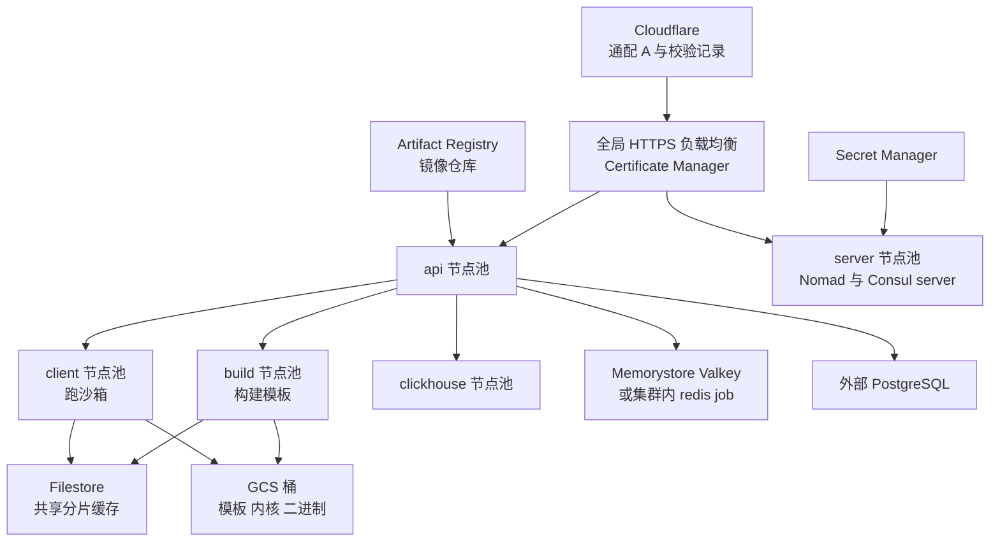
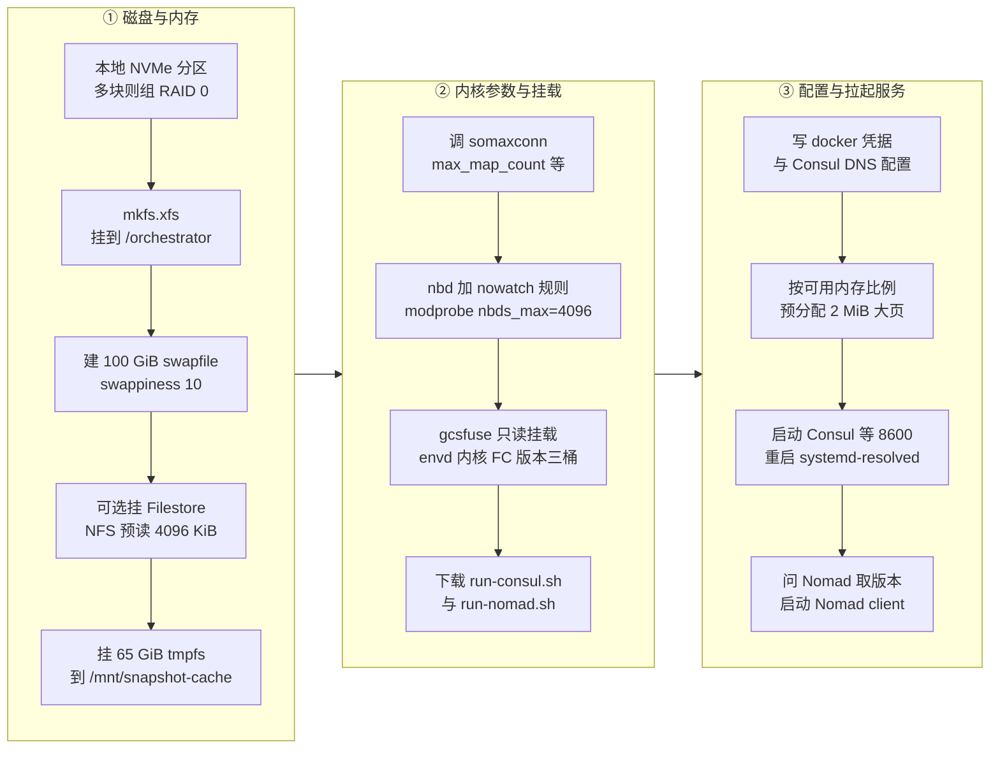

# 63 · GCP 上的部署

> 上游把一整套 e2b 的落地形态写成了 Terraform：一个 GCP 项目、一个域名、一份 `.env`，
> 换来五类节点池、一组负载均衡、十来个对象存储桶和二十多个 secret。本篇讲这套资源拓扑长什么样、
> 节点开机时做了什么、以及 `self-host.md` 的十一步为什么必须按那个顺序走。
>
> **读者**：运维、工程师。
> **预备**：[第 09 篇 · Nomad、Consul 与 Terraform](09-nomad-consul-terraform.md)（Terraform 与 Packer 的基本概念、
> Nomad 集群模型在本篇不重复）。
> **代码**：`iac/provider-gcp/`（`main.tf`、`init/`、`nomad-cluster/`、`nomad/`、`redis/`、
> `remote-repository/`、`nomad-cluster-disk-image/`）、`self-host.md`、`.env.template`、根 `Makefile`

---

## 0. 本篇要回答的问题

1. 一次 `make apply` 到底在 GCP 里造出了什么？这些资源分几层、谁依赖谁？
2. 五类节点池各自跑什么、机器与磁盘怎么配、为什么 client 和 build 要区分？
3. 域名、证书与负载均衡是怎么串起来的？Cloudflare 在其中承担哪一段？
4. Packer 烤的磁盘镜像里装了什么、**没有**装什么？剩下的由谁补？
5. `start-client.sh` 那两百行在准备什么？每一步对应后面哪个机制？
6. `file_hash` 解决了什么问题，又留下了什么问题？
7. `self-host.md` 的步骤为什么是那个顺序，换一个顺序会卡在哪里？

---

## 1. 一次部署要产生什么

从零到能创建第一个沙箱，需要同时具备四类东西：**能跑特权进程的机器**（要嵌套虚拟化、要本地 NVMe、
要预分配大页）、**一条从公网域名到这些机器的加密链路**、**几个存放模板与二进制的对象存储桶**，
以及**一堆凭据**（数据库连接串、Cloudflare token、Consul / Nomad 的 ACL token）。
上游用 Terraform 把这四类写成一份配置，`iac/provider-gcp/` 是它的根模块。

根模块 `iac/provider-gcp/main.tf` 声明了四个 provider：`google`（6.50.0）、`cloudflare`（4.52.5）、
`nomad`（2.1.0）、`random`（3.5.1），state 放在 GCS 后端、前缀 `terraform/orchestration/state`；
`required_version` 卡在 `>= 1.5.0, < 1.6.0`，原因写在 `self-host.md` 里：1.6 起 Terraform 换成了
Business Source License，最后一个 MPL 版本是 1.5.7。

根模块下挂五个子模块，边界很清楚：

| 模块 | 目录 | 管什么 |
|---|---|---|
| `init` | `init/` | 启用 GCP API、服务账号、Artifact Registry、GCS 桶、Secret Manager 的空壳 |
| `cluster` | `nomad-cluster/` | 网络与负载均衡、五类节点池、Filestore、脚本分发 |
| `nomad` | `nomad/` | 提交所有 Nomad job；jobspec 只有 api、redis、docker-reverse-proxy、template-manager、nomad-autoscaler、clean-nfs-cache 留在本目录，其余已迁到 `iac/modules/job-*/jobs/`（细节见[第 64 篇 §1](64-nomad-jobs.md#1-jobspec-是怎么被投递的)） |
| `redis` | `redis/` | 可选的 Memorystore Valkey 集群 |
| `remote_repository` | `remote-repository/` | 可选的 Docker Hub 远程缓存仓库 |

外加根模块自己的两个文件：`api.tf` 建 `custom-environments` 这个 Artifact Registry 仓库和四个
API 相关的 secret，`docker-reverse-proxy.tf` 建一个只有 `artifactregistry.writer` 权限的
专用服务账号并导出它的 JSON key。

另一个 provider 目录 `iac/provider-aws/` 目前只有一个 `Makefile`，内容是一条
`aws ecr get-login-password` 的登录命令；AWS 的资源定义并不存在。上游代码里确实有 AWS 的痕迹
（`iac/modules/job-orchestrator` 有 `provider_name` 与 `provider_aws_config` 变量，
根 `Makefile` 的 `copy-public-builds` 有 `ifeq ($(PROVIDER),aws)` 分支），
但**能一键部署的只有 GCP**。



---

## 2. init：一次性的项目级资源

`init` 是唯一一个被 `make init` 单独 `-target` 的模块，因为它的产物是其它一切的前提。

**API 启用。** `init/main.tf` 用 `google_project_service` 打开八个 API：Secret Manager、
Certificate Manager、Compute Engine、Artifact Registry、OS Config、Monitoring、Logging、Filestore，
全部带 `disable_on_destroy = false`。启用是异步的，Terraform 拿不到「已经可用」的信号，
所以代码里塞了两个 `time_sleep`：secret 相关的等 60 秒，Artifact Registry 等 90 秒。
这也是 `self-host.md` 第 5 步那句「如果报错就再跑一次」的来由 —— 这两个 sleep 只是把竞态的概率压低，
没有消除它。

**身份。** `google_service_account "infra_instances_service_account"`（`${prefix}infra-instances`）
是所有节点使用的服务账号，同时导出一份 JSON key。这份 key 有两个用途：
写进节点的 `/root/docker/config.json` 让 docker 能拉 Artifact Registry 的镜像，
以及传给 template-manager job。节点上的授权靠 `google_storage_bucket_iam_member` 逐桶授予：
模板桶与构建缓存桶是 `objectUser`（读写），内核、FC 版本、instance-setup 桶是 `objectViewer`（只读）。

**镜像仓库。** 三个 Artifact Registry：`e2b-orchestration`（代码里标了「migration 期后删除」）、
`${prefix}core`（api、db-migrator、client-proxy、docker-reverse-proxy、clickhouse-migrator、
dashboard-api 的镜像都从这里拉，见 `nomad/images.tf`）、`${prefix}custom-environments`
（用户 `docker push` 上来的模板镜像落在这里）。可选的第四个是 `remote-repository` 模块建的
`${prefix}docker-remote-repository`，`mode = "REMOTE_REPOSITORY"` 指向 Docker Hub，
带 90 天清理策略；打开它（`REMOTE_REPOSITORY_ENABLED`）之后模板构建拉基础镜像走这个缓存，
可以绕开 Docker Hub 的匿名拉取限流。

**对象存储。** `init/buckets.tf` 建九到十个桶，全部 `public_access_prevention = "enforced"` +
uniform access：

| 桶 | 存什么 | 特别设置 |
|---|---|---|
| `fc-templates` | 模板产物（memfile、rootfs、header） | autoclass 到 ARCHIVE，软删除保留 10 天 |
| `fc-build-cache` | 构建层缓存 | autoclass |
| `fc-env-pipeline` | orchestrator / template-manager / envd 等二进制 | 位置由 `template_bucket_location` 决定 |
| `fc-kernels`、`fc-versions` | guest 内核与 Firecracker 版本 | 节点用 gcsfuse 只读挂载 |
| `instance-setup` | `run-nomad.sh`、`run-consul.sh` | 见 §6.3 |
| `loki-storage` | 日志 | 8 天生命周期删除 |
| `clickhouse-backups` | ClickHouse 备份 | NEARLINE，30 天删除 |
| `envs-docker-context` | 旧的构建上下文 | 代码里标了「已不需要」 |
| `public-builds` | 公共内核与 FC 构建 | 只在 `gcp_project_id == "e2b-prod"` 时创建，`allUsers` 可读 |

最后那个桶解释了 `make copy-public-builds` 为什么能工作：自建部署是从 e2b 官方项目的公共桶
`gs://e2b-prod-public-builds/` 把内核和 Firecracker 复制到自己的 `fc-kernels` / `fc-versions` 桶。

**凭据。** `init/secrets.tf` 加上 `api.tf`、`nomad-cluster/main.tf` 一共建二十多个
Secret Manager secret。它们分成两类，区别很重要：

- **Terraform 自己能生成的**：`consul-secret-id`、`nomad-secret-id`（`random_uuid`）、
  `consul-gossip-key`（32 字节 `random_id`）、`consul-dns-request-token`、
  `api-secret`、`api-admin-token`、`sandbox-access-token-hash-seed`（`random_password`）。
  这些在 apply 时就有值。
- **只建空壳、值要人填的**：`cloudflare-api-token`、`postgres-connection-string`、
  `supabase-jwt-secrets`、`posthog-api-key`、`launch-darkly-api-key`、`grafana-api-key`、
  `analytics-collector-host` / `-api-token`、`dockerhub-username` / `-password`、
  `routing-domains`。写法是 `secret_data = " "`（一个空格）配 `lifecycle { ignore_changes = [secret_data] }` ——
  先占位，之后人在控制台里加一个新版本，Terraform 不再覆盖。

`routing-domains` 值得单独说：它存一个 JSON 数组，根模块 `main.tf` 在 `locals` 里
`nonsensitive(jsondecode(...))` 读出来当作 `additional_domains`，用于给同一套集群挂多个域名。
它是 `data` 而不是 `resource` 读的，所以 secret 必须先存在 —— 又一条「init 必须先跑」的理由。

---

## 3. 节点池：五类机器

`nomad-cluster/` 下有四个 `nodepool-*.tf` 加一个 `worker-cluster/` 子模块，一共产出六种实例组。
所有节点用同一个镜像家族 `e2b-orch`，区别在机器规格、磁盘、启动脚本和 Nomad node pool。

| 节点池 | 实例组类型 | Nomad node pool | 启动脚本 | 磁盘 | 典型规格 |
|---|---|---|---|---|---|
| server | region MIG，`EVEN` 分布 | 不加入（是 Nomad server） | `start-server.sh` | 启动盘 20 GiB pd-ssd | `e2-standard-2` × 3 |
| api | zonal MIG | `api` | `start-api.sh` | 启动盘 200 GiB | `e2-standard-4` |
| client | region MIG + autoscaler | `default` | `start-client.sh` | 启动盘 + 本地 SSD 或 PD | `n1-standard-8` 起 |
| build | region MIG + autoscaler | `build` | `start-client.sh` | 同上 | 同上 |
| clickhouse | zonal MIG + 有状态盘 | `clickhouse` | `start-clickhouse.sh` | 启动盘 200 GiB + 100 GiB pd-ssd | `e2-standard-4` |
| loki | zonal MIG | `loki` | `start-api.sh` | 启动盘 200 GiB | `e2-standard-4`，默认 size 0 |

表里「Nomad node pool」这一列的值不是硬编码的：`api_node_pool`、`build_node_pool`、
`clickhouse_node_pool`、`loki_node_pool`、`orchestrator_node_pool` 都是
`iac/provider-gcp/variables.tf` 里的变量（默认值依次是 `api`、`build`、`clickhouse`、`loki`、`default`），
经 `main.tf` 传进 `nomad-cluster`，再由各个 `nodepool-*.tf` 以 `NODE_POOL` 的名义
`templatefile()` 进启动脚本，最后作为 `run-nomad.sh --node-pool` 落到 Nomad client 的配置里。
但 `run-nomad.sh` 的 `create_node_pools()` 只显式创建 `api` 与 `build` 两个池；
`default` 与 `all` 是 Nomad 内置，`loki` 与 `clickhouse` 两个池在集群里的出现依赖节点注册。
换池名只要改一个变量，代价是 job 侧引用的池名写在另一组变量里，两边必须一起改。

几处设计值得展开。

**server 是唯一必须多副本的。** `.env.template` 给的默认是 3 台 `e2-standard-2`，
`distribution_policy_target_shape = "EVEN"` 强制跨可用区平摊，`update_policy` 固定为 `PROACTIVE`
且 `max_unavailable_fixed = 0` —— Raft 集群不能同时掉两台。这些机器只跑 Nomad 与 Consul 的 server，
不跑任何业务负载，所以 `e2-standard-2` 就够。

**api 节点是流量入口，也是控制面。** 它的实例组声明了五个 `named_port`
（client-proxy 的会话端口与健康端口、api 端口、docker-reverse-proxy 端口、ingress 端口），
负载均衡的 backend service 按 `port_name` 找它们。api、client-proxy（edge）、
docker-reverse-proxy、ingress、dashboard-api、otel-collector 这些容器化负载都调度到这一池。

**client 与 build 是同一个模块的两个实例。** `nomad-cluster/main.tf` 里
`module "client_cluster"` 与 `module "build_cluster"` 都 `for_each` 一个
`*_clusters_config` 映射，`source = "./worker-cluster"`。两者的差别只有三处：
node pool 名（`default` 对 `build`）、大页比例默认值
（`client_base_hugepages_percentage = 80`，`build_base_hugepages_percentage = 60`），
以及 `set_orchestrator_version_metadata`（client 为 `true`，build 为 `false`）。
最后这一项对应[第 09 篇 §3.2](09-nomad-consul-terraform.md#32-orchestrator-的版本化-job)讲过的版本化 orchestrator job：client 节点开机时要先向 Nomad 问出
`latest_orchestrator_job_id` 并写进节点 meta，否则新节点会被 job 的 constraint 排除。
build 节点跑的是 template-manager，走的是普通 `service` job，不需要这个握手。

用 `map(object(...))` 而不是单个对象，意味着可以同时开多组 client 集群，
每组有自己的机器型号与大页比例 —— 这是异构机型混部的接口。

**autoscaler 只能扩不能缩。** `worker-cluster/nodepool.tf` 的
`google_compute_region_autoscaler` 写死 `mode = "ONLY_SCALE_OUT"`、`cooldown_period = 240`，
并且只在 `autoscaler.size_max > cluster_size` 时才创建。它还有一条 precondition：
内存目标必须高于大页比例，理由写在 `error_message` 里 —— 预分配的大页在监控里算作已用内存，
目标定得比它低会导致无限扩容。缩容交给别处：Nomad autoscaler job 与节点排空是另一条路径。

**磁盘的两种形态。** `cache_disks.disk_type` 为 `local-ssd` 时，实例模板挂 N 块 375 GiB 的
NVMe SCRATCH 盘（precondition 强制每块必须正好 375 GiB，这是 GCP 本地 SSD 的固定粒度）；
否则挂一块持久盘，且 precondition 限制只能一块。前者性能高、随实例销毁，
后者便宜、但同样 `auto_delete = true`。两种情况下这块盘都被 `start-client.sh` 格式化成 XFS
挂到 `/orchestrator`，也就是模板缓存与沙箱运行时文件的落脚点
（见[第 34 篇 §3](34-template-cache-and-local-storage.md#3-节点本地目录谁建谁删)）。

**clickhouse 是唯一有状态的节点池。** `nodepool-clickhouse.tf` 为每个副本单独建一块
`google_compute_disk`（100 GiB pd-ssd），再用 `google_compute_per_instance_config` 把盘
`preserved_state` 绑到具名实例上，生产环境的 `delete_rule` 是 `NEVER`。
同一份 per-instance 配置里还写了 `metadata = { "job-constraint" = "<prefix>-<n>" }`，
Nomad job 靠这个 meta 把第 n 个 ClickHouse 副本钉在带第 n 块盘的机器上。

---

## 4. 网络、负载均衡与 Cloudflare

**VPC 是借来的。** `network_name` 的默认值就是 `"default"` —— 上游不建 VPC，直接用项目的默认网络。
唯一自建网络的地方是 Packer：`nomad-cluster-disk-image/main.tf` 建一个
`e2b-build-cluster-disk-image` 网络加 `10.0.0.0/8` 子网，只为烤镜像时能通过 IAP 登录构建机。

**两套全局 HTTPS 负载均衡。** 主 LB 在 `nomad-cluster/network/main.tf`，
`google_compute_url_map "orch_map"` 按 host 分四路：

| host | backend | 后端实例组 | 超时 |
|---|---|---|---|
| `api.<domain>` | api | api 节点组 | 65 s |
| `docker.<domain>` | docker-reverse-proxy | api 节点组 | 30 s |
| `nomad.<domain>` | nomad | server 节点组 | 10 s |
| `*.<domain>` | session | api 节点组 | 86400 s |

`session` 那条通配路由是沙箱流量的入口，86400 秒的超时是为了撑住长连接
（见[第 53 篇 §5.1](53-client-proxy-edge.md#51-websocket-与长连接)）。`nomad` 路由额外加了一条
path rule，把 `/v1/metrics` 用 `url_rewrite` 改写成 `/`，等于封掉这个路径。
第二套 LB 在 `network/ingress.tf`，有自己的全局 IP、url map 与 Cloud Armor 策略，
只服务 `dashboard-api.<domain>` 这个子域。

**证书与 DNS 的分工。** 证书由 GCP Certificate Manager 签发：
`google_certificate_manager_dns_authorization` 产出一条待写入的校验记录，
Terraform 用 Cloudflare provider 把它写进 zone（`cloudflare_record "dns_auth"`），
GCP 校验通过后签出 `root_cert`，再通过 certificate map 挂到 target HTTPS proxy 上。
Cloudflare 这边同时建一条通配 A 记录 `*`（域名本身是子域时是 `*.<sub>`）指向
LB 的全局 IP。所以 Cloudflare 只做两件事：域名验证与 A 记录，TLS 终止在 GCP 侧。
证书签发是异步的，这正是 `self-host.md` 第 10 步那句「要等证书签出来」的原因。

Cloudflare API token 从 Secret Manager 读：`network/main.tf` 里
`provider "cloudflare" { api_token = data.google_secret_manager_secret_version... }`。
provider 配置依赖一个 data source，这在 Terraform 里意味着该 secret 必须在 plan 阶段就有值。

**防火墙的四条规则。** 允许 LB 健康检查源段 `130.211.0.0/22` 与 `35.191.0.0/16` 访问所有
backend 的健康检查端口（priority 999）；允许 IAP 段 `35.235.240.0/20` 访问 22 / 3389
（priority 900，dev 环境放宽成 `0.0.0.0/0`）；然后 priority 1000 一条 deny 把 22 / 3389
对公网关掉；egress 全放行。顺序是关键 —— 900 的 allow 压过 1000 的 deny，
于是 SSH 只能从 IAP 进来，这也是 `make setup-ssh` 用 `gcloud compute config-ssh` 的原因。

**Cloud Armor。** 四条 `google_compute_security_policy_rule` 做限流：按 API key、按来源 IP、
按沙箱 host、按沙箱来源 IP，另有一条 adaptive protection 的 L7 DDoS 防护挂在 ingress 上。

**可选的 NAT。** `api_use_nat = true` 时，api 节点不再分配外部 IP，改由
`google_compute_router_nat` 出网，`nat_ip_allocate_option = "MANUAL_ONLY"`、
默认每 VM 170 个端口。这样出站流量的源 IP 是固定的两个静态地址，便于对端做白名单。

---

## 5. 共享存储与外部依赖

**Filestore。** `nomad-cluster/filestore/main.tf` 建一个 `google_filestore_instance`，
`tier == "ZONAL"` 时协议是 NFS v4.1，否则 NFS v3；带 `deletion_protection_enabled = true`
和一句直白的理由「删掉的话 orchestrator 会狂报错」。它导出的路径
`/orchestrator/shared-store/chunks-cache` 通过 `shared_chunk_cache_path` 一路传给
orchestrator job 与 `clean-nfs-cache` job，是跨节点共享的分片缓存
（见[第 13 篇 §4.3](13-storage-landscape.md#43-共享缓存上的并发写)、
[第 34 篇 §7](34-template-cache-and-local-storage.md#7-nfs-共享缓存一个只能靠-atime-的清理器)）。

挂载参数在 `nomad-cluster/main.tf` 的 `local.nfs_mount_opts` 里逐条带注释，每一条都是权衡：
`nconnect=7` 开多条 TCP 连接提高并发吞吐；`rsize=1048576` / `wsize=1048576` 把单次读写做到 1 MiB，
对齐分片大小；`actimeo=600` + `nocto` + `lookupcache=positive` 把属性与查找结果缓存到 10 分钟
（代码里那行注释写的是「60 seconds」，与取值对不上，以取值为准），
代价是同一个文件被另一节点改写后本节点看不到 —— 对「写一次、只读」的分片缓存是安全的，
对可变文件不是；`hard` 让请求无限重试而不是返回错误，代价是 Filestore 故障时调用方会挂住；
`nolock`、`noacl`、`sec=sys` 都是省掉不需要的机制。

**Redis。** 两条路。`REDIS_MANAGED=false`（默认）时 `nomad/main.tf` 提交一个
`redis.hcl` job 跑在 api 节点池上；`true` 时 `redis/main.tf` 建一个 Memorystore Valkey 集群
（`VALKEY_8_0`、`MODE = "CLUSTER"`、AOF 每秒 fsync、多可用区、`transit_encryption_mode` 为
`SERVER_AUTHENTICATION` 但 `authorization_mode = "AUTH_DISABLED"`，即用 TLS 但不用密码），
并把连接地址与 CA 证书写回两个 secret 的新版本。这个模块还顺手为默认 VPC 建了
Private Service Connect 策略与 VPC peering 范围。

**PostgreSQL 不在 Terraform 里。** `.env.template` 要求填 `POSTGRES_CONNECTION_STRING`，
`self-host.md` 说明目前只测过 Supabase。ClickHouse 则跑在自己的节点池上。

---

## 6. 磁盘镜像与节点启动脚本

### 6.1 Packer 装什么

`nomad-cluster-disk-image/main.pkr.hcl` 从 `ubuntu-2204-jammy-v20251023` 出发，
在一台 `n1-standard-4` 上装好东西再打成镜像家族 `e2b-orch`。装进去的是：Docker（`get.docker.com`）、
gcsfuse、`nfs-common`、Go（snap）、`unzip jq net-tools qemu-utils make build-essential openssh-*`、
gruntwork 的 bash-commons、Consul 1.16.2、Nomad 1.6.2、Vault 1.20.3、Google Cloud Ops Agent，
再改三处系统配置：放宽的 `limits.conf`、`nf_conntrack_max = 2097152`、
用 `dpkg-divert` 把 GCE 的 `resolved.conf.d/gce-resolved.conf` 改道。
镜像声明 `image_licenses = ["projects/vm-options/global/licenses/enable-vmx"]` 打开嵌套虚拟化。

**没有装的东西同样重要**：没有 Firecracker、没有 guest 内核、没有 orchestrator 或
template-manager 的二进制、没有任何 Consul / Nomad 的配置文件。前三样在开机时用 gcsfuse
挂桶或由 Nomad 的 artifact 机制下载，第四样由启动脚本现场生成。镜像因此是「工具集」而不是
「一台配好的机器」，好处是同一个镜像给五类节点用，代价是每次开机都要做一遍配置工作，
开机时间被拉长到分钟级（MIG 的 `initial_delay_sec = 600` 就是给这段留的余量）。

### 6.2 start-client.sh 做了什么

`worker-cluster/nodepool.tf` 用 `templatefile()` 把 `scripts/start-client.sh` 渲染成实例模板的
`metadata_startup_script`。脚本里 `%{ if ... }` 是 Terraform 的模板控制流，在 apply 时就展开了，
所以不同配置的节点池拿到的其实是不同的脚本文本。按顺序：



几个点值得解释：

**XFS 与块大小。** 代码注释写的是「Format the disk with XFS and 65K block size」，
实际命令是 `mkfs.xfs -f -b size=4096`，即 4 KiB。注释与实现对不上，以实现为准。

**swap 与大页的组合。** 先建 100 GiB swapfile、`vm.swappiness=10`，再预分配大页。
大页部分的算法是：先从总内存里留出「4 GiB 与 16% 取大、再与 42 GiB 取小」的常规内存，
剩下的除以 2 MiB 得到大页总数，其中 `BASE_HUGEPAGES_PERCENTAGE`（client 默认 80）
写进 `/proc/sys/vm/nr_hugepages` 永久占用，其余写进 `nr_overcommit_hugepages`，
按需分配。注释里明确说明了为什么不开透明大页：THP 不可交换。
这一段是[第 32 篇 §5](32-memory-prefetch-and-hugepages.md#5-大页改变了哪些量)的物理前提。

**NBD 的两处准备。** 一条 udev 规则给 `nbd*` 设备加 `OPTIONS:="nowatch"` 关掉 inotify
（脚本里引了内核邮件列表的链接），以及 `modprobe nbd nbds_max=4096` 一次性建好 4096 个设备节点。
后者决定了单机 NBD 设备数的上限（见[第 33 篇 §8](33-nbd-and-rootfs.md#8-上限设备号还是内存)）。

**gcsfuse 而不是下载。** envd 二进制、guest 内核、Firecracker 版本三个桶被
gcsfuse 只读挂到 `/fc-envd`、`/fc-kernels`、`/fc-versions`，其中后两个带一份配置：
`file-cache.max-size-mb: -1`（不限缓存大小）、`metadata-cache.ttl-secs: -1`（元数据永不过期）。
「永不过期」在这里是安全的，因为这些桶的内容按版本号只增不改。收益是新增一个内核版本
不需要重做镜像也不需要重启节点。

**DNS 的启动顺序。** 脚本先从 GCE 元数据服务查出 VPC 的 DNS 地址，把它作为 `--recursor`
传给 Consul，后台启动 Consul，轮询等 8600 端口起来，**然后**才 `systemctl restart systemd-resolved`。
注释解释了原因：反过来做的话 systemd-resolved 会把 `127.0.0.1:8600` 标记为不可达。
Packer 里那条 `dpkg-divert` 与脚本里把 `gce-resolved.conf` 改名的操作是同一目的：
让 Consul 成为节点上唯一的 DNS 入口，`.consul` 自己答，其余递归给 VPC DNS。

**版本握手。** `SET_ORCHESTRATOR_VERSION_METADATA` 为 true 时（即 client 节点），
脚本在启动 Nomad 之前用 `dig +short nomad.service.consul` 找到一台 server，
调 `/v1/var/nomad/jobs` 取出 `latest_orchestrator_job_id`，最多重试 10 分钟；
取不到就 `exit 1`，节点不启动。这是刻意的：拿不到版本的节点起来了也不会被调度到 orchestrator，
不如直接失败让 MIG 的自愈换一台。

`start-api.sh` 是同一套骨架的简化版：只调内核参数、下载两个脚本、写 docker 凭据与 Consul DNS，
然后起 Consul 与 Nomad client。`start-server.sh` 更短，连 Consul DNS 都不配，
直接前台起 Consul server 与 Nomad server。`start-clickhouse.sh` 额外多一步挂有状态盘。

### 6.3 file_hash：脚本分发与它留下的债

`run-consul.sh` 与 `run-nomad.sh` 这两个脚本不进镜像，也不嵌进启动脚本，
而是走一条单独的分发路径。`nomad-cluster/main.tf`：

```hcl
locals {
  file_hash = {
    "scripts/run-consul.sh" = substr(filesha256("${path.module}/scripts/run-consul.sh"), 0, 5)
    "scripts/run-nomad.sh"  = substr(filesha256("${path.module}/scripts/run-nomad.sh"), 0, 5)
  }
}

resource "google_storage_bucket_object" "setup_config_objects" {
  for_each = var.setup_files
  name     = "${each.value}-${local.file_hash[each.key]}.sh"
  source   = "${path.module}/${each.key}"
  bucket   = var.cluster_setup_bucket_name
}
```

即：内容哈希的前 5 位进文件名，上传到 `instance-setup` 桶；同一个哈希被插值进各个启动脚本里的
`gsutil cp gs://.../run-nomad-<hash>.sh`。这样做解决的问题是**内容寻址**：
脚本改了，对象名变，启动脚本文本变，实例模板变，新节点必然拿到新脚本，不会撞上对象存储的缓存。
`depends_on` 还保证上传先于实例模板创建。

代价有三层，都值得如实记下：

- **哈希只覆盖两个脚本。** `start-client.sh` 等启动脚本本身是直接嵌进实例模板的，
  改动同样会触发模板重建，机制不同但效果一致；而镜像内容（Consul / Nomad 的版本、
  装了哪些包）不在任何哈希里。
- **镜像版本与配置版本脱钩。** 各节点池用 `data "google_compute_image" { family = "e2b-orch" }`
  解析镜像，取的是家族里最新的一张。Packer 每次构建生成一个带时间戳的新镜像名
  （代码里有 TODO 说应该覆盖而不是新建），于是**跑一次 Packer 之后，下一次任何 apply 都会
  悄悄换掉实例模板的镜像**，哪怕这次改的是别的东西。反过来，state 里也没有任何地方
  记录当前跑的是哪张镜像。`nomad-cluster/main.tf` 开头那句注释说得很直白：
  用 Packer 造了新镜像之后，server 集群的实例不会自动更新。
- **模板更新不等于节点更新。** worker 与 api 的 `update_policy` 在非 dev 环境是
  `OPPORTUNISTIC`，也就是说改了启动脚本、apply 成功、实例模板已经是新的，
  但在机器被别的原因替换之前，跑着的节点仍在用旧脚本。要让改动生效必须手动滚动。
  api 的实例模板还带一条 `ignore_changes = [metadata]`，注释标为「临时 workaround，
  等 cluster size 从 metadata 里去掉之后删除」。推论：它忽略的是 `metadata` 块，
  `metadata_startup_script` 是另一个属性，不受影响。

这些加起来是一句话：**「哪台机器在跑哪个版本的什么」这件事，Terraform 只管到实例模板为止。**
运维上要靠 `iac/provider-gcp/nomad-cluster` 之外的手段（滚动重启、Nomad 节点排空）补齐。

---

## 7. self-host.md 的顺序为什么如此

`self-host.md` 列了十一步。它不是随意排的，每一步都在解一条依赖：

1. **建 GCP 项目、确认配额**（至少 2500 GB pd-ssd 与 24 CPU）。配额不足的失败发生在 apply 中途，
   代价比先查一眼大得多。
2. **写 `.env.<env>`**。根 `Makefile` 与 `iac/provider-gcp/Makefile` 都靠 `-include ${ENV_FILE}`
   读它，再用 `$(call tfvar, X)` 把非空的环境变量转成 `TF_VAR_x`。没有 `.env` 就没有变量。
3. **`make set-env`** 把环境名写进 `.last_used_env`，后续所有 Makefile 都读这个文件。
4. **`make provider-login`** 做两次登录：`gcloud auth login`（给 Packer 与 Docker）
   与 `gcloud auth application-default login`（给 Terraform）。
5. **`make init`**。这一步做四件事：建 Terraform state 桶并开版本控制与生命周期规则、
   `terraform init` 指向该桶、`terraform apply -target=module.init`、
   然后进 `nomad-cluster-disk-image` 跑 `packer init` 与 `build`。
   为什么必须先只 apply `init`：Cloudflare provider 的 token 要从 Secret Manager 读，
   `routing_domains` 也要读，而这些 secret 由 `init` 创建。
6. **`make build-and-upload`** 把所有二进制与 Docker 镜像推上去。为什么在 apply 之前：
   `nomad/images.tf` 用 `data "google_artifact_registry_docker_image"` 查 `api:latest` 等镜像，
   `nomad/main.tf` 用 `data "google_storage_bucket_object"` 查 `orchestrator` 二进制的 md5
   再算 checksum。这些都是 **data source**，对象不存在 plan 就失败。
7. **`make copy-public-builds`** 复制内核与 Firecracker 到自己的桶。理由同上：
   节点开机时要 gcsfuse 挂这两个桶，空桶挂上去也起不了沙箱。
8. **手工填 secret 版本**。`init` 只建了空壳（§2），`cloudflare-api-token` 与
   `postgres-connection-string` 不填，下一步的 plan 直接过不去。
9. **`make plan-without-jobs` + `make apply`**。`plan-without-jobs` 的实现是从 `main.tf` 里
   grep 出所有 `module` 名、去掉含 `nomad` 的、拼成一串 `-target=module.X`。
   先造机器不提 job，因为 `nomad` provider 的地址是 `https://nomad.<domain>` ——
   Nomad server 与负载均衡不存在时，提交 job 无从谈起。
10. **`make plan` + `make apply`**。这一次连 job 一起上。必须等证书签发完成，
    否则 `https://nomad.<domain>` 的 TLS 握手失败。
11. **`make prep-cluster`** 建初始用户、团队并构建基础模板。

顺序背后是同一条规律：**Terraform 的 data source 把「先有东西再有配置」变成了硬依赖**。
镜像、二进制、secret 值、DNS 与证书，四者都必须在被读之前就存在，
而它们的创建者分别是 Packer、Makefile、人和异步的 GCP 服务 —— 都不在 Terraform 的图里。
两次 apply、两个 `-target`、两个 `time_sleep`，都是为了在一个没有全序的依赖图上人工排出一个序。

---

## 8. ARM 适配版的差异

ARM 补丁对 `iac/` 的改动**不含任何 `.tf` 文件**，全部落在 shell 脚本与 job 模板上：
`start-client.sh` 被砍掉三分之二，本地 SSD 分区、RAID、XFS 格式化、gcsfuse 挂桶、
GCE 元数据查询全部移除，改成从同目录的 `.env` 读变量、把二进制直接 `cp` 到 `/usr/bin`；
`run-nomad.sh` / `run-consul.sh` 剥掉 gsutil 与元数据服务依赖，Nomad 的进程管理从
supervisor 换成 systemd 单元。也就是说 ARM 适配版保留了 Nomad 与 Consul 这一层，
但把本篇讲的 GCP 资源层整个去掉了，机器与网络由部署者自备。
细节见[第 79 篇 §5](79-nomad-multinode-deployment.md#5-集群自举的四个脚本)与
[第 80 篇 §8](80-single-node-rpm.md#8-宿主初始化脚本的三代)。

---

## 9. 小结

- `iac/provider-gcp/` 分三层：`init`（项目级：API、身份、仓库、桶、secret 空壳）、
  `nomad-cluster`（网络、负载均衡、五类节点池、Filestore）、`nomad`（提交 job）。
  `provider-aws/` 目前只有一条 ECR 登录命令，可一键部署的只有 GCP。
- 节点池按职责分五类，共用一个 `e2b-orch` 镜像家族，差别在机器规格、磁盘、启动脚本与 Nomad node pool。
  client 与 build 是同一个 `worker-cluster` 模块的两个实例，只差 node pool、大页比例和版本握手开关。
- 有状态的只有 ClickHouse：per-instance 的持久盘 + `job-constraint` 元数据把副本钉在盘上。
- 域名链路是 Cloudflare 管 DNS（校验记录 + 通配 A 记录）、GCP 管证书与 TLS 终止；
  一个 url_map 按 host 把 api、docker、nomad、沙箱会话分到不同 backend，会话超时 86400 秒。
- Packer 镜像只装工具不装配置，Firecracker、内核、业务二进制都在开机后取得；
  代价是开机要跑完整套 `start-client.sh`，MIG 因此给了 600 秒的健康检查宽限。
- `start-client.sh` 的每一步都对应后面的一个机制：XFS 盘对模板缓存、tmpfs 对快照、
  `nbds_max=4096` 对 rootfs、大页预分配对内存后端、Consul DNS 对服务发现、
  版本握手对 orchestrator 的滚动升级。
- `file_hash` 用内容哈希做脚本的内容寻址分发，但只覆盖两个脚本；
  镜像版本靠 `image_family` 的「最新一张」隐式解析，state 里不留痕迹，
  且生产环境的 `OPPORTUNISTIC` 更新策略意味着模板更新不等于节点更新。
- `self-host.md` 的顺序由 data source 的硬依赖决定：镜像、二进制、secret 值、证书
  四类前置条件都不由 Terraform 创建，只能靠两次 apply 与两个 `-target` 人工排序。

---

## 延伸阅读 / 下一篇

- 下一篇：[第 64 篇 · Nomad job 详解](64-nomad-jobs.md)，把本篇造出的机器上跑的每个 job 讲清楚；
  其中[§7](64-nomad-jobs.md#7-job--节点池--端口)的对照表按本篇的节点池分组。
- [第 09 篇 · Nomad、Consul 与 Terraform](09-nomad-consul-terraform.md)：本篇依赖的基础概念与集群模型。
- [第 65 篇 §2](65-build-and-release.md#2-产物矩阵)：`make build-and-upload` 到底上传了什么。
- [第 66 篇 §5](66-local-development.md#5-environmentlocal-打开了什么)：不上云时这套东西分别拿什么替代。
- [第 34 篇 · 模板缓存与本地存储](34-template-cache-and-local-storage.md#3-节点本地目录谁建谁删)、
  [第 40 篇 · 卷与 NFS 代理](40-volumes-and-nfsproxy.md#4-一次挂载的完整路径)：`/orchestrator` 与 Filestore 上放的是什么。
- [第 82 篇 §5](82-host-kernel-nbd-hugepages.md#5-sysctl-与-ulimit配了什么没配什么)：同一组内核参数在自建环境下怎么配。
