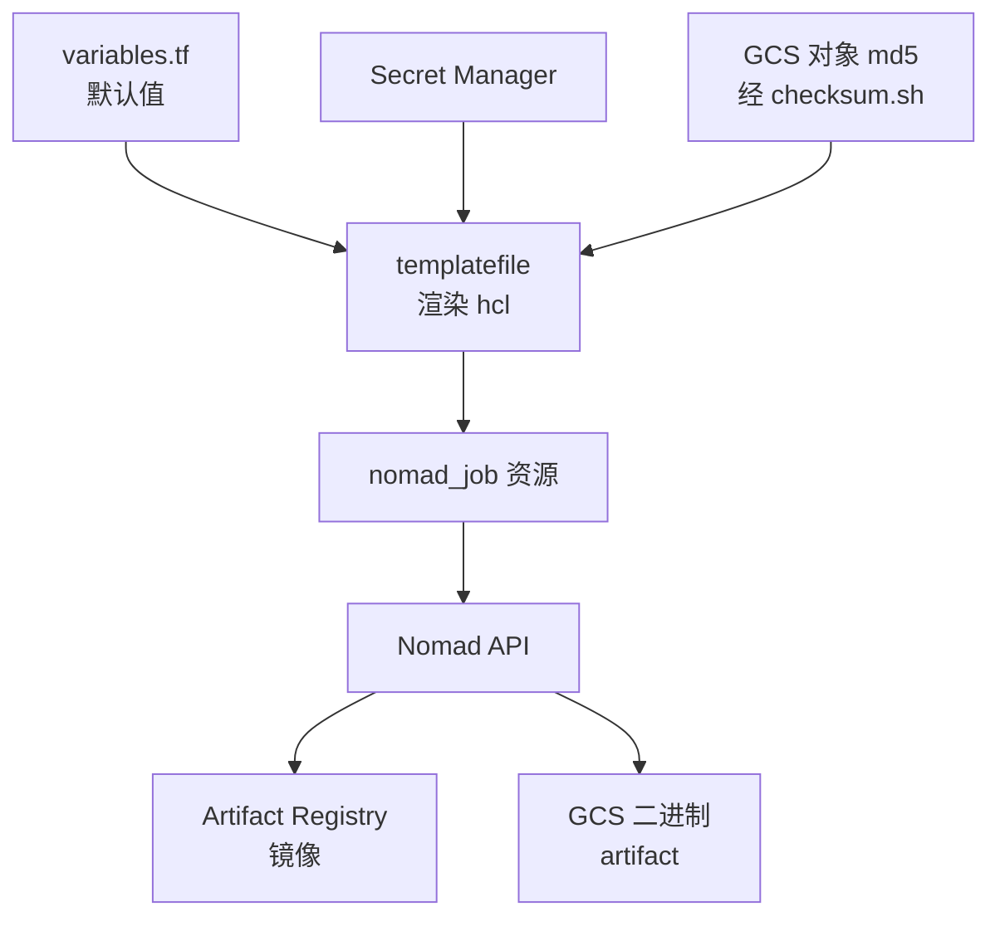

# 64 · Nomad job 详解

> 上游 2026.09 在 Nomad 上跑十几个 job。它们的差别不只是「跑哪个二进制」：调度类型、放置约束、
> 端口是静态还是动态、停止时等多久，每一条都对应一个具体的运行时约束。本篇逐个拆开这些 job 的
> jobspec，并给出「job × 节点池 × 端口」的完整对照。
>
> **读者**：要读懂或改动 e2b 部署的工程师。
> **预备**：[第 09 篇 · Nomad、Consul 与 Terraform](09-nomad-consul-terraform.md)、
> [第 63 篇 · GCP 上的部署](63-gcp-terraform.md)。
> **代码**：`iac/provider-gcp/nomad/jobs/*.hcl`、`iac/modules/job-*/jobs/*.hcl`、
> `iac/provider-gcp/nomad/main.tf`、`iac/provider-gcp/nomad/scripts/`、
> `iac/provider-gcp/nomad-cluster/scripts/run-nomad.sh`

---

## 0. 本篇要回答的问题

1. 一份 jobspec 从 Terraform 变量走到 Nomad，中间经过哪些环节？二进制与镜像分别从哪里来？
2. 为什么 api、orchestrator、template-manager 用了三种不同的调度类型，而它们都想要「每台机器一份」？
3. `meta.orchestrator_job_version` 这条 constraint 在升级失败时会发生什么？
4. template-manager 的 70 分钟 `kill_timeout` 和 80 分钟 `progress_deadline` 是怎么算出来的，代价是什么？
5. 哪些端口是静态的，静态端口带来了哪些放置上的连锁约束？

---

## 1. jobspec 是怎么被投递的

上游 2026.09 没有单独的部署脚本：每个 job 都是一个 Terraform 资源。
`iac/provider-gcp/nomad/main.tf` 里，`resource "nomad_job" "api"` 用 `templatefile()`
读 `jobs/api.hcl`，把一个 map 里的值代进 `${...}` 占位符，渲染结果作为 `jobspec` 提交给
`provider "nomad"`（地址是 `https://nomad.${var.domain_name}`，即经 ingress 暴露的 Nomad API）。
`iac/modules/job-*/main.tf` 的写法完全一样，只是被包装成模块以便 GCP 与 AWS 两个 provider 共用。

代进去的值有四类来源：

- **变量默认值**：端口、节点池名等，写在 `iac/provider-gcp/nomad/variables.tf` 与
  `iac/provider-gcp/variables.tf`。
- **Secret Manager**：数据库连接串、Supabase JWT、PostHog 与 Grafana 凭据、LaunchDarkly key，
  由 `data "google_secret_manager_secret_version"` 读出后直接内联进 jobspec 的 `env` 块。
  这意味着密钥以明文形式存在于 Nomad 的 job 定义里，任何能读 job API 的人都能拿到。
- **拼装出来的地址**：`local.redis_url`、`local.loki_url`、`local.clickhouse_connection_string`
  都是 `*.service.consul` 加端口，即依赖 Consul DNS 而不是 Nomad 的服务发现
  （[第 09 篇 §4.1](09-nomad-consul-terraform.md#41-dnsserviceconsul)）。
- **产物校验和**：`data "google_storage_bucket_object"` 取对象的 md5，
  `data "external"` 调 `iac/provider-gcp/nomad/scripts/checksum.sh` 把 base64 转成十六进制。

最后一类决定了「二进制变了怎么触发重部署」。Go 服务分两条投递路径：

- **docker driver 的 job**（api、client-proxy、ingress、dashboard-api、docker-reverse-proxy、
  redis、loki、clickhouse、otel-collector、logs-collector）拿的是镜像引用。
  `data.google_artifact_registry_docker_image.*.self_link` 是带 digest 的完整引用，
  镜像一变，jobspec 文本就变，Terraform 自然产生 diff。
- **raw_exec driver 的 job**（orchestrator、template-manager、nomad-autoscaler、clean-nfs-cache）
  在 task 里写 `artifact { source = "gcs::..." }`，由 Nomad client 直接从 GCS 下载二进制到
  allocation 的 `local/` 目录，再 `chmod +x` 执行。GCS 的 URL 本身不含版本，
  所以 `dev` 环境在 URL 后面追加 `?version=<md5 hex>` 让 jobspec 随二进制变化；
  非 dev 环境不追加，靠滚动更新或换节点来生效。
  template-manager 走的是第三条路：URL 固定，但 `artifact` 的 `options.checksum = "md5:<hex>"`
  含校验和，二进制一变 jobspec 也变，同时 Nomad 会校验下载结果。

## 2. 读一份 jobspec 要看的六件事

后面各节按同一组维度展开，先把这组维度列清楚：**调度类型**决定副本模型（`service` 按 `count`、
`system` 每节点一份、`batch` 跑完即止）；**driver** 决定隔离方式；**node pool 与 constraint**
决定落在哪台机器；**端口**决定它能不能与别的 job 共存；**service 与 check** 决定谁能发现它、
什么时候算健康；**update 与 kill_timeout** 决定升级时旧实例怎么退场。这六件事在
[第 09 篇 §2](09-nomad-consul-terraform.md#2-nomad-的模型) 有背景介绍，本篇只讲 e2b 的具体取值。

还有一个维度不在 jobspec 的显眼位置但影响很大：`priority`。上游给出的取值是
otel-collector 与 redis 95、orchestrator 91、api 与 ingress 90、docker-reverse-proxy 与
logs-collector 85、client-proxy 与 dashboard-api 80、loki 与 template-manager 75，
clickhouse、autoscaler、清理任务不写（默认 50）。Nomad 在资源不足时会按优先级抢占，
所以这组数字的含义是：可观测性与状态存储比业务面更不能掉，而构建能力排在最后。
它同时也决定了同一批机器上谁先被调度成功。

一个贯穿全书的细节：orchestrator 与 template-manager 的健康检查是 HTTP 的 `/health`，
但它们的 `port` 是 gRPC 端口。`packages/orchestrator/main.go` 用 `cmux` 在同一个 TCP 端口上
分流：`cmux.HTTP1Fast()` 匹配到的连接交给 `internal/healthcheck/healthcheck.go` 的
`CreateHandler()`，其余全部当作 gRPC。所以一个端口同时承担业务与探活。

## 3. api 节点池上的 job

`api` 池上跑七个 job，它们共用同一批机器，彼此之间靠静态端口互斥。

**api**（`jobs/api.hcl`，service + docker，priority 90）。`count` 来自 `api_server_count`，
再加 `constraint { distinct_hosts }`，于是每台 api 机器最多一份。两个静态端口：
HTTP `50001`（服务名 `api`，检查 `/health`）与 gRPC `5009`（服务名 `api-grpc`，TCP 检查）。
静态端口本身就是一把互斥锁：第二份 allocation 无法在同一台机器上绑同一个端口，
`distinct_hosts` 只是把这个事实提前写进调度约束，让失败发生在调度阶段而不是启动阶段。

同一份 jobspec 里还有一个更直接的用法。当 `api_machine_count > 2` 时，
api 与 loki 各自多申请一个端口 `scheduling-block`，静态值都是 `40234`，两边都不监听它。
它唯一的作用是让 Nomad 拒绝把两者放在同一台机器上——用端口冲突表达反亲和性，
因为 Nomad 的 `constraint` 无法直接表达「不要和另一个 job 同机」。
代价是这个魔数散落在两份 jobspec 里，改一处就会静默失效。

api 的 group 里还有一个 `db-migrator` task，`lifecycle { hook = "prestart", sidecar = false }`，
即每次 allocation 启动前先跑一遍数据库迁移，跑完退出，主 task 才启动。
迁移逻辑见[第 58 篇 · Postgres 模式与迁移](58-postgres-schema-and-migrations.md#5-迁移goosemigrator-容器与在线安全)。

`update` 块只在 `api_machine_count > 1` 时渲染：`canary = 1`、`auto_promote = true`、
`auto_revert = true`，`healthy_deadline = 10800s`（3 小时），`progress_deadline` 比它只多 1 秒。
注释说这是「故意卡得很紧，一旦被判为不健康就立即失败」。
`kill_timeout = "30s"`，与 `run-nomad.sh` 里 client 的 `max_kill_timeout = "24h"` 相容。

env 里有一处残留值得指出：`TEMPLATE_BUCKET_NAME = "skip"`，注释写着「这是某个被传递引用的代码
需要的」。`packages/shared/pkg/storage/storage.go` 的 `GetTemplateStorageProvider()` 会调
`utils.RequiredEnv("TEMPLATE_BUCKET_NAME", ...)`，缺失即 panic。
推论：api 的进程并不会走到这个函数（仓库里它的调用方都在 orchestrator 与测试代码中），
这个 `"skip"` 是历史依赖的残留；它的风险在于一旦某天 api 真的用到模板存储，
拿到的会是一个名为 `skip` 的 bucket 而不是启动失败。

**client-proxy**（`iac/modules/job-client-proxy/jobs/client-proxy.hcl`，service + docker，
priority 80）。静态端口 `3002`（对外流量）与 `3001`（健康检查），`distinct_hosts`。
它的 `service` 带一组 `traefik.*` tag，把自己注册成 Traefik 的兜底路由
（`PathPrefix('/')`，priority 100），因为沙箱流量走的是动态子域名。
`restart` 只允许 10 分钟内 2 次，超过就交给 `reschedule` 换一台机器，指数退避且 `unlimited = true`。
`kill_timeout = "24h"`：edge 上有长连接与正在中转的沙箱流量，上游选择让旧实例自己耗尽连接。
细节见[第 53 篇 §2](53-client-proxy-edge.md#2-进程结构两个端口没有第三个)。

**ingress**（`iac/modules/job-ingress/jobs/ingress.hcl`）是 Traefik v3.5，静态端口 `8800`（web）
与 `8900`（control），健康检查 `/ping`。它同时开了 Nomad 与 Consul catalog 两个 provider，
且 `exposedByDefault=false`，所以只有显式带 `traefik.enable=true` tag 的服务会被路由。

另外三个 job 结构简单，但各有一处值得留意。
**docker-reverse-proxy**（静态 `5000`，`/health`，20 秒一次）没有 `update` 块，
也没有 `distinct_hosts`，靠静态端口天然限制成每机一份；它是模板镜像推送的入口，
细节见[第 57 篇 §6](57-docker-reverse-proxy.md#6-部署)。
**redis**（静态 `6379`，TCP 检查，镜像 `redis:7.4.2-alpine`，`memory 2048 / memory_max 4096`）
只在 `redis_managed = false` 时由 `count = var.redis_managed ? 0 : 1` 部署；
它没有任何持久化配置，即这是一个可丢失的缓存而不是数据库。
**dashboard-api** 是唯一使用**动态端口**的业务服务：jobspec 里 `port "api" {}` 为空，
进程从 `NOMAD_PORT_api` 读端口，流量全部经 Traefik 的 `HostRegexp` 路由进来，
所以它不需要固定地址。`dashboard_api_count` 为 0 时整个模块 `count = 0`，不部署。

**nomad-autoscaler**（`jobs/nomad-autoscaler.hcl`，service + raw_exec）比较特别：
它从 `releases.hashicorp.com` 下载官方 autoscaler，再从 GCS 下载自建插件
`nomad-nodepool-apm`，配置文件由 `template` 块生成，端口是动态的。它只为 template-manager 存在，
下一节说明。

## 4. 沙箱节点上的 orchestrator

`iac/modules/job-orchestrator/jobs/orchestrator.hcl`：`type = "system"`、`raw_exec`、
node pool `default`、priority 91。两个静态端口：gRPC `5008` 与沙箱流量代理 `5007`，
两个 `service` 都写了 `provider = "nomad"`，即注册到 Nomad 自己的服务目录而不是 Consul。
`restart { attempts = 0 }`：orchestrator 崩溃后不原地重启，因为进程内存里持有全部沙箱状态，
重启后这些状态不会回来，重启只会掩盖问题（见[第 39 篇 §3](39-health-errors-and-teardown.md#3-退出路径矩阵)）。

job 名字是 `orchestrator-${latest_orchestrator_job_id}`，group 里带一条 constraint 要求
`meta.orchestrator_job_version` 等于同一个 ID。ID 的来源在 `main.tf`：把 jobspec 用占位符渲染一遍，
与二进制校验和拼接后 sha256，作为 `random_id.orchestrator_job` 的 `keepers`；
`environment == "dev"` 时固定为字符串 `dev`，此时 constraint 整段不渲染。
节点侧由 `run-nomad.sh` 的 `generate_nomad_config()` 把 `--orchestrator-job-version` 写进 client 的
`meta` 块。这套机制的升级模型在[第 09 篇 §3.2](09-nomad-consul-terraform.md#32-orchestrator-的版本化-job)
讲过，这里补两个后果：

- **失败模式是「不调度」而不是「调度错」**。如果新节点的 metadata 没写上，或者写的是旧 ID，
  新 job 会一直处于 `pending` 且没有 placement failure 以外的信号；集群不会因此掉沙箱，
  但也不会有任何新容量。
- **旧 job 不会被回收**。`nomad_job` 上写了 `deregister_on_id_change = false`，
  Terraform 不注销旧 job。每升级一次就多一个 `orchestrator-<hex>` 的 job 定义，
  清理是运维动作而不是代码动作。

env 里的 `ORCHESTRATOR_SERVICES` 默认是 `orchestrator`；同一套代码换成 `template-manager`
就是下一节的构建服务，这也是两者能共用一个 5008 端口号约定的原因
（`variables.tf` 里 `template_manager_port` 的注释：「两边用同一个端口，因为 edge API」）。

## 5. 构建节点：template-manager 与 clean-nfs-cache

template-manager 想要的语义和 orchestrator 一样——每台构建节点一份——但它不能用 `system`，
因为 `system` 类型不支持 `update` 与 `scaling`。上游的替代方案由三块拼成：

1. `constraint { distinct_hosts }` 保证一台机器至多一份；
2. `scaling` 块把 `count` 交给 autoscaler：`source = "nomad-nodepool-apm"`、`query = "${node_pool}"`、
   `strategy "pass-through" {}`，即「把 build 池当前的节点数原样当作目标副本数」，
   `evaluation_interval = "10s"`、`cooldown = "2m"`、`min = 2`、`max = 10000`；
3. Terraform 侧不去写死 `count`，而是用 `data "external"` 调
   `scripts/get-nomad-job-count.sh` 从 Nomad API 读当前值。该脚本只在 HTTP 404 时回退到
   `min_count`，任何网络、TLS、鉴权错误都直接退出并打印「拒绝继续，以免误缩容」。
   这是一处值得注意的取舍：宁可让 `terraform plan` 失败，也不让一次读取失败把构建集群缩到最小值。

停止时序是另一个重点。构建是长任务，被 SIGTERM 打断就得整个重来，所以启用滚动更新时
`kill_timeout = "70m"`，未启用时是 `1m`，同时用 `FORCE_STOP = "true"` 告诉进程不必等构建结束。
`update` 块里 `progress_deadline = "80m"`，注释直接写明约束关系：它必须同时大于
`healthy_deadline`（2 分钟）与 `kill_timeout`（70 分钟），否则 Nomad 会在旧实例还没退干净时
判定部署失败。client 侧 `run-nomad.sh` 的 `max_kill_timeout = "24h"` 是这些数字的上限。
代价很直白：`max_parallel = 1` 加 70 分钟等待，意味着一个 N 节点的构建集群，
最坏情况下一次滚动更新要 N × 70 分钟；`auto_revert = false`，回滚也得手动。

**clean-nfs-cache** 是全集群唯一的
`batch` + `periodic` job：`cron = "0 * * * *"`、`prohibit_overlap = true`、时区
`America/Los_Angeles`，`restart { attempts = 0, mode = "fail" }`。
它的文件名、二进制名与 job 名三者不一致：jobspec 在 `iac/provider-gcp/nomad/jobs/clean-nfs-cache.hcl`，
从 GCS 下载并执行的二进制叫 `clean-nfs-cache`，而 `job` 块里写的名字是 `filestore-cleanup` ——
在 Nomad 里查这个任务要用后者，在仓库里找代码要用前者。
它只在 `shared_chunk_cache_path != ""` 时部署，参数（目标磁盘占用率、每轮扫描与删除的文件数、
各类并发上限、`--dry-run`）全部由命令行传入。这个共享缓存本身见
[第 34 篇 §7](34-template-cache-and-local-storage.md#7-nfs-共享缓存一个只能靠-atime-的清理器)。

## 6. 全节点与数据面

**otel-collector** 与 **logs-collector** 都是 `type = "system"` 且 `node_pool = "all"`，
即 Nomad 的内置池，效果是每台机器各一份，无论它属于哪个池。回顾：
「每节点一份 + `network_mode = "host"`」正是业务进程能把
`OTEL_COLLECTOR_GRPC_ENDPOINT` 与 `LOGS_COLLECTOR_ADDRESS` 写成 `localhost:<port>` 的前提 ——
这两个值在 `iac/provider-gcp/nomad/main.tf` 里就是字面量 `localhost:${var.otel_collector_grpc_port}`
和 `http://localhost:${var.logs_proxy_port.port}`，不经过任何服务发现。收益与代价见
[第 60 篇 §4.1](60-telemetry.md#41-otel-collector每节点一个)。
调度上只补一点：两者的端口块只写了 `to = ...` 没有 `static`。
推论：在 host 网络下这些映射不生效，真正决定监听端口的是配置文件；
端口块的作用只剩下让 Nomad 记账并向服务目录报告地址。
logs-collector 的配置由 `template` 块生成，`change_mode = "signal"` 加 SIGHUP 热重载，
并把模板分隔符改成 `[[ ]]`，以免和 Vector 自己的 `{{ }}` 冲突。

`otel-collector-nomad-server` 是同一个镜像的另一份配置，`type = "service"` 落在 api 池，
只开一个健康端口 `13134`，用途是采集 Nomad server 侧的指标；
它与 `all` 池上那份 `system` job 的区别只在配置文件与端口，不在结构。

**loki** 是 service + docker，落在 `loki` 池（`loki_cluster_size` 为 0 时退回 api 池），
检查 `/ready`，并带上面说过的 `scheduling-block` 端口。

**clickhouse** 的 jobspec 用 Terraform 的 `for` 循环按 `server_count` 展开成
`server-1`…`server-N` 多个 group，每个 group 用 `constraint { attribute = meta.job_constraint }`
钉到一台特定机器上——机器的 `job_constraint` 由 `run-nomad.sh` 从 GCE 实例的自定义 metadata
读出后写进 client 的 `meta`。它是唯一使用 `network { mode = "bridge" }` 的 job，
并在同一 group 里放了一个 `lifecycle { sidecar = true, hook = "prestart" }` 的 otel-collector 边车。
配套还有两个 batch job：`clickhouse-migrator`（一次性迁移）与 `clickhouse-backup`
（`periodic`，每天 02/08/14/20 点备份到对象存储）。ClickHouse 的部署形态见
[第 59 篇 §6](59-clickhouse.md#6-部署形态)。

## 7. job × 节点池 × 端口

下表按节点池分组，端口列中标「静态」的是 jobspec 里写死的 `static`，
其余为 Nomad 动态分配或由配置文件决定。

| job | 节点池 | type / driver | 端口 | 服务注册 |
|---|---|---|---|---|
| `api` | api | service / docker | 50001、5009 静态；40234 占位 | Consul |
| `client-proxy` | api | service / docker | 3002、3001 静态 | Consul + Traefik tag |
| `ingress` | api | service / docker | 8800、8900 静态 | Consul + Traefik tag |
| `docker-reverse-proxy` | api | service / docker | 5000 静态 | Consul |
| `redis` | api | service / docker | 6379 静态 | Consul |
| `dashboard-api` | api | service / docker | 动态 | Consul + Traefik tag |
| `nomad-autoscaler` | api | service / raw_exec | 动态 | Nomad |
| `otel-collector-nomad-server` | api | service / docker | 13134 | Consul |
| `orchestrator-<id>` | default | system / raw_exec | 5008、5007 静态 | Nomad |
| `template-manager` | build | service / raw_exec | 5008 静态 | Nomad |
| `filestore-cleanup`（`clean-nfs-cache.hcl`） | build | batch periodic / raw_exec | 无 | 无 |
| `loki` | loki（或 api） | service / docker | 3100；40234 占位 | Consul |
| `clickhouse` | clickhouse | service / docker | 9000、8123、9363 静态 | Consul |
| `clickhouse-migrator` / `clickhouse-backup` | clickhouse | batch / docker | 无 | 无 |
| `otel-collector` | all | system / docker | 4317、4318、13133、8888 | Consul |
| `logs-collector` | all | system / docker | 30006、44313 | Consul |

两条读表的线索。第一，**静态端口集中在需要被别人按固定地址找到的服务上**：
api 的 5009 被 client-proxy 以 `api-grpc.service.consul:5009` 直连，orchestrator 的 5008 被 api 端
以「节点 IP + 常量端口」拼出来（`packages/api/internal/orchestrator/client.go`），
两者都没有从 Nomad 的端口映射里读实际值，这是[第 21 篇 §4](21-clusters-and-discovery.md#4-三种发现来源)
讨论的简化。第二，**服务注册分两套**：业务数据面注册到 Consul 供 DNS 与 Traefik 使用，
orchestrator、template-manager、autoscaler 注册到 Nomad，因为发现它们的代码走的是 Nomad 的
allocation 列表而不是 Consul 目录。

节点池只有 `api` 与 `build` 是 `run-nomad.sh` 的 `create_node_pools()` 显式创建的，
`default` 与 `all` 是 Nomad 内置；`loki` 与 `clickhouse` 由 Terraform 变量
`loki_node_pool` / `clickhouse_node_pool` 指定，机器加入时通过 `--node-pool` 参数落到 client 配置里
（[第 63 篇 §3](63-gcp-terraform.md#3-节点池五类机器)）。
所以 job 侧写的池名与节点侧写的池名是两组独立变量，改一处不会自动改另一处。

## 8. ARM 适配版的差异

ARM 适配版不再用 Terraform 投递 job：`iac/provider-gcp/nomad/jobs/` 下新增了
`deploy.sh` 与 `env.template`，用 `envsubst` 把 `.env` 里的大写变量代进 hcl，
渲染到 `rendered/` 后由 `nomad job run` 提交，同一个脚本也能改用 Helm 走 k8s 路径。
相应地，jobspec 里的 Terraform 条件块（`%{ if update_stanza }`、`scaling`、
orchestrator 的版本化 job 名与 `meta` constraint）被整体删掉，资源数量写成常量；
GCS artifact 与 Artifact Registry 镜像换成 Harbor 与本地路径，env 里补上 `MINIO_*`
与 `ARTIFACTS_REGISTRY_PROVIDER = "Local"`。
展开见[第 79 篇 §3](79-nomad-multinode-deployment.md#3-渲染层从-templatefile-换成-envsubst)与
[第 75 篇 §6](75-minio-storage.md#6-三种部署形态各用哪个-provider)。

## 9. 小结

- 上游 2026.09 的 job 全部由 Terraform 的 `templatefile` + `nomad_job` 投递，没有部署脚本；
  密钥以明文内联进 jobspec。
- 二进制的版本传播靠两条路：docker 镜像的 digest 天然进入 jobspec；
  raw_exec 的 GCS artifact 要靠 `?version=<md5>` 或 `options.checksum` 才能让 Terraform 看到变化。
- 三种「每节点一份」的实现：orchestrator 用 `system`，template-manager 用
  `service` + `distinct_hosts` + `scaling`（换取 `update` 与滚动能力），
  otel/logs-collector 用 `system` + 内置池 `all`。
- orchestrator 的 `meta.orchestrator_job_version` constraint 把升级变成换节点：
  失败模式是新 job 无处可放，而不是运行中的沙箱被替换；代价是旧 job 定义会累积。
- template-manager 的 70 分钟 `kill_timeout` 换来「构建不被部署打断」，
  代价是单节点更新最长阻塞 70 分钟，且 `progress_deadline` 必须跟着抬到 80 分钟。
- 静态端口既是服务发现的简化前提，也被反过来当作调度约束使用：
  `scheduling-block` 端口 40234 是 api 与 loki 之间唯一的反亲和机制。
- 服务注册分裂成 Consul 与 Nomad 两套，取决于发现方的实现，而不是取决于服务本身。
- `TEMPLATE_BUCKET_NAME = "skip"` 是一处已知残留：它绕过了 `RequiredEnv` 的启动期校验。

## 延伸阅读 / 下一篇

- [第 09 篇 §2](09-nomad-consul-terraform.md#2-nomad-的模型)：调度模型与 Consul 的用法。
- [第 63 篇 §3](63-gcp-terraform.md#3-节点池五类机器)：这些节点池对应的机器与磁盘从哪来。
- [第 65 篇 §5](65-build-and-release.md#5-从对象存储到运行进程)：镜像与 GCS 二进制是怎么产生的、又怎么进到 job 里。
- [第 19 篇 §2](19-node-management-and-placement.md#2-节点池发现同步与状态)、
  [第 46 篇 §1](46-template-manager-service.md#1-一个二进制两个角色)：本篇两个主角的进程内视角。
- [第 60 篇 §4.1](60-telemetry.md#41-otel-collector每节点一个)：两个采集器 job 的配置与数据流。
- Nomad 官方文档的 `job-specification` 章节，特别是 `update`、`scaling`、`lifecycle` 三块。
