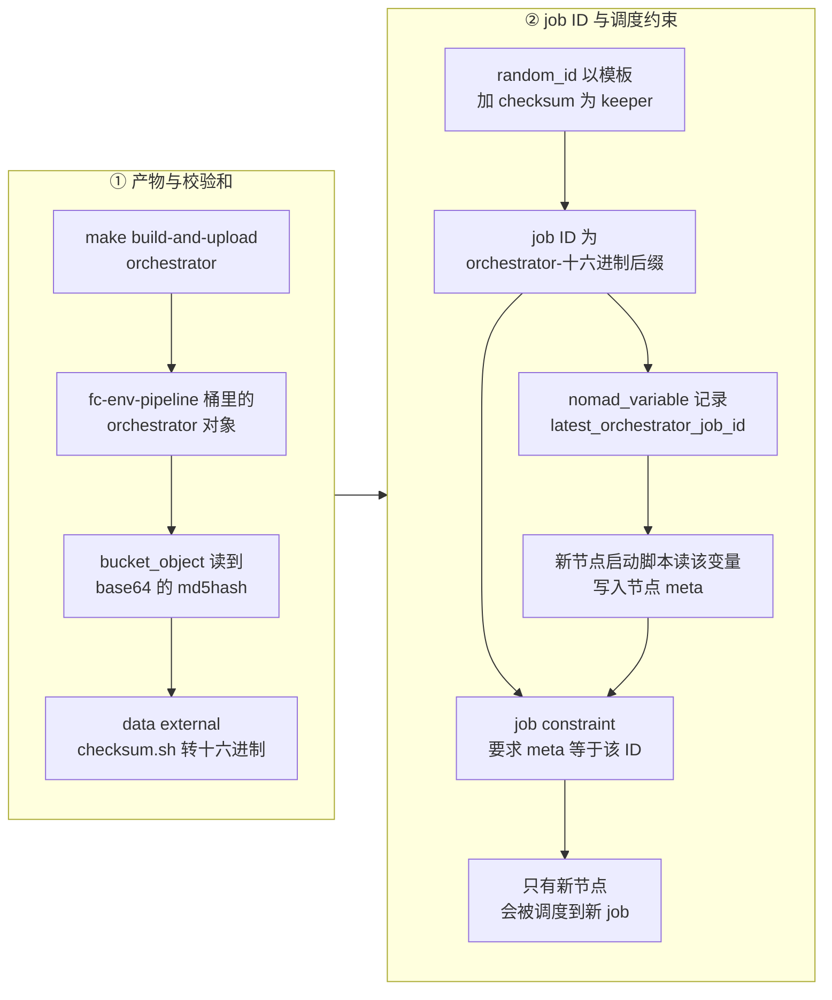
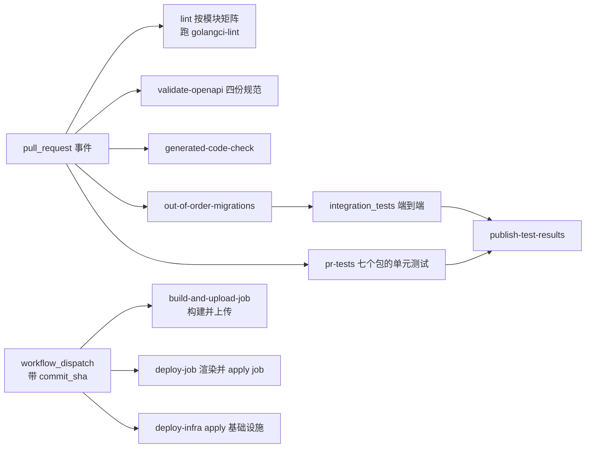

# 65 · 构建与发布

> 同一个仓库里的十来个 Go 程序，有的打成 Docker 镜像推进制品仓库，有的编译成裸二进制传进对象存储；
> 有两个进程共用同一个可执行文件，只靠一个环境变量区分身份。本篇讲清楚这套构建产物矩阵怎么来的、
> 版本号到底由什么决定、CI 做什么不做什么，以及一个新编译出来的二进制要经过哪几道间接层才会真的跑起来。
>
> **读者**：工程师、平台工程师。
> **预备**：[第 09 篇 · Nomad、Consul 与 Terraform](09-nomad-consul-terraform.md)；
> [第 64 篇 · Nomad job 详解](64-nomad-jobs.md) 讲每个 job 的内部结构，本篇只讲产物怎么进到 job 里。
> **代码**：`Makefile`、`packages/*/Makefile`、`packages/*/Dockerfile`、`scripts/`、`VERSION`、
> `.tool-versions`、`.github/workflows/`、`iac/provider-gcp/nomad/main.tf`

---

## 0. 本篇要回答的问题

1. 一个仓库里的进程，凭什么决定它出 Docker 镜像还是出裸二进制？两条路各自的代价是什么？
2. `orchestrator` 和 `template-manager` 是同一个可执行文件，这件事在构建系统里是怎么体现的？
3. `VERSION` 文件里的那个数字，在整套系统里被谁读过？发布的真正标识符是什么？
4. 一个刚上传的二进制，要经过多少道间接层才会变成节点上运行的进程？
5. CI 保证了什么？它检查代码生成的一致性，为什么偏偏漏掉了 `dashboard-api`？

---

## 1. 两种产物形态，和它们各自的理由

上游 2026.09 的 `packages/` 下有十三个目录，其中会变成线上运行进程的有九个。
它们的构建产物不是一种形态，而是两种：**Docker 镜像**与**裸二进制**。

分界线不是历史遗留，而是跟着**运行它的 Nomad task driver** 走的。
`iac/` 里的 job 有两类 driver：`docker` 和 `raw_exec`。用 `docker` driver 的 task 只需要一个镜像引用；
用 `raw_exec` 的 task 直接在宿主上执行一个文件，Nomad 通过 `artifact` 块把这个文件下载到分配目录里。
于是构建端的选择被运行端反向决定了。

那么为什么不统一？为什么不让所有进程都跑在容器里？

因为 orchestrator 这一类进程做的事情容器化代价很高：它要操作 `/dev/kvm`、创建和进入 netns、
挂载 hugetlbfs、绑定 NBD 设备、以 root 身份 fork 出 Firecracker 进程并让这些进程活得比它自己久
（细节见[第 25 篇 §4](25-orchestrator-process.md#4-进程持有的共享资源)与
[第 28 篇 §7](28-firecracker-process-management.md#7-为什么不用-jailer以及后果)）。
把它塞进容器意味着几乎要把所有隔离都打开，容器带来的隔离收益归零，
却仍要付出镜像分发、命名空间穿透与调试困难的成本。反过来，api、client-proxy 这些无状态的网络服务
不碰宿主内核，容器化的收益（依赖封装、原子替换、回滚方便）是实打实的。

代价也很清楚：裸二进制这条路上，**依赖靠约定而不是靠打包保证**。
`packages/orchestrator/Dockerfile` 的第一行注释把这个约定写了出来：

```dockerfile
# It has to match with the host OS version (Ubuntu 22.04 = bookworm)
ARG DEBIAN_VERSION=bookworm
```

orchestrator 用 `CGO_ENABLED=1` 编译（见 `packages/orchestrator/Makefile` 的 `build-local` 目标），
产物动态链接 glibc，所以编译镜像的 glibc 版本必须不高于宿主的。
这条约束没有任何机器检查，只有一行注释；换宿主发行版就要同步改这里。
这也正是 ARM 适配版必须动这个文件的原因之一（[§8](#8-arm-适配版的差异)）。

---

## 2. 产物矩阵

把「进程 × 形态 × 去向」列成一张表，是理解整个构建系统最快的方式。
表中「触发目标」指在仓库根执行的 make 目标。

| 进程 | 形态 | 去向 | 触发目标 |
|---|---|---|---|
| api | Docker 镜像 | Artifact Registry `<prefix>core/api:latest` | `build-and-upload/api` |
| db-migrator | Docker 镜像 | `<prefix>core/db-migrator:latest` | `build-and-upload/api`（顺带） |
| clickhouse-migrator | Docker 镜像 | `<prefix>core/clickhouse-migrator:latest` | `build-and-upload/clickhouse-migrator` |
| client-proxy | Docker 镜像 | `<prefix>core/client-proxy:latest` | `build-and-upload/client-proxy` |
| docker-reverse-proxy | Docker 镜像 | `<prefix>core/docker-reverse-proxy:latest` | `build-and-upload/docker-reverse-proxy` |
| dashboard-api | Docker 镜像 | `<prefix>core/dashboard-api:latest` | `build-and-upload/dashboard-api` |
| orchestrator | 裸二进制 | GCS `<prefix>fc-env-pipeline/orchestrator` | `build-and-upload/orchestrator` |
| template-manager | 裸二进制（同上） | GCS `<prefix>fc-env-pipeline/template-manager` | `build-and-upload/template-manager` |
| clean-nfs-cache | 裸二进制 | GCS `<prefix>fc-env-pipeline/clean-nfs-cache` | `build-and-upload/clean-nfs-cache` |
| envd | 裸二进制 | GCS `<prefix>fc-env-pipeline/envd` | `build-and-upload/envd` |
| nomad-nodepool-apm | 裸二进制 | GCS `<prefix>fc-env-pipeline/nomad-nodepool-apm` | `build-and-upload/nomad-nodepool-apm` |

几处需要说明。

**镜像标签只有 `latest`。** 六个镜像的 `IMAGE_REGISTRY` 变量里都不带标签，
`docker buildx build --tag $(IMAGE_REGISTRY) --push` 推上去就是 `:latest`。
仓库里没有任何地方给镜像打版本标签。这意味着制品仓库里不保留可回滚的历史版本，
回滚的办法是签出旧 commit 重新构建。

**`build-and-upload/api` 会顺带构建 db-migrator。** 根 `Makefile` 里这个目标显式写了两行，
先进 `packages/api` 再进 `packages/db`。原因在 job 结构里：`iac/provider-gcp/nomad/jobs/api.hcl`
把 db-migrator 作为 `lifecycle { hook = "prestart" }` 的一次性 task 放在 api 的同一个 group 里，
每次 api 起来之前先跑一遍迁移。两者必须同步更新，构建目标就把它们绑在了一起。

**GCS 上传统一带 `Cache-Control: no-cache, max-age=0`。** 五个上传目标都写了这个头
（`gsutil -h "Cache-Control:no-cache, max-age=0" cp ...`）。对 envd 来说这不是可选项：
`iac/provider-gcp/nomad-cluster/scripts/start-client.sh` 用 gcsfuse 把 `fc-env-pipeline` 桶
只读挂载到宿主的 `/fc-envd`，而 orchestrator 构建模板时从
`packages/orchestrator/internal/cfg/model.go` 里默认值为 `/fc-envd/envd` 的 `HOST_ENVD_PATH` 读取它。
中间隔着一层 FUSE 和一层 HTTP 缓存，不禁掉缓存就可能读到旧的 envd
（envd 怎么进 rootfs 见[第 48 篇 §2.1](48-envd-overview.md#21-二进制怎么进-rootfs怎么被拉起)）。

**`packages/nomad-nodepool-apm/Dockerfile` 在构建流程里没有被用到。** 该包的 `build` 目标是直接
`go build`，`build-and-upload` 是 `build` 加 `upload`，两处都不调用 docker。
推论：这个 Dockerfile 是早期从镜像里抽取插件二进制的做法留下的，现已改为直接编译。

---

## 3. Makefile 的三层结构

构建入口是三层嵌套，每层职责不同。

**第一层，仓库根 `Makefile`。** 它只做分发与确认，不含任何编译命令：

```makefile
build/%:
	$(MAKE) -C packages/$(notdir $@) build

build-and-upload/%:
	./scripts/confirm.sh $(TERRAFORM_ENVIRONMENT)
	GCP_PROJECT_ID=$(GCP_PROJECT_ID) $(MAKE) -C packages/$(notdir $@) build-and-upload
```

三个进程需要特例，写在通配规则前面：`orchestrator`、`template-manager`、`clean-nfs-cache`
都要进 `packages/orchestrator`，`clickhouse-migrator` 要进 `packages/clickhouse`，
`api` 要进两个目录。不带斜杠的 `build-and-upload` 是把全部十个子目标列为依赖的聚合目标。
注意 `.PHONY: build` 声明了一个并不存在的 `build` 规则，只有 `build/<name>` 形式可用。

`scripts/confirm.sh` 是一道人工闸门：目标环境不是 `dev` 时，它要求当前分支必须是 `main`，
并且要在终端里手工输入 `production` 才继续。CI 里通过环境变量 `AUTO_CONFIRM_DEPLOY=true` 跳过。
这条设计的取向很明确 —— 本地误操作的代价高于自动化的便利。

**第二层，`packages/<name>/Makefile`。** 它决定编译参数与产物去向。
所有包的头部都是同一段：读 `../../.last_used_env` 得到当前环境名，
`-include` 对应的 `.env.<env>` 文件，再由 `PROVIDER` 变量在 GCP 与 AWS 之间选择制品仓库或桶前缀。
换句话说，**构建产物的地址来自本地环境文件，而不是命令行参数**；
忘了 `make switch-env` 就会把镜像推到别的环境去。

编译参数上有两处值得记：

- 所有 Go 程序都用 `-ldflags "-X=main.commitSHA=$(COMMIT_SHA)"` 把 `git rev-parse --short HEAD`
  编进二进制，运行时打进日志与 OpenTelemetry 资源属性（`packages/api/main.go`、
  `packages/orchestrator/main.go` 都在启动日志里带上它）。
- `CGO_ENABLED` 不统一：orchestrator 是 `1`，api、client-proxy、envd、docker-reverse-proxy、
  nomad-nodepool-apm 是 `0`。前者因此不能用 `scratch`/`alpine` 作运行底座，
  后者可以，也确实这么做了（api 与 client-proxy 的 Dockerfile 末尾是 `FROM alpine`）。

**第三层，`packages/<name>/Dockerfile`。** 六个出镜像的包用的是标准的两阶段构建：
先按 `go.mod`/`go.sum` 单独 `RUN go mod download` 做依赖层缓存，再拷源码，
再 `RUN --mount=type=cache,target=/root/.cache/go-build make build`。
这个顺序是为了让改代码不触发重新下载依赖。

`packages/orchestrator/Dockerfile` 是个例外，它的最后一段是：

```dockerfile
FROM scratch

COPY --from=builder /build/orchestrator/bin/clean-nfs-cache .
COPY --from=builder /build/orchestrator/bin/orchestrator .
```

配合 `packages/orchestrator/Makefile` 的
`docker build --platform linux/amd64 --output=bin ... -f ./Dockerfile ..`，
这里**用 Docker 当交叉编译的载体，而不是当运行时**：`--output=bin` 让 BuildKit 把最终阶段的
文件系统导出到宿主的 `bin/` 目录，`FROM scratch` 保证导出的只有两个二进制。
收益是 macOS 上的开发者也能产出与线上宿主 ABI 一致的 Linux 二进制；
代价是本地构建强依赖 BuildKit，且这一步不能离线做（要拉 golang 基础镜像、要下 Go 依赖）。

### 3.1 一个二进制，两个名字

`packages/orchestrator/Makefile` 里三个 upload 目标是这样的：

```makefile
upload/orchestrator:
	gsutil -h "Cache-Control:no-cache, max-age=0" cp ./bin/orchestrator "gs://${GCP_BUCKET_PREFIX}fc-env-pipeline/orchestrator"

upload/template-manager:
	gsutil -h "Cache-Control:no-cache, max-age=0" cp ./bin/orchestrator "gs://${GCP_BUCKET_PREFIX}fc-env-pipeline/template-manager"
```

两个目标上传的是**同一个本地文件** `bin/orchestrator`，只是在桶里落成两个对象名。
区分身份的是运行时环境变量：`packages/orchestrator/internal/cfg/model.go` 里
`Services []string` 绑定 `ORCHESTRATOR_SERVICES`，默认值 `orchestrator`；
`iac/provider-gcp/nomad/main.tf` 给 template-manager 那个 job 传的是
`orchestrator_services = "template-manager"`。同一份代码按这个列表决定注册哪些 gRPC 服务
（[第 46 篇 §1](46-template-manager-service.md#1-一个二进制两个角色)讲这两个角色的边界）。

这个安排的收益是共享代码零成本：模板构建要用到的块存储、rootfs、Firecracker 管理逻辑
与运行沙箱完全同源，不会出现两份实现漂移。
代价有两条：一是二进制体积与依赖是两个角色的并集，template-manager 节点上装着它用不到的代码；
二是**两个对象名可以指向不同版本** —— 只跑 `build-and-upload/orchestrator` 而不跑
`build-and-upload/template-manager`，桶里两个对象就不一致了，而没有任何检查会提示这一点。

---

## 4. 版本号：`VERSION` 文件管什么

仓库根有一个 `VERSION` 文件，内容是 `0.1.4`。根 `Makefile` 有一个目标：

```makefile
version:
	./scripts/increment-version.sh
```

`scripts/increment-version.sh` 读 `VERSION`，交给 `scripts/semver.sh -p`（patch 位加一），写回去。
`scripts/semver.sh` 是一个通用的三段式版本号自增脚本，支持 `-M`/`-m`/`-p`。

关键的事实是：**在上游 2026.09 的代码里，除了 `increment-version.sh`，没有任何地方读这个文件**。
镜像标签是 `latest`，GCS 对象名没有版本后缀，Terraform 不读它，CI 不读它。
进程自报的版本号是源码里的常量而不是这个文件：`packages/orchestrator/main.go` 里
`const version = "0.1.0"`，`packages/api/main.go` 里 `serviceVersion = "1.0.0"`，
两者都没跟 `VERSION` 对齐。

那么什么才是发布的真实标识符？三个层次：

| 层次 | 标识符 | 谁产生 | 谁消费 |
|---|---|---|---|
| 源码 | 短 commit SHA | `git rev-parse --short HEAD` | 编进二进制，进日志与遥测 |
| 制品 | 内容哈希 | 制品仓库的镜像 digest / GCS 对象的 md5 | Terraform 数据源 |
| 部署 | job ID 后缀 | `random_id.orchestrator_job` | Nomad 调度约束 |

也就是说，e2b 上游的发布单位是 **commit**，不是语义化版本。
`.github/workflows/` 下没有 tag 触发的 release 流程，三个部署工作流的入参都是 `commit_sha`。
`VERSION` 文件与 `make version` 是留给外部使用者的一个入口，本身不参与流水线。

另有一个与版本相邻但性质不同的量：**期望的迁移时间戳**。
`packages/api/Makefile` 在构建时执行 `scripts/get-latest-migration.sh`，
该脚本用 `git ls-tree --name-only HEAD ../db/migrations/*` 取出最大的 14 位时间戳，
经 `-X=main.expectedMigrationTimestamp` 编进 api 二进制。启动时
`packages/db/client/migration.go` 的 `CheckMigrationVersion()` 比对数据库里 goose 记录的版本，
低于期望值就 `Fatal` 退出，高于则放行（注释写明是为了容忍回滚与超前迁移）。
这把「代码与库结构不匹配」从运行期的偶发错误变成了启动期的确定性失败
（迁移本身见[第 58 篇 §5](58-postgres-schema-and-migrations.md#5-迁移goosemigrator-容器与在线安全)）。
它的一个隐含依赖是脚本用 `git ls-tree HEAD` 而非扫描目录 —— 在没有 git 元数据的源码包里构建会拿不到值，
此时 `strconv.ParseInt` 失败，代码把期望值降级为 `0`，检查静默失效。

工具链版本则集中在 `.tool-versions`：golang 1.25.4、golangci-lint 2.8.0、terraform 1.5.7、
packer 1.13.1、buf、protoc 及三个 protoc 插件。CI 用 `wistia/parse-tool-versions` 把它读成环境变量。
但各 `Dockerfile` 里的 `ARG GOLANG_VERSION=1.25.4` 是硬写的第二份副本，
推论：两者只能靠人工保持一致。

---

## 5. 从对象存储到运行进程

裸二进制这条路上，从「传上去了」到「跑起来了」中间有四道间接层。以 orchestrator 为例。



逐段说明：

**第一道：md5 的编码转换。** `iac/provider-gcp/nomad/main.tf` 里
`data "google_storage_bucket_object" "orchestrator"` 给出的 `md5hash` 是 base64 的，
而 Nomad `artifact` 块的 `checksum` 要十六进制。仓库为此写了一个五行的外部程序
`iac/provider-gcp/nomad/scripts/checksum.sh`，用 `base64 -d | xxd -p` 转换，
以 `data "external"` 的形式接进 Terraform。template-manager、clean-nfs-cache、
nomad-nodepool-apm 各有一份同样的三件套。

**第二道：校验和进入 job。** `iac/provider-gcp/nomad/jobs/template-manager.hcl` 的
artifact 块写成 `options { checksum = "md5:${template_manager_checksum}" }`，
Nomad 下载后校验。orchestrator 走的是另一条：
`local.orchestrator_artifact_source` 在 `dev` 环境把哈希拼进 URL 的 `?version=` 查询参数，
生产环境则用不带参数的裸 URL。推论：dev 上这么做是为了让 URL 随内容变化，
绕开 go-getter 的下载缓存，从而支持频繁替换同名对象。

**第三道：内容变化转成新的 job ID。** `iac/modules/job-orchestrator/main.tf` 先用一个占位符
渲染一遍 job 模板得到 `orchestrator_job_check`，再把它和 `orchestrator_checksum` 一起
`sha256` 成 `random_id.orchestrator_job` 的 keeper。只要 job 定义或二进制内容变了，
`random_id` 就重新生成，job 名字从 `orchestrator-<旧>` 变成 `orchestrator-<新>`。
`nomad_job` 资源上写着 `deregister_on_id_change = false`，所以旧 job 不会被注销。

**第四道：节点元数据决定谁跑新版本。** 新 job 带一条约束，要求节点的
`meta.orchestrator_job_version` 等于新 ID；`iac/provider-gcp/nomad-cluster/scripts/start-client.sh`
在启动 Nomad 客户端之前，先从 Nomad 变量 `nomad/jobs` 里读 `latest_orchestrator_job_id`
（最多重试 600 秒，取不到就退出），把它作为 `--orchestrator-job-version` 传给
`run-nomad.sh` 写进节点 meta。

四道加起来的效果是：**orchestrator 的发布不是原地重启，而是换机器。**
新版本只落在新加入集群的节点上，旧节点继续跑旧 job 直到被替换。
收益是节点上运行的沙箱不会因为一次发布而被中断 —— 沙箱是有状态的，重启 orchestrator
代价远高于重启一个无状态服务。代价是发布周期取决于节点轮换速度，
且集群会在一段时间里同时存在两个版本的 orchestrator，跨版本的 gRPC 兼容性必须自己保证。
这套滚动机制的完整形态在[第 63 篇 §6.2](63-gcp-terraform.md#62-start-clientsh-做了什么)与
[第 64 篇 §4](64-nomad-jobs.md#4-沙箱节点上的-orchestrator)里展开。

镜像那条路要简单得多。`iac/provider-gcp/nomad/images.tf` 里六个
`data "google_artifact_registry_docker_image"` 数据源，`image_name` 固定写成 `api:latest`、
`client-proxy:latest` 这类形式，`self_link` 传进 job 模板作为 `config { image = ... }`。
推论：该数据源的 `self_link` 是带 digest 的完整引用，所以 Terraform 每次 plan 重新解析 `latest`
时，若镜像已更新就会产生 job 变更；也正因如此，只 push 镜像而不跑 Terraform 不会触发任何部署。

### 5.1 公共产物：内核与 Firecracker

还有一类产物不由本仓库构建。`make copy-public-builds` 把 e2b 官方公开桶
`gs://e2b-prod-public-builds` 下的 `kernels/` 与 `firecrackers/` 复制到部署者自己的
`<prefix>fc-kernels` 与 `<prefix>fc-versions` 桶。GCP 分支是桶到桶直拷；
AWS 分支必须先 `gsutil` 下载到本地 `.kernels`/`.firecrackers`，再 `aws s3 cp` 上去，最后删掉临时目录。
`deploy-infra.yml` 在 `apply-init` 之后、`plan-without-jobs` 之前执行它，顺序上是必须的：
节点池的启动脚本会挂载这两个桶。

另外两个目标 `download-public-kernels` 与 `download-public-firecrackers` 是给本地开发用的，
把同样的内容拉到工作树里的 `packages/fc-kernels/`、`packages/fc-versions/builds/`
（这两个目录不在版本库里，是运行时创建的），后者还要 `chmod +x`。
本地开发的完整流程见[第 66 篇 · 本地开发环境](66-local-development.md)。

---

## 6. 代码生成与一致性检查

`make generate` 是一个聚合目标：

```makefile
generate: generate/api generate/orchestrator generate/client-proxy generate/envd \
          generate/db generate/shared generate-tests generate-mocks
```

前六个转成 `$(MAKE) -C packages/<name> generate`，各包内是 `go generate ./...`，
背后是 oapi-codegen（OpenAPI 客户端与服务端桩）、buf/protoc（gRPC 与 Connect-RPC）、
sqlc（`packages/db` 的查询代码，它的 `generate` 还会先 `rm -rf queries/*.go`）。
`generate-tests` 只有 `tests/integration` 一个成员，`generate-mocks` 是
`go run github.com/vektra/mockery/v3@v3.5.0`。

**`dashboard-api` 不在这个列表里。** 但 `packages/dashboard-api/Makefile` 有 `generate` 目标，
`packages/dashboard-api/internal/api/generate.go` 里也确实有一条 oapi-codegen 指令，
输入是 `spec/openapi-dashboard.yml`。后果是：改了 dashboard 的 OpenAPI 规范而忘了手动跑
`make -C packages/dashboard-api generate`，仓库里的生成代码就与规范不一致，
而下面要讲的一致性检查发现不了。同一个盲区在别处也出现了 ——
`.github/workflows/validate-openapi.yml` 的矩阵列了 `spec/openapi.yml`、`openapi-edge.yml`、
`openapi-hyperloop.yml` 和 `packages/envd/spec/envd.yaml` 四份规范，
唯独没有 `spec/openapi-dashboard.yml`。`packages/dashboard-api/Makefile` 也没有 `lint` 与
`build-debug` 目标。推论：dashboard-api 是较晚加入的包，接线尚未补齐。

一致性由 `.github/workflows/pr-no-generated-changes.yml` 保证，它按顺序做六件事：

1. `make tidy` —— 即 `scripts/golang-dependencies-integrity.sh`，
   遍历 `go work edit -json` 列出的每个模块跑 `go mod tidy`，再用 `modfmt` 格式化 `go.mod`，
   最后 `go work sync`；
2. `scripts/fix-tracers.sh`；
3. 用 mise 安装 buf、protoc 与三个插件；
4. `make generate`，工作流里特意注释了「不能并行，有竞态」；
5. `make fmt` —— `golangci-lint fmt` 加 `terraform fmt -recursive`；
6. 比较工作树：有 diff 就打印出来。

第 6 步的处理分两种。同仓库 PR 上，工作流用 GitHub App token 把生成的改动自动提交回 PR 分支，
**然后仍然以失败退出**（这样 PR 作者会看到失败，且新提交会重新触发流水线）；
fork 的 PR 与 `push-main.yml` 上则 `commit: false`，直接失败并提示作者本地跑 `make generate`。

---

## 7. CI 流水线

`.github/workflows/` 下的十五个工作流分成四组，边界很清楚：**PR 与 main 上只做检查，
部署全部是手工触发。**



几点值得记：

- **lint 是按 Go 模块并行的。** `lint.yml` 先用 `go list -m -json | jq` 把工作区里的模块列出来，
  再以矩阵形式每个模块一个 runner。本地的 `make lint` 则是
  `xargs -P 4 ... golangci-lint run {}/... --fix`，注意本地这条会**改文件**。
- **根 `make test` 在完整仓库里跑不通。** 它的实现是 `go work edit -json | jq` 取出工作区里所有
  路径含 `packages` 的模块，逐个 `make -C <dir> test`。但 `packages/auth` 没有 `Makefile`，
  `packages/clickhouse` 与 `packages/local-dev` 的 `Makefile` 里没有 `test` 目标，
  这个聚合目标必然以非零状态结束。CI 不用它：`pr-tests.yml` 把要跑测试的包显式列成七行矩阵
  （api、client-proxy、db、docker-reverse-proxy、envd、orchestrator、shared）。
  推论：`make test` 是工作区扩张之前留下的入口，真正的测试清单维护在工作流文件里。
- **单元测试里有两个包需要 root。** `pr-tests.yml` 的矩阵给 `packages/envd` 与
  `packages/orchestrator` 标了 `sudo: true`，跑之前还要把宿主准备好：
  打开 `/proc/sys/vm/unprivileged_userfaultfd`、挂 hugetlbfs 并预留 2000 个大页、
  `modprobe nbd nbds_max=256`，还要加一条 udev 规则关掉 NBD 设备的 inotify 监听。
  这几行 CI 配置其实是 orchestrator 对宿主环境要求的最短清单
  （测试体系见[第 62 篇 §2.2](62-testing.md#22-需要-root-与内核能力的单元测试)）。
- **集成测试跑在自建 runner 上。** `integration_tests.yml` 的 `runs-on: infra-tests`，
  流程是构建各包的 debug 版、初始化宿主、构建一个沙箱模板、拉起各服务、跑
  `make test-integration`，最后还会 grep 服务日志里的 `WARNING: DATA RACE` 并把它当作错误
  —— 因为服务是用 `build-debug`（带 `-race`）编出来的。
- **迁移顺序有专门的检查。** `out-of-order-migrations.yml` 取 `origin/main` 上
  `packages/db/migrations/` 里最大的 14 位时间戳，要求 PR 新增的迁移文件严格大于它。
  这防止了两个并行 PR 各自加迁移、合并后顺序错乱。
- **三个部署工作流都是 `workflow_dispatch`。** `build-and-upload-job.yml` 接受分号分隔的
  job 名列表，循环执行 `make build-and-upload/<name>`；`deploy-job.yml` 循环执行
  `make plan-only-jobs/<name>` 再 `make apply`；`deploy-infra.yml` 依次做
  `apply-init`、`copy-public-builds`、`plan-without-jobs`、`apply`。
  三者共用 `concurrency: group: deploy-${{ inputs.environment }}` 且
  `cancel-in-progress: false`，保证同一环境上的部署串行、不会被后来的取消。
  秘密从 Infisical 取，构建产物的仓库地址由 `deploy-setup` 这个 composite action 注入。

于是完整的发布动作是三步，而且必须按序：先 `build-and-upload-job` 把产物推到仓库或桶里，
再 `deploy-job` 让 Terraform 重新读取产物哈希并更新 job，必要时用 `deploy-infra` 更新基础设施。
只做第一步不会有任何东西上线，这与第 5 节讲的间接层是一回事。

---

## 8. ARM 适配版的差异

ARM 补丁没有动仓库根 `Makefile`、`scripts/` 和 `VERSION`，改的是各包的 `Makefile` 与 `Dockerfile`。
两类改动：一是把写死的 `linux/amd64`、`GOARCH=amd64` 换成由 `uname -m` 推导的 `PLATFORM` 变量
（`packages/api/Makefile`、`packages/envd/Makefile` 等都加了同一段 `ifeq` 判断，遇到未知架构直接报错）；
二是把多阶段构建改成**单阶段运行时镜像** —— `packages/orchestrator/Dockerfile` 变成
`FROM ubuntu:24.04` 加装 `iptables`、`iproute2`、`rsync`，然后 `COPY orchestrator /usr/bin/orchestrator`，
编译由 `packages/orchestrator/Makefile` 里改成直接 `go build` 的 `build` 目标在宿主上完成。
这样构建镜像时不再需要拉 golang 基础镜像、不再需要联网下载 Go 依赖，
适配的是无外网的离线环境；代价是构建产物的可复现性从 Dockerfile 转移到了宿主工具链上。
另外 orchestrator 从裸二进制变成了镜像，是因为部署形态换成了 Kubernetes。
详见[第 78 篇 · 部署形态一：Helm / Kubernetes](78-helm-k8s-deployment.md)、
[第 80 篇 · 部署形态三：单机离线 RPM](80-single-node-rpm.md)与
[第 85 篇 · 开发与出包工作流](85-dev-workflow-and-packaging.md)。

---

## 9. 小结

- 产物形态由运行端的 Nomad task driver 反推：`docker` driver 的进程出镜像，
  `raw_exec` 的进程出裸二进制。裸二进制这条路把「编译环境的 glibc 不高于宿主」变成了一条
  只写在注释里的约定。
- 六个镜像全部只打 `latest` 标签，制品仓库里不保留可回滚的历史版本；回滚等于重新构建旧 commit。
- orchestrator 与 template-manager 是同一个可执行文件的两个对象名，
  身份由 `ORCHESTRATOR_SERVICES` 决定。两个对象可能指向不同版本，没有检查能发现。
- `VERSION` 文件在上游 2026.09 里只被 `make version` 自己读写，不进入任何产物。
  发布的真实标识是 commit SHA、内容哈希与 job ID 后缀这三层。
- api 的构建把最新迁移的时间戳编进二进制，启动时比对数据库版本，低于期望值就直接退出。
  该时间戳来自 `git ls-tree HEAD`，在无 git 元数据的环境里会静默降级为 0。
- 裸二进制从上传到运行要经过四道间接层：base64 转十六进制、校验和进 job、
  内容哈希转成新 job ID、节点 meta 约束。结果是 orchestrator 的发布靠换节点完成，
  而不是原地重启。
- 镜像那条路上，只 push 不跑 Terraform 不会触发任何部署。
- `make generate` 覆盖六个包，`dashboard-api` 不在其中；`validate-openapi` 的矩阵同样漏掉了
  `spec/openapi-dashboard.yml`。这两处盲区让 dashboard-api 的生成代码可能与规范不一致而不被发现。
- CI 只做检查，三个部署工作流全部手工触发、按环境串行；完整发布是
  `build-and-upload-job` → `deploy-job`（必要时加 `deploy-infra`）三步。

## 延伸阅读 / 下一篇

- [第 63 篇 §2](63-gcp-terraform.md#2-init一次性的项目级资源)：桶与制品仓库是谁建的，本篇的产物落在哪里。
- [第 64 篇 §2](64-nomad-jobs.md#2-读一份-jobspec-要看的六件事)：每个 job 的 driver、资源与约束。
- [第 66 篇 §6](66-local-development.md#6-三个服务的-run-local)：不上传、只在本机跑起来的那条路径。
- [第 62 篇 · 测试体系](62-testing.md)：CI 里跑的那些测试各自覆盖什么。
- [第 14 篇 §1](14-config-flags-versions.md#1-配置的四条渠道)：环境变量与 feature flag 的读取位置。
- [第 85 篇 §4](85-dev-workflow-and-packaging.md#4-四个仓库怎么汇成一个包)：ARM 适配版怎么从源码到 RPM。
