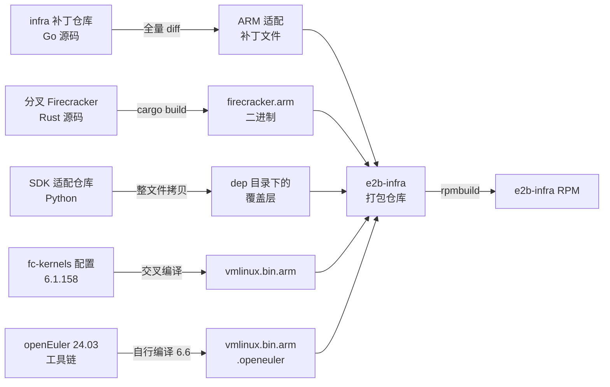
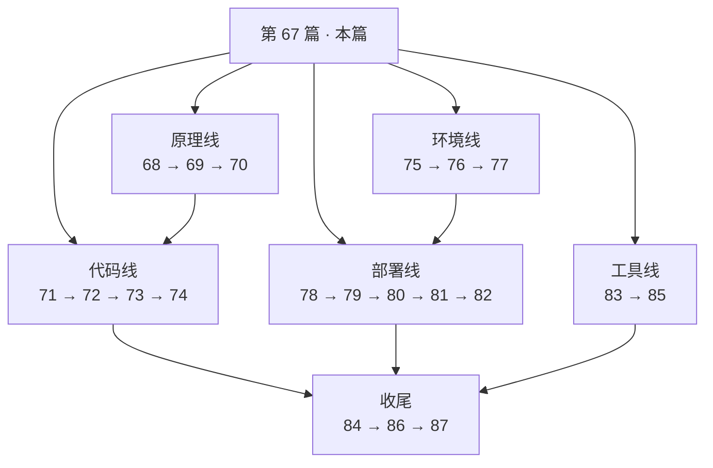

# 67 · ARM 适配总览

> 上游 2026.09 是为 x86_64、Ubuntu guest、GCP 托管环境写的。把它搬到鲲鹏 + openEuler +
> 无外网的私有机房，需要改 94 个文件、5293 行。本篇给出这些改动的全景：目标平台有哪五个前提、
> 改动按什么维度分成五类、四个开发仓库怎么汇成一个可安装的包、哪些改动可以回退、以及第十部分该怎么读。
>
> **读者**：本项目所有参与者；读上游各篇时想知道「ARM 上是不是一样」的读者。
> **预备**：[第 10 篇 · 系统架构总览](10-system-architecture.md)。
> **代码**：`git diff f8c2f0cde fbee6fcd1`（ARM 补丁全文）、`e2b-infra.spec`、`fc-kernels-arm/`

---

## 0. 本篇要回答的问题

1. 目标平台与上游假设的运行环境差在哪里？差异有几个来源？
2. 5293 行改动都花在什么地方？哪些是真正的架构适配，哪些不是？
3. 每一个被改的文件属于哪一类？
4. 四个开发仓库分别以什么形态进入最终交付物？为什么形态不同？
5. 哪些改动是不得不做的，哪些是可以回退的？回退的判据是什么？
6. 第十部分的二十篇该按什么顺序读？

---

## 1. 目标平台：五个不成立的前提

上游 2026.09 的代码里到处是对运行环境的假设。这些假设在 e2b 自己的生产环境里成立，
在目标平台上有五条不成立。先把这五条列清楚，后面所有改动都能挂到其中一条上。

**其一，CPU 不是 x86_64。** 目标机是鲲鹏 920B 与鲲鹏 950，aarch64。
这条直接影响：Firecracker 传给 guest 的内核命令行（`pci=off`、`i8042.*`、`clocksource=kvm-clock`
都是 x86 概念）、嵌入在 orchestrator 二进制里的 busybox、构建期拉取 OCI 镜像时的默认平台、
`gopsutil` 从 `/proc/cpuinfo` 能读到什么字段，以及最要紧的一条 —— userfaultfd 写保护在
aarch64 + HugeTLB 上的可用性（[第 72 篇 §2](72-uffd-on-arm.md#2-为什么这三行在-aarch64-上留不住)）。

**其二，guest 不是 Ubuntu。** 模板的基础镜像换成 openEuler，
于是构建期在 guest 里跑的 `provision.sh` 不能只认 `apt-get`，包名与包集合也要换
（[第 74 篇](74-template-build-on-arm.md)）。

**其三，宿主不是 e2b 定制的 Ubuntu 节点镜像。** 上游用 Packer 烤一个节点镜像，
里面 cgroup v2、hugepages、nbd、目录布局全部就位。目标环境是既有的 openEuler 机器，
cgroup 可能是 v1，`/proc/sys/vm/nr_hugepages` 的写法在 arm64 上要换成
`/sys/kernel/mm/hugepages/hugepages-2048kB/` 下的节点（`init-client.sh`，
[第 82 篇 §4.2](82-host-kernel-nbd-hugepages.md#42-写哪个文件上游的假设与-arm-的修正)），
nbd 模块要自己编译并固化（[第 82 篇 §3.2](82-host-kernel-nbd-hugepages.md#32-为什么要自己编译模块以及怎么固化)）。

**其四，没有外网，也没有 GCP。** 上游的默认对象存储是 GCS，节点初始化用 `gsutil`
从公共桶拉内核与 Firecracker 二进制，镜像走 GCP Artifact Registry，
入口走 Cloudflare 与 GCP 负载均衡。目标环境全部换成私有部件：对象存储换 MinIO、
镜像仓库换 Harbor、数据库是自建 PostgreSQL、所有二进制随 RPM 一起装。
`e2b-infra/README.md` 的「前提」一节把这份清单写得很直白：自建 PostgreSQL 14 以上、
自建 Harbor、自建 MinIO。

**其五，编排层不一定是 Nomad。** 上游只有 Nomad 一条路。目标环境要同时支持
Nomad（多节点或单机）与 Kubernetes 1.32，于是服务发现必须抽象出接口
（[第 76 篇](76-k8s-discovery.md)），并多出一整套 Helm chart（[第 78 篇](78-helm-k8s-deployment.md)）。

这五条里，只有第一条是「架构相关」的。其余四条是环境替换。
把它们混为一谈，会得出「ARM 适配很难」的错误印象 —— 实际上难的是第一条与第三条，
第二、四、五条是工作量大而机制清楚。

---

## 2. 改动的规模与形状

`git diff --shortstat f8c2f0cde fbee6fcd1` 的结果是 94 个文件、5293 行新增、1129 行删除。
按目录聚合：

| 分区 | 文件数 | 新增 | 删除 | 内容 |
|---|---|---|---|---|
| `iac/` | 20 | 2227 | 762 | 去 GCP 化的 Nomad 集群脚本与 job 定义 |
| `helm/` | 12 | 1751 | 0 | 全新的 Kubernetes 部署形态 |
| Go 源码 | 37 | 892 | 126 | orchestrator、api、shared 三处 |
| `go.mod` / `go.sum` | 6 | 92 | 4 | 引入 `k8s.io/client-go` 与 MinIO SDK |
| Dockerfile / Makefile | 11 | 94 | 202 | 构建方式从「Docker 交叉编译」改为「宿主直接编译」 |
| guest 侧脚本与模板 | 4 | 89 | 18 | `provision.sh`、`configure.sh`、`inittab.tpl`、`envd.service.tpl` |
| busybox 二进制占位 | 2 | 128 | 0 | 见 §5.3 |
| `init-client.sh` | 1 | 20 | 11 | 宿主初始化 |

形状很清楚：**三分之二的行数在部署层（iac + helm），Go 代码只占约一千行。**
而这一千行里，真正与 aarch64 指令集或 KVM 行为相关的不到两百行。
这个比例本身就是本部分的主要结论之一：把一套云原生基础设施搬到私有 ARM 环境，
成本主要不在架构，在环境。

Go 改动集中在三个包，各自的性质不同：

- `packages/orchestrator`（26 个文件）：架构适配 + 宿主兼容 + 参数放宽 + 埋点，四类都有；
- `packages/api`（17 个文件）：几乎全部是为了引入 Kubernetes 服务发现而做的接口穿透；
- `packages/shared`（9 个文件）：新增 MinIO provider 与服务发现接口，以及 feature flag 默认值。

---

## 3. 改动地图

把 94 个文件按「为什么改」分成五类。分类的判据是：**去掉这条改动，系统在什么条件下会坏。**

| 类别 | 判据 | 文件数 |
|---|---|---|
| A 架构相关 | 在 aarch64 上不改就跑不起来或跑错 | 14 |
| B guest 发行版相关 | guest 换成 openEuler 后不改就构建失败 | 5 |
| C 部署环境替换 | 没有 GCP / 要用 MinIO、Harbor、k8s 才需要 | 62 |
| D 参数放宽与兼容降级 | 不改也能跑，但在目标机上容易超时或报错 | 12 |
| E 可观测埋点 | 去掉不影响功能 | 1 |

五类互斥且穷尽，加起来正好 94 个文件。有三个文件其实身兼两职：
`fc/process.go` 同时属 A、D、E，`network/pool.go` 同时属 D、E，`flags.go` 同时属 C、D。
表中按各自最主要的性质只计一次，另一重身份在正文里说明。

### 3.1 A 类：架构相关

| 文件 | 改了什么 | 详见 |
|---|---|---|
| `orchestrator/internal/sandbox/fc/process.go` | `pci=off`、`i8042.nokbd`、`i8042.noaux`、`random.trust_cpu`、`clocksource=kvm-clock` 五个内核参数改为只在 `runtime.GOARCH` 为 `amd64` / `386` 时下发 | [第 71 篇](71-orchestrator-arm-fc-changes.md) |
| `orchestrator/internal/sandbox/fc/client.go` | `setMachineConfig` 里 `smt` 由 `true` 改为 `false`（aarch64 上 Firecracker 会直接返回 `SmtNotSupported`），并整个去掉 `TrackDirtyPages` 字段 | [第 71 篇 §3](71-orchestrator-arm-fc-changes.md#3-machine-configsmt-与-track_dirty_pages) |
| `orchestrator/internal/sandbox/uffd/userfaultfd/userfaultfd.go` | `faultPage` 中给读缺页加 `UFFDIO_COPY_MODE_WP` 的三行被注释掉 | [第 72 篇](72-uffd-on-arm.md) |
| `orchestrator/internal/service/machineinfo/main.go` | `Detect()` 在 `GOARCH == "arm64"` 且 `gopsutil` 未填 `Family` / `Model` 时回退为 `"arm64"` / `"0"` | [第 73 篇](73-cgroup-and-host-compat.md) |
| `orchestrator/.../systeminit/busybox.go` | 由单个 `//go:embed busybox_1.36.1-2` 改为按 `runtime.GOARCH` 在 x86 与 arm64 两份二进制间选择 | [第 74 篇](74-template-build-on-arm.md) |
| `orchestrator/.../systeminit/busybox_1.35_arm64`、`busybox_1.36.1-2_arm64` | 新增的 arm64 busybox 二进制位；只有 `1.35` 那份被 `go:embed` 引用 | §5.3 |
| `orchestrator/.../build/core/oci/oci.go` | `DefaultPlatform.Architecture` 由 `amd64` 硬改为 `arm64` | [第 74 篇 §3](74-template-build-on-arm.md#3-defaultplatform把架构写死在常量里) |
| `packages/{api,clickhouse,client-proxy,db,envd,orchestrator}/Makefile` | 去掉写死的 `GOARCH=amd64` 与 `docker build --platform linux/amd64`；`envd/Makefile` 改为按 `uname -m` 推导 `PLATFORM` | [第 85 篇](85-dev-workflow-and-packaging.md) |

六个 Makefile 里的架构改动与 §3.3 的构建方式改动写在同几行上，
性质上一半属 A、一半属 C；表中放在 A 是因为「写死 amd64」是纯粹的架构假设。

### 3.2 B 类：guest 发行版相关

| 文件 | 改了什么 |
|---|---|
| `orchestrator/.../build/phases/base/provision.sh` | 读 `/etc/os-release` 的 `ID`，对 `openEuler` / `rhel` / `centos` / `fedora` 走 `dnf install --nogpgcheck`，其余走 `apt-get`；包列表相应调整 |
| `orchestrator/.../build/phases/finalize/configure.sh` | 解释器改为 `#!/bin/sh`，用户与用户组创建改用 openEuler 上存在的形式 |
| `orchestrator/.../build/commands/user.go` | 与 `configure.sh` 同款的发行版分支 |
| `orchestrator/.../rootfs/files/envd.service.tpl` | 删掉 6 行 cgroup 相关的 systemd 指令 |
| `orchestrator/.../rootfs/files/inittab.tpl` | 一行换行修正 |

这一类全部展开在[第 74 篇](74-template-build-on-arm.md)。它们只影响**构建期**：
模板构建成功之后，运行期不再依赖这些分支。

### 3.3 C 类：部署环境替换

这是文件数最多的一类，62 个文件，占新增行数的八成以上。它分四组。

| 组 | 文件 | 换掉了什么 | 详见 |
|---|---|---|---|
| 对象存储 | `shared/pkg/storage/storage_minio.go`（新增 300 行）、`storage.go` | 新增 `MinioBucket` provider，并把 `DefaultStorageProvider` 由 `GCPBucket` 改为 `MinioBucket` | [第 75 篇](75-minio-storage.md) |
| 服务发现 | `shared/pkg/clusters/discovery/{interface.go,k8s.go,nomad.go}`、`api/internal/orchestrator/{discovery.go,k8s_discovery.go,nomad_discovery.go,client.go,orchestrator.go,lifecycle.go}`、`api/internal/clusters/{cluster.go,clusters_sync.go,instance.go,discovery/local.go}`、`api/internal/handlers/store.go`、`api/main.go` | 抽出 `ServiceDiscovery` 接口与 `Allocation` 结构，按环境变量 `ORCHESTRATOR_TYPE` 在 Nomad 与 Kubernetes 之间选择 | [第 76 篇](76-k8s-discovery.md) |
| Kubernetes 形态 | `helm/Chart.yaml`、`helm/values-template.yaml`、`helm/templates/*.yaml`（10 个） | 全新增；orchestrator 以 DaemonSet 形式跑，另有 api、edge、template-manager、redis、clickhouse、loki、otel-collector、logs-collector 与一份 RBAC | [第 78 篇](78-helm-k8s-deployment.md) |
| Nomad 形态去 GCP 化 | `iac/provider-gcp/nomad-cluster/scripts/*.sh`（7 个）、`iac/provider-gcp/nomad-cluster-disk-image/setup/*`（3 个）、`iac/provider-gcp/nomad/jobs/*`（10 个）、`.github/actions/host-init/init-client.sh` | 去掉 GCP 磁盘、`gsutil`、Packer 模板变量；改为读 `.env`、从 `/opt/e2b-infra/bin` 就地取二进制；新增 `deploy.sh`、`env.template` 与两个 `uninstall-*.sh` | [第 79 篇](79-nomad-multinode-deployment.md) |

还有三处零散的环境替换：

- 五个 `Dockerfile`（api、client-proxy、db、envd、orchestrator）从「多阶段 Docker 交叉编译 + `FROM scratch`」
  改为「拷贝一个已编译好的二进制 + `FROM ubuntu:24.04`」。这是离线构建的必然结果：
  RPM 的 `%build` 在宿主上直接 `go build`，镜像里只负责装 `iptables`、`iproute2`、`rsync` 这些运行期工具。
- `shared/pkg/feature-flags/flags.go` 里的 `DefaultFirecackerV1_10Version` 与
  `DefaultFirecackerV1_12Version` 都改成了 `"v1.13.1"` —— 这个字符串是**目录名**，
  对应 `/fc-versions/v1.13.1/firecracker`，与 Firecracker 源码版本 1.12 并不一致（[第 70 篇 §4](70-firecracker-fork.md#4-版本命名源码-1121装成-v1131)）。
- 仓库根多出一个 `bin/orchestrator`：一个直接提交进树的编译产物，供 `start-client.sh`
  拷到 `/usr/bin/orchestrator` 与 `/usr/bin/template-manager`。

### 3.4 D 类：参数放宽与兼容降级

| 文件 | 上游值 | ARM 适配版 |
|---|---|---|
| `orchestrator/internal/sandbox/checks.go` | 间隔 20 s、超时 100 ms | 间隔 300 s、超时 60000 ms |
| `orchestrator/internal/sandbox/uffd/uffd.go` | `uffdMsgListenerTimeout` 10 s | 120 s |
| `orchestrator/internal/sandbox/socket/socket.go` | 无超时上限 | 默认 300 s，可由 `SOCKET_WAIT_TIMEOUT_SECONDS` 覆盖 |
| `orchestrator/internal/server/sandboxes.go` | `requestTimeout` 60 s、`acquireTimeout` 15 s、`maxStartingInstancesPerNode` 3、`TryAcquire` | 300 s、300 s、30、改为带超时的 `Acquire` |
| `orchestrator/internal/server/main.go` | 常量并发上限 | 可由 `MAX_STARTING_INSTANCES_PER_NODE` 覆盖 |
| `orchestrator/internal/sandbox/network/pool.go` | 新槽位池 32、复用池 100 | 300、1000 |
| `shared/pkg/feature-flags/flags.go` | `max-sandboxes-per-node` 200、`best-of-k-max-overcommit` 400、`envd-init-request-timeout-milliseconds` 50、预取 fetch/copy worker 16/8 | 10000、1200、120000、32/16 |
| `shared/pkg/grpc/server.go` | 未设 | `MaxConcurrentStreams(1000)`，`MaxConnectionAge` / `MaxConnectionIdle` 显式置 0 |
| `orchestrator/internal/sandbox/cgroup/manager.go` | 无 cgroup v2 时 `NewManager` 返回错误 | 返回可用的空实现；`Initialize` 在 v1 上直接跳过 |
| `orchestrator/internal/sandbox/fc/process.go` | `CLONE_INTO_CGROUP` 放置 FC 进程 | 整段注释掉 |
| `orchestrator/internal/sandbox/block/cache.go` | `WriteAtWithoutLock` 直接写 mmap | 加 `recover`、mmap 空指针检查与偏移范围检查 |
| `envd/internal/host/mmds.go` | `DisableKeepAlives: true` | 改为保留连接，`MaxIdleConns` 10、`IdleConnTimeout` 90 s |
| `api/internal/sandbox/sandbox_features.go` | `parts[1]` 直接取下标 | 先判长度，缺失时置空串 |

这一类的共同点是：**每一条单独看都是把一个「快速失败」的判据放宽成「慢速容忍」。**
放宽的收益是在慢机器、慢存储、冷缓存的条件下不再误杀；代价是真正的故障要更久才被发现。
最明显的一处是健康检查：间隔从 20 s 放到 300 s、超时从 100 ms 放到 60 s 之后，
一个已经僵死的沙箱最坏要五分钟才被标记为不健康。逐条的动机与后果在
[第 71 篇](71-orchestrator-arm-fc-changes.md)、[第 73 篇](73-cgroup-and-host-compat.md)
与[第 77 篇](77-api-and-flags-on-arm.md)。

### 3.5 E 类：可观测埋点

`orchestrator/internal/sandbox/sandbox.go` 的 `ResumeSandbox()` 与
`fc/process.go` 的 `Resume()` 沿恢复路径插入了一串 `[ResumeSandbox]` 前缀的日志，
每条带阶段耗时（毫秒，三位小数）与 `traceID`，把「恢复一个沙箱花了多久」拆成
网络槽位、模板元数据、`fc.NewProcess`、配置 FC、等 uffd socket、软链 rootfs、
`loadSnapshot`、`resumeVM`、设置 MMDS 九段。`network/pool.go` 另有一行池水位日志。
上游已有 OpenTelemetry span 覆盖同样的阶段（`telemetry.ReportEvent`），
这些日志是在没有搭起 trace 后端时的替代手段。[第 84 篇](84-arm-performance.md)
的所有阶段耗时数据都来自这组埋点。

---

## 4. 四个仓库与交付形态

改动不止在 infra 一个仓库里。开发期有四个仓库，最终只有一个能进目标机房 ——
那里没有编译环境、没有外网。四者以三种完全不同的方式汇合：

`e2b-infra.spec` 把这四路收成一个包：

- `Source0` 是**未经修改的**上游 2026.09 tarball，`Patch1` 是全部增量，
  `%prep` 用 `%autosetup -p1` 打上。这个「纯净上游 + 单一补丁」的模型决定了补丁必须是全量的：
  spec 里只有一个补丁位。
- `Source1` 是真实的 arm64 busybox 二进制（2028568 字节的静态 ELF），
  `%prep` 里一句 `cp %{SOURCE1} packages/orchestrator/.../systeminit/` 覆盖源码树里的同名文件。
- `Source4`、`Source6` 是两份 arm64 guest 内核，`Source5` 是 x86 的那份；
  `%install` 按 `%ifarch` 选择装哪些（[第 69 篇](69-guest-kernel-for-arm.md)）。
  两份 arm64 内核的来路并不相同：`vmlinux.bin.arm` 是 6.1.158，与 `fc-kernels-arm/configs/6.1.158.config`
  同一条配置线，用 Ubuntu 22.04 的 aarch64 交叉工具链编出；`vmlinux.bin.arm.openeuler` 是 6.6.0+，
  由 openEuler 24.03 的 gcc 12.3.1 编出，**不在 fc-kernels 的配置线里**
  （两者的 `Linux version` 字符串可直接印证）。下面的图里只有前者挂在 fc-kernels 那条线上。
- `Source8` 是编译好的 Firecracker。它装到 `/opt/e2b-infra/bin/firecracker`，
  再由 `init-client.sh` 拷进 `/fc-versions/v${FIRECRACKER_VERSION}/firecracker` ——
  **真正被 orchestrator 执行的是第二跳的那份**，直接改 `/fc-versions/` 下的文件会在下次安装时被覆盖回去。
- `Source9` 是部署包 `e2b-deploy.tar.gz`，整个解到 `/opt/e2b-infra/`，
  SDK 覆盖层与 `build.sh` 都在其中（[第 80 篇](80-single-node-rpm.md)、[第 83 篇](83-sdk-adaptation.md)）。
- `%build` 设 `GOFLAGS=-mod=vendor` 并删掉 `go.work`，对五个包各跑一次 `make build`。
  这是离线构建的关键：所有依赖必须已在 vendor 树里。

形态不同的原因是各自的约束不同。Go 源码能用补丁，因为它就在 `Source0` 的目录树里；
Rust 源码不能，因为目标机没有 Rust 工具链，带源码过去也编不了；
Python SDK 也不能，因为它不在源码树里，而是 `pip install` 到 site-packages 的第三方包，
只能整文件覆盖。这三条路的详细流程在[第 85 篇](85-dev-workflow-and-packaging.md)。

分叉 Firecracker 侧的 ARM 改动本身很小：只有两个文件。
`scripts/build.sh` 把写死的 `x86_64-unknown-linux-musl` 产物路径改为按 `uname -m` 推导；
`src/firecracker/src/main.rs` 把启动时调用 `resize_fdtable()` 的那段整体注释掉 ——
提交信息记为修复目标发行版上的 coredump。除此之外，分叉相对上游 Firecracker 的改动
与 ARM 无关，属于 e2b 自己的内存直接映射工作（[第 70 篇](70-firecracker-fork.md)）。

---

## 5. 改动的三种性质与可回退性

分类是为了回答一个实际问题：**这套补丁里，哪些将来必须一直带着，哪些可以在条件改善后撤掉？**
按可回退性重新切一刀，五类改动落到三种性质上。

### 5.1 必要的架构适配：不可回退

A 类与 B 类，共 17 个文件。它们对应的是硬事实：aarch64 上没有 i8042 控制器，
openEuler 上没有 `apt-get`。只要目标平台不变，这些改动就得一直在。

它们的合并策略也最清楚：都是加分支而不是改语义
（`runtime.GOARCH` 判断、`/etc/os-release` 判断、`go:embed` 按架构选择），
理论上可以原样提交给上游而不影响 x86 行为。两个例外是 `oci.go` 的 `DefaultPlatform`
与 `client.go` 的 `smt`：前者把 `amd64` 直接换成了 `arm64`（不是分支，是换值）；
后者在 aarch64 上是硬性要求 —— 分叉 Firecracker 的 `src/vmm/src/vmm_config/machine_config.rs`
里有一段 `#[cfg(target_arch = "aarch64")]`，`smt` 为真就返回 `SmtNotSupported` ——
但改的是一个无条件的默认值，所以同一份代码在 x86 上也把 SMT 关掉了。
这两处如果要合回上游，需要改成按架构或按配置决定。

### 5.2 环境替换：可回退，但代价是丢功能

C 类，62 个文件。它们不是「修正」上游，而是**并列**地增加一条路：
MinIO 与 GCS 并列，Kubernetes 发现与 Nomad 发现并列，Helm 与 Nomad job 并列。
回退这些改动等于放弃对应的部署形态，不会让系统在原本的环境里变坏。

只有两处不是并列而是替换，因此会影响上游行为：
`storage.go` 把 `DefaultStorageProvider` 从 `GCPBucket` 改成 `MinioBucket`
（未设 `STORAGE_PROVIDER` 时的默认值变了），以及 `flags.go` 里两个
`DefaultFirecackerV*Version` 常量被改成同一个目录名。这两处在与上游合并时需要单独处理，
[第 86 篇](86-known-issues-and-debt.md) 有清单。

### 5.3 经验性调参与降级：可回退，判据在实测

D 类与 E 类，共 16 个文件。这一类的每个数字都是在具体机器上试出来的，
没有一个是从原理推导出来的。它们可回退，也**应当**随着条件改善逐步回退，判据是实测：
恢复延迟降下来之后，`uffdMsgListenerTimeout` 就该收回去；
宿主换成 cgroup v2 之后，`CLONE_INTO_CGROUP` 那段注释就该恢复；
内核支持 aarch64 上 HugeTLB 的 userfaultfd 写保护之后，
`UFFDIO_COPY_MODE_WP` 那三行就该恢复 —— 那一处的代价不是正确性而是成本模型，
恢复它能把内存 diff 从「读过即脏」拉回「写过才脏」（[第 72 篇](72-uffd-on-arm.md)）。

这一类里有一处值得单独指出，因为它是「补丁形态」本身带来的问题而非代码问题。
补丁新增的两个文件 `busybox_1.35_arm64` 与 `busybox_1.36.1-2_arm64`
在 `tmp/e2b-book-src/arm/` 里各是 3611 字节，内容是一段 HTML 页面 ——
下载二进制时抓到的是网页而不是文件，占位内容被一并提交进了补丁。
`busybox.go` 的 `go:embed busybox_1.35_arm64` 会把这 3611 字节嵌进 orchestrator，
构建期写进模板 rootfs 的 `/bin/busybox` 就不是一个可执行文件。

这个错误在最终交付物上不会发作，因为 `e2b-infra.spec` 的 `%prep` 里那句
`cp %{SOURCE1} packages/orchestrator/.../systeminit/` 用真实的 2 MiB 静态 ELF
覆盖了补丁打出来的占位文件。也就是说：**按 RPM 路径构建正确，直接对补丁后的源码树
`go build` 则会得到一个坏的 orchestrator。** 从补丁源码树直接编译时必须先手工替换这个文件。
另外 `busybox_1.36.1-2_arm64` 虽然被补丁加进来了，却没有任何 `go:embed` 引用它，
是一个未被使用的文件。

---

## 6. 第十部分的阅读顺序

二十篇不必按编号顺序读。按目的挑：

- **想知道 aarch64 上到底哪里不一样**：[第 68 篇](68-aarch64-virtualization-differences.md)
  讲 KVM on arm64 的 Stage-2、中断、定时器与页大小，是理解第 71、72 篇的前提；
  [第 69 篇](69-guest-kernel-for-arm.md)与[第 70 篇](70-firecracker-fork.md)分别讲内核与 Firecracker 二进制的来路。
- **想看代码改了什么**：[第 71](71-orchestrator-arm-fc-changes.md)–[74 篇](74-template-build-on-arm.md)
  对应上面的 A、B、D 三类，逐条给上游值、ARM 值与后果。
- **想理解私有环境的替换**：[第 75](75-minio-storage.md)、[76](76-k8s-discovery.md)、[77 篇](77-api-and-flags-on-arm.md)。
- **要动手部署**：三种形态各一篇 —— [第 78 篇](78-helm-k8s-deployment.md)（Helm / Kubernetes）、
  [第 79 篇](79-nomad-multinode-deployment.md)（Nomad 多节点）、[第 80 篇](80-single-node-rpm.md)（单机离线 RPM）；
  再加[第 81 篇](81-single-node-traffic.md)的流量链路与[第 82 篇](82-host-kernel-nbd-hugepages.md)的宿主前提。
- **关心性能与遗留问题**：[第 84 篇](84-arm-performance.md)给实测数据，
  [第 86 篇](86-known-issues-and-debt.md)给技术债清单，[第 87 篇](87-beyond-checkpoint-restore.md)给后续方向。
- **参与开发或出包**：[第 83 篇](83-sdk-adaptation.md)与[第 85 篇](85-dev-workflow-and-packaging.md)。

上游各篇末尾若有「ARM 适配版的差异」小节，指向的就是上表中的某一篇；
反过来，第 71–77 篇假定读者已经读过对应的上游篇目，不重复讲机制本身。

---

## 7. 小结

- 目标平台与上游假设的差异有五个来源：CPU 架构、guest 发行版、宿主镜像、云服务、编排层。
  只有第一个是「架构问题」，其余四个是环境替换。
- 补丁共 94 个文件、5293 行新增。按行数，`iac/` 占 2227 行、`helm/` 占 1751 行，
  Go 源码不到一千行；与 aarch64 本身相关的 Go 改动不到两百行。
- 五类改动的规模是 A 架构 14 个文件、B 发行版 5 个、C 环境替换 62 个、D 参数放宽 12 个、E 埋点 1 个，互斥且穷尽。
- 按可回退性，A 与 B 不可回退；C 可回退但等于放弃对应部署形态，其中两处（默认存储 provider、
  Firecracker 版本常量）是替换而非并列，会影响上游行为；D 与 E 应随实测条件改善逐步回退。
- 四个开发仓库以三种形态汇入交付物：Go 源码走单一全量补丁，Rust 与内核走编译好的二进制，
  Python SDK 走整文件覆盖层；最终产物是一个 RPM，`e2b-infra.spec` 是这四路的汇合点。
- 补丁里嵌入的两个 arm64 busybox 是 3611 字节的 HTML 占位文件。
  RPM 的 `%prep` 用 `Source1` 覆盖了它，所以 RPM 路径正确；直接从补丁源码树编译则不正确。
- 参数放宽的统一代价是故障发现变慢，最典型的是健康检查从 20 s / 100 ms 放到 300 s / 60 s。

---

## 延伸阅读 / 下一篇

- 下一篇：[第 68 篇 · aarch64 与 x86 的虚拟化差异](68-aarch64-virtualization-differences.md)
- 上游对照：[第 10 篇 · 系统架构总览](10-system-architecture.md)、
  [第 13 篇 · 存储全景](13-storage-landscape.md)、
  [第 14 篇 · 配置、特性开关与版本](14-config-flags-versions.md)
- 上游部署形态：[第 63 篇 §3](63-gcp-terraform.md#3-节点池五类机器)、
  [第 64 篇 §7](64-nomad-jobs.md#7-job--节点池--端口)
- 本部分的技术债清单：[第 86 篇 · 已知问题与技术债](86-known-issues-and-debt.md)
