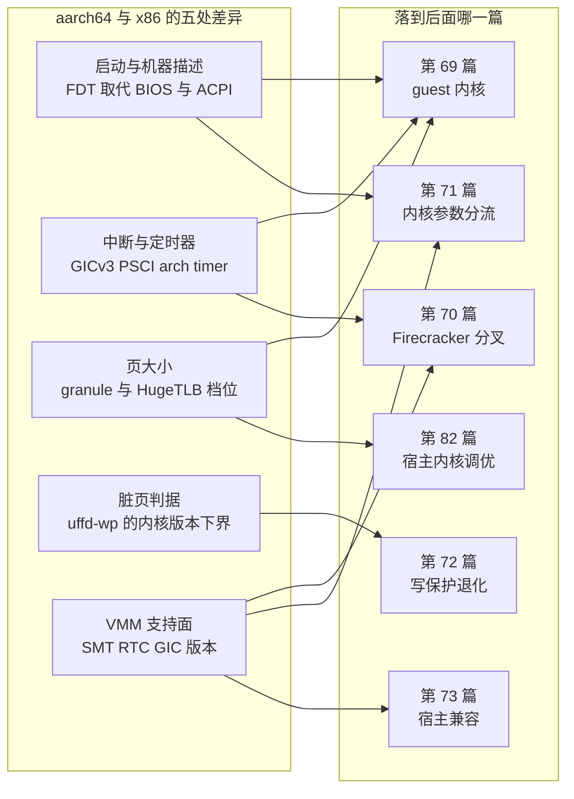

# 68 · aarch64 与 x86 的虚拟化差异

> 把 e2b 从 x86 搬到 aarch64，改动集中在四个地方：启动协议、中断与定时器、页大小、脏页判据。
> 本篇把这四处的架构事实讲清楚，作为第十部分后面几篇的共同预备；具体改了哪一行代码留给那些篇。
>
> **读者**：读过第一部分、准备读 ARM 适配版各篇的读者。
> **预备**：[第 03 篇 · Firecracker 入门](03-firecracker-primer.md)、
> [第 04 篇 · KVM 与内存虚拟化](04-kvm-and-memory-virtualization.md)、
> [第 05 篇 · userfaultfd](05-userfaultfd.md)。
> **代码**：分叉 Firecracker 的 `src/vmm/src/arch/aarch64/`（`mod.rs`、`layout.rs`、`fdt.rs`、
> `vcpu.rs`、`vm.rs`、`kvm.rs`、`gic/mod.rs`）、`src/vmm/src/vmm_config/machine_config.rs`、
> `src/vmm/src/persist.rs`、`src/vmm/src/utils/pagemap.rs`；
> `packages/orchestrator/internal/sandbox/fc/process.go`、`fc/client.go`、
> `packages/orchestrator/internal/sandbox/uffd/userfaultfd/`；`fc-kernels-arm/configs/arm64/`。

---

## 0. 本篇要回答的问题

1. 同一份 KVM 用户态接口，在 aarch64 上哪些部分变了、哪些部分完全没变？
2. 为什么 aarch64 的 microVM 天然没有 BIOS、没有 PCI，而 x86 要费力把它们关掉？
   `pci=off`、`i8042.nokbd`、`clocksource=kvm-clock` 这几个内核参数各自属于谁？
3. guest 与宿主的页大小是两件独立的事，2 MiB 大页在 arm64 上要满足什么条件才真的存在？
4. userfaultfd 写保护在 arm64 上从哪个内核版本开始可用？上游 e2b 依赖的那条判据，
   在什么内核上会静默失效？
5. Firecracker 官方对 aarch64 的支持到什么程度，已知限制有哪些？

---

## 1. 一套接口，四处分叉

KVM 的用户态接口在两个架构上是同一套：`/dev/kvm` 打开系统 fd，`KVM_CREATE_VM` 拿 VM fd，
`KVM_SET_USER_MEMORY_REGION` 注册内存，`KVM_CREATE_VCPU` 拿 vCPU fd，`KVM_RUN` 跑循环。
[第 04 篇 §1](04-kvm-and-memory-virtualization.md#1-kvm-的接口形状) 讲的三层 fd 模型在 aarch64 上一字不改。
两级地址翻译也一样，只是名字不同：x86 叫 EPT，arm64 叫 Stage-2 翻译，
硬件都做两层页表游走，对 VMM 都不可见。

真正分叉的是四类东西：**vCPU 的初始化与寄存器集合、中断控制器、定时器、以及「怎么把机器描述给
guest 内核」**。分叉 Firecracker 用 `#[cfg(target_arch = ...)]` 把它们隔在
`src/vmm/src/arch/aarch64/` 与 `src/vmm/src/arch/x86_64/` 两个目录里，
`src/vmm/src/arch/mod.rs` 按架构把同名符号（`arch_memory_regions`、`configure_system_for_boot`、
`load_kernel`、`MMIO_MEM_START` 等）重新导出。上层的设备管理、快照、内存后端代码只用这些同名符号，
因此**大部分 Firecracker 代码是架构无关的**。这是理解 ARM 适配工作量的起点：
架构差异被 Firecracker 挡在了 VMM 内部，泄漏到 e2b 自己代码里的部分很少。

### 1.1 vCPU 初始化与 PSCI

x86 上 vCPU 建好就可以设寄存器。aarch64 多一步：必须先用 `KVM_ARM_VCPU_INIT` 把 vCPU 初始化成
某个 CPU 型号。`src/vmm/src/arch/aarch64/vcpu.rs` 的 `default_kvi()` 先调 `get_preferred_target()`
问 KVM「这台宿主上应该模拟哪种 CPU」，再往 `features[0]` 里置 `KVM_ARM_VCPU_PSCI_0_2` 位。

PSCI（Power State Coordination Interface）是 ARM 的固件级电源管理约定：
guest 通过 `HVC` 指令请求「把 CPU n 上电」「关机」「重启」，由 hypervisor 实现。
在 x86 上，多核启动靠 INIT-SIPI 序列与 APIC，关机靠 ACPI；在 arm64 上这两件事都归 PSCI。
Firecracker 因此做两件事：`vcpu.rs` 的 `init()` 里对 `index != 0` 的 vCPU 置 `KVM_ARM_VCPU_POWER_OFF`
（副 CPU 初始为下电状态，等 guest 用 PSCI 唤醒），`fdt.rs` 的 `create_psci_node()` 写一个
`compatible = "arm,psci-0.2"` 的节点，`create_cpu_nodes()` 给每个 CPU 写
`enable-method = "psci"`。guest 内核读到这些就知道怎么把其余核拉起来。

一个直接后果：e2b 的内核命令行里有 `reboot=k`（走 keyboard controller 重启），
这在 arm64 上没有对应硬件，重启走 PSCI。ARM 适配版保留了这个参数
（`packages/orchestrator/internal/sandbox/fc/process.go`），因为未知的内核参数会被忽略并传给 init，
不影响启动 —— 但它在 arm64 上是一个空操作。

### 1.2 中断：GIC 而不是 APIC

x86 的中断控制器由 KVM 内建（`KVM_CREATE_IRQCHIP` 造 PIC + IOAPIC + LAPIC），
Firecracker 在 `src/vmm/src/arch/x86_64/layout.rs` 里写死 `APIC_ADDR`、`IOAPIC_ADDR`。
arm64 的 GIC（Generic Interrupt Controller）是通过通用设备接口 `KVM_CREATE_DEVICE` 创建的一个 KVM 设备，
Firecracker 要拿住这个设备 fd 并在快照时逐寄存器存取。

`src/vmm/src/arch/aarch64/gic/mod.rs` 的 `create_gic()` 在未指定版本时**先试 GICv3，失败再退回 GICv2**。
`src/vmm/src/arch/aarch64/vm.rs` 的 `arch_post_create_vcpus()` 里有一条 aarch64 独有的时序约束：
GIC 必须在所有 vCPU 创建之后再建，否则 `KVM_CREATE_VCPU` 会失败。x86 上没有这个顺序要求。

GIC 版本会进快照。`vm.rs` 的 `save_state()` / `restore_state()` 存的是
`crate::arch::aarch64::gic::GicState`，Firecracker 官方文档
`docs/snapshotting/snapshot-support.md` 明确写着：arm64 上 GICv2 与 GICv3 的快照各自可用，
但**不能跨 GIC 版本恢复**。对 e2b 这意味着一条隐含的调度约束：
一个快照只能在 GIC 版本相同的宿主上恢复。鲲鹏平台都是 GICv3，同构集群里这条约束不会浮现，
但混合集群里它会表现为「恢复失败」而不是「性能下降」。

### 1.3 定时器：arch timer 与 kvm-clock

x86 的 guest 通常用 kvm-clock：宿主 KVM 在一块共享内存页里维护 TSC 到墙钟的换算参数，
guest 内核读这块页就得到不受 TSC 频率漂移影响的时间。这需要 guest 内核编进 `CONFIG_KVM_GUEST`
（进而 `CONFIG_PARAVIRT_CLOCK`），并且通常还要在命令行上写 `clocksource=kvm-clock` 把它选为默认时钟源。
`fc-kernels-arm/configs/x86_64/6.1.158.config` 里 `CONFIG_KVM_GUEST=y`、`CONFIG_PARAVIRT_CLOCK=y` 都在。

arm64 没有这套东西。它有架构定义的 generic timer（`CONFIG_ARM_ARCH_TIMER`），
`CNTVCT_EL0` 是体系结构规定的虚拟计数器，KVM 通过 `CNTVOFF` 给每台 guest 一个独立偏移，
guest 直接读寄存器就拿到一个稳定、频率已知的计数。所以 arm64 的时钟源问题在架构层面就解决了，
没有半虚拟化时钟，也没有 `clocksource=kvm-clock` 这个选项。
`fc-kernels-arm/configs/arm64/6.1.158.config` 里有 `CONFIG_ARM_ARCH_TIMER=y`，没有 `CONFIG_KVM_GUEST`。

代价在快照上。x86 恢复快照要处理 TSC 偏移，arm64 要处理计数器偏移。
`src/vmm/src/arch/aarch64/vcpu.rs` 的 `setup_boot_regs()` 里有一段：对 index 为 0 的 vCPU
把 `KVM_REG_ARM_PTIMER_CNT` 置零，让 guest 不会读到宿主开机以来的物理计数。
这一步有内核版本前提 —— 代码注释说明该寄存器的访问从 6.4 起才有，
所以先用 `src/vmm/src/arch/aarch64/kvm.rs` 的 `optional_capabilities()` 检查
`KVM_CAP_COUNTER_OFFSET`，有才做。这是一个**能力探测式降级**：宿主内核低于 6.4 时，
guest 看到的物理计数器从宿主开机时刻起算，功能不坏，但时间基准不干净。

这三点体现在[第 69 篇 §4.2](69-guest-kernel-for-arm.md#42-控制台与时钟)（config 选项）与
[第 70 篇 §3](70-firecracker-fork.md#3-在-aarch64-上构建)（二进制怎么来的）。

### 1.4 宿主内核跑在哪一层：VHE 与 nVHE

前三小节讲的是接口上的分叉。还有一处差异不出现在任何 ioctl 里，却影响每一次陷出的代价：
宿主内核自己运行在哪个异常级别。以下是 ARM 架构与 Linux 的事实，不来自本仓库代码。

x86 上不存在这个问题：宿主始终处于 VMX root 模式，KVM 与内核其余部分共用一个地址空间。
ARMv8.0 的 EL2 则是一个独立的异常级别，系统寄存器与地址翻译体制都与 EL1 不同，
宿主内核只能待在 EL1，KVM 因此被拆成两半 —— 常驻 EL1 的主体，加一段安装在 EL2 的 stub（hyp 代码）。
每次进出 guest 都要在两个异常级别之间搬运一整套系统寄存器。这就是 **nVHE** 模式，
Linux 里也称 split mode，它的 world switch 代价明显高于前者。
ARMv8.1 的 **VHE**（Virtualization Host Extensions）改变了这一点：EL2 被扩展成可以直接承载
一个按 EL1 语义写成的操作系统，宿主内核连同 KVM 整体运行在 EL2，
vCPU 的 world switch 不再跨异常级别，需要保存与恢复的状态少得多。

对 e2b 的意义在于路径开销。沙箱的每一次 MMIO 陷出、每一次 Stage-2 缺页 ——
进而每一次 uffd 唤醒与填页（[第 31 篇](31-uffd-memory-backend.md)）—— 都要经过一次 world switch。
恢复快照的头几秒正是缺页最密集的时刻，nVHE 下这条路径更长。
本书没有在 nVHE 宿主上做过测量，不给量级。

**验证方法**：在宿主上执行 `dmesg | grep -Ei 'kvm.*mode|VHE'`，
或读 `/sys/module/kvm/parameters/mode`。鲲鹏 920 与 950 都支持 VHE，
openEuler 的 arm64 内核默认走这条路径，所以这一项在目标平台上是核对而不是选型。

它在本书另外两处出现：[第 82 篇 §2](82-host-kernel-nbd-hugepages.md#2-kvm-与-devkvm) 把它列为宿主的验收项，
[第 72 篇 §8](72-uffd-on-arm.md#8-修复方向) 讲的 HDBSS 硬件标脏则以 KVM 跑在 VHE 模式为前提。

---

## 2. 启动：FDT 取代 BIOS 与 ACPI

### 2.1 两种「把机器描述给内核」的办法

x86 的历史包袱是：内核不知道机器长什么样，要靠固件告诉它。Firecracker 因此要写
zero page（`layout.rs` 的 `ZERO_PAGE_START`）、MPTable（`mptable::setup_mptable`）、
以及 ACPI 表（`create_acpi_tables`，`src/vmm/src/arch/x86_64/mod.rs` 里注释明说
「For the time being we only support ACPI in x86_64」）。
即便如此，x86 内核仍然会去探测一堆并不存在的传统外设。

arm64 从一开始就没有这套约定。内核启动协议（`Documentation/arm64/booting.txt`）规定：
bootloader 把内核镜像放到 2 MiB 对齐的地址，把一份 **FDT（Flattened Device Tree，扁平设备树）**
放在 8 字节对齐、不超过 2 MiB 的地方，把 FDT 地址放进 `x0`，然后跳进内核入口。
机器上有什么设备、在什么地址、用哪条中断线，全在 FDT 里。

`src/vmm/src/arch/aarch64/fdt.rs` 的 `create_fdt()` 就是在生成这份描述，节点清单一目了然：
CPU 节点（含从 sysfs 读来的 cache 层次）、memory、chosen（内核命令行与 initrd 范围）、
GIC、timer、clock、psci、各个 virtio-mmio 设备、vmgenid。
`src/vmm/src/arch/aarch64/mod.rs` 的 `configure_system_for_boot()` 把它写进 guest 内存，
`get_fdt_addr()` 把它放在 DRAM 的**末尾** 2 MiB；`load_kernel()` 用 `linux_loader` 的 PE 加载器
（arm64 内核镜像是 PE 格式，不是 x86 的 bzImage）把内核装到
`get_kernel_start()` = `SYSTEM_MEM_START + SYSTEM_MEM_SIZE` = 2 GiB + 2 MiB。

### 2.2 地址布局

| 维度 | x86_64 | aarch64 |
|---|---|---|
| DRAM 起点 | 0 | `0x8000_0000`（2 GiB） |
| MMIO 区间 | `0xC000_0000`–4 GiB，夹在 DRAM 中间 | 1 GiB–2 GiB，在 DRAM 之下 |
| memslot 数 | 内存超过 3 GiB 时两个（跨过 MMIO 空洞） | 恒为一个 |
| 机器描述 | zero page + MPTable + ACPI | FDT |
| 内核镜像格式 | bzImage / ELF / PVH | PE |
| 可用 SPI 中断号 | `IRQ_BASE` 5 – `IRQ_MAX` 23 | 32 – 128 |

`src/vmm/src/arch/aarch64/mod.rs` 的 `arch_memory_regions()` 只返回一个区间，
kani 形式化验证里那句断言写得很直白：`// No MMIO gap on ARM`。
这一条对 e2b 有直接影响：uffd 后端拿到的内存映射在 arm64 上恒为一段连续区间，
[第 04 篇 §4](04-kvm-and-memory-virtualization.md#4-memslot-在用户态的镜像) 里
`Mapping.GetHostVirtRanges` 返回多个区间的复杂度在 arm64 上用不上，但代码是同一份。

### 2.3 那几个内核参数属于谁

上游 2026.09 在 `packages/orchestrator/internal/sandbox/fc/process.go` 里无条件加了一组参数，
ARM 适配版把其中五个挪进了 `runtime.GOARCH == "amd64" || runtime.GOARCH == "386"` 的分支。
逐个看它们的归属：

| 参数 | 归属 | 在 arm64 上的实际情况 |
|---|---|---|
| `pci=off` | x86 | `pci=` 早期参数由 x86 的 PCI 代码注册；arm64 的 microVM 根本没有 PCI 根桥 |
| `i8042.nokbd` / `i8042.noaux` | x86 | i8042 是 PC 传统键盘控制器，arm64 内核不编译该驱动 |
| `clocksource=kvm-clock` | x86 | arm64 无此时钟源（§1.3） |
| `random.trust_cpu=on` | 架构无关 | 内核通用参数，arm64 上由 ARMv8.5-RNG 的 `RNDR` 指令支撑 |
| `reboot=k` | x86 语义 | 保留但无效，arm64 重启走 PSCI |

前三项是真正的架构差异：留着不会让 arm64 启动失败（未识别的参数被忽略并作为环境变量传给 init），
但会在内核日志里留下「Unknown kernel command line parameters」这类噪声，
而且 `clocksource=kvm-clock` 指向一个不存在的时钟源。**推论**：把它们分流是清理，不是修复。

第四项值得单独说，因为它是这张表里唯一一个「分流没有技术必要」的条目。
`random.trust_cpu` 是 `drivers/char/random.c` 里的通用早期参数，不属于任何架构；
aarch64 上它对应的熵源是 ARMv8.5-RNG 的 `RNDR` 指令。**推论**：ARM 适配版把它一起放进 x86 分支，
是按「这一组都是 x86 的」整体搬运，而不是逐项判断的结果。
但这次搬运在当前 guest 内核上没有可观察的后果：`fc-kernels-arm/configs/arm64/6.1.158.config`
里 `CONFIG_RANDOM_TRUST_CPU=y`，编译期默认就是「信任」，命令行参数只是重复声明一遍。
换一份没开这个 config 的 guest 内核，`getrandom()` 在启动早期阻塞的风险才会回来 ——
上游加这个参数本来就是为了缩短启动。沙箱里还有一个 virtio-rng
（`fc/client.go` 的 `setEntropyDevice`）作为另一条熵源，
所以即便到那一步也不是致命问题。这一处的完整核对在
[第 71 篇 §2.1](71-orchestrator-arm-fc-changes.md#21-分出去的五个参数)。

`console=ttyS0` 不在分流范围内，这是对的：`fdt.rs` 的 `create_serial_node()` 写的是
`compatible = "ns16550a"` 的 MMIO 串口，arm64 上串口设备名仍是 `ttyS0`。

这一节体现在[第 71 篇 §2](71-orchestrator-arm-fc-changes.md#2-内核命令行按架构分支)，
guest 内核侧对应[第 69 篇 §4](69-guest-kernel-for-arm.md#4-arm64-配置里与-e2b-相关的项)。

---

## 3. 页大小与大页

### 3.1 三个页大小，互不相干

讨论 arm64 的页大小时必须分清三件事，混在一起会得出错误结论：

1. **宿主内核的 granule**。arm64 支持 4 KiB、16 KiB、64 KiB 三种翻译粒度，
   编译时由 `CONFIG_ARM64_4K_PAGES` / `16K` / `64K` 三选一确定，运行时不可改。
2. **guest 内核的 granule**。同样三选一，与宿主无关。
   `fc-kernels-arm/configs/arm64/6.1.158.config` 选的是 `CONFIG_ARM64_4K_PAGES=y`，
   `CONFIG_ARM64_VA_BITS=48`、`CONFIG_ARM64_PA_BITS=48`。也就是说 e2b 的 arm64 guest 是 4 KiB 页，
   与 x86 guest 一致。
3. **Firecracker 给 guest 内存选的映射方式**：普通匿名页，或 2 MiB hugetlbfs。

x86_64 只有 4 KiB 一种 granule，所以这三件事在 x86 上退化成一件，代码里很多地方把它们当成一个常量。
分叉 Firecracker 里就有两处这样的假设：`src/vmm/src/arch/mod.rs` 的
`pub const GUEST_PAGE_SIZE: usize = 4096`（用于 initrd 对齐），
以及 `src/vmm/src/vmm_config/machine_config.rs` 的 `HugePageConfig::page_size()`
在 `None` 分支返回 `4096`。后者会经 `src/vmm/src/persist.rs` 的 `send_uffd_handshake()`
作为 `page_size` 字段发给 uffd handler。

**推论**：在一台 64 KiB granule 的 arm64 宿主上，未启用大页时 Firecracker 会向 orchestrator
报告 4 KiB 的页大小，而内核实际按 64 KiB 触发和解决缺页
（`src/vmm/src/arch/mod.rs` 另有一个 `host_page_size()` 走 `sysconf`，但它没有参与这个握手）。
这一条本书没有实测数据，读者若要在 64 KiB granule 的发行版内核上部署，应先验证这一点。
鲲鹏 + openEuler 的组合上宿主内核是 4 KiB granule，这个假设成立，问题不会浮现。

### 3.2 2 MiB HugeTLB 的条件

e2b 用 2 MiB 大页承载 guest 内存（[第 04 篇 §6](04-kvm-and-memory-virtualization.md#6-大页)、
[第 32 篇 §5](32-memory-prefetch-and-hugepages.md#5-大页改变了哪些量)）。
`HugePageConfig::mmap_flags()` 返回的是写死的 `MAP_HUGETLB | MAP_HUGE_2MB` ——
它要求宿主上**恰好存在 2 MiB 这一档 HugeTLB 池**。

arm64 上哪些档位存在，取决于 granule：

| 宿主 granule | HugeTLB 档位 | 默认 `Hugepagesize` |
|---|---|---|
| 4 KiB | 64 KiB（连续 PTE）、2 MiB（PMD）、32 MiB（连续 PMD）、1 GiB（PUD） | 2 MiB |
| 64 KiB | 2 MiB（连续 PTE）、512 MiB（PMD）、16 GiB（连续 PUD） | 512 MiB |

两种 granule 都有 2 MiB 这一档，所以 `MAP_HUGE_2MB` 本身不会因 granule 而消失。
真正的坑在**池的分配**：`/proc/sys/vm/nr_hugepages` 控制的是**默认档位**的池。
单机离线版的节点初始化脚本 `e2b-deploy/dep/start-client.sh` 先从 `/proc/meminfo` 读
`Hugepagesize`（读不到时回落到 2048 KiB），据此算出页数，再写进 `nr_hugepages` 与
`nr_overcommit_hugepages`。在 4 KiB granule 的宿主上这条链是对的；
**推论**：在 64 KiB granule 的宿主上，`Hugepagesize` 会是 512 MiB，
脚本预留的是 512 MiB 档的池，而 Firecracker 要的是 2 MiB 档
（`/sys/kernel/mm/hugepages/hugepages-2048kB/nr_hugepages`），两者对不上，
沙箱会在 mmap 阶段拿不到大页。这属于「宿主必须是 4 KiB granule」这条隐含前提。

另有一条与架构无关但常被忽略的约束：Firecracker 文档 `docs/hugepages.md` 说明，
guest 内存用 `MAP_NORESERVE` 映射，池不够时进程会**收到 SIGBUS**，而不是 mmap 失败。
同一份文档还写明 hugetlbfs 与 balloon 设备互斥，且差分快照始终按 4 KiB 粒度跟踪写访问。

页大小相关的宿主要求在[第 82 篇 §4](82-host-kernel-nbd-hugepages.md#4-大页预留算法与-aarch64-上的一个假设)，
guest 内核 config 在[第 69 篇 §4.6](69-guest-kernel-for-arm.md#46-页大小)。

---

## 4. 脏页跟踪：arm64 上的时间线

[第 04 篇 §7](04-kvm-and-memory-virtualization.md#7-脏页从哪里知道) 列了三条判据来源。
上游 e2b 走的是第二条：userfaultfd 写保护 —— 因读缺页而填的页带上 `UFFDIO_COPY_MODE_WP`
保留写保护位，因写缺页而填的页不带；判据是 `/proc/<pid>/pagemap` 里
「present（bit 63）为 1 且 uffd-wp（bit 57）为 0」。
分叉 Firecracker 的 `src/vmm/src/utils/pagemap.rs` 的 `is_page_dirty()` 就是这一行逻辑，
orchestrator 侧的填页在 `packages/orchestrator/internal/sandbox/uffd/userfaultfd/userfaultfd.go`
的 `faultPage()`。

这条路在 arm64 上比 x86 晚了整整三年。关键节点：

| 内核版本 | 能力 | 与 e2b 的关系 |
|---|---|---|
| 5.7 | userfaultfd 写保护（匿名内存，x86 起步） | 上游判据的基础 |
| 5.19 | 写保护扩展到 hugetlbfs 与 shmem | e2b 的 guest 内存是 2 MiB hugetlbfs |
| 6.7 | `UFFD_FEATURE_WP_ASYNC` 与 `PAGEMAP_SCAN` ioctl | 写保护故障由内核直接解决，不再回用户态 |
| 6.10 | arm64 实现 uffd-wp（`HAVE_ARCH_USERFAULTFD_WP`） | **arm64 上前三条之前一律不可用** |

arm64 迟到的原因是 PTE 里没有空闲软件位可用来记录 uffd-wp 状态；
Linux 6.10 通过把 `PTE_PROT_NONE` 挪到与 `PTE_UXN` 重叠、腾出一个软件位（bit 58）
并占用一个空闲的 swap PTE 位来解决。这是一条**硬的版本下界**：
宿主内核低于 6.10 时，`UFFDIO_REGISTER_MODE_WP` 与 `UFFDIO_COPY_MODE_WP` 在 arm64 上不成立。

上游 2026.09 的代码对这些版本差异是有察觉的。
`packages/orchestrator/internal/sandbox/uffd/userfaultfd/fd.go` 顶部的 cgo 前言里写着：

```c
#ifndef UFFD_FEATURE_WP_ASYNC
#define UFFD_FEATURE_WP_ASYNC (1 << 15)
#endif
```

即在头文件比 6.7 旧的构建环境上自己补一个常量定义；同目录的 `async_wp_test.go`
则是一个针对该特性的行为测试，直接读 pagemap 校验干净页与脏页的 WP 位。
也就是说，上游把「内核是否支持」当成一个运行期事实来对待，而不是编译期假设。

ARM 适配版的处理是另一个方向：直接把 `faultPage()` 里那两行
`copyMode |= UFFDIO_COPY_MODE_WP` 注释掉。判据于是塌缩成「被换入过即脏」，
内存差分成为真实脏页集的**超集** —— 正确性不变（多存的页内容与基线相同），
成本模型退化（每次快照的内存增量有一个约等于常驻工作集的下限）。
这条改动、它的实测量级和恢复条件，是[第 72 篇 · 写保护退化](72-uffd-on-arm.md#1-改动的全貌三行注释)的全部内容。

还有一项**推论**需要标出：即使宿主内核到了 6.10，e2b 的 guest 内存是 hugetlbfs 支撑的，
而 6.10 的 arm64 uffd-wp 补丁提供的是 PTE 与 PMD 层的处理程序，
arm64 的 HugeTLB 又大量使用连续 PTE / 连续 PMD 编码。
「arm64 + hugetlbfs + uffd-wp」这个组合是否完整可用，本书没有在目标平台上验证过，
恢复写保护之前必须先用一个最小程序实测 `UFFDIO_REGISTER_MODE_WP` 在 hugetlbfs 区间上的返回值。

第三条判据 —— 硬件标脏 —— 在 ARMv9.5 里叫 HDBSS，鲲鹏 950 实现了它：
CPU 在写 Stage-2 覆盖的页时把 GPA 直接写进每 vCPU 的一块缓冲区，
不产生为标脏而生的陷出，结果仍从 `KVM_GET_DIRTY_LOG` 出口。
本书不展开，细节见 checkpoint / restore 手册的
[脏页跟踪](../../e2b-infra-docs/rollback/docs/07-dirty-page-tracking.md)，
本书的指引在[第 87 篇 §3.1](87-beyond-checkpoint-restore.md#31-脏页判据换源)。

---

## 5. Firecracker 对 aarch64 的支持状态

aarch64 在 Firecracker 里不是二等公民。官方 `README.md` 的 tested platforms 表里，
Graviton 的 `m6g.metal`、`m7g.metal`、`m8g.metal-24xl`、`m8g.metal-48xl` 与 Intel / AMD 机型
并列，且是「所有组合都测」；宿主内核 5.10 与 6.1、guest 内核 5.10 与 6.1 同样覆盖。
分叉 Firecracker 的 `docs/` 目录（源自上游）里也有 aarch64 专属的运行手册。

已知限制，按是否影响 e2b 分类：

| 限制 | 出处 | 对 e2b 的影响 |
|---|---|---|
| SMT 在 aarch64 上不支持 | `machine_config.rs` 的 `update()`：`#[cfg(target_arch = "aarch64")] if smt { return Err(SmtNotSupported) }` | **硬错误**。上游 `fc/client.go` 的 `setMachineConfig` 发 `smt: true`，在 arm64 上会被 FC 拒绝 |
| `pl031` RTC 无中断 | `README.md` 的 Known issues | guest 里 `hwclock` 之类依赖 RTC 闹钟的程序不工作 |
| 快照不能跨 GIC 版本恢复 | `docs/snapshotting/snapshot-support.md` | 混合 GIC 版本的集群里恢复会失败（§1.2） |
| ACPI 只有 x86 | `src/vmm/src/arch/x86_64/mod.rs` 注释 | 无影响，arm64 走 FDT |
| 静态 CPU 模板的取值按架构不同 | `src/vmm/src/cpu_config/templates.rs` 按 `cfg` 引不同的 `StaticCpuTemplate` | e2b 不用 CPU 模板，无影响 |
| hugetlbfs 与 balloon 互斥 | `docs/hugepages.md` | 架构无关，e2b 已经二选一 |

第一条是 ARM 适配版必须改的两处 `fc/client.go` 改动之一：`smt` 从 `true` 改成 `false`。
同一处改动还删掉了显式的 `TrackDirtyPages: &trackDirtyPages`。
需要说清楚的是，上游那里传的值本来就是 `false`，而 `machine_config.rs` 里
`track_dirty_pages` 的默认值也是 `false`，所以**删掉这个字段在语义上是空操作**，
不是「关掉了 KVM 脏页日志」—— e2b 从来就没开过它，它的脏页判据一直来自 uffd（§4）。
把这两件事混为一谈是读这份补丁时最容易犯的错。

Firecracker 侧的分叉内容、ARM 上的构建方式与二进制版本命名在
[第 70 篇](70-firecracker-fork.md#2-分叉改了什么)；orchestrator 侧调用参数的改动在
[第 71 篇 §3](71-orchestrator-arm-fc-changes.md#3-machine-configsmt-与-track_dirty_pages)。

---

## 6. 差异地图

把前五节收进一张图，同时标出每条差异在本书哪一篇里落地：



图里没有出现的两篇也属于第十部分的架构面：
[第 73 篇 §3](73-cgroup-and-host-compat.md#3-machineinfo让-orchestrator-能在-aarch64-上启动) 处理的是发行版与 cgroup 层次的差异
（gopsutil 在 arm64 上取不到 CPU Family / Model 是其中一处），
[第 74 篇 §1](74-template-build-on-arm.md#1-架构假设写在哪几个地方) 处理的是 guest 用户态的架构差异
（busybox 二进制、OCI 平台、openEuler 的包管理）。这两类都不是虚拟化差异，
但它们和本篇讲的差异一起构成了移植的全部工作量，分类见
[第 67 篇 §3](67-arm-port-overview.md#3-改动地图)。

---

## 7. 小结

1. KVM 的用户态接口在两个架构上是同一套；分叉集中在 vCPU 初始化、中断控制器、定时器、
   机器描述四处，且被 Firecracker 挡在 `src/vmm/src/arch/` 内部，泄漏到 e2b 代码里的很少。
2. aarch64 的 vCPU 必须先 `KVM_ARM_VCPU_INIT`；多核上下电与关机重启走 PSCI，
   由 `fdt.rs` 的 psci 节点与每个 CPU 的 `enable-method` 声明。
3. GIC 通过 `KVM_CREATE_DEVICE` 创建，必须在所有 vCPU 之后建；`create_gic()` 优先 GICv3、
   回落 GICv2；GIC 版本进快照，且不能跨版本恢复。
4. arm64 没有半虚拟化时钟，generic timer 是架构保证的；`clocksource=kvm-clock` 因此只属于 x86。
   计数器归零依赖 `KVM_CAP_COUNTER_OFFSET`（宿主 6.4 起），没有就静默跳过。
5. arm64 用 FDT 描述机器，没有 zero page、MPTable、ACPI，也没有 PCI 根桥与 i8042。
   `pci=off` 与 `i8042.*` 在 arm64 上无对象；`random.trust_cpu` 则是架构无关的，
   把它一并划入 x86 分支没有技术必要，只是因为 arm64 config 里
   `CONFIG_RANDOM_TRUST_CPU=y` 已经给了同样的默认值，当前没有可观察后果。
6. 宿主 granule、guest granule、Firecracker 的映射方式是三件独立的事。
   两种 granule 都有 2 MiB HugeTLB 档，但默认 `Hugepagesize` 不同，
   节点初始化脚本按默认档预留池，因此隐含要求宿主是 4 KiB granule。
7. userfaultfd 写保护在 arm64 上从 Linux 6.10 才有（x86 是 5.7），hugetlbfs 支持是 5.19，
   `UFFD_FEATURE_WP_ASYNC` 是 6.7。这条版本下界是 ARM 适配版注释掉 `UFFDIO_COPY_MODE_WP`
   的直接原因，后果是脏页判据退化为超集，正确性不变、成本模型变。
8. Firecracker 官方在 Graviton 机型上做全量 CI，aarch64 支持完整；
   与 e2b 直接相关的硬限制只有一条：aarch64 上 `smt` 必须为 false，否则 machine-config 报错。
   同一处改动删掉的 `track_dirty_pages` 是空操作，不要读成「关掉了脏页日志」。

---

## 延伸阅读 / 下一篇

- [第 04 篇 §7](04-kvm-and-memory-virtualization.md#7-脏页从哪里知道)：两级翻译、memslot、大页、
  脏页三来源的完整铺垫。
- [第 05 篇 §4](05-userfaultfd.md#4-写保护)：写保护的两种用法与 pagemap 判据。
- [第 28 篇 §5](28-firecracker-process-management.md#5-内核命令行逐项)：内核命令行逐项解释。
- [第 69 篇 §4](69-guest-kernel-for-arm.md#4-arm64-配置里与-e2b-相关的项)：arm64 内核 config、构建与三个二进制的差别。
- [第 70 篇 §2](70-firecracker-fork.md#2-分叉改了什么)、[§3](70-firecracker-fork.md#3-在-aarch64-上构建)：分叉加了什么，怎么在 arm64 上构建。
- [第 72 篇 §6](72-uffd-on-arm.md#6-实测量级)、[§8](72-uffd-on-arm.md#8-修复方向)：§4 那条退化的实测量级与恢复路径。
- Firecracker 官方文档：`docs/kernel-policy.md`（各架构的 guest 内核最小配置）、
  `docs/hugepages.md`、`docs/snapshotting/snapshot-support.md`。
- Linux 内核文档：`Documentation/arm64/booting.txt`（arm64 启动协议）、
  `Documentation/admin-guide/mm/userfaultfd.rst`、`Documentation/admin-guide/mm/hugetlbpage.rst`。
- checkpoint / restore 手册的[脏页跟踪](../../e2b-infra-docs/rollback/docs/07-dirty-page-tracking.md)：
  HDBSS 硬件标脏的启用时序与代价。

下一篇：[第 69 篇 · guest 内核](69-guest-kernel-for-arm.md)。
