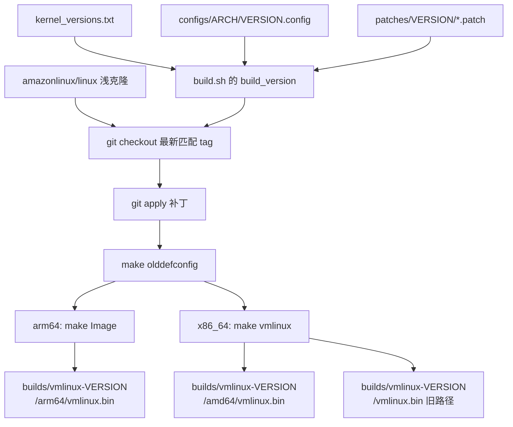

# 69 · guest 内核

> 沙箱里跑的那个 Linux 不是发行版内核，是 e2b 自己编的一份精简内核。本篇讲这份内核怎么编、
> arm64 那份配置里哪些开关真正影响 e2b、它和 x86 那份差在哪，以及单机离线版为什么装了两份 arm64 内核。
>
> **读者**：工程师、系统工程师。 　**预备**：[第 03 篇 · Firecracker 入门](03-firecracker-primer.md)、
> [第 68 篇 · aarch64 与 x86 的虚拟化差异](68-aarch64-virtualization-differences.md)。
> 　**代码**：`fc-kernels-arm/build.sh`、`fc-kernels-arm/configs/arm64/6.1.158.config`、
> `fc-kernels-arm/patches/6.1.158/`、`packages/orchestrator/internal/sandbox/fc/config.go`、
> `e2b-infra.spec`、`e2b-deploy/dep/init-client.sh`

---

## 0. 本篇要回答的问题

1. Firecracker 的 guest 内核为什么不能直接用发行版内核？这份内核从哪棵源码树来、怎么编？
2. 编出来的产物叫什么名字、放在哪里、orchestrator 又是按什么路径找它的？
3. arm64 配置里哪几项是 e2b 真正依赖的？哪几项看着相关其实无关？
4. x86_64 与 arm64 两份配置差在哪里？这些差异有多少是刻意选择，有多少只是发行版的架构默认？
5. 单机离线版的 RPM 里为什么有两份 arm64 内核，它们分别给谁用？

---

## 1. 为什么要自己编一份 guest 内核

Firecracker 提供的机器模型极窄：没有 BIOS、没有 UEFI、没有 PCI 总线、没有大部分传统外设。
它只给 guest 一条串口、一个可选的 RTC、若干挂在固定 MMIO 地址上的 virtio 设备，
以及描述这些东西的固件表 —— x86_64 上是 ACPI 表，aarch64 上是一棵设备树（FDT）。
发行版内核为了在任意硬件上启动，会编进成百上千个驱动，其中绝大多数在这个机器模型里永远不会被探测到；
它们的代价是镜像体积和启动时的探测时间，而沙箱这门生意恰恰把启动时间当作核心指标。

除此之外还有加载格式的约束。分叉 Firecracker 在 `src/vmm/src/arch/x86_64/mod.rs` 的 `load_kernel()`
里用的是 `linux_loader::loader::elf::Elf`，在 `src/vmm/src/arch/aarch64/mod.rs` 的同名函数里用的是
`linux_loader::loader::pe::PE`。也就是说：x86_64 要的是未压缩的 ELF 内核（`vmlinux`），
aarch64 要的是内核自己的 PE 风格启动镜像（`arch/arm64/boot/Image`）。同一份源码树，两个架构的交付物形态不同。
这一点决定了后面构建脚本里那个看起来有点突兀的分支。

所以 e2b 维护了一个独立的 fc-kernels 仓库：只放配置与补丁，不放源码，
从 Amazon Linux 的内核树按版本 tag 拉源码，用自己的 `.config` 编，产出一个二进制。
本书截稿时该仓库跟踪两个版本，见 `kernel_versions.txt`：`6.1.102` 与 `6.1.158`。

## 2. 构建流程

`fc-kernels-arm/build.sh` 是全部流程，一百多行，没有容器也没有构建系统。它的输入是三样东西：

- `kernel_versions.txt` —— 要编哪些版本，一行一个；
- `configs/<target_arch>/<version>.config` —— 该架构该版本的内核配置，`target_arch` 取 `x86_64` 或 `arm64`；
- `patches/<version>/*.patch` —— 可选，按文件名顺序打在源码树上。

`Makefile` 只是两个入口：`make build` 编 x86_64，`make build-arm64` 设 `TARGET_ARCH=arm64` 后调同一个脚本。
单独编一个版本可以直接 `./build.sh 6.1.158 arm64`。

脚本内部的顺序是这样的。`ensure_linux_repo()` 在仓库根下把 `https://github.com/amazonlinux/linux`
浅克隆到 `linux/`（`--no-checkout --filter=tree:0`，只要提交图不要历史文件树），然后 `make distclean`。
`build_version()` 先把选定的 `.config` 拷进源码树，再 `git checkout -f "$(get_tag "$version")"`
切到对应 tag。`get_tag()` 按创建时间倒序找第一个匹配 `microvm-kernel-<version>-*.amzn2` 的 tag，
找不到再退一步匹配 `kernel-<version>-*.amzn2`。这里有个值得注意的性质：
**tag 不是钉死的，取的是「当前最新的那个匹配项」**，所以同一个版本号在不同时间编出来的内核可能来自不同的 amzn 修订。
`configs/arm64/6.1.158.config` 里的 `CONFIG_BUILD_SALT="6.1.158-1.182.amzn2023.aarch64"`
记的是这份配置被导出时的那个修订，它不参与 tag 选择。

接着 `apply_patches()` 对每个补丁先 `git apply --check` 再 `git apply`，任何一个打不上就整体失败。
然后是编译：`make olddefconfig` 把拷进来的配置补齐成当前源码树的完整配置 ——
这一步意味着**配置文件里没有出现的符号会取源码树的默认值**，配置文件是一份「意图」而不是一份精确快照。
arm64 上若宿主不是 aarch64，`make_opts` 会带上 `ARCH=arm64 CROSS_COMPILE=aarch64-linux-gnu-` 走交叉编译。

最后是那个格式分支：arm64 执行 `make Image`，把 `arch/arm64/boot/Image` 拷成产物；
x86_64 执行 `make vmlinux`，把根目录的 `vmlinux` 拷成产物。两者的产物文件名都叫 `vmlinux.bin`。



## 3. 输出命名与寻址

产物目录用的是 Go 的 `runtime.GOARCH` 写法（`amd64` / `arm64`），
而 `TARGET_ARCH` 这个构建期变量用的是内核写法（`x86_64` / `arm64`）；
`normalize_arch()` 负责在两套命名之间转换。x86_64 额外在 `builds/vmlinux-<version>/vmlinux.bin`
再放一份不带架构子目录的拷贝，供还不认识架构子目录的旧消费者使用。

发布侧的命名再变一次。按 `README.md`，release 资产叫 `vmlinux-<version>-amd64.bin`、
`vmlinux-<version>-arm64.bin`，外加一个等同于 amd64 的 `vmlinux-<version>.bin`；
上传到对象存储时又拼成 `gs://<bucket>/kernels/vmlinux-<version>_<short_hash>/<arch>/vmlinux.bin`
（见 `scripts/upload-release-to-gcs.sh`，脚本里明确跳过不带架构后缀的那个旧资产，且从不覆盖已有对象）。

消费侧只认一条路径。上游 2026.09 的 `packages/orchestrator/internal/sandbox/fc/config.go` 里，
`SandboxKernelFile = "vmlinux.bin"`，取内核路径的方法把三段拼起来：

```go
return filepath.Join(config.HostKernelsDir, t.KernelVersion, SandboxKernelFile)
```

`HostKernelsDir` 在 `packages/orchestrator/internal/cfg/model.go` 里默认 `/fc-kernels`，
可用 `HOST_KERNELS_DIR` 覆盖；`KernelVersion` 来自建模板请求，请求没带就落到
`packages/api/internal/cfg/model.go` 里的 `DefaultKernelVersion = "vmlinux-6.1.158"`。
拼出来就是 `/fc-kernels/<KernelVersion>/vmlinux.bin`。

这里有一处口径需要读者自己对上：**上游 2026.09 的 orchestrator 代码里没有任何按架构分路径的逻辑**
（在 `packages/` 下检索 `runtime.GOARCH`，只有 `internal/service/machineinfo/main.go` 用它上报机器信息）。
fc-kernels 的 `README.md` 说架构子目录是为了「匹配 orchestrator 的 `TargetArch()` 路径解析」，
而这个函数在本书的上游基线里不存在。推论：架构子目录要么服务于比 2026.09 更新的 orchestrator，
要么依赖把架构段直接写进 `KernelVersion` 字符串（`filepath.Join` 不排斥带斜杠的取值）。
**对本书涉及的所有部署形态，实际生效的规则只有一条：`/fc-kernels/<KernelVersion>/vmlinux.bin` 必须是本机架构的内核。**

三种部署形态把这条规则落地的方式不同：

| 形态 | 内核怎么到 `/fc-kernels` | 代码位置 |
|---|---|---|
| 上游 GCP 集群 | gcsfuse 只读挂载内核桶到 `/fc-kernels` | `iac/provider-gcp/nomad-cluster/scripts/start-client.sh` |
| 上游开发机 | `gsutil -m cp -r gs://e2b-prod-public-builds/kernels/*` 全量拷贝 | `.github/actions/host-init/init-client.sh` |
| 单机离线版 | 从 RPM 装出来的 `bin/` 目录本地复制 | `e2b-deploy/dep/init-client.sh` |

单机离线版没有外网也没有对象存储，所以它把「下载」换成「复制」，并且额外做了一件事：
同一份 `bin/vmlinux.bin` 被复制到 `/fc-kernels/vmlinux-6.1.158/` 与 `/fc-kernels/vmlinux-6.1.102/` 两个目录。
脚本注释把理由写得很直白 —— 目录名只是寻址用的标签，多铺一份是为了让指定旧版本的老模板也能建起来。
代价是这两个「版本」实际是同一个二进制，运维看到的版本号不再代表内核版本，
排障时不能凭目录名推断 guest 内核。

## 4. arm64 配置里与 e2b 相关的项

`configs/arm64/6.1.158.config` 有 3358 行，绝大部分与 e2b 无关。下面只挑真正影响 e2b 行为的几组。

### 4.1 设备发现：virtio-mmio 而不是 PCI

两个架构都是 `# CONFIG_PCI is not set`，`CONFIG_VIRTIO_MMIO=y`，
且两边都是 `# CONFIG_VIRTIO_MMIO_CMDLINE_DEVICES is not set`。
最后这一项容易让人以为设备发现坏了，其实不然：分叉 Firecracker 的
`src/vmm/src/device_manager/mmio.rs` 里，`register_mmio_virtio_for_boot()` 只在
`#[cfg(target_arch = "x86_64")]` 分支里调用 `add_virtio_device_to_cmdline()` 和 `add_virtio_aml()`，
后者往 ACPI DSDT 里加设备节点；aarch64 分支什么都不加，设备由 `arch/aarch64/fdt.rs` 的
`create_virtio_node()` 写进 FDT，`compatible` 是 `"virtio,mmio"`。
两边都靠固件表发现设备，命令行那条路谁都没用，所以那个选项关着是对的。
arm64 配置里因此必须有 `CONFIG_OF_EARLY_FLATTREE=y`、`CONFIG_OF_ADDRESS=y`、`CONFIG_OF_IRQ=y`
这一组设备树支持；x86_64 配置里 `CONFIG_OF` 整个不开。

具体设备：`CONFIG_VIRTIO_BLK=y`（rootfs 与 NBD 之上的块设备）、`CONFIG_VIRTIO_NET=y`（走 tap 的网卡）、
`CONFIG_VIRTIO_VSOCKETS=y`（envd 的控制通道）、`CONFIG_VIRTIO_BALLOON=y`、`CONFIG_HW_RANDOM_VIRTIO=y`。
两个架构这一组完全一致。

### 4.2 控制台与时钟

arm64 配置里 `# CONFIG_SERIAL_AMBA_PL011 is not set`。这看起来反直觉 —— aarch64 虚拟机的控制台通常是 PL011。
原因在固件表里：`fdt.rs` 的 `create_serial_node()` 写的 `compatible` 是 `"ns16550a"`，
不是 `arm,pl011`。也就是说 Firecracker 在 aarch64 上给的是一个 8250 兼容串口，
所以配置里开的是 `CONFIG_SERIAL_8250=y`、`CONFIG_SERIAL_8250_CONSOLE=y`、`CONFIG_SERIAL_OF_PLATFORM=y`
（把 FDT 里的串口节点绑到 8250 驱动）与 `CONFIG_SERIAL_EARLYCON=y`
（`mmio.rs` 的 `add_mmio_serial_to_cmdline()` 会往命令行插 `earlycon=uart,mmio,0x...`）。
两个架构的控制台设备名因此都是 `ttyS0`。

顺带一提，`fc-kernels-arm/start-microvm.sh` 这个本地调试脚本给的是 `console=ttyAMA0`，
与配置里没有 PL011 驱动这件事对不上；那是仓库里附带的演示脚本，不参与 e2b 的沙箱启动路径。

时钟这边 arm64 开 `CONFIG_ARM_ARCH_TIMER=y` 与 `CONFIG_ARM_ARCH_TIMER_EVTSTREAM=y`，
x86_64 开 `CONFIG_KVM_GUEST=y`（kvm-clock 所在）。这正是内核命令行上
`clocksource=kvm-clock` 只在 x86 下发的原因，详见[第 71 篇 §2](71-orchestrator-arm-fc-changes.md#2-内核命令行按架构分支)。
中断控制器一侧 arm64 需要 `CONFIG_ARM_GIC_V3=y`（以及 `CONFIG_ARM_GIC=y` 兼容 GICv2），
电源管理需要 `CONFIG_ARM_PSCI_FW=y` —— 没有 PSCI，Firecracker 的 `reboot=k` 与 SMP 上电都无从谈起。

### 4.3 overlayfs 与根文件系统

`CONFIG_OVERLAY_FS=y` 在两个架构上都开。这里要先分清一个同名词：本书里 overlay 有两个含义，
一个是**宿主侧块层的 `Overlay` 类型** —— 一层写时复制缓存叠在只读基底之上，按块工作，
guest 看不见它（[第 30 篇 §4](30-block-layer.md#4-overlay两条规则)）；
另一个才是**guest 内核的 overlayfs**，按文件与目录工作，由沙箱里的容器运行时使用。
`CONFIG_OVERLAY_FS` 开的是后者，它与宿主侧 rootfs 的写时复制没有实现上的关系
（那条路是 NBD 加块层，见[第 33 篇 §6](33-nbd-and-rootfs.md#6-一次-guest-写走到哪里)）。
`CONFIG_EXT4_FS=y`、`CONFIG_SQUASHFS=y` 同理，都是 guest 内部挂载用的。

### 4.4 userfaultfd 与 hugetlb：两个容易误读的开关

`CONFIG_USERFAULTFD=y` 和 `CONFIG_HUGETLBFS=y`、`CONFIG_HUGETLB_PAGE=y` 在两个架构上都开着，
但**它们与 e2b 的快照机制没有关系**。e2b 的 userfaultfd 用在宿主进程里，
由 orchestrator 注册、处理 guest 物理内存的缺页（[第 31 篇 §4](31-uffd-memory-backend.md#4-一次缺页)）；
2 MiB 大页也是宿主侧给 Firecracker 的内存后端用的（[第 32 篇 §5](32-memory-prefetch-and-hugepages.md#5-大页改变了哪些量)）。
guest 内核里的这两项只影响**沙箱内部的用户程序**能不能用 userfaultfd、能不能挂 hugetlbfs。
把它们当成「e2b 快照所需」是常见的误读；判断宿主能力要看宿主内核，见[第 82 篇 §6.1](82-host-kernel-nbd-hugepages.md#61-userfaultfd-与权限门槛)。

`CONFIG_MEMFD_CREATE=y`、`CONFIG_BALLOON_COMPACTION=y`、`CONFIG_MEMORY_HOTPLUG=y` 也在，
最后一项与 balloon 一起构成 guest 侧调节内存占用的基础。

### 4.5 cgroup 与 netfilter

cgroup 这一组是完整的：`CONFIG_CGROUPS`、`CONFIG_MEMCG`、`CONFIG_BLK_CGROUP`、`CONFIG_CGROUP_SCHED`、
`CONFIG_CFS_BANDWIDTH`、`CONFIG_CGROUP_PIDS`、`CONFIG_CGROUP_FREEZER`、`CONFIG_CGROUP_DEVICE`、
`CONFIG_CGROUP_HUGETLB` 全部为 `y`，加上 `CONFIG_NAMESPACES` 与五个 namespace 子项、
`CONFIG_SECCOMP_FILTER=y`、`CONFIG_BPF_SYSCALL=y`。这一组的用途是让沙箱内部能跑容器运行时；
cgroup v1 与 v2 的区别不在内核配置里（`CONFIG_CGROUPS` 同时提供两者），而在挂载方式与 guest 用户态的选择。
注意 orchestrator 侧的 cgroup 兼容问题针对的是**宿主**，与这份 guest 配置无关，见[第 73 篇 §2](73-cgroup-and-host-compat.md#2-cgroup关闭宿主侧记账)。

netfilter 这一组在 arm64 上是够用但不完整：`CONFIG_NETFILTER=y`、`CONFIG_NF_CONNTRACK=y`、
`CONFIG_NF_NAT=y` 与 `NF_NAT_MASQUERADE`、`CONFIG_IP_NF_IPTABLES=y` 及 filter / nat / mangle 三张表都在，
`CONFIG_VETH=y`、`CONFIG_BRIDGE=y` 也在。缺的是 `CONFIG_IP_NF_RAW`、`CONFIG_NETFILTER_XT_MARK`、
`CONFIG_NETFILTER_XT_MATCH_MULTIPORT`、`CONFIG_NETFILTER_XT_MATCH_COMMENT`，
以及在打进 checkpoint 相关改动之前的 `CONFIG_NF_TABLES` 与 `CONFIG_TUN`（下一节展开）。
后果是具体的：沙箱里跑 Docker 或 Kubernetes 这类会写 nftables 规则、
或者需要 `-m mark`、`-m multiport`、`-t raw` 的工作负载，在 arm64 guest 上会比 x86 guest 更早撞墙。

### 4.6 页大小

`CONFIG_ARM64_4K_PAGES=y`、`CONFIG_ARM64_PAGE_SHIFT=12`、`CONFIG_ARM64_VA_BITS=48`、
`CONFIG_ARM64_PA_BITS=48`、`CONFIG_PGTABLE_LEVELS=4`。
guest 用 4 KiB 页而不是 aarch64 常见的 64 KiB 页，这一点对 e2b 相当重要：
宿主侧的内存差分、映射表与 uffd 的处理粒度都以 4 KiB 为单位，
guest 与宿主页大小一致才不会出现「一次缺页跨越多个映射块」这类需要额外处理的情形。
两个 config 都有 `CONFIG_PAGE_SIZE_LESS_THAN_64KB=y`。宿主内核也必须是 4 KiB 页，这个前提见[第 82 篇 §4](82-host-kernel-nbd-hugepages.md#4-大页预留算法与-aarch64-上的一个假设)。

## 5. x86_64 与 arm64 配置的关键差异

把两份 6.1.158 配置按符号归一化后逐项比对（`# X is not set` 记作 `X=n`），
arm64 有 2546 个符号取值、x86_64 有 2528 个，两边都出现且取值不同的有 78 项。
去掉编译器版本、`BUILD_SALT`、`ARCH_MMAP_RND_BITS` 这类由工具链和架构直接决定的，
再去掉纯 x86 或纯 arm64 才有的符号，剩下的实质差异分成两类。

第一类是**架构默认带来的**，e2b 没有为它们做过选择 —— 这两份配置是从 Amazon Linux 各自架构的
microvm 配置导出来的，各自继承了发行版在该架构上的默认：

| 配置项 | arm64 | x86_64 | 影响 |
|---|---|---|---|
| `CONFIG_HZ` | 100 | 250 | 定时器中断频率，影响调度粒度与空闲开销 |
| `CONFIG_TRANSPARENT_HUGEPAGE_*` | ALWAYS | MADVISE | guest 内是否默认给匿名内存合并透明大页 |
| `CONFIG_RANDOMIZE_BASE` | n | y | 内核地址随机化，arm64 这份没开 |
| `CONFIG_FORTIFY_SOURCE` / `BUG_ON_DATA_CORRUPTION` / `STRICT_DEVMEM` | n | y | 一组加固选项在 arm64 上未开 |
| `CONFIG_SECURITY_LANDLOCK` 与 `CONFIG_LSM` | 无 landlock | 有 landlock | 沙箱内不能用 Landlock 做二次隔离 |
| `CONFIG_FUSE_FS` | n | y | guest 内挂不了 FUSE 文件系统 |
| `CONFIG_SQUASHFS_ZSTD` | n | y | zstd 压缩的 squashfs 镜像挂不上 |
| `CONFIG_IPV6_SUBTREES` / `SEG6_*` / `MPTCP` | n | y | 高级 IPv6 与多路径 TCP 能力缺失 |
| `CONFIG_EFI` / `CONFIG_OF` / `CONFIG_ACPI_SPCR_TABLE` | y | n | arm64 走 FDT 与 SPCR，属于必要差异 |
| `CONFIG_RTC_CLASS` 与 `RTC_DRV_PL031` | y | n | aarch64 上 Firecracker 提供 pl031 RTC |
| `CONFIG_PREEMPT_DYNAMIC` | n | y | 抢占模型不可运行时切换 |

其中 Landlock、FUSE、`SQUASHFS_ZSTD`、`IPV6_SUBTREES` 这几项是**能力上的实际缺口**：
同一个模板镜像在 x86 沙箱里能用的东西，在 arm64 沙箱里可能不能用，且失败发生在 guest 内部、
不会在 orchestrator 的日志里留下痕迹。定位这类问题要先怀疑 guest 内核配置。

第二类是**为后续的 checkpoint / restore 工作显式改的**。fc-kernels-arm 相对上游 fc-kernels
只有一次本地提交，它同时修改了 `configs/arm64/6.1.158.config` 并加入第二个补丁，把这些打开：
`CONFIG_CHECKPOINT_RESTORE=y`、`CONFIG_FTRACE=y` 与 `FUNCTION_GRAPH_TRACER` / `DYNAMIC_FTRACE` 一组、
`CONFIG_NF_TABLES=y` 与 `NFT_COMPAT`、`CONFIG_TUN=y`、`CONFIG_NETLINK_DIAG` 等一组 socket diag、
`CONFIG_OVERLAY_FS_REDIRECT_DIR=y`；同时关掉了 `CONFIG_MPTCP` 与 `CONFIG_INET_DIAG_DESTROY`。
这一组改动的直接目的是让 CRIU 式的进程状态导出与 ftrace 性能分析在 guest 里可用，
属于[第 87 篇 §4](87-beyond-checkpoint-restore.md#4-overlayfs-热切换内核补丁)的范围，**不在本书讲的 ARM 适配版交付物里**（见 §7）。

## 6. 两个内核补丁

`patches/6.1.158/` 下有两个补丁，性质完全不同。

**`0001-virtio_balloon-Support-wait-on-ACK-for-hinting.patch`** 来自上游 fc-kernels，
不是 ARM 适配版加的。补丁本身是 Amazon 的一份 RFC，作者与提交信息都保留在补丁头里。
它给 virtio-balloon 的 free page hinting 加了一个新的 feature 位
`VIRTIO_BALLOON_F_HINT_WAIT_ON_ACK`：协商上这个位之后，guest 在把一段空闲内存报给设备后
会 `wait_event()` 等设备 ACK，再把这段内存放回 `free_page_list`。
问题是原本的 hinting 是异步的 —— guest 报完就可以把页收回去重用，
而 VMM 这边可能还没处理完这段范围，于是 VMM 不能安全地对这段内存做任何事。
加上同步之后，VMM 可以在 ACK 之前对该范围执行 `MADV_DONTNEED`，从而**真正降低 guest 的宿主侧 RSS**。
代价补丁头里也写了：hinting 的一轮耗时增加约 30%。
这是一条典型的「用延迟换内存密度」的取舍，对按内存计费的沙箱平台有意义。

**`0002-overlayfs-hot-switch-checkpoint.patch`** 是本地新增的，1214 行，改动集中在 `fs/overlayfs/`
（`dir.c`、`file.c`、`inode.c`、`overlayfs.h`、`ovl_entry.h` 等）。
它给 overlayfs 加了一个 ioctl，允许在不卸载挂载点的前提下热切换 overlay 的 upper / lower 层，
用于快速的 checkpoint 与 restore。这属于本书范围之外的后续功能开发，
背景与进展见[第 87 篇 §4](87-beyond-checkpoint-restore.md#4-overlayfs-热切换内核补丁)。

## 7. 三个内核二进制

单机离线版的 RPM 里有三份内核，`e2b-infra.spec` 的 `Source4`、`Source5`、`Source6`。
用 `file` 与 `strings` 看它们的版本串，能确认它们各自的来路：

| 文件 | 格式 | 版本串 | 工具链 | 大小 |
|---|---|---|---|---|
| `vmlinux.bin.arm` | ARM64 Image、4K pages | `6.1.158 ... #2 SMP Fri Apr 10 04:48:51 UTC 2026` | `aarch64-linux-gnu-gcc` 11.4.0 / Ubuntu 22.04 | 16.9 MB |
| `vmlinux.bin.x86` | ELF 64-bit、x86-64、未剥符号 | `6.1.158 ... #2 SMP PREEMPT_DYNAMIC Fri Apr 10 04:45:11 UTC 2026` | `gcc` 11.4.0 / Ubuntu 22.04 | 43.8 MB |
| `vmlinux.bin.arm.openeuler` | ARM64 Image、4K pages | `6.6.0+ ... #5 SMP Mon Apr 27 09:58:01 UTC 2026` | `gcc` 12.3.1 openEuler 12.3.1-38.oe2403 | 17.6 MB |

前两份互相印证了 §2 说的一切：同一台构建机、相隔约三分钟产出，
arm64 那份是 Image、x86 那份是 ELF，arm64 用的是交叉工具链。它们就是 fc-kernels 的 CI 产物。

第三份是另一条线。它的编译器串是 openEuler 24.03 的 gcc，版本是 `6.6.0+`，
不属于 Amazon Linux 的 6.1.158 系列，因此**不可能出自 fc-kernels 的构建流程**。
`e2b-deploy/dep/init-client.sh` 把它铺到 `/fc-kernels/vmlinux-6.6.0-132.0.0/vmlinux.bin`，
这个目录名对应 openEuler 24.03 的内核包版本。

推论：这是一份用 openEuler 自带内核源码、按 Firecracker 的机器模型裁剪后编出来的 guest 内核，
作为备选提供给那些需要 6.6 内核或需要与 openEuler guest 用户态保持一致的模板；
仓库里没有任何文档说明它的动机与配置来源，`deploy-docs/02-仓库文件地图.md` 只把它记作「备用」。
选用它的方式是建模板时把 `KernelVersion` 指定为 `vmlinux-6.6.0-132.0.0`；
不指定就走 api 的默认值 `vmlinux-6.1.158`，也就是第一份。
这份变体只在 aarch64 的 RPM 里打包（`%install` 的 `%ifarch aarch64` 分支），
x86_64 的包只装 `Source5`，且不装定制 Firecracker。

一个可以直接验证的推论边界：`vmlinux.bin.arm` 里 `strings` 找不到 `function_graph`，
也找不到 `nf_tables`，说明它是在 §5 第二类配置改动之前编出来的（构建时间 2026-04-10，
早于本地那次提交）；两份 arm64 内核里都找不到 overlayfs 热切换的符号。
换句话说，**当前交付的内核二进制里不含 `0002` 补丁**，
而 `0001` 补丁上游加入的时间（2026-05）也晚于 2026-04-10 这个构建时间，
推论其同样未包含在交付的二进制中。
配置与补丁描述的是仓库当前的意图，交付物是某个历史时刻的快照，两者需要分开看。

内核命令行参数在 ARM 上的差异（`pci=off`、`i8042.*`、`clocksource=kvm-clock` 按架构下发）
属于 orchestrator 侧，见[第 71 篇 §2](71-orchestrator-arm-fc-changes.md#2-内核命令行按架构分支)。

## 8. 小结

- Firecracker 的机器模型不给 BIOS 与 PCI，设备靠固件表描述；guest 内核因此必须自己裁剪编译，
  且 x86_64 要 ELF、aarch64 要 PE 风格的 `Image`，这一点由 `load_kernel()` 用的 loader 类型直接决定。
- `build.sh` 的输入是版本表、按架构分目录的 `.config` 和可选补丁；它按 tag 从 amazonlinux/linux
  取源码，`get_tag()` 取的是最新匹配项而非钉死的 tag，`make olddefconfig` 又会用源码默认值补齐配置，
  所以「同一份配置」在不同时间可能编出不完全相同的内核。
- 产物一路改名：`builds/vmlinux-<version>/<amd64|arm64>/vmlinux.bin` → release 资产
  `vmlinux-<version>-<arch>.bin` → 对象存储 `vmlinux-<version>_<hash>/<arch>/vmlinux.bin`；
  而 orchestrator 只认 `/fc-kernels/<KernelVersion>/vmlinux.bin`，上游 2026.09 的代码里没有按架构分路径的逻辑。
- arm64 配置里真正服务 e2b 的是：virtio-mmio 一组设备、FDT 支持、8250 兼容串口与 earlycon、
  GICv3 与 PSCI、arch timer、4 KiB 页、overlayfs 与 ext4、以及一套完整的 cgroup 与 namespace。
- guest 配置里的 `CONFIG_USERFAULTFD` 与 `CONFIG_HUGETLB_PAGE` 与 e2b 的快照机制无关：
  那两样能力属于宿主内核，guest 侧只影响沙箱内部的用户程序。
- 两份配置的实质差异多数是发行版的架构默认而非刻意选择，但其中 Landlock、FUSE、`SQUASHFS_ZSTD`、
  `IP_NF_RAW` 与几个 xt 匹配器的缺失是真实的能力缺口，且失败发生在 guest 内部、不进 orchestrator 日志。
- 两个补丁性质不同：`0001` 是上游同款的 virtio-balloon 同步 hinting，
  用约 30% 的 hinting 耗时换 VMM 安全回收 guest 空闲内存的能力；
  `0002` 的 overlayfs 热切换属于后续功能，本书不展开。
- RPM 里三份内核：x86 与 arm64 的 6.1.158 来自同一次 fc-kernels CI；
  `vmlinux.bin.arm.openeuler` 是 openEuler 工具链编的 6.6.0，铺在 `/fc-kernels/vmlinux-6.6.0-132.0.0/`，
  仅 aarch64 包携带，其动机在仓库中无记载。
- 交付的二进制早于仓库里两个补丁与第二类配置改动的加入时间，读配置时不能默认交付物与之一致。

## 延伸阅读 / 下一篇

- [第 03 篇 · Firecracker 入门](03-firecracker-primer.md)：microVM 的机器模型与启动路径。
- [第 68 篇 §1](68-aarch64-virtualization-differences.md#1-一套接口四处分叉)、[§2](68-aarch64-virtualization-differences.md#2-启动fdt-取代-bios-与-acpi)：FDT、GIC、PSCI、arch timer 的背景。
- [第 70 篇 §3](70-firecracker-fork.md#3-在-aarch64-上构建)：另一份自己编的二进制怎么来的。
- [第 71 篇 §2](71-orchestrator-arm-fc-changes.md#2-内核命令行按架构分支)：内核命令行参数按架构分支。
- [第 82 篇 §4](82-host-kernel-nbd-hugepages.md#4-大页预留算法与-aarch64-上的一个假设)：宿主侧的页大小、大页与 nbd 前提。
- [第 87 篇 §4](87-beyond-checkpoint-restore.md#4-overlayfs-热切换内核补丁)：overlayfs 热切换补丁的去向。
- Amazon Linux 内核树：`https://github.com/amazonlinux/linux`，tag 形如 `microvm-kernel-6.1.158-*.amzn2023`。

下一篇：[第 70 篇 · e2b 的 Firecracker 分叉与 ARM 构建](70-firecracker-fork.md)。
