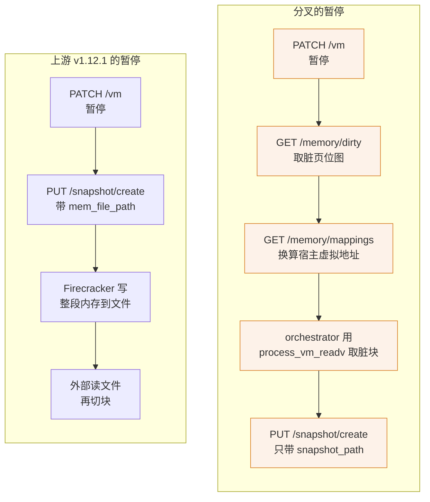

# 70 · e2b 的 Firecracker 分叉与 ARM 构建

> e2b 不用上游发布的 Firecracker，而是维护一个分叉。本篇把这个分叉相对上游 v1.12.1 到底改了什么
> 逐条对出来，说明这些改动为什么是「自己导出内存」这条路线的必要条件，然后讲 aarch64 上
> 怎么把它编出来、编出来的东西为什么叫 v1.13.1。
>
> **读者**：系统工程师、要在私有环境自建这套二进制的人。
> **预备**：[第 03 篇 · Firecracker 入门](03-firecracker-primer.md)、
> [第 05 篇 · userfaultfd](05-userfaultfd.md)、[第 68 篇 · aarch64 与 x86 的虚拟化差异](68-aarch64-virtualization-differences.md)。
> **代码**：分叉 Firecracker 的 `src/vmm/src/persist.rs`、`src/vmm/src/rpc_interface.rs`、
> `src/vmm/src/lib.rs`、`src/vmm/src/utils/pagemap.rs`、`src/vmm/src/vstate/vm.rs`、
> `resources/seccomp/`、`scripts/build.sh`、`src/firecracker/src/main.rs`；
> `packages/orchestrator/internal/sandbox/fc/memory.go`、`internal/sandbox/block/cache.go`、
> `packages/shared/pkg/feature-flags/flags.go`；`e2b-deploy/dep/init-client.sh`

---

## 0. 本篇要回答的问题

1. e2b 为什么必须分叉 Firecracker，而不能只用上游二进制加外部工具？
2. 分叉相对上游 v1.12.1 究竟改了哪几处？哪些是新增能力，哪些只是配套？
3. 分支名里的 `direct-mem` 指的是什么？
4. 在 aarch64 上构建这个分叉要改什么，为什么要注释掉 `resize_fdtable()`？
5. 源码写着 1.12.1，装到节点上却叫 `v1.13.1`，这个不一致会引发什么？
6. 分叉仓库归档之后，上游 infra 的版本从哪来？

---

## 1. 分叉的起点：上游快照 API 与 e2b 内存管线的矛盾

上游 Firecracker 的快照是一个封闭动作：`PUT /snapshot/create` 收到
`mem_file_path` 与 `snapshot_path` 两个路径，把 vCPU 与设备状态写进前者，
把整段 guest 内存写进后者。要做增量快照，就打开 `track_dirty_pages`，
让 KVM 维护脏页日志，然后请求 `Diff` 类型的快照。

这套接口对 e2b 不合用，有三条互相独立的原因。

第一，e2b 的内存产物不是一个文件，而是一棵 diff 树：每一代快照只存本代改动的块，
块到代的映射记在 header 里（[第 29 篇 §5](29-template-artifact-format.md#5-diff-链是怎么长出来的)）。
上游写出来的整块内存文件还要再被读一遍、切块、比对、丢弃，等于把同一份内存搬两次。
一台 4 GiB 的沙箱暂停一次就是 4 GiB 的落盘再加 4 GiB 的读回。

第二，e2b 的内存并不「在」Firecracker 里。恢复出来的沙箱用 `Uffd` 后端，
guest 内存是一片匿名映射，页由外部的 uffd 处理进程按需从对象存储填进来
（[第 31 篇 §4](31-uffd-memory-backend.md#4-一次缺页)）。从没被访问过的页在宿主上根本不存在，
让 Firecracker 把整段区间写成文件，等于把这些空洞实体化。

第三，e2b 判断脏页用的不是 KVM 脏页日志，而是 userfaultfd 写保护位
（[第 05 篇 §4.2](05-userfaultfd.md#42-判据pagemap-bit-57)、[第 37 篇 §3](37-pause-and-snapshot.md#3-脏页判据)）。
这个信号在 `/proc/self/pagemap` 里，上游 Firecracker 没有任何接口把它暴露出来。

于是路线反过来：**Firecracker 只负责写 vmstate，内存由外面直接从它的进程地址空间读走。**
`packages/orchestrator/internal/sandbox/fc/memory.go` 的 `ExportMemory()` 就是这条路的末端 ——
它拿到宿主虚拟地址区间后调 `block.NewCacheFromProcessMemory()`，
后者在 `internal/sandbox/block/cache.go` 的 `copyProcessMemory()` 里用
`process_vm_readv(2)` 从 Firecracker 进程的地址空间成段读出来（`unix.ProcessVMReadv`），
不经过文件，也不经过 guest。
「直接从内存读」就是分支名 `firecracker-v1.12-direct-mem` 的含义（**推论**：分支名本身没有文档说明，
这个解释来自代码事实 —— `mem_file_path` 变成可选、新端点返回宿主虚拟地址、
orchestrator 用 `process_vm_readv` 跨进程取页，三者指向同一件事）。

这条路要成立，需要 Firecracker 配合三件事：允许不写内存文件、
告诉外面每个 guest 内存区间落在宿主虚拟地址空间的哪里、把脏页信号交出来。
分叉改的就是这三件事。

## 2. 分叉改了什么

下表是在 `kasandbox-arm/firecracker`（分支 `firecracker-v1.12-direct-mem` 的
`54a1c1a` 加 ARM 构建修复）上逐处核对出来的改动。判断「相对上游」的依据是
`CHANGELOG.md` 顶部仍然是上游的 `[1.12.1]` 条目、没有任何 e2b 自己的条目，
所有 Cargo 版本号仍是 `1.12.1`，因此代码里凡是上游 1.12.1 没有的东西都是分叉加的。

| 位置 | 改动 | 属于哪件事 |
|---|---|---|
| `src/vmm/src/vmm_config/snapshot.rs` | `CreateSnapshotParams.mem_file_path` 改成 `Option<PathBuf>` | 允许不写内存文件 |
| `src/vmm/src/persist.rs` | `create_snapshot()` 仅在 `mem_file_path` 为 `Some` 时导出内存 | 同上 |
| `src/vmm/src/vstate/vm.rs` | 新增 `GuestMemoryRegionMapping`、`guest_memory_mappings()`、`get_memory_info()`、`mincore_bitmap()` | 暴露地址与驻留信息 |
| `src/vmm/src/lib.rs` | 新增 `Vmm::get_dirty_memory()` | 暴露脏页信号 |
| `src/vmm/src/utils/pagemap.rs` | 新文件，读 `/proc/self/pagemap` | 同上 |
| `src/vmm/src/rpc_interface.rs` | 新增三个 `VmmAction` 与 `VmmData` 变体、`get_dirty_memory_info()` | 接口 |
| `src/firecracker/src/api_server/` | `request/memory.rs` 新文件，`parsed_request.rs` 加三条路由 | 接口 |
| `src/vmm/src/vmm_config/instance_info.rs` | 新增三个响应结构，`InstanceInfo` 多一个 `memory_regions` 字段 | 接口 |
| `src/firecracker/swagger/firecracker.yaml` | 加 `/memory/mappings` 与 `/memory` 两条路径与配套定义 | 接口 |
| `resources/seccomp/*.json` | vmm 线程放行 `mincore`（两个架构）与 `pread64`（仅 x86_64） | 配套 |
| `src/vmm/src/persist.rs` | uffd 握手抽成独立函数 `send_uffd_handshake()` | 重构 |
| `scripts/build.sh`、`scripts/upload.sh` | 新文件，出版本名与上传 | 构建 |

值得单独说明的有四处。

### 2.1 内存文件变成可选

这是整个分叉的支点。`create_snapshot()` 现在写完 vmstate 之后只有一句
`if let Some(ref mem_file_path) = params.mem_file_path`，没给路径就跳过内存导出。
`firecracker.yaml` 里 `SnapshotCreateParams` 的 `required` 也只剩 `snapshot_path`。
orchestrator 侧确实没给：`fc/client.go` 的 `createSnapshot()` 只填了
`SnapshotType: Full` 与 `SnapshotPath`。

收益是暂停路径上不再有一次全量内存落盘。代价是 Firecracker 交出的快照不再自洽 ——
`snapshot_path` 里的 vmstate 单独存在时是没有内存可配的，
内存与 vmstate 的一致性从此由外部保证：必须先 `PATCH /vm` 暂停、
再取脏页位图、再跨进程读页，中间任何一步顺序错了都会得到一份撕裂的快照。
Firecracker 只保留了一道守卫：`rpc_interface.rs` 的 `get_dirty_memory_info()`
在 `instance_info.state != VmState::Paused` 时返回 `OperationNotSupportedWhileRunning`，
所以「没暂停就取脏页」会被挡下。读内存本身不在 Firecracker 的视野里，
读得早了、读得晚了、漏读了哪一块，它都无从察觉。

### 2.2 三个只读端点

`/memory/mappings`、`/memory`、`/memory/dirty` 对应
`VmmAction::GetMemoryMappings`、`GetMemory`、`GetMemoryDirty`，
路由在 `parsed_request.rs` 里按 `("memory", 次级路径)` 分派。
三者在 `handle_preboot_request()` 里统一返回 `OperationNotSupportedPreBoot`，
即只在 microVM 起来之后可用。端点各自的语义与 e2b 的两条使用路径已经在
[第 03 篇 §6](03-firecracker-primer.md#6-分叉多出来的三个只读端点)讲过，这里只补实现细节。

`/memory/mappings` 返回的每个区间有四个字段
（`base_host_virt_addr`、`size`、`offset`、`page_size`），字段与 uffd 握手报文里的
`GuestRegionUffdMapping` 一致，只是没有那个已废弃的 `page_size_kib`。
`offset` 是区间在「假想的那个内存文件」里的偏移，按区间顺序累加 ——
即使文件从来没被写出来，这套偏移仍然是内存产物的坐标系。

`/memory/dirty` 的实现在 `lib.rs` 的 `Vmm::get_dirty_memory()`，两级过滤：
先对整个区间做一次 `mincore()` 得到驻留位图（`vstate/vm.rs` 的 `mincore_bitmap()`），
只对驻留的页再去 `/proc/self/pagemap` 逐页 `pread` 一个 8 字节表项。
判据在 `utils/pagemap.rs` 的 `is_page_dirty()`：**bit 63 置位（页在内存里）
且 bit 57 清零（uffd 写保护已被解除）**。两级的用意是省 `pread` ——
没驻留的页不可能脏，直接跳过。

这里有一个采样假设要注意。pagemap 的粒度永远是宿主页（4 KiB），
而 guest 页在开了大页时是 2 MiB。`is_page_dirty()` 只读大页里第一个宿主页的表项，
注释写明「for huge pages, all host pages within the huge page typically have the same
dirty status」。这个假设在 uffd 按大页为单位 `UFFDIO_COPY` 与解除写保护时成立，
但它是假设而不是不变量。

两级过滤的两级取整方向还不一样，值得对照着看。`mincore_bitmap()` 判一个 guest 页驻留的
条件是它覆盖的宿主页里**任意一个**驻留（`.any()`），并且 `mincore()` 本身失败时一律按驻留处理；
`is_page_dirty()` 判脏则只看**第一个**宿主页。前者朝「宁可多算」偏，后者朝「按样本代表整体」偏。
在大页整存整取的前提下两者都落到同一个结论上；一旦某个大页被拆成宿主页粒度处理，
这两处就会各自失真，且失真方向相反。

`/memory` 走的是另一套：`get_memory_info()` 对每个区间先 `mincore()`，
再对驻留页用 `memcmp()` 与一段零缓冲比较，同时给出 resident 与 empty 两张位图。
`memcmp` 要真读内存，代价是 O(驻留内存)，所以它只用在冷启动这条一次性的路径上。

### 2.3 uffd 握手与注册模式

`persist.rs` 的 `send_uffd_handshake()` 把「连 Unix socket、
把区间映射 JSON 作为正文、把 userfaultfd 作为控制消息一起 `send_with_fd`」这段
从 `guest_memory_from_uffd()` 里提了出来。行为与上游一致，
包括那段解释「uffd 处理进程崩溃后 guest 内存会静默退化成匿名内存」的长注释。
**推论**：抽出来是为了单测 —— 同文件里有 `test_send_uffd_handshake()` 直接调它。
这一处不改变协议，写 uffd 处理进程时不需要区分版本。

真正需要记住的是这个函数上面几行：**分叉没有动 uffd 的创建与注册方式**。
`guest_memory_from_uffd()` 建 `UffdBuilder` 时只写了一句
`require_features(FeatureFlags::EVENT_REMOVE)`（注释说明这是为 balloon 设备的 `madvise` 准备的，
无条件开着也不影响行为），没有要求 `UFFD_FEATURE_PAGEFAULT_FLAG_WP`；
注册每个区间时调的是 `uffd.register()`，也就是**只注册 `UFFDIO_REGISTER_MODE_MISSING`**，
没有 `UFFDIO_REGISTER_MODE_WP`。

这一句话是本篇与另外两篇的接缝。Firecracker 交出去的那个 uffd 上，
写保护语义完全由 orchestrator 侧的 uffd 处理进程自己维持：
`uffd/userfaultfd/userfaultfd.go` 的 `faultPage()` 在读缺页时给 `UFFDIO_COPY`
带上 `UFFDIO_COPY_MODE_WP`，让页填进来的同时保持写保护，
写访问则不带，于是 pagemap 的 bit 57 被清掉、`is_page_dirty()` 判其为脏。
换句话说 `GET /memory/dirty` 只是**读取**这个由 copy 模式维持出来的状态，
它自己不会给任何页加写保护。ARM 适配版把那两行 `copyMode |= UFFDIO_COPY_MODE_WP` 注释掉之后，
bit 57 从此不再被置位，同一个端点返回的位图语义随之从「写过的页」退化成「驻留的页」——
这条链的完整讨论在[第 72 篇 §3](72-uffd-on-arm.md#3-判据是怎么塌缩的)，注册模式本身与 aarch64 内核对
HugeTLB 写保护的支持关系在[第 68 篇 §4](68-aarch64-virtualization-differences.md#4-脏页跟踪arm64-上的时间线)。

### 2.4 seccomp 白名单，以及 aarch64 上的一个缺口

新代码引入了两个上游 vmm 线程不需要的系统调用：`mincore` 与
读 pagemap 用的 `pread64`。分叉在 `resources/seccomp/x86_64-unknown-linux-musl.json`
里两个都加了，注释分别写着「Used by get_memory_dirty_bitmap to check if memory
pages are resident」与「Used by get_dirty_memory to read /proc/self/pagemap entries」；
但 `resources/seccomp/aarch64-unknown-linux-musl.json` 里**只有 `mincore`，没有 `pread64`**。
两份文件 vmm 段的默认动作都是 `trap`。

`src/firecracker/build.rs` 会把与目标三元组同名的那份 JSON 编成 BPF 直接嵌进二进制，
而 orchestrator 启动 Firecracker 时不加 `--no-seccomp`
（`fc/script_builder.go` 的启动脚本只有 `--api-sock` 一个参数）。
**推论**：因此在 aarch64 上调用 `GET /memory/dirty` 时，
`is_page_dirty()` 里的 `pread` 会撞上过滤器，vmm 线程收到 `SIGSYS`。
这条推论没有在本书的代码基线里找到运行时证据，但两份 JSON 的差集是确定的，
而 ARM 适配版并没有绕开这个端点 —— `uffd/uffd.go` 的 `DiffMetadata()`
在 ARM 与上游是同一份代码，暂停路径照样调 `/memory/dirty`。
这一项目前不在[第 86 篇](86-known-issues-and-debt.md)的清单里，建议补录。

### 2.5 没有改的地方

对照读代码时几处容易误判的地方值得记一笔。`src/vmm/src/vstate/memory.rs`
（`create()`、`anonymous()`、`memfd_backed()`、`snapshot_file()`）与上游一致，
`MAP_NORESERVE`、大页 mmap flag、`AtomicBitmap` 都是上游本来就有的；
分叉没有动内存的创建方式，只是加了观察内存的接口。
`GuestRegionUffdMapping` 里那个 `#[deprecated] page_size_kib` 也是上游的历史包袱，不是分叉加的。
uffd 的注册模式同样没动，仍是只注册 MISSING（§2.3）—— 分叉给了脏页的**读出口**，
没有给脏页的**产生方式**。
`InstanceInfo.memory_regions` 虽然是分叉加的字段，但全仓只在 `main.rs` 与
`cpu-template-helper` 里被赋成 `None`，**推论**：它是早期设计的残留，当前无效。

还有一处不一致：分叉自己的 `firecracker.yaml` 里只登记了 `/memory/mappings`
与 `/memory`，**没有 `/memory/dirty`**，尽管 `parsed_request.rs` 里这条路由确实存在。
这个端点的 OpenAPI 描述只存在于 infra 仓库自己维护的那份
`packages/shared/pkg/fc/firecracker.yml`：路径同样是 `/memory/dirty`，
`operationId: getDirtyMemory`，并且比分叉的 spec 多写了一条 400 应答
「The microVM is not paused」。Go 客户端是从那份生成的。
两份 spec 分居两个仓库、且不完全重合，是这个分叉最容易出错的接缝。



## 3. 在 aarch64 上构建

分叉的构建入口是 `scripts/build.sh`：从 `src/firecracker/swagger/firecracker.yaml`
的 `info.version` 取出 `1.12.1`，拼上 `git rev-parse --short=7 HEAD`，
得到形如 `v1.12.1_<sha>` 的版本名，然后调 `tools/devtool -y build --release`，
再把产物复制到 `build/fc/<版本名>/firecracker`。ARM 上有两处必须改。

### 3.1 产物路径的架构自适应

原来的脚本把路径写死成 `build/cargo_target/x86_64-unknown-linux-musl/release/firecracker`。
`tools/devtool` 是按宿主架构构建的（脚本里 `TARGET_PREFIX="$(uname -m)-unknown-linux-"`，
`cmd_build` 的 libc 默认是 `musl`），在 aarch64 上产物落在
`aarch64-unknown-linux-musl/`，复制这一步直接失败。ARM 适配版把目标三元组
改成由 `$(uname -m)` 拼出：

```bash
arch=$(uname -m)
target="${arch}-unknown-linux-musl"
cp "./build/cargo_target/${target}/release/firecracker" "./build/fc/${version_name}/firecracker"
```

这是纯粹的机械修正，没有行为含义。要注意的是 `tools/devtool` 会在
`tools/devctr/Dockerfile` 描述的容器里编译，那个镜像 `FROM public.ecr.aws/lts/ubuntu:24.04`，
装 rust 时两个 musl 目标都装（`rustup target add` 各来一次，注释说明是因为
`rust-toolchain.toml` 反正会按需拉），但镜像本身仍是按宿主架构构建的，
离线环境里要先把 aarch64 的那份构建容器与 rust 工具链准备好。

### 3.2 注释掉 `resize_fdtable()`

`src/firecracker/src/main.rs` 的 `main_exec()` 在启动早期会调一次 `resize_fdtable()`。
这个函数的用意在它自己的注释里：内核给进程的 fd 表默认只有 64 项，
装满会重新分配；一台设备较多的 microVM 光 eventfd / timerfd 就能撑破 64，
而在恢复路径上重分配 fd 表要付 30–70 ms（这个区间是上游注释里写的实测值）。
它的做法是 `getrlimit(RLIMIT_NOFILE)`，把**软限** `rlim_cur` 当作目标大小，
`dup2(0, limit - 1)` 逼内核一次性把 fd 表扩到位，再 `close()` 掉那个副本。
软限为 `RLIM_INFINITY` 时退回 2048，转换成 `c_int` 溢出时也退回 2048。

ARM 适配版的改动只有一处：把 `main_exec()` 里那段 `if let Err(err) = resize_fdtable()`
连同它的三分支错误处理整段注释掉，`resize_fdtable()` 函数本身与它的测试都还留在文件里，
只是不再有人调用。提交信息写的是「firecracker coredump in 2403」（2403 指 openEuler 24.03）。
**推论**：触发条件是宿主上 `RLIMIT_NOFILE` 的软限被设成了一个很大的有限值 ——
systemd 服务常见的 `LimitNOFILE=1048576` 乃至 `1073741816` 都属于这一类。
它不等于 `RLIM_INFINITY`，走不到 2048 那条分支，`try_into::<c_int>()` 又能成功，
于是 `dup2(0, limit - 1)` 让内核去分配一张上百万项的 fd 表；
表本身是指针数组加两张位图，规模足够大时分配失败或直接把进程打崩。
注释掉之后代价明确：恢复路径重新暴露在 fd 表重分配的 30–70 ms 抖动里。

比注释掉更小的改法是给宿主的 Firecracker 进程设一个合理的 `RLIMIT_NOFILE`
（例如 2048），既保留优化又避开巨额分配。当前形态是把这一段整体放弃，
属于可回退的经验性处理，不影响正确性。

### 3.3 musl 静态链接

`rust-toolchain.toml` 里 `targets` 同时列了 `x86_64-unknown-linux-musl` 与
`aarch64-unknown-linux-musl`；`tools/devtool` 的 `cmd_build` 默认 `libc="musl"`，
`-l gnu` 是可选项。选 musl 的直接收益是产物完全静态：
一个二进制拷到任何 aarch64 内核够新的机器上就能跑，
不依赖宿主 glibc 版本。这对单机离线版是硬需求 —— RPM 里那份
`firecracker.arm`（`e2b-infra.spec` 的 `Source8`）是预编译进包的，
装到什么发行版上并不知道。

选 gnu 还有一个不那么显眼的代价：`src/firecracker/build.rs` 只在
`resources/seccomp/<目标三元组>.json` 存在**且不是 debug 构建**时才编译真实过滤器，
否则退回 `unimplemented.json` —— 那份 JSON 三个线程段的 `default_action` 都是 `allow`，
也就是**空过滤器**，编译期只留一条 `cargo:warning`。仓库里只有两个 musl 目标的 JSON，
所以 gnu 构建出来的 Firecracker 默认没有 seccomp 保护，debug 构建同理。
e2b 不用 jailer，seccomp 是它保留的唯一一层内核态收敛
（[第 03 篇 §3](03-firecracker-primer.md#3-jailer-与-seccompe2b-只用了后者)），
因此 gnu 构建不应该进生产。

## 4. 版本命名：源码 1.12.1，装成 v1.13.1

节点上的布局是 `<FirecrackerVersionsDir>/<版本>/firecracker`，版本就是一个目录名
（[第 14 篇 §3.2](14-config-flags-versions.md#32-节点上的布局)）。
单机离线版把二进制装到 `/fc-versions/v1.13.1/`：
`e2b-deploy/dep/init-client.sh` 里写死 `FIRECRACKER_VERSION=1.13.1`，
把 RPM 带的 `/opt/e2b-infra/bin/firecracker` 复制过去。
而源码里所有 Cargo 版本号与 swagger 的 `info.version` 都是 1.12.1，
`scripts/build.sh` 按这个值生成的版本名也是 `v1.12.1_<sha>`。
换句话说，**`v1.13.1` 不是构建产物自报的版本，是安装脚本给它起的目录名**。

配套的改动在 `packages/shared/pkg/feature-flags/flags.go`：
`DefaultFirecackerV1_10Version` 与 `DefaultFirecackerV1_12Version` 两个常量
都被改成 `"v1.13.1"`，不带 commit SHA 后缀。这会连锁触发两件事。

一是解析。上游的版本串形如 `v1.12.1_a41d3fb`，
`api/internal/sandbox/sandbox_features.go` 的 `NewVersionInfo()` 按 `_` 切开，
第二段是 commit hash。`v1.13.1` 切不出第二段，所以 ARM 适配版在同一函数里
加了 `if len(parts) > 1` 的判断，否则越界。

二是映射。`getFirecrackerVersion()` 把版本的主次号拼成 `v<major>.<minor>` 去
`firecracker-versions` 这个 JSON flag 里查，查不到就用数据库里原来的值
（[第 14 篇 §3.3](14-config-flags-versions.md#33-谁决定用哪个版本)）。
`v1.13.1` 拼出来的键是 `v1.13`，而 `FirecrackerVersionMap` 里只有
`v1.10` 与 `v1.12` 两个键，查不到，于是走回退分支，用数据库里存的
`v1.13.1` 本身。结果是对的，路径也确实存在，但它是**靠回退走通的**，
而不是靠映射命中：这条版本线在映射表里没有条目，
运维想换二进制就不能只改 flag，得改代码常量。

同时，把 `v1.10` 与 `v1.12` 两个键都指向 `v1.13.1`，等于宣布
「所有历史版本线一律用这一个二进制恢复」。在一套全新部署里这没有代价 ——
不存在用上游二进制建出来的老快照。但它取消了[第 14 篇 §3.3](14-config-flags-versions.md#33-谁决定用哪个版本)
描述的那条兼容规则：次版本线不再各自独立，如果将来真的引入了第二个
Firecracker 二进制，老模板会被错误地映射到新的那个上。

顺带一提，`v1.13.1` 这个号也不对应上游 Firecracker 的任何发布。
**推论**：它是自建产物的一个标记，用来把「自己编的这份」与
`v1.10.1_30cbb07`、`v1.12.1_a41d3fb` 这些 e2b 官方构建区分开。

## 5. 分叉归档之后

`e2b-dev/firecracker` 仓库已于 2026-08 归档，Firecracker 的发布改由 `e2b-dev/infra`
自己的 fc-versions 流水线承担。**这一条来自该仓库的公开归档说明，不在本书的代码基线里**：
基线里拿到的是这个分叉的源码快照（`kasandbox-arm/firecracker` 对应 `54a1c1a`），
它的 `README.md` 仍是上游 Firecracker 的原文，没有任何 e2b 自己的说明。

代码基线能确认的只有反面：上游 2026.09 的 `packages/` 下没有 fc-versions 目录，
`flags.go` 里仍是 `v1.10.1_30cbb07` 与 `v1.12.1_a41d3fb` 这两个「tag + 短 SHA」命名的常量，
也就是说本书截稿时的 infra 还在用归档前的产物命名。
**推论**：过渡的形态是把分叉的补丁移进 infra 仓库、在那里对上游 Firecracker 打补丁并出包，
`FirecrackerVersionMap` 的值随之换成新命名；由于映射键仍是 `v<major>.<minor>`，
已有模板的兼容规则不受影响。

对私有环境的实际影响是：自建这份二进制的入口从「clone 分叉、跑
`scripts/build.sh`」变成「跟着 infra 仓库的流水线走」。
在跟上之前，[第 80 篇 §2.1](80-single-node-rpm.md#21-source-清单)描述的做法 ——
把编好的 `firecracker.arm` 作为 `Source8` 打进 RPM、由
`init-client.sh` 安装到固定目录 —— 仍然成立，因为它不依赖任何在线产物源。

## 6. 小结

- 分叉的存在理由只有一条：让 Firecracker 停止导出内存，把内存交给外部按脏页增量地取走。
  三个只读端点、`mem_file_path` 可选、pagemap 读取，都是这一条的分解动作。
- `mem_file_path` 变成 `Option` 之后，内存与 vmstate 的一致性由 orchestrator 的调用顺序保证。
  Firecracker 只剩一道守卫：未 Paused 时 `GET /memory/dirty` 直接报
  `OperationNotSupportedWhileRunning`；跨进程读内存的时机它无从校验。
- 内存由 orchestrator 用 `process_vm_readv(2)` 从 Firecracker 进程直接读走，不落中间文件，
  这就是分支名 `direct-mem` 的由来。
- `GET /memory/dirty` 的判据是 pagemap 的 bit 63 置位且 bit 57 清零，
  先用 `mincore()` 过滤非驻留页以减少 `pread`；大页情形下按大页首个宿主页采样，这是假设不是不变量。
- 分叉没有改 uffd 的注册方式：`persist.rs` 只 `require_features(EVENT_REMOVE)`、
  只 `uffd.register()`（MISSING）。写保护由 orchestrator 侧的 `UFFDIO_COPY_MODE_WP` 维持，
  端点只是把结果读出来；ARM 上去掉那个 copy 模式，位图语义就退化了。
- `resources/seccomp/aarch64-unknown-linux-musl.json` 放行了 `mincore` 却没放行 `pread64`，
  而 vmm 段默认动作是 `trap`。推论是 aarch64 上调用 `/memory/dirty` 会触发 `SIGSYS`。
- 分叉自带的 `firecracker.yaml` 没有登记 `/memory/dirty`；Go 客户端是从 infra 仓库
  自己那份 `firecracker.yml` 生成的。两份 spec 不重合。
- ARM 构建只需两处改动：`scripts/build.sh` 里目标三元组按 `uname -m` 拼，
  `main.rs` 里注释掉 `resize_fdtable()`。后者换来的是恢复路径重新暴露在 fd 表重分配开销下。
- musl 静态链接是离线分发的前提；gnu 目标没有默认 seccomp 过滤器，不应进生产。
- `/fc-versions/v1.13.1/` 是安装脚本起的目录名，与源码的 1.12.1 无关。
  它让 `flags.go` 的版本映射恒走回退分支，并把 v1.10 / v1.12 两条线合并到同一个二进制。
- 分叉仓库已归档，发布改由 infra 仓库的 fc-versions 流水线承担；本书基线里还看不到这条流水线。

## 延伸阅读 / 下一篇

- [第 03 篇 §6](03-firecracker-primer.md#6-分叉多出来的三个只读端点)：这三个端点在 e2b 两条路径里各自怎么用。
- [第 37 篇 §2](37-pause-and-snapshot.md#2-pause-的时序)：暂停时调用这些端点的完整顺序。
- [第 71 篇 §3](71-orchestrator-arm-fc-changes.md#3-machine-configsmt-与-track_dirty_pages)：下一篇，
  讲 orchestrator 侧配合这个二进制所做的启动参数与超时调整。
- [第 72 篇 §3](72-uffd-on-arm.md#3-判据是怎么塌缩的)：
  ARM 上写保护被关掉之后，`/memory/dirty` 返回的位图意味着什么。
- [第 86 篇 · 已知问题与技术债](86-known-issues-and-debt.md)：ARM 适配版技术债的总清单；
  本篇标出的 seccomp 缺口与 `resize_fdtable()` 的取舍尚未收录在其中。
- Firecracker 上游快照文档：`docs/snapshotting/snapshot-support.md`（分叉仓库内保留了上游原文）。
