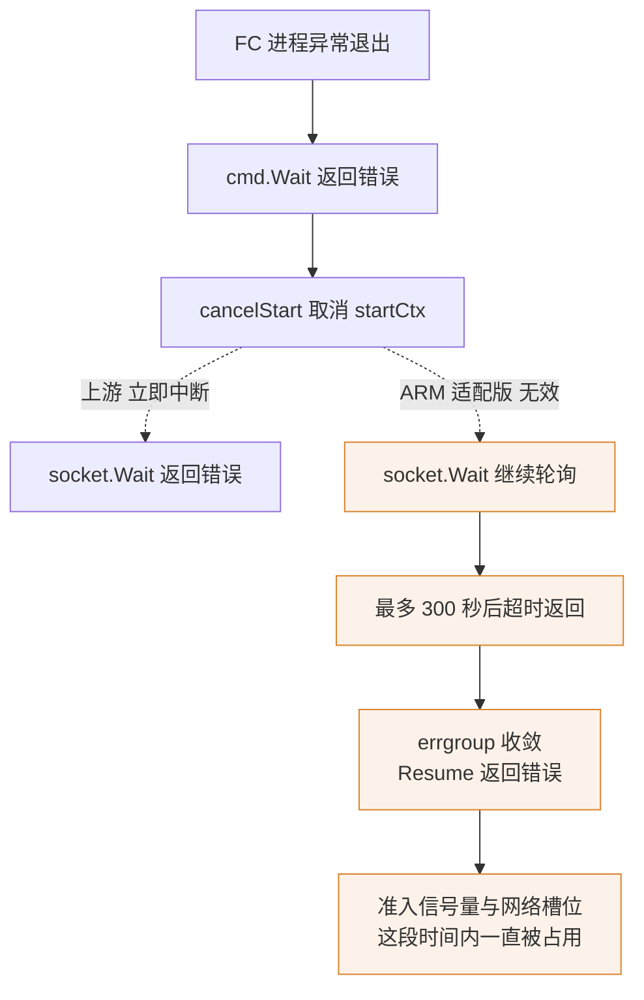

# 71 · orchestrator 的 ARM 改动 I：FC 启动、超时与并发

> ARM 适配版对 orchestrator 的第一批改动集中在沙箱恢复这条热路径上：内核命令行按架构分支、
> machine-config 去掉 aarch64 不接受的字段、四处超时整体放宽一个数量级、并发准入从「满了就拒」
> 改成「排队等」。前两类是架构必需，后两类是经验性调参 —— 它们让系统在慢机器上跑得通，
> 代价是失败被发现得更晚。
>
> **读者**：读过 orchestrator 恢复路径的工程师。
> **预备**：[第 27 篇 · ResumeSandbox](27-resume-sandbox.md)、
> [第 28 篇 · Firecracker 进程管理](28-firecracker-process-management.md)、
> [第 68 篇 · aarch64 与 x86 的虚拟化差异](68-aarch64-virtualization-differences.md)。
> **代码**：`packages/orchestrator/internal/sandbox/fc/process.go`、`fc/client.go`、
> `sandbox/socket/socket.go`、`sandbox/uffd/uffd.go`、`sandbox/network/pool.go`、
> `internal/server/sandboxes.go`、`internal/server/main.go`、`sandbox/sandbox.go`

---

## 0. 本篇要回答的问题

1. 上游写死在内核命令行里的 `pci=off`、`i8042.*`、`random.trust_cpu`、`clocksource=kvm-clock`，
   哪几个只对 x86 有意义？按 `runtime.GOARCH` 分支之后，x86 那一侧的语义有没有跟着变？
2. `Smt` 从 `true` 改成 `false` 是可选的调优还是硬性要求？删掉 `TrackDirtyPages` 字段有什么后果？
3. `socket.Wait` 自带 300 秒超时之后，「FC 进程先死掉」这件事还能不能立刻把等待打断？
4. 把准入信号量从 `TryAcquire` 换成带 300 秒超时的 `Acquire`，对调用方意味着什么？
5. 网络槽位池从 32 / 100 放大到 300 / 1000，多花了什么、省下了什么？
6. `[ResumeSandbox]` 埋点日志记录了哪些阶段，它们之间是并列还是嵌套？

---

## 1. 三类改动，三种可回退性

本篇涉及的改动可以按性质分成三类，读的时候要分清，因为它们的处置方式完全不同。

**第一类是架构必需。** 不改就跑不起来：aarch64 上的 Firecracker 会拒绝 `smt=true` 的
machine-config；x86 专属的内核参数在 aarch64 guest 上无对应设备。这类改动没有回退空间，
只能讨论实现是否干净。

**第二类是环境适配。** 目标机器的单核性能、存储后端、无外网条件与上游的 GCP 机型不同，
上游按秒级标定的超时在这里偏紧。这类改动可以回退，代价是在慢环境下偶发失败。

**第三类是可观测埋点。** `[ResumeSandbox]` 日志不改变任何行为，但单机离线版的基准测试工具依赖它，
删掉就等于删掉了[第 84 篇 §4](84-arm-performance.md#4-工具链run--collect--parse)的数据来源。

一句话概括三类的边界：架构必需的改动改的是**能不能跑**，超时与并发改的是**跑得慢时怎么办**，
埋点改的是**跑完之后能不能知道慢在哪**。

---

## 2. 内核命令行按架构分支

### 2.1 分出去的五个参数

上游 2026.09 的 `fc/process.go` 在 `Create()` 里把内核参数拼成一个 `KernelArgs` map，
其中 `pci=off`、`i8042.nokbd`、`i8042.noaux`、`random.trust_cpu=on` 四项无条件写入，
`clocksource=kvm-clock` 由 `ProcessOptions.KvmClock` 控制。逐项含义见
[第 28 篇 §5](28-firecracker-process-management.md#5-内核命令行逐项)，这里只讲它们与架构的关系。

ARM 适配版把这五项一起收进一个分支：

```go
if runtime.GOARCH == "amd64" || runtime.GOARCH == "386" {
    args["pci"] = "off"
    args["i8042.nokbd"] = ""
    args["i8042.noaux"] = ""
    args["random.trust_cpu"] = "on"
    args["clocksource"] = "kvm-clock"
}
```

`pci=off` 与 `i8042.*` 是最容易判断的两项。Firecracker 的设备模型是 virtio-mmio，本来就没有
PCI 总线；`fc-kernels-arm/configs/arm64/6.1.158.config` 里 `CONFIG_PCI is not set`，
内核里根本没有 PCI 子系统去接收这个参数，`i8042` 对应的 PS/2 控制器同样是 x86 平台设备。
去掉它们对 aarch64 guest 没有任何行为影响。

`random.trust_cpu` 的情况不同，值得单独说：这个参数由 `drivers/char/random.c` 解析，不是 x86 专属，
aarch64 上对应的是 `RNDR` 指令提供的种子。把它归到 x86 分支意味着 aarch64 guest 不再显式打开它。
不过 `configs/arm64/6.1.158.config` 里 `CONFIG_RANDOM_TRUST_CPU=y`，编译期默认已经是「信任」，
命令行参数只是重复声明。**推论**：因此这一项的移除在当前 guest 内核上没有可观察的后果；
换一个 `CONFIG_RANDOM_TRUST_CPU` 未开的内核，早期 `getrandom` 阻塞的风险会回来。

### 2.2 kvm-clock 与 KvmClock 选项

`clocksource=kvm-clock` 让 guest 用 KVM 提供的半虚拟化时钟，省掉 TSC 校准。
这个 clocksource 由 x86 的 `arch/x86/kernel/kvmclock.c` 注册；aarch64 上没有同名 clocksource，
计时来自架构定时器（`CONFIG_ARM_ARCH_TIMER=y`，即 `arch_sys_counter`）。
**推论**：`clocksource=` 只是按名字挑选一个已注册的 clocksource，写一个不存在的名字不会导致启动失败，
只是这个参数被忽略 —— 也就是说，即便不加这个分支，aarch64 上的行为也不会错，
分支带来的是命令行更干净，而不是修复了一处故障。aarch64 侧的定时器细节见
[第 68 篇 §1.3](68-aarch64-virtualization-differences.md#13-定时器arch-timer-与-kvm-clock)。

真正值得注意的是分支的副作用：上游的 `if options.KvmClock` 被这个架构分支**取代**了，
不是嵌套在里面。`ProcessOptions.KvmClock` 字段在 ARM 适配版里仍然存在、仍然被
`phases/base/provision.go` 与 `layer/create_sandbox.go` 赋值，但 `process.go` 不再读它。
上游用这个开关做的是版本兼容：`create_sandbox.go` 里
`utils.IsGTEVersion(cs.config.Envd.Version, minEnvdVersionForKVMClock)`，
只有 envd ≥ 0.2.11 的模板才开 kvm-clock。ARM 适配版在 x86 上编译时会对所有模板无条件打开这个参数，
旧版 envd 的兼容判断失效。由于交付形态是 aarch64 二进制，这段代码在实际部署中不执行，
属于潜伏的分叉而非现网问题；把 `options.KvmClock` 判断嵌回架构分支内部即可消除。

---

## 3. machine-config：SMT 与 track_dirty_pages

`fc/client.go` 的 `setMachineConfig()` 在上游 2026.09 里发出的 machine-config 有四个字段：
`VcpuCount`、`MemSizeMib`、`Smt: true`、`TrackDirtyPages: false`。ARM 适配版把 `Smt` 改成 `false`，
并整个删掉 `TrackDirtyPages` 字段。两项的性质完全不同。

`Smt` 是硬性要求。分叉 Firecracker 的 `src/vmm/src/vmm_config/machine_config.rs` 里，
`MachineConfig::update()` 有一段带 `#[cfg(target_arch = "aarch64")]` 的检查：`smt` 为真直接返回
`MachineConfigError::SmtNotSupported`。也就是说在 aarch64 上保留 `smt=true`，
`PUT /machine-config` 会直接失败，沙箱创建在配置阶段就断掉。这不是调优，是必改项。
它对 vCPU 数没有别的约束：上游同一段代码里「SMT 打开时 vCPU 数必须是 1 或偶数」的限制随之消失，
aarch64 上任意 vCPU 数都合法。

`TrackDirtyPages` 的删除则是一次语义上的空操作。Firecracker 的 `track_dirty_pages` 默认值就是
`false`（`machine_config.rs` 的 `Default` 实现），而 Go 侧 `models.MachineConfiguration` 的该字段带
`json:"track_dirty_pages,omitempty"`，删掉之后请求体里不出现这个键，VMM 取默认值 —— 与上游显式写
`false` 等价。更关键的是 e2b 本来就不依赖 Firecracker 的脏页跟踪：`fc/client.go` 的
`createSnapshot()` 用的是 `SnapshotCreateParamsSnapshotTypeFull`，全量快照；
增量是靠宿主侧 uffd 的写保护判定出来的，见
[第 72 篇 §3](72-uffd-on-arm.md#3-判据是怎么塌缩的)。所以这一处改动既不省开销也不丢能力，
只是让请求体少一个字段。

---

## 4. socket.Wait：一个自带的 300 秒超时

### 4.1 上游的等待语义

`socket/socket.go` 的 `Wait()` 是一个 10 ms 一跳的轮询循环，等某个 Unix socket 文件出现。
它自己不设上限，只在 `ctx.Done()` 上退出 —— 上限由调用方给。上游有两个调用点，
它们传进来的 context 各自携带了不同的取消源：

- `Process.configure()` 里等 Firecracker 的 API socket，传的是 `startCtx`。
  这个 context 由 `context.WithCancelCause` 派生，`cmd.Wait()` 所在的 goroutine 一旦发现 FC 进程
  异常退出，就调 `cancelStart(errMsg)`。**FC 先死，等待立刻结束，错误带着原因回来。**
- `Process.Resume()` 里等 uffd handler 的 socket，传的是 errgroup 的 `egCtx`，
  外层还叠着请求级的 `requestTimeout`。同组的兄弟 goroutine 出错、或整个请求超时，等待都会被打断。

### 4.2 ARM 适配版的改法与后果

ARM 适配版给 `Wait()` 加了一个由 `SOCKET_WAIT_TIMEOUT_SECONDS` 控制、默认 300 秒的超时，
读取用的是 `shared/pkg/env` 的 `GetEnvAsInt`。加超时本身合理：上游把上限完全交给调用方，
在慢机器上如果调用方的 context 也很宽松，这里可以等到天荒地老。问题出在派生方式上：

```go
ctx, cancel := context.WithTimeout(context.Background(), time.Duration(timeoutSeconds)*time.Second)
```

新 context 派生自 `context.Background()`，并且遮蔽了同名的入参 `ctx`。
循环里的 `select` 从此只看这个新 context，传进来的那个被完全丢弃。三条取消链一起断掉：
FC 进程死亡不再打断等待、errgroup 的兄弟错误不再打断等待、请求级超时也不再打断等待。



后果是可以量化的。上游语义下，FC 因为内核路径不对、快照文件损坏之类的原因秒退，
`Create` 会在毫秒级返回错误，槽位立刻释放；ARM 适配版下同样的故障要等满 300 秒。
这段时间里，这次请求占着一个准入信号量名额（总共 30 个）、一个网络槽位、一份 uffd handler，
并且外层的 `requestTimeout`（同样是 300 秒，见 §6）无法把它拉回来 ——
因为 `errgroup.Wait()` 必须等所有 goroutine 返回，而这个 goroutine 不再理会任何外部取消。
**推论**：把最后一行改成 `context.WithTimeout(ctx, ...)` 就能同时保留超时上限与取消传播，
这是一处不需要权衡的修复。

另有一个次要行为变化：`GetEnvAsInt` 在环境变量存在但不是合法整数时返回错误，
`Wait()` 直接把它返回。也就是说 `SOCKET_WAIT_TIMEOUT_SECONDS=abc` 会让所有沙箱恢复在等 socket 这一步
立即失败，而不是退回默认值。

---

## 5. uffd 监听超时：10 s → 120 s

`uffd/uffd.go` 的 `handle()` 在 `Accept()` 之前给监听 socket 设一个 deadline，
常量 `uffdMsgListenerTimeout` 上游是 10 秒，ARM 适配版改成 120 秒。
这个超时管的是「宿主侧 uffd handler 起好监听之后，等 Firecracker 连上来交出 userfaultfd 与内存区间映射」
这一步 —— 恢复路径上宿主与 VMM 的唯一握手点，见
[第 27 篇 §3](27-resume-sandbox.md#3-并行段三个-promise-和一个后台预取)与
[第 31 篇 §2](31-uffd-memory-backend.md#2-握手从-socket-到就绪)。

10 秒在上游是一个「几乎不可能触发，触发即异常」的值：FC 进程起来到 `loadSnapshot` 发出连接，
正常在百毫秒量级。放宽到 120 秒说明目标环境里这一步确实出现过秒级以上的抖动。
**推论**：抖动的来源是 FC 进程启动本身 —— 在 netns 里 exec 一串命令、加载内核与快照元数据，
在单核性能较弱的机器上高并发时会被拉长；这与[第 84 篇 §6.1](84-arm-performance.md#61-主战场configured-fc)测到的
「FC 启动是主要瓶颈」一致。

代价与 §4 同类：deadline 是这条路径上唯一能发现「FC 根本不会连上来」的机制，
把它从 10 秒放到 120 秒，就把这一类故障的发现时间放大了 12 倍。

---

## 6. 准入：三个常量与一次语义变化

`internal/server/sandboxes.go` 顶部的三个常量在 ARM 适配版里全部被放大：

- `requestTimeout` 60 s → 300 s。它用在 `Create()` 与 `Delete()` 开头的
  `context.WithTimeoutCause`，是单次 RPC 的总预算。
- `acquireTimeout` 15 s → 300 s。它用在 `utils.go` 的 `waitForAcquire()`，
  是等待准入信号量的上限。
- `maxStartingInstancesPerNode` 3 → 30。它是 `server.New()` 里
  `semaphore.NewWeighted()` 的权重，即单节点同时处于「正在启动」状态的沙箱数上限。

第三个常量还被环境变量化：`internal/server/main.go` 里用
`env.GetEnvAsInt("MAX_STARTING_INSTANCES_PER_NODE", maxStartingInstancesPerNode)` 读取。
ARM 适配版的 Nomad job 模板（`iac/provider-gcp/nomad/jobs/orchestrator.hcl` 与
`template-manager.hcl`）里显式写了 `"30"`，与代码默认值一致 —— 这个环境变量的意义是让运维
能在不重新编译的情况下扫参数，[第 84 篇 §5.1](84-arm-performance.md#51-恢复各阶段100-并发)
的并发实验正是靠它做的。

这里有两条容易踩到的回落规则，方向不同：

- **值不是合法整数**（例如 `MAX_STARTING_INSTANCES_PER_NODE=abc`）：`GetEnvAsInt` 返回错误，
  `New()` 记一条 `Error` 级日志再回落到编译期常量。这一类是有痕迹的。
- **值是空串**：`GetEnvAsInt` 里的判断是 `if v := os.Getenv(key); v != ""`，空串走不进解析分支，
  直接返回默认值，既不报错也不记日志。job 模板里的 `${MAX_STARTING_INSTANCES_PER_NODE}` 若
  在渲染时没有取到值就会落到这一类，结果是**静默使用编译期常量**，而运维从 hcl 上看到的
  仍是那一行占位符。检查实际生效值只能去读进程环境：
  `tr '\0' '\n' < /proc/<pid>/environ | grep MAX_STARTING_INSTANCES_PER_NODE`。

还要注意常量本身在两个基线上不同。本篇讲的 ARM 适配版（infra-arm）里是 30；
单机离线版随 RPM 分发的那份补丁（`0001-adapted-for-arm-architecture.patch`）把同一个常量
进一步抬到 **500**，它自带的 `nomad/template-manager.hcl` 里也写 `"500"` ——
这份 hcl 的落盘位置与覆盖关系见[第 80 篇 §4](80-single-node-rpm.md#4-opte2b-infra-与三层叠加)。
也就是说「单节点同时启动上限」这个数字在本书里出现过 3、30、500 三个值，
分别对应上游 2026.09、ARM 适配版、单机离线版；引用[第 84 篇](84-arm-performance.md#3-两个基线的埋点不一样引用数据前必须核对)
的并发数据时必须先确认是哪一份。

真正改变语义的是第四处。上游 `Create()` 对准入分两条路：

```go
if req.GetSandbox().GetSnapshot() {
    err := s.waitForAcquire(ctx)   // 带 acquireTimeout 的 Acquire：排队
} else {
    acquired := s.startingSandboxes.TryAcquire(1)  // 不排队，满了立即拒
}
```

分流的理由是这两条路的耗时量级不同：从快照恢复是常态且快，值得排队；
冷启动（`snapshot=false`，实际只服务于模板构建，见
[第 27 篇 §7](27-resume-sandbox.md#7-与-createsandbox-的区别)）慢得多，
让它排队会把名额长时间占住，所以宁可立刻回 `ResourceExhausted` 让上层换节点。

ARM 适配版把 `else` 分支也改成了带超时的 `Acquire`，超时用 `acquireTimeout`：

```go
ctx, cancel := context.WithTimeout(ctx, acquireTimeout)
defer cancel()
err := s.startingSandboxes.Acquire(ctx, 1)
```

两条路由此合流：都排队，最长 300 秒。对调用方来说，「节点满了」这个信号从「毫秒级收到
`ResourceExhausted`」变成「最长 300 秒后才收到」。在多节点集群里这会削弱 api 侧的负载分摊 ——
`ResourceExhausted` 本来是让 api 换一个节点重试的信号。在单机离线版里没有别的节点可换，
排队反而比快速失败更接近用户期望。**推论**：这条改动的动机是单机形态，
在多节点部署（[第 79 篇 §2](79-nomad-multinode-deployment.md#2-四类节点与它们跑什么)）下应当回退到上游的分流写法。

还要注意 `requestTimeout` 与 `acquireTimeout` 都是 300 秒这件事：排队理论上可以吃掉整个请求预算，
让真正的恢复工作没有时间可用。`waitForAcquire()` 里的 `context.WithTimeout(ctx, acquireTimeout)`
是在请求 context 之上再叠一层，所以实际上限取两者的较小值，即 300 秒；
排队排满之后剩下的时间是 0。上游 60 / 15 的搭配则留出了 45 秒余量。

---

## 7. 网络槽位池：32 / 100 → 300 / 1000

`network/pool.go` 的两个常量决定了两个 channel 的容量：`NewSlotsPoolSize` 是预先创建好、
等待被领走的**新槽位**数（`NewPool()` 里实际容量是 `newSlotsPoolSize-1`），
`ReusedSlotsPoolSize` 是沙箱结束后归还、可以直接复用的槽位数。
一个槽位是一整套 netns、veth 对、tap 设备与防火墙规则，创建它要走一串 netlink 与 iptables 调用，
细节见[第 35 篇 §2](35-sandbox-networking.md#2-建立一个槽位createnetwork-的完整步骤)与
[§3](35-sandbox-networking.md#3-池两条队列两种优先级)。

放大这两个值买到的是并发创建时不必现场造网络：`Populate()` 是一个不停歇的后台循环，
只要 channel 没满就继续造槽位，所以更大的 `NewSlotsPoolSize` 意味着突发并发下更长时间不会
在 `Get()` 里阻塞。更大的 `ReusedSlotsPoolSize` 则减少了 `Return()` 走到 `default` 分支去
`cleanup()`（拆掉 netns 再重建）的概率。

代价有三项。其一是常驻资源：稳态下宿主上会保持 299 个空闲 netns，加上最多 1000 个待复用的，
每个都带着自己的接口与规则表；这部分内核内存与规则数在上游的 32 / 100 下是数量级更小的。
其二是启动期的抢占：`Populate()` 在 orchestrator 起来后会连续创建几百个槽位，
这段时间与沙箱恢复争 CPU 与 netlink。其三是地址空间占用 —— 不过这一项不构成约束：
`GetVrtSlotsSize()` 按默认 CIDR `10.12.0.0/16`、每槽位 2 个地址算出约 32766 个槽位，
1300 远在其下。

补丁同时在 `Populate()` 里加了一条池水位日志。它调用的是
`logger.L().Info(ctx, "[Pool Status] newSlots: %d/%d, reusedSlots: %d/%d\n", zap.Int(...), ...)`：
zap 的 `Info` 第一个参数是消息而不是格式串，四个 `%d` 不会被替换，实际数值以结构化字段输出。
日志内容不缺，但消息文本里的占位符是误导性的，并且这条日志每造一个槽位就打一次。

---

## 8. `[ResumeSandbox]` 埋点与 traceID

ARM 适配版在恢复路径上插了 12 条 `zap.L().Sugar().Infof` 日志，格式统一为
`[ResumeSandbox] <阶段> cost: <数值> ms, traceID=<32 位十六进制>`，
traceID 取自 `span.SpanContext().TraceID().String()`。为了让 `fc/process.go` 也能打印同一个 traceID，
`Process.Resume()` 的签名多了一个 `traceID string` 参数，由 `sandbox.go` 的 `ResumeSandbox()` 传入。

阶段分布在两个文件里：`sandbox.go` 记 `enter`、`wait network slot`、`get template metadata`、
`fc.NewProcess`、`resume VM`、`total`；`fc/process.go` 记 `configured fc`、`get uffd sock path`、
`get rootfs path`、`load snapshot`、`post resume`、`set mmds`。

读这组数字要注意两层嵌套关系，否则会把耗时重复计入：

- `total` 覆盖整个 `ResumeSandbox()`，其余各项都在它之内。
- `resume VM` 从 `fc.NewProcess` 返回之后开始计时，一直到 `fcHandle.Resume()` 返回，
  因此它**包含** `configured fc`、`get uffd sock path`、`get rootfs path`、`load snapshot`、
  `post resume`、`set mmds` 六项，还包含等 uffd promise 的时间。
- 其中前三项来自同一个 errgroup 的三个并发 goroutine，彼此重叠，不能相加。

为什么用日志而不是直接读 OpenTelemetry span：上游在这些位置本来就有
`telemetry.ReportEvent`，但单机离线版的可观测栈未必接了 collector，
而日志是一定落盘的。traceID 的作用是把同一次恢复的十余条日志串起来 ——
`e2b-infra/benchmark/parse_report.py` 就是按 traceID 分组、按阶段名归类做统计的。
它的阶段表里还有 `acquire wait`、`start envd`、`envd init request`、`read envd response` 四项，
而这四条日志在本篇对应的补丁里并不存在，解析出来会是空行。
**推论**：这四项属于后续追加的埋点，基准工具的阶段表比补丁走得更靠前；
用[第 84 篇 §3](84-arm-performance.md#3-两个基线的埋点不一样引用数据前必须核对)的数据时要核对报告里这几行是否有样本。

---

## 9. 参数总表

| 参数 | 上游 2026.09 | ARM 适配版 | 位置 | 改动理由 | 副作用 |
|---|---|---|---|---|---|
| `pci=off`、`i8042.nokbd`、`i8042.noaux` | 无条件 | 仅 x86 | `fc/process.go` `Create()` | aarch64 guest 内核无 PCI 子系统与 i8042 | 无 |
| `random.trust_cpu=on` | 无条件 | 仅 x86 | 同上 | 随 x86 分支一并移出（推论） | arm64 内核 `CONFIG_RANDOM_TRUST_CPU=y`，当前无影响 |
| `clocksource=kvm-clock` | 由 `KvmClock` 决定 | 仅 x86，且无条件 | 同上 | aarch64 无同名 clocksource | x86 侧 envd 版本门槛失效（当前不部署 x86） |
| `Smt` | `true` | `false` | `fc/client.go` `setMachineConfig()` | aarch64 Firecracker 返回 `SmtNotSupported` | vCPU 数不再受奇偶限制 |
| `TrackDirtyPages` | 显式 `false` | 字段删除 | 同上 | 与 FC 默认值一致（推论：为简化请求体） | 无，e2b 只做全量快照 |
| `socket.Wait` 超时 | 无，随入参 ctx | 300 s，`SOCKET_WAIT_TIMEOUT_SECONDS` | `socket/socket.go` `Wait()` | 给等待兜一个上限（推论） | 用 `context.Background()` 覆盖入参，丢失 FC 死亡与请求超时的取消传播 |
| `uffdMsgListenerTimeout` | 10 s | 120 s | `uffd/uffd.go` | FC 启动在目标机型上抖动（推论） | 「FC 不来连接」的发现时间放大 12 倍 |
| `requestTimeout` | 60 s | 300 s | `server/sandboxes.go` | 慢环境下单次恢复超预算（推论） | 失败请求占用连接与资源更久 |
| `acquireTimeout` | 15 s | 300 s | 同上 | 配合并发上限提高后的排队（推论） | 排队可吃满整个请求预算 |
| `maxStartingInstancesPerNode` | 3 | 30（单机离线版 500），可由 `MAX_STARTING_INSTANCES_PER_NODE` 覆盖 | 同上 + `server/main.go` | 单节点承载全部并发（推论） | 同时启动的沙箱争 CPU 与 IO；环境变量为空串时静默回落到常量 |
| 冷启动准入 | `TryAcquire`，满即拒 | 带 `acquireTimeout` 的 `Acquire` | `server/sandboxes.go` `Create()` | 单机无处可换节点（推论） | `ResourceExhausted` 从毫秒级变为最长 300 s 后返回 |
| `NewSlotsPoolSize` | 32 | 300 | `network/pool.go` | 突发并发下不现场造网络（推论） | 稳态常驻 299 个空闲 netns |
| `ReusedSlotsPoolSize` | 100 | 1000 | 同上 | 减少归还时的拆建（推论） | 空闲槽位占用更多内核资源 |
| `[ResumeSandbox]` 埋点 | 无 | 12 条阶段日志 + traceID | `sandbox.go`、`fc/process.go` | 基准测试需要阶段耗时 | `Resume()` 签名多一个参数；日志量随沙箱数线性增长 |

---

## 10. 小结

- 这批改动里只有两项是架构必需：`Smt` 必须为 `false`，否则 aarch64 上的 machine-config 会被拒；
  x86 专属内核参数需要分支，否则只是无效参数。`TrackDirtyPages` 的删除是语义空操作。
- `clocksource=kvm-clock` 的分支顺带吃掉了上游按 envd 版本开关的逻辑，
  `ProcessOptions.KvmClock` 在 ARM 适配版里成了没有读者的字段。
- `socket.Wait` 的 300 秒超时用 `context.Background()` 派生，切断了三条取消链；
  最实际的后果是「FC 进程先死」从毫秒级失败变成 300 秒挂起，其间占着准入名额与网络槽位。
  改成从入参 ctx 派生即可兼得两者。
- 四处超时统一放宽到 300 秒 / 120 秒，换来的是慢环境下不误杀，代价是所有这类故障的发现时间
  被同比例放大，且 `requestTimeout` 与 `acquireTimeout` 相等使排队可能吃光请求预算。
- 冷启动准入从 `TryAcquire` 改为排队，是把「快速失败并换节点」换成「等」——
  这个取舍只在单节点部署下成立。同时启动上限在三个基线上分别是 3 / 30 / 500，
  `MAX_STARTING_INSTANCES_PER_NODE` 为空串时会静默回落到编译期常量，引用并发数据前要先确认实际生效值。
- 网络槽位池放大十倍换取并发创建时不阻塞，代价是数百个常驻空闲 netns；
  地址空间不是瓶颈，默认 CIDR 下可用槽位约 32766 个。
- `[ResumeSandbox]` 埋点是本书性能篇的数据来源，读它时必须记住 `resume VM` 包含后面六项、
  errgroup 内三项互相重叠。

## 延伸阅读 / 下一篇

- [第 27 篇 §6](27-resume-sandbox.md#6-失败回滚与超时来源)：这条路径的上游形态与超时来源汇总。
- [第 28 篇 §5](28-firecracker-process-management.md#5-内核命令行逐项)：内核命令行逐项与 FC API 调用序列。
- [第 68 篇 §2.3](68-aarch64-virtualization-differences.md#23-那几个内核参数属于谁)、
  [§5](68-aarch64-virtualization-differences.md#5-firecracker-对-aarch64-的支持状态)：
  时钟、总线与设备模型层面的差异根因，以及 aarch64 上 SMT 限制的出处。
- [第 72 篇 §1](72-uffd-on-arm.md#1-改动的全貌三行注释)：同一批补丁里的 uffd 改动，以及脏页判据为什么与本篇无关。
- [第 73 篇 §2](73-cgroup-and-host-compat.md#2-cgroup关闭宿主侧记账)、
  [§4](73-cgroup-and-host-compat.md#4-健康检查两个放宽的常量与一个没跟着改的)：
  同一批补丁里 cgroup 与健康检查的改动。
- [第 84 篇 §2](84-arm-performance.md#2-阶段表并行与包含)：本篇埋点产出的数据与并发上限实验。
- [第 86 篇 §3.2](86-known-issues-and-debt.md#32-超时与并发上限全面放宽)、[§2.2](86-known-issues-and-debt.md#22-socketwait-丢失-ctx-取消传播)、[§4.2](86-known-issues-and-debt.md#42-pool-status-日志占位符不生效)：本篇标出的可回退改动在技术债清单里的位置。
