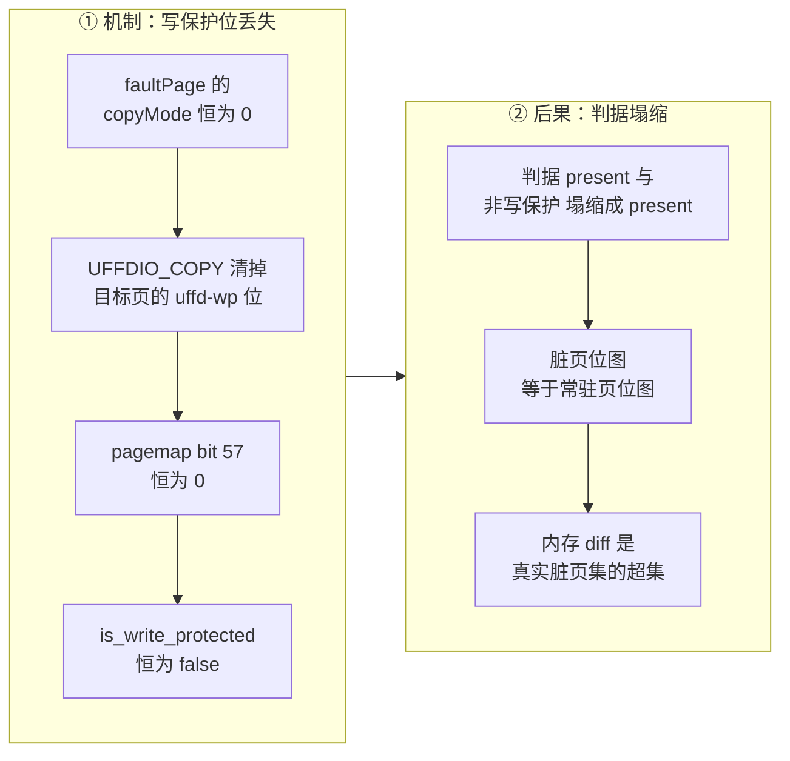

# 72 · orchestrator 的 ARM 改动 II：写保护退化

> ARM 适配版对 uffd 填页路径只做了一处功能性改动：注释掉三行设置 `UFFDIO_COPY_MODE_WP` 的代码。
> 这三行是上游精确增量的支点，去掉之后脏页判据从「被写过」塌缩成「被换入过」。
> 本篇讲这三行为什么在 aarch64 上留不住、塌缩之后成本模型变成什么样、以及怎么把它修回来。
>
> **读者**：读过 [第 05 篇](05-userfaultfd.md)、[第 31 篇](31-uffd-memory-backend.md)、
> [第 37 篇](37-pause-and-snapshot.md) 的工程师。　**预备**：知道 userfaultfd 的 MISSING 与 WP
> 两种注册模式、pagemap 的 bit 57 是什么。　**代码**：
> `packages/orchestrator/internal/sandbox/uffd/userfaultfd/userfaultfd.go`、
> `packages/orchestrator/internal/sandbox/uffd/userfaultfd/fd.go`、
> `packages/orchestrator/internal/sandbox/fc/client.go`、分叉 Firecracker 的
> `src/vmm/src/persist.rs`、`src/vmm/src/lib.rs`、`src/vmm/src/utils/pagemap.rs`

---

## 0. 本篇要回答的问题

1. ARM 适配版在 uffd 路径上到底改了什么？改动的边界有多大？
2. 为什么这三行在 aarch64 上留不住？哪些证据在仓库里，哪些只能算推论？
3. 脏页判据塌缩之后，正确性和成本各发生了什么变化？
4. 为什么「什么都不做」的两次暂停之间也会产生上百 MiB 的内存差分？
5. 预取与写保护退化叠加时，放大是相加还是相乘？
6. 修回来有几条路，各自的前提是什么？

---

## 1. 改动的全貌：三行注释

ARM 适配版对 `uffd/userfaultfd/userfaultfd.go` 的 `faultPage()` 的改动是：

```go
// Performing copy() on UFFD clears the WP bit unless we explicitly tell
// it not to. We do that for faults caused by a read access. Write accesses
// would anyways cause clear the write-protection bit.
//if accessType != block.Write {
//	copyMode |= UFFDIO_COPY_MODE_WP
//}

copyErr := u.fd.copy(addr, pagesize, b, copyMode)
```

`copyMode` 因此恒为 0。`faultPage()` 的其余部分没有动：访问类型仍然一路传进来，
`prefetchTracker.Add(offset, accessType)` 仍然按读 / 写 / 预取分类记账
（[第 32 篇 §2.1](32-memory-prefetch-and-hugepages.md#21-采集谁在记录)）。
也就是说，「区分读写」这件事在采集侧还留着，只是不再作用于页表。

同一份补丁里还有两处相邻改动，但都不改变增量语义：

| 位置 | 改动 | 对脏页判据的影响 |
|---|---|---|
| `uffd/uffd.go` | `uffdMsgListenerTimeout` 10 s → 120 s | 无。握手窗口，见[第 71 篇 §5](71-orchestrator-arm-fc-changes.md#5-uffd-监听超时10-s--120-s) |
| `fc/client.go` 的 `setMachineConfig()` | 删掉 `TrackDirtyPages` 字段，`Smt` 由 `true` 改为 `false` | 无 |

上游把 `TrackDirtyPages` 显式设为 `false`（[第 37 篇 §3](37-pause-and-snapshot.md#3-脏页判据)），
ARM 适配版把字段整个删掉，序列化时字段缺省，Firecracker 取自己的默认值。
推论：两者都等于「不开 KVM 脏页日志」，所以这处改动只是清理，不是另选了一条脏页来源。
需要注意的是它顺带关掉了一条备选路径 —— 既然 uffd 的判据要退化，KVM 脏页日志本来是可以顶上的
候选，但 ARM 适配版没有走这条路，原因见 §8。

## 2. 为什么这三行在 aarch64 上留不住

### 2.1 这条路径需要四个前提同时成立

`UFFDIO_COPY_MODE_WP` 不是一个可以单独打开的开关。让「填页时保留写保护位、事后查 pagemap」
这套判据跑起来，需要四件事同时成立：

1. **区间以 `UFFDIO_REGISTER_MODE_WP` 注册。** 内核只允许对注册了写保护模式的区间做带
   `MODE_WP` 的 `UFFDIO_COPY`。
2. **内核在这个架构上实现了 uffd 写保护。** uffd-wp 需要页表项里有一个可用的软件位来记录
   「这一页被 uffd 写保护」，各架构分别实现，由 `CONFIG_HAVE_ARCH_USERFAULTFD_WP` 标记。
3. **对承载 guest 内存的那种映射也实现了。** e2b 的沙箱内存跑在 2 MiB HugeTLB 上
   （[第 32 篇 §5](32-memory-prefetch-and-hugepages.md#5-大页改变了哪些量)），
   匿名内存支持 uffd-wp 不等于 HugeTLB 也支持。
4. **协商到 `UFFD_FEATURE_WP_ASYNC`。** 没有这个特性时，写保护故障要发给用户态处理一次
   （[第 05 篇 §4.1](05-userfaultfd.md#41-两种-wp)）。上游的 handler 根本没有处理 WP 事件的分支，
   `userfaultfd.go` 的事件分派对非 MISSING 事件直接报 `ErrUnexpectedEventType`。
   缺了异步 WP，这条路不是变慢，是走不通。

四条里任何一条不成立，`UFFDIO_COPY_MODE_WP` 要么直接返回 `EINVAL`，要么把整台沙箱卡死在
一个没人处理的事件上。而 `faultPage()` 里 `copy` 失败会调 `onFailure()` 叫停沙箱
（[第 31 篇 §5.3](31-uffd-memory-backend.md#53-失败时谁停下)）—— 失败模式是沙箱起不来，不是慢一点。

### 2.2 仓库里能查到的两条硬证据

**其一，本书能读到的分叉 Firecracker 根本没有以 WP 模式注册。**
`src/vmm/src/persist.rs` 的 `guest_memory_from_uffd()` 里，`UffdBuilder` 只
`require_features(FeatureFlags::EVENT_REMOVE)`，随后对每个内存区间调
`uffd.register(ptr, size)` —— 这个封装只带 MISSING 模式。
[第 70 篇 §2.3](70-firecracker-fork.md#23-uffd-握手与注册模式) 逐条核对过这个分叉相对上游改了什么，
结论是：分叉动的是 uffd 的**握手代码组织**（把发送逻辑抽成 `send_uffd_handshake()` 便于单测），
**注册模式与特性协商一行未改**。也就是说这条限制不是 ARM 适配版引入的，
而是分叉本身就只给了脏页的读出口、没给脏页的产生方式。
第 2.1 节的前提 1 和前提 4 因此都不成立。上游 `uffd/userfaultfd/fd_helpers_test.go` 里那句注释
「This is already called by the FC, but only with the `UFFDIO_REGISTER_MODE_MISSING`」
指向同一个事实：注册模式由 Firecracker 决定，orchestrator 改不了。

**其二，目标宿主机的内核版本早于主线打开 arm64 uffd-wp 的版本。**
单机离线版的部署文档记录的运行内核是 `6.6.0_6.6.0_515-uffd_copy_open_tree`
（openEuler / aarch64，见 `single-node-offline-deploy.md` 里 nbd 模块的 vermagic 校验），
HDBSS 调研记录里的鲲鹏 950 机器跑的也是同一串版本号。
`UFFD_FEATURE_WP_ASYNC` 与 arm64 侧的 uffd-wp 都是 6.7 才进主线的东西。
代码里还留着一处旁证：`uffd/userfaultfd/fd.go` 的 cgo 头部写着

```c
#ifndef UFFD_FEATURE_WP_ASYNC
#define UFFD_FEATURE_WP_ASYNC (1 << 15)
#endif
```

上游自己就预料到构建环境的 `linux/userfaultfd.h` 可能没有这个宏。宏能编译出来，
不等于运行时的内核认这个特性位 —— `UFFDIO_API` 会把不支持的特性位打回来。

### 2.3 哪些是推论

补丁本身没有 commit message，仓库里没有任何文件记录「为什么注释掉这三行」。
所以下面这条因果链要标注清楚：

> **推论**：这三行被注释掉，是因为在目标宿主内核（aarch64、6.6.0 系、2 MiB HugeTLB）上
> 带 `UFFDIO_COPY_MODE_WP` 的 `UFFDIO_COPY` 无法成功执行，而失败会直接叫停沙箱。
> 支持这条推论的是 §2.2 的两条证据，反对它的证据没有找到。

有两点容易搞混，值得单独点出来。

**看的是宿主内核，不是 guest 内核。** uffd 服务跑在宿主上，写保护位打在宿主页表里，
pagemap 读的是 Firecracker 进程的 `/proc/self/pagemap`。
`fc-kernels-arm/` 里那份 guest 内核配置（[第 69 篇 §4.4](69-guest-kernel-for-arm.md#44-userfaultfd-与-hugetlb两个容易误读的开关)）与这件事无关。

**`CONFIG_USERFAULTFD=y` 不足以说明问题。** 目标机上 userfaultfd 本身当然是可用的 ——
整个内存后端都靠它。要查的是写保护那一侧：

```bash
grep -E 'HAVE_ARCH_USERFAULTFD_WP|PTE_MARKER_UFFD_WP' /boot/config-$(uname -r)
```

## 3. 判据是怎么塌缩的

回顾：分叉 Firecracker 的 `src/vmm/src/lib.rs` 的 `get_dirty_memory()` 先用 `mincore` 取常驻页位图，
再对常驻页调 `src/vmm/src/utils/pagemap.rs` 的 `PagemapReader::is_page_dirty()`，判据是
`entry.is_present() && !entry.is_write_protected()`（[第 37 篇 §3](37-pause-and-snapshot.md#3-脏页判据)）。

填页不再带 `MODE_WP`，pagemap 的 bit 57 对所有被 uffd 填进来的页恒为 0，于是：



| 维度 | 上游 2026.09 | ARM 适配版 |
|---|---|---|
| 读缺页填入的页 | 保留 WP 位，判为干净 | 不保留，判为脏 |
| 写缺页填入的页 | 不保留 WP 位，判为脏 | 判为脏 |
| 预取填入的页 | 保留 WP 位，判为干净 | 判为脏 |
| 先读后写的页 | 内核清 WP 位，判为脏 | 判为脏 |
| 从未被访问的页 | 不常驻，判为干净 | 不常驻，判为干净 |
| 有效判据 | `present && !uffd-wp` | `present` |

最后一行是关键：判据退化成了 `mincore` 已经回答过的那个问题。
`get_dirty_memory()` 的第二级 —— 对每个常驻页做一次 `pread` 读 pagemap —— 在 ARM 适配版上
是纯开销，它算出的答案第一级已经给出了。这部分开销与常驻页数成正比，
在大页配置下按 2 MiB 计一个条目，对 1 GiB 沙箱是几百次 `pread`，量级不大，但它是白做的。

## 4. 后果一：读过即脏

### 4.1 正确性不变

[第 37 篇 §1](37-pause-and-snapshot.md#1-问题暂停的成本必须正比于改动量) 讲过脏页判据的方向性：
**漏记一页是静默的数据损坏，多记一页只是浪费。** 塌缩后的判据只会把更多页算成脏页，
不会漏掉任何一个被写过的页 —— 一个被写过的页必然常驻，必然 `present`。
多存进 diff 的那些页，内容与基底层里的完全一样，恢复时覆盖成相同的值。
所以这是一次**纯成本侧的退化**，功能全对，只是产物变大、暂停变慢，而且这件事在日志里
看不出来。

### 4.2 成本模型换了一个变量

上游的成本模型是：

```text
一次暂停的内存 diff ≈ O(这一段时间内被写过的页)
```

ARM 适配版的成本模型是：

```text
一次暂停的内存 diff ≈ O(这一段时间内被换入过的页) = O(当前常驻工作集)
```

右边这个量与「改了多少」没有关系，只与「这台沙箱跑起来要碰多少内存」有关。
于是出现一个上游不存在的现象：**每次暂停的内存 diff 有一个与改动量无关的下限。**

下限为什么不是零，要配合 Checkpoint 的行为看。
[第 37 篇 §8](37-pause-and-snapshot.md#8-checkpoint-与-pause-的区别) 说明，Checkpoint RPC 打完快照
之后会停掉旧进程、用刚生成的 build 重新拉起一台沙箱，沙箱 ID 不变但 Firecracker 进程与 uffd
都是新的。新进程的 guest 内存全部回到 missing 状态，guest 一跑起来就要把自己的工作集重新
缺页换入 —— 在上游这些是「读进来的干净页」，不计入下一代 diff；在 ARM 适配版上它们全部计脏。

连续打 N 次快照的存储占用因此从 `工作集 + 真实改动` 变成约 `N × 工作集 + 真实改动`。
对开了超时自动暂停（`lifecycle` 为 `on_timeout: pause`）的用法，这个乘法是自动发生的。

## 5. 后果二：与预取相乘

[第 32 篇 §3.3](32-memory-prefetch-and-hugepages.md#33-预取页上的写保护位) 里，预取块用
`block.Prefetch` 访问类型填入，不等于 `block.Write`，因此在上游带 WP 位填进去：
**预取不放大快照**。这条结论在 ARM 适配版上不成立 —— 访问类型不再影响 `copyMode`，
预取多少块就脏多少块。

三个放大因子叠在一起：

| 因子 | 来源 | 效果 |
|---|---|---|
| 读过即脏 | 本篇 §3 | 常驻工作集全部进 diff |
| 预取块全部计脏 | 预取走同一个 `faultPage()` | diff 下限从「工作集」抬到「工作集 ∪ 预取集」 |
| 2 MiB 粒度 | 大页开启（[第 32 篇 §5.4](32-memory-prefetch-and-hugepages.md#54-代价粒度浪费与差分放大)） | 每个计脏单位是 2 MiB，不是 4 KiB |

这三者不是相加而是相乘：预取集合里的每一个块都被算成一整个 2 MiB 的脏块。
而 ARM 适配版恰好把预取并发度默认值翻了倍（fetch 16 → 32、copy 8 → 16，
`packages/shared/pkg/feature-flags/flags.go`，见 [第 77 篇 §4](77-api-and-flags-on-arm.md#4-预取-worker两个并发度各翻一倍)），
方向与「收敛差分」相反。

这里有一个上游没有的权衡：在 ARM 适配版上，**调大预取要同时算启动延迟的收益和快照存储的代价**，
两者不再解耦。上游可以放心地把预取往大了开，因为预取页不进 diff。

## 6. 实测量级

以下数据来自单机离线版的一次实测（`e2b-infra/deploy-docs/09-增量快照实现与ARM实测分析.md`）。
测量条件必须一并读：

- 单台鲲鹏 aarch64 服务器，openEuler，宿主内核 `6.6.0_6.6.0_515-uffd_copy_open_tree`；
- 单机离线 RPM 部署，存储 provider 实际生效值为 `Local`，产物落在 `/orchestrator/`；
- 模板 `base`，1 vCPU / 1024 MiB 内存；
- 脚本 `benchmark/snapshot.py --mode diff --keep-snapshot --blob-mb 200`，
  对同一台沙箱连打三次快照。

| 快照 | 场景 | memfile diff | rootfs diff | 耗时 |
|---|---|---|---|---|
| #1 | 沙箱刚起，基线 | 112 MiB | 0 | 0.42 s |
| #2 | 两次之间什么都没做 | 112 MiB | 0 | 0.41 s |
| #3 | 写入 200 MiB 随机数据之后 | 338 MiB | 201 MiB | 1.10 s |

三条读法：

**#2 的 112 MiB 是 §4 那个「下限」的直接测量值。** 两次快照之间一条命令都没跑，
精确增量下这里应该接近零。112 MiB 约等于这台沙箱（内核 + systemd + envd + 后台进程）
从快照恢复后重新换入的常驻工作集，约为 1 GiB 模板的 11%。

**#1 与 #2 的 rootfs diff 是 0 字节，说明磁盘侧完全不受影响。**
rootfs 的差分来自块层 `Overlay` 的写时复制缓存里被写过的块（[第 30 篇 §4](30-block-layer.md#4-overlay两条规则)、
[第 37 篇 §5](37-pause-and-snapshot.md#5-磁盘-diff另一条路)），与 uffd 写保护位无关。
沙箱启动必然读了大量磁盘块，如果磁盘侧也有「读即脏」，这里不可能是 0。
这条对照同时也排除了「测量脚本本身有问题」这种解释。

**#3 的 338 MiB ≈ 112 + 200 + 26。** `dd` 写文件走 guest 的页缓存，页缓存本身就是 guest 内存，
所以这 200 MiB 同时出现在 memfile 和 rootfs 两份差分里；剩下约 26 MiB 是 `dd` 缓冲、
文件系统元数据和这段时间新换入的页。这一条与写保护退化无关，上游也是这个量级。

推论：同一脚本在 x86 部署上跑 `--mode diff`，#2 的 memfile 应当落在 MiB 级 —— 这是最省事的
对照实验，本书截稿时没有对照数据。更完整的 ARM 性能测量见 [第 84 篇 §5.3](84-arm-performance.md#53-快照体积读过即脏的直接测量)。

## 7. 它换回了什么

代价与收益要成对写。注释掉这三行确实换回了一点东西，只是量级不对等。

**运行时少一次故障。** 上游的模型里，一个「先读后写」的页要经历两次故障：一次 MISSING 缺页
走到用户态填页，一次写保护故障由内核在异步 WP 下就地解决
（[第 05 篇 §4](05-userfaultfd.md#4-写保护)）。第二次故障虽然不出内核，也不是免费的。
ARM 适配版没有这次故障。

**少一个对 Firecracker 的依赖。** 保留写保护位要求 Firecracker 以 `MISSING | WP` 模式注册区间
并协商异步 WP，也就是要求分叉 Firecracker 的这部分与 orchestrator 严格对齐
（[第 70 篇 §2.3](70-firecracker-fork.md#23-uffd-握手与注册模式)）。去掉之后，orchestrator 对 VMM 的要求少一条。

**改动可回退。** 三行注释，没有触及任何接口与数据格式。产物格式没有变：diff 里多存的页
在 header 里与真实脏页没有任何区别，x86 与 ARM 生成的快照互相可读。
恢复写保护不需要迁移任何已有快照。

代价则是 §4、§5 里那个被放大到「与改动量无关」的成本模型。
对以「打一次快照、拉起很多次」为主的用法（模板构建），影响有限；
对以「频繁暂停 / 恢复」为主的用法，影响是主要的。

## 8. 修复方向

### 8.1 恢复 uffd 写保护

最直接的一条：把三行注释放开。前提是 §2.1 的四个条件都成立，验证顺序是：

```bash
# 1. 宿主内核是否在 arm64 上实现了 uffd 写保护
grep -E 'HAVE_ARCH_USERFAULTFD_WP|PTE_MARKER_UFFD_WP' /boot/config-$(uname -r)

# 2. 运行时是否能协商到异步 WP：写一个最小程序，
#    对 UFFDIO_API 请求 UFFD_FEATURE_WP_ASYNC，看返回的 features 里这一位在不在
```

第 3 步在 Firecracker 侧：`guest_memory_from_uffd()` 必须改成以
`MISSING | WP` 注册并请求异步 WP，否则 orchestrator 单方面放开注释只会拿到 `EINVAL` ——
[第 70 篇 §2.3](70-firecracker-fork.md#23-uffd-握手与注册模式) 的结论是这一处至今没有改过，
所以这一步是分叉侧的新增工作，不是把某个既有开关打开。
第 4 步才是回归验证，判据就是 §6 的 #2 —— 它的 memfile 应当从 112 MiB 掉到 MiB 级。

上游 2026.09 留了一个现成的验证工具：`uffd/userfaultfd/async_wp_test.go`
在真实内核上跑一组读写序列，逐页比对 pagemap 的 bit 57。
把它放到目标机上跑一遍，比读内核配置更有说服力。

### 8.2 换一条脏页来源：HDBSS

另一条路是不再依赖 uffd 判脏，改从 KVM 取脏页日志。鲲鹏 950 实现了 ARMv9.5 的 HDBSS
（Hardware Dirty state tracking Structure）：硬件在 Stage-2 写入时把脏 GPA 记进每 vCPU 的 buffer，
KVM 在 VM-Exit 时汇总进标准的 memory-slot 脏页位图，VMM 仍然走 `KVM_GET_DIRTY_LOG` 取。
它的价值是**不需要为标脏而写保护**，因此没有为标脏而生的 VM-Exit。
调研记录 `HDBSS_KUNPENG950_KERNEL_6.6.0_515.md` 确认了目标机的控制面前提：
`CONFIG_ARM64_HDBSS=y`、KVM 运行在 VHE 模式、厂商 capability 对用户态可见且能启用。

这条路的完整设计与实现属于 checkpoint / restore 手册的范围，本书不展开，
见 [`../../e2b-infra-docs/rollback/docs/07-dirty-page-tracking.md`](../../e2b-infra-docs/rollback/docs/07-dirty-page-tracking.md)
与本书 [第 87 篇 §3.1](87-beyond-checkpoint-restore.md#31-脏页判据换源)。
需要在这里说清楚的是定位：**它是修复 ARM 适配引入的退化，不是超越上游** ——
上游在 x86 上的增量本来就是精确的。

### 8.3 在退化状态下减小损失

在上面两条落地之前，能做的都是缓解：收敛预取并发（§5）、减小模板内存从而减小工作集、
定期重新构建全量模板以压平过长的差分链。三条都不改变成本模型，只是把常数压小。

## 9. 小结

- ARM 适配版对 uffd 路径只有一处功能性改动：`faultPage()` 里设置 `UFFDIO_COPY_MODE_WP` 的三行
  被注释掉，`copyMode` 恒为 0。同批的超时放宽与 `TrackDirtyPages` 删除不改变增量语义。
- 上游那条判据需要四个前提同时成立：WP 模式注册、内核在本架构实现 uffd-wp、HugeTLB 上也实现、
  协商到 `UFFD_FEATURE_WP_ASYNC`。上游的假设在 aarch64 上不成立。
- 仓库里能查到的硬证据有两条：分叉 Firecracker 的 `guest_memory_from_uffd()` 只以 MISSING 模式注册、
  只要 `EVENT_REMOVE`；目标宿主内核是 `6.6.0_6.6.0_515-uffd_copy_open_tree`。
  「因此才注释掉」这层因果是推论，补丁本身没有记录。
- 判据 `present && !uffd-wp` 塌缩为 `present`，与 `mincore` 的答案重合；
  `get_dirty_memory()` 的第二级 pagemap 读取在 ARM 适配版上是纯开销。
- 正确性不变：脏页集合只会变大不会变小，多存的页恢复时覆盖成相同内容。变的是成本模型 ——
  从 O(改动量) 变成 O(常驻工作集)，而且这个退化是静默的。
- Checkpoint 会在打完快照后重建沙箱，新进程要重新换入工作集，于是每次快照的内存 diff 有一个
  与改动量无关的下限；连打 N 次约占 N × 工作集。
- 预取页在上游带写保护位、不进差分，在 ARM 适配版上全部计脏；再乘上 2 MiB 的计脏粒度，
  放大是相乘的。调大预取因此不再只是启动延迟的问题。
- 实测（鲲鹏 aarch64、openEuler、单机离线 RPM、Local provider、1 vCPU / 1024 MiB 的 `base` 模板）：
  两次无改动快照之间的 memfile diff 仍为 112 MiB，约为模板内存的 11%；同场景 rootfs diff 为 0 字节，
  证明磁盘侧的精确增量不受影响。
- 退化换回的是「先读后写的页少一次写保护故障」与「对 VMM 少一条要求」，以及三行注释的可回退性；
  产物格式不变，x86 与 ARM 的快照互相可读。
- 修复有两条路：内核与 Firecracker 就位后恢复 uffd 写保护（用 `async_wp_test.go` 验证），
  或改用 HDBSS 从 KVM 侧取脏页日志。两者都是把 ARM 拉回上游的精确度，不是超过它。

## 延伸阅读 / 下一篇

- [第 05 篇 §4](05-userfaultfd.md#4-写保护) —— 同步 WP 与异步 WP 的区别、pagemap 各位的含义。
- [第 31 篇 §4](31-uffd-memory-backend.md#4-一次缺页) —— `faultPage()` 的完整路径与失败处理。
- [第 32 篇 §3.3](32-memory-prefetch-and-hugepages.md#33-预取页上的写保护位)、[§5.4](32-memory-prefetch-and-hugepages.md#54-代价粒度浪费与差分放大) —— 预取页的写保护位、2 MiB 粒度的代价。
- [第 37 篇 §3](37-pause-and-snapshot.md#3-脏页判据) —— 位图怎么变成差分产物。
- [第 70 篇 §2.3](70-firecracker-fork.md#23-uffd-握手与注册模式) —— uffd 注册模式由谁决定，以及分叉在这一处什么都没改。
- [第 71 篇 §6](71-orchestrator-arm-fc-changes.md#6-准入三个常量与一次语义变化) —— 同批改动里的超时与并发。
- [第 82 篇 §6.1](82-host-kernel-nbd-hugepages.md#61-userfaultfd-与权限门槛) —— 宿主内核的 userfaultfd 前提与大页预留的完整要求。
- [第 86 篇 §3.1](86-known-issues-and-debt.md#31-读过即脏且与预取相乘) —— 本篇的退化在技术债清单里的位置。
- checkpoint / restore 手册 [`07 · 脏页跟踪`](../../e2b-infra-docs/rollback/docs/07-dirty-page-tracking.md)
  —— 三种脏页来源的对比与 HDBSS 的启用时序。
- 下一篇：[第 73 篇 · orchestrator 的 ARM 改动 III：宿主兼容](73-cgroup-and-host-compat.md)。
