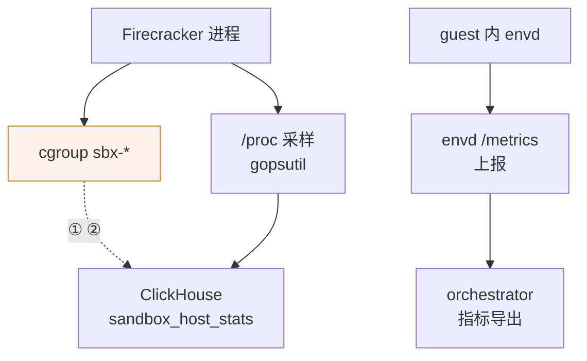

# 73 · orchestrator 的 ARM 改动 III：宿主兼容

> 前两篇讲的是「aarch64 的硬件与内核和 x86 不一样」。本篇讲另一类改动：上游对**宿主长什么样**
> 做了一批假设 —— 挂着 cgroup v2、CPU 有 `cpu family` 这一行、envd 在 100 ms 内应答、mmap 永远有效 ——
> 这些假设在目标环境里有的不成立，有的只是被认为不可靠。补丁对每一条的处理方式不同，
> 代价也不同：有的是必要的适配，有的是把一整条可观测链路关掉换来能启动。
>
> **读者**：系统工程师、运维工程师。
> **预备**：[第 38 篇 · cgroup、资源记账与主机统计](38-cgroups-and-host-stats.md)、
> [第 39 篇 · 健康检查、错误语义与清理](39-health-errors-and-teardown.md)、
> [第 30 篇 · block 包](30-block-layer.md)。
> **代码**：`packages/orchestrator/internal/sandbox/cgroup/manager.go`、
> `packages/orchestrator/internal/sandbox/fc/process.go`、
> `packages/orchestrator/internal/service/machineinfo/main.go`、
> `packages/orchestrator/internal/sandbox/checks.go`、
> `packages/orchestrator/internal/sandbox/block/cache.go`、
> `packages/orchestrator/internal/template/build/core/rootfs/files/envd.service.tpl`

---

## 0. 本篇要回答的问题

1. 上游为什么会在没有 cgroup v2 的宿主上直接拒绝启动？ARM 适配版改成不拒绝之后，实际失去了哪些数据？
2. Firecracker 进程不再进 `sbx-*` 目录，与 Nomad client 配置里删掉 `no_cgroups` 是什么关系？
3. `machineinfo.Detect()` 在 aarch64 上为什么会失败？打上 fallback 之后，「机器画像」还能表达什么？
4. 健康检查的两个常量放宽 15 倍与 600 倍之后，一台死掉的沙箱要多久才被发现？删除一台死沙箱的应答变慢了多少？
5. `block/cache.go` 里那段 `recover` 到底能接住什么？Go 的 `SIGBUS` 是不是 panic？

---

## 1. 五类改动共享的一个形状

把本篇涉及的五类改动摆在一起看，它们不属于同一个技术领域 —— cgroup、CPU 识别、超时、mmap 防御、
guest 的 systemd 单元 —— 但形状一样：**上游代码里有一个「宿主一定满足」的前提，代码在前提不满足时选择了
硬失败；补丁把硬失败换成了继续运行。**

上游选硬失败是有道理的：这些前提在 GCP 上的 Ubuntu 镜像里都成立，一旦不成立说明环境配错了，
早失败比带病运行好诊断。目标环境（鲲鹏 + openEuler + 私有机房）不共享这个前提，于是每一处都要重新做选择。
选择的结果分三档：

- **必须改，且改得不多**：`machineinfo` 的 fallback。不改则 orchestrator 根本起不来。
- **必须改，但顺手关掉了一整条链路**：cgroup 记账。不改则起不来，改法则是把宿主侧记账整条停掉。
- **未必必须改**：健康检查超时、`block/cache.go` 的防御。这两处没有「不改就不能跑」的证据，
  是经验性放宽与经验性加固。

三档的可回退性差别很大，第 6 节的表把这一点列清楚。

---

## 2. cgroup：关闭宿主侧记账

### 2.1 三处改动

上游 2026.09 的宿主侧 cgroup 只做记账、不设限，机制在[第 38 篇 §2](38-cgroups-and-host-stats.md#2-上游的-cgroup只记账不设限)。
ARM 适配版在三个地方拆掉了它。

第一处，`cgroup/manager.go` 的 `NewManager()`。上游 stat `/sys/fs/cgroup/cgroup.controllers`，
文件不在就返回 `cgroups v2 not available` 错误；`packages/orchestrator/main.go` 拿到这个错误会
`logger.L().Fatal`，进程不启动。ARM 适配版把错误分支改成返回一个可用的 `&managerImpl{}`：

```go
func NewManager() (Manager, error) {
	if _, err := os.Stat(filepath.Join(cgroupV2MountPoint, "cgroup.controllers")); err != nil {
		return &managerImpl{}, nil
	}

	return &managerImpl{}, nil
}
```

两个分支返回同一个东西，这个函数从此不会失败。`main.go` 里那两句 `Fatal` 保留原样，只是再也走不到。

第二处，`Initialize()` 开头加了一个 `isCgroupV2()` 判断（用同一个 stat），为假时打一行
`cgroup v1 detected, skipping initialization` 并返回 nil，跳过建 `/sys/fs/cgroup/e2b` 目录与
写 `cgroup.subtree_control` 这两步。日志文字说的是「检测到 v1」，判据其实只是「没有
`cgroup.controllers` 这个文件」—— 完全没挂 cgroup 的宿主也会打出同一行。

第三处在 `fc/process.go` 的 `configure()`：设置 `SysProcAttr.UseCgroupFD` 与 `CgroupFD` 的那个
`if cgroupFD != cgroup.NoCgroupFD` 块，连同上方三行说明注释，被整体注释掉。这是关键的一处。
上游靠 `CLONE_INTO_CGROUP` 让 Firecracker 进程在 `clone` 的瞬间就落在
`/sys/fs/cgroup/e2b/sbx-<id>` 里（[第 38 篇 §2.2](38-cgroups-and-host-stats.md#22-原子放置clone_into_cgroup)）；
注释掉之后 `cgroupFD` 参数仍然一路传下来，但没有任何人读它，FC 进程继承 orchestrator 自己的 cgroup。

### 2.2 剩下的空目录，与丢掉的两类数字

`sandbox.go` 的 `createCgroup()` 没有改。也就是说在一台**装着 cgroup v2** 的 aarch64 宿主上，
这条链路依然会：建 `sbx-<id>` 目录、打开目录 FD、打开 `memory.peak`、注册 `Remove` 清理、
在 `cmd.Start()` 之后调 `ReleaseCgroupFD()`。唯一的区别是这个目录里**永远没有进程**。
沙箱结束时 `Remove()` 把空目录删掉。整套生命周期照跑，只是不承载任何东西。

在一台**真的没挂 cgroup v2** 的宿主上，这条链路也不会中断：`Initialize()` 已经跳过，
`createCgroup()` 仍然去调 `managerImpl.Create()`，后者对 `/sys/fs/cgroup/e2b/sbx-<id>` 做 `MkdirAll`。
**推论**：`/sys/fs/cgroup` 一般是 tmpfs，这次 `MkdirAll` 会成功，于是得到一个指向普通目录的 handle，
`memory.peak` 打不开只落一行 Debug 日志，此后每次 `GetStats()` 读 `cpu.stat` 失败返回错误，
`hoststats_collector.go` 拿到错误同样只落 Debug 日志。两类宿主的可观测结果一致：cgroup 那五列没有数。

失去的数字有两类。

**第一类是 cgroup 口径的用量。** `hoststats_collector.go` 的 `CollectSample()` 在
`cgroupStats` 非空时填五个字段：`CgroupCPUUsageUsec`、`CgroupCPUUserUsec`、`CgroupCPUSystemUsec`、
`CgroupMemoryUsage`、`CgroupMemoryPeak`。cgroup 里没有进程，`cpu.stat` 与 `memory.current` 读出来就是 0，
于是 ClickHouse `sandbox_host_stats` 表的这五列恒为 0。读取失败只会打 Debug 日志，
读到 0 更是连日志都没有 —— 这正是[第 38 篇 §5](38-cgroups-and-host-stats.md#5-host-stats采样与投递) 说的
「`0` 与『没采到』在表里长得一样」，在 ARM 适配版上这句话对整整五列成立。

**第二类是 `memory.peak`，它没有替代品。** 剩下的两个数据源，
`/proc` 那份是 gopsutil 每 5 秒对 FC 进程采一次 RSS/VMS 的**瞬时值**，envd 那份是 guest 自报的瞬时值
（[第 38 篇 §4](38-cgroups-and-host-stats.md#4-记账数字的三个来源)）。
两个采样序列都会漏掉采样点之间的尖峰，而 `memory.peak` 是内核维护的生命周期最大值，
恰恰不漏尖峰。关掉之后，「这台沙箱历史上最多用过多少内存」这个问题在 ARM 适配版上无法回答。
对容量规划与档位定价来说，这是三个来源里信息量最不可替代的一个。



| 编号 | 这条虚线承载什么 | ARM 适配版的结果 |
|---|---|---|
| ① | cgroup 的 CPU 与内存用量五列 | 进程不进这个目录，五列恒为 0 |
| ② | `memory.peak` 生命周期峰值 | 唯一不漏尖峰的来源，一并失去 |

还要说清楚**没有**失去什么：上游的这套 cgroup 本来就不写任何限制项，所以关掉它不会让隔离变弱 ——
本来就没有隔离。真正的闸门是准入控制，而准入的两个参数在 ARM 适配版里是被放宽的方向
（`max-sandboxes-per-node` 从 200 改到 10000，见[第 77 篇 §2](77-api-and-flags-on-arm.md#2-准入闸门两个数字与它们之间的空隙)）。
把这两件事放在一起，结论是：**ARM 适配版既取消了唯一的宿主侧用量观测，又把唯一的闸门开大了。**
两者单独看都有解释，合起来的后果是节点过载时既没有硬边界拦，也没有历史峰值可查。

### 2.3 与 `no_cgroups` 的关系

上游的 Nomad client 配置在 `iac/provider-gcp/nomad-cluster/scripts/run-nomad.sh` 里生成，
`plugin "raw_exec"` 段带 `no_cgroups = true`，让 raw_exec 不为任务单独建 cgroup
（[第 38 篇 §7](38-cgroups-and-host-stats.md#7-nomad-与-no_cgroups)）。ARM 适配版的这个脚本里
`plugin "raw_exec"` 只剩 `enabled = true`，单机离线版实际使用的 `e2b-deploy/dep/run-nomad.sh` 同样如此。

这一行的消失与 `CLONE_INTO_CGROUP` 的注释掉在机制上是自洽的。上游需要 `no_cgroups = true`，
是因为 orchestrator 会主动把 FC 进程搬出任务 cgroup 的子树；若 Nomad 按任务 cgroup 里的进程清单来杀任务，
被搬走的 FC 进程会漏杀（第 38 篇里标为推论的那一条）。ARM 适配版注释掉 `CLONE_INTO_CGROUP` 之后，
FC 进程留在 orchestrator 所在的 cgroup 里，搬移不再发生，这条配置也就失去了理由。
**推论**：这条因果是从两处改动的机制推出来的，而且只是一种解释 —— diff 显示整个 `run-nomad.sh`
被重写过（进程管理从 supervisor 换成 systemd，节点身份从 GCP 实例元数据换成 `hostname -s`，
连接数上限从 80 提到 1000），`no_cgroups` 更可能是这次重写的顺带结果，而不是一个单独的决定。

无论动机如何，效果是正面的：Nomad 现在能按任务 cgroup 追踪并杀掉 orchestrator 派生的全部进程，
停任务时不再有漏杀 microVM 的风险。代价是所有 FC 进程与 orchestrator 记在同一个任务 cgroup 里，
无法按沙箱拆分；而两个基线的 orchestrator job 文件（上游 `iac/modules/job-orchestrator/jobs/orchestrator.hcl`、
ARM 适配版新增的 `iac/provider-gcp/nomad/jobs/orchestrator.hcl`）都没有 `resources` 段，
所以这个任务 cgroup 也不设限。节点上依旧一处硬性资源边界都没有。

### 2.4 guest 侧的同向退让

改动不止在宿主侧。模板构建写出的
`internal/template/build/core/rootfs/files/envd.service.tpl` 删掉了五行：

```text
Delegate=yes
MemoryMin=50M
MemoryLow=100M
CPUAccounting=yes
CPUWeight=1000
```

这五行是给 envd 自己的保护：内存压力下保住 50–100 MiB 不被回收、CPU 争抢时权重取 1000
（默认是 100），以及让 systemd 为它开 CPU 记账。删掉之后，guest 里的用户负载吃满内存时，
envd 与用户进程站在同一起跑线上。**推论**：动机应当是 `MemoryMin` / `MemoryLow` 这两个指令
只在 cgroup v2 统一层级下有意义，guest 的 systemd 若运行在 v1 层级上会拒绝或忽略它们，
删掉最省事。补丁里没有注释，这条推论的依据是这些指令本身的适用条件，不是代码。

这一删与 envd 内部的降级路径叠加在一起，效果被放大。envd 的 `createCgroupManager()` 在
`NewCgroup2Manager()` 失败时只往 stderr 打一行，然后返回 `NoopManager`，进程照常启动、
不进任何 cgroup（[第 51 篇 §4.2](51-envd-ports-permissions-metrics.md#42-放置方式与降级)）。
于是在一个没有 cgroup v2 的 guest 里，**guest 内的三组资源旋钮 —— PTY 的 `cpu.weight=200`、
socat 的 `memory.min` / `memory.low`、用户进程的 `memory.high` —— 全部静默消失**，
而它们原本的作用是保证用户代码吃满内存时终端仍然跟手、端口转发不先饿死。
没有任何指标反映这次降级，只有 guest 内 stderr 上的一行。

---

## 3. machineinfo：让 orchestrator 能在 aarch64 上启动

这一处是本篇里最简单、也最没有争议的改动。

`machineinfo.Detect()` 调 gopsutil 的 `cpu.Info()`，然后检查 `Family` 与 `Model` 是否为空，
任一为空就返回错误。`main.go` 拿到错误后打一行 `log.Printf` 并 `return false`，进程退出。

问题在于 gopsutil 填 `Family` 的唯一来源是 `/proc/cpuinfo` 里的 `cpu family` 行
（`cpu/cpu_linux.go` 的解析 switch），而这一行是 x86 专有的；aarch64 的 `/proc/cpuinfo` 给出的是
`CPU implementer` / `CPU architecture` / `CPU variant` / `CPU part` / `CPU revision` 这一组。
gopsutil 把 `CPU part` 映射到 `Model`，把 `CPU implementer` 映射到 `VendorID`，
但**没有任何一条规则给 aarch64 填 `Family`**。结果是上游的 orchestrator 在 aarch64 上必然启动失败。

ARM 适配版的改法是在 `runtime.GOARCH == "arm64"` 时补默认值：`Family` 为空补 `"arm64"`，
`Model` 为空补 `"0"`，其余逻辑与错误分支原样保留。

值得说清楚的是补完之后的「机器画像」还剩多少信息。这份画像经 `service_info.go` 的
`convertMachineInfo()` 转成 gRPC 的 `MachineInfo`，上报给 API；API 侧的
`packages/shared/pkg/machineinfo/machine_info.go` 里，`IsCompatibleWith()` 只比三个字段：

```go
func (m MachineInfo) IsCompatibleWith(other MachineInfo) bool {
	return m.CPUArchitecture == other.CPUArchitecture && m.CPUFamily == other.CPUFamily && m.CPUModel == other.CPUModel
}
```

它有两个调用点：放置时的 `placement/cpu_compatibility.go` 的 `isNodeCPUCompatible()`
（构建记录的 `CPUArchitecture` 为空则直接放行），以及选构建机时
`api/internal/clusters/cluster.go` 的 `GetAvailableTemplateBuilder()`（`CPUModel` 为空则直接放行）。
在 ARM 适配版上，`CPUArchitecture` 恒为 `arm64`、`CPUFamily` 恒为 `arm64` —— 两个字段都变成常量，
一个用来区分节点的比较维度退化成了不区分任何东西的常量。整个判断只剩 `CPUModel` 一个维度。

`CPUModel` 还有没有区分力，取决于目标机器的 `/proc/cpuinfo` 是否给出 `CPU part`。
**推论**：aarch64 的内核标准地导出这一行（鲲鹏的实现者编号是 `0x48`，gopsutil 映射为 `HiSilicon`），
所以 `Model` 通常拿得到，不同代的鲲鹏仍能被区分开；`Model` 补 `"0"` 这个分支应当很少走到。
但一旦走到，全部 aarch64 节点会塌缩成同一个画像，CPU 兼容性检查形同虚设，
而快照跨不兼容 CPU 恢复的失败是运行期才暴露的。另外 `ModelName` 在这条路径上仍然为空
（gopsutil 只对 `VendorID == "ARM"` 的实现者查表补 `ModelName`，`HiSilicon` 不在其中），
不过这个字段不参与兼容性判断，只影响日志与展示。

更彻底的做法是按 implementer + part + variant 组合出一个真实的画像，成本也不高。
现在的 fallback 是一个**一致但无信息**的画像：它解决了「起不来」，没有解决「区分不了」。

---

## 4. 健康检查：两个放宽的常量与一个没跟着改的

`internal/sandbox/checks.go` 里只有两个常量，两个都改了：

| 常量 | 上游 2026.09 | ARM 适配版 | 倍数 |
|---|---|---|---|
| `healthCheckInterval` | 20 s | 300 s | 15× |
| `healthCheckTimeout` | 100 ms | 60000 ms | 600× |

判定逻辑一行没动：仍然是每轮 GET `http://<slot 宿主 IP>:49983/health`，只认 HTTP 204，
边沿触发地翻转 `healthy`，翻转的唯一后果是一条日志
（[第 39 篇 §2](39-health-errors-and-teardown.md#2-健康检查一个没有权力的探针)）。
所以放宽不会导致任何沙箱被误杀或误留 —— 这个探针本来就没有权力。它影响的是**可观测性**与
**一条同步路径的延迟**。

**后果一：发现延迟。** 一台沙箱内的 envd 死掉之后，最坏要等 300 s 才轮到下一次探测，
再加上这一次探测的耗时上限。这个上限不是 60 s：`sandbox.go` 里的 `sandboxHttpClient` 带
`Timeout: 10 * time.Second`，两个基线都是 10 s，客户端超时先于上下文超时到期。
所以最坏发现延迟约 **310 s**，而放宽后的 60 s 上下文超时在当前配置下不起作用（**推论**：
依据是 `http.Client.Timeout` 与 `context` 超时取先到者，代码里没有注释说明这一点）。
上游的对应数字是 20 s + 100 ms。把一台已经不响应的沙箱在日志里静默五分钟，
对排障的影响是直接的：告警从「几十秒内」变成「五分钟内」。

**后果二：Delete 的应答变慢。** `internal/server/sandboxes.go` 在删除一台沙箱时，
先把它从 map 里摘掉，然后**同步**调一次 `sbx.Checks.Healthcheck(ctx, true)` 取最后一次健康快照，
之后才起 goroutine 做 `Stop`。这次同步探测用的就是 `healthCheckTimeout`。
对一台还活着的沙箱，探测毫秒级返回，没有区别；对一台已经不响应、连 TCP 都不回的沙箱，
上游最多阻塞 100 ms，ARM 适配版最多阻塞 10 s（同样被客户端超时封顶）。
[第 39 篇 §7.1](39-health-errors-and-teardown.md#71-delete-做了什么没做什么) 说 `Delete` 换来的是
「稳定的 kill 延迟」，这条改动给那句话开了一个口子：删除一台死沙箱的应答时间上限涨了两个数量级。

**后果三：量级不一致。** `internal/metrics/sandboxes.go` 的 `timeoutGetMetrics` 仍然是 100 ms，
每 `sandboxMetricExportPeriod = 5 s` 一轮向每台沙箱拉一次 `/metrics`，两个基线完全相同。
于是 ARM 适配版同时持有两个互相矛盾的判断：健康检查这一侧认为「envd 在 60 s 内应答就算活着」，
指标这一侧仍然认为「envd 100 ms 内不应答就放弃这一轮」。
实际效果是**指标缺口会比健康检查失败出现得更早、更频繁** ——
一台被负载拖慢的沙箱，先在指标里断线，很久以后才在健康日志里翻转。
这不是设计，是两个常量没有一起改。

**动机（推论）**：补丁在同一批里放宽了冷启动路径上的一串超时（`requestTimeout`、`acquireTimeout`
及 `maxStartingInstancesPerNode`，见[第 71 篇 §6](71-orchestrator-arm-fc-changes.md#6-准入三个常量与一次语义变化)），
健康检查的放宽应当出自同一个判断 —— aarch64 上冷启动更慢，启动初期 envd 尚未就绪，
100 ms 的探测会产生大量 `healthcheck failed` 噪声。这个解释成立，但不能解释为什么间隔也要从 20 s 拉到 300 s：
探针的噪声代价本来就只是日志。补丁里没有注释，两个数字都没有实测依据可查。

---

## 5. `block/cache.go` 的四条防御

这一处是本篇里唯一一处新增防御逻辑、而不是改参数或删代码的改动，也是唯一一处**注释与实际行为不符**的地方，
值得单独核实。ARM 补丁在整个 `block/` 包里只动了这一个函数。

`Cache` 是一个 mmap 加一张位图（[第 30 篇 §3](30-block-layer.md#3-cachemmap-加一张位图)），
`WriteAtWithoutLock` 是往 mmap 里 `copy` 一段字节并置位图的那个函数。上游的函数体只有四条语句。
ARM 适配版在它上面加了四条防御：

| # | 改动 | 上游行为 | ARM 行为 |
|---|---|---|---|
| 1 | 函数入口 `defer` + `recover`，注释写「捕获 SIGBUS/fault 等致命信号」 | 无 | panic 转成 error 返回 |
| 2 | `c.mmap == nil` | 返回 `(0, nil)` | 返回 error |
| 3 | 新增 `off < 0 \|\| off >= c.size` 检查 | 无 | 返回 error |
| 4 | `copy` 之前判 `end <= off` | 无 | 返回 `(0, nil)` |

### 5.1 第 3 条是唯一真正接住东西的

上游算 `end := min(off+int64(len(b)), c.size)`，然后 `copy((*c.mmap)[off:end], b)`。
若调用方传进来的 `off` 严格大于 `c.size`（或为负），则 `end` 被夹到 `c.size`，`end < off`，
`(*c.mmap)[off:end]` 是一个 `slice bounds out of range` 的运行时 panic。
这是一个**真正的 Go panic**：既能被第 1 条的 `recover` 接住，也能被第 3 条提前挡掉，第 4 条是它的兜底。
边界上 `off == c.size` 不 panic，`end == off`，`copy` 是空操作；第 3 条把这种情形也判成错误，
第 4 条则把它按上游语义返回 `(0, nil)` —— 两条的口径不一致，只是第 3 条先返回，第 4 条到不了这个入参。

顺带的语义变化在第 2 条：`size == 0` 的退化 cache 里 `mmap` 是 nil，上游把这种写当成静默的空操作，
ARM 适配版会报错。不过 `WriteAt` 在调用 `WriteAtWithoutLock` **之前**自己也判了一次 `c.mmap == nil`
并返回 `(0, nil)`，而两个基线里 `WriteAtWithoutLock` 的调用点都只有 `WriteAt` 一个，
所以这条新错误在当前代码里到不了。它是一颗留给未来调用方的地雷：语义变了，但现在看不出来。

### 5.2 `recover` 接不住 mmap 上的 SIGBUS

注释说这段 `recover` 是为了「捕获 SIGBUS/fault 等致命信号（mmap 可能失效）」。这一条不成立，
依据是 Go 运行时 `runtime/signal_unix.go` 的 `sigpanic()`：

```go
case _SIGBUS:
	if gp.sigcode0 == _BUS_ADRERR && gp.sigcode1 < 0x1000 {
		panicmem()
	}
	// Support runtime/debug.SetPanicOnFault.
	if gp.paniconfault {
		panicmemAddr(gp.sigcode1)
	}
	print("unexpected fault address ", hex(gp.sigcode1), "\n")
	throw("fault")
```

`SIGBUS` 只有在故障地址低于 `0x1000` 时才被转换成可 `recover` 的 panic —— 那是空指针解引用的地址区间。
mmap 映射的地址远高于 `0x1000`，落到最后两行：打印 `unexpected fault address` 然后 `throw("fault")`。
`throw` 是运行时的致命错误，**不展开栈、不执行 defer、不可 recover**，整个进程带栈打印退出。
唯一的例外是 `runtime/debug.SetPanicOnFault(true)`，它把当前 goroutine 的 `paniconfault` 置位，
使故障转成可恢复的 panic；ARM 适配版全树没有调用它（对 `SetPanicOnFault` 的全仓检索无结果）。

所以结论是明确的：**这段 `recover` 挡不住 mmap 失效引发的 SIGBUS。**
真会触发 SIGBUS 的场景是底层文件在映射之后被截短到故障页之外，或底层设备返回 IO 错误；
cache 文件由 orchestrator 自己创建与删除（[第 30 篇 §5.3](30-block-layer.md#53-缓存文件的命名)），
若要防这一类，正确的做法是在打开这段代码路径的 goroutine 上显式调用 `SetPanicOnFault(true)`
并接受它的语义（此后该 goroutine 上所有非法内存访问都变成 panic），或者干脆不用 mmap 写。

### 5.3 换到手的是什么

把 panic 变成 error 之后，这个 error 沿 `Cache.WriteAt` → `Overlay.WriteAt` →
`nbd/dispatch.go` 的 `performWrite` 上行，最终变成一个错误码为 1 的 NBD 应答，
guest 里看到的是一次写失败（块设备 I/O 错误）。`performWrite` 是在一个单独的 goroutine 里调
`d.prov.WriteAt` 的，而 Go 里任何 goroutine 上没被接住的 panic 都会终止整个进程，
所以这笔交换的对照面是 orchestrator 整体退出。在多租户节点上它是划算的：
一台沙箱的越界写变成那台沙箱的一次 I/O 错误，而不是把整个 orchestrator 连同节点上所有沙箱一起带走。
代价是这类越界从「崩溃时必然留下栈」变成「一条错误日志」，真出现调用方的偏移量算错时更难定位。

这笔交换换的是**越界切片这一类 Go panic**，不是注释写的 SIGBUS：改动值得保留，注释应当改。

---

## 6. 改动 × 动机 × 后果 × 可回退性

| 改动 | 动机 | 后果 | 可回退性 |
|---|---|---|---|
| `NewManager()` 不再因缺 cgroup v2 报错 | 让 orchestrator 在非 v2 宿主上能启动（推论：补丁无注释） | `main.go` 的两句 `Fatal` 成为死代码；环境配错不再早失败 | 高：删掉改动即恢复，但需确认目标宿主挂了 v2 |
| `Initialize()` 无 v2 时跳过 | 同上 | 不建 `/sys/fs/cgroup/e2b`、不写 `subtree_control`；日志把「无 v2」一律说成「v1」 | 高：单个 if |
| `CLONE_INTO_CGROUP` 三行注释掉 | 推论：与上一条配套，避免在无 v2 宿主上传入无效 FD | `sbx-*` 目录恒为空；`sandbox_host_stats` 五个 cgroup 列恒为 0；`memory.peak` 无替代品 | 高：三行；但需与 `no_cgroups` 一起回退 |
| `run-nomad.sh` 删 `no_cgroups = true` | 推论：随整脚本重写一并消失，与注释掉 `CLONE_INTO_CGROUP` 机制自洽 | Nomad 能按任务 cgroup 杀全部派生进程；但记账粒度退到「整个 orchestrator 任务」 | 高：一行配置；单机离线版需同步改 |
| `envd.service.tpl` 删五行 cgroup 指令 | 推论：`MemoryMin` / `MemoryLow` 仅在 cgroup v2 统一层级下有效 | envd 在 guest 内存压力下失去保护；叠加 envd 自身的 noop 降级，guest 三组旋钮可能全部静默消失 | 中：改模板即可，但要重建模板才生效 |
| `machineinfo` 的 arm64 fallback | 必要：`cpu family` 是 x86 专有行，不补则进程不启动 | `CPUFamily` 退化为常量，兼容性判断只剩 `CPUModel` 一维 | 低：不可简单回退，只能换成更真实的画像实现 |
| `healthCheckInterval` 20 s → 300 s | 推论：与第 71 篇的一批冷启动超时同批放宽 | 死沙箱发现延迟约 310 s | 高：一个常量 |
| `healthCheckTimeout` 100 ms → 60 s | 同上 | 实际被 `sandboxHttpClient` 的 10 s 封顶；`Delete` 对死沙箱的同步探测从 100 ms 涨到 10 s；与仍为 100 ms 的 `timeoutGetMetrics` 不一致 | 高：一个常量 |
| `block/cache.go` 四条防御 | 推论：防 mmap 失效（注释如此写） | 越界写从进程 panic 变成 guest 的一次 I/O 错误；对 SIGBUS 无效；第 2 条改了语义但当前不可达 | 高：函数内局部，建议保留第 3、4 条并修正注释 |

---

## 7. 小结

- 上游在宿主形态上有一批硬前提（cgroup v2、x86 的 `cpu family`、envd 毫秒级应答、mmap 恒有效），
  不满足时选择拒绝启动。本篇的五处改动统一把硬失败换成了继续运行，代价各不相同。
- cgroup 的三处改动合起来是**关闭宿主侧记账**，不是「兼容 v1」：`NewManager()` 永不失败、
  `Initialize()` 在无 v2 时跳过、`CLONE_INTO_CGROUP` 注释掉。在装了 v2 的宿主上，
  `sbx-*` 目录照建照删，只是永远没有进程。
- 直接损失是 `sandbox_host_stats` 的五个 cgroup 列恒为 0，其中 `memory.peak` 没有替代品 ——
  剩下的 `/proc` 与 envd 两个来源都是 5 s 一次的瞬时采样，漏尖峰。
- 上游的这套 cgroup 本来就不设限，所以关掉它不削弱隔离；但同一批补丁把准入上限放大到 10000，
  于是节点既无硬边界也无峰值观测。
- 删掉 Nomad 的 `no_cgroups = true` 与注释掉 `CLONE_INTO_CGROUP` 是配套的：进程不再迁出任务 cgroup，
  Nomad 反而能完整地杀掉派生进程，代价是记账粒度退到整个任务。
- `machineinfo` 的 fallback 是本篇唯一「不改就起不来」的改动；补完之后
  `CPUFamily` 恒为 `arm64`，兼容性判断只剩 `CPUModel` 一个维度，画像一致但无信息量。
- 健康检查放宽后，死沙箱的发现延迟约 310 s；`Delete` 路径上的同步探测上限从 100 ms 涨到 10 s；
  而 `timeoutGetMetrics` 仍是 100 ms，两侧对「envd 多慢算慢」的判断相差 600 倍。
- `block/cache.go` 的 `recover` 接不住 mmap 上的 SIGBUS：Go 运行时对高地址的 `SIGBUS` 走
  `throw("fault")`，不执行 defer。它真正接住的是越界切片的 panic，而新增的范围检查已经能提前挡掉同一类问题。
- 九条改动里七条是一两行、可直接回退的；不可简单回退的只有 `machineinfo`，
  它需要的是一个更真实的 aarch64 画像实现，而不是删掉 fallback。

## 延伸阅读 / 下一篇

- [第 38 篇 · cgroup、资源记账与主机统计](38-cgroups-and-host-stats.md)：上游宿主侧 cgroup 的完整机制、
  三个记账来源、`no_cgroups` 的作用。
- [第 39 篇 · 健康检查、错误语义与清理](39-health-errors-and-teardown.md)：健康探针为什么没有权力、
  `Delete` 的返回时机与清理顺序。
- [第 30 篇 §3 · `Cache`](30-block-layer.md#3-cachemmap-加一张位图)：mmap 与位图、缓存文件的生命周期。
- [第 51 篇 · 端口、权限与指标](51-envd-ports-permissions-metrics.md)：guest 内三组 cgroup 旋钮与 noop 降级。
- [第 71 篇 · orchestrator 的 ARM 改动 I](71-orchestrator-arm-fc-changes.md#6-准入三个常量与一次语义变化)：同一批放宽的冷启动超时与并发参数。
- [第 72 篇 · orchestrator 的 ARM 改动 II：写保护退化](72-uffd-on-arm.md)：上一篇。
- [第 74 篇 · 模板构建的 ARM 改动](74-template-build-on-arm.md)：下一篇，包含 `envd.service.tpl`
  所在的 rootfs 构建链路在 ARM 上的其它变化。
- [第 86 篇 §2.1、§2.4、§4.1](86-known-issues-and-debt.md#21-cgroup-记账关闭与-clone_into_cgroup-移除)：本篇列出的不一致（指标与健康检查的超时差、
  `recover` 与 SIGBUS 的注释、失效的 `Fatal` 分支）在那里汇总。
