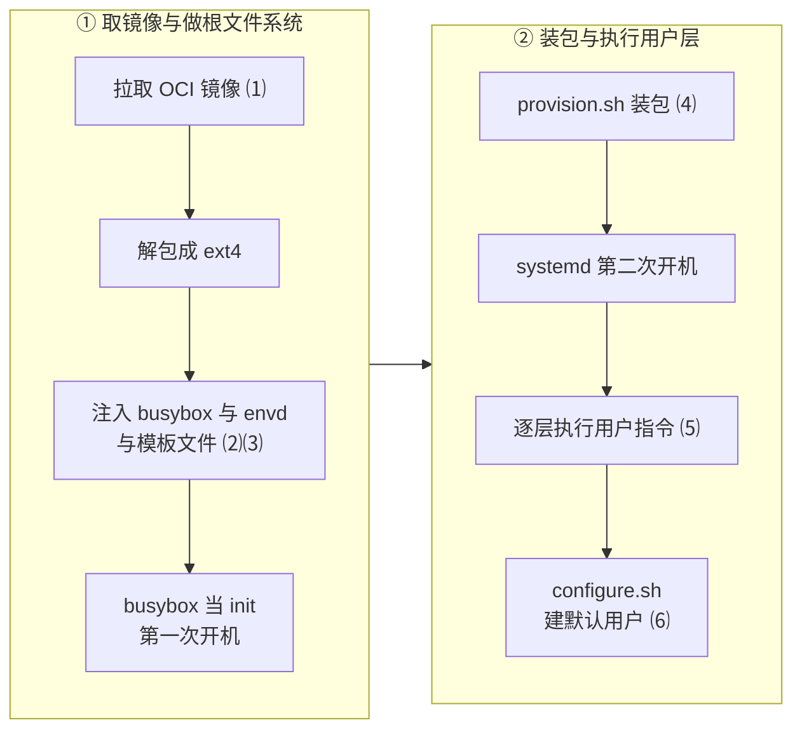

# 74 · 模板构建的 ARM 改动

> 模板构建是整条链路上架构假设最密集的一段：它要拉一个特定架构的镜像、往里塞一个特定架构的
> init 二进制、再在一个特定发行版的 guest 里跑装机脚本。本篇讲 ARM 适配版在这三处各改了什么、
> 哪些改动是必要的架构适配、哪些是环境替换、哪些改完之后原来的路径就走不通了。
>
> **读者**：工程师、系统工程师。
> **预备**：[第 43 篇 · rootfs 制作](43-rootfs-construction.md)、
> [第 44 篇 · 构建期沙箱与命令](44-build-sandbox-and-commands.md)；
> [第 67 篇 · ARM 适配总览](67-arm-port-overview.md)。
> **代码**：`packages/orchestrator/internal/template/build/core/systeminit/busybox.go`、
> `core/oci/oci.go`、`core/rootfs/files/`、`phases/base/provision.sh`、
> `phases/finalize/configure.sh`、`commands/user.go`、`packages/envd/Makefile`、
> `packages/envd/internal/host/mmds.go`

---

## 0. 本篇要回答的问题

1. 模板构建里，「这是一台 x86 机器」这个假设一共写在几个地方？各是什么形式？
2. 内嵌 busybox 为什么不能靠一个 patch 文件带进来？直接从 ARM 适配版的源码树编译会得到什么？
3. 换成 arm64 的 busybox 时，1.35 与 1.36.1 之间真正的差别是什么？
4. `provision.sh` 去掉 `fuse3`、`iptables`、`git`、`nfs-common` 之后，哪些功能会失效？
   失效时用户看得见吗？
5. `configure.sh` 改成 `#!/bin/sh` 之后，脚本实际由谁解释执行？
6. 这一批改动里，哪些是不可回退的架构适配，哪些只要换一个 guest 镜像就能撤掉？

---

## 1. 架构假设写在哪几个地方

[第 43 篇](43-rootfs-construction.md)已经把 rootfs 的制作流程拆开过：拉镜像 → 解包成 ext4 →
注入 busybox / envd / 模板文件 → 用 busybox 当 init 跑一次 `provision.sh` → 换 systemd
第二次开机 → 逐层跑用户指令 → 最后 `configure.sh` 建默认用户。

这条链路上，「目标机器是 x86」与「guest 是 Debian 系」两个假设各自出现在固定的几个点上。
ARM 适配版的改动正好落在这些点上，没有一处在流程本身。



| 编号 | ARM 适配版改的地方 |
|---|---|
| ⑴ | `core/oci/oci.go` 的 `DefaultPlatform` |
| ⑵ | `systeminit` 的 `busybox.go` |
| ⑶ | `inittab.tpl` 与 `envd.service.tpl` |
| ⑷ | `provision.sh` 的发行版分支 |
| ⑸ | `commands/user.go` 的 wheel 分支 |
| ⑹ | `configure.sh` 的 useradd 分支 |

先说清楚一件事：**上游 2026.09 的模板构建 API 里没有任何架构字段**。
在 `template/build/` 下搜 `Architecture`，除测试文件外只有 `core/oci/oci.go` 的三处：一处是
`DefaultPlatform` 这个包级变量的声明，两处在 `verifyImagePlatform()` 里 —— 拿它与镜像 config 比较。
gRPC 的模板构建请求、`TemplateConfig`、层的 hash 计算里都不含架构。也就是说，一个 orchestrator 进程能构建什么架构的模板，
是在**编译期**决定的，运行期无从选择。这一点决定了后面几节里几乎所有改动的形式：
它们都是把一个编译期常量从 `amd64` 换成 `arm64`，而不是加一个维度。

---

## 2. 内嵌 busybox：一个不在源码里的二进制

### 2.1 按 GOARCH 选择

上游 `core/systeminit/busybox.go` 只有五行：一个 `//go:embed busybox_1.36.1-2` 指令和
一个 `BusyboxBinary []byte`。这份二进制被 `core/rootfs/rootfs.go` 的
`additionalOCILayers()` 同时写到镜像的 `usr/bin/busybox` 与 `usr/bin/init` 两个位置，
是第一次开机唯一可用的 init。

ARM 适配版把它改成两份内嵌加一个 `init()`：

```go
//go:embed busybox_1.36.1-2
var busyboxX86 []byte

//go:embed busybox_1.35_arm64
var busyboxArm64 []byte

var BusyboxBinary []byte

func init() {
	switch runtime.GOARCH {
	case "amd64", "386":
		BusyboxBinary = busyboxX86
	case "arm64":
		BusyboxBinary = busyboxArm64
	default:
		panic(errors.New("unsupported arch: " + runtime.GOARCH))
	}
}
```

这是本篇里唯一一处「加了一个维度」的改动：同一个二进制里带着两份 busybox，
按运行时架构选。代价是 orchestrator 二进制里始终带着两份 busybox（在 RPM 构建路径上合计约 3.2 MiB，
比上游多出约 2 MiB），任何一次运行都有一份用不到；
收益是同一份源码在两种架构上都能编译出可用的模板构建器。

注意 `runtime.GOARCH` 是**构建 orchestrator 的机器**的架构，不是模板的架构。
在单机同架构部署里两者相同，这个选择成立；一旦要在 x86 节点上构建 arm64 模板，
它和 §3 的 `DefaultPlatform` 会一起失效。

### 2.2 补丁里的两个占位文件

补丁给 `core/systeminit/` 新增了两个文件：`busybox_1.35_arm64` 与 `busybox_1.36.1-2_arm64`。
用 `file` 看 ARM 适配版源码树里的这两个文件，得到的不是 ELF：

```text
busybox.go:               ASCII text
busybox_1.35_arm64:       HTML document, Unicode text, UTF-8 text        3611 字节
busybox_1.36.1-2:         ELF 64-bit LSB executable, x86-64, statically linked, stripped
busybox_1.36.1-2_arm64:   HTML document, Unicode text, UTF-8 text        3611 字节
```

两个 arm64 文件的内容完全一样，都是一个代码托管站点的落地页 HTML —— 下载二进制时拿到的是
网页而不是文件，错误没有被发现，占位内容进了补丁。

后果是确定的：**直接从 ARM 适配版的源码树 `go build`，
`//go:embed busybox_1.35_arm64` 会把这 3611 字节 HTML 编进 orchestrator，
生成的模板 rootfs 里 `/usr/bin/init` 就是这段 HTML**；
第一次开机时内核执行 `init=/usr/bin/init` 会立刻失败，构建停在 provisioning 之前。

真正的二进制走的是另一条路。单机离线版的 `e2b-infra.spec` 把它列成 `Source1`，
在 `%prep` 里打完补丁之后覆盖回去：

```bash
%prep
%autosetup -p1 -n e2b-infra-%{tag}
cp %{SOURCE1} packages/orchestrator/internal/template/build/core/systeminit/
```

`e2b-infra` 仓库根目录下的 `busybox_1.35_arm64` 才是实物：

```text
busybox_1.35_arm64: ELF 64-bit LSB executable, ARM aarch64, statically linked,
                    BuildID[sha1]=3e3bcece…, for GNU/Linux 3.7.0, stripped   2028568 字节
```

原因写在打包文档里：二进制放进 patch 会变成 GNU `patch` 无法应用的 `GIT binary patch`，
所以它只能作为 spec 的一个 Source，由 `%prep` 拷进构建树。补丁里那两个 HTML 占位文件
因此从来没有在 RPM 构建路径上被用到 —— `cp` 在打补丁之后执行，恰好把它盖掉了。
`busybox_1.36.1-2_arm64` 则连 spec 都没有引用，`busybox.go` 也没有内嵌它，是一个悬空文件。

**这条依赖是隐式的**：先打补丁、再拷二进制这个顺序不在源码里，也没有构建期检查。
一个可行的加固是在 `busybox.go` 的 `init()` 里校验 `BusyboxBinary` 的 ELF 魔数与 `e_machine`，
不匹配就 panic，把一个静默的运行期故障提前成明确的启动期故障。
出包流程本身见[第 85 篇 §2.2](85-dev-workflow-and-packaging.md#22-为什么只留一个补丁)。

### 2.3 1.35 与 1.36.1 的差别在 libc，不在版本号

版本号容易误导。把三份**真实**二进制对比一下（后两份在 `e2b-infra` 仓库根目录，
补丁里同名的两个文件是上一节那段 HTML）：

| 文件 | busybox 版本 | libc | 字节数 | 谁在用 |
|---|---|---|---|---|
| `busybox_1.36.1-2`（上游内嵌，x86_64） | 1.36.1 | musl，静态 | 1292216 | x86 分支 |
| `busybox_1.36.1-2_arm64`（spec 未引用） | 1.36.1 | musl，静态 | 1398488 | 无人引用 |
| `busybox_1.35_arm64`（`Source1`） | 1.35.0 | glibc，静态 | 2028568 | arm64 分支 |

判据是二进制里的字符串：两份 1.36.1 含 `MUSL_LOCPATH`，1.35 那份含
`Fatal error: glibc detected an invalid stdio handle` 这类 glibc 运行时诊断串。
三者都是静态链接，`ash`、`sh`、`sed`、`chattr`、`sync`、`sleep`、`fsfreeze` 这些 applet 名
在三份里都能搜到，`inittab` 与 `provision.sh` 用到的 applet 一个不缺。
两份 arm64 的 `LOAD` 段按 64 KiB 对齐、x86 那份按 4 KiB，这是各自工具链的默认值，
不构成两份 arm64 之间的差别。

所以差别不是「新一点的 busybox」和「旧一点的 busybox」，而是**musl 构建换成 glibc 构建**，
版本号 1.35 只是手头那份 glibc 二进制恰好是这个版本。
单机离线版的部署文档把选择理由记为「上游 musl 版在鲲鹏上有兼容问题」。
**推论**：从二进制本身看不出具体的失效机制 —— 两份 arm64 都是静态链接、对齐一致、applet 集合一致。
换一份 musl 的 arm64 busybox 是否同样可用，需要实测确认。

---

## 3. `DefaultPlatform`：把架构写死在常量里

改动只有一行：

```go
var DefaultPlatform = containerregistry.Platform{
	OS:           "linux",
	Architecture: "arm64",   // 上游 2026.09 是 linux/amd64
}
```

`oci.go` 里有两个函数用它：`GetPublicImage()`（从公共 registry 或远端仓库代理拉基础镜像）
与 `GetImage()`（从制品仓库拉已构建的镜像）。两者都做同一件事的两遍：
把 `platform` 传进拉取选项（`remote.WithPlatform` 或仓库实现的 `GetImage`），
拉完再调 `verifyImagePlatform()` 比一次：

```go
if config.Architecture != platform.Architecture {
	return fmt.Errorf("image is not %s", platform.Architecture)
}
```

两遍的理由在[第 43 篇 §2.2](43-rootfs-construction.md#22-平台) 讲过：
单架构镜像没有 manifest list，`WithPlatform` 对它不起作用，必须事后再看一次 config。
这层校验在 ARM 适配版里原样保留，所以**架构不匹配的后果是构建失败并给出明确错误**，
不会做出一个跑不起来的模板。

问题在于它是包级变量而不是配置项。直接后果有三个：

1. 一个 orchestrator 二进制只能构建一种架构的模板。同一个集群里如果既有 x86 节点又有 arm64 节点，
   要么两种节点跑两份不同编译产物的 orchestrator，要么放弃其中一种。
2. 模板的架构不进层 hash（[第 45 篇 §2.4](45-layers-and-build-cache.md#24-没有放进-hash-的东西)）。
   同一个 Dockerfile 在两种架构上算出的层 hash 相同，如果两种节点共用同一个对象存储桶，
   缓存会互相命中并交叉污染。**推论**：单机离线版只有一种架构，这条风险在当前部署形态下不会触发；
   但它是把 `DefaultPlatform` 改成运行期配置之前必须一并处理的问题。
3. 用户拿一个只有 amd64 的镜像当基础镜像时，错误信息是 `image is not arm64`。
   信息是准确的，但没有说明是节点的架构限制而不是镜像写错了。

**更好的做法**：把架构做成 `BuilderConfig` 的一个字段，默认取 `runtime.GOARCH`，
同时把它纳入层 hash 的输入。改动量不大，但会牵动模板元数据与缓存键的兼容，
不是一个补丁里适合做的事情。

---

## 4. openEuler guest：`provision.sh`

### 4.1 发行版检测与两套包管理

上游 `provision.sh` 对 guest 的假设是 Debian 系：`dpkg-query -W -f='${Status}'` 判在装，
`apt-get install` 装缺的。ARM 适配版在脚本开头加了一次检测：

```sh
if [ -f /etc/os-release ]; then
    . /etc/os-release
    OS_ID="$ID"
else
    echo "Cannot detect OS. /etc/os-release not found."
    exit 1
fi
```

然后把「查是否已装」和「装」各自包成一个函数，按 `OS_ID` 分支：
`ubuntu` / `debian` 走 `dpkg-query` 与 `apt-get`，
`openEuler` / `rhel` / `centos` / `fedora` 走 `rpm -q` 与 `dnf install --nogpgcheck -y`，
其余打印 `Unsupported OS` 并返回非零。

`--nogpgcheck` 是离线环境的选择：自建的本地 repo 没有签名。代价是包来源不再校验，
这一层信任移到了「repo 是自己搭的」这个前提上。

发行版差异表：

| 维度 | 上游假设：Ubuntu / Debian | ARM 适配版新增：openEuler / RHEL |
|---|---|---|
| 查询已装 | `dpkg-query -W -f='${Status}'` | `rpm -q` |
| 安装 | `apt-get update` + `apt-get install --no-install-recommends` | `dnf install --nogpgcheck -y` |
| 包签名 | apt 默认校验 | 显式关闭 |
| sudo 组 | `sudo` | `wheel` |
| 建用户 | `adduser --disabled-password --gecos ""` | `useradd -m -s /bin/bash -c ""` |
| NFS 客户端包名 | `nfs-common` | `nfs-utils`（未加入列表） |
| `/bin/sh` | dash | bash |

最后一行是下一小节的伏笔。

### 4.2 去掉的四个包

包列表从

```text
systemd systemd-sysv openssh-server sudo chrony linuxptp socat curl ca-certificates
fuse3 iptables git nfs-common
```

缩成前九个，`fuse3`、`iptables`、`git`、`nfs-common` 被去掉。
直接原因是包名在 RPM 世界里不同（`nfs-common` 对应 `nfs-utils`、`fuse3` 对应 `fuse3` 或 `fuse`），
不改就会在 openEuler 上找不到包而失败。**推论**：去掉而不是改名，是最省事的做法；
从补丁本身看不出是否评估过每个包的用途。

按用途逐个看后果（各包的用途见[第 43 篇 §7](43-rootfs-construction.md#7-provisionsh-装什么)）：

- **`nfs-common`**：这是唯一影响 e2b 自身功能的一项。Volumes 的挂载由 guest 里的 envd 完成，
  `packages/envd/internal/api/init.go` 的 `setupNfs()` 直接跑
  `mount -v -t nfs -o mountproto=tcp,...,nfsvers=3,noacl <target> <path>`，
  它依赖 `mount.nfs` 这个 helper，而 helper 由 `nfs-common` / `nfs-utils` 提供。
  没有它，`mount` 报「unknown filesystem type 'nfs'」之类的错误。
  更麻烦的是**失败是静默的**：`setupNfs()` 由 `/init` 处理里的 `go a.setupNfs(...)` 起协程调用，
  出错只写一行 envd 日志就 `return`，不影响 `/init` 的返回，沙箱照常起来。
  用户看到的是一个空目录，而不是一个错误。Volumes 的机制见
  [第 40 篇 §4](40-volumes-and-nfsproxy.md#4-一次挂载的完整路径)。
- **`iptables`**：影响的是 guest 内部的网络规则。宿主侧的规则不受影响 ——
  `internal/sandbox/network/network.go` 与 `tcpproxy.go` 用的是 Go 的
  `go-iptables` 库，在宿主的 netns 里操作，与 guest 里装没装 `iptables` 无关
  （见[第 35 篇 §5](35-sandbox-networking.md#5-tcp-防火墙进程)）。所以后果限于用户在沙箱里跑
  需要 iptables 的工作负载。
- **`git`、`fuse3`**：只影响用户命令。`RUN git clone …` 以「命令不存在」失败，这类失败在构建日志里
  可见（[第 44 篇 §3.3](44-build-sandbox-and-commands.md#33-日志流与退出码)），
  用户可以在模板里补一条 `RUN dnf install -y git`。

单机离线版对这一项有一个补偿：`e2b-deploy/build.sh` 的 `make_images()` 在制作沙箱基础镜像时，
先在容器里跑一遍
`yum install -y systemd systemd-sysv openssh-server sudo chrony linuxptp socat curl wget iputils bind-utils iproute nc tcpdump passwd`，
再导出成模板的基础镜像。这份列表覆盖了 `provision.sh` 保留的九个包里的八个，只差 `ca-certificates`
（**推论**：它一般随基础镜像自带）。所以在那套部署里 `provision.sh` 的 `dnf` 分支多半不会真的装东西 ——
`rpm -q` 命中，网络也就不必可达。但这份列表同样不含 `nfs-utils`、`iptables`、`git`、`fuse3`，
上面几条后果依然成立。部署形态见[第 80 篇 §5](80-single-node-rpm.md#5-buildsh--i把宿主机改造成依赖环境)。

**可回退性**：这是本篇里最容易撤销的一项 —— 把四个包按 RPM 命名补进 `PACKAGES`
或烤进基础镜像即可，不牵动任何代码。

### 4.3 脚本仍然是一个 bash 脚本

`provision.sh` 的 shebang 是 `#!/bin/sh`，`inittab` 里的调用是
`::wait:/bin/sh -c '/usr/local/bin/provision.sh 2>&1 | sed …'`，
也就是说它由 **guest 镜像自带的 `/bin/sh`** 解释，不是 busybox 的 ash
（busybox 只被放在 `/usr/bin/busybox` 与 `/usr/bin/init`）。

上游的脚本正文严格用 POSIX 语法。ARM 适配版新加的两个函数用了 `[[ … ]]`：

```sh
if [[ "$OS_ID" == "ubuntu" || "$OS_ID" == "debian" ]]; then
```

在 openEuler / RHEL 上 `/bin/sh` 指向 bash，`[[` 是内建命令，这样写没有问题。
在 Ubuntu / Debian 上 `/bin/sh` 指向 dash，dash 没有 `[[`。

**推论**：在 Debian 系 guest 上，`[[` 会以「命令未找到」返回 127。这些 `[[` 都在 `if` 的条件位置，
`set -eu` 不会因此立刻退出，效果是 `is_package_installed` 恒返回非零（每个包都判为缺失）、
`install_packages` 的两个分支都不进入（一个包都不装）。之后的结局取决于基础镜像本来带了什么：
后续的 `passwd -d root`、`systemctl mask` 若因缺包而不存在，脚本在 `set -e` 下中止，
provisioning 报失败；若这九个包本来就齐备，脚本可以一路跑到 `printf "0" > "$RESULT_PATH"` 报成功，
只是它其实一个包都没装。两种结局都不理想，性质是确定的：**这段为 openEuler 加的分支，
恰好使 Debian 分支不再可达**（同一段里的 `&>/dev/null` 在 dash 上也会被解析成后台执行加重定向）。
ARM 适配版的目标环境只有 openEuler guest，这一点在当前部署里不会暴露；
它只在把补丁往回合并、或者要同时支持两种 guest 时才成问题。

修法很小：把 `[[ … ]]` 换成 `case "$OS_ID" in ubuntu|debian) … ;; esac`，
两种 shell 都成立。

---

## 5. 默认用户：`configure.sh` 与 `commands/user.go`

### 5.1 `configure.sh`

`configure.sh` 是 finalize 阶段的收尾脚本，负责建默认用户 `user`、免密 sudo、
`/code` 目录。改动有四处。

**第一处是 shebang 与 `set`**：`#!/bin/bash` + `export BASH_XTRACEFD=1` + `set -euo pipefail`
改成 `#!/bin/sh` + `set -e`。

这里有一个容易看错的地方：**shebang 那一行不生效**。
`phases/finalize/configure.go` 的 `runConfiguration()` 把渲染后的脚本正文当字符串传给
`sandboxtools.RunCommandWithLogger()`，后者在 `sandboxtools/command.go` 里固定拼成
`Cmd: "/bin/bash"`、`Args: ["-l", "-c", command]`
（见[第 44 篇 §3.2](44-build-sandbox-and-commands.md#32-一条命令的请求长什么样)）。
脚本从来不是一个被执行的文件，shebang 只是正文第一行的一个注释。
所以改 `#!/bin/sh` 对执行没有影响；真正生效的是 `set -euo pipefail` 变成 `set -e` ——
丢掉了未定义变量报错（`-u`）与管道中段失败的传播（`pipefail`）。
`export BASH_XTRACEFD=1` 在上游也没有配套的 `set -x`，删掉同样没有行为变化。

（单机离线版的 changelog 把这次改动记为「busybox 没有 bash，`configure.sh` 跑不起来」。
在上游 2026.09 的代码路径上，这个脚本走的是 envd 的命令通道而不是 busybox，
所以那条理由对应的是更早的代码形态。）

**第二处是拼写修正**。上游写的是

```sh
ADDUSER_OUTPUT=$(adduser -disabled-password --gecos "" user 2>&1 || true)
```

`-disabled-password` 只有一个横线。**推论**：它能工作是因为 Debian 的 `adduser`
是 Perl 脚本，`Getopt::Long` 默认接受单横线形式的长选项。
ARM 适配版把它改成 `--disabled-password`，语义不变，去掉了对这个宽容行为的依赖。

**第三处是发行版分支**。检测方式与 `provision.sh` 不同 —— 这里用的是
`test -f /etc/debian_version`，不是 `/etc/os-release`：

```sh
IS_DEBIAN=0
if test -f /etc/debian_version; then
    IS_DEBIAN=1
fi
```

Debian 分支保持上游行为；非 Debian 分支用 `useradd`，并且把「家目录已存在」这种情况
显式拆开处理：目录已存在时用 `useradd -M`（不建家目录），否则 `useradd -m`；
两条路径之后都统一跑一次 `cp -rn /etc/skel/. /home/user/` 补 skeleton 文件。
上游只在 `adduser` 的输出里 `grep` 到「home directory already exists」时才补 skeleton，
新写法把这个判断从「解析英文输出」换成了「看目录在不在」，比原来稳健。

补丁的注释说 `-M` 分支是因为家目录已存在时 `useradd -m` 会报错。
**推论**：这种情况通常只是警告，`-M` 分支未必必需；但它不引入错误。

**第四处是 sudo 组**：Debian 系 `usermod -aG sudo user`，其余 `usermod -aG wheel user`。
后面的 `passwd -d user` 与追加 `/etc/sudoers` 一行不变。

这一段补丁在注释里留下了一处来源标记（`# openEuler/RHEL 使用 wheel 组[^4^][^10^]`），不影响执行；
`user.go`、`mmds.go` 里也有中文注释进了原本全英文的代码库，往上游合并时需要清理。

### 5.2 `commands/user.go`

`USER` 指令与默认用户阶段共用同一份实现（[第 44 篇 §4.5](44-build-sandbox-and-commands.md#45-user)）。
ARM 适配版在 `commands/user.go` 里加了两次**探测**，逻辑与 `configure.sh` 一致但手段不同 ——
这里不能读文件，只能跑命令：

- 建用户前：`sandboxtools.RunCommand(ctx, proxy, sandboxID, "test -f /etc/debian_version", …)`，
  返回 `nil` 就用 `adduser --disabled-password --gecos ""`，否则用 `useradd -m -s /bin/bash -c ""`。
- 加 sudo 组前：`RunCommand(… , "getent group wheel", …)`，返回 `nil` 就用 `wheel`，
  否则用 `sudo`；错误信息也一并改成 `failed to add user to %s group`。

两处都是「用命令的退出码当布尔值」，与上游用 `id -u <user>` 判断用户是否存在的写法一致。
`RunCommand` 与 `RunCommandWithLogger` 的区别只在要不要把输出写进用户日志，探测用前者。

代价是每条 `USER` 指令多两次经由 envd 的往返；这条指令本来就有三到四次往返，多两次不构成问题。

两处探测的判据不一样值得注意：`configure.sh` 与 `user.go` 用 `/etc/debian_version`，
`provision.sh` 用 `/etc/os-release` 的 `ID`。三处对「这是不是 Debian 系」的定义因此不完全等价。
**推论**：这不会在 openEuler 或 Ubuntu 上产生分歧，但把判据统一到一个 helper 里会更稳妥。

---

## 6. 两个模板文件

`core/rootfs/files/` 下的模板由 `rootfs.go` 的 `additionalOCILayers()` 渲染后写进镜像。
ARM 适配版动了其中两个。

**`inittab.tpl`**：末尾补了一个换行，把 diff 里的 `\ No newline at end of file` 消掉。
**这一改动不影响写进 guest 的文件**：`core/rootfs/templates.go` 的 `generateFile()`
在返回前做了 `data := bytes.TrimSpace(buff.Bytes())`，模板末尾有没有换行，
写进 `/etc/inittab` 的字节都一样。它的价值在源码树一侧：缺末尾换行的文件在补丁的生成与应用上
更容易出问题。

**`envd.service.tpl`**：删掉了五行

```ini
Delegate=yes
MemoryMin=50M
MemoryLow=100M
CPUAccounting=yes
CPUWeight=1000
```

这几行是 envd 的 cgroup 保护：给 envd 留一块内存下限、把 CPU 权重拉高，
让它在沙箱被用户负载压满时仍然能响应。删掉之后 envd 与普通进程同等竞争资源，
最坏情况是沙箱在高负载下失联。
删除的原因与后果属于 cgroup 一条线，与宿主侧 `NewManager` 不再要求 cgroup v2、
`CLONE_INTO_CGROUP` 被注释掉是同一组改动，一并见
[第 73 篇 §2](73-cgroup-and-host-compat.md#2-cgroup关闭宿主侧记账)；
envd 单元文件本身的设计意图见[第 43 篇 §8](43-rootfs-construction.md#8-envd-注入与它的-systemd-单元)。

**可回退性**：`Delegate` 与 `MemoryMin` / `MemoryLow` 依赖 guest 里的 cgroup v2 与 systemd 委派，
能否加回取决于 guest 内核与 systemd 版本，需要实测；`CPUAccounting` / `CPUWeight` 的门槛更低。

---

## 7. envd 侧的两处改动

**`packages/envd/Makefile`** 由 `uname -m` 推导目标架构：

```makefile
UNAME_M   := $(shell uname -m)
ifeq ($(UNAME_M),x86_64)
  PLATFORM := amd64
else ifeq ($(UNAME_M),aarch64)
  PLATFORM := arm64
else
  $(error Unsupported architecture: $(UNAME_M))
endif
```

`build` 目标的 `GOARCH=amd64` 换成 `GOARCH=$(PLATFORM)`。
这是必要的：envd 的二进制由 orchestrator 读宿主上的文件、注入进模板镜像
（`rootfs.go` 里 `buildContext.BuilderConfig.HostEnvdPath`），
它必须与 guest 架构一致。这里用的是**构建机器**的架构而不是一个可传入的目标架构，
与 §2.1、§3 是同一个设计取向：整套东西假定构建、宿主、guest 三者同架构。

`start-docker` 目标只改了 `docker build --platform`，下面 `docker run` 那行仍写着
`--platform linux/amd64`。这是一个本地调试目标，不进产物，
但在 aarch64 上直接 `make start-docker` 会因为这一行而跑不起来。

**`packages/envd/internal/host/mmds.go`** 换掉了访问 MMDS 的 HTTP 客户端配置：

```go
Transport: &http.Transport{
	MaxIdleConns:        10,
	MaxIdleConnsPerHost: 10,
	IdleConnTimeout:     90 * time.Second,
},
```

上游是 `DisableKeepAlives: true`。这个客户端只服务一条路径：
`internal/api/store.go` 的 `DefaultMMDSClient.GetAccessTokenHash()`，
被 `internal/api/init.go` 的 `checkMMDSHash()` 调用，用来校验 `/init` 请求确实来自 orchestrator。
一次校验是两个请求：`PUT /latest/api/token` 拿令牌，再 `GET /` 拿元数据。
开了 keep-alive，第二个请求可以复用第一个建好的连接。

**推论**：动机是压低 `/init` 的耗时。ARM 适配版把 envd init 的超时从 50 ms 放宽到 120 s
（[第 77 篇 §3](77-api-and-flags-on-arm.md#3-envd-init-超时一次尝试到底能等多久)），
说明这条路径上确实观察到过延迟问题；省掉一次 TCP 握手是其中最容易做的一项。
收益量级有限（同一台 VM 内的握手），风险也有限。

`IdleConnTimeout: 90 * time.Second` 让一条到 MMDS 的连接可能跨越沙箱的
pause / resume（[第 37 篇 §2](37-pause-and-snapshot.md#2-pause-的时序)）。**推论**：这不构成问题 ——
`getMMDSToken()` 的请求体是 `&bytes.Buffer{}`，`http.NewRequestWithContext` 会为它设置 `GetBody`，
Go 的 `http.Transport` 因而把请求当作可重放的，复用连接失败时会换新连接重试。未经实测验证。

---

## 8. 改动 × 动机 × 后果 × 可回退

| 改动 | 动机 | 后果 | 可回退 |
|---|---|---|---|
| `busybox.go` 按 `runtime.GOARCH` 选二进制 | arm64 上需要 arm64 的 init | orchestrator 里内嵌两份 busybox，多约 2 MiB；架构在编译期定死 | 不回退，这是必要适配 |
| 补丁里的 arm64 busybox 是 HTML 占位 | 二进制无法进 GNU patch | 直接从源码树编译得到不可用的 init；实物靠 spec 的 `Source1` 在 `%prep` 覆盖 | 需要修：加 ELF 魔数校验，或改用 Git LFS / 独立制品 |
| arm64 用 1.35 glibc 版而非 1.36.1 musl 版 | 部署文档记为 musl 版在鲲鹏上有兼容问题 | 比 arm64 的 musl 版大 45%；机制未确认 | 可试回 musl 版，需实测 |
| `DefaultPlatform` 改 `arm64` | 拉 arm64 基础镜像 | 一个二进制只支持一种架构；架构不进层 hash | 应改为配置项 + 纳入层 hash |
| `provision.sh` 加 os-release 检测与 dnf 分支 | openEuler 没有 dpkg / apt | 新增 RPM 路径；`--nogpgcheck` 放弃包签名校验 | 保留；签名校验可在有内部签名 repo 后恢复 |
| 去掉 `fuse3` / `iptables` / `git` / `nfs-common` | 包名在 RPM 世界不同 | volumes 挂载静默失效；guest 内 iptables 与 git 不可用 | 最易回退：按 RPM 名补回或烤进基础镜像 |
| `provision.sh` 里的 `[[ … ]]` | 写法习惯 | 推论：在 `/bin/sh` 为 dash 的 Debian guest 上，包检测与安装静默失效 | 换 `case … esac` 即可 |
| `configure.sh` 改 `#!/bin/sh`、`set -e` | 历史上曾用非 bash 解释器 | shebang 不生效；实际影响是丢了 `-u` 与 `pipefail` | 可恢复 `set -euo pipefail` |
| `adduser -disabled-password` 补成 `--` | 去掉对 Getopt::Long 宽容行为的依赖 | 语义不变 | 无须回退 |
| `configure.sh` / `user.go` 的 Debian 判断与 `wheel` 分支 | openEuler 用 `wheel` 组、无 `adduser` | 每条 `USER` 多两次往返；三处判据不完全一致 | 保留；判据宜统一 |
| `inittab.tpl` 补末尾换行 | 补丁卫生 | 对生成的 `/etc/inittab` 无影响，`generateFile()` 会 `TrimSpace` | 保留 |
| `envd.service.tpl` 去掉 cgroup 项 | guest 侧 cgroup 委派不可用 | envd 失去内存下限与 CPU 权重保护，高负载下更易失联 | 视 guest 内核与 systemd 版本，可分项恢复 |
| `envd/Makefile` 按 `uname -m` 定 `GOARCH` | envd 必须与 guest 同架构 | 假定构建机与 guest 同架构；`start-docker` 的 `docker run` 仍写死 amd64 | 保留；`docker run` 那行应一并参数化 |
| `mmds.go` 打开 keep-alive | 压低 `/init` 耗时 | 省一次握手；空闲连接可能跨 pause / resume | 可回退，收益与风险都小 |

按[第 67 篇 §5](67-arm-port-overview.md#5-改动的三种性质与可回退性)的三分法，这十四项里只有三项是**必要的架构适配**
（busybox 选择、`DefaultPlatform`、envd 的 `GOARCH`），
六项是**发行版与环境替换**（包管理、包列表、建用户、sudo 组、cgroup 项），
其余是卫生修正与经验性调参。第二类全部可以随 guest 镜像的变化撤回。

---

## 9. 小结

- 模板构建里的架构假设集中在三处编译期常量：内嵌 busybox、`oci.go` 的 `DefaultPlatform`、
  `envd/Makefile` 的 `GOARCH`。上游的构建 API 里没有任何架构字段，
  所以 ARM 适配版只能把常量换掉，无法加一个运行期维度。
- 补丁里的两个 arm64 busybox 是 3611 字节的 HTML 占位，真实二进制由 `e2b-infra.spec` 的
  `Source1` 在 `%prep` 打完补丁之后覆盖进 `systeminit/`。直接从源码树编译会得到一个
  把 HTML 当 init 的模板构建器，且没有任何检查能提示这一点。
- 1.35 与 1.36.1 的实质差别是 glibc 静态构建与 musl 静态构建，不是 busybox 版本；
  两者的 applet 集合与页对齐一致，选择理由只有部署文档的记录，机制未确认。
- `provision.sh` 的发行版分支让 openEuler 可用，同时因为用了 `[[ … ]]`
  而使 Debian 分支在 `/bin/sh` 为 dash 时不再可达；这在只有 openEuler guest 的目标环境里不暴露。
- 去掉 `nfs-common` 是四个删包里唯一影响 e2b 自身功能的：volumes 的 NFS 挂载由 envd
  在协程里做，失败只写日志，用户看到的是一个空目录而不是错误。
- `configure.sh` 的 `#!/bin/sh` 不生效 —— 脚本正文是作为参数交给 `/bin/bash -l -c` 的，
  这次改动的实际效果是丢掉了 `set -u` 与 `pipefail`；`inittab.tpl` 的末尾换行同样不改变
  生成的文件，`generateFile()` 会 `TrimSpace`。
- `envd.service.tpl` 去掉 cgroup 项换来的是在缺少 cgroup 委派的 guest 上能启动，
  代价是 envd 在高负载沙箱里失去优先级保护。
- 这批改动的多数属于「换一个 guest 镜像就能撤回」的环境替换，真正不可回退的只有三项架构适配；
  最需要补的是给内嵌 busybox 加一次 ELF 校验，以及把 `DefaultPlatform` 变成配置项并纳入层 hash。

---

## 延伸阅读 / 下一篇

- [第 43 篇 · rootfs 制作](43-rootfs-construction.md)：本篇改动所在的上游机制，包括
  busybox 当 init、`provision.sh` 的完整清单、`configure.sh` 的位置。
- [第 44 篇 §3.2、§4.5](44-build-sandbox-and-commands.md#32-一条命令的请求长什么样)：`USER` 指令与
  `/bin/bash -l -c` 这条命令通道。
- [第 40 篇 · Volumes 与 NFS proxy](40-volumes-and-nfsproxy.md#4-一次挂载的完整路径)：去掉 `nfs-common` 影响的功能。
- [第 73 篇 §2.4](73-cgroup-and-host-compat.md#24-guest-侧的同向退让)：`envd.service.tpl` 的 cgroup 项属于这条线。
- [第 77 篇 §3](77-api-and-flags-on-arm.md#3-envd-init-超时一次尝试到底能等多久)：envd init 超时的放宽。
- [第 80 篇 §2.2](80-single-node-rpm.md#22-prep-与-build)：`e2b-infra.spec` 的 `%prep` 与基础镜像的制作。
- [第 85 篇 §2.2](85-dev-workflow-and-packaging.md#22-为什么只留一个补丁)：为什么二进制不能进补丁。
- [第 86 篇 §2.3、§4.7、§5.1](86-known-issues-and-debt.md#23-内嵌-busybox-是-html-占位文件)：本篇标出的几处待修项。
