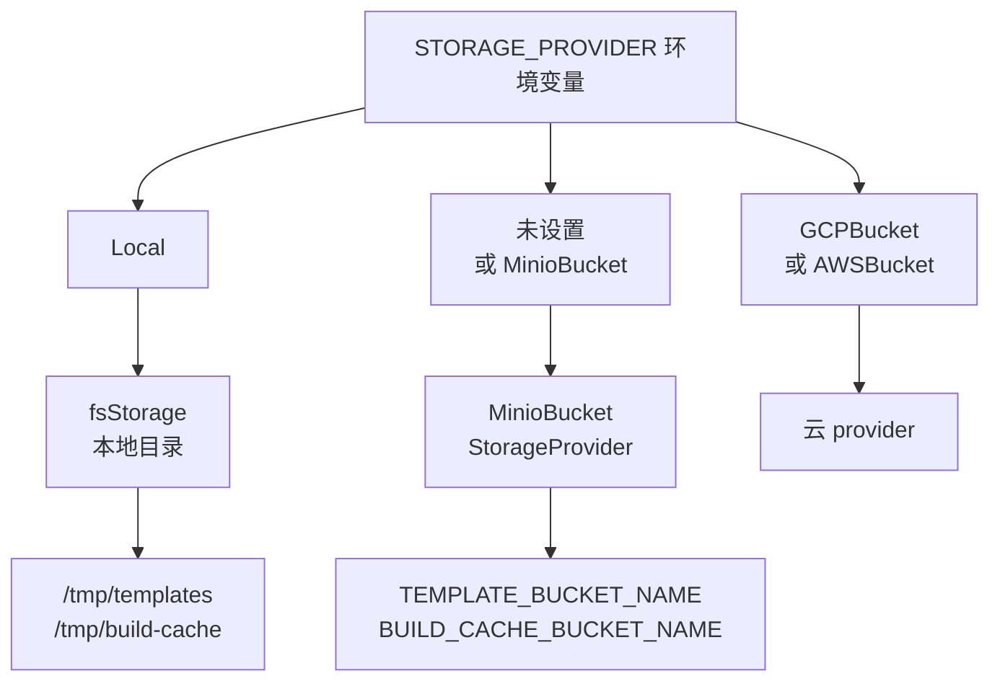

# 75 · MinIO 存储 provider

> 上游 2026.09 的对象存储只有三个 provider：GCS、S3、本地文件系统。一个没有外网、也没有云账号的
> 机房需要第四个。ARM 适配版新增了 300 行的 `storage_minio.go`，把 `StorageProvider` 接口在
> MinIO 上重新实现了一遍。本篇逐方法对照这份实现与上游两个云 provider 的差异，
> 说明差异各自的代价，并解释为什么单机离线版最终没有用上它。
>
> **读者**：工程师、部署工程师。
> **预备**：[第 13 篇 · 存储全景](13-storage-landscape.md)（键布局与 provider 抽象）、
> [第 34 篇 · 模板缓存与本地存储](34-template-cache-and-local-storage.md)（本地缓存与持久化的分界）。
> **代码**：`packages/shared/pkg/storage/storage_minio.go`、`storage.go`、`storage_google.go`、
> `storage_aws.go`、`storage_fs.go`、`storage_cache.go`；`iac/provider-gcp/nomad/jobs/*.hcl`、
> `helm/values-template.yaml` 与 `helm/templates/`；`e2b-deploy/build.sh`、`e2b-deploy/dep/template-manager.hcl`、
> `e2b-deploy/dep/deploy.sh`

---

## 0. 本篇要回答的问题

1. `StorageProvider` / `Blob` / `Seekable` 三个接口一共要求实现哪些方法？MinIO 实现逐条是怎么落的？
2. 范围读、分段上传、重试、错误映射这四件事，MinIO 实现与 GCS / S3 实现的语义差在哪里？各自的代价是什么？
3. 为什么 `ErrObjectNotExist` 在 MinIO provider 下传不到调用方？哪几个调用点因此改变了行为？
4. 把 `DefaultStorageProvider` 从 `GCPBucket` 改成 `MinioBucket`，除了方便离线部署还带来什么？
5. Helm、Nomad 多节点、单机离线三种部署形态各自实际用哪个 provider？为什么单机离线版 `.env` 里
   写着 `STORAGE_PROVIDER=MinioBucket` 却没有生效？

---

## 1. 问题：一个没有外网的机房需要一个 S3

上游 2026.09 在 `packages/shared/pkg/storage/` 下有三个 provider 实现：
`storage_google.go`（GCS，生产用）、`storage_aws.go`（S3）、`storage_fs.go`（本地文件系统，
主要供本地开发与测试用，`UploadSignedURL()` 直接返回 `file system storage does not support signed URLs`）。
选哪个由 `STORAGE_PROVIDER` 环境变量决定，默认 `GCPBucket`。

目标环境是一台或几台放在内网、没有出口的 aarch64 服务器。GCS 不可达，AWS S3 也不可达。
剩下两条路：用本地文件系统 provider，或者在机房里自建一个 S3 兼容的对象存储。
前者简单，代价是模板产物绑死在单机的一块盘上，多节点之间没有共享的产物层；
后者多一个组件，换来「产物独立于节点生命周期」和「多节点共享模板」。
ARM 适配版两条路都留了：新增 MinIO provider，同时在单机部署脚本里仍然用本地文件系统（第 6 节）。

一个自然的问题是：MinIO 本来就兼容 S3 协议，为什么不直接复用 `AWSBucket` provider，
把它的 endpoint 指向 MinIO？读上游代码可以看到障碍在哪里 ——
`storage_aws.go` 的 `newAWSStorage()` 只做了一件事：

```go
cfg, err := config.LoadDefaultConfig(ctx)
client := s3.NewFromConfig(cfg)
```

`newAWSStorage()` 除此之外只多建一个 `PresignClient`，没有暴露任何 endpoint 或静态凭据的配置点，
要让它指向内网的 MinIO 就必须修改这个上游文件。
**推论**：新增一个独立文件、只在 `storage.go` 的枚举与两个 `switch` 里各加一行，
是为了把与上游代码的冲突面压到最小；代价是多了一个 SDK 依赖
（`packages/shared/go.mod` 新增 `github.com/minio/minio-go/v7 v7.0.95`），
并且要自己把 AWS SDK 已经做好的重试、分段、错误分类再实现一遍 —— 后面几节讲的差异都源于这一点。

---

## 2. 接口与逐方法对照

回顾[第 13 篇 §3.4](13-storage-landscape.md#34-provider-抽象三种访问形态)：`StorageProvider`
有五个方法，打开对象分 `OpenBlob`（整体读写的小对象）与 `OpenSeekable`（按偏移随机读的大对象）两路；
`Blob` 要求 `WriteTo` / `Put` / `Exists`，`Seekable` 要求 `ReadAt` / `Size` / `StoreFile` / `OpenRangeReader`。
`storage_minio.go` 把这些全部实现了，两个类型上的静态断言写得和上游一致：

```go
var _ StorageProvider = (*MinioBucketStorageProvider)(nil)

var (
	_ Seekable = (*minioObject)(nil)
	_ Blob     = (*minioObject)(nil)
)
```

逐方法对照如下（GCS 列指 `storage_google.go`，S3 列指 `storage_aws.go`）。

| 方法 | GCS 实现 | S3 实现 | MinIO 实现 |
|---|---|---|---|
| `OpenBlob` / `OpenSeekable` | 返回带 `Retryer` 的 `ObjectHandle`，最多 10 次退避重试 | 返回裸的 `awsObject` | 返回裸的 `minioObject`，不做任何配置 |
| `WriteTo` | `NewReader` + `io.CopyBuffer`，4 MiB 缓冲 | `GetObject` + `io.Copy` | `GetObject` + `io.CopyBuffer`，4 MiB 缓冲，**外层套三次重试** |
| `Put` | `NewWriter` + `io.Copy` | `PutObject` | `PutObject`，显式传字节数 |
| `StoreFile` | 小于 50 MiB 一次 PUT，否则走自研并行分段上传 + 全局 limiter | `manager.Uploader`，10 MiB 分段、8 并发 | `PutObject` 传文件句柄与大小，分段策略交给 minio-go |
| `ReadAt` | `NewRangeReader` + 循环读到 `Remain() == 0` | `Range` 头 + `io.ReadFull` | `SetRange` + `io.ReadFull`，与 S3 同构 |
| `OpenRangeReader` | `NewRangeReader`，Close 时取消 context | `Range` 头，返回 `resp.Body` | `SetRange` + `GetObject`，**不设超时** |
| `Size` | `Attrs()` | `HeadObject` | `StatObject` |
| `Exists` | `Size()` 后吞掉 not-exist | 同 GCS | 同 GCS，但吞的是另一个 sentinel（§3.4） |
| `DeleteObjectsWithPrefix` | 迭代 `prefix + "/"`，逐个删 | `ListObjectsV2` 一次 + `DeleteObjects` 批删 | `ListObjects` 递归全量 + `RemoveObjects` 管道批删 |
| `UploadSignedURL` | 用 service account 私钥签 PUT URL | `PresignClient.PresignPutObject` | `PresignedPutObject` |
| `GetDetails` | `[GCP Storage, bucket set to …]` | `[AWS Storage, …]` | `[MINIO Storage, bucket set to …]` |

三个 provider 的对象类型上都还有一个 `Delete(ctx)` 方法，但它既不在 `Blob` 里也不在 `Seekable` 里，
全仓库也没有调用点：删对象一律走 provider 级的 `DeleteObjectsWithPrefix`，
连 `gcpStorage.DeleteObjectsWithPrefix()` 自己也是拿桶句柄逐个删，不经过 `gcpObject.Delete()`。
MinIO 实现照抄了这个方法，属于跟随既有形状，不是新增能力。

`OpenBlob` 与 `OpenSeekable` 在 MinIO 实现里返回的是同一个 `minioObject` 结构，
两个参数 `ObjectType` / `SeekableObjectType` 都被忽略 —— 这一点和 S3 实现完全一致，
GCS 实现也只是用它来挂 `Retryer`。也就是说对象类型这个参数目前只对可观测性有意义。

---

## 3. 五处语义差异

### 3.1 范围读：GetObject 是惰性的

`ReadAt` 是热路径。[第 31 篇 §4](31-uffd-memory-backend.md#4-一次缺页)里每一次缺页最终都落到
一次 4 MiB 分片的 `ReadAt`。MinIO 的实现结构上抄的是 S3 版：设 `Range`、`io.ReadFull`、
把 `io.ErrUnexpectedEOF` 翻译成 `io.EOF`（对象比请求范围短时后端期望看到 `EOF`）。这部分语义是对齐的。

差异在错误处理的时机上。minio-go 的 `Client.GetObject()` 只校验桶名与对象名，
然后起一个 goroutine 惰性发请求，返回的 `*minio.Object` 要到第一次 `Read` 才真正联网。
所以 `storage_minio.go` 里紧跟在 `GetObject` 之后的这段判断实际上够不到 HTTP 层的错误：

```go
obj, err := m.client.GetObject(ctx, m.bucketName, m.path, opts)
if err != nil {
	respErr := minio.ToErrorResponse(err)
	if respErr.Code == "NoSuchKey" || respErr.Code == "NoSuchBucket" {
		return 0, errObjectNotExist
	}
	…
}
```

对象不存在时，错误是从后面的 `io.ReadFull(obj, buff)` 里返回的，原样往上抛，不带任何哨兵。
`ReadAt` 与 `OpenRangeReader` 都是这个形状；`writeToOnce` 更彻底，
它连这段 `NoSuchKey` 判断都没写，`GetObject` 的错误直接被 `fmt.Errorf` 包成一句 `failed to get object`。
换句话说，**MinIO provider 的「对象不存在」只有走 `StatObject` 的 `Size()` / `Exists()` 那条路才能识别出来**。

需要补一句边界：provider 之上还可能套一层分片缓存。
`storage_cache.go` 的 `WrapInNFSCache()` 在 `internal/sandbox/template/cache.go` 与
`internal/template/build/builder.go` 两处按特性开关生效，命中的 4 MiB 分片直接从本地文件读，
根本不会走到 provider（[第 34 篇 §4](34-template-cache-and-local-storage.md#4-缓存查找顺序一次块读查几张表)）。
它能吸收重复读，但吸收不了首次读：下面讲的超时与错误语义只在未命中时才暴露出来。

另一处差异是超时。`OpenRangeReader` 没有包 `context.WithTimeout`，
和 S3 实现一样把生命周期交给调用方；GCS 实现既给整段范围读扣了 10 秒预算，
又用 `cancelOnCloseReader` 保证 reader 关闭时一定取消 context。
**推论**：MinIO 这条路上，调用方忘记 `Close()` 就会同时泄漏一个连接和一个 goroutine；
minio-go 的 `Object` 背后确实挂着一个常驻 goroutine，所以这不是纯理论上的泄漏。

### 3.2 `WriteTo` 的三次重试

这是 MinIO 实现里唯一一处上游三个 provider 都没有的结构：

```go
func (m *minioObject) WriteTo(ctx context.Context, dst io.Writer) (int64, error) {
	var lastErr error
	for i := 0; i < 3; i++ {
		n, err := m.writeToOnce(ctx, dst)
		if err == nil {
			return n, nil
		}
		lastErr = err
		if i < 2 {
			fmt.Fprintf(os.Stderr, "[MINIO DEBUG] Retry %d after error: %v\n", i+1, err)
			time.Sleep(2000 * time.Millisecond)
		}
	}
	return 0, lastErr
}
```

三个后果，都需要和收益一起看。收益是 MinIO 侧的瞬时抖动（重启、连接被重置）能被自动吸收，
这在没有 SDK 级重试的情况下是有价值的；GCS 实现靠 `storage.WithMaxAttempts(10)` 拿到同样的东西。

代价一，**重试不区分错误是否可重试**。对象不存在也会重试三次，两次 2 秒的等待。
构建期的层缓存查询 `HashIndex.LayerMetaFromHash()`（`internal/template/build/storage/cache/cache.go`）
正是走 `OpenBlob` + `GetBlob` + `WriteTo`，而它的两个调用方
（`phases/steps/builder.go` 的 `Build()`、`phases/base/builder.go` 的 `Layer()`）
拿到任何错误都只打一条 info 日志，然后当成缓存未命中继续构建。
于是**每一次层缓存未命中要固定多花大约 4 秒**（两次 2 秒的 `Sleep`，外加三趟往返），
一次冷构建有多少层就乘多少倍。基础层这条路更贵：`LayerMetaFromHash()` 未命中之后，
`HashIndex.Cached()` 还要再读一次模板的 `metadata.json`，也是 `WriteTo`，
于是一次基础层未命中大约是 8 秒。

代价二，**重试不重置 `dst`**。`writeToOnce` 直接往调用方给的 `io.Writer` 里 `CopyBuffer`。
如果第一次尝试在拷到一半时超时，第二次尝试会从对象开头重新拷，
而 `dst` 已经有了前半段。调用方一边是 `storage.GetBlob()` 里的 `bytes.Buffer`，
一边是 `internal/sandbox/template/storage_file.go` 里 `os.Create` 出来的顺序写文件，
两者都是「追加」语义。**推论**：这种情况下重试成功会产出一个前缀重复的损坏文件，
而不是一个错误 —— 部分失败罕见，但一旦发生是静默的。

代价三，`writeToOnce` 拿到的 `*minio.Object` 没有 `Close()`。GCS 与 S3 实现都有对应的
`defer reader.Close()` / `defer resp.Body.Close()`。每次 `WriteTo` 泄漏一个未关闭的对象读取器。

### 3.3 上传：三种分段口径

`StoreFile` 是写路径的主力：memfile 与 rootfs 的 diff 都靠它上传（[第 37 篇 §7](37-pause-and-snapshot.md#7-上传与失败状态)）。
三个实现的分段策略完全不同：

| 维度 | GCS | S3 | MinIO |
|---|---|---|---|
| 分段阈值 | 50 MiB（`gcpMultipartUploadChunkSize`），小于它一次 PUT | `manager.Uploader` 内部判断 | 16 MiB（minio-go 的 `minPartSize`） |
| 分段大小 | 50 MiB | 10 MiB | 16 MiB，超大对象按 10000 段上限放大 |
| 并发 | 默认 16，且受 `limiter.GCloudMaxTasks()` 动态调节 | 8 | 4（minio-go 的 `totalWorkers`） |
| 全局闸门 | `limiter.GCloudUploadLimiter()` 信号量，跨对象限流 | 无 | 无 |
| 超时 | 无显式超时，靠 SDK 重试 | 30 秒 | 300 秒 |

MinIO 实现把分段整个交给了 minio-go：`PutObject` 收到一个 `*os.File`（实现了 `io.ReaderAt`）
与准确的大小，超过 16 MiB 就自动走 `putObjectMultipartStreamFromReadAt`，
4 个 worker（`totalWorkers`）并行传 16 MiB 的分段。
这个判据在 minio-go 的 `putObjectMultipartStream()` 里：reader 实现了 `ReadAt`、
又不是 minio 自己的 `*Object`、且没要求算 MD5，就走并行 ReadAt 路径 —— `StoreFile` 三条都满足。
这一层是够用的，真正缺的是 GCS 那个**跨对象的信号量**。
GCS 实现里 `limiter` 从 `NewGCP()` 一路传到每个 `gcpObject`，
`StoreFile` 要先 `Acquire` 才能开始上传，目的是防止一台节点上同时有几十个沙箱在 pause 时
把上行带宽和内存打满。`NewMinioBucketStorageProvider()` 的签名里根本没有 `limiter` 参数：

```go
case MINIOStorageProvider:
	return NewMinioBucketStorageProvider(ctx, bucketName)
```

`GetTemplateStorageProvider()` 拿到的 `limiter` 在这条分支上被丢弃。
**推论**：在并发 pause 密集的场景下，MinIO 路径缺少这道闸门，
上传并发只受上层沙箱并发限制；单机部署里 MinIO 就在本机、走 loopback，
这个缺失暂时不明显，多节点部署下值得补。

### 3.4 错误映射：两个只差一个字母的哨兵

这是本篇最值得记住的一处差异。`storage.go` 里导出的哨兵是：

```go
var ErrObjectNotExist = errors.New("object does not exist")
```

`storage_minio.go` 在同一个包里又定义了一个：

```go
var errObjectNotExist = errors.New("object does not exist")
```

两者字符串相同、类型相同、包相同，但**是两个不同的值**，`errors.Is` 不相等。
配套的工具函数也复制了一份：上游是 `ignoreNotExists`（`storage_aws.go`），
MinIO 版是 `ignoreNotExist`，差一个 `s`。

后果要分两类看。**包内自洽的部分没问题**：`Exists()` 调 `Size()`，
`Size()` 走 `StatObject` 能把 `NoSuchKey` 映射成 `errObjectNotExist`，
再被 `ignoreNotExist` 吞掉，于是 `Exists()` 正确返回 `(false, nil)`。
层文件上传前的存在性检查（`upload_layer_files_template.go` 的 `InitLayerFileUpload`）
和层缓存的命中判断都依赖这条路，它们是对的。

**跨包的部分会失配**。`packages/orchestrator` 里有五处 `errors.Is(err, storage.ErrObjectNotExist)`，
其中四处在线上路径上（第五处是离线工具 `cmd/copy-build/main.go`）：

| 调用点 | 上游语义 | MinIO provider 下的实际行为 |
|---|---|---|
| `internal/sandbox/template/storage.go` | 找不到 `*.header` 就回退到「无 header 的老式模板」 | 判断不成立，直接 `failed to deserialize header` 报错 |
| `internal/sandbox/template/storage_template.go` | 找不到 `metadata.json` 时容忍，继续 | 判断不成立，走 `SetError` 把 metafile 标为失败 |
| `internal/server/sandboxes.go` | 快照文件还没传完，回 `FailedPrecondition` 让 api 重试 | 回 `Internal`，api 侧当成不可恢复错误 |
| `internal/template/build/phases/base/builder.go` | 基础模板不存在时给出「你可能需要先重建」的提示 | 变成一条通用的 `error getting base template` |

前两处尤其值得注意：它们把「对象不存在」当成**正常的兼容分支**，
把其它错误当成致命错误。哨兵失配把正常分支变成了致命分支。
再叠加 §3.1 的结论 —— 走 `WriteTo` 的读根本产不出任何 not-exist 哨兵 ——
可以说这四处的容错在 MinIO provider 下都不生效。
第一处的链路值得写全，它最能说明问题：`storage.go` 调 `header.Deserialize()`，
后者调 `storage.GetBlob()`，`GetBlob` 调的就是 `Blob.WriteTo()`。
即便把两个哨兵合成一个，只要 `writeToOnce` 不从 `Read` 的返回值里认 `NoSuchKey`，
这条回退分支照样不成立。

修法很小：删掉 `storage_minio.go` 里的 `errObjectNotExist` 与 `ignoreNotExist`，
改用包内已有的 `ErrObjectNotExist` 与 `ignoreNotExists`，
并把 `WriteTo` / `ReadAt` 里的错误判断从 `GetObject` 的返回值移到 `Read` 的返回值上。
建议在[第 86 篇 · 已知问题与技术债](86-known-issues-and-debt.md)里登记这一条。

### 3.5 前缀删除

`DeleteObjectsWithPrefix` 是删除产物的唯一出口，全仓库三个调用点：
`internal/template/template/main.go` 删模板与快照（前缀是 build ID）、
`internal/sandbox/template_build.go` 删一次快照的目录、
`internal/template/build/builder.go` 在构建失败后清理半成品。三个实现各有取舍：

- GCS 迭代 `prefix + "/"`，逐个对象发一次 Delete，慢但前缀边界精确；
- S3 只调一次 `ListObjectsV2`，**没有翻页**，超过 1000 个对象就删不干净；
- MinIO 用 `ListObjects(Recursive: true)` 的 channel，翻页由 SDK 负责，
  先把结果全部收进一个切片，再喂给 `RemoveObjects` 批删。

MinIO 版在翻页这件事上比 S3 版更完整。它的两个代价是：
前缀不补 `/`，`<buildID>` 会同时匹配到以该字符串开头的其它键（build ID 是 UUID，实际不会碰撞，
但语义上比 GCS 宽）；以及整个方法只有一个 50 秒的 context，
列举与批删共用这个预算，对象很多时会中途超时，留下删了一半的前缀。

---

## 4. 超时、缓冲区与连接参数

`storage_minio.go` 顶部的常量块只有五行，但它决定了这个 provider 在故障下的表现：

```go
const (
	minioOperationTimeout = 50 * time.Second
	minioWriteTimeout     = 300 * time.Second
	minioReadTimeout      = 150 * time.Second
	minioBufferSize       = 2 << 21
	useSSL                = false
)
```

和上游两个 provider 并排放：

| 常量 | GCS | S3 | MinIO | 覆盖的方法 |
|---|---|---|---|---|
| 元数据操作超时 | 5 s | 5 s | 50 s | `Size` / `Delete` / `DeleteObjectsWithPrefix` |
| 读超时 | 10 s | 15 s | 150 s | `ReadAt` / `writeToOnce` |
| 写超时 | 无（靠 SDK 重试） | 30 s | 300 s | `Put` / `StoreFile` |
| 拷贝缓冲 | 4 MiB | 无（`io.Copy` 默认 32 KiB） | 4 MiB | `WriteTo` |

超时全线放大到十倍量级。这属于 ARM 适配版里普遍存在的「把超时调宽换取在慢环境下不误杀」
（同类改动见[第 71 篇 §9](71-orchestrator-arm-fc-changes.md#9-参数总表)），
代价是故障暴露得慢：MinIO 挂掉时，一次 4 MiB 的 `ReadAt` 要等 150 秒才失败，
而这次读可能正卡在 UFFD 的缺页处理里，表现为沙箱整体僵死两分半而不是十秒内报错。
在单机部署里 MinIO 就在 loopback 上，正常延迟是毫秒级，这个预算几乎不会被用到；
放到跨节点部署下，它决定了故障传导的时间常数。

`minioBufferSize = 2 << 21` 就是 4 MiB，和 GCS 的 `googleBufferSize` 写法与取值都一致，
也和 `MemoryChunkSize`（4 MiB）对齐 —— 一次拷贝缓冲刚好装一个分片。

`useSSL = false` 是**常量**，不是配置项。它有两个直接后果：与 MinIO 之间的流量是明文 HTTP；
`MINIO_ENDPOINT` 必须写成 `host:port`，带上 `http://` 前缀会被 minio-go 当成非法 endpoint。
要走 HTTPS 只能改代码重新出包。在一个封闭内网里这是可以接受的取舍，
但它把「是否加密」从部署期决定变成了编译期决定。

连接参数用三个环境变量，都带默认值（`env.GetEnv`，不是 `utils.RequiredEnv`）：

| 变量 | 默认值 |
|---|---|
| `MINIO_ENDPOINT` | `127.0.0.1:9000` |
| `MINIO_ACCESS_KEY` | `minioadmin` |
| `MINIO_SECRET_KEY` | `minioadmin` |

凭据用 `credentials.NewStaticV4`，没有轮转机制。
`MINIO_ENDPOINT` 还有一个容易忽略的第二身份：`UploadSignedURL()` 生成的预签名 URL 就以它为主机名，
这个 URL 会经 template-manager 的 `InitLayerFileUpload` 返回给客户端，由客户端直接 PUT。
默认值 `127.0.0.1:9000` 对客户端是不可达的，`useSSL = false` 又让这个 URL 只能是 `http://`。
**推论**：要让层文件上传走通，`MINIO_ENDPOINT` 必须填成客户端也能解析、也能连上的地址，
而不只是 orchestrator 自己能连上的地址。
另外 `NewMinioBucketStorageProvider()` 只构造 client，**不检查也不创建桶** ——
桶必须事先存在，否则第一次写才会失败。桶名仍然走上游的
`utils.RequiredEnv("TEMPLATE_BUCKET_NAME", …)` 与 `BUILD_CACHE_BUCKET_NAME`，这两个是必填的。

最后一处缺口是可观测性：GCS 实现用 `telemetry.NewTimerFactory` 给 `ReadAt` / `WriteTo` /
`StoreFile` 都打了耗时、字节数、次数三类指标，MinIO 实现一个指标都没有，
排障信息只有那两行写到 `os.Stderr` 的 `[MINIO DEBUG]`（不走项目统一的 `logger.L()`，
因此不会进 Loki）。S3 实现同样没有指标，所以这不是 MinIO 独有的问题，
但它意味着在 ARM 适配版的默认配置下，对象存储这一层是没有埋点的。

---

## 5. 把默认 provider 改成 MinIO

`storage.go` 的改动只有一处常量块加两个 `switch` 分支，其中值得单独讨论的是这一行：

```go
DefaultStorageProvider Provider = MINIOStorageProvider   // 上游是 GCPStorageProvider
```

`STORAGE_PROVIDER` 没设时的行为因此改变。收益直白：离线部署少配一个环境变量，
而且默认值指向的是这套环境里唯一可能存在的对象存储。

代价有三层。

**行为层。** 任何忘记设 `STORAGE_PROVIDER` 的进程，在 ARM 适配版上不再去连 GCS，
而是去连 `127.0.0.1:9000`。好在失败是显式的：桶名 `TEMPLATE_BUCKET_NAME` 是必填项，
`utils.RequiredEnv` 会让进程直接退出，而不是安静地读写错地方。
受影响的还包括 `cmd/create-build`、`cmd/resume-build` 这两个离线工具
（它们也调 `GetTemplateStorageProvider`，见[第 47 篇 §3](47-orchestrator-dev-tools.md#3-create-build造一个-build)）。

**合并层。** 改默认值顺手把整个常量块重排对齐了 —— 原来是三个常量加一个空行再加
`DefaultStorageProvider`，现在是四个常量紧挨着 `DefaultStorageProvider`。
从 diff 的角度这是整块替换，上游只要再动这个常量块（比如新增第五个 provider）就会冲突。
只加一个 `case MINIOStorageProvider` 分支本来是零冲突的改法。
**推论**：把默认值保持为 `GCPStorageProvider`、靠部署配置显式指定 `MinioBucket`，
能拿到同样的效果而少一处冲突面；这也和[第 67 篇 §5.2](67-arm-port-overview.md#52-环境替换可回退但代价是丢功能)
里「环境替换类改动应当可回退」的口径一致。

**依赖层。** `packages/shared/go.mod` 多了 `minio-go/v7` 及其传递依赖，
`packages/orchestrator/go.mod` 里跟着多一条 indirect。这条依赖只在选中 MinIO 时才有代码执行，
但它会进所有链接了 `shared` 的二进制。

---

## 6. 三种部署形态，各用哪个 provider

ARM 适配版对应三种部署形态（[第 78 篇](78-helm-k8s-deployment.md)、[第 79 篇](79-nomad-multinode-deployment.md)、
[第 80 篇](80-single-node-rpm.md)）。同一份代码在三种形态下选中的 provider 并不相同。



**Helm / Kubernetes。** `helm/values-template.yaml` 有 `storageProvider: ${STORAGE_PROVIDER}`
与 `minioEndpoint` / `minioAccessKey` / `minioSecretKey` 三项，
`helm/templates/orchestrator.yaml` 与 `template-manager.yaml` 把它们注入容器环境。
这条路上 MinIO provider 是真正生效的。有一处不对称值得记下：
`template-manager.yaml` 注入了 `MINIO_ENDPOINT`、`MINIO_ACCESS_KEY`、`MINIO_SECRET_KEY` 三项，
`orchestrator.yaml` 只注入了前两项，**没有 `MINIO_SECRET_KEY`**。
orchestrator 因此会用默认的 `minioadmin` 作为 secret；MinIO 的密码若不是默认值，
orchestrator 的读写会认证失败，而 template-manager 一切正常。

**Nomad 多节点。** `iac/provider-gcp/nomad/jobs/orchestrator.hcl` 与 `template-manager.hcl`
里四项都写成 `${STORAGE_PROVIDER}` / `${MINIO_*}`，由 `deploy.sh` 的 `envsubst` 渲染。
这条路也是通的。

**单机离线。** 这里的结论和前两种相反：**实际生效的是 `Local`，MinIO 完全没有被用来存模板**。
链路有四步，每一步都能在仓库里查到：

1. RPM 把 `iac/provider-gcp/nomad/jobs/*.hcl` 装到 `/opt/e2b-infra/nomad/`（`e2b-infra.spec`），
   这批文件里写的是 `${STORAGE_PROVIDER}`；
2. `e2b-deploy/build.sh` 在 `-s` 阶段用 `dep/template-manager.hcl` 覆盖掉装进去的那份，
   而 `dep/template-manager.hcl` 里写的是字面量 `STORAGE_PROVIDER = "Local"`；
3. `dep/deploy.sh` 的 `envsubst` 只替换 `${VAR}` 形式，字面量 `"Local"` 原样保留；
4. 提交的 job 只有 `redis`、`template-manager`、`edge`、`api` 四个 ——
   带 `${STORAGE_PROVIDER}` 的 `orchestrator.hcl` 根本不在列表里，
   因为单机部署下 orchestrator 与 template-manager 是同一个进程
   （`ORCHESTRATOR_SERVICES = "orchestrator,template-manager"`）。

于是 `dep/.env` 里那行 `export STORAGE_PROVIDER=MinioBucket` 没有任何 job 会消费，
`MINIO_ENDPOINT` 等三项被渲染进了 `template-manager.hcl` 的 `env` 块但代码走不到那条分支。
`build.sh -i` 仍然会安装 MinIO 并做健康检查，只是没有组件往里写东西。
模板与快照实际落在 `/tmp/templates`，构建层缓存落在 `/tmp/build-cache`（都是代码默认值）。
完整的验证步骤与切换方法见 `e2b-infra/deploy-docs/10-模板与快照存储位置梳理.md`。

这个选择本身在单机场景下站得住：少一跳网络、少一份拷贝，MinIO 的价值（多节点共享、
独立于节点的持久化）在一台机器上体现不出来。两个需要正视的后果是：
`/tmp` 有被 `systemd-tmpfiles` 清理的风险，模板被清掉等于全部模板与快照失效，
生产上应当把 `LOCAL_TEMPLATE_STORAGE_BASE_PATH` 指到持久盘；
以及 `fsStorage.UploadSignedURL()` 是直接返回 `file system storage does not support signed URLs` 的，
而 `upload_layer_files_template.go` 的 `InitLayerFileUpload()` 在检查对象是否存在**之前**
就无条件调用了它。也就是说这个 RPC 只要被调到，在 Local provider 下必然失败，不存在部分可用。
**推论**：单机离线版能正常构建模板，说明这类模板没有触发需要上传本地层文件的步骤；
一旦要用这条路，就得把 provider 换成 MinIO。

三种形态汇总：

| 部署形态 | 实际 provider | 决定它的文件 | MinIO 的角色 |
|---|---|---|---|
| Helm / Kubernetes | `MinioBucket` | `helm/values-template.yaml` + 两个 Deployment 模板 | 模板与层缓存的持久化存储 |
| Nomad 多节点 | `${STORAGE_PROVIDER}`，默认配成 `MinioBucket` | `iac/provider-gcp/nomad/jobs/*.hcl` | 同上 |
| 单机离线 RPM | `Local` | `e2b-deploy/dep/template-manager.hcl` 的硬编码 | 装了但没有组件使用 |

---

## 7. 小结

- ARM 适配版新增 `storage_minio.go`（300 行）实现 `StorageProvider` / `Blob` / `Seekable`，
  并在 `storage.go` 的枚举与两个工厂函数里接入 `MinioBucket`；接口本身没有改，
  [第 13 篇 §3](13-storage-landscape.md#3-对象存储两个桶与键布局)讲的键布局与缓存分层在 MinIO 下完全适用。
- 结构上它最接近 S3 实现（裸对象、Range 头、`io.ReadFull` + `ErrUnexpectedEOF` 翻译），
  分段上传交给 minio-go（16 MiB 阈值与分段、4 并发）。
- 它没有 GCS 实现的两样东西：跨对象的上传信号量（`limiter`）与 OpenTelemetry 埋点。
  前者在多节点密集 pause 时是缺口，后者让对象存储层在默认配置下没有指标。
- `WriteTo` 的三次重试是这份实现独有的：它不区分错误是否可重试（层缓存未命中固定多花约 4 秒）、
  不重置目标 writer（部分失败后重试可能产出前缀重复的文件）、也不关闭底层对象读取器。
- minio-go 的 `GetObject` 是惰性的，因此 `ReadAt` 与 `OpenRangeReader` 里紧跟其后的 `NoSuchKey`
  判断够不到真实错误，`writeToOnce` 干脆没写这段判断；
  只有走 `StatObject` 的 `Size` / `Exists` 能识别对象不存在。
- 包内另立了一个小写的 `errObjectNotExist`，与导出的 `ErrObjectNotExist` 不是同一个值，
  上游四处线上路径依赖该哨兵的容错分支（header 回退、metadata 容忍、快照未上传的 `FailedPrecondition`、
  基础模板提示）在 MinIO provider 下都不成立。这是本篇最应该修的一条。
- 超时全线放宽到十倍量级（元数据 50 s、读 150 s、写 300 s），换来慢环境下不误杀，
  代价是故障暴露慢；`useSSL = false` 是常量，加密与否变成编译期决定。
- `DefaultStorageProvider` 改为 `MinioBucket` 让离线部署少配一个变量，
  但顺带重排的常量块扩大了与上游的合并冲突面；保留上游默认值、靠部署配置指定同样能达到目的。
- 三种部署形态里只有 Helm 与 Nomad 多节点真正用 MinIO；单机离线版被
  `dep/template-manager.hcl` 的一行硬编码固定成 `Local`，`.env` 里的 MinIO 配置无人消费。
- Helm 的 `orchestrator.yaml` 缺 `MINIO_SECRET_KEY`，非默认密码下 orchestrator 会认证失败；
  `MINIO_ENDPOINT` 同时是预签名上传 URL 的主机名，必须对构建客户端也可达。

## 延伸阅读 / 下一篇

- [第 13 篇 §3](13-storage-landscape.md#3-对象存储两个桶与键布局)：桶、键布局与 provider 抽象的全貌。
- [第 34 篇 §3](34-template-cache-and-local-storage.md#3-节点本地目录谁建谁删)：本地缓存与持久化存储的分界，
  以及为什么在 `/orchestrator/build` 看到 memfile 不能用来判断 provider。
- [第 45 篇 §3](45-layers-and-build-cache.md#3-查找两跳索引是弱引用)：层缓存的哈希与命中判据，
  §3.2 的 4 秒代价乘在这里。
- [第 78 篇 §4](78-helm-k8s-deployment.md#4-配置与密钥)、
  [第 80 篇 §7](80-single-node-rpm.md#7-一个进程两个角色)：两条路上的配置细节。
- [第 86 篇 · 已知问题与技术债](86-known-issues-and-debt.md)：本篇列出的哨兵失配、
  重试语义与缺失的 secret 应当登记在那里。
- 下一篇：[第 76 篇 · Kubernetes 服务发现](76-k8s-discovery.md) —— 另一处「环境替换」类改动。
