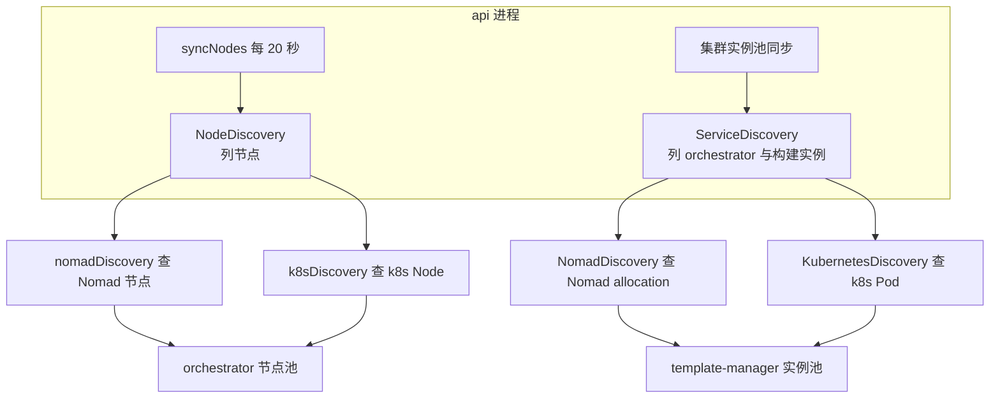

# 76 · Kubernetes 服务发现

> api 想知道「有哪些 orchestrator」，上游 2026.09 的两处代码都直接拿着 `*nomadapi.Client` 去问 Nomad。
> 把同一套服务搬到 Kubernetes 上时，这两处必须换成问 API Server。ARM 适配版为此加了两层接口：
> 一层在 shared 里抽象「工作负载实例」，一层在 api 里抽象「节点列表」。本篇讲这两层各自解决什么、
> Pod 与 Node 上的哪些字段被映射成了原来 Nomad 的哪些字段、这套映射在健康判据与标识符上带来了什么偏差，
> 以及哪些依赖 Nomad 的路径没有被这次改动覆盖。
>
> **读者**：工程师、运维。　**预备**：[第 21 篇 · 集群与服务发现](21-clusters-and-discovery.md)、
> [第 19 篇 · 节点管理与放置](19-node-management-and-placement.md)。
> **代码**：`packages/shared/pkg/clusters/discovery/`、`packages/api/internal/orchestrator/`、
> `packages/api/internal/clusters/discovery/local.go`、`packages/api/internal/handlers/store.go`、
> `helm/templates/rbac-orchestrator.yaml`

---

## 0. 本篇要回答的问题

1. 上游 2026.09 里对 Nomad 的依赖具体落在哪几个函数上？为什么需要两层而不是一层抽象？
2. 一个 Kubernetes Pod 的哪些字段被映射成 Nomad allocation 的哪些字段？映射之后语义有没有变？
3. 「这个 orchestrator 还活着」这句话在两种发现方式下分别由谁判定、依据是什么？
4. api 在 Kubernetes 里需要哪些 RBAC 权限，为什么其中一条必须是集群级的？
5. 选择哪种发现方式由什么决定？在 Nomad 形态下这段新代码会不会带来行为变化？
6. 哪些依赖 Nomad 或 Consul 的路径这次没有被改到，因而限制了 Kubernetes 形态的适用范围？

---

## 1. 问题：两处发现代码，都写死在 Nomad 上

上游 2026.09 的 api 有两条互相独立的发现路径，[第 21 篇 §4](21-clusters-and-discovery.md#4-三种发现来源) 描述过它们的分工。

第一条在 `packages/api/internal/orchestrator/client.go` 的 `listNomadNodes()`：查 **Nomad 节点**列表，
过滤条件是 `Status == "ready" and NodePool == "default"`，把每个节点的地址加上 `consts.OrchestratorAPIPort`
（由 `ORCHESTRATOR_PORT` 决定，默认 5008）拼成 gRPC 目标，返回一组 `nodemanager.NomadServiceDiscovery`。
`cache.go` 的 `syncNodes()` 每 20 秒调它一次，用返回结果做两件事：给没连过的地址建连接（`syncLocalDiscoveredNodes()`），
以及在 `syncNode()` 里检查池中已有节点是否还在列表里 —— 不在就关连接、摘出池子。

第二条在 `packages/shared/pkg/clusters/discovery/nomad.go` 的
`ListOrchestratorAndTemplateBuilderAllocations()`：查 **Nomad allocation** 列表，
过滤器由调用方传入，本地集群传的是 `FilterTemplateBuilders`，即只找 template-manager。
它服务的是集群实例池，产出 `Allocation{NodeID, AllocationID, AllocationIP}`。

两条路径查的是 Nomad 的两种不同对象（node 与 allocation），返回两种不同结构，被两套同步循环消费。
它们唯一的共同点是都握着一个具体类型 `*nomadapi.Client`。这就是移植时的障碍：
类型是具体的，没有接缝可以替换实现。ARM 适配版没有把两条路径合并，而是在各自的位置上开了一个接口，
于是有了两层抽象。这个选择的代价是重复 —— 同一套「按 Kubernetes 对象找 orchestrator」的逻辑写了两遍，
一遍看 Pod，一遍看 Node；收益是改动面小，两条路径的既有语义都不必动。



---

## 2. 第一层：shared 里的 ServiceDiscovery

新增文件 `packages/shared/pkg/clusters/discovery/interface.go` 只有两个声明。
`Allocation` 结构体从 `nomad.go` 原样搬了过来，字段仍是 `NodeID`、`AllocationID`、`AllocationIP`；
接口只有一个方法：

```go
type ServiceDiscovery interface {
	ListOrchestratorAndTemplateBuilderAllocations(ctx context.Context) ([]Allocation, error)
}
```

方法名保留了 Nomad 时代的措辞，包括那个已经不准确的「Allocations」。这不影响行为，
但读代码时要记住：在 Kubernetes 实现里它返回的是 Pod。

Nomad 实现的改造是机械的：原来的自由函数变成 `NomadDiscovery` 结构体的方法，
`client` 与 `filter` 两个参数从调用期移到构造期，由 `NewNomadDiscovery(client, filter)` 固定。
函数体除了把 `client` 换成 `n.client`、`filter` 换成 `n.filter` 之外没有变化：
仍然带 `resources=true` 参数列 allocation，仍然跳过没有 `AllocatedResources` 或没有网络的条目并记 warning，
仍然取 `AllocatedResources.Shared.Networks[0].IP` 作地址、取 `NodeName` 作 `NodeID`。
过滤器本身（`FilterTemplateBuilders` 与未被使用的 `FilterTemplateBuildersAndOrchestrators`）保持原样。

值得注意的是过滤器进了构造函数之后，`ServiceDiscovery` 接口就不再能表达「这次只找 template builder」
这个意图 —— 意图被烧进了实例。Kubernetes 实现用同样的方式处理：label selector 也在构造期固定。

---

## 3. Kubernetes 实现：Pod 映射成 Allocation

`packages/shared/pkg/clusters/discovery/k8s.go` 的 `KubernetesDiscovery` 有三个字段：
`client kubernetes.Interface`、`namespace`、`labelSelector`。两个构造函数：

- `NewKubernetesDiscovery(namespace)` 自己调 `rest.InClusterConfig()` 建客户端，返回
  `(ServiceDiscovery, error)`。在 ARM 适配版的全部代码里没有任何调用点。
  **推论：** 它是先写出来、后来改成由外部注入客户端而遗留的。
- `NewKubernetesDiscoveryWithClient(client, namespace, labelSelector...)` 接收已经建好的客户端。
  `labelSelector` 是可变参数，省略或传空串时取默认值 `app=template-manager` —— 与 Nomad 侧
  `FilterTemplateBuilders` 对应。这是实际被使用的那个。

查询本身是一次 `Pods(namespace).List()`，带两个筛选：

```go
metav1.ListOptions{
	LabelSelector: k.labelSelector,
	FieldSelector: "status.phase=Running",
}
```

返回的每个 Pod 再过一道 `isPodReady()`：`Status.Phase` 必须是 `PodRunning`，
且 `Status.Conditions` 里必须有一条 `PodReady` 为 `ConditionTrue`。
`Phase` 这一条与 `FieldSelector` 重复，`PodReady` 那一条才是新增的判据。
不通过的 Pod 记一条 warning 后跳过；`Status.PodIP` 为空的同样跳过并记 warning；
`Spec.NodeName` 为空时填字符串 `unscheduled`（能走到这里的 Pod 已经 Running，
**推论：** 这个分支实际到不了，是防御性代码）。

字段映射如下：

| `Allocation` 字段 | Nomad 取值 | Kubernetes 取值 | 生命周期 |
|---|---|---|---|
| `NodeID` | allocation 的 `NodeName` | Pod 的 `Spec.NodeName` | 与机器同寿 |
| `AllocationID` | allocation 的 `ID` | Pod 的 `UID` | 与这一次调度同寿 |
| `AllocationIP` | `AllocatedResources.Shared.Networks[0].IP` | Pod 的 `Status.PodIP` | 与 Pod 同寿 |

三个字段的语义都对得上，前提是 Pod 的 IP 从 api 进程可达、且服务监听在
`consts.OrchestratorAPIPort` 上 —— `local.go` 在把 `Allocation` 转成 `Item` 时把端口写死成这个常量。
`helm/templates/template-manager.yaml` 里 template-manager 是一个 `hostNetwork: true` 的 DaemonSet，
nodeAffinity 把它钉在带 `node-role.kubernetes.io/{{ .Values.build.pool }}` 这个键的节点上。
`hostNetwork` 意味着 `Status.PodIP` 就是节点 IP，可达性成立。
注意这一层的筛选完全不看节点 label：它只按命名空间加 `app=template-manager` 这个 Pod label 找，
节点的归属由 DaemonSet 的调度决定，发现侧不重复表达。

端口一致要靠部署参数保证：template-manager 的监听端口来自 `templateManagerPort`
（`args: --port` 与 `GRPC_PORT` 都用它），而 `local.go` 拼地址时用的是 `consts.OrchestratorAPIPort`，
即 `orchestratorPort`。两者在单机离线版的 `env.template` 里都写成 5008，恰好相等。
**推论：** 把 `TEMPLATE_MANAGER_PORT` 改成与 `ORCHESTRATOR_PORT` 不同的值会让这条发现路径连到错误的端口，
而且 Nomad 形态下同样如此 —— 这个假设是从上游继承来的，不是 Kubernetes 引入的。

---

## 4. 第二层：api 里的 NodeDiscovery

`packages/api/internal/orchestrator/discovery.go` 定义了第二个接口：

```go
type NodeDiscovery interface {
	ListNodes(ctx context.Context) ([]nodemanager.NomadServiceDiscovery, error)
}
```

返回类型仍叫 `NomadServiceDiscovery`，字段仍叫 `NomadNodeShortID`。ARM 适配版没有改这些名字，
所以在 Kubernetes 形态下读日志与代码时，「Nomad」这个词只表示「本地集群、直连节点」，不表示编排系统。
`nodemanager.Node` 的 `IsNomadManaged()` 判据是 `NomadNodeShortID != "unknown"`，
因此 Kubernetes 发现出来的节点仍算「Nomad 托管」，
`lifecycle.go` 的 `addSandboxToRoutingTable()` 会照常把沙箱写进路由目录 —— 这是需要的行为。

`client.go` 的 `listNomadNodes()` 被掏空，只剩 `return o.discovery.ListNodes(ctx)`，
原来的实现整体搬进 `nomad_discovery.go`，`list-nomad-nodes` 这个 span 没有跟过去。搬家过程中还丢了一个条件：

```go
// 上游 2026.09
Filter: "Status == \"ready\" and NodePool == \"default\""
// ARM 适配版 nomad_discovery.go
Filter: `Status == "ready"`
```

节点池限定没了。上游用 `NodePool == "default"` 把 api 节点、构建节点排除在 orchestrator 节点池之外
（[第 79 篇 §2](79-nomad-multinode-deployment.md#2-四类节点与它们跑什么) 讲这四个池的分工）。
去掉之后，任何 `ready` 的 Nomad 节点都会被当成 orchestrator 去连 5008 端口。
后果不是崩溃：`nodemanager.New()` 会因为 `ServiceInfo` 调用失败而返回错误，
`syncLocalDiscoveredNodes()` 记一条 error 后作罢。代价是每 20 秒对每个非 orchestrator 节点做一次
5 秒超时的连接尝试，以及日志里稳定的错误噪声。**推论：** 这是为了适配单机离线版而做的简化 ——
那里只有一个节点，节点池名字未必是 `default`。

`k8s_discovery.go` 是这一层的 Kubernetes 实现，与第一层的实现方式完全不同：它查的是 **Node** 而不是 Pod。

```go
selector, _ := labels.Parse("node-role.kubernetes.io/sandbox=true")
```

选择器写死在构造函数里，没有环境变量可调，解析错误被丢弃（对常量表达式而言解析不会失败）。
`ListNodes()` 用它列节点，对每个节点从 `Status.Addresses` 里找类型为 `NodeInternalIP` 的第一条地址，
找不到就跳过；找到就拼 `IP:consts.OrchestratorAPIPort` 作为 gRPC 目标，
并把 **`node.Name` 原样**放进 `NomadNodeShortID`。

「原样」这一点与 Nomad 实现不同。`nomad_discovery.go` 沿用上游做法，取 `node.ID[:consts.NodeIDLength]`，
即 Nomad 客户端 UUID 的前 8 个字符。这个短 ID 与 orchestrator 自报的 `NodeID`
（来自环境变量 `NODE_ID`，Nomad job 里是 `${node.unique.name}`）是两个不同的字符串，
[第 21 篇 §6](21-clusters-and-discovery.md#6-三个标识符) 讲过它们为什么不能合并。
在 Kubernetes 形态下这两个字符串却相等：`helm/templates/orchestrator.yaml` 把 `NODE_ID`
设成 `fieldRef: spec.nodeName`，发现侧取的也是 `node.Name`。
`nodemanager.Node` 里 `ID` 与 `NomadNodeShortID` 两个字段因此存的是同一个值。
这不影响正确性 —— `syncNode()` 用前者匹配、`scopedNodeID()` 用后者索引，两边都自洽 ——
但它让「三个标识符」的区分在 Kubernetes 上消失，进程重启的检测就只剩 `serviceInstanceID` 一条依据。

---

## 5. 选择逻辑与客户端注入

选择发生在三个地方，判据是同一个环境变量 `ORCHESTRATOR_TYPE`，默认值都是 `nomad`：

1. `packages/api/internal/handlers/store.go` 的 `NewAPIStore()`：只有取值为 `k8s` 时才调
   `rest.InClusterConfig()` 与 `kubernetes.NewForConfig()` 建客户端，任一步失败就 `Fatal`
   （这两处用的是 `zap.L().Fatal`，与该文件其余位置的 `logger.L().Fatal` 不一致，日志里少了 trace 上下文）。
   Nomad 客户端仍然无条件构造 —— `nomadapi.NewClient()` 只解析配置不建连接，
   所以在没有 Nomad 的 Kubernetes 集群里这一步也不会失败。
2. `packages/api/internal/orchestrator/orchestrator.go` 的 `New()`：
   `case "k8s"` 用 `NewK8sDiscovery(kubeClient)`，`case "nomad"` 与 `default` 都落到 `NewNomadDiscovery(nomadClient)`。
3. `packages/api/internal/clusters/discovery/local.go` 的 `NewLocalDiscovery()`：同样的 switch，
   但多读一个 `K8S_NAMESPACE`（默认 `e2b`），选出第一层的实现。
   Helm 的三个模板都没有设置 `K8S_NAMESPACE`，靠默认值与 `namespace: e2b` 对上。

三处 switch 都只认 `k8s` 一个非默认值，`ORCHESTRATOR_TYPE` 的其它取值一律落到 Nomad 分支。
Helm 侧这个变量不是硬编码的：`api.yaml` 的 initContainer 与 api 容器都写 `{{ .Values.orchestratorType }}`，
`values-template.yaml` 里该字段的值是字符串 `k8s`。单机离线版的 Nomad job 也注入这个变量，
取值仍是 `nomad`，所以同一个二进制靠一个环境变量在两种形态间切换。

客户端从 `NewAPIStore()` 一路传下去：`clusters.NewPool()`、`clustersSyncStore`、`newLocalCluster()`、
`NewLocalDiscovery()`，这几级新加的参数都是接口类型 `kubernetes.Interface`；
只有 `orchestrator.New()` 收的是具体类型 `*kubernetes.Clientset`，再交给收接口的 `NewK8sDiscovery()`。
这里有一处 Go 的类型陷阱：
`store.go` 里 `kubeClient` 声明为具体类型 `*kubernetes.Clientset`，在 Nomad 形态下它是 nil 指针，
但装进 `kubernetes.Interface` 之后接口本身**不是** nil。`NewLocalDiscovery()` 里的
`if k8s == nil` 因此永远为假。这段代码目前不出问题，因为该分支只在 `ORCHESTRATOR_TYPE=k8s`
时才走到，而那时客户端一定非空；但这个空判断给不出它看上去给的保护。
同一函数的另一个分支在 `nomad == nil` 时 `return nil`，返回的是真正的 nil 接口，
调用方 `newLocalCluster()` 不做检查就把它放进 `instancesSyncStore`。**推论：** 若真触发，
第一次同步会在调 `Query()` 时 panic；实际触发不了，因为 Nomad 客户端总是非空。

### 5.1 核实 skipNomadSync

`orchestrator.go` 里还有一行与发现直接相关的改动：

```go
// 上游 2026.09
skipNomadSync := env.IsLocal()
// ARM 适配版
skipNomadSync := false
```

`keepInSync()` 拿这个值决定要不要调 `listNomadNodes()`。上游的语义是「本机开发时不查 Nomad，
改用本地集群的静态发现」。ARM 适配版把它固定为 `false`，即无论如何都走节点发现。

核实的第一步是确认它确实恒为 `false`：这是一个字面量赋值，`keepInSync()` 的形参
`skipSyncingWithNomad` 只有 `New()` 这一个传入点，没有别的路径能把它变成 `true`。

第二步是看这个恒定值在各形态下是否与上游一致，判据是 `env.IsLocal()`，即 `ENVIRONMENT == "local"`。
两处部署形态都给 api 显式指定了 `dev`：Helm 的 `api.yaml` 把 `ENVIRONMENT` 硬编码成 `"dev"`
（不走 `.Values.environment`），单机离线版的 `iac/provider-gcp/nomad/jobs/api.hcl` 同样硬编码成 `"dev"`
—— 这一处也是 ARM 适配版改的，上游那里写的是 `${environment}`。
这个区别很要紧，因为单机离线版的 `env.template` 里 `export ENVIRONMENT=local`，
这个值会原样传给 `orchestrator.hcl` 与 `template-manager.hcl`；如果 api 不被单独钉成 `dev`，
上游的表达式在单机离线版上会求值为 `true`，节点发现就整个被关掉。

结论有两层。**其一，在 Helm 与单机离线版两种形态下，恒定的 `false` 与上游表达式的求值结果一致，
不改变行为** —— api 的 `ENVIRONMENT` 已经被两处部署模板各自钉成 `dev`，改与不改都是 `false`。
**其二，它改变的是 `ENVIRONMENT=local` 的本机开发场景**：那时 api 会照常去查节点发现，
而 `local.go` 的 `Query()` 仍然在 `env.IsLocal()` 时走静态分支返回硬编码条目，
两条路径都会往节点池里塞东西。**推论：** 这一行与 `api.hcl` 的 `dev` 是同一个目的的两种做法，
留下的代价是失去了上游用 `ENVIRONMENT=local` 一键关掉节点发现的开关。

---

## 6. 权限与部署上的对应

`helm/templates/rbac-orchestrator.yaml` 是这次改动带来的新文件，四个对象加一个 ServiceAccount：

| 对象 | 作用域 | 资源 | 动词 |
|---|---|---|---|
| `ClusterRole` `e2b-orchestrator-node-reader` | 集群 | `nodes` | `get`、`list`、`watch` |
| `Role` `e2b-orchestrator-pod-reader` | `e2b` 命名空间 | `pods` | `get`、`list`、`watch` |

两条各对应一层发现：节点权限给 `k8s_discovery.go`，Pod 权限给 `k8s.go`。
节点这一条必须是 `ClusterRole` + `ClusterRoleBinding`，因为 `Node` 不是命名空间内的对象，
用 `Role` 授不了权；Pod 那一条限定在 `e2b` 命名空间内，与 `K8S_NAMESPACE` 的默认值一致。
两处代码实际只用了 `list`，`get` 与 `watch` 是多给的。**推论：** `watch` 是为将来换成 informer
（带本地缓存、事件驱动）预留的。

ServiceAccount 叫 `e2b-orchestrator`，但真正需要这些权限的是 **api** 进程 ——
`helm/templates/api.yaml` 的 Pod 声明了 `serviceAccountName: e2b-orchestrator`，
而 `orchestrator.yaml` 的 DaemonSet 没有声明任何 ServiceAccount，用的是命名空间默认账号。
名字与用途不一致，权限范围本身是对的。

还有一处需要在部署时对齐的地方：`k8s_discovery.go` 要求节点带 label
`node-role.kubernetes.io/sandbox=true`（键与值都要匹配），
而 `orchestrator.yaml` 的 DaemonSet 用 nodeAffinity 选的是键
`node-role.kubernetes.io/{{ .Values.default.pool }}`、操作符 `Exists`，
`values-template.yaml` 里 `default.pool` 就是字符串 `default`。
两者用的不是同一个 label，且一个要求值为 `true`、另一个只要求键存在。
Helm 里一共用到三个节点池键：api 的 Deployment 用 `.Values.api.pool`，
template-manager 的 DaemonSet 用 `.Values.build.pool`，orchestrator 的 DaemonSet 用 `.Values.default.pool`，
前两个来自 `API_NODE_POOL` 与 `BUILD_NODE_POOL`，第三个在 `values-template.yaml` 里就是字面量 `default`。
`node-role.kubernetes.io/sandbox=true` 不属于这三个中的任何一个，是发现侧单独要求的第四个 label。
运行沙箱的节点必须同时满足 orchestrator 的调度条件与这个发现条件，
否则会出现「DaemonSet 跑起来了但 api 发现不到」或者相反的情况。
这是 Kubernetes 形态部署时最容易踩的一处配置耦合，
[第 78 篇 §2](78-helm-k8s-deployment.md#2-两套标签两种用途) 给出完整的节点打标步骤。

---

## 7. 两种发现方式的对照

下表只比较 api 用来发现 **orchestrator 节点**的那一层（`NodeDiscovery`），
第一层（`ServiceDiscovery`，找 template-manager）的差异在括号里注明。

| 维度 | Nomad | Kubernetes |
|---|---|---|
| 发现对象 | Nomad 节点（第一层：allocation） | `Node` 对象（第一层：`Pod`） |
| 查询条件 | `Status == "ready"` | label `node-role.kubernetes.io/sandbox=true` |
| 健康判断 | 节点 `ready`，与 orchestrator 进程无关 | 节点无条件筛选，与 orchestrator Pod 无关 |
| 节点 ID 来源 | Nomad 客户端 UUID 前 8 字符 | `node.Name`，不截断 |
| 地址来源 | 节点的 `Address` | `Status.Addresses` 中第一条 `InternalIP` |
| 端口 | `consts.OrchestratorAPIPort` | 同左 |
| 权限依赖 | Nomad ACL token | ClusterRole 读 `nodes` |
| 触发方式 | 20 秒轮询，一次 HTTP 查询 | 20 秒轮询，一次 API Server list |

有两点值得单独说。

**健康判断的粒度在这一层是缺失的，两边都是。** Nomad 侧问的是「节点 ready 吗」，
Kubernetes 侧问的是「节点带这个 label 吗」，两个问题都不涉及 orchestrator 进程本身。
真正判定 orchestrator 死活的是发现之后的那次 `ServiceInfo` gRPC 调用：
`nodemanager.New()` 建连接后立刻调它，失败就不入池；已入池的节点由 `nodemanager/sync.go` 的
`Node.Sync()` 处理，它在**同一轮**里最多重试 `syncMaxRetries` 即 4 次，全失败就把节点标成
`Unhealthy`（[第 19 篇 §2.4](19-node-management-and-placement.md#24-状态三个来源合成一个答案) 讲这套判据）。两种发现方式在这一点上等价。

要点在于 `Unhealthy` 与「摘除」不是一回事。`cache.go` 的 `syncNode()` 只做一件与摘除有关的事：
拿节点的 `NomadNodeShortID` 去当轮的发现结果里找，找不到才返回错误，
由调用方关连接并 `deregisterNode()`。健康状态不参与这个判断。
换句话说，**只有从发现结果里消失的节点才会被摘出池子，被标为不健康的节点会一直留着**。

这个区别让两种发现方式在失效处理上不再等价。Nomad 节点掉线后 Nomad 自己会把 `Status` 从
`ready` 改掉，节点在下一轮就从发现结果里消失，随即被摘除。
而一台 Kubernetes 节点变成 `NotReady` 时 label 还在 —— `k8s_discovery.go` 只按 label 选，
没有检查 `Status.Conditions` 里的 `NodeReady` —— 它仍然出现在发现结果里，
于是每 20 秒被重新访问一次、四次重试全部失败、标成 `Unhealthy`、留在池中，
直到运维把节点对象删掉或把 label 摘掉。代价是一个稳定的僵尸条目与周期性的 gRPC 失败日志；
收益是节点短暂不可达时不必重建连接。
`create_instance.go` 的放置逻辑会跳过 `Status()` 不等于 `NodeStatusReady` 的节点，
所以这不是正确性问题，是可观测性与资源占用问题。

**延迟在两边是同一个量级，因为瓶颈不在发现本身。** 两种实现都是每 20 秒（`cacheSyncTime`）
做一次全量查询，都不使用 watch 或 informer 缓存，都不是事件驱动。
第一层的实例池是 5 秒一轮。一个新起的 orchestrator 从就绪到被 api 用上，
最坏要等一个 20 秒周期加上一次连接与 `ServiceInfo` 往返；一个死掉的 orchestrator
在 Kubernetes 形态下最坏要等四个周期即 80 秒才被摘除。
ARM 适配版另把 `packages/api/internal/clusters/instance.go` 的 `maxInstanceSyncCallTimeout`
从 1 秒放宽到 120 秒（[第 77 篇 §7.2](77-api-and-flags-on-arm.md#72-maxinstancesynccalltimeout改了-120-倍实际生效-5-倍)）。这一项实际上不生效：`Instance.Sync()` 用
`context.WithTimeout(ctx, maxInstanceSyncCallTimeout)` 派生 ctx，而传进来的 ctx 已经带着
`cluster.go` 里 `instancesSyncTimeout` 给的 5 秒轮次期限，两个期限取较早者。
两个调用点（`instances_sync.go` 的 `tryToSyncInstance()` 与 `instance.go` 里新建实例后的首次同步）
都在这个轮次 ctx 之下，所以每次 `ServiceInfo` 调用的真实上限仍是 5 秒，
连续 `maxSyncFailuresBeforeUnhealthy` 即 3 轮失败后标为不健康，总计约 15 秒。
**推论：** 放宽 1 秒这个常量是为了给慢环境留余量，但没有同时放宽轮次超时，改动被上层压住了。

---

## 8. 没有被覆盖的路径

这次改动的范围是「本地集群怎么找到自己的 orchestrator 与 template-manager」。以下路径不在范围内。

**远端集群的发现没有动。** `packages/api/internal/clusters/discovery/remote.go` 仍然调 edge 的
`GET /v1/service-discovery`，它本来就与编排系统无关 —— 远端集群的实例列表由那个集群自己的 edge 负责，
api 只消费 HTTP 接口。因此「多集群」这件事在 Kubernetes 形态下与在 Nomad 形态下没有区别，
只要远端那一侧能跑起 edge。

**第一层的 in-cluster 构造函数是死代码。** `NewKubernetesDiscovery(namespace)` 没有调用点，
实际用的一直是 `NewKubernetesDiscoveryWithClient()`。同样地，第一层的可变参数 `labelSelector`
没有任何调用方传值，注释里提到的 `app in (template-manager,orchestrator)` 只是说明用法。
上游遗留的 `FilterTemplateBuildersAndOrchestrators` 也仍然没有使用者。

**orchestrator 自身对 Consul 的依赖没有解除。** `packages/orchestrator/main.go` 的 `newStorage()`
只在 `env.IsDevelopment()` 或 `USE_LOCAL_NAMESPACE_STORAGE` 为真时用 `network.NewStorageLocal()`，
否则用 `network.NewStorageKV()`，后者用 `utils.RequiredEnv("CONSUL_TOKEN", …)` 取 token 并连 Consul
存网络槽位，取不到就直接退出。`helm/templates/orchestrator.yaml` 不注入 `CONSUL_TOKEN`，
它的 `ENVIRONMENT` 取 `.Values.environment`，也就是部署时 `ENVIRONMENT` 环境变量的值。
因此 Kubernetes 形态能跑起来的前提是这个值落在 `dev` 或 `local` 上，
让 `env.IsDevelopment()` 为真而走本地槽位存储
（[第 35 篇 §1.3](35-sandbox-networking.md#13-两者的对比) 讲两种槽位存储的差别）。
注意 api 的 `ENVIRONMENT` 是另一回事，它被 `api.yaml` 单独钉成 `dev`，与槽位存储无关。
后果是 Kubernetes 形态目前只能跑本地槽位分配语义，槽位不在节点之间协调。

**edge 的 `ORCHESTRATOR_TYPE` 是空设置。** `helm/templates/edge.yaml` 也注入了这个变量，
但在 ARM 适配版的全部 Go 代码里，读 `ORCHESTRATOR_TYPE` 的只有本篇讲的 api 三处，edge 进程不读，
这一项不产生行为。edge 在 Kubernetes 形态下找 orchestrator 靠的是另一套配置：
同一个模板里的 `SERVICE_DISCOVERY_ORCHESTRATOR_PROVIDER: DNS`，
即用 DNS 解析而不是查编排系统。这条路径不在本次改动范围内。

---

## 9. 小结

- 上游 2026.09 对 Nomad 的依赖落在两个互不相干的位置：`orchestrator/client.go` 的 `listNomadNodes()`
  查节点，`shared/pkg/clusters/discovery/nomad.go` 查 allocation。ARM 适配版在两处各开一个接口，
  没有合并，代价是同一套 Kubernetes 查询逻辑写了两遍。
- 第一层 `ServiceDiscovery` 把 Pod 映射成 `Allocation`：`Spec.NodeName` → `NodeID`、
  `UID` → `AllocationID`、`Status.PodIP` → `AllocationIP`，健康判据是
  `status.phase=Running` 加上 `PodReady` 条件，比 Nomad 的 `ClientStatus == "running"` 严一档。
- 第二层 `NodeDiscovery` 按节点 label `node-role.kubernetes.io/sandbox=true` 找节点，
  取 `InternalIP` 拼 `ORCHESTRATOR_PORT`（默认 5008）。它不看节点的 `NodeReady` 条件；
  而 `syncNode()` 只摘除从发现结果里消失的节点，所以 `NotReady` 但仍带 label 的节点
  会以 `Unhealthy` 状态长期留在池中。
- Kubernetes 形态下 `NomadNodeShortID` 与 `Node.ID` 都等于 k8s 节点名，
  上游区分开的两个标识符退化成一个；检测 orchestrator 进程重启只剩 `serviceInstanceID` 一条依据。
- Nomad 实现搬家时丢掉了 `NodePool == "default"` 条件，所有 ready 的 Nomad 节点都会被尝试连接，
  代价是周期性的失败连接与日志噪声。
- Kubernetes 客户端只在 `ORCHESTRATOR_TYPE=k8s` 时构造，用 in-cluster config，失败即 `Fatal`；
  它以 `kubernetes.Interface` 往下传，`NewLocalDiscovery()` 里的 `if k8s == nil` 因装箱而永假。
- `skipNomadSync` 恒为 `false`（字面量赋值，无其它传入点）。它在 Helm 与单机离线版两种形态下
  不改变行为，因为两处部署模板都把 api 的 `ENVIRONMENT` 单独钉成 `dev`；
  改变的是 `ENVIRONMENT=local` 时的本机开发行为。
- 选择哪种发现方式由环境变量 `ORCHESTRATOR_TYPE` 决定，三处 switch 各自独立读取，默认 `nomad`，
  只有字面量 `k8s` 走 Kubernetes 分支；Helm 由 `values-template.yaml` 的 `orchestratorType: "k8s"` 提供。
- RBAC 需要集群级读 `nodes` 与命名空间级读 `pods`，因为 `Node` 不是命名空间对象；
  代码只用 `list`，`watch` 是预留。ServiceAccount 名为 `e2b-orchestrator`，实际由 api Pod 使用。
- 部署时必须让沙箱节点同时满足两个 label 条件：orchestrator DaemonSet 的
  `node-role.kubernetes.io/default`（存在即可）与发现的 `node-role.kubernetes.io/sandbox=true`；
  template-manager 另有 `node-role.kubernetes.io/${BUILD_NODE_POOL}`。
- 远端集群发现、Consul 网络槽位存储、edge 的 DNS 服务发现都不在这次改动范围内；
  orchestrator 的 `ENVIRONMENT` 必须落在 `dev` 或 `local` 上才能绕开 `CONSUL_TOKEN`，
  Kubernetes 形态因此仍受本地槽位存储的约束。

## 延伸阅读 / 下一篇

- 上游对照：[第 21 篇 §4](21-clusters-and-discovery.md#4-三种发现来源)（本篇改的是它讲的机制）、
  [第 19 篇 §2](19-node-management-and-placement.md#2-节点池发现同步与状态)（发现之后节点怎么被同步与打分）。
- 部署：[第 78 篇 §3.7](78-helm-k8s-deployment.md#37-rbac-orchestrator五个对象服务的是-api)（label、RBAC、
  各组件的 Kubernetes 资源全貌）、[第 79 篇 §2](79-nomad-multinode-deployment.md#2-四类节点与它们跑什么)
  （节点池的分工）、[第 80 篇 · 部署形态三：单机离线 RPM](80-single-node-rpm.md)。
- 同一批补丁的其它 api 侧改动：[第 77 篇 · API 层与特性开关默认值的调整](77-api-and-flags-on-arm.md)。
- 相关机制：[第 35 篇 §1.1](35-sandbox-networking.md#11-storagekvconsul-kv-上的乐观分配)（Consul 槽位存储）、
  [第 46 篇 §1](46-template-manager-service.md#1-一个二进制两个角色)（第一层发现的对象）。
- 外部资料：Kubernetes 的 `client-go` 与 informer 模式（`k8s.io/client-go/informers`），
  可用于把这里的轮询式 list 换成事件驱动。
