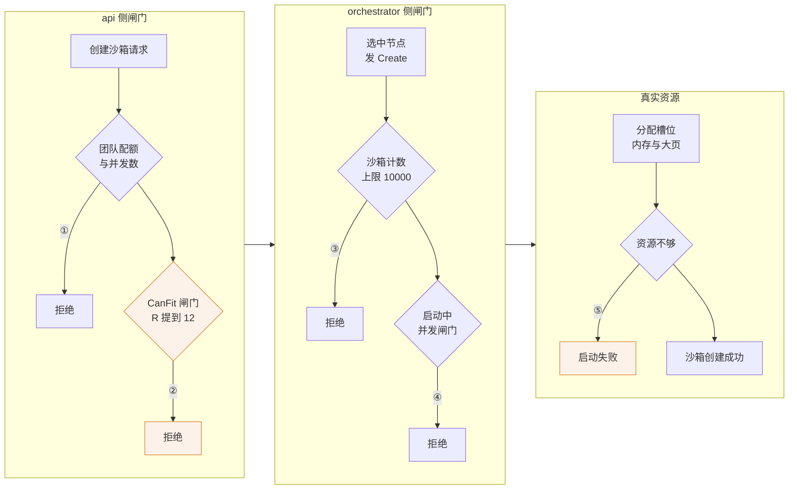

# 77 · API 层与特性开关默认值的调整

> ARM 适配版没有 LaunchDarkly，特性开关的 fallback 值就是线上生效值。于是「调参」变成了「改常量」，
> 一批准入闸门、超时与并发度被写死在代码里。本篇逐项对照上游 2026.09 与 ARM 适配版的取值，
> 说明每个数字改动之后系统的行为差在哪里，以及有几处改动其实被别的上限封住了。
>
> **读者**：读过第 14、19、36 篇的人　**预备**：第 14 篇（特性开关与版本）、第 19 篇（放置算法）、第 36 篇（envd 通信）
> **代码**：`packages/shared/pkg/feature-flags/flags.go`、`packages/shared/pkg/grpc/server.go`、
> `packages/api/main.go`、`packages/api/internal/clusters/instance.go`、`packages/api/internal/sandbox/sandbox_features.go`

---

## 0. 本篇要回答的问题

1. 为什么在 ARM 适配版里讨论「特性开关的默认值」等价于讨论「代码里的常量」？
2. 两道准入闸门抬高之后，一个创建请求还会在哪里被拒绝？R 变大会不会改变「放到哪台机器」？
3. envd init 的单次请求超时从 50 ms 改成 120000 ms 之后，一次尝试实际能等多久，重试还会不会发生？
4. `MaxConcurrentStreams(1000)` 与 `MaxConnectionAge = 0` 这两行，哪一行改变了行为，哪一行没有？
5. `maxInstanceSyncCallTimeout` 从 1 s 改到 120 s，实际生效的超时是多少？
6. Firecracker 版本常量去掉 commit SHA 之后，为什么必须同时改 `NewVersionInfo()`？

---

## 1. 没有开关服务的部署，开关就是常量

回顾第 14 篇 [§2.3](14-config-flags-versions.md#23-没有-launchdarkly-时)：
`packages/shared/pkg/feature-flags/client.go` 的 `NewClient()` 在 `LAUNCH_DARKLY_API_KEY`
为空时构造一个以离线存储为数据源的客户端，不发起任何网络连接，每个 flag 恒定返回注册时给的
fallback。ARM 适配版的部署里没有这个 key，整套开关退化成一组编译期常量。

这件事决定了本篇的性质。在上游，`flags.go` 里的数字只是保底值，真实取值在控制台里，
可以按团队分流，也可以在 30 秒内全集群改一遍（第 19 篇
[§4.1](19-node-management-and-placement.md#41-参数表) 的 `updateBestOfKConfig()`）。
在 ARM 适配版，这些数字是唯一取值，改它要重新编译并部署整套二进制。
下面每一项的代价都要放在这个前提下读：**上游那些数字是可以试错的，ARM 适配版的这些不是。**

补丁涉及的取值逐项列出如下。动机一栏没有补丁作者的说明可依据，只能从改动的形状反推，
统一算作推论；后果一栏在下文各节展开。

| 项与位置 | 上游 2026.09 | ARM 适配版 | 动机（推论） | 后果 |
|---|---|---|---|---|
| `max-sandboxes-per-node`（`feature-flags/flags.go`） | 200 | 10000 | 单机部署里没有「别的节点」可退，静态计数闸门只会误伤 | 节点侧计数闸门实际失效，拒绝点后移到资源真的耗尽处 |
| `best-of-k-max-overcommit`（同上） | 400，即 R=4.0 | 1200，即 R=12.0 | 让单机的 vCPU 超售倍数跟上演示与压测的并发要求 | `CanFit()` 阈值放宽三倍；打分排序不变；忙时 CPU 争抢加剧 |
| `envd-init-request-timeout-milliseconds`（同上） | 50 | 120000 | aarch64 上沙箱启动更慢，50 ms 的轮询产生大量无效请求 | 被 `sandboxHttpClient` 的 10 s 客户端超时截住，单次尝试实际 10 s，重试从上千次降到个位数 |
| `memory-prefetch-max-fetch-workers`（同上） | 16 | 32 | 存储后端换成同机房 MinIO，单次范围读延迟低，可用更高并发填带宽 | 每沙箱拉取并发翻倍，多沙箱并发恢复时是倍数关系 |
| `memory-prefetch-max-copy-workers`（同上） | 8 | 16 | 写保护退化使内存 diff 变大，用并行度补偿数据量 | `UFFDIO_COPY` 侧锁竞争上升，补丁未附测量数据 |
| `DefaultFirecackerV1_10Version` / `V1_12Version`（同上） | `v1.10.1_30cbb07` / `v1.12.1_a41d3fb` | 两者都是 `v1.13.1` | 只提供一个分叉 Firecracker 二进制，不再按次版本线分目录 | 版本映射表退化为恒等；`NewVersionInfo()` 必须容忍无下划线的版本串 |
| `NewVersionInfo()` 的 `parts[1]`（`api/internal/sandbox/sandbox_features.go`） | 直接取下标 | 加 `len(parts) > 1` 判断 | 上一行的必要配套 | 不加则创建沙箱与创建模板两条路径都会 panic |
| `MaxConcurrentStreams`（`shared/pkg/grpc/server.go`） | 未设置，等于 `math.MaxUint32` | 1000 | 防止单条连接上的流数失控 | 唯一真正收紧的一行；当前规模下不触及 |
| `MaxConnectionAge` / `MaxConnectionIdle`（同上） | 未设置 | 显式写 0 | 把「不主动关连接」写成声明 | 无行为变化，0 会被替换成 `infinity` |
| `maxReadHeaderTimeout`（`api/main.go`） | 5 s | 60 s | 与另外两个超时一起放大的顺手操作 | 慢速客户端能更久地占住连接槽位 |
| `maxReadTimeout`（同上） | 10 s | 300 s | 同上 | 同上，防御需在反向代理层补回 |
| `maxWriteTimeout`（同上） | 75 s | 300 s | envd 等待放宽后，75 s 的墙钟上限会截断慢启动请求 | 慢请求能拿到有意义的错误而不是被关连接 |
| `maxInstanceSyncCallTimeout`（`api/internal/clusters/instance.go`） | 1 s | 120 s | 负载下 aarch64 节点回 `ServiceInfo` 可能慢于 1 s | 被上层 5 s 的轮次超时封顶，实际是 1 s → 5 s |

---

## 2. 准入闸门：两个数字与它们之间的空隙

### 2.1 `max-sandboxes-per-node`：200 → 10000

这个开关只有一个读取点：`packages/orchestrator/internal/server/sandboxes.go` 的
`Server.Create()`，在做任何实际工作之前比较 `s.sandboxes.Count()` 与开关值，
超了直接返回 `codes.ResourceExhausted`。它和资源无关，纯粹数个数。

上游取 200 的含义是「一台机器上同时活着的沙箱不超过 200 个」。ARM 适配版取 10000，
在实践中等于取消这道闸门：一台鲲鹏服务器不可能同时跑一万个沙箱。同一节点上另一个天然上限
是网络槽位，由 `packages/orchestrator/internal/sandbox/network/slot.go` 的
`GetVrtSlotsSize()` 按默认的 `10.12.0.0/16` 算出，量级在三万以上，也不是瓶颈；
真正先到的是内存与大页。

**推论：** 上游的 200 是给多节点集群按机型定的，在集群里被拒绝的请求会被 api 换一个节点重试
（第 19 篇 [§6.1](19-node-management-and-placement.md#61-api-侧的重试循环)），
而单机部署没有「别的节点」，一次 `ResourceExhausted` 就是一次用户可见的失败。
代价是失去了「过载前先拒绝」的语义：拒绝时机从「计数超限」推迟到「真的分配不出内存」，
后者发生在启动流程更深处，清理路径更长，也更难归因。

### 2.2 `best-of-k-max-overcommit`：400 → 1200

这个开关经 `packages/api/internal/orchestrator/orchestrator.go` 的 `getBestOfKConfig()`
除以 100 转成 `BestOfKConfig.R`。第 19 篇
[§3.3](19-node-management-and-placement.md#33-打分) 给出了打分公式：

```text
score(n, r) = ( r.vcpu + allocated(n) + Alpha × usage(n) ) / ( R × cpus(n) )
```

`placement_best_of_K.go` 的 `CanFit()` 用同一量纲做闸门：`allocated(n) + r.vcpu <= R × cpus(n)`。
R 从 4.0 提到 12.0（`flags.go` 里 `Default R=4` 的注释没跟着改，以数值为准），
两处同时受影响，但方式不同：

- **闸门放宽三倍。** 一台 64 核机器允许的 vCPU 声明总量从 256 提到 768。
- **打分的排序不变。** R 是集群级参数，出现在所有候选节点分母里的同一个位置，
  所有分数被同一个常数除，相对次序不受影响。所以调 R 只影响「收不收」，
  不影响「收哪台」，不改变负载均衡行为。

放在单机场景里，候选集永远只有一个节点，`sample()` 的随机抽样与 `Score()` 的比较都退化，
唯一起作用的是 `CanFit()`。于是 R 由 4 提到 12 的实际含义是：
**单机允许的超售倍数从 4 倍变成 12 倍。**

`CanFit()` 本身是可以整体关掉的：`sample()` 里它被 `config.CanFit` 包着，
取自布尔开关 `best-of-k-can-fit`，fallback 为 true，在 ARM 适配版里恒定开启；
相邻的 `best-of-k-too-many-starting` fallback 为 false，所以 api 侧那道「启动中数量」过滤
恒定关闭，并发启动数的约束只剩 orchestrator 自己的信号量（[第 71 篇 §6](71-orchestrator-arm-fc-changes.md#6-准入三个常量与一次语义变化)）。

**推论：** R 的改动与 §2.1 是同一个动机的两半——把两侧的准入闸门一起抬高。代价更尖锐：
第 19 篇 §4.2 说的「大多数沙箱大多数时间空闲」这个前提在演示与压测场景下不成立，
12 倍声明量同时忙起来时，每个沙箱分到的实际 CPU 时间只有声明值的十二分之一，
表现为沙箱内命令执行变慢而不是创建失败。系统把「拒绝服务」换成了「普遍变慢」。

### 2.3 闸门抬高之后，剩下哪几道

把两处改动放回完整的准入链路，能看清楚请求现在会在哪里被挡下来：



| 编号 | 拒绝点 | 本篇改动后的实际情形 |
|---|---|---|
| ① | 团队配额与并发数 | 未受本篇改动影响 |
| ② | CanFit 不通过 | 阈值抬高三倍，几乎不再挡人 |
| ③ | 沙箱计数超上限 | 实际不再触发 |
| ④ | 启动中并发闸门超时 | 见第 71 篇 |
| ⑤ | 资源真的不够 | 现在的主要拒绝点 |


改动之前，前三道闸门是主要的拒绝来源，它们都在做便宜的检查、快速失败；改动之后，
主要拒绝点下移到最后一道，那里已经起了 Firecracker 进程，失败要走完整的清理路径（[第 39 篇 §4](39-health-errors-and-teardown.md#4-两段式拆除stop-与-close)）。
**这是本篇所有「放宽」类改动的共同代价：把失败从廉价的位置推到昂贵的位置。**

---

## 3. envd init 超时：一次尝试到底能等多久

### 3.1 三层预算，不是两层

第 36 篇 [§3.2](36-orchestrator-proxy-and-envd-client.md#32-无限重试与两层超时) 讲过这条路径上的两层时间预算。
读补丁时必须补上第三层，否则会把改动的效果算错。三层从内到外是：

```text
第一层  单次请求的 context 超时
        来自 envd-init-request-timeout-milliseconds
        上游 50 ms / ARM 适配版 120000 ms
第二层  sandboxHttpClient 的 http.Client.Timeout
        sandbox.go 里写死 10 s，上游与 ARM 适配版都没有改
第三层  WaitForEnvd 的总预算
        恢复与创建路径取 ENVD_TIMEOUT，代码默认 10 s
        上游 GCP 部署的 terraform 默认 40 s，ARM 适配版部署脚本设 60 s
        模板构建路径取 layer/interfaces.go 的常量 waitEnvdTimeout = 60 s
```

第一层在 `envd.go` 的 `doRequestWithInfiniteRetries()` 每轮循环用
`context.WithTimeout(ctx, s.internalConfig.EnvdInitRequestTimeout)` 构造；
第二层是 `sandbox.go` 里 `var sandboxHttpClient = http.Client{Timeout: 10 * time.Second, …}`，
它给整个请求交换设墙钟上限，与 context 无关；第三层不是 deadline，而是 `WaitForEnvd()`
里的看门狗 goroutine，`time.After(timeout)` 到点就 `cancel()` 掉父 context，
它同时监听 Firecracker 的退出通道，FC 提前挂掉会立刻取消整轮等待。

**一次尝试实际能等多久，是这三层里最小的那个。** 上游是 50 ms；ARM 适配版把第一层放到 120 s，
于是第二层的 10 s 成了实际上限。那个刺眼的 120000 并没有真的生效，
真正生效的是一个补丁没碰过的常量。

### 3.2 后果：重试还在，但只剩个位数

在 60 s 的总预算里，一次尝试最多耗 10 s，失败后等 `loopDelay`（5 ms）重发，
所以「无限重试」最坏只转大约六圈，而上游 50 ms 的配置能转上千圈。转几圈取决于失败的形状：

- **guest 内核已经起来、但 envd 还没监听端口**：连接被 RST，`Do` 立刻返回错误，循环等 5 ms
  再发。这种形状下两边行为几乎一样，重试仍然密集有效。
- **guest 还在早期启动、网络栈没配好，SYN 被丢弃**：`Do` 会一直等到超时。
  上游 50 ms 后放弃、重发；ARM 适配版每次要耗掉 10 s。

第二种是冷启动时更受影响的形状（**推论**：沙箱从快照恢复时 guest 网络配置尚未生效的窗口，
比 envd 进程尚未 listen 的窗口更长）。此时探测就绪的时间分辨率从 50 ms 掉到 10 s：
envd 在第 3 秒就绪，orchestrator 也要等到第 10 秒才发下一次请求，中间七秒是纯粹的空等。

三个连带后果：

1. **失败变慢。** 一个注定失败的沙箱创建要占满 60 s，期间网络槽位、模板缓存引用、
   Firecracker 进程都还占着；总预算本身也从 10 s 或 40 s 抬到了 60 s。
2. **诊断信号变钝。** `initEnvd()` 把 `count-1` 次失败与 1 次成功分别记进 `envdInitCalls` 指标，
   上游用这个计数刻画节点的慢；现在它的取值塌缩到个位数。
3. **成功路径没有变慢。** 单次超时只是上限，envd 正常就绪时第一次请求就返回。
   这是这个改动能长期不被发现的原因。

**推论：** 改成 120000 ms 的动机是 aarch64 上沙箱启动确实更慢（第 71、72 篇讲的
FC 启动路径与写保护退化都在加长这段时间），50 ms 的单次超时配合每次重试都要
重新序列化请求体（第 36 篇 §3.3），在慢节点上会产生大量无效请求。
但把第一层调到大于第二、三层，等于放弃了对这一层的控制权。更贴合原意的做法是
把单次超时调到几百毫秒量级，把节奏的控制权留在这个开关手里。

---

## 4. 预取 worker：两个并发度各翻一倍

`packages/orchestrator/internal/sandbox/uffd/prefetch/prefetcher.go` 的 `Prefetcher.Start()`
在启动预取时读两个开关：

```go
maxFetchWorkers := p.featureFlags.IntFlag(ctx, featureflags.MemoryPrefetchMaxFetchWorkers)
maxCopyWorkers := p.featureFlags.IntFlag(ctx, featureflags.MemoryPrefetchMaxCopyWorkers)
```

上游的注释把两者的区别写清楚了：fetch 是 I/O 密集的（从对象存储按范围拉分片），可以多开；
copy 走 uffd 系统调用写进 guest 内存，并发太高会压垮系统，所以限得更紧。
ARM 适配版把它们改成 32 与 16，比例不变。这两个数是**每沙箱**的，
并发恢复多个沙箱时实际 goroutine 数是它们的倍数。它还有前置条件：`sandbox.go` 的
`ResumeSandbox()` 只在模板元数据里存在 `meta.Prefetch.Memory` 时才起 `Prefetcher`。

**推论：** 动机有两层。一是存储后端从 GCS 换成了同机房甚至同机的 MinIO（[第 75 篇 §5](75-minio-storage.md#5-把默认-provider-改成-minio)），
单次范围读的延迟低得多，用更高并发填满带宽的代价更小。二是第 72 篇讲的写保护退化
让内存 diff 变成真实脏页集的超集，同一个快照要拉的数据量比 x86 上大，
把并发翻倍是在用并行度补偿数据量。

代价在 copy 侧：`UFFDIO_COPY` 会持有目标地址空间的锁，16 个线程同时往同一个地址空间填页，
锁竞争随并发上升，而这条路径在 aarch64 上的表现与 x86 并不相同（[第 82 篇 §4](82-host-kernel-nbd-hugepages.md#4-大页预留算法与-aarch64-上的一个假设)）。
补丁没有附带调整前后的测量数据，所以这两个值是否优于上游值，本书无法判断。
[第 32 篇 §3](32-memory-prefetch-and-hugepages.md#3-预取怎么跑)讲的预取机制本身没有改动。

---

## 5. Firecracker 版本常量与一处越界保护

### 5.1 版本串少了一截

上游 `flags.go` 里的版本常量形如 `v1.12.1_a41d3fb`，即「最后一个 tag + 短 commit SHA」，
对应节点上 `/fc-versions/<版本串>/firecracker` 的目录名（第 14 篇
[§3.3](14-config-flags-versions.md#33-谁决定用哪个版本)）。ARM 适配版把
`DefaultFirecackerV1_10Version` 与 `DefaultFirecackerV1_12Version` **都**改成了不带 SHA 的
`v1.13.1`，与单机离线版把二进制装到 `/fc-versions/v1.13.1/firecracker` 相对应：
只提供一个 Firecracker 二进制，无论模板记录的是哪条次版本线，都用它（[第 70 篇 §4](70-firecracker-fork.md#4-版本命名源码-1121装成-v1131)）。

这个改法让上游的版本映射机制安静地退化。`packages/api/internal/orchestrator/create_instance.go`
的 `getFirecrackerVersion()` 拿解析出的主次版本号拼成 `v<major>.<minor>` 去
`firecracker-versions` 这个 JSON flag 里查，而 flag 的默认值 `FirecrackerVersionMap`
现在是 `{"v1.10": "v1.13.1", "v1.12": "v1.13.1"}`。老模板记录的 `v1.10.x` / `v1.12.x`
被映射到 `v1.13.1`；新模板记录 `v1.13.1`，查键 `v1.13` 不在表里，走 `ok == false`
分支返回传入的 fallback，结果同样是 `v1.13.1`。代价是「保留旧二进制供旧快照恢复」
这条兼容策略不再存在——跨次版本恢复能否成功，取决于分叉 Firecracker 的实际兼容性。

### 5.2 为什么必须同时改 `NewVersionInfo()`

`packages/api/internal/sandbox/sandbox_features.go` 的 `NewVersionInfo()` 按 `_` 切分版本串：

```go
parts := strings.Split(fcVersion, "_")
version, versionErr := semver.NewVersion(stripVersionPrefix(parts[0]))
…
info.commitHash = parts[1]
```

`v1.13.1` 里没有下划线，`parts` 长度为 1，`parts[1]` 越界。ARM 适配版加了长度判断：

```go
if len(parts) > 1 {
	info.commitHash = parts[1]
} else {
	info.commitHash = ""
}
```

不加会怎样，取决于调用点。全仓库只有两处：`create_instance.go` 的 `CreateSandbox()`
在保留团队配额、注册 `finishStart` 的 defer 之后调它；
`packages/api/internal/template-manager/create_template.go` 在提交构建时调它。
两处都在请求处理协程里，越界会 panic。api 用 gin，`main.go` 的 `NewGinServer()`
挂了 `gin.Recovery()`，panic 被接住变成 500，但此时配额已经保留、defer 已经注册，
panic 穿过这些 defer 并不等价于正常的错误返回。**所以这个判断是必需的。**

`commitHash` 置空之后没有别的读取点，`VersionInfo` 对外只暴露 `Version()` 与 `HasHugePages()`，
后者判断 `Major() >= 1 && Minor() >= 7`，`v1.13.1` 通过，大页照常启用。

### 5.3 一个连带效应：构建缓存的版本键

同一类「无 key 即 fallback」的效应还出现在一个 ARM 适配版**没有改**的地方。
`packages/orchestrator/internal/template/build/phases/base/hash.go` 的 `Hash()` 这样取
provision 脚本的版本：

```go
provisionVersion := provisionScriptFile
if val := bb.featureFlags.IntFlag(ctx, featureflags.BuildProvisionVersion, …);
	val != featureflags.BuildProvisionVersion.Fallback() {
	provisionVersion = strconv.FormatInt(int64(val), 10)
}
```

`provisionScriptFile` 是 `provision.go` 里用 `//go:embed provision.sh` 嵌进来的脚本全文。
开关取到 fallback（0）时条件不成立，**版本键就是脚本正文本身**，
连同索引版本、磁盘大小与基础镜像名一起参与 `cache.HashKeys()` 的计算。
效果实际上是好的：改一行 provision 脚本就自动让基础层缓存失效，不需要人工递增版本号；
代价是缓存键会因为脚本里的空白改动而变化。ARM 适配版为 openEuler guest 改写过
`provision.sh`（第 74 篇），所以两边算出的基础层缓存键必然不同，缓存无法互认。
构建缓存的完整机制见[第 45 篇 §2](45-layers-and-build-cache.md#2-hash-怎么算)。

---

## 6. gRPC 服务端：一处收紧，两处等于没写

`packages/shared/pkg/grpc/server.go` 的 `NewGRPCServer()` 被两个进程用：`packages/api/main.go`
（给 edge 提供的 `SandboxService`）与 `packages/orchestrator/main.go`（沙箱与卷服务）。
ARM 适配版加了三行，方向并不一致。

**`grpc.MaxConcurrentStreams(1000)` 是收紧。** 这一点容易读反。gRPC-Go 服务端
`maxConcurrentStreams` 的默认值在 `server.go` 的 `defaultServerOptions` 里是
`math.MaxUint32`，即不限制；显式传 1000 是把每条 HTTP/2 连接上的并发流数压到 1000。
连带的行为是：`internal/transport/http2_server.go` 只在这个值不等于 `math.MaxUint32` 时
才把 `SETTINGS_MAX_CONCURRENT_STREAMS` 写进 SETTINGS 帧，所以上游根本不向客户端声明上限。
守规矩的客户端在流数达到 1000 时会在本地排队，表现为延迟；
多开的流则被服务端用 `RST_STREAM` 加 `REFUSED_STREAM` 拒掉。

这两个服务端上的 RPC 全是 unary，仓库里带 `stream` 的 proto 只有 envd 的那几个，
走的是另一条 Connect-RPC 通道（[第 48 篇 §7](48-envd-overview.md#7-一个端口两条协议)）。所以一条连接上的活跃流数约等于正在处理的调用数，
1000 在单机规模下不会触及。**推论：** 这行是防御性设置，防的是单条连接上流数失控耗尽内存。

**`MaxConnectionAge: 0` 与 `MaxConnectionIdle: 0` 不改变任何行为。** gRPC-Go 在
`internal/transport/http2_server.go` 里对这两个字段做零值替换：为 0 时替换成
`defaultMaxConnectionAge` / `defaultMaxConnectionIdle`，而 `internal/transport/defaults.go`
里这两个默认值都是 `infinity`。上游没有设置它们，效果完全一样。
所以这两行是把「不强制关闭连接」这个既有行为写成显式声明，是文档而不是变更。
同一个 `KeepaliveParams` 里上游已有的 `Time: 15s` / `Timeout: 5s` 没有改动。

---

## 7. api 的超时：HTTP 服务端与实例同步

### 7.1 三个 `http.Server` 超时

`packages/api/main.go` 的 `NewGinServer()` 把三个常量装进 `http.Server`：

| 字段 | 上游 | ARM 适配版 | 管什么 |
|---|---|---|---|
| `ReadHeaderTimeout` | 5 s | 60 s | 从连接建立到请求头读完 |
| `ReadTimeout` | 10 s | 300 s | 从连接建立到请求体读完 |
| `WriteTimeout` | 75 s | 300 s | 从请求头读完到响应写完 |

`idleTimeout` 保持 620 s 未动（上游注释说明它要大于 GCP 负载均衡器的 600 s 上游空闲超时）。

`WriteTimeout` 是三者里最要紧的一个：它是整个请求处理的墙钟上限。上游 75 s 意味着
一次创建沙箱的调用必须在 75 s 内出结果，而 §3 里那条 60 s 的 envd 等待恰好挤在里面。
ARM 适配版抬到 300 s，是放宽 envd 超时的配套——不抬高，慢启动的请求会在 api 侧被截断，
客户端拿到的是连接被关闭而不是有意义的错误。

`ReadTimeout` 300 s 的代价方向不同。两个读超时的第一职责是防御慢速客户端：
攻击者建立大量连接、每秒发一个字节，把连接槽位占满。上游 10 s 让这类连接很快被清理；
300 s 意味着一条这样的连接能占用五分钟，是一个需要在反向代理层补回来的缺口
（单机离线版前面有 nginx，见[第 81 篇 §4](81-single-node-traffic.md#4-镜像层nginx-443-与自签证书)）。
**推论：** 抬高两个读超时更可能是「三个数一起改大」的顺手操作——上传路径受
`maxUploadLimit` 的 16 MiB 约束，在任何可用的链路上都不需要 300 s 才能读完。

### 7.2 `maxInstanceSyncCallTimeout`：改了 120 倍，实际生效 5 倍

`packages/api/internal/clusters/instance.go` 的 `Instance.Sync()` 用这个常量给
`ServiceInfo` 这一次 gRPC 调用设超时：

```go
ctx, cancel := context.WithTimeout(ctx, maxInstanceSyncCallTimeout)
info, err := i.client.Info.ServiceInfo(ctx, &emptypb.Empty{})
```

失败时 `syncFailCount` 递增，连续三次（`maxSyncFailuresBeforeUnhealthy`）把实例标成
`Unhealthy`。这里的「实例」是集群池里的一个服务实例，可能是 orchestrator 也可能是
template-builder（[第 21 篇 §3](21-clusters-and-discovery.md#3-两级同步循环)）。所以这个超时决定了「一台节点或构建机多久会被判成不健康」。

ARM 适配版把它从 1 s 改成 120 s。但**实际生效的不是 120 s**。
`packages/shared/pkg/synchronization/synchronization.go` 的 `Start()` 每轮用
`context.WithTimeout(context.WithoutCancel(ctx), syncRoundTimeout)` 造一个轮次 context，
往下传给 `syncOutdated()` → `PoolUpdate()` → `tryToSyncInstance()` → `Sync()`。
`cluster.go` 里传进去的 `syncRoundTimeout` 是 `instancesSyncTimeout = 5 * time.Second`，
ARM 适配版没有改。派生 context 取较早的 deadline，于是每次 `ServiceInfo` 最多只能等 5 s。

结论：这个改动把单次同步调用的上限从 1 s 提到 5 s，而不是 120 s；
判定不健康所需的时间从最坏 3 s 变成最坏 15 s。方向是对的——aarch64 节点在负载下
响应 `ServiceInfo` 慢于 1 s 是可能的，1 s 会误判健康节点——但幅度被上层封住了，
写 120 s 与写 5 s 效果相同。代价是真正宕掉的节点或构建机要多花 12 秒才会从可用池里摘除，
这段时间里的请求会继续派发过去然后失败。

---

## 8. 补丁里其余的 api 侧改动

三处结构性改动属于[第 76 篇](76-k8s-discovery.md)的范围，这里只说它们在 api 里落在哪。

- `packages/api/internal/handlers/store.go` 的 `NewAPIStore()` 在
  `ORCHESTRATOR_TYPE == "k8s"` 时用 `rest.InClusterConfig()` 构造 `kubernetes.Clientset`，
  并把它一路注入 `clusters.NewPool()` 与 `orchestrator.New()`；不是 k8s 时这个变量是 nil。
- `packages/api/internal/clusters/discovery/local.go` 的 `NewLocalDiscovery()` 多收一个
  k8s 客户端参数，按同一个环境变量选实现，并把原来直接调 Nomad 的
  `ListOrchestratorAndTemplateBuilderAllocations()` 换成接口方法。
- `packages/api/internal/orchestrator/orchestrator.go` 引入 `NodeDiscovery` 字段，
  `client.go` 里 `listNomadNodes()` 的实现体只剩一句 `o.discovery.ListNodes(ctx)`。
  新的 `nomad_discovery.go` 与被删掉的实现有一处差别：过滤条件从
  `Status == "ready" and NodePool == "default"` 减为只判 `Status == "ready"`，
  多节点 Nomad 部署（[第 79 篇 §2](79-nomad-multinode-deployment.md#2-四类节点与它们跑什么)）会因此把非 default 池的节点也收进来。

细节见[第 76 篇 §5](76-k8s-discovery.md#5-选择逻辑与客户端注入)。有一处 Go 层面的陷阱：
`NewAPIStore()` 传下去的是 `*kubernetes.Clientset`，赋给 `kubernetes.Interface` 参数后，
即使指针为 nil，接口值也不是 nil，所以 `NewLocalDiscovery()` 里那句 `if k8s == nil` 永远不成立；
当前它不会造成故障，因为走不到那里。

同一个文件里还有一处与发现无关的改动：`skipNomadSync` 从 `env.IsLocal()` 改成常量 `false`，
即无论环境变量怎么设，节点同步循环都会运行。上游把本地开发环境排除在外，是因为那种场景下
用的是 local cluster 路径；ARM 适配版的单机部署既是「本地」又要真的同步。
**推论：** 代价是上游那条为本地测试准备的短路径不再可用。

`packages/api/internal/orchestrator/lifecycle.go` 的改动只是移动了一行 import，没有语义变化；
`packages/api/Dockerfile` 与 `Makefile` 改成「外部交叉编译好二进制、镜像只负责装进去」
并按 `uname -m` 选平台，属于构建与打包，见[第 80 篇 §3](80-single-node-rpm.md#3-离线构建怎么做到)。

---

## 9. 小结

- ARM 适配版没有 LaunchDarkly，特性开关恒取 fallback，`flags.go` 里的默认值就是生效值；
  改这些数字要重新编译整套二进制，没有灰度也没有按团队分流。
- `max-sandboxes-per-node` 200 → 10000 实质上取消了节点侧的计数闸门；
  `best-of-k-max-overcommit` 400 → 1200 把 api 侧的 `CanFit()` 阈值放宽三倍，
  但不改变放置的排序，因为 R 对所有候选节点的分数是同一个除数。两者合起来把主要拒绝点
  从「廉价的静态检查」推到「昂贵的资源真的耗尽」，失败更晚、清理更贵、归因更难。
- `envd-init-request-timeout-milliseconds` 50 → 120000 并没有真的生效到 120 s：
  `sandboxHttpClient` 的 `http.Client.Timeout` 是 10 s，它才是单次尝试的实际上限。
  在 60 s 的总预算下，重试从上千次降到约六次，探测就绪的时间分辨率从 50 ms 掉到 10 s。
- 预取的 fetch / copy worker 各翻一倍到 32 / 16，是每沙箱的并发度，只对带预取映射的模板生效，
  补丁没有附带测量数据。
- Firecracker 版本常量改成不带 commit SHA 的 `v1.13.1`，版本映射表退化为恒等，
  上游「按次版本线保留旧二进制」的兼容策略不再存在；`NewVersionInfo()` 的
  `len(parts) > 1` 判断是必需的，否则创建沙箱与创建模板两条路径都会 panic。
- gRPC 的三行改动里只有 `MaxConcurrentStreams(1000)` 改变行为，方向是收紧
  （gRPC-Go 默认 `math.MaxUint32`，且默认根本不声明这项 SETTINGS）；
  `MaxConnectionAge` / `MaxConnectionIdle` 写 0 等同于不写。
- api 的 `WriteTimeout` 75 s → 300 s 是 envd 超时放宽的配套；
  `ReadTimeout` 10 s → 300 s 削弱了对慢速客户端的防御，需要在反向代理层补回来。
- `maxInstanceSyncCallTimeout` 1 s → 120 s 被上层 `instancesSyncTimeout = 5 s` 封顶，
  实际效果是 1 s → 5 s；不健康判定从最坏 3 s 变成最坏 15 s。
- 有两处改动的数值被别处的常量封住：envd 单次超时与实例同步超时。改的是能看见的那个数，
  生效的是看不见的那个数。

---

## 延伸阅读 / 下一篇

- [第 14 篇 §2](14-config-flags-versions.md#2-特性开关)：开关机制、无 key 时的退化、版本三元组。
- [第 19 篇 §3](19-node-management-and-placement.md#3-放置算法采样过滤打分)：best-of-K 的采样、打分与参数含义。
- [第 21 篇 §3](21-clusters-and-discovery.md#3-两级同步循环)：实例同步循环与健康判定。
- [第 36 篇 §3](36-orchestrator-proxy-and-envd-client.md#3-通道二orchestrator-调-envd-的-init)：`/init` 的无限重试与多层超时。
- [第 70 篇 §4](70-firecracker-fork.md#4-版本命名源码-1121装成-v1131)：`v1.13.1` 这个二进制从哪来。
- [第 71 篇 §6](71-orchestrator-arm-fc-changes.md#6-准入三个常量与一次语义变化)：节点侧的启动闸门与超时。
- [第 72 篇 §5](72-uffd-on-arm.md#5-后果二与预取相乘)：diff 变大对预取并发的影响。
- 下一篇：[第 78 篇 · 部署形态一：Helm / Kubernetes](78-helm-k8s-deployment.md)。
