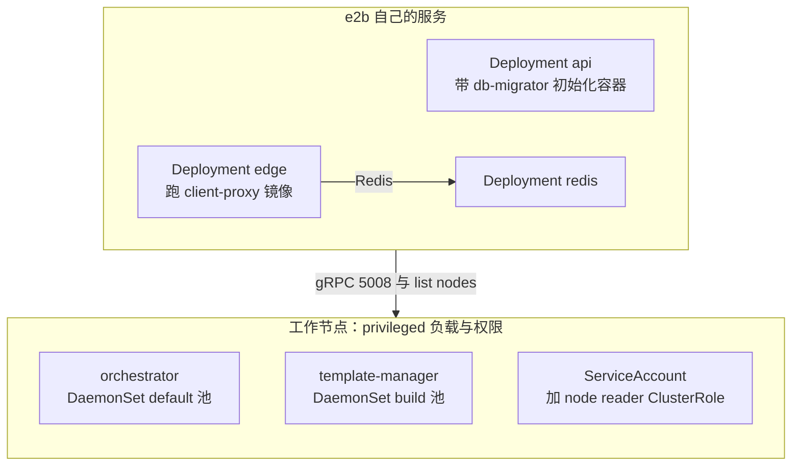
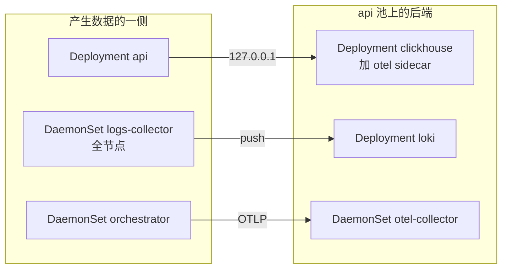

# 78 · 部署形态一：Helm / Kubernetes

> 上游 2026.09 没有任何 Kubernetes 资源定义。ARM 适配版新增了一个 `helm/` 目录，
> 用十份 YAML 把整套 e2b 搬进 k8s。本篇逐份读这些模板，说明每个 k8s 特性是为了绕开什么，
> 并给出它与 Nomad 形态的概念对照。
>
> **读者**：部署与运维方向的工程师、想理解「同一套服务如何换一个调度器」的系统方向读者。
> **预备**：[第 09 篇 §2](09-nomad-consul-terraform.md#2-nomad-的模型)、
> [第 64 篇 · Nomad job 详解](64-nomad-jobs.md)。
> **代码**：`helm/Chart.yaml`、`helm/values-template.yaml`、`helm/templates/*.yaml`、
> `iac/provider-gcp/nomad/jobs/deploy.sh`、`e2b-deploy/dep/init-client.sh`、`e2b-infra.spec`

---

## 0. 本篇要回答的问题

1. 这份 Chart 是怎么被渲染和安装的？为什么它不能直接 `helm install`？
2. orchestrator 这样一个要开 KVM、挂大页、建 tap 设备的进程，在 k8s 里靠哪些字段才跑得起来？
3. 为什么几乎每个 Pod 都是 `hostNetwork: true`？这一个决定连带影响了什么？
4. Nomad 的 job / group / task、`system` 类型、`raw_exec` driver、node pool，
   分别对应 k8s 的什么？哪些概念没有对应物？
5. Helm 形态与 ARM 适配版的 Nomad 形态，覆盖的服务清单一样吗？上游还有哪些部件两边都没有？
6. 模板里那些不生效的环境变量和写死的 `ENVIRONMENT` 值，后果是什么？

---

## 1. 这不是一份通用 Chart

先看它是什么规模的东西。`helm/Chart.yaml` 一共六行，
`description` 写的是 `E2B API service (ex-Nomad job)`。
目录里只有 `Chart.yaml`、`values-template.yaml` 和 `templates/` 下的十份 YAML，
没有 `_helpers.tpl`、没有子 chart、没有 `values.schema.json`。
所有资源都把 `namespace: e2b` 写死在 `metadata` 里，命名空间本身不在 chart 中，
靠安装命令的 `--create-namespace` 建出来。

更值得注意的是**没有 `values.yaml`**，只有 `values-template.yaml`。
Helm 在渲染时读的是 `values.yaml`，缺了它，模板里每一处 `.Values.x` 都会取到空值。
真正的入口在 ARM 适配版新增的 `iac/provider-gcp/nomad/jobs/deploy.sh`：
当命令行带 `--type k8s` 时，它先做

```bash
envsubst < helm/values-template.yaml > helm/values.yaml
helm install e2b-api ./helm --create-namespace -n e2b
```

也就是说，这套模板要**展开两次**：第一次由 `envsubst` 把 `.env` 里的 shell 变量
（`${POSTGRES_CONNECTION_STRING}`、`${API_PORT}` 等）代进 values，
第二次由 Helm 把 `{{ .Values.* }}` 代进 manifest。
两级模板共用同一批配置，只是命名风格不同：shell 侧全大写下划线，Helm 侧小驼峰。

这个设计有它的道理：`.env` 是两种形态**共用**的那一份配置文件，两条路径因此不会配置漂移。
代价是这份 chart 脱离 `deploy.sh` 不可用，直接 `helm install ./helm` 会渲染出一堆空字符串；
单机离线版把整个 `helm/` 装到 `/opt/e2b-infra/helm`，脚本与 chart 因此总是同一份。
另外 `deploy.sh` 用的是 `helm install` 而不是 `helm upgrade --install`，
重复部署要先 `helm uninstall e2b-api -n e2b`，这是安装文档把卸载单列一步的原因。
还有一处副作用：`envsubst` 不区分「未定义」与「空字符串」，
`.env` 里漏掉一项渲染出的是空值而不是报错，问题推迟到 Pod 启动时才暴露。

## 2. 两套标签，两种用途

k8s 形态的前置操作只有两条 `kubectl label`（`e2b-infra/README.md`、
`e2b-infra/docs/zh/install.md` 的「K8s 形式安装」）：

```bash
kubectl label node <nodeName> node-role.kubernetes.io/sandbox=true
kubectl label node <nodeName> node-role.kubernetes.io/<poolName>=
```

这两个标签的用途完全不同，混淆会导致很难查的故障。

第二条是**调度用**的。`poolName` 取 `api`、`build`、`default` 之一，
对应 `values-template.yaml` 末尾的三项 pool，在模板里展开成同一种 `nodeAffinity`：

```yaml
- key: node-role.kubernetes.io/{{ .Values.api.pool }}
  operator: Exists
```

用的是 `operator: Exists` 而不是 `In`，所以标签的值无所谓，存在即可 ——
这解释了安装文档里那个看起来打错了的 `node-role.kubernetes.io/<poolName>=`：
等号后面故意留空。

三个池名并不都是独立的：`.env` 里 `API_NODE_POOL=api` 而 `BUILD_NODE_POOL=api`，
`default.pool` 在 `values-template.yaml` 里直接写死为 `default`。
按发行配置装出来的集群只有两类节点标签，template-manager 与 api、edge、Redis、ClickHouse
落在同一批机器上，只有 orchestrator 单独占 `default` 池。

第一条是**服务发现用**的。api 进程在 `ORCHESTRATOR_TYPE=k8s` 时构造
`packages/api/internal/orchestrator/k8s_discovery.go` 的 `NewK8sDiscovery()`，
其 selector 硬编码为 `node-role.kubernetes.io/sandbox=true`，
`ListNodes()` 按这个 selector 列 Node、取 `InternalIP`，拼成
`<IP>:consts.OrchestratorAPIPort` 作为 orchestrator 的地址。
注意它列的是 **Node 而不是 Pod**：api 认为「打了 sandbox 标签的节点上就有 orchestrator」，
这个假设由 DaemonSet 与 `default` 池标签共同保证，k8s 本身并不校验；
标签打错一台机器，api 就会把一台没跑 orchestrator 的节点当成可用节点
（[第 76 篇 §4](76-k8s-discovery.md#4-第二层api-里的-nodediscovery)）。

### 2.1 四个标签键的打标清单

两条命令展开之后，一套跑得起来的集群上一共要出现四个标签键。
装机时按这张表逐台核对，比事后从 Pod 状态倒推快得多。

| 标签键 | 打在哪些节点 | 谁消费它 | 漏打的症状 |
|---|---|---|---|
| `node-role.kubernetes.io/sandbox=true` | 所有要跑沙箱的节点 | api 的 `k8s_discovery.go`，selector 硬编码 | api 列不到 orchestrator，创建沙箱一律失败 |
| `node-role.kubernetes.io/api` | api 池节点 | api、edge、Redis、ClickHouse、Loki、otel-collector 六份模板的 `nodeAffinity` | 这六个工作负载全部 Pending |
| `node-role.kubernetes.io/build` | 构建节点 | template-manager 的 `nodeAffinity` | 模板构建的 DaemonSet 不落地，构建请求无人接 |
| `node-role.kubernetes.io/default` | 沙箱节点 | orchestrator 的 `nodeAffinity` | orchestrator 不启动，但 `sandbox=true` 仍让 api 以为它在 |

前三个键的值由 `values-template.yaml` 的 `api.pool` / `build.pool` 决定，
第四个写死为 `default`。四个键之间没有互斥约束：一台机器可以同时带上全部四个，
这正是单节点验证环境的做法，也正是 §3.4 那处 5008 端口冲突的触发条件。
最后一行的组合尤其值得记住：`sandbox=true` 与 `default` 是两件事，
只打前者会让 api 把一台没有 orchestrator 的节点收进可用池，
故障表现为「创建沙箱时随机失败」而不是「服务没起来」。

## 3. 逐份读模板

十份模板分四类：四份 e2b 自己的服务（api、edge、orchestrator、template-manager）、
三份依赖组件（Redis、ClickHouse、Loki）、两份可观测性、一份权限。
下图是渲染后的资源拓扑。



api 池上还有一组只管数据的负载，两条采集链路各走各的：



### 3.1 api：一个 Deployment 里塞了三段启动逻辑

`templates/api.yaml` 是唯一一份带 `serviceAccountName: e2b-orchestrator` 的工作负载，
也是唯一一份声明了两个 initContainer 的：

- `db-migrator` 跑 `.Values.image.migrator` 镜像做 Postgres 迁移。它拿到的环境变量
  几乎是 api 容器那一份的完整拷贝，包括 Redis、ClickHouse、PostHog 的配置，
  迁移器用不到其中绝大多数，这是照搬 `api.hcl` 的痕迹。
- `wait-redis` 用 busybox 反复 `nc -z redis.e2b.svc.cluster.local` 直到端口可连。
  这是把 Nomad 里靠 Consul 健康检查表达的依赖用最朴素的方式重写了一遍：
  k8s 没有「等待另一个 Service 就绪」的原语，只能自己轮询。

主容器有两处细节值得展开。第一，两条探针都显式写了 `host: 127.0.0.1`。
kubelet 默认用 Pod IP 探测，而 `hostNetwork: true` 的 Pod 其 Pod IP 就是宿主 IP，
探测要绕一圈网络；写死回环地址既省一跳，也避开宿主防火墙对该端口的限制。
第二，`CLICKHOUSE_CONNECTION_STRING` 里的主机名是 `127.0.0.1`，
这意味着 **api 与 ClickHouse 必须同机**；它成立的唯一依据是两者的 `nodeAffinity`
都指向 `api.pool` 且 ClickHouse 副本数是 1。api 池扩到两台机器，
落在没有 ClickHouse 的那台上的 api 就连不上指标库。
`preStop` 挂的 `sleep 30` 给 Service 的 endpoint 摘除留出时间。

### 3.2 edge：名字是 edge，跑的是 client-proxy

`templates/edge.yaml` 是全套模板里最容易被误读的一份。Deployment 叫 `edge`，
Service 叫 `edge-api`，容器上配了一整套 edge API 形状的环境变量：
`EDGE_PORT`、`EDGE_SECRET`、`SERVICE_DISCOVERY_ORCHESTRATOR_PROVIDER=DNS`、
`SERVICE_DISCOVERY_EDGE_DNS_QUERY=edge-api.e2b.svc.cluster.local`、
`USE_PROXY_CATALOG_RESOLUTION`、`DNS_SERVER=api.e2b.svc.cluster.local:5353`。

但镜像是 `.Values.image.edge`，而这一项在 `values-template.yaml` 里的值是
`${CLIENT_PROXY_DOCKER_IMAGE}`。跑起来的进程是上游的 client-proxy，
它的配置结构 `packages/client-proxy/internal/cfg/model.go` 只声明了六个字段
（两个端口、三个 Redis 变量、`API_GRPC_ADDRESS`），
解析用 `caarlos0/env`，未声明的变量被静默忽略。
上面那一串 `SERVICE_DISCOVERY_*` 与 `EDGE_PORT`、`DNS_SERVER` 因此既不报错也不生效；
`.env` 里的 `EDGE_API_PORT=3001` 在这份模板里连 `containerPort` 都没有声明，
Service `edge-api` 暴露的也只有 health 与 proxy 两个端口，3001 上没有任何进程监听
（[第 56 篇 · edge API](56-edge-api.md#6-arm-适配版的差异)）。

还有一处只有读过代码才解释得通：`livenessProbe` 打的是 `/health/traffic`，
这个路径不在 client-proxy 的代码里。它能返回 200，是因为 `packages/client-proxy/main.go`
把一个裸 `http.HandlerFunc` 当作整个 `Handler` 赋给健康服务器，根本没有路由表，
任何路径都走同一条判断（[第 53 篇 §2](53-client-proxy-edge.md#2-进程结构两个端口没有第三个)）。
`readinessProbe` 打 `/health`，两条探针测的是同一件事。

还有一处内部不自洽：`SERVICE_DISCOVERY_ORCHESTRATOR_DNS_QUERY` 查的域名是
`template-manager.e2b.svc.cluster.local`，而不是 `orchestrator`。
`SERVICE_DISCOVERY_*_DNS_RESOLVER_ADDRESS` 又写死为 `10.233.0.3:53`，
这是 KubeKey 默认集群的 CoreDNS ClusterIP（安装文档用的正是 KubeKey）。
即使这些变量哪天真的生效了，换一套 k8s 安装工具就要改模板。

### 3.3 orchestrator：privileged DaemonSet 加十个 hostPath

`templates/orchestrator.yaml` 要在容器里做几乎所有容器不该做的事。关键字段有四组。

**`kind: DaemonSet`**。orchestrator 每个沙箱节点各跑一份，与 Nomad 的
`type = "system"` 语义一致，没有 `replicas`，节点加入即调度。

**`securityContext.privileged: true` 加 `hostPID: true`**。
orchestrator 要打开 `/dev/kvm`、要 `mount` hugetlbfs 与 NBD 设备、
要建 netns 与 tap（[第 35 篇 §2](35-sandbox-networking.md#2-建立一个槽位createnetwork-的完整步骤)）、
要 fork 出 Firecracker 并按 PID 管理它
（[第 28 篇 §3](28-firecracker-process-management.md#3-进程的创建观测与关停)）。
特权容器一次性给足所有 capability；`hostPID` 让容器内看到宿主 PID 命名空间，
使进程管理的语义与直接跑在宿主上一致。代价是明确的：一个
privileged + hostPID + hostNetwork 的容器，隔离性与直接跑在宿主上没有实质差别，
k8s 在这里退化成了一个「带健康检查的进程启动器」。

**十个 hostPath 卷**。它们不是持久化手段，而是把宿主上预先准备好的目录透进容器：

```text
/mnt/hugepages      HugeTLB 挂载点，沙箱内存文件从这里分配
/mnt/snapshot-cache 65 GiB tmpfs，快照读写缓存
/dev                整个宿主 /dev，为了 /dev/kvm 与 /dev/nbd*
/dev/net/tun        CharDevice 类型，单独再挂一次
/orchestrator       沙箱、模板、构建三个子目录的本地缓存盘
/fc-envd            envd 二进制
/fc-kernels         guest 内核，按 <版本>/vmlinux.bin 寻址
/fc-versions        Firecracker 二进制，按 v<版本>/firecracker 寻址
/fc-vm              模板 rootfs 的挂载点
/tmp/templates      构建临时目录
```

这十个目录的内容不由 chart 提供，而由安装流程第 2 步在每台 build / default 节点上执行的
`e2b-deploy/dep/init-client.sh` 准备：挂 hugetlbfs 与 tmpfs、写 NBD 的 udev 规则、
把 envd 与内核、Firecracker 二进制拷进对应目录、调 sysctl。换句话说，**k8s 只接管了进程，
没有接管节点准备**；漏跑 `init-client.sh` 的节点，Pod 会正常起来，
第一次建沙箱时才失败（[第 82 篇 §6](82-host-kernel-nbd-hugepages.md#6-另外四项前提)）。

还有一项跨节点的错配：orchestrator 的 `CLICKHOUSE_CONNECTION_STRING` 主机名同样是
`127.0.0.1`，但它在 `default` 池，本机上没有 ClickHouse，
沙箱指标与宿主统计的写入会连不上 —— 而这两项恰好被第 7 节说的 `ENVIRONMENT` 默认值打开。

**`livenessProbe` 用 `exec`**：`/bin/grpc_health_probe -addr=:5008`。
orchestrator 只暴露 gRPC，没有 HTTP 健康端点，所以探针走的是镜像里自带的
gRPC 健康检查二进制，而不是 `httpGet`。

`ORCHESTRATOR_SERVICES` 设为 `orchestrator`，即这份 DaemonSet 只跑编排服务
（[第 25 篇 §2](25-orchestrator-process.md#2-一个二进制两种角色)）。
env 列表里有 `MINIO_ENDPOINT` 与 `MINIO_ACCESS_KEY`，但**没有 `MINIO_SECRET_KEY`**。
把三份模板的 MinIO 注入并排列出来，这处缺口就很清楚：

| 模板 | `STORAGE_PROVIDER` | `MINIO_ENDPOINT` | `MINIO_ACCESS_KEY` | `MINIO_SECRET_KEY` |
|---|---|---|---|---|
| `api.yaml` | 无 | 无 | 无 | 无 |
| `orchestrator.yaml` | 有 | 有 | 有 | **无** |
| `template-manager.yaml` | 有 | 有 | 有 | 有 |

api 一行皆无是对的：它不打开对象存储，只按桶名拼路径。
orchestrator 与 template-manager 都要真正读写产物，两份模板本该同构，
少的那一项因此更像漏写而不是有意省略。
后果由 `packages/shared/pkg/storage/storage_minio.go` 的构造函数决定：
它对三项都调 `env.GetEnv` 给默认值，access key 与 secret key 的默认值都是 `minioadmin`。
于是当 `STORAGE_PROVIDER` 为 `MinioBucket` 且 MinIO 密钥不是默认值时，
orchestrator 会拿着一半正确的凭据去访问对象存储：进程启动不报错，
失败推迟到第一次读快照或写 diff，表现为沙箱恢复与暂停失败而不是启动失败
（[第 75 篇 §5](75-minio-storage.md#5-把默认-provider-改成-minio)）。

### 3.4 template-manager：同一个镜像，换一组开关

`templates/template-manager.yaml` 与 orchestrator 那份高度同构：同样是 privileged
DaemonSet、同样十个 hostPath、同样的 `grpc_health_probe`，
连镜像都是同一个 `{{ .Values.registry }}/orchestrator`。
区别有四处：`nodeAffinity` 指向 `build.pool`；
`ORCHESTRATOR_SERVICES` 设为 `orchestrator,template-manager`；
多了 `BUILD_CACHE_BUCKET_NAME`、`GCP_DOCKER_REPOSITORY_NAME`（值其实是 Harbor 地址）、
`API_SECRET` 与 `MINIO_SECRET_KEY`；
少了 `--proxy-port` 参数与 `PROXY_PORT`、`REDIS_URL`、`REDIS_CLUSTER_URL` 三项 env ——
它不承担沙箱代理与路由目录的职责，只跑构建。

一处需要留意的巧合：`.env` 里 `ORCHESTRATOR_PORT` 与 `TEMPLATE_MANAGER_PORT` 都是 5008。
两份 DaemonSet 都是 `hostNetwork: true`，端口直接占宿主的 5008。
它们不冲突的唯一原因是节点标签把 `build` 与 `default` 分开了。
一台机器同时打上两个池标签，第二个 Pod 会因端口占用起不来 ——
按前面说过的 `.env` 默认值，build 池就是 api 池，
所以在只有一两台机器的验证环境里，只要给 api 节点也补上 `default` 标签就会踩到这一条。

还有一处小差异：`tmp-templates` 卷的容器内挂载点两边都是 `/tmp/templates`，
但宿主侧 orchestrator 挂的是 `/tmp/templates`，template-manager 挂的是 `/tmp`。

### 3.5 redis、clickhouse、loki：三种存储，三种处理

三者都是单副本 Deployment，都落在 api 池，都不用 PVC。

`redis.yaml` 最简单：一个容器、`tcpSocket` 探针、没有任何持久化卷。
Redis 在这里存的是沙箱路由目录与状态
（[第 20 篇 §3](20-sandbox-state-storage.md#3-redis-后端)），重启即丢；
对一个「运行中的沙箱都在 orchestrator 内存里」的系统这是可接受的取舍，
代价是 Redis 重启后路由要重新收敛。

`clickhouse.yaml` 是十份里最长的一份：三个 ConfigMap 条目、两个 initContainer、两个容器。
两个 initContainer 分别做 `sh -c "ulimit -n 262144"`（privileged）和把 `users.xml`
从 ConfigMap 拷到一个 `emptyDir`——后者是因为 ConfigMap 挂载只读而 ClickHouse 要求 `users.d` 可写；
前者近乎无效，**推论**：`ulimit` 只改这个 shell 自己的软限制，shell 退出后什么都不剩，
兄弟容器的 ClickHouse 拿到的仍是 kubelet 给的默认值。
第二个业务容器是 otel-collector sidecar。数据卷是 hostPath `/clickhouse/data`，
数据绑死在某一台节点上，Deployment 被调度到另一台机器即等于换了一份空库。

`loki.yaml` 把整份 `loki-config.yml` 放进 ConfigMap，`storage_config` 用 `filesystem`、
ring 用 `inmemory`、`replication_factor: 1`，即单体模式。
它的卷只有配置，`/loki` 既没有 hostPath 也没有 emptyDir 声明，
落在容器可写层里，Pod 重建即丢日志。
它还是唯一一份设了 `hostNetwork: true` 却没有设 `dnsPolicy: ClusterFirstWithHostNet` 的模板，
因此容器里的 DNS 走宿主的 `/etc/resolv.conf`；单体模式的 Loki 不解析集群内服务名，实际不受影响。

### 3.6 otel-collector 与 logs-collector：两份 DaemonSet

`otel-collector.yaml` 里的 DaemonSet 有一处自相矛盾：它同时写了指向 `api.pool` 的
`nodeAffinity`。DaemonSet 的语义是每节点一份，加上亲和性之后它只落在 api 池节点上，
沙箱节点与构建节点没有本地 collector，那里的 orchestrator 只能把 OTLP 打到跨节点的
`otelCollectorGrpcEndpoint`，与 Nomad 形态的 `node_pool = "all"` 不等价。

它的 ConfigMap 从 Nomad 形态那份配置直接搬来，搬得不够干净：`receivers.prometheus` 里仍有
一个抓 `localhost:4646` 的 `job_name: nomad`，而 k8s 形态里没有 Nomad。
后果是一份始终为空的指标流，不影响其它管线。

更实际的一个问题是 `resource/local` 处理器引用了 `.Values.nodeName` 与 `.Values.nodeId`，
而这两项在 `values-template.yaml` 里**没有定义**。Helm 对缺失键的默认行为是渲染成空串，
于是 `host.name` 与 `host.id` 被设成空字符串，覆盖掉本来可能有值的属性。
容器里其实已经通过 downward API 注入了 `NODE_ID` 与 `NODE_IP`，配置文件没有用
（[第 60 篇 §4](60-telemetry.md#4-采集器与落点)）。

`logs-collector.yaml` 跑 Vector，是唯一一份**不带 `nodeAffinity`** 的工作负载，
它用 `tolerations: [{operator: Exists}]` 容忍所有污点，注释写明这是「等效 Nomad node_pool = all」
—— 上一段说的 otel-collector 本该也是这个写法。
Vector 起一个 `http_server` 源收 envd 与各服务推来的 ndjson，经一段 VRL 归一字段名，
再按 `internal` 标志分流写进集群内的 Loki。它的 `data_dir` 挂 `emptyDir`，磁盘缓冲不跨 Pod 重建；
`VECTOR_REQUIRE_HEALTHY=true` 意味着 Loki 不可用时 Vector 直接退出，
与 `wait-loki` initContainer 的 `/ready` 轮询配合，形成「Loki 先就绪」的硬依赖。

### 3.7 rbac-orchestrator：五个对象，服务的是 api

`templates/rbac-orchestrator.yaml` 定义 ServiceAccount `e2b-orchestrator`、
一个 ClusterRole（`nodes` 的 `get`/`list`/`watch`）与一个 namespace 级 Role
（`pods` 的同样三个动词），加上两条绑定。

名字叫 orchestrator，实际用它的却是 api：整份 chart 里只有 `api.yaml` 写了
`serviceAccountName: e2b-orchestrator`，两份 DaemonSet 用的是 `default` ServiceAccount。
这是对的 —— 需要读 k8s API 的是 api 进程：`k8s_discovery.go` 的 `ListNodes()` 列 Node
（集群级资源，只能用 ClusterRole），`packages/shared/pkg/clusters/discovery/k8s.go` 的
`ListOrchestratorAndTemplateBuilderAllocations()` 按 `app=template-manager` 列 Pod
并过滤 `status.phase=Running`（限定在 `e2b` 命名空间内，用 namespace 级 Role）。
两条查询要的权限恰好是这份文件给的两组，一个不多，是最小权限的正确用法。

## 4. 配置与密钥

`values-template.yaml` 用注释分成十二组，分组方式跟着 `.env` 走而不跟着 k8s 资源走：
ClickHouse 的用户名密码在「ClickHouse」组里，而引用它们的是 api、orchestrator、
template-manager 三份模板。

密钥的处理方式只有一种：**明文**。`postgresConnectionString`、`minioSecretKey`、
`clickhousePassword`、`supabaseJwtSecrets`、`apiAdminToken`、`edgeApiSecret`
全部作为 `env[].value` 直接写进 spec，chart 里没有 `kind: Secret`，
也没有 `valueFrom.secretKeyRef`。后果是三重的：渲染出的 `helm/values.yaml` 落在部署机磁盘上；
`kubectl get deploy api -n e2b -o yaml` 对任何有读权限的人都可见；Helm 的 release 记录里也存了一份。
这与 Nomad 形态同口径（`.hcl` 里也是内联明文，见[第 64 篇 §2](64-nomad-jobs.md#2-读一份-jobspec-要看的六件事)），
迁到 k8s 时没有顺手利用 Secret 这一层。

另有十三项 values 定义了却无人引用：`clientProxyCount`、
`clickhouseServerCount`、`clickhouseResourcesCpuCount`、`clickhouseResourcesMemoryMb`、
`clickhouseBackupBucketName`、`lokiBucketName`、`envdTimeout`、`launchDarklyApiKey`、
`harborUsername`、`harborPassword`、`harborProject`、
`dockerReverseProxyPort`、`dockerReverseProxyCount`。
其中前四项在 Nomad 形态里是副本数与资源规格，到了 Helm 形态被写成常量硬编码进模板；
`launchDarklyApiKey` 的缺席意味着 k8s 形态下**没有远程特性开关**，
所有 flag 走 `packages/shared/pkg/feature-flags/flags.go` 里的本地默认值，
这一点在第 7 节还会回来。
`dockerReverseProxyCount` 的值写的是 `${DOCKER_REVERSE_PROXY_PORT}` ——
把端口号当成了副本数，因为没有模板引用它，这个错误至今无害。

## 5. 与 Nomad 形态的概念对照

两种形态跑的是同一批二进制、同一份 `.env`，差别全在调度层。下表是概念映射。

| Nomad 概念 | k8s 对应 | 说明 |
|---|---|---|
| job | 一份 template 里的 Deployment / DaemonSet | 一对一 |
| group | Pod 模板 | Nomad 的 group 可含多 task，对应多容器 Pod |
| task | container | clickhouse 的 otel sidecar 就是同 group 双 task |
| `type = "service"` | Deployment | 长期运行、可副本化 |
| `type = "system"` | DaemonSet | 不完全对应：template-manager 在 Nomad 是 service，在 Helm 是 DaemonSet |
| `type = "batch"` | 无对应 | 迁移任务改用 initContainer |
| driver `docker` | 普通容器 | 直接对应 |
| driver `raw_exec` | privileged + hostPath + hostPID | 见 3.3 节 |
| node pool | 节点标签 + `nodeAffinity` | `operator: Exists` |
| `constraint` | `nodeAffinity` / `tolerations` | |
| `static` 端口 | `hostNetwork` + `containerPort` | 端口仍是宿主上的全局资源 |
| Consul 服务注册 | k8s Service + 集群 DNS | `<svc>.e2b.svc.cluster.local` |
| Consul 健康检查 | `livenessProbe` / `readinessProbe` | |
| Consul DNS 依赖等待 | busybox initContainer 轮询 | k8s 无原语 |
| `template` 块渲染配置 | ConfigMap | loki、otel、clickhouse |
| Nomad 变量 / Vault | 无 | 密钥内联明文 |
| Traefik + Consul catalog | 无 | 无 Ingress，靠 hostNetwork 直接暴露 |

两处不对称值得单独说。

**`hostNetwork` 是这套映射的粘合剂。** 十份模板里九份定义了工作负载，
这九份**全部**设了 `hostNetwork: true`；第十份是 rbac，没有 Pod。
好处是端口语义与 Nomad 的 `static` 端口完全一致：`.env` 里写 5008 宿主上就是 5008，
api 侧那些「节点 IP + 常量端口」的拼接代码一行都不用改。
代价是把 Pod 网络的全部好处都放弃了：同一节点上不能跑两份同名服务，
Service 的负载均衡形同虚设（多数 Service 干脆写了 `clusterIP: None`），
NetworkPolicy 也无从谈起。orchestrator 要建 netns 和 tap，必须在宿主网络命名空间里，
那一份没有选择；其余八份是为了一致性跟着走。

**服务发现分裂成两套。** api 找 orchestrator 走 Node 列表、找 template-manager 走 Pod 列表，
而 edge 的模板里配的是 DNS provider。这与 Nomad 形态里「Consul 目录 + Nomad allocation
两套并存」的结构同源（[第 21 篇 §4](21-clusters-and-discovery.md#4-三种发现来源)），
只是把 Consul 换成了 k8s API。

## 6. 两条部署路径覆盖的是同一批服务

容易想当然的一个判断是「Helm 形态比 Nomad 形态少几个组件」，对照代码可以否掉它。
`deploy.sh` 的 `--type nomad` 分支按顺序提交的 job 是 `redis`、`clickhouse`、`loki`、
`otel-collector`、`logs-collector`、`orchestrator`、`template-manager`、`edge`、`api` 九个，
Helm 形态的九份工作负载模板正好一一对应。
两条路径不是「完整版」与「精简版」，而是同一份服务清单的两种表达。

真正的缺口在**这九个之外**：上游 2026.09 的 `iac/` 里一共有十八份 jobspec。

| 上游 job | 作用 | 两条 ARM 路径的处理 |
|---|---|---|
| `docker-reverse-proxy` | 模板推送时的镜像仓库鉴权代理 | hcl 仍在仓库里但不提交；Helm 无模板 |
| `nomad-autoscaler` | 按队列长度伸缩节点 | 同上；只能手工加节点并打标签 |
| `clean-nfs-cache` | 周期清理构建缓存 | 同上；缓存无限增长 |
| `ingress` / Traefik | 统一入口与 TLS | 两条路径都没有；靠 hostNetwork 直接暴露端口 |
| `dashboard-api` | 管理面 API | 两条路径都没有 |
| `clickhouse-migrator` / `clickhouse-backup` | 表结构迁移与备份 | 两条路径都没有；表需另行建好 |

`docker-reverse-proxy` 的缺失最需要解释。它在上游负责在模板推送路径上做鉴权
（[第 57 篇 §1](57-docker-reverse-proxy.md#1-问题镜像要从用户的机器走到构建节点)）。
两条 ARM 路径里 template-manager 的 `GCP_DOCKER_REPOSITORY_NAME` 直接填 Harbor 地址，
构建产物直连 Harbor，不经过这一跳；`values-template.yaml` 里那几个 `harbor*` 与
`dockerReverseProxy*` 的空引用是这条路径被抽掉之后留下的痕迹。
Harbor 用自签证书时要把 CA 挂进 template-manager 容器并设 `SSL_CERT_FILE`，
这段挂载写在安装文档里而不在 chart 里，装的时候要手工补进模板。

`clickhouse-migrator` 与 Postgres 的迁移 job 是被换了位置而不是被删掉。
`deploy.sh` 在两条分支汇合之后先跑 `bin/seed-db` 灌初始租户，再轮询 ClickHouse 的 `/ping`，
然后用 `goose` 对 `migrations-clickhouse` 执行一次 `up`。也就是说表结构由部署脚本负责，
chart 里没有任何迁移资源——`api.yaml` 的 `db-migrator` initContainer 只管 Postgres。
这与 `otel.yaml` 里 ClickHouse exporter 的 `create_schema: false` 对得上：
collector 不自建表，表必须在它写入之前存在。
代价是不能只靠 `helm install` 拉起一套环境，脚本是安装流程里不可省的一环。

## 7. `ENVIRONMENT` 的两副面孔

`values-template.yaml` 有一项 `environment: "${ENVIRONMENT}"`，
orchestrator 与 template-manager 两份模板用的是它。
但 `api.yaml` 与 `edge.yaml` 里，`ENVIRONMENT` 被**写死成 `dev`**，
两处都不读 `.Values.environment`。

这不是无害的。`packages/shared/pkg/env/env.go` 把 `ENVIRONMENT` 读进一个包级变量
（缺省值 `prod`），`IsDevelopment()` 在它是 `dev` 或 `local` 时返回 true，
而 `packages/shared/pkg/feature-flags/flags.go` 里有九个特性开关把
`env.IsDevelopment()` 当作**默认值**：`sandbox-metrics-write`、`sandbox-metrics-read`、
`host-stats-enabled`、`use-nfs-for-snapshots`、`use-nfs-for-templates`、
`use-nfs-for-building-templates`、`create-storage-cache-spans`、
`sandbox-auto-resume`、`can-use-persistent-volumes`。
配了 LaunchDarkly 时这些默认值会被远端覆盖，
但第 4 节已经说过，Helm 形态没有注入 `launchDarklyApiKey`，
本地默认值就是最终值。

于是 api 在 k8s 形态下默认开启沙箱指标读写、宿主统计、存储缓存 span，
以及暂停沙箱的自动恢复（[第 53 篇 §6](53-client-proxy-edge.md#6-访问一台暂停的沙箱)
与[第 56 篇 §6](56-edge-api.md#6-arm-适配版的差异)记录了同一现象的另一半）。
自动恢复默认开着，对离线私有部署未必是坏事：SDK 连一个已暂停的沙箱时不会直接失败。
但几个 `use-nfs-for-*` 与 `can-use-persistent-volumes` 在没有 NFS 的部署里被默认打开，
要靠代码里的其它判断兜底。

orchestrator 与 template-manager 读的是 `.Values.environment`，
按发行的 `.env`（`ENVIRONMENT=local`）算出来同样是开发模式，两侧暂时一致。
但这个一致是巧合而不是约束：把 `.env` 改成 `prod` 只会改到 orchestrator 一侧，
api 与 edge 仍然写死 `dev`，**同一个集群里两个进程对「当前是不是开发环境」的判断会相反**。
这类参数默认值的整体讨论见
[第 77 篇 §1](77-api-and-flags-on-arm.md#1-没有开关服务的部署开关就是常量)
与[第 14 篇 §2](14-config-flags-versions.md#2-特性开关)。

同一个判断还影响 orchestrator 的三处行为：`packages/orchestrator/main.go` 只在非开发模式下
检查启动锁文件、发现上次是崩溃退出就 `log.Fatalf`；同一文件的 `newStorage()` 在开发模式下
改用内存版的网络槽位存储 `NewStorageLocal`；`layer/create_sandbox.go` 用它决定构建期沙箱
是否打开 guest 内核日志。按发行配置，k8s 部署跑的是这三条的开发分支。

## 8. 小结

- `helm/` 是 ARM 适配版新增的目录，上游 2026.09 没有任何 k8s 资源定义。
  它是一份两级模板：`envsubst` 渲染 values，Helm 渲染 manifest，
  两条部署路径共用同一份 `.env`。
- 节点标签有两套用途：`node-role.kubernetes.io/<pool>` 用 `operator: Exists` 做调度，
  `node-role.kubernetes.io/sandbox=true` 被 api 的 `k8s_discovery.go` 硬编码为服务发现的 selector。
  一套集群上要出现的四个标签键与漏打的症状见 §2.1；`sandbox=true` 与 `default` 是两件事，
  只打前者会让 api 把没有 orchestrator 的节点收进可用池。
- orchestrator 与 template-manager 是 privileged + hostPID + hostNetwork 的 DaemonSet，
  各加十个 hostPath；隔离性与直接跑在宿主上没有实质差别，
  k8s 在这里提供的是调度与健康检查，不是隔离。
- 节点准备没有被 k8s 接管：hugetlbfs、tmpfs、NBD udev 规则、内核与 Firecracker 二进制
  仍由 `init-client.sh` 在装机时准备，漏做的失败推迟到第一次建沙箱。
- 九份工作负载模板全部设 `hostNetwork: true`，换来与 Nomad `static` 端口完全一致的地址语义，
  代价是放弃 Pod 网络、Service 负载均衡与 NetworkPolicy。
- 名为 edge 的 Deployment 跑的是 client-proxy 镜像，一整套 `SERVICE_DISCOVERY_*`
  与 `EDGE_*` 变量不被任何代码读取，3001 端口无人监听，
  `/health/traffic` 探针能过是因为健康服务器没有路由表。
- 密钥全部明文内联，chart 里没有 Secret；十三项 values 无人引用；
  otel 配置引用了两个未定义的 values 键，导致 `host.name` 被覆盖成空串。
- 三份模板的 MinIO 注入不一致：api 一项皆无（它不打开对象存储），template-manager 三项俱全，
  orchestrator 漏了 `MINIO_SECRET_KEY`，会静默退到 `storage_minio.go` 的默认值 `minioadmin`；
  它的 `CLICKHOUSE_CONNECTION_STRING` 又指向 `127.0.0.1`，而 ClickHouse 不在 `default` 池。
- 数据面没有持久卷：ClickHouse 用 hostPath 绑死单机，Loki 与 Redis 重启即丢。
- Helm 形态与 ARM 适配版 Nomad 形态提交的是同样九个服务，不是完整版与精简版的关系；
  上游另外那些 jobspec 两条路径都没有，其中 `docker-reverse-proxy` 是被有意绕过的，
  ClickHouse 迁移被挪进了 `deploy.sh`，autoscaler 与缓存清理是真实的能力缺口。
- api 与 edge 的 `ENVIRONMENT` 写死为 `dev`，orchestrator 侧读 `.Values.environment`；
  在没有 LaunchDarkly 的情况下，`dev` 把九个特性开关（含 `sandbox-auto-resume`）的默认值翻成开启，
  按发行的 `.env`（`local`）两侧暂时同为开发模式，改成 `prod` 就会分叉。

## 延伸阅读 / 下一篇

- [第 76 篇 §6](76-k8s-discovery.md#6-权限与部署上的对应)：本篇标签与 RBAC 背后的发现代码。
- [第 79 篇 §3](79-nomad-multinode-deployment.md#3-渲染层从-templatefile-换成-envsubst)：同一批服务的另一条路径。
- [第 80 篇 §1](80-single-node-rpm.md#1-约束先于设计)：把这一切压到一台机器上。
- [第 64 篇 §7](64-nomad-jobs.md#7-job--节点池--端口)：第 5、6 节对照表的另一半。
- [第 09 篇 §6](09-nomad-consul-terraform.md#6-为什么是-nomad-而不是-kubernetes)：
  上游为什么没选 Kubernetes，与本篇的实践正好互为注脚。
- [第 86 篇 §4](86-known-issues-and-debt.md#4-可运维性类)：本篇列出的残留项汇总。
