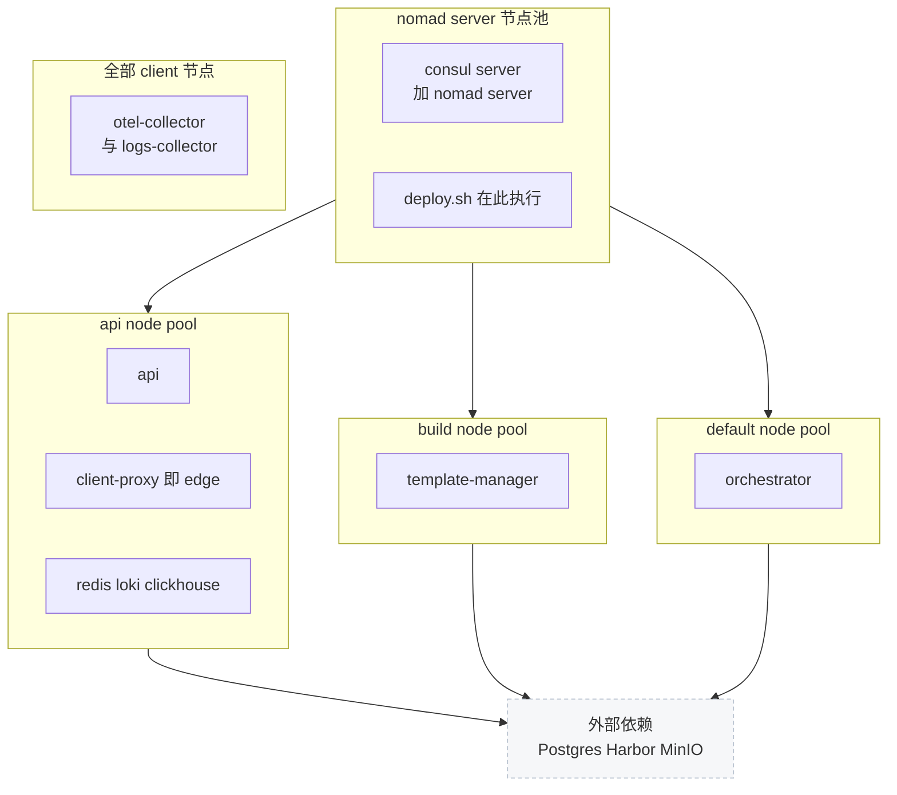
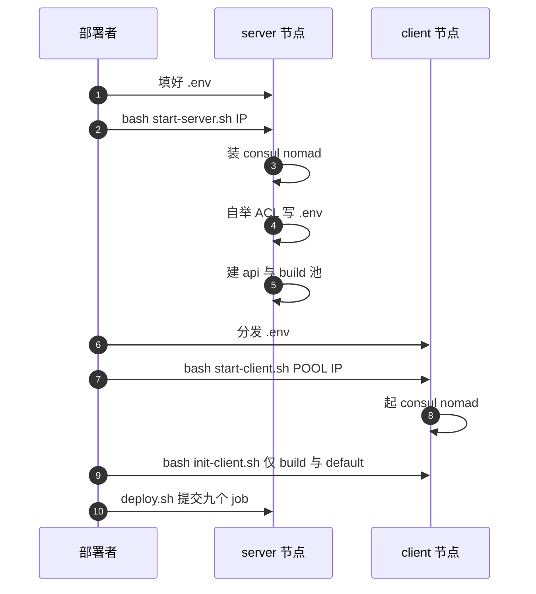

# 79 · 部署形态二：Nomad 多节点

> 上游用 Terraform 在 GCP 上造机器、造网络、再投递 Nomad job。ARM 适配版保留了 Nomad 与 Consul
> 这一层，把它下面的整个云资源层拿掉：机器由部署者自备，镜像来自 Harbor，产物存进 MinIO，
> job 由一个 shell 脚本用 `envsubst` 渲染后提交。本篇讲这一层怎么被重写，代价是什么。
>
> **读者**：系统工程师、部署工程师。
> **预备**：[第 09 篇 §2](09-nomad-consul-terraform.md#2-nomad-的模型)、
> [第 63 篇 §6](63-gcp-terraform.md#6-磁盘镜像与节点启动脚本)、[第 64 篇 §1](64-nomad-jobs.md#1-jobspec-是怎么被投递的)。
> **代码**：`iac/provider-gcp/nomad/jobs/deploy.sh`、`iac/provider-gcp/nomad/jobs/env.template`、
> `iac/provider-gcp/nomad/jobs/*.hcl`、`iac/provider-gcp/nomad-cluster/scripts/`、
> `iac/provider-gcp/nomad-cluster-disk-image/setup/`、`.github/actions/host-init/init-client.sh`、
> `e2b-infra.spec`、`e2b-infra/README.md`、`e2b-infra/docs/zh/`

---

## 0. 本篇要回答的问题

1. 四类节点各跑什么？为什么最少要四个节点，而不是三个或五个？
2. 上游那套「Terraform 渲染 + `nomad_job` 投递」被替换成了什么？替换后哪些能力消失了？
3. 上游对 GCP 的依赖具体有几处，每一处被什么顶替？
4. 为什么这套部署里没有 docker-reverse-proxy，模板镜像是怎么走通的？
5. 名为 edge 的 job 到底跑的是什么？
6. 这一形态与单机离线版（第 80 篇）是什么关系？

---

## 1. 上游的部署链条断在哪里

[第 63 篇 §6](63-gcp-terraform.md#6-磁盘镜像与节点启动脚本)描述的链条是：Terraform 建 VPC、负载均衡、五类托管实例组，
Packer 造一张预装了 Consul、Nomad、supervisor、gruntwork bash-commons、gcsfuse 的磁盘镜像；
实例开机跑 `start-client.sh`，从 GCE 元数据服务读自己的名字、IP、zone 与自定义元数据，
用 `gsutil` 把 `run-consul.sh` / `run-nomad.sh` 拉下来，用 `provider=gce` 的标签发现同伴组成 Consul 集群，
用 gcsfuse 把三个公共桶挂成 `/fc-envd`、`/fc-kernels`、`/fc-versions`。
之后 Terraform 的 `nomad_job` 资源把 `templatefile` 渲染好的 jobspec 推给 Nomad
（[第 64 篇 §1](64-nomad-jobs.md#1-jobspec-是怎么被投递的)）。

把这套东西搬到一个私有机房，链条上有七个环节同时失效：

- 没有 GCE 元数据服务，脚本问不到自己是谁；
- 没有 `provider=gce` 的标签发现，Consul 组不成集群；
- 没有 GCS，脚本、二进制、内核、Firecracker 都无处可取；
- 没有 Artifact Registry，模板镜像无处可推；
- 没有 Packer 流水线，磁盘镜像里的预装工具全部落空；
- 宿主是 openEuler，`apt-get` 与 supervisor 都不在；
- 下载 URL 硬编码 `linux_amd64`，鲲鹏机器装不上 Consul 与 Nomad。

值得注意的是**没有失效的那一部分**：Nomad 的调度模型、Consul 的服务注册与 DNS、
jobspec 里的静态端口约定、node pool 的划分，这些都不依赖云。
ARM 适配版的选择因此很清楚：**保留 Nomad 与 Consul，砍掉它们下面的一切。**
补丁对 `iac/` 的改动共 20 个文件、2227 行新增，其中**没有一个 `.tf` 文件** ——
Terraform 不是被改写，而是被整体绕过。

## 2. 四类节点与它们跑什么

`README.md` 的前提里写着「至少 4 个节点，作为 4 个集群」。这四类不是随意划分的，
它们精确对应 Nomad 的一个 server 集合加三个 node pool。

`api` 与 `build` 两个 node pool 不是 Nomad 自带的，它们由 `run-nomad.sh` 的
`create_node_pools()` 在 server 自举时用 `nomad node pool apply` 创建；
`default` 是 Nomad 的内置池，client 不指定 `--node-pool-name` 时就落在这里。
`all` 也是内置池，`otel-collector` 与 `logs-collector` 两个 `system` job 用它覆盖全部 client 节点。

各 job 的归属直接写在 jobspec 的 `node_pool` 字段里：

| job | 类型 | node pool | 驱动 | 来源 |
|---|---|---|---|---|
| `api` | service | `${API_NODE_POOL}` | docker | 上游同名文件改写 |
| `client-proxy`（文件名 `edge.hcl`） | service | `${API_NODE_POOL}` | docker | 上游 `job-client-proxy` 模块 |
| `redis` | service | `${API_NODE_POOL}` | docker | 上游同名文件改写 |
| `loki` | service | `${API_NODE_POOL}` | docker | 上游 `job-loki` 模块 |
| `clickhouse` | service | `${CLICKHOUSE_NODE_POOL}` | docker | 上游 `job-clickhouse` 模块 |
| `template-manager` | service | `${BUILD_NODE_POOL}` | raw_exec | 上游同名文件改写 |
| `orchestrator` | system | 常量 `default` | raw_exec | 上游 `job-orchestrator` 模块 |
| `otel-collector` | system | 常量 `all` | docker | 上游 `job-otel-collector` 模块 |
| `logs-collector` | system | 常量 `all` | docker | 上游 `job-logs-collector` 模块 |

上游把这些 job 分散在 `iac/modules/job-*/jobs/` 的九个模块里，每个模块自带 Terraform 变量与配置文件；
ARM 适配版把它们**全部复制并压平**到 `iac/provider-gcp/nomad/jobs/` 一个目录下。
连带的后果是：上游用 `${loki_config}`、`${otel_collector_config}`、`${vector_config}`、
`${clickhouse_config}` 从 Terraform 侧注入的四份数据面配置，在 ARM 适配版里被**内联进了 hcl 的 heredoc**。
好处是一个目录自足，坏处是配置与调度混在一份文件里，改 Loki 的保留策略要动 jobspec。

`env.template` 默认把 `API_NODE_POOL`、`CLICKHOUSE_NODE_POOL` 都设为 `api`，`BUILD_NODE_POOL` 设为 `build`。
把三者填成同一个值，四类节点就能塌缩成一台机器 —— 这正是第 80 篇那条路径的起点。

RPM 把这些文件铺成一个扁平目录（`e2b-infra.spec` 的 `%install`）：
`iac/provider-gcp/nomad/jobs/*.hcl` 装到 `/opt/e2b-infra/nomad/`，
四个集群脚本、两个安装脚本、两个卸载脚本、`deploy.sh`、`env.template`、`init-client.sh`
一律平铺在 `/opt/e2b-infra/` 下，业务二进制进 `/opt/e2b-infra/bin/`。
`README.md` 里那些 `bash start-server.sh`、`bash deploy.sh` 之所以能不带路径地写，前提就是这个布局。

## 3. 渲染层：从 templatefile 换成 envsubst

`deploy.sh` 与 `env.template` 是 ARM 适配版新增的两个文件，它们合起来顶替了 Terraform 的渲染与投递。

`deploy.sh` 做五件事：

1. `source .env`，把全部变量导出到环境；
2. 进 `bin/`，对每个 `*.Dockerfile` 执行 `docker build` 并 `docker push` 到 `${REGISTRY_URL}`；
   再把 redis、vector、loki、otel、clickhouse 五个公网镜像 `pull` 下来重打标签推进 Harbor；
3. 对 `nomad/*.hcl` 逐个跑 `envsubst`，输出到 `rendered/`；
4. 按固定顺序 `nomad job run` 提交九个 job：redis、clickhouse、loki、otel-collector、
   logs-collector、orchestrator、template-manager、edge、api；
5. 跑 `bin/seed-db` 注入初始用户，等 ClickHouse 就绪后用 `goose` 跑 ClickHouse 迁移，
   最后用 `psql` 把 `tiers` 表的 `max_length_hours` 与 `concurrent_instances` 都改成 10000。

第 3 步的 `envsubst` 带了一个**显式变量白名单**，约一百个名字。
这不是可有可无的谨慎：jobspec 里存在大量 `$${node.unique.id}` 这样的 Nomad 运行时插值，
不给白名单的 `envsubst` 会把 `${node.unique.id}` 当成未定义的 shell 变量替换成空串。
白名单让未列出的 `${...}` 原样穿过，交给 Nomad 自己解释。

这条链路把「渲染」从 Terraform 的 `templatefile` 换成了 shell 的 `envsubst`，
两者的能力差是本节最重要的结论：**`templatefile` 有条件与循环，`envsubst` 只有替换**。
上游 jobspec 里所有 `%{ if ... }` / `%{ for ... }` 块因此必须在补丁里被就地消解：

| 上游的条件 / 循环块 | 作用 | ARM 适配版的处理 |
|---|---|---|
| `api.hcl` 的 `update` 段 | 金丝雀 + 自动回滚 | 整段删除 |
| `api.hcl` 的 `scheduling-block` 端口 40234 | api 与 loki 互斥调度 | 整段删除 |
| `loki.hcl` 的同一端口 | 同上 | 整段删除 |
| `template-manager.hcl` 的 `scaling` 段 | 按节点数自动伸缩 | 整段删除 |
| `template-manager.hcl` 的 `kill_timeout` 分支 | 70 分钟 vs 1 分钟 | 两条都删，退回默认 |
| `orchestrator.hcl` 的版本化 job 名与 `meta` constraint | 蓝绿升级 | job 名固定为 `orchestrator` |
| `orchestrator.hcl` 的 `provider == gcp/aws` 分支 | 选存储与镜像 provider | 改为读 `.env` 变量 |
| `clickhouse.hcl` 的 `for i in range(server_count)` | 多副本分组 | 写死单组 `server-1` |
| 各 job 的 `count = ${count}` / `memory_mb * 1.5` | 由 Terraform 算 | 常量或 `.env` 变量 |
| 各 job 的 `launch_darkly_api_key != ""` | 可选注入 | 整段删除 |

代价清单是清楚的。**没有滚动更新**：api 与 client-proxy 的 `update` 段没了，
`nomad job run` 就是直接替换。**没有蓝绿升级**：上游用
`meta.orchestrator_job_version` 把新版 orchestrator 钉在新节点上，
让升级表现为「换节点」而不是「替换运行中的沙箱」（[第 64 篇 §4](64-nomad-jobs.md#4-沙箱节点上的-orchestrator)）；
ARM 适配版的 orchestrator job 名固定，重新提交即就地替换。
**没有自动伸缩**：`nomad-autoscaler.hcl` 还在目录里，但补丁一个字节没动它，
`deploy.sh` 的 job 列表里也没有它，它的 Terraform 变量根本不会被 `envsubst` 替换。
`docker-reverse-proxy.hcl` 与 `clean-nfs-cache.hcl` 同理 —— 三份文件被 RPM 装到了
`/opt/e2b-infra/nomad/`，也会被渲染进 `rendered/`，但永远不会被提交。
`docs/zh/maintain.md` 的「升级软件：仅支持卸载重装」正是这一串删除的直接后果。

还有一处配套改动容易被忽略：`run-nomad.sh` 里 client 配置的 `max_kill_timeout = "24h"` 被删掉，
退回 Nomad 的 30 秒默认值。这与 `template-manager.hcl` 删掉 70 分钟 `kill_timeout` 是同一个决定的两面：
上游用长 kill 超时换「部署不打断正在进行的模板构建」，代价是单节点更新最长阻塞 70 分钟；
ARM 适配版反过来取了快速收敛，代价是重新提交 template-manager 会打断在跑的构建。

## 4. 去 GCP 化：一张对照表

补丁在 `iac/` 里做的事，可以完整地表述为「把每一处 GCP 能力换成一处自备能力」。

| 上游依赖的 GCP 能力 | 用在哪 | ARM 适配版的替代 |
|---|---|---|
| Terraform `nomad_job` 资源 | 投递 jobspec | `deploy.sh` 的 `envsubst` + `nomad job run` |
| GCE 实例元数据服务 | 取实例名、IP、zone、自定义元数据 | 命令行参数 `--instance-ip-address` + `hostname -s` |
| `retry_join` 的 `provider=gce` 标签发现 | Consul 组网 | `.env` 的 `SERVER_IPS` 显式列表，`jq` 转成 JSON 数组 |
| `gsutil cp gs://${SCRIPTS_BUCKET}/...` | 分发 `run-consul.sh` / `run-nomad.sh` | RPM 预先装到 `/opt/e2b-infra/` |
| Nomad `artifact` 段拉 GCS 二进制 | orchestrator、template-manager | `start-client.sh` 把 `bin/orchestrator` 复制到 `/usr/bin/` |
| gcsfuse 挂三个公共桶 | `/fc-envd`、`/fc-kernels`、`/fc-versions` | `init-client.sh` 从 `/opt/e2b-infra/bin/` 复制 |
| Artifact Registry + docker-reverse-proxy | 模板镜像的推与拉 | Harbor + `ARTIFACTS_REGISTRY_PROVIDER=Local` |
| GCS bucket（`STORAGE_PROVIDER=GCPBucket`） | 模板与快照产物 | MinIO（[第 75 篇 §6](75-minio-storage.md#6-三种部署形态各用哪个-provider)） |
| 本地 SSD 分区 + RAID + XFS 格式化 | `/orchestrator` 缓存盘 | 只 `mkdir`，文件系统由部署者自备 |
| systemd-resolved + GCE DNS 作 recursor | Consul DNS 分流 | `resolv.conf` 置 `127.0.0.1` + dnsmasq 的 `server=/consul/127.0.0.1#8600` |
| Packer 镜像预装 supervisor | Nomad 进程管理 | 新增 `nomad.service` systemd 单元 |
| Packer 镜像预装 gruntwork bash-commons | `log_info` / `assert_not_empty` 等 | 在 `install-consul.sh` 里内联实现 |
| `apt-get`（Ubuntu 假设） | 装 curl、unzip、jq、docker | 加 `has_yum` 分支 |
| `linux_amd64` 下载 URL | Consul、Nomad 二进制 | `uname -m` 分支出 `arm64` |
| Cloudflare + GCP 负载均衡 | 外部入口与 TLS | 无，直接暴露静态端口 |

有一处**没有**被去掉：`install-consul.sh` 与 `install-nomad.sh` 仍然从
`releases.hashicorp.com` 下载对应架构的 zip。`install-consul.sh` 保留了 `--download-url` 参数，
可以指向本地文件，但 `start-server.sh` / `start-client.sh` 传的是 `--version`。
也就是说**多节点形态本身不是离线的**：装机时仍需要能访问 HashiCorp 的发布站或一个本地镜像源。
完全离线是第 80 篇那条路径额外做的事。

同样值得记一笔的是 `run-nomad.sh` 里 `raw_exec` 插件的 `no_cgroups = true` 被删除。
上游让 raw_exec 任务不受 Nomad 的 cgroup 管辖；ARM 适配版删掉这行之后，
orchestrator 与 template-manager 会被放进 Nomad 分配的 cgroup 里。
推论：这会让 orchestrator 派生的 Firecracker 进程与它自己共享一个 cgroup 上限，
与 orchestrator 自己的 cgroup 管理（[第 38 篇 §7](38-cgroups-and-host-stats.md#7-nomad-与-no_cgroups)、
[第 73 篇 §2](73-cgroup-and-host-compat.md#2-cgroup关闭宿主侧记账)）叠加，边界需要实测确认。

## 5. 集群自举的四个脚本

`README.md` 的八个步骤，落到代码上是四个脚本的调用顺序。

**`start-server.sh`** 只剩三十来行：读同目录的 `.env`，装 Consul 与 Nomad，以 server 模式起两者。
上游那版靠 `gsutil` 取脚本、靠 Terraform 注入 `CLUSTER_TAG_NAME` 与 gossip 密钥，这些都没了。ACL 的自举在两个 `run-*.sh` 里：
`run-consul.sh` 执行 `consul acl bootstrap` 拿到 root token，
`run-nomad.sh` 执行 `nomad acl bootstrap` 拿到 bootstrap token，
两者都用 `sed` 把结果写回同目录的 `.env`（`export CONSUL_ACL_TOKEN=` / `export NOMAD_ACL_TOKEN=`）。
这解释了 `README.md` 第 4 步与第 5 步之间那句「将 .env 文件分发到各个 client 节点」——
分发的是**已经含有令牌的** `.env`，令牌的传递方式就是复制这个文件。
`docs/zh/security.md` 把这一点写成了「Token 在 `start-server.sh` 执行时自动生成并写入 `.env`」。

上游的 Consul ACL 处理比这复杂：它建 `dns-request-policy` 与 `register-service-policy`
两个策略，再用 `-secret` 指定一个预生成的 client token。ARM 适配版把这一整套换成了
「client 直接用 root token」——`run-consul.sh` 在 `client == true` 时把 `agent_token`
设成 `${CONSUL_ACL_TOKEN}`，并把 `default_policy` 从 `deny` 放宽成 `allow`
（只在检测到一次性的 ACL 切换标记文件后才转回 `deny`）。
代价是集群内没有最小权限边界：任何拿到 `.env` 的节点即拥有 Consul 的完全控制权。

**`start-client.sh`** 是补丁里改动最大的脚本，从 384 行缩到 202 行，diff 里绝大部分是删除。
上游那段本地 SSD 分区、`mdadm` 组 RAID、`mkfs.xfs`、写 `/etc/fstab`、gcsfuse 挂三个桶、
`gsutil` 拉脚本、写 GCP docker 凭据、配 systemd-resolved、向 Nomad API 轮询
`latest_orchestrator_job_id` 的逻辑全部消失。留下来的是：

- 把 `bin/orchestrator` 复制成 `/usr/bin/orchestrator` **和** `/usr/bin/template-manager`；
- 建 `/orchestrator/{sandbox,template,build}` 目录（不再负责底下是什么文件系统）；
- 幂等地创建 100 GiB swapfile，设 `vm.swappiness=10`；
- 建 `/mnt/snapshot-cache` 的 tmpfs；
- 按内存总量算大页数量，`base_hugepages_percentage` 从 Terraform 变量写死成 20；
- 装 Consul 与 Nomad，配 dnsmasq 把 `.consul` 指向本机 8600，起两个 agent。

第一条值得单独说：**orchestrator 与 template-manager 是同一个二进制**。
`packages/orchestrator/internal/cfg/model.go` 有一项
`Services []string \`env:"ORCHESTRATOR_SERVICES" envDefault:"orchestrator"\``，
`orchestrator.hcl` 传 `orchestrator`，`template-manager.hcl` 传 `template-manager`，
同一个可执行文件按这个变量决定启用哪一组服务
（[第 46 篇 §1](46-template-manager-service.md#1-一个二进制两个角色)）。
上游用两个 GCS artifact 分别下载两个名字的产物，ARM 适配版用一次 `cp` 造出两个名字。

**`init-client.sh`** 来自 `.github/actions/host-init/`，不在 `iac/` 下，
但 RPM 把它装到 `/opt/e2b-infra/init-client.sh`，是 `README.md` 第 6 步执行的那个。
它负责宿主能力：NBD 的 udev `nowatch` 规则、`modprobe nbd nbds_max=4096`、
`hugetlbfs` 挂载与大页预留、`net.core.somaxconn` 等 sysctl。
补丁对它做了三类改动：`gsutil` 拉内核与 Firecracker 换成从 `/opt/e2b-infra/bin/` 复制
（两个内核分别落到 `/fc-kernels/vmlinux-6.1.158/` 与 `/fc-kernels/vmlinux-6.6.0-132.0.0/`）；
envd 的来源从构建目录换成 `./bin/envd`；大页写入路径从 `/proc/sys/vm/nr_hugepages`
换成 `/sys/kernel/mm/hugepages/hugepages-2048kB/nr_hugepages`
—— 后者在页大小可变的 aarch64 上才是明确的（[第 82 篇 §4](82-host-kernel-nbd-hugepages.md#4-大页预留算法与-aarch64-上的一个假设)）。

只有 build 与 default 两类节点需要 `init-client.sh`：api 节点只跑 docker 容器，
不建沙箱，不需要 NBD、大页与内核文件。

## 6. 镜像与产物：Harbor 顶两条路

上游有两条完全不同的镜像路径。一条是**服务镜像**：api、db-migrator、client-proxy
等由 CI 推到 Artifact Registry，jobspec 里写完整镜像地址（[第 65 篇 §5](65-build-and-release.md#5-从对象存储到运行进程)）。
另一条是**模板镜像**：用户的 Dockerfile 构建产物，由 CLI 推到 `docker.<domain>`，
经 docker-reverse-proxy 换取 Artifact Registry 的令牌后落库
（[第 57 篇 §4](57-docker-reverse-proxy.md#4-换-tokengettoken)）。

ARM 适配版让 Harbor 同时顶掉这两条。

第一条直接替换：所有 jobspec 的 `image` 都改写成 `${REGISTRY_URL}/<name>`，
`deploy.sh` 负责在部署前把本地构建的服务镜像与五个第三方镜像推进去。
每个 docker 任务同时加了 `auth_soft_fail = true`，即拉取时的鉴权失败不阻塞任务
——`.hcl` 里对这行的注释写着「合入时需删除」，说明它是为免密仓库准备的临时开关，
在启用了访问控制的 Harbor 上会掩盖凭据问题。

第二条是绕过而不是替换。`template-manager.hcl` 里
`GCP_DOCKER_REPOSITORY_NAME = "${HARBOR_HOST}"`，同时硬编码
`ARTIFACTS_REGISTRY_PROVIDER = "Local"`。这个 provider 是上游本来就有的
（`packages/shared/pkg/artifacts-registry/registry_local.go`，
`registry.go` 里的常量 `LocalStorageProvider = "Local"`），只是上游只在本地开发时用它。
它的 `GetTag()` 返回 `templateId:buildId`，`GetImage()` 用
`go-containerregistry` 的 `daemon.Image()` 从**本机 docker daemon** 取镜像，
`Delete()` 直接返回 nil。也就是说构建节点上的镜像流转全部走本机 docker：
用户的 `from_dockerfile('FROM harbor:443/e2b-orchestration/ubuntu:22.04-custom')`
由 docker 直接从 Harbor 拉基础镜像，构建产物留在本机 daemon 里供 template-manager 读取，
中间没有 docker-reverse-proxy 这一跳。这也是为什么 `deploy.sh` 的 job 列表里没有它。

代价有三处：镜像清理变成手工（`Delete()` 是空实现）；
构建产物只存在于构建节点的本机 daemon，多个 build 节点之间不共享；
`env.template` 里 `HARBOR_USERNAME` / `HARBOR_PASSWORD` / `DOCKER_REVERSE_PROXY_*`
一整组变量因此成了无人读取的残留。

至于沙箱产物（memfile、rootfs、header、构建缓存层），走的是另一条线：
`STORAGE_PROVIDER=MinioBucket`，加 `MINIO_ENDPOINT` / `MINIO_ACCESS_KEY` / `MINIO_SECRET_KEY`
三个变量，注入 orchestrator 与 template-manager 两个 job
（[第 75 篇 §5](75-minio-storage.md#5-把默认-provider-改成-minio)）。

## 7. 名为 edge 的 job

`iac/provider-gcp/nomad/jobs/edge.hcl` 是从上游
`iac/modules/job-client-proxy/jobs/client-proxy.hcl` 逐行改来的：
job 名仍是 `client-proxy`，镜像是 `${REGISTRY_URL}/${CLIENT_PROXY_DOCKER_IMAGE}`，
端口只有 `proxy`（3002）与 `health`（3003）。差异只有换变量、删 `update` 段、
删 LaunchDarkly 分支、加 `dns_servers = ["127.0.0.1"]` 与 `auth_soft_fail`。

也就是说，**这套部署里没有 edge API 服务端**。`env.template` 里的
`EDGE_API_PORT=3001`、`EDGE_API_PORT_NAME`、`LOCAL_CLUSTER_ENDPOINT=localhost:3001`
都没有对应的监听进程 —— `packages/client-proxy/internal/cfg/model.go` 里
这个进程只读六个变量：`HEALTH_PORT`、`PROXY_PORT`、`REDIS_URL`、`REDIS_CLUSTER_URL`、
`REDIS_TLS_CA_BASE64`、`API_GRPC_ADDRESS`。
完整的分析见[第 56 篇 §6](56-edge-api.md#6-arm-适配版的差异)，
这里只强调部署侧的结论：**edge 这个名字在 Nomad 形态里只是文件名**，
跑起来是一份沙箱流量代理，api 与 orchestrator 之间的发现仍走 Nomad 与 Consul
（[第 21 篇 §4](21-clusters-and-discovery.md#4-三种发现来源)）。

`edge.hcl` 里还留着一处渲染残留：`REDIS_TLS_CA_BASE64 = "${redis_tls_ca_base64}"`
用的是上游的小写变量名，而 `deploy.sh` 的 `envsubst` 白名单里没有这个名字。
推论：渲染后这个环境变量的值会是字面量 `${redis_tls_ca_base64}`。
由于同一份 jobspec 里 Redis 走明文连接、`REDIS_CLUSTER_URL` 被写成空串，
这个值当前不影响连接建立。

`otel-collector.hcl` 有一处相似的不一致：它写的是 `NODE_NAME = "${node.unique.name}"`，
单个 `$`；同目录的 api、edge、orchestrator、template-manager 四份都写 `$${node.unique.id}`。
推论：`${node.unique.name}` 不是合法的 shell 变量名，`envsubst` 会原样放行，
而 Nomad 的 HCL2 解析会把它当成表达式求值。这一处需要在真实提交时验证。

## 8. 与相邻两种形态的关系

**与上游（第 63、64 篇）**：同一套 jobspec，同一批二进制，同一组静态端口。
差别集中在两层 —— 谁来造机器（Terraform vs 部署者），谁来渲染并投递 jobspec
（`nomad_job` vs `deploy.sh`）。第 64 篇总结的那些机制里，
静态端口约定、Consul 与 Nomad 两套服务注册并存、`TEMPLATE_BUCKET_NAME = "skip"` 这处残留，
在 ARM 适配版里原样保留；而蓝绿升级、自动伸缩、滚动更新、`scheduling-block` 反亲和四项被删除。

**与 Helm 形态（第 78 篇）**：两者共用一份 `.env` 与同一个 `deploy.sh`
——`deploy.sh --type k8s` 走 `envsubst` 渲染 `helm/values.yaml` 再 `helm install`，
不带参数走 Nomad 路径。这是同一个脚本的两个分支，不是两套部署系统。
概念上的逐项对照（job 对 Deployment、node pool 对节点标签、`raw_exec` 对特权容器）
写在[第 78 篇 §5](78-helm-k8s-deployment.md#5-与-nomad-形态的概念对照)，本篇不重复。
一个可以并置观察的现象是：两条路径都缺 docker-reverse-proxy、都没有自动伸缩、
都把密钥明文写进部署产物，这些不是某一条路径的疏漏，而是 `.env` 这层设计的共同结果。

**与单机离线版（第 80 篇）**：单机版是本形态的收缩，而不是另一套东西。
`e2b-deploy/dep/deploy.sh` 是 `iac` 版 `deploy.sh` 的后代，
两者的 `envsubst` 白名单与渲染逻辑几乎逐字相同；差别是单机版把 job 列表
从九个砍到四个（redis、template-manager、edge、api），
注释掉了 vector、loki、otel、clickhouse 四个第三方镜像的拉取，
并加了一个 `--only <job>` 参数用于改完 `.env` 后单独重跑一个 job。
`e2b-deploy/dep/` 下还有一份 `start-client.sh`、`run-consul.sh`、`run-nomad.sh`
的平行副本，由 `build.sh` 而不是 RPM 的 `%install` 铺开。
换句话说：**先有多节点形态，单机形态是把 `API_NODE_POOL`、`BUILD_NODE_POOL`
都填成同一台机器，再把观测栈摘掉的结果。**

## 9. 遗留与代价

把前面几节的代价集中列一遍，便于对照[第 86 篇 §4](86-known-issues-and-debt.md#4-可运维性类)。

- **升级路径只有卸载重装。** `docs/zh/maintain.md` 明写这一条，
  它是删掉 `update`、`scaling`、版本化 job 名三段的直接后果。
- **密钥全程明文。** `.env` 含 Postgres 连接串、Harbor 口令、MinIO 密钥、
  Consul 与 Nomad 的 root token，靠人工复制分发到每个节点，jobspec 里也是明文内联。
- **`env.template` 含相当比例的无效项。** 除 `HARBOR_USERNAME` 等一组之外，
  `EDGE_API_PORT`、`LOCAL_CLUSTER_ENDPOINT`、`DNS_PORT`、`GRAFANA_*`、
  `SUPABASE_JWT_SECRETS`、`POSTHOG_API_KEY` 在当前部署下都不被读取或被赋空值。
- **`init-client.sh` 依赖一个 `env.template` 里没有的变量。**
  它用 `${FIRECRACKER_VERSION}` 构造 `/fc-versions/v<版本>/firecracker` 的路径，
  但脚本本身不 `source .env`，而 `env.template` 里也没有这一项
  （`docs/zh/install.md` 的示例 `.env` 里有 `FIRECRACKER_VERSION=1.13.1`）。
  推论：直接执行 `bash init-client.sh` 会把 Firecracker 装到 `/fc-versions/v/` 下，
  与 orchestrator 期望的版本目录对不上。
- **文档与 README 的 SDK 版本口径不一致。** `README.md` 写
  `e2b-2.20.0` + `e2b_code_interpreter-2.4.1`，`docs/zh/install.md` 写 `e2b-2.15.3`。
  配套关系见[第 83 篇 §3](83-sdk-adaptation.md#3-两条并行的改法与配置项)。
- **`auth_soft_fail = true` 带着「合入时需删除」的注释进了每一个 docker 任务。**
- **单点。** ClickHouse 写死单组、Loki 单副本、Redis 单实例且无持久化，
  三者都落在 api node pool 上；`NUM_SERVERS=1` 的默认值意味着 Nomad server 也是单点。

这些当中，前两条是形态本身的设计取舍，后几条更接近未清理的残留。
区分二者对读者有用：设计取舍要在选型时接受，残留可以在自己的部署里修掉。

## 10. 小结

- ARM 适配版对 `iac/` 的改动不含任何 `.tf` 文件：Terraform 与它下面的 GCP 资源层被整体绕过，
  Nomad 与 Consul 这一层原样保留。
- 「四个集群」精确对应一组 Nomad server 加三个 node pool：`api`、`build` 由
  `run-nomad.sh` 的 `create_node_pools()` 创建，`default` 是内置池；
  另有内置池 `all` 承载两个 `system` 类型的观测 job。
- 上游分散在九个 `iac/modules/job-*` 模块里的 jobspec 被压平到一个目录，
  四份数据面配置从 Terraform 变量内联进了 hcl 的 heredoc。
- 渲染从 `templatefile` 换成 `envsubst`，能力从「条件 + 循环 + 计算」降为「替换」；
  所有 `%{ if }` 块因此被就地消解，代价是失去滚动更新、蓝绿升级、自动伸缩与
  api/loki 的反亲和。`max_kill_timeout` 退回 30 秒是同一决定的另一面。
- `envsubst` 必须带显式变量白名单，否则 jobspec 里的 Nomad 运行时插值会被吃掉；
  `edge.hcl` 的 `redis_tls_ca_base64` 与 `otel-collector.hcl` 的单 `$` 写法是这条规则的两处例外。
- 表中十五处 GCP 依赖被逐一顶替；唯一保留的外网依赖是 Consul 与 Nomad 二进制的下载，
  因此多节点形态本身并不离线。
- Consul 的 ACL 从「两个策略 + 专用 client token」简化为「client 直接用 root token，
  默认策略 allow」；令牌由 `run-*.sh` 回写 `.env`，分发方式就是复制这个文件。
- orchestrator 与 template-manager 是同一个二进制，`start-client.sh` 用一次 `cp`
  造出两个名字，`ORCHESTRATOR_SERVICES` 决定启用哪组服务。
- Harbor 顶掉了上游的两条镜像路径：服务镜像直接改 `image` 地址，
  模板镜像改走 `ARTIFACTS_REGISTRY_PROVIDER=Local`（本机 docker daemon），
  docker-reverse-proxy 因此不被部署。
- 名为 `edge.hcl` 的 job 名是 `client-proxy`，只提供沙箱流量代理与健康检查；
  3001 端口在这套部署里没有监听者。
- 单机离线版是本形态的收缩：同一个 `deploy.sh` 的后代，job 列表从九个减到四个，
  三个 node pool 填成同一台机器。

## 延伸阅读 / 下一篇

- [第 80 篇 §6](80-single-node-rpm.md#6-buildsh--s从空机器到可用集群)：把本篇的四类节点压到一台机器上，
  并补齐真正的离线安装。
- [第 78 篇 §1](78-helm-k8s-deployment.md#1-这不是一份通用-chart)：同一份 `.env` 的另一个分支。
- [第 63 篇 §3](63-gcp-terraform.md#3-节点池五类机器)、[第 64 篇 §7](64-nomad-jobs.md#7-job--节点池--端口)：
  本篇改写的对象。
- [第 09 篇 §4](09-nomad-consul-terraform.md#4-consul-在-e2b-里做什么)：node pool、
  `system` job、Consul DNS 这些概念的出处。
- [第 75 篇 §2](75-minio-storage.md#2-接口与逐方法对照)、
  [第 76 篇 §5](76-k8s-discovery.md#5-选择逻辑与客户端注入)：本篇注入的两组环境变量背后的代码。
- [第 81 篇 §5](81-single-node-traffic.md#5-三类流量的完整链路)：dnsmasq、iptables、nginx 那一段的完整链路。
- [第 82 篇 §5](82-host-kernel-nbd-hugepages.md#5-sysctl-与-ulimit配了什么没配什么)：`init-client.sh` 每一步的原理。
